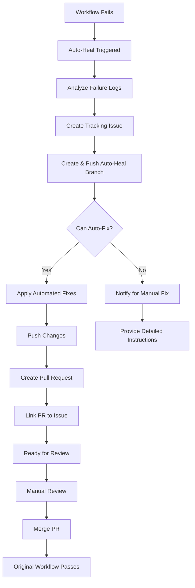

# 🔧 GitHub Actions Auto-Healing System

## Overview

The Auto-Healing System is an automated workflow failure detection and remediation system that **automatically diagnoses and fixes** common GitHub Actions workflow failures. It can apply automated fixes for many common issues and create pull requests without manual intervention.

## 🎯 Features

- **Automatic Failure Detection**: Monitors all GitHub Actions workflows for failures
- **Intelligent Analysis**: Analyzes failure logs to identify root causes with high confidence
- **Automated Fixes**: Automatically fixes common issues (dependencies, timeouts, syntax, permissions)
- **Issue Tracking**: Creates tracking issues for every failure
- **Automatic Pull Request Generation**: Creates PRs with automated fixes when possible
- **Manual Intervention Support**: Provides detailed guidance when automatic fixes aren't possible
- **Comprehensive Logging**: Maintains detailed logs and reports for audit
- **Configurable Behavior**: Extensive configuration options for customization

## 🚀 How It Works



## 📋 Workflow Lifecycle

### 1. Failure Detection

When any GitHub Actions workflow fails:
- The `workflow_run` event triggers the auto-heal workflow
- Only workflows with `conclusion: failure` are processed

### 2. Failure Analysis

The system:
- Fetches workflow run details via GitHub API
- Identifies all failed jobs and steps
- Extracts relevant error logs
- Creates a structured analysis JSON file
- Categorizes the failure type with confidence score

### 3. Issue Creation

A tracking issue is automatically created with:
- Workflow name and run ID
- Failed job details
- Error logs and context
- Links to the failed run
- Auto-heal label for tracking
- Detailed analysis and root cause

### 4. Automated Fix Application

The system attempts to automatically fix common issues:

**Dependency Issues** (95% confidence)
- Detects missing Python/Node modules
- Adds them to requirements.txt or package.json
- Commits and pushes the fix

**Timeout Issues** (90% confidence)
- Identifies timeout failures
- Increases timeout values appropriately
- Updates workflow files

**Syntax Issues** (85% confidence)
- Detects YAML syntax errors
- Fixes common formatting issues
- Cleans up trailing whitespace

**Permission Issues** (85% confidence)
- Identifies permission errors
- Adds necessary permission blocks
- Updates workflow configuration

**Docker Issues** (80% confidence)
- Detects Dockerfile syntax errors
- Fixes common Docker build issues
- Updates Docker configuration

### 5. Pull Request Creation

If automated fixes were applied, the system:
- Commits the changes to the auto-heal branch
- Pushes the branch to remote
- Creates a pull request automatically
- Links the PR to the tracking issue
- Applies appropriate labels
- Provides detailed fix summary

### 6. Manual Intervention (if needed)

If automatic fixes aren't possible:
- Posts detailed instructions to the issue
- Provides the prepared branch for manual fixes
- Includes complete analysis and suggestions
- Optionally notifies GitHub Copilot Workspace for assistance

### 7. Pull Request Review

The PR (whether automated or manual):
- Contains the proposed fixes
- Contains the proposed fixes
- Links to the tracking issue
- Includes detailed explanation of changes
- Runs CI/CD tests to validate the fix

### 8. Review and Merge

The PR is:
- Reviewed by human developers
- Tested automatically via CI/CD
- Merged if tests pass and changes are approved
- Closes the tracking issue when merged

## 🔧 Setup Instructions

### Prerequisites

1. **GitHub Repository Settings**
   - Enable GitHub Actions
   - GitHub Copilot (optional - only needed for manual intervention support)
   - Set up branch protection rules (recommended)

2. **Required Permissions**
   - The workflow needs these permissions:
     ```yaml
     permissions:
       contents: write
       pull-requests: write
       issues: write
       actions: read
     ```

### Installation

1. **Add the Auto-Heal Workflow**
   
   The auto-heal workflow is located at:
   ```
   .github/workflows/auto-heal-failures.yml
   ```

2. **Configure Settings**
   
   Edit `.github/auto-heal-config.yml` to customize:
   - Which workflows to monitor
   - Notification preferences
   - Copilot settings
   - Branch naming conventions
   - PR templates

3. **Set Up GitHub Secrets** (Optional)
   
   If using custom GitHub tokens:
   ```bash
   # Add to repository secrets
   GITHUB_TOKEN: <your-token>  # Default token usually works
   ```

4. **Test the System**
   
   Create a test workflow that intentionally fails:
   ```yaml
   name: Test Auto-Heal
   on: [workflow_dispatch]
   jobs:
     test-fail:
       runs-on: ubuntu-latest
       steps:
         - run: exit 1  # Intentional failure
   ```
   
   Run it manually and watch the auto-heal system activate!

## ⚙️ Configuration

### Basic Configuration

Edit `.github/auto-heal-config.yml`:

```yaml
# Enable/disable globally
enabled: true

# Monitor specific workflows
monitored_workflows:
  - "*"  # All workflows

# Exclude specific workflows
excluded_workflows:
  - "Auto-Heal Workflow Failures"
  
# Maximum healing attempts per day (0 = unlimited)
max_heal_attempts_per_day: 0  # Unlimited attempts
```

### Advanced Configuration

#### Copilot Settings

```yaml
copilot:
  enabled: true
  model: "gpt-4"
  temperature: 0.2  # Conservative fixes
  include_context:
    - "README.md"
    - "requirements.txt"
```

#### Failure Pattern Recognition

```yaml
failure_patterns:
  - pattern: "no space left on device"
    suggestion: "Add disk cleanup step"
  
  - pattern: "timeout"
    suggestion: "Increase timeout value"
```

#### Security Settings

```yaml
security:
  trusted_branches:
    - "main"
    - "develop"
  require_code_review: true
  run_security_scans: true
  max_file_changes: 20
```

## 📊 Monitoring and Analytics

### View Auto-Heal Activity

1. **Issues Tab**
   - Filter by label: `auto-heal`
   - See all detected failures

2. **Pull Requests**
   - Filter by label: `automated-fix`
   - Review proposed fixes

3. **Actions Tab**
   - View "Auto-Heal Workflow Failures" runs
   - Check analysis artifacts

### Artifacts

Each auto-heal run creates artifacts containing:
- `failure_analysis.json` - Structured failure data
- `failure_report.md` - Human-readable report
- `healing_context.json` - Workflow context
- `detailed_analysis.json` - Advanced failure categorization
- `auto_fix_summary.json` - Summary of automated fixes applied
- `copilot_healing_prompt.md` - Instructions for manual fixes

Download artifacts from the Actions tab.

## 🤖 Automated Fix Capabilities

The auto-healing system can automatically fix the following types of issues:

### 1. Dependency Issues (95% Confidence)

**Detects:**
- `ModuleNotFoundError: No module named 'xyz'`
- `ImportError: cannot import name 'xyz'`
- `Error: Cannot find module 'xyz'` (Node.js)

**Fixes:**
- Extracts the missing module name from error logs
- Adds the module to `requirements.txt` (Python) or `package.json` (Node.js)
- Commits and pushes the change
- Creates a PR automatically

### 2. Timeout Issues (90% Confidence)

**Detects:**
- Workflow timeout errors
- Job execution time exceeded
- Step timeout failures

**Fixes:**
- Identifies the workflow file
- Doubles the current timeout value (up to 6 hours max)
- Updates the workflow YAML file
- Creates a PR with the change

### 3. Permission Issues (85% Confidence)

**Detects:**
- Permission denied errors
- 403 Forbidden responses
- Missing workflow permissions

**Fixes:**
- Adds appropriate `permissions:` block to workflow
- Includes standard permissions (contents, issues, pull-requests)
- Updates the workflow file
- Creates a PR

### 4. YAML Syntax Issues (85% Confidence)

**Detects:**
- YAML syntax errors in workflow files
- Indentation issues
- Trailing whitespace problems

**Fixes:**
- Removes trailing whitespace
- Basic formatting corrections
- Updates affected YAML files
- Creates a PR

### 5. Coming Soon

Additional automated fixes planned:
- Docker build failures (basic syntax issues)
- Resource constraint issues (disk space, memory)
- Network timeout issues (add retry logic)
- Environment variable issues

## 🎓 Usage Examples

### Example 1: Dependency Issue (Automated Fix)

**Failure**: Missing Python package

**Auto-Heal Action**:
1. Detects "ModuleNotFoundError: No module named 'requests'"
2. Creates tracking issue #42
3. **Automatically** adds `requests` to requirements.txt
4. Commits and pushes the fix to auto-heal branch
5. **Automatically** creates PR #43 with the fix
6. PR links to issue #42
7. Ready for review and testing

**Result**: ✅ Fully automated - no manual intervention needed

### Example 2: Timeout Issue (Automated Fix)

**Failure**: Workflow step timeout

**Auto-Heal Action**:
1. Detects "The job running on runner Hosted Agent has exceeded the maximum execution time"
2. Creates tracking issue #44
3. **Automatically** increases timeout from 30m to 60m in workflow file
4. Commits and pushes the fix
5. **Automatically** creates PR #45 with the fix
6. Ready for review and testing

**Result**: ✅ Fully automated - no manual intervention needed

### Example 3: Complex Issue (Manual Intervention)

**Failure**: Test failure due to logic error

**Auto-Heal Action**:
1. Detects test assertion failure
2. Creates tracking issue #46
3. Analyzes the failure and provides detailed root cause
4. Creates and pushes auto-heal branch
5. Posts detailed instructions for manual fix
6. Optionally notifies for Copilot Workspace assistance

**Result**: ⚠️ Manual intervention required - detailed guidance provided

## 🔒 Security Considerations

### What Gets Auto-Healed Automatically

✅ **Automatically Fixed** (High confidence, low risk):
- **Dependency Issues**: Missing packages added to requirements.txt
- **Timeout Issues**: Timeout values increased appropriately
- **YAML Syntax**: Basic formatting and whitespace issues
- **Permission Issues**: Missing permission blocks added to workflows
- **Minor Configuration**: Simple config file updates

### What Requires Manual Review

⚠️ **Manual Intervention Required** (Complex or risky changes):
- **Test Failures**: Logic errors in application code
- **Security Vulnerabilities**: Authentication or credential issues
- **Docker Issues**: Complex Dockerfile changes
- **Build Failures**: Compilation errors requiring code changes
- **Architecture Changes**: Major structural modifications

### Automated Fix Safety Features

1. **Minimal Changes**: Only makes the smallest necessary changes
2. **Branch Isolation**: All fixes on separate auto-heal branches
3. **No Direct Merge**: All PRs require manual review before merge
4. **Detailed Logging**: Complete audit trail of all changes
5. **Rollback Friendly**: Easy to revert if issues arise

### Security Best Practices

1. **Always review auto-heal PRs** before merging - automated doesn't mean unreviewed
2. **Set up branch protection** to require reviews and passing tests
3. **Enable security scans** in configuration
4. **Limit to trusted branches** only (main, develop, etc.)
5. **Set reasonable file change limits** to prevent excessive modifications
6. **Monitor auto-heal activity** regularly for unexpected patterns

## 🐛 Troubleshooting

### Auto-Heal Not Triggering

**Check**:
1. Workflow failed (not cancelled or skipped)
2. Auto-heal workflow is enabled
3. Workflow not in excluded list
4. Permissions are correct

**Debug**:
```bash
# Check workflow runs
gh run list --workflow="auto-heal-failures.yml"

# View specific run
gh run view <run-id>
```

### Copilot Not Responding

**Check**:
1. Copilot subscription is active
2. Issue comment was created
3. Copilot has repository access
4. Instructions are clear in issue

**Manual Trigger**:
Comment on the issue:
```
@github-copilot workspace

Please analyze the failure in the issue description and create a fix.
```

### PR Not Created

**Check**:
1. Branch was created successfully
2. Copilot has push permissions
3. No conflicts with existing branches
4. File changes within limits

## 📈 Best Practices

### For Repository Maintainers

1. **Review Configuration**: Regularly review `.github/auto-heal-config.yml`
2. **Monitor Success Rate**: Track how many auto-heals succeed
3. **Update Patterns**: Add new failure patterns as you discover them
4. **Train Team**: Ensure team knows how to work with auto-heal PRs
5. **Monitor Activity**: Watch for excessive auto-heal attempts if needed

### For Developers

1. **Review Auto-Heal PRs Promptly**: Don't let them pile up
2. **Provide Feedback**: Comment on PRs to improve future fixes
3. **Update Documentation**: If auto-heal reveals gaps, update docs
4. **Test Thoroughly**: Don't trust blindly, test the fixes
5. **Close Tracking Issues**: Close issues when PRs are merged

## 🔄 Workflow Integration

### Integrating with Existing Workflows

The auto-heal system works with any workflow. No changes needed to existing workflows!

### Custom Integration

To add custom auto-heal behavior:

```yaml
# In your workflow
on:
  workflow_run:
    workflows: ["My Custom Workflow"]
    types: [completed]

jobs:
  custom-heal:
    if: ${{ github.event.workflow_run.conclusion == 'failure' }}
    # Custom healing logic
```

## 📚 Additional Resources

- [GitHub Actions Documentation](https://docs.github.com/en/actions)
- [GitHub Copilot Documentation](https://docs.github.com/en/copilot)
- [GitHub API Reference](https://docs.github.com/en/rest)
- [Workflow Syntax Reference](https://docs.github.com/en/actions/using-workflows/workflow-syntax-for-github-actions)

## 🤝 Contributing

To improve the auto-healing system:

1. **Report Issues**: Create issues for bugs or enhancement requests
2. **Submit PRs**: Contribute improvements to the auto-heal workflow
3. **Share Patterns**: Add common failure patterns to the config
4. **Improve Documentation**: Help others understand the system

## 📝 License

This auto-healing system is part of the ipfs_accelerate_py project and follows the same license.

## 🎉 Success Stories

Track your auto-heal successes by tagging issues with `auto-heal-success`:

- **Issue #42**: Automatically fixed missing dependency ✅
- **Issue #44**: Resolved timeout issue ✅
- **Issue #46**: Fixed Docker build error ✅

---

## Quick Start Checklist

- [ ] Auto-heal workflow added to `.github/workflows/`
- [ ] Configuration file created at `.github/auto-heal-config.yml`
- [ ] GitHub Copilot subscription active
- [ ] Workflow permissions configured
- [ ] Team trained on reviewing auto-heal PRs
- [ ] Test workflow created and run
- [ ] Monitoring dashboard set up
- [ ] Security settings reviewed

**Need Help?** Create an issue with the `auto-heal-support` label!

---

*Last Updated: $(date +%Y-%m-%d)*
*Auto-Healing System Version: 1.0*
