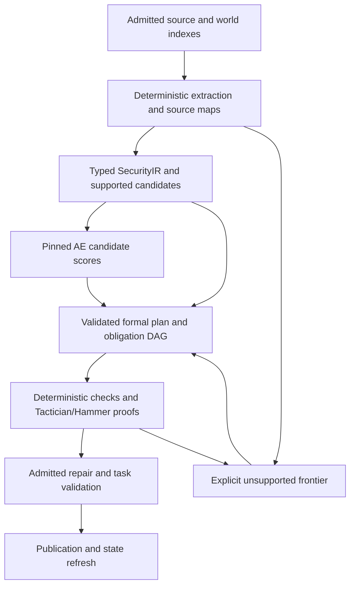

# Security checkpoint publication and formal planning plan

Status: implementation roadmap, updated 2026-09-29. Portable frozen inference,
advisory catalog registration, pinned Hub transport and explicit supervisor
wiring are now implemented locally. See the [operational guide](../../../docs/agent_supervisor/security_autoencoder_checkpoint.md)
for current APIs, dependencies and qualification commands. This document does not
assert that a model has been uploaded, a default descriptor activated, or the
remaining formal-candidate milestones completed.

The source selection now explicitly binds the Publicus CVE corpus and the
published justicedao LegalIR parent. New native source-bound projections cover
program/contracts, transitions/TLA+, temporal formulas, heap/separation and
hyperproperties. See [security training sources and projections](../../../docs/agent_supervisor/security_code_training.md)
for the implemented APIs and draft native learning campaign. These projections
require typed modeling evidence; learned formula heads and automatic
source-to-IR semantics are still separate work.

The next useful deliverable is a reusable, pinned **security advisory checkpoint**
that the supervisor can load without retraining, followed by separately trained
formal-candidate heads. Deterministic extraction, typed contracts and proof
checking remain responsible for program semantics and task acceptance.

## What exists, and what remains missing

| Component | Current implementation | Required next step |
| --- | --- | --- |
| Actual shared-weight transfer | [codebase_autoencoder_transfer.py](../../../ipfs_accelerate_py/agent_supervisor/runtime/codebase_autoencoder_transfer.py) copies compatible native lexical vectors into an isolated security namespace; host extraction and portable integrity checks are distinct. | Preserve this ancestry and exact tokenizer semantics in the reusable release. Keep LegalIR checkpoints, heads and mutable training state separate. |
| Code reconstruction and security head | [codebase_autoencoder.py](../../../ipfs_accelerate_py/agent_supervisor/runtime/codebase_autoencoder.py) trains real weights; [codebase_autoencoder_security.py](../../../ipfs_accelerate_py/agent_supervisor/runtime/codebase_autoencoder_security.py) trains audit/classification/CWE/polarity candidates. [security_autoencoder_checkpoint.py](../../../ipfs_accelerate_py/agent_supervisor/runtime/security_autoencoder_checkpoint.py) now exports and loads frozen trained weights without the historical training inputs at inference. | Qualify an independently trained, held-out release beyond the current development checkpoint. Export still requires the complete validated historical training bundle. |
| Canonical CVE supervision | [security_cve_canonical_export.py](../../../ipfs_accelerate_py/agent_supervisor/runtime/security_cve_canonical_export.py) reconstructs and verifies native source/code/policy records with body hashes and bounded source-derived features. | Expand beyond the qualified two-pair plumbing example, establish independent splits, and support explicit aligned formal-candidate targets. |
| Indexed task state | [codebase_autoencoder_index.py](../../../ipfs_accelerate_py/agent_supervisor/runtime/codebase_autoencoder_index.py) retains task-training references; [security_autoencoder_advisor.py](../../../ipfs_accelerate_py/agent_supervisor/runtime/security_autoencoder_advisor.py) now separates frozen model identity from source-bound observations, registers `security.advise`, hydrates native world/metadata DuckLake and refreshes scores after edits. [terminal_initial_context.py](terminal_initial_context.py) binds explicit frozen selection before planning/admission. | Preserve explicit deferred/historical status when refresh cannot finish. Production activation and benchmark benefit remain separate acceptance decisions. |
| Bounded formal extraction | [doctor_security_ir.py](../../../ipfs_accelerate_py/agent_supervisor/runtime/doctor_security_ir.py) compiles the reviewed header contract into native SecurityIR; [doctor_contract_proof.py](../../../ipfs_accelerate_py/agent_supervisor/runtime/doctor_contract_proof.py) checks a localized guard theorem with Lean/Z3. | Add reusable extractor families with explicit semantics, assumptions, unsupported cases and independent proof obligations. Compilation alone does not discharge an obligation. |
| Domain-neutral neural advice | [autoencoder_advisor.py](../../../../ipfs_datasets/ipfs_datasets_py/logic/formalization/autoencoder_advisor.py) has `AutoencoderScoringBackend`, `FormalizationAutoencoderAdvisor`, bounded requests and source-free features. | Implement a security backend. Requests already require a validated `FormalizationArtifact`; this API does not convert arbitrary raw code into trustworthy logic. |
| Formal goals and repair plans | [ir_learning_campaign_planner.py](../../../ipfs_accelerate_py/agent_supervisor/planning/ir_learning_campaign_planner.py), [formal_plan_compiler.py](../../../ipfs_accelerate_py/agent_supervisor/planning/formal_plan_compiler.py), [obligation_graph_compiler.py](../../../ipfs_accelerate_py/agent_supervisor/planning/obligation_graph_compiler.py), and [proof_carrying_repair_dag.py](../../../ipfs_accelerate_py/agent_supervisor/planning/proof_carrying_repair_dag.py) already provide typed planning and dependency machinery. | Bind model advice to those plans as candidate ordering, then retain normal admission, exact-source checks, proof evidence, validation and publication gates. |
| Hugging Face distribution | [security_autoencoder_hub.py](../../../ipfs_accelerate_py/agent_supervisor/runtime/security_autoencoder_hub.py) now wraps native publication with a security development profile, exact nine-file allowlist, provenance review, immutable cache and pinned inference readback. | Complete concrete release approval, actual publication/readback and any separately approved promotion. No upload or active default Hub descriptor is implied by implementation. |

The current model uses 44 aggregate AST/control-flow observations plus a native
lexical branch. The qualified fork uses 3,242 copied eight-dimensional lexical
rows. Its security head predicts a small label vocabulary; it has no formula
decoder, premise-ranking head, or learned operational semantics. Aggregate counts
and a short lexical summary do not preserve statement order, binding, aliasing or
program transitions. A low reconstruction loss cannot establish semantic
equivalence, security, or the correctness of a repair.

The runtime08 pilot reconstructs 358 permitted task functions, supervises the
security head on two external CVE source-to-target examples, and applies that head to those 358
task functions. The actual CVE examples provided lexical inputs; their AST
projection was unsupported. Scores are uncalibrated and the body-to-function
granularity shift is unvalidated. This is benchmark-informed, transductive
development evidence. It is not a held-out security-model evaluation. The
benchmark-trained checkpoint must retain that label if released as a development
artifact; a general pretrained release needs a separate clean training run.

## Milestone 1 — Portable weights, isolated loading and repeatable inference

Create a versioned security package format and strict loader, separate from the
per-task `code-autoencoder` training receipt. An initial portable release can
retain the current inert JSON tensor format. A later safetensors export must
preserve every tensor name, shape and dtype and pass inference parity tests;
safetensors provides tensor storage without pickle execution, but does not
validate model semantics. [Official safetensors documentation](https://huggingface.co/docs/safetensors/index).

The package should contain:

- Exact architecture, seven-tensor layout for the supervised fork, dimensions,
  float precision, tokenizer implementation identity, ordered lexical keys,
  feature vocabulary/normalization, target vocabulary and inference version.
- Immutable weights, byte hashes, training configuration, parent initializer and
  LegalIR source checkpoint hashes, exact transferred-row digest, available
  training lineage and explicitly unavailable historical fit metadata.
- A namespaced native `CheckpointManifest`: use the security domain/head IDs,
  ontology, view registry and feature-schema compatibility checks in
  [checkpoints.py](../../../../ipfs_datasets/ipfs_datasets_py/logic/formalization/checkpoints.py).
  Preserve the existing `security-code@1` runtime domain through an explicit
  adapter, rather than interpreting a LegalIR head as a security head.
- Source-free release evidence and authored numerical inference fixtures. Keep
  task source paths, live repository hashes, task rank tables and per-run receipts
  outside the reusable model package.

Implement three explicit modes: frozen inference; bounded adaptation into a new
checkpoint directory; and training from the immutable initializer. Record which
mode ran and its cost. Frozen inference requires no original repository,
training export directory, teacher checkpoint or optimizer state. Adaptation
must never write into the Hub cache or shared/legal model directory.

Acceptance: exact local export/reload parity; no random initialization during
frozen inference; strict rejection of missing/extra tensors, nonfinite values,
wrong vocabularies, namespaces or versions; unchanged parent/LegalIR bytes;
inference succeeds in a clean offline container using only the package and new
permitted source inputs. Keep current task-bound validation as a separate
observation validator.

## Milestone 2 — Canonical training corpus and meaningful evaluation

Expand the existing canonical CVE exporter using pinned upstream data and native
source/CodeUnit/body-hash/policy identities. The current supervised loader caps
training at eight pairs; replace that qualification bound with explicit shard,
memory and training budgets before claiming dataset-scale support. Record
quarantines and unsupported parse/projection cases, rather than silently treating
missing ASTs as equivalent observations.

Split by repository family and related commit/CVE lineage before fitting any
vocabulary, feature normalization, calibration or hyperparameter choice. Keep
vulnerable/fixed versions together. Check exact and normalized code duplicates
across splits; isolate the entire benchmark repository family and benchmark task
inputs from generic pretrained-model training. Use the native
`FormalizationSplitManifest.validate_no_leakage` machinery for source-family
constraints, augmented by code/commit/CVE duplicate checks. Preserve a development
set and a sealed evaluation manifest. Generalization requires held-out data;
training-loss reduction on the current two examples is only a plumbing check.

Make two target families explicit:

1. Security classification candidates: CWE, vulnerability polarity and reviewed
   audit observations. Inputs remain source-derived; target-derived policy/graph
   labels never enter the input projection.
2. Formal planning candidates: supported contract-template IDs, existing view
   IDs, source-bound premise IDs and repair-operator IDs. Create these targets
   through deterministic extraction and independently checked evidence. Include
   unsupported, contradictory and invalid-binding examples. Keep each head's
   schema, loss, data provenance and evaluation separate.

Do not rename a CWE classification score as a formula score. Before training a
formula or temporal decoder, define a typed candidate language with explicit
sorts, variable bindings, assumptions and source maps. Code projections and
temporal/TLA+ projections must remain distinct from LegalIR projections. A
temporal candidate is eligible for TLC/Apalache or another configured checker
only when the source-to-transition mapping is supported and checked; the AE
does not establish that mapping by itself.

Acceptance: loader-replayable canonical records and paired targets, deterministic
split roots, zero detected family/commit/code overlap, per-language/CWE coverage
and abstention accounting, held-out ranking/classification/calibration metrics,
and an explicit out-of-distribution policy. Record inference and training costs
separately. Predeclare quantitative promotion thresholds before evaluating the
held-out set; this plan does not assert that any accuracy threshold has been met.

## Milestone 3 — Learned suggestions inside formal supervisor plans

Use the following bounded chain:



Keep authoritative program state in canonical world/IR/proof records. Latents
and scores can prioritize work, but cannot remove uncovered source regions,
invent a policy, change assumptions, satisfy a proof obligation, grant execution
authority or close a goal. Source-level reachability, stores, branches, exceptions,
aliasing and dynamic-language uncertainty must be modeled by supported
deterministic analyses or represented as unresolved frontiers.

Implement a backend for `AutoencoderScoringBackend.score_views/score_premises`
only when a compatible trained head and target schema exist. For the current
CWE head, use a reviewed mapping to nominate supported analysis templates and
label it as that mapping; do not claim learned view/premise ranking. Revalidate
all returned IDs, finite scores, source/artifact identities and scope through
`FormalizationAutoencoderAdvisor` and the bounded formalization advisor. Model
scores remain untrusted even when their checkpoint is approved for deployment.

Compile the implementation campaign with `compile_ir_learning_campaign` and
`project_campaign_for_admission`. Use `compile_formal_plan`,
`validate_formal_plan`, `compile_obligation_graph` and
`compile_proof_carrying_repair_plan` for actual task dependencies. Attach the
model/head, source, candidate and evidence identities to plan nodes; a failed
proof becomes a counterexample or unresolved task, not a fabricated success.
Reuse existing resource/lease controls to parallelize independent obligations
and analysis regions while serializing overlapping edits and publication.

Feed bounded advice into the native
[formal_plan_context.py](../../../ipfs_accelerate_py/agent_supervisor/planning/formal_plan_context.py)
capsule. Semantic minification must retain an exact, hashed symbol translation
table and round-trip checks for identifiers, types, assumptions and formula
references. The generic advisor's retained-feature-mass compression score is
not proof of semantic equivalence. Bind any minified `llm_router` request and
expanded reply to the same table and source snapshot; count these provider calls
in benchmark token accounting.

After edits, invalidate affected observations and proof references, recompute
source-bound inference/index rows, and retain old evidence as historical. A
reusable frozen model remains usable on new observations; a previous task's
scores do not. Distinguish proof-producing execution from typed compilation in
both planner summaries and receipts.

Acceptance: an authored supported repair completes through native START,
goal/subgoal/task projection, proof checking, validation, publication, refresh
and STOP without an LLM coding call. Unsupported/dynamic examples abstain or
create explicit residual tasks. Tests reject source drift, bogus candidate IDs,
assumption changes and forged proof-completion fields. Independent obligations
demonstrate correct dependency/lease behavior before making parallel speedup
claims.

## Milestone 4 — Package and publish through native Hugging Face APIs

Build a security advisory profile on
`HuggingFacePublicationProfile` and `HuggingFaceReleasePublisher`, including its
registered plan/receipt schemas. Select an explicit model repository and
immutable `releases/<release-id>/` prefix. Do not choose a repository from
ambient credentials or reuse a LegalIR publication prefix.

A concrete proposed destination is the model repository
`Publicus/security-ir-autoencoder`, subject to confirming that account and its
publication permissions when an actual release is ready. Use an experimental
development release first; select visibility explicitly. This proposed name is
not an existing-repository assertion or authorization to upload. Keep the
root model card separate from immutable versioned artifacts:

```text
README.md
releases/<content-derived-release-id>/
  checkpoint.json
  config.json
  vocabularies.json
  lineage.json
  release-manifest.json
  model-card.md
  attribution/
  evaluation/
  fixtures/
```

Every payload file inside the immutable release directory must appear in the
closed release manifest. Pin the manifest's own digest externally; manage the
root README through a separate reviewed update. A future safetensors
version replaces the tensor storage under a new format version after exact
numerical parity checks; it does not silently change the existing release.

Two existing wrappers require special care:

- [autoencoder_release.py](../../../../ipfs_datasets/ipfs_datasets_py/huggingface/autoencoder_release.py)
  supports private exact-resume release packages; it explicitly rejects public
  inference exports without parity qualification. The associated
  [duckdb publication workflow](../../../../ipfs_datasets/ipfs_datasets_py/duckdb_control/autoencoder_publication.py)
  is useful for CAS/outbox patterns, but currently uses that private profile.
- [ir_release.py](../../../../ipfs_datasets/ipfs_datasets_py/huggingface/ir_release.py)
  requires an admitted, promoted `RESULT(PGIR-070)` checkpoint with its own
  authority/evaluation/proof record. Do not fabricate those fields to publish an
  experimental advisory model. Publication eligibility and theorem validity are
  separate concepts.

Prepare a concrete local allowlisted package: weights; config and ordered
vocabularies; release and lineage manifests; model card; applicable license and
attribution records; source-free evaluation receipts; and authored load/inference
fixtures. Exclude the full LegalIR teacher, raw source bodies, patch excerpts,
benchmark worktrees, private prompts, credentials, owner state and unreviewed
training memory. Review inherited lexical keys as actual model content too.
Record redistribution provenance for the inherited weights, exported dataset
and original source licenses separately; a dataset label alone does not settle
all inherited artifact permissions.

The model card should identify architecture, actual transferred components,
training datasets and revisions, target schemas, supported languages, evaluation
splits, compute, token use, intended advisory role and known limitations. Clearly
label the two-pair pilot and any benchmark-trained development artifact. Do not
advertise a Transformers loader or an inference widget that has not been
implemented. Hugging Face uses repository `README.md` with YAML metadata for
model cards and provides fields for licenses, datasets and base models.
[Official model-card documentation](https://huggingface.co/docs/hub/model-cards).

Run `plan_dry_run` and review the exact file/hash/byte manifest, destination,
visibility, attribution and parent revision before invoking the existing
publication approval/write contract. No upload is performed as part of this
plan. Then use `publish_append_only`, `verify_post_publication` and
`redownload_and_validate_pinned`; record the resulting full commit SHA. Current
Hub `upload_folder` can create several commits for large folders, so retain the
native explicit operation plan and validate a completed immutable release,
rather than equating a folder-upload call with an atomic release.
[Official upload documentation](https://huggingface.co/docs/huggingface_hub/guides/upload).

Acceptance: offline package validation and dtype/inference parity pass; no
unapproved files enter the manifest; dry-run performs no remote writes; a fresh
cache redownload exactly matches every expected byte; the loader works in an
offline container. Only then use `canary_promote_pointer` and persist the
reviewed runtime pointer through the owner workflow. Keep the previous pin and
exercise `rollback_pointer`; retain failed releases for audit.

## Milestone 5 — Supervisor checkpoint distribution and independent ablations

Add an explicit security-model descriptor to the existing runtime asset bundle
and initial-context configuration. It binds repository type, repository ID,
full commit SHA, release-manifest hash, architecture and compatible head IDs.
Register it through the canonical
[ModelManager](../../../ipfs_accelerate_py/model_manager.py) catalog with explicit
revision/ancestry and `ENCODER_DECODER` metadata, `FEATURES` inputs and
`EMBEDDINGS`/`LOGITS` outputs as implemented. Use `get_model_descriptor`/`resolve`
and the native catalog source machinery; the legacy `APIModelRegistry` directs
new integrations to that catalog. Registration advertises availability only
after strict loading and a real inference probe succeed.

Provide a dedicated typed security-advisor capability and local adapter. The
current [catalog operation schema](../../../ipfs_accelerate_py/model_catalog/schema.py)
has `embedding.generate` but no security-ranking operation, so routed advisory
inference needs an explicit compatible schema extension and routing tests. Expose
`embedding.generate` only if its actual input/output contract is implemented;
AST-feature embeddings are not automatically general text embeddings. Do not
register this classifier as a generative `llm_router` provider. The router can
continue handling separately accounted planning/coding calls while local AE
inference has its own model identity, latency and CPU accounting.

Download only the manifest's allowed files into a bounded model cache, verify
them, then run the strict loader. Do not resolve a mutable `main` branch during
admission. The Hub APIs support `revision` pins, filtered snapshots and cached
downloads; full commit hashes are required when pinning a commit. Cached files
must not be modified in place. [Official download documentation](https://huggingface.co/docs/huggingface_hub/guides/download).

Keep the frozen model independent of task-source state in
`terminal_initial_context` and the production supervisor factory. Publish
model/head/observation/candidate/evidence references into the existing native
world and DuckLake indexes. On missing, incompatible or unavailable weights,
record an explicit no-AE mode or fail the specifically requested AE profile;
do not silently train random weights or change providers. Test both a cold
download and warm offline reuse, including drift, corrupted-cache and rollback
cases.

First diagnose and fix the no-index task failure independently. Native task
completion and STOP success are lifecycle results; benchmark reward remains a
separate outcome. Preserve the failed run and rerun the corrected arm rather
than rewriting its receipt. Then use independent switches for indexes, symbolic
Doctor, AE initialization, CVE supervision and semantic minification. Suggested
arms, with identical permitted inputs and acceptance criteria:

| Arm | Purpose |
| --- | --- |
| Native Codex harness | External coding baseline. |
| Supervisor without indexes/AE, explicit Doctor setting | Supervisor routing and lifecycle baseline after the failure is understood. |
| Supervisor with deterministic Doctor, no persistent indexes/AE | Isolate direct symbolic analysis from indexed retrieval and retained world state. |
| Indexed supervisor with deterministic Doctor, no AE | Establish symbolic/indexing contribution. |
| Same profile with random-initialized AE | Isolate reconstruction/adaptation from transferred weights. |
| Same profile with lexical fork, no CVE head | Measure inherited-weight contribution. |
| Same profile with fork and CVE head | Measure security-supervision contribution. |
| Same profile with qualified formal-candidate heads | Measure formal view/premise/operator ranking, once implemented. |

Use paired task/seed schedules, separate development and held-out repositories,
and comparable model/provider budgets. Record successful task rate, unsupported
coverage, proof/counterexample counts, time to valid repair, all provider input,
cached-input and output tokens, calls by role, training/index/download/setup
costs, CPU/RAM, and total wall time. Cached tokens are a subset of input tokens,
not an additional token total. Report cold and warm runs separately. Avoid
concurrent resource contention or record and control it. Dollars require actual
applicable pricing; token counts alone do not establish monetary savings.

The existing single-task pilot supports a narrow feasibility result. Its
combined full profile cannot isolate AE benefits from Doctor or indexes, and
one materializing worker cannot establish multi-agent speedup. New ablations
must change one component at a time before making those claims.

## Release gates and dependency order

`portable loader -> clean corpus/splits -> evaluated heads -> typed planner
adapter -> local release package -> pinned upload/readback -> runtime canary`

Loader/package work and dataset preparation can proceed in parallel. Formal
extraction/plan integration can proceed against authored fixtures while model
evaluation runs. Publication follows concrete artifact review; broad runtime
promotion follows evaluation and readback, with rollback available.

Use separate lifecycle labels for an experimental development release and a
qualified advisory release. Qualification requires zero observed authority
promotion or source/target leakage, passing reload/drift/namespace tests,
declared held-out metric thresholds, measured resource limits, supported-scope
abstention, complete attribution, and repeatable native integration. Neither
label makes model output a theorem. Whole-program security, general source-to-
formal translation, TLA+ correctness and parallel efficiency require their own
evidence and remain unclaimed until those checks exist and pass.
