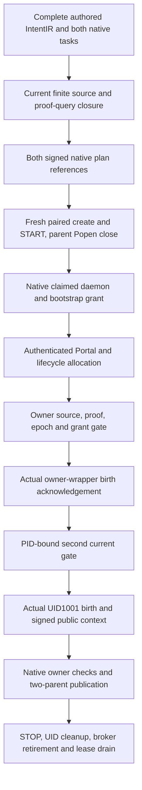

# Finite proof-query dispatch qualification

The opt-in MODEL_OFF route completed genuine native worker publication and two genuine late-change refusal controls on 2026-10-03. All three use the same generation12 production bytes. The positive observed the owner-wrapper and isolated UID1001 births, passed owner checks and published a two-parent merge. Both controls refused at the final current gate after the real second observer returned, retained the native callback outcome as UNKNOWN and completed STOP and cleanup. This is an authored two-task, five-input Python integer integration fixture. It adds no learned training, semantic decoder, complete DuckLake hydration, official Terminal Bench score or global convergence theorem. All 32 production acceptance exits remain OPEN.

The [architecture and next implementation gates](../architecture/REPOSITORY_PROOF_INDEX_AND_CODEBASE_IR_FINITE_PROOF_QUERY_DISPATCH_ADDENDUM.md) cover complete prompt interpretation, repository-specific adaptation, metadata generations, logic projections, successor invalidation and the restricted convergence trial. The [machine review](../architecture/repository_proof_index_and_codebase_ir.finite_proof_query_dispatch_review.json) binds exact source and evidence populations.

## Implemented route

The authored IntentIR keeps exact integer outputs and `increment(n) == n + 2` for `[-2,-1,0,1,2]`. The deterministic observation can satisfy the exact-type clause and expose an offset counterexample. The residual preview chooses the reviewed offset operation; both original tasks and their acceptance guards remain in the signed administrative graph and database.

The existing finite proof-query join binds complete discovery and query pages, all five canonical keys, native domain and assumption objects, verification/applicability bodies, current source head, selected CAS bytes, normalized inventory CID and epoch. Conditional SMT and Lean evidence describes its retained finite/model scope; it does not establish arbitrary Python behavior or authorize execution, task omission or completion.

The additive execution profile reconstructs the complete current plan during paired receiving and repeats physical source/proof checks after callbacks before the manager's literal `Popen`. It preserves the original finite candidate identity and adds the signed proof-query public-context descriptor. The daemon and registered owner wrapper each request an owner AF_UNIX gate. Kernel peer credentials, PID/start identity, native task/claim/attempt, active bootstrap grant, runtime run lease and acknowledgement budget are checked. The second gate is bound to the actual wrapper birth and runs before sudo/UID1001 launch. Native owner/catalog locks cover the final class checks and child acknowledgement.

The allocation join independently authenticates the actual database-to-Portal binding, projected canonical task CID, lifecycle task index and live worktree lease. Database and Portal task CIDs have distinct meanings. The source capability permits exactly one authenticated baseline allocation, checks bidirectional Git administration bindings, keeps original ref meanings and staged entries, and permits lossless packing/GC. Its ordered reflog comparison tolerates only the real empty-message tab normalization; row meaning, native owner, single-link and mode checks remain strict. Canonical source/config/control and selected proof witnesses remain current physical checks. This is a finite cooperative Git profile, without whole hostile-Git/environment attestation.

The isolated worker receives full signed historical bodies and source preimages, without owner keys, catalog authority or private callbacks. Explicit per-call metadata mirroring suppression covers public signature checks, integer compilation, source adapters and AST reconstruction with identical bodies/CIDs. Owner defaults remain enabled. The worker edits its allocated source; native owner acceptance and completion/publication decide the result. STOP/cleanup do not require proof freshness after an authorized edit or refusal.

## Matched native results

All cases use generation12 CID `sha256:1097b564d4a40d6ad5264b5f19ea65284410586374196bacd6714fe01a509bb8`. The retained source capsule contains 22,919 runtime/package files and 588,119,604 bytes. Each native source/resource snapshot contains 19,365 files and 480,880,556 bytes. These are supervisor dependencies, not that many proved repository-under-test units. The actual tested repository is the small authored integer fixture.

| Case | Actual result | Driver seconds | Independent readback |
| --- | --- | ---: | --- |
| positive07 | Both coding boundaries acknowledged; native task completed; owner validation and two-parent merge `1164cfe3ed3eca609c0834cf9aabd7c9c96fb704` | 634.460225934 | [11 checks passed](../../../../artifacts/codebase_ir_terminal_bench/finite-proof-query-dispatch-20261003-01/docker-positive-07-independent-readback-01/independent_selected_docker_audit.json) |
| child-proof02 | Genuine second observer returned, selected proof bytes changed, final `detached_proof_close` refused; one owner-wrapper ACK, zero isolated coding ACKs | 295.919055316 | [11 checks passed](../../../../artifacts/codebase_ir_terminal_bench/finite-proof-query-dispatch-20261003-01/docker-child-proof-02-independent-readback-01/independent_selected_docker_audit.json) |
| child-epoch02 | Genuine second observer returned, native inventory advanced epoch2→3, final `detached_proof_close` refused; one owner-wrapper ACK, zero isolated coding ACKs | 287.472807514 | [11 checks passed](../../../../artifacts/codebase_ir_terminal_bench/finite-proof-query-dispatch-20261003-01/docker-child-epoch-02-independent-readback-01/independent_selected_docker_audit.json) |

The positive also ran genuine parent source/proof refusal controls before publication. Both child controls report `worker_birth_observed=false` and `unacknowledged_child_birth_possible=false` at the isolated boundary. This qualifies the recorded kernel acknowledgement/refusal protocol; it is not a host-wide census of every OS process launch. Canonical source and publication remain unchanged in the refused cases. All three completed native STOP, UID cleanup, broker/socket retirement, container removal and zero remaining fixture process/resource lease/waiter counts.

Both child native tasks remain `in_progress` revision3, with typed claimed phase1 and running execution context revision2. The retained ledger has one `started_outcome_unknown`/`unknown_may_have_started` provider intent and zero effect claims. The fixture's successful control result means its checks completed; it does not assert native task failure, native completion or absence of external effects. Unknown outcomes remain unknown after STOP. The positive independently requires actual native task completion and owner-checked publication.

Cold readbacks check exact ancestry and full retained source populations, 29 native producer pins and eight extra dependencies, 314 replay imports, real public signatures and typed logic, complete two-task/both-reference SQL, all five proof keys, raw allocation/source custody, native execution histories, actual Git objects/trees/blobs/parents for publication and resource cleanup. They assert historical consistency, without current live repository/attempt freshness or process-origin attestation. The matched population review is separately linked in the machine record.

The explicit [three-case cold audit](../../../../artifacts/codebase_ir_terminal_bench/finite-proof-query-dispatch-20261003-01/generation12-matched-three-case-independent-readback-01/independent_selected_docker_audit.json) passed all 31 checks in 44.687880851 seconds. Its [final population summary](../../../../artifacts/codebase_ir_terminal_bench/finite-proof-query-dispatch-20261003-01/generation12-matched-three-case-independent-readback-01/joint-summary-03.json) retains one native completed publication and two native UNKNOWN controls. Earlier summary01 failed on an absent negative-fixture total time; summary02 omitted stored case rows and is disqualified despite its recorded pass flag. Both remain retained. Summary03 validates all three stored cases and keeps unavailable fixture totals null.

The [final selected-source review](../../../../artifacts/codebase_ir_terminal_bench/finite-proof-query-dispatch-20261003-01/current-selected-source-drift-review-01/review.json) found 36 of 37 current producer/dependency bytes equal to the retained generation. Current `local_planning_admission.py` contains a separate public inventory Git-read change (SHA256 `bb1c0cdeea1042d2ca414cfbc6985e9754150c359f06aece75445400ad62d3b9`). The exact changed bytes/diff and failed finalizer equality check remain retained. The live edit was preserved. Native qualification applies to frozen generation12, and does not transfer to the changed whole live runtime.

The disposable image is `sha256:fc97c2bfb57efdc1d9b988520b26c5bc6a77b29a66014a8721f0a9709defa668`, network disabled, 12 CPUs, 8 GiB and 512 PIDs. Actual readonly solver capsules are Z3 4.15.4 (19,659,744 bytes, SHA256 `bbea82f99718e57d939db27db7a6e3afb2dfdee4bd11dd0858e5cfefbdf80fa1`) and CVC5 1.3.3 (26,931,432 bytes, `cad00b4849b015ea6a7790f73cecdf639423f1a17f2c5ec90fda783f778611fb`). Lean uses the retained v4.34.1 toolchain path. Solver version preflights are actual native observations. The small CVC5 installer launcher is not the solver ELF; ambient libraries/interpreter bindings are outside complete ABI attestation.

## Host tests and retained failures

Qualification stays scoped to actual source generations and selected cases.

| Actual run | Result and scope | Evidence |
| --- | --- | --- |
| host11 / generation11 | All 20 allocation cases passed. Whole 37-case attempt retained 27 passing calls, ten failing calls and one teardown error; GC/reflog and expired-grant cleanup failures remain failed | [Cold readback](../../../../artifacts/codebase_ir_terminal_bench/finite-proof-query-dispatch-20261003-01/host-run-11-independent-readback-03/review.json) |
| host12 / generation12 | Source suite 22 passing calls, one hard-link diagnostic-expectation failure; all 23 teardowns passed. Actual lossless GC and canonical source/config/linked-commondir custody and STOP controls passed | [Cold readback](../../../../artifacts/codebase_ir_terminal_bench/finite-proof-query-dispatch-20261003-01/host-run-12-independent-readback-03/review.json) |
| host13 / generation13 | Exact corrected hard-link case passed setup/call/teardown; all 29 native production files and 22,918 other package files equal generation12 | [Cold readback](../../../../artifacts/codebase_ir_terminal_bench/finite-proof-query-dispatch-20261003-01/host-run-13-independent-readback-02/review.json) |

The corrected hard-link alias is outside the inventoried Git administration tree, on the same filesystem, so the actual native single-link guard is reached. Its passing assertions check refusal and restoration. The cold auditor verifies initial authentic source/claim/proof material and final STOP separately; it does not invent an independently retained raw mutation witness. The 22 passing generation12 cases plus this one generation13 case are not a passing 23-case run against one complete test generation.

Earlier host suites, source drift, collection failures, capacity refusals, float serialization failures, Path identity rejection, marker-mode rejection, missing fixture roots and failed independent auditors are retained with their exact generation and cost. Native positive05 observed both births but failed later boundary checking and is not publication-qualified. Native positive06 completed separately in generation11 and passed its final independent publication readback; its earlier direct-invocation and audit implementation failures remain retained. No later pass rewrites these outcomes. The native stream cleanup fix separately passed its 20-case rerun; that is not proof-worker or learned-model qualification.

The [cost ledger](../../../../artifacts/codebase_ir_terminal_bench/finite-proof-query-dispatch-20261003-01/attempt-cost-ledger-final-01.json) accounts actual launched attempts and unexecuted preparations. Driver sums describe overlapping cumulative effort, not unique CPU time or calendar wall time. Proof/Lean/Python receipt counts are bounded logical observations and files, not a complete OS process count. This native fixture performs zero learned fits/inference; broad host training and total OS launches remain unknown.

## Remaining gates and preservation

Independent actual attempt-coordination lease checking remains `false`/OPEN. Current signed claim/run/worktree/grant checks do not substitute for an owner-held join to actual task_claims, fenced_leases, task_attempts, latest token history and task completions. The next increment needs an authenticated owner transport and genuine expiry/replacement/renewal controls before both gates.

The private source capability still needs an independently rebuilt closed schema/body for every cached descriptive MODEL_OFF/authority flag. A trusted in-process self-consistent mutation can mislabel some private presentation fields; no actual grant/source/proof escalation was demonstrated. Signed public descriptors remain bound in the qualified public scope. Arbitrary hostile callback resistance remains open.

Expired native authorization cleanup remains open. Host11 exhausted its authored 300-second grant while other fixtures ran; authorization decision construction failed before native STOP. Reordering tests avoids that incidental delay with the same policy/TTL, and does not qualify STOP under expired authority. Genuine denied/expired authorization needs a coherent decision and an explicitly authorized cleanup route.

The prior finite join's four protected source files, three qualified documents and sealed 3,523-file/736,440,019-byte evidence tree remain unchanged under the [full preservation readback](../../../../artifacts/codebase_ir_terminal_bench/finite-proof-query-dispatch-20261003-01/original-join-preservation-readback-02.json). New evidence has its own [retention manifest](../../../../artifacts/codebase_ir_terminal_bench/finite-proof-query-dispatch-20261003-01/final-retention-01/seal.json) and [independent verification](../../../../artifacts/codebase_ir_terminal_bench/finite-proof-query-dispatch-20261003-01/final-retention-01/verification/readback-01.json). Retention does not confer proof or execution authority.

General prompt interpretation, complete recoverable AST/KG/vector/contract metadata, source-to-model correspondence, learned semantic projections, successor reproof, restricted optimizer theorem/update correspondence, representative Terminal Bench evaluation and default activation retain their own acceptance gates. Global convergence remains false. Prior finite loss decline and training epochs keep their original lineage and empirical scope.
