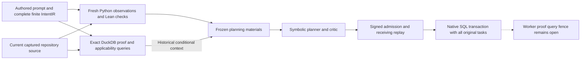

# Finite proof query planning and admission qualification

The new additive supervisor route binds complete native proof queries to the
existing finite IntentIR planner and signed repository admission. Indexed proofs
retain their conditional mathematical scope. Fresh Python observations and Lean
table checks supply the planner's bounded facts, while native materialization
preserves both original administrator tasks and their pending acceptance checks.

The query branch never manufactures observed facts. The diagram covers the
explicit finite profile; broader prompt interpretation and learned semantic
decoding retain separate qualification gates.
The new APIs are additive and opt-in. They do not activate the default Terminal
Bench entry point. The host native fixture exercises invocation as a supervisor;
it is not an official benchmark run.

The fresh focused run passed all 42 cases with zero failures, errors or skips,
and the existing finite plan-service regression passed all 20 cases. The
independent signature, SQL, source and cleanup readback passed for the exact
imported and selected source closure. Evidence is retained in the
[qualification directory](/home/barberb/lift_coding/artifacts/codebase_ir_terminal_bench/finite-proof-query-join-20261003-01).

| Separate run | Result | Recorded duration | Evidence |
| --- | --- | --- | --- |
| Run-04: proof-query planning and admission | 42 passed; exit 0 | 800.272 seconds in JUnit; 801.403 seconds for the retained driver | [tests.xml](/home/barberb/lift_coding/artifacts/codebase_ir_terminal_bench/finite-proof-query-join-20261003-01/run-04/tests.xml), [review.json](/home/barberb/lift_coding/artifacts/codebase_ir_terminal_bench/finite-proof-query-join-20261003-01/run-04/review.json) |
| Regression-01: existing finite plan service | 20 passed; exit 0 | 1.263 seconds in JUnit; 2.200 seconds for the retained driver | [tests.xml](/home/barberb/lift_coding/artifacts/codebase_ir_terminal_bench/finite-proof-query-join-20261003-01/regression-01/tests.xml), [review.json](/home/barberb/lift_coding/artifacts/codebase_ir_terminal_bench/finite-proof-query-join-20261003-01/regression-01/review.json) |

Run-04 retained 14 unique conditional verification records and 14 unique
applicability records, containing 28 and 112 recorded native process
observations respectively, plus 21 unique finite observation receipts.
Observation counts describe retained process evidence, not a deduplicated
process population. Regression-01 retained no native proof or finite
observation receipts. Run-04 retained 285 imported module records and
regression-01 retained 145; module aliases can name the same file. Every module
record was captured before execution and remained stable. The
[independent scoped readback](/home/barberb/lift_coding/artifacts/codebase_ir_terminal_bench/finite-proof-query-independent-audit-20261003-01/readback-02/result.json)
authenticated five signed bundles and independently reconstructed their full
query, key, domain and frozen-material bindings. The positive database has
exactly one objective, one goal, one plan, two tasks and one dependency; both
signed references and all pending guards remain. Six refusal databases contain
zero rows in all five tables. All 13 persisted native scheduler states contain
zero leases and waiters. Recorded native tool observations and selected ELF
hashes were inspected without launching an observer, planner, prover, fitting
or worker.

The four new source files match their actual imported and retained copy bytes:

| Source | Bytes | SHA-256 |
| --- | --- | --- |
| [Planning join](/home/barberb/lift_coding/external/ipfs_accelerate/ipfs_accelerate_py/agent_supervisor/planning/finite_proof_query_join.py) | 33,934 | `d6e4a6187036f5942f4637dd24bec65c1a90ed32c24e3b39e3759e653be03b79` |
| [Admission adapter](/home/barberb/lift_coding/external/ipfs_accelerate/ipfs_accelerate_py/agent_supervisor/runtime/finite_proof_query_admission.py) | 18,129 | `2e5b0add5f19c1c31ad76dae67354d5bfadbfe59303a06590db14507c3abe7e4` |
| [Planning controls](/home/barberb/lift_coding/external/ipfs_accelerate/test/api/test_finite_proof_query_join.py) | 22,624 | `d34cd489d69446bb4c88e6f8881fff44689cbf6c6944c1976fb411f77a06f890` |
| [Admission controls](/home/barberb/lift_coding/external/ipfs_accelerate/test/api/test_finite_proof_query_admission.py) | 27,488 | `6867188f535b6e24cf2a217b5d601a9d92446bff3ba382800e8664c6a0650de0` |

Run-02 recorded 37 passes and three failures in test assumptions; its
[JUnit result](/home/barberb/lift_coding/artifacts/codebase_ir_terminal_bench/finite-proof-query-join-20261003-01/run-02/tests.xml)
and
[failed review](/home/barberb/lift_coding/artifacts/codebase_ir_terminal_bench/finite-proof-query-join-20261003-01/run-02/review.json)
remain retained. Its failures were a prover-interception patch rejected by the
producer pin, an assertion expecting an unchanged inventory CID after an epoch
change, and a list assertion against a native tuple. Those assertions were
corrected without relaxing the native guards. Run-03 was interrupted after 18 completed
test-call records. Its teardown exposed two cancelled leases owned by the dead
driver process. Genuine `recover_stale_leases` recovered exactly those two;
subsequent cleanup checks found zero child processes, active leases or waiters.
The
[native recovery record](/home/barberb/lift_coding/artifacts/codebase_ir_terminal_bench/finite-proof-query-join-20261003-01/run-03/interrupted-lease-recovery/result.json)
marks that interrupted run unqualified. Run-02 failures and run-03 partial
records are separate attempts, not additions to run-04's pass count.

The qualified source closure comprises 285 imported module records over 280
unique files, plus the four selected implementation/test files. All match their
before-execution hashes, retained copies and readback bytes. A stricter
[whole-source readback](/home/barberb/lift_coding/artifacts/codebase_ir_terminal_bench/finite-proof-query-independent-audit-20261003-01/readback-01/result.json)
failed after finding eight changes outside that imported closure. The later
scoped readback found nine such changes and retained their then-current byte
snapshots; whole-workspace stability remains false. These are separate audit
scopes, and the failed strict attempt remains preserved.

A separate comparison with the previous worker qualification found six of its
eight protected core sources matching and two already different in the earliest recoverable run-02
before-execution capture. The benchmark runtime changed again outside
the tested imports during readback. The prior qualified source bytes, current
bytes and differences remain retained in the
[attempt accounting audit](/home/barberb/lift_coding/artifacts/codebase_ir_terminal_bench/finite-proof-query-join-20261003-01/attempt_accounting_audit.json)
and [protected generation trace](/home/barberb/lift_coding/artifacts/codebase_ir_terminal_bench/finite-proof-query-join-20261003-01/protected-source-drift-audit-01/result.json).
The intermediate runtime generation has its before-capture hash; its original
bytes were not found in the inspected retained copies and were not recreated.
No source was restored. The earlier worker qualification applies to its own
retained generation; this new route does not transfer it to the wider live
workspace.

This qualification uses host native fixtures. This increment executes no new
Docker, daemon or worker delivery, and no new DuckLake metadata hydration.
Previously retained native-03 hydration and training evidence is preserved as
historical evidence; it does not qualify this new route.

## Complete intent and proof inputs

The authored instruction has exactly two clauses for `calc.py::increment(n)`:
return an exact integer, and return `n + 2`, for every input in
`[-2,-1,0,1,2]`. The existing finite CNL adapter rebuilds the complete native
IntentIR, source spans and clause selectors. Unsupported text, missing clauses
or changed literals cannot inherit these bindings. This is a complete ledger
for this explicit two-clause grammar; arbitrary public instructions retain their
separate interpretation gates.

The [new planning adapter](../../ipfs_accelerate_py/agent_supervisor/planning/finite_proof_query_join.py)
derives an unconditional native `ContractSpec` with postcondition
`result == n + 2`. It derives a `RequestedInputDomain` containing the single
predicate `n == -2 or n == -1 or n == 0 or n == 1 or n == 2`. The finite input
list and mathematical predicate use different native schemas and CIDs. An
explicit domain bridge binds both representations, the parameter and the
complete ordered input population.

The join reads and validates the existing inventory. It adds no repeated
whole-repository indexing workflow or learned semantic training step.

The datasets verification owner captures the exact source, native ProgramIR,
translated obligation, assumptions, compiler/environment identities, native
Z3/CVC5 observations and complete canonical proof key. Its applicability owner
checks four independent obligations: satisfiable premises, a satisfiable request
domain, coverage of that domain by the premises, and the requested property on
that domain. Contradictory premises, an empty or narrower domain and inconclusive
property evidence cannot enter this route as successful coverage.

For captured `increment(n)` returning `n + 1`, the finite observer can establish
the exact-integer clause and produce counterexamples to the requested offset.
The conditional solver record describes the corresponding refutation on the
mathematical input domain. These are distinct evidence scopes; a solver status
or historical query supplies no observed fact.

## Current queries and frozen planning materials

The native `CodebaseVerificationCatalog` uses the same structural source owner,
DuckDB connection and immutable CAS. A discovery query must return one complete
projection for the exact path, authored contract and requested domain. A second
query also pins the verification CID and full canonical key identity. Both
pages must name the same complete source head, inventory CID, epoch and entry,
with no starting or continuation cursor.

The retained closure includes both complete query requests and pages, the full
projection, verification and applicability bodies, all native observations and
all five canonical keys: one property key and four applicability keys. Key
membership is reconstructed against the actual obligation population. Source,
AST, contract, assumptions, domain, translation, bounds and environment remain
separate bindings. Missing normalized rows or incomplete query pages cannot
establish satisfaction or absence.

The private orchestration starts with a match independently reconstructed by
the finite admission owner. It rechecks the original finite observation
artifacts and binds the complete proof closure under
`materials.extra.finite_proof_query_closure`, together with its CID and explicit
profile. The existing `FiniteIntegerPlanCreateService` consumes these materials
through the real frozen input snapshot, obligation graph, candidate planner and
critic. A change to any consumed record changes the material digest. Both goal
roots, reviewed operations and declared task meanings remain present even when
the finite preview selects only the offset operation.

Every policy callback is surrounded by current query and finite-artifact
checks. After the closing finite observation and source-context exit, the
adapter validates the complete normalized native inventory under the catalog
owner's lock and transaction. It compares the frozen discovery entry, exact
head, inventory CID and epoch, then rechecks the selected immutable CAS bodies
and bound source bytes. It repeats that inventory check after result
serialization and diagnostics. These closing inventory checks invoke no source
observer, solver or policy callback. Model selection is explicitly
`model_off`; this increment performs zero fitting or inference. Original
conditional matcher and inventory-preview profiles retain their existing
meanings.

## Signed admission and native receiving transaction

The [new admission adapter](../../ipfs_accelerate_py/agent_supervisor/runtime/finite_proof_query_admission.py)
signs a separate envelope containing the existing finite admission, complete
indexed plan and its receipt. The receipt commits to the source declaration,
original task graph, finite evidence, semantic context, frozen input snapshot
and full proof-query closure. The operational Lean model body and certificate
remain inside the independently checked existing finite admission.

Receiving performs fresh native finite verification and independently rebuilds
the indexed plan, proof/premise/domain closure and reviewed effects. It compares
the complete result with the signed input. Historical integrity alone cannot
restore current authority. The complete original administrator task population
and signed pending local acceptance guards remain the native materialization
inputs; the residual preview does not authorize omitting the other task.

Materialization replays these checks inside the actual `IntentRepository` SQL
transaction after installation and signing callbacks. A late source change,
changed evidence epoch, altered proof bytes or changed effect population must
refuse before commit. The transaction includes objectives, goals, plans, both
tasks and their dependency rows. After final source custody and all native
callbacks, fresh and original finite-artifact checks are followed by the full
normalized inventory check. Physical witnesses for the three selected proof
CAS objects close the interval before commit. The inventory helper uses only
the trusted budget/cancellation checkpoint; it launches no further source,
prover or policy callback. These are cooperative fences, without an atomic
source-checkout lock or physical process-origin claim.

Two additional qualification controls exercise that final order. One edits the
working source after the last successful native observation; receiving must
refuse the stale source. The other performs a genuine `rebuild_current` during
the final native source-custody callback, preserving the source head while
changing the inventory epoch. The closing inventory check must reject it, and
materialization must roll back objectives, goals, plans, tasks and task
dependencies. Both controls passed in run-04. The independent readback verified their
retained callback receipts and empty rollback database, without rerunning
current observations or changing those fixtures.

A no-work finite result remains review-only. The new profile grants no proof,
behavioral, task omission, completion or worker execution authority.

## Remaining dispatch and semantic gates

The existing execution receiver does not enforce the new proof-query admission
reference. The signed policy explicitly records `worker_proof_query_fence=False`.
The next bounded slice must carry this reference through receiving dispatch and
check its exact current source/index/proof closure before worker creation,
including the final pre-Popen boundary. It must preserve STOP and cleanup after
the proof or catalog becomes stale.

Older retained behavioral work depends on components absent from the current
checkout. This increment therefore joins the current native source, finite
observation and proof-query owners through additive profiles; it does not
restore that older route or transfer its historical qualification to these
sources. Existing pinned documents and qualified artifacts remain separate.

Lean checks the finite recorded table and the existing mathematical operational
model under their stated imports and assumptions. This increment proves no
generic parser/compiler correctness, CPython equivalence, universal repository
semantics or optimizer convergence. It trains no model and reports no official
Terminal Bench reward. Learned codebook decoding and semantic proof authority
remain separate future gates. All 32 RPI production acceptance exits remain
open. The
[next-gate addendum](../architecture/REPOSITORY_PROOF_INDEX_AND_CODEBASE_IR_FINITE_PROOF_QUERY_JOIN_ADDENDUM.md)
orders the remaining dispatch, invalidation, recovery and evaluation work.

The [machine-readable review](../architecture/repository_proof_index_and_codebase_ir.finite_proof_query_join_review.json)
records the exact qualified scope, all attempt costs and receipt counts, failed
preservation checks, and every still-open production exit. The
[final retention manifest](/home/barberb/lift_coding/artifacts/codebase_ir_terminal_bench/finite-proof-query-join-20261003-01/retention_manifest.json)
covers both new evidence directories and excludes its own bytes.
