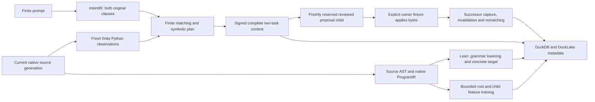

# Reviewed candidate generation and guarded AST lowering

This additive increment connects the existing signed finite repository context
to a bounded trusted proposal subprocess and a separately checked mathematical
AST lowering. Current joined native qualification and its
[independent retained artifact audit](../../../../artifacts/codebase_ir_terminal_bench/finite-reviewed-candidate-qualification-20261002-07/independent-audit.json)
passed. The existing [finite admission qualification](finite_repository_admission_qualification.md)
and [feature adaptation qualification](terminal_codebase_adaptation_qualification.md)
retain their original scope and evidence.

The fifth execution below is bound to its retained producer generation. After
its audit, concurrent work changed the shared native process runner's descendant
tracking, process-family RSS and cleanup. The
[retained drift check](../../../../artifacts/codebase_ir_terminal_bench/finite-reviewed-candidate-qualification-20261002-05/dependency-drift.json)
confirms current replay refuses the old binding. Fresh current-dependency
qualification completed in a new namespace; historical receipts remain unchanged.

That historical seventh execution uses runner `0261fd...`. Subsequent shared
exception-cleanup changes produce runner `9035ba...`; the additive
[advisory worker archive qualification](finite_repository_advisory_worker_qualification.md)
records its own native execution and twenty selected process controls. The
ninety-three candidate/lowering cases below remain qualified against their
retained runner and are not silently renewed against the newer dependency.

## Candidate boundary

The [candidate module](../../ipfs_accelerate_py/agent_supervisor/runtime/finite_repository_candidate.py)
exposes `author_finite_repository_candidate`,
`verify_finite_repository_candidate`, `generate_finite_repository_candidate`
and `verify_generated_finite_repository_candidate`. Its closed
`finite-repository-trusted-offset-candidate@1` profile accepts only the genuinely
owner-signed replacement of the reviewed `calc.py` function from `n + 1` to
`n + 2`. It reconstructs the complete original task graph, source generation,
IntentIR, operation catalog, source and guarded contract. A caller cannot insert
an arbitrary command, change the task population or use an old feasibility
forecast as execution permission.

Generation reobserves the original finite admission, obtains a fresh native
root reservation and child reservation, and runs a fixed Python driver with
`-I -S`. The child reserves one CPU/process and 512 MiB, has a five-second cap,
256 KiB input, 64 KiB output, 1 MiB workspace and eight files. Source, CAS,
original and fresh proof artifacts, selected executables, output files and
actual parent lease authority are checked through return. The complete entry
deadline is at most 90 seconds. Native host-pressure admission is unchanged.
Held observations check lease ownership, accounting and pressure; they do not
recompute every MemAvailable/CPU/PID headroom condition at every final fence or
establish aggregate kernel cgroup enforcement.

The child generates retained proposal bytes and leaves the canonical source,
native task rows and model registry unchanged. A declared review reference is
owner-signed metadata, not independent reviewer authentication. Same-UID
execution does not demonstrate inaccessible signing keys, filesystem/network
isolation or physical child-origin attestation. Mutation, publication,
completion, production activation and proof authority remain false. Historical
verification validates retained evidence without asserting current source or
authenticated process origin.

## Lean lowering scope

The datasets [lowering module](../../../ipfs_datasets/ipfs_datasets_py/logic/software_contracts/codebase_integer_lowering_lean.py)
exposes `prove_current_integer_offset_lowering` and
`validate_current_integer_offset_lowering`. Its separate
`guarded-python-integer-offset-ast-lowering@2` profile supports one ASCII,
synchronous, undecorated, typed, single-return function with one exact integer
parameter, identity/addition/subtraction and a signed 64-bit literal. It admits
at most 64 KiB source and 64 AST nodes. Type annotations, exact built-in integer
inputs and ideal arithmetic/resource behavior remain explicit assumptions.

The extractor independently constructs a closed source AST and the complete
native ProgramIR target. Lean defines separate source and target evaluators,
proves `targetEval (lower body) input = sourceEval body input` for every grammar
body and mathematical integer input, and kernel-checks the independently
reconstructed concrete target's correspondence. It then proves the actual
offset identity and either the requested identity or a concrete refutation.
The scope is `formal_ast_lowering_correctness`. Parser correctness, CPython
equivalence, arbitrary source semantics and runtime behavior remain unproved.
Fresh finite Python observations remain the only facts eligible for this
finite intent-matching profile.

Fourteen artifact roles bind source, complete ProgramIR, translation,
frontend, manifest, source AST/syntax, native target, process/tool policies,
Lean source, compiled object, process receipt and certificate. Callback
tampering, stale native generations, raw/structured CAS changes and atomic
path replacement reject. The joined fixture additionally fences the complete
repository and ordinary Git controls around proving and cold validation.

The generic lowering's compiled artifacts exceed the older finite-table
256 KiB output allowance. A new explicit
`codebase-integer-ast-lowering-process-policy@2` descriptor and CID bind a
1 MiB allowance; the previously qualified tool policy bytes remain unchanged.
The profile retains one CPU/process, a 512 MiB child reservation and sampled
RSS limit, 256 KiB input, 4 MiB workspace, eight files and at most 90 seconds.
Lean's native address-space limit is 4 GiB, separately recorded from RSS.
Failed native processes retain diagnostics and never publish a proof.

## Focused tests and retained history

The [candidate suite](../../test/api/test_finite_repository_candidate.py) has
36 passing cases. The datasets
[lowering suite](../../../ipfs_datasets/tests/integration/logic/software_contracts/test_codebase_integer_lowering_lean.py)
has 57 passing cases. All 93 distinct latest cases pass with no skips, including
complete reruns against the changed native runner. Controls
cover genuinely re-signed substitutions, integer/boolean aliases, unsupported
AST forms, independently changed native targets, all lowering artifacts,
deadline/cancellation, late parent revocation, stale successors, source/CAS/
proof/executable tampering and final-callback/path replacement.

Earlier test outputs remain retained: nine XML runs contain 215 testcase
records, comprising 143 passes, 33 earlier failures and 39 setup errors. Setup
errors repeated across parametrized cases do not represent independent native
attempts. Initial lowering failures used the old output policy; direct compiler
diagnostics explain the size difference but are not owner/scheduler
qualification. Current passing results use the explicit new profile. No old
failed result is reclassified as successful.

Current-runner reruns add three XML runs: 57 Lean cases pass in 67.42 seconds;
the candidate suite's shared initial capture times out, producing 36 duplicate
setup errors, then all 36 cases pass in 185.30 seconds. The updated
[test ledger](../../../../artifacts/codebase_ir_terminal_bench/finite-reviewed-candidate-qualification-20261002-07/tests.json)
retains 344 raw records across twelve runs: 236 passes, 33 earlier failures and
75 setup errors. All 93 latest distinct cases pass. One failed shared setup is
not thirty-six independent native attempts.

## Joined experiment contract

The [native harness](../../benchmarks/agent_supervisor/container_coding/finite_repository_candidate_experiment.py)
uses an authored ten-file Terminal Bench-compatible repository. It captures
every source and AST, actual imports/calls, complete native frontend
dispositions, contracts, feature vectors, checkpoints, optimizer lineage,
signed declarations, finite observations, task rows, invalidations, process
receipts and proof artifacts. Unsupported frontend results remain unproved
metadata rather than acquiring a theorem label.

The signed finite planning/admission context uses model-off mode. Training and
frozen numerical verification are real, separately bound advisory preparation;
their weights do not generate established facts or grant execution. Lean
lowering is checked independently of those weights.

Prespecified root and child training each attempt 16 epochs with learning rate
0.01 and seed 1729. The native eight-dimensional float64 structural feature
profile preserves its 54-feature basis, selected parent weights/Adam state and
fixed tuning/canary/replay roles. The training cohort already includes a known
offset-two variant, so the evaluation is transductive. Finite tuning
nonincrease is an empirical result; it establishes neither a semantic decoder,
blind generalization nor optimizer convergence.

Both original tasks are materialized. The existing public owner validation
passes and completes TYPE; OFFSET fails and remains in progress. The trusted
child generates the exact proposal. An explicitly identified owner fixture
applies those bytes under unchanged Git HEAD, then native capture advances the
source generation and records invalidation. Fresh lowering, training and
finite rematching are required. The successor retains both original task
declarations, receives no local execution admission and refuses no-work
materialization. Candidate generation and successor observations never complete
the outstanding native task.

Cold verification reopens actual native owners and the model registry, performs
fresh frozen inference without fitting/promotion, reobserves finite facts,
validates retained lowering and historical parent/candidate records, and checks
unchanged tasks and parent bytes. Occurrence-wrapped complete producer records
and raw artifact bytes are hydrated into native DuckDB and DuckLake and
reconstructed after a separate process restart.

## Current runtime qualification

The [completed seventh execution](../../../../artifacts/codebase_ir_terminal_bench/finite-reviewed-candidate-qualification-20261002-07/result.json)
uses native runner SHA256
`0261fd091fd1145404379320c44fd5d8628d28be328fa4a089afa7fd997d395e`.
It completes in 230.620067 seconds with 32 actual attempted epochs, both real
lowering checks, the trusted candidate, full task population, successor and cold
verification. Source and model owners close before restart. The model basis,
Adam lineage, finite tuning gate and task states retain the same declared scope
as the historical experiment below.

Current metadata has 504 complete producer records across 23 families, 921
chunks, 1,425 DuckDB rows and 932 DuckLake packets through 94 commits. Both
metadata reconstructions reproduce all original records. Each run records its
own packet count for bounded payloads; neither run is substituted for the other.

The passing versioned `v4` audit directly verifies 1,637 primary pins
(353,575,572 bytes) before and after its read-only work, all 1,604 historical
fifth-run primary pins, all 1,471 prior immutable pins, the original 923 failed
pins and 102 pins for the sixth attempt. It verifies the current 37 selected
execution sources and the historical retained producer copies separately, with
the old live-runner drift recorded explicitly. The new runner's general
descendant-tracking/isolation/resource behavior still has its own qualification
gate; this result covers its use by the bounded candidate and Lean profile.

The sixth attempt was refused at initial source capture after 30.440093 seconds,
with no fitting and zero leases/waiters. Its native schema-qualified registry
contains initialized control tables, but no versions, runs, variants, events,
operations, outbox or promoted heads. An empty default-schema `SHOW TABLES`
alone does not prove absence of those native tables.

The audit's `complete_new_increment_cost_accounting` is the complete seven-run
ledger: five failed and two successful namespaces, 144 actual attempted epochs
and 942.192392 seconds. The four original failures contribute 80 epochs; the
historical success contributes 32, the extra refusal zero and the current
success 32. Test fixtures and direct compiler checks remain separate histories.

## Historical first dependency generation

The [completed fifth execution](../../../../artifacts/codebase_ir_terminal_bench/finite-reviewed-candidate-qualification-20261002-05/result.json)
took 266.062850 seconds. Every recorded phase completed: root/child training
10.380/13.354 seconds, initial/successor lowering 2.441/2.100 seconds, bounded
candidate preparation/generation 27.256 seconds, cold native verification
25.569 seconds, metadata hydration 72.322 seconds and fresh-process metadata
readback 45.136 seconds. These are separately budgeted phases, not one public
benchmark deadline. Both native schedulers finish with zero leases and waiters.

| Native training phase | Actual attempted epochs | Selected cumulative optimizer step | Tuning objective before → after |
| --- | ---: | ---: | --- |
| Root | 16 | 5 | 0.28196144 → 0.04982221 |
| Successor child | 16 | 19 | 0.04982221 → 0.00647275 |

The [complete metadata manifest](../../../../artifacts/codebase_ir_terminal_bench/finite-reviewed-candidate-qualification-20261002-05/metadata/manifest.json)
retains 504 complete producer records in 23 families. This includes 30
source/AST/frontend occurrences across ten initial, ten successor and ten cold
units, 54 symbol rows, 39 actual KG relationships, four vector records, two
lowering proofs, 268 complete artifact-byte records and three typed semantic
snapshot-evidence records. Lossless packaging adds
921 metadata chunks. Native DuckDB retains 1,425 rows; DuckLake retains 933
packets through 94 commits with snapshots 2–95. Both reconstructions reproduce
the complete original producer records. These JSON payload packets do not
qualify general typed proof-query/cache eligibility or vector retrieval quality.

The four pressure-refused namespaces remain intact. Their
[additive native training accounting](../../../../artifacts/codebase_ir_terminal_bench/finite-reviewed-candidate-qualification-20261002-05/experiment-native-training-accounting.json)
checks exact read-only native registry/checkpoint bytes and records actual
attempts of 32/32/16/0 epochs, totaling 80 and 415.069382 seconds. Attempt three
registered a real sixteen-epoch checkpoint before context finalization failed;
counting only finalized context files had incorrectly reported zero. Attempt
four declared a sixteen-epoch invocation but acquired no trainer reservation
and fit nothing. Duplicate native registration events for the same checkpoint
are counted once. Earlier diagnostics are preserved unchanged alongside this
correction. Including the completed run, these five qualification attempts cost
112 actual attempted epochs and 681.132232 seconds. Focused-test fixtures and
direct compiler development checks have separate retained histories.

The independent audit checks all 1,604 primary artifact pins (351,910,645 bytes)
before and after its read-only work, and also verifies all 923 failed-attempt
pins and all 1,471 prior immutable pins. It directly checks public signatures, native SQL and
Parquet, complete metadata reconstruction, source generations, checkpoint/Adam
lineage, both Lean receipts, child/capacity records, task states and all nine raw
test XML files. It runs no native owner, registry constructor, inference,
trainer, prover or extension and writes no audited data. Selected execution
sources are 37 per-file observations; these do not assert an atomic capture of
the entire workspace or authenticate the full transitive runtime environment.

Eight draft checker failures are retained separately in the
[audit calibration ledger](../../../../artifacts/codebase_ir_terminal_bench/finite-reviewed-candidate-qualification-20261002-05/audit-calibration-history.json).
They exposed draft schema assumptions, not failed native qualification phases:
flattened publication receipts, owned finite artifacts outside CAS, native task
CID serialization, separate Lean/Python source CIDs, typed semantic artifact
records and native exception classes. The ledger identifies reconstructed early
intermediate checker sources separately from directly frozen later copies. The
final 96,716-byte script was frozen before its passing execution. No producer,
primary result, old test outcome or failed qualification artifact was rewritten
to obtain that pass.

## Remaining production gates

All 32 [production backlog exits](../architecture/repository_proof_index_and_codebase_ir.todo.md)
remain open. The next increments must separately qualify:

1. Qualify production authority and final-spawn closure for the bounded
   training/lowering/worker join. The subsequent
   [advisory worker archive experiment](finite_repository_advisory_worker_qualification.md)
   runs root/child fitting, both mathematical lowering checks and actual native
   worker publication with complete metadata restart. Its worker remains
   separately admitted under model-off semantics. Bind additional advisory
   artifacts through a versioned admission profile and qualify late callback
   mutation before claiming their closure at process birth. Reuse the separately
   [qualified model-off worker boundary](finite_repository_worker_qualification.md),
   using the existing additive
   [finite execution scope](../../ipfs_accelerate_py/agent_supervisor/runtime/finite_repository_execution.py),
   [allocated-worktree runner](../../ipfs_accelerate_py/agent_supervisor/runtime/finite_repository_candidate_runner.py)
   and isolated worker publication path. Preserve complete finite context,
   genuine task revisions and native claim/lease/fence/public-check/completion
   guards when extending the profile. A reviewed proposal remains distinct
   from the separately verified public worker handoff and signed execution
   grant. Same-UID proposal generation supplies no inaccessible-key or physical
   origin attestation. The older ordinary-Git fixture retains its limited
   application scope; the subsequent native fixture does not establish
   production baseline-transition, automatic pool cleanup or crash recovery.
2. Source parsing and CPython/runtime correspondence for a supported fragment,
   then explicit supported lowerings and bridge obligations for additional
   logic families. Mathematical AST proofs and finite facts retain distinct
   evidence classes and cache eligibility.
3. Source-conditioned semantic decoding with independently checked targets,
   wrong-source/zero-head controls and complete unsupported dispositions.
   Training/query replay must preserve immutable model and source lineage;
   lookup and admission replay must not fit a model.
4. Incremental full-inventory scanning, bounded batched inference, proof-cache
   invalidation and crash-safe lake publication under measured resource pressure.
   Kernel enforcement and full launch-time headroom checks need their own gates.
5. Official Terminal Bench tasks and complete public instructions, with matched
   model-off/frozen/adapted cost and quality trials. Optimizer theory must state
   and prove its assumptions separately from measured finite loss progress.
