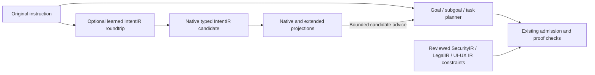

# IntentIR before goal decomposition

The benchmark supervisor has an optional IntentIR observation stage before its
first goal/subgoal/task planning request. The original instruction remains the
source of the task. A missing, untrained, incompatible, or unusable Intent model
does not prevent the existing planner from running. The observation records why
it was unavailable. This fallback applies to the optional model stage; existing
source, admission, SecurityIR, execution, and proof checks still apply.



The datasets implementation owns the frontend, projection contract, checkpoint
format, and numerical calls. Accelerate consumes the resulting observation.
Checkpoint loading is offline and pinned; inference does not train a replacement
model, download weights, or call an LLM.

The Terminal Bench container runtime accepts `--intent-checkpoint-descriptor`
for an explicitly selected local model and `--disable-intent-autoencoder` for
the ablation. Both supervisor arms support these options; the native Codex
baseline is unchanged. Missing/error/disabled observations are retained in the
run artifacts without adding text to the planner prompt. Active advice uses a
bounded summary of identities, projection coverage, and unresolved gaps rather
than duplicating the instruction or serializing latent vectors into the prompt.

The runtime archive builder can include the pinned Intent candidate and relocate
its descriptor into the container. An Intent-only archive also requires the CPU
inference dependency. It does not bundle the training corpus.

## Learned roundtrip checkpoint

The same selection flag also accepts `intent-roundtrip-checkpoint/v1`. This
datasets-owned model predicts actor/action/object/modality slots, materializes
native IntentIR, and reconstructs normalized text from that IR with learned
weights. Valid candidates reach planning as `semantic_candidate_advice`;
unsupported vocabulary, invalid decoding, reconstruction disagreement, or model
errors fail open. Persisted advice is checked by replaying frozen inference.

The first bounded development checkpoint is
`artifacts/intent-ir-roundtrip-20260929/training-03/descriptor.json` in the workspace.
It reconstructed 75/75 held-out authored controls in both directions, but 0/3
held-out weak Publicus clauses with unseen vocabulary. Those results do not
establish general instruction understanding. See the datasets documentation
`docs/intent_roundtrip_training.md` for training, corpus provenance, metrics, and
the separation between learned semantic slots and deterministic projections.

This frozen codec accepts at most 48 whitespace-delimited words and 4,096
characters. Longer instructions abstain before numerical inference, preserving
the original planning input. The exact public instructions for
`fix-code-vulnerability`, `cancel-async-tasks`, and `polyglot-c-py` contain 575,
88, and 52 words respectively; all three exceed that limit. Adding projection
families does not expand the checkpoint's learned input or output scope.

## Extended family projections

For a selected roundtrip checkpoint, the supervisor calls the datasets-owned
`extended_preplanning.prepare_extended_intent_instruction` wrapper. It retains
the original inference, typed IntentIR, and native projections and adds an
`intent-instruction-extended-roundtrip/v1` report. This extension uses the same
`training-03` checkpoint and weights; it adds deterministic projectors without
retraining. Existing base roundtrip sidecars remain accepted.

The default extension requests eight families and produces nine reports because
the transition system also has a TLA+ profile:

| Family or profile | Meaning and validation boundary |
|---|---|
| `dcec`, `tdfol` | Supported source modalities become native formulas; parser and AST roundtrips check syntax and operators. Unsupported modalities or constraints remain explicit. |
| `frame_logic` | Intent nodes and fields become declarative frames, checked through the native parser. Modality remains data. |
| `datalog`, `horn_chc` | Positive declaration facts and their native lowering are checked. No permission rules or code verification conditions are invented. |
| `transition_system`, `tla_plus` | Linear workflows, explicit choice/fork/join models, and finite guarded models with bounded retries become abstract control graphs. Reports remain partial because source-code correspondence and normative compliance are unverified. |
| `higher_order` | A Lean representation encodes the typed Intent declarations. External Lean compilation is a separate qualification step. |
| `event_calculus` | Unsupported by default: an instruction alone supplies no observed event, time, or fluent effect. Explicit source-bound context is required. |

Additional families such as separation logic, hyperproperties, refinement, and
concurrency require their own typed models or evidence. A registered family
does not establish that the current instruction can be projected into it.
These limitations are retained in each report with source identities,
assumptions, unsupported nodes, and validation results.

Ordinary preparation performs native parsing and representation checks without
launching external provers. The persisted full report is limited to 262,144
bytes. Planning receives at most 8,192 bytes containing the learned frame,
native routes, family status, hashes, validation status, and unsupported counts.
Full formulas, generated source, and reconstruction text stay out of that
summary. Source and checkpoint replay validate successful extension reports;
changing formulas and recomputing their hashes does not bypass replay.

An optional projection exception retains independently replayable base advice,
including when the projector later recovers. An extension that exceeds the
report limit is dropped while preserving valid base inference and its validated
request. The check includes JSON Unicode escaping and the final digest. A
missing checkpoint, unsupported learned input, rejected sidecar, or base advice
that cannot fit still follows the existing fail-open behavior. All candidate
proof, execution, completion, and omission authority flags remain false.

The datasets CLI exports an actual learned candidate and its projections. Run
from the workspace root with a fresh output directory:

```bash
PYTHONPATH=external/ipfs_datasets python3 \
  external/ipfs_datasets/scripts/validation/qualify_intent_projections.py \
  --instruction-file /path/to/instruction.txt \
  --checkpoint-descriptor artifacts/intent-ir-roundtrip-20260929/training-03/descriptor.json \
  --output artifacts/intent-projection-qualification-new
```

For explicit backend qualification, add `--check-lean --lean-toolchain
<installed-toolchain>` and/or `--check-tla --model-check --tla-jar
/path/to/tla2tools.jar --java-executable /path/to/java`. The optional
`--lake-executable` selects the installed Lake executable; the tools and
toolchain must already be available. Each invocation has a bounded timeout,
with `--timeout-seconds` accepting 1–60 seconds. These checks run only when
requested; inference never downloads a toolchain.

The CLI stores the exact generated source, configuration, projection report,
and tool receipts. Lean compilation establishes that the generated encoding
typechecks. SANY checks TLA+ syntax and semantics; the optional TLC run checks
`TypeOK` and deadlock freedom of the disclosed finite control abstraction,
including its explicit cutoff stutter. None establishes instruction meaning,
code correctness, normative compliance, or unbounded liveness. Event and
temporal context can be supplied explicitly with `--context`; caller-supplied
events are modeling premises, not verified runtime observations.

The opt-in `finite_guarded_state_flow` model additionally enumerates every
declared initial valuation, checks preconditions before updates, evaluates
guards after updates, and counts each retry edge separately. Reachable
nonterminal deadlocks remain failures; the `NoAbstractDeadlock` invariant
detects them even at the exact step cutoff. The planner receives compact
`abstract_state_diagnostics` with scan status, deadlock count, initial valuation
count, exhaustive-exploration status, and `premises_verified: false`.
Expression and state tables remain in the full report. These supplied models
are not guard or retry predictions from the current single-action checkpoint.

## Select source-bound projection context for the supervisor

Both supervisor arms can consume an explicit projection request before goal
planning. The datasets-owned `intent-projection-request/v1` envelope binds the
exact instruction, decoded IntentIR, and checkpoint manifest hashes to selected
families and modeling context. It cannot replace the original instruction or
supply a different decoded IR. The envelope is limited to 65,536 bytes; the
existing report and planner-summary limits still apply.

Export a request using the same instruction and checkpoint intended for the
benchmark. The datasets qualification CLI writes `projection-request.json`
alongside its inference and projection artifacts when instruction input is used:

```bash
PYTHONPATH=external/ipfs_datasets python3 \
  external/ipfs_datasets/scripts/validation/qualify_intent_projections.py \
  --instruction-file /path/to/instruction.txt \
  --checkpoint-descriptor /path/to/intent/descriptor.json \
  --context /path/to/modal-context.json \
  --family tdfol --family event_calculus --family frame_logic \
  --output /path/to/new-context-qualification
```

The context file uses the datasets adapter's exact `modal`, `state`, and
`structural` schemas. See `ipfs_datasets/docs/intent_logic_projections.md` for
temporal scopes, event/effect premises, finite workflow models, and native
refinement evidence. Each supplied namespace requires a selected corresponding
family. The existing learned checkpoint still predicts one bounded clause and
action; an explicit context does not add unmodeled actions to that prediction.

Package the emitted request with its matching semantic roundtrip checkpoint:

```bash
PYTHONPATH=external/ipfs_accelerate:external/ipfs_datasets:external/ipfs_kit \
python3 -m benchmarks.agent_supervisor.container_coding.terminal_deployment bundle \
  --source external/ipfs_accelerate \
  --datasets external/ipfs_datasets \
  --kit external/ipfs_kit \
  --extension-dir /path/to/duckdb-extensions \
  --intent-checkpoint-descriptor /path/to/intent/descriptor.json \
  --intent-projection-request /path/to/new-context-qualification/projection-request.json \
  --output /path/to/new-runtime-archive
```

The archive stores one inert request at
`models/intent-projection-request.json`. Its manifest pins the exact file hash
separately from the envelope's canonical `request_sha256`. Since the request
contains task-specific premises, the manifest records
`task_inputs_in_archive: true` and `task_modeling_premises_included: true`.
Without a request, the original archive behavior remains unchanged. Context
selection requires the matching semantic roundtrip checkpoint; the older
structural-feature checkpoint does not support it.

Harbor forwards the request path and exact file hash to the container supervisor
in both `full` and `no-index` arms. For direct local preparation or an already
deployed container, the corresponding flags are:

```text
--intent-projection-request /absolute/path/to/projection-request.json
--intent-projection-request-sha256 <SHA256-of-exact-file-bytes>
```

Compute the transport hash from the file bytes, for example with `sha256sum`.
It is different from `request_sha256`, which covers the canonical envelope
payload. The bundle/Harbor path computes and forwards this transport pin
automatically. `--disable-intent-autoencoder` disables both inference and the
selected request for ablations.

Runtime validates the request against the actual frozen inference result.
Successful contextual advice uses `intent-instruction-extended-roundtrip/v2`
and retains the validated request for replay. Missing, modified, oversized,
malformed, or source-mismatched requests record `fail_open_projection_error`
while retaining independently valid base advice and the original task. An
incompatible frontend that silently drops or substitutes the selected request
is rejected by the consumer. Archive-manifest tampering is rejected at the
transport boundary. None of these options grants proof or execution authority.

## What the structural model can establish

The shared `autoencoder_projection_features` backend trains and reconstructs
features of native compiler projections. Its inputs already have an IntentIR
structure. It is useful for structural pretraining and coverage measurements,
but it is not a learned natural-language-to-logic decoder. A deterministic
prompt wrapper and its formal projections are attributed to the frontend, not
to learned weights. Neither an embedding nor a low reconstruction loss proves
that a formula captures the user's meaning.

The initial stage records these limitations explicitly. It preserves the raw
instruction and can supply candidate observations to planning. It does not
replace the independently reviewed IntentIR root, synthesize execution
permission, or mark goals complete. Constraint references identify future
composition inputs; they do not establish that the referenced constraints were
loaded, proved, or jointly satisfied.

## Logic profile for software intent

Reuse the native typed route registry rather than assigning every intent to a
legal-text logic family. The projection should match the requested behavior.

| Intent content | Native family or profile | Obligation before enforcing it |
|---|---|---|
| Facts, predicates, guards, and effects | `first_order` | Bind symbols, types, and source statements |
| Goals and agent commitments | `intention_agency` | Identify actor, desired outcome, and completion predicate |
| Requirements, permissions, and prohibitions | `deontic` | Preserve modality and separately establish authority |
| Preconditions and postconditions of a change | `program` / `dynamic_hoare` | Bind the action to code and state semantics |
| Ordering, retries, joins, and eventual completion | `temporal` / `workflow_temporal` | Define transitions, fairness assumptions, and the observation boundary |
| Tool and resource access | `authorization` | Supply independently grounded permission evidence |
| Invariants, safety, and liveness | Properties of a selected model | Choose the relevant family and discharge its proof obligations |
| Verification conditions | A view role | Generate obligations for an actual prover backend |

Concurrent state machines may need TLA+/TLC or Apalache lowering. A registered
temporal route alone does not supply that lowering or a model-checking result.
Heap ownership may require `separation_logic`; confidentiality and
noninterference may require `hyperproperty` projections with information-flow
semantics. These require additional typed evidence and frontend support. They
must not be inferred merely from a task mentioning memory or security.

For example, "reject invalid headers while preserving accepted behavior"
needs a source-bound validity predicate, an action contract, and regression or
proof obligations for both rejection and preservation. Representing that whole
sentence as an intention atom is useful provenance, but is not a correctness
specification by itself.

## SkillCenter training progression

The inspected [Publicus/skillcenter-ir release](https://huggingface.co/datasets/Publicus/skillcenter-ir/tree/2cc11a73403d03c0679ffa909c893ef6a850048a)
contains skill text and retrieval/provenance records. It does not provide gold
instruction-to-IntentIR or instruction-to-formula labels. The bounded local
export therefore retains source hashes, identities, licensing observations,
and local split provenance, and labels native adapter targets as weak targets.
Hugging Face's `train` split is not an independent evaluation set.

The qualification progression is:

1. Establish structural pretraining with the shared numerical backend and an
   isolated IntentIR checkpoint. Preserve LegalIR and SecurityIR checkpoints.
2. Build aligned instruction/source-span/IntentIR/projection examples. Review
   negation, modality, quantifiers, actors, scope, preconditions, effects, and
   references to repository symbols. Keep uncertain spans explicit.
3. Train a semantic decoder or constrained production head on those pairs.
   Keep source-family and duplicate groups together across local splits and
   exclude benchmark instructions and hidden benchmark artifacts from training.
4. Independently parse and typecheck predictions; check source alignment and
   cross-domain consistency. Track abstention and unsupported projections.
   Successful round trips are structural evidence, not semantic proof.
5. Evaluate instruction preservation, constraint violations, repair success,
   latency, and tokens with the Intent stage disabled, deterministic-only, and
   learned. Hold the downstream planner, tasks, and model budget fixed.

Only independently validated constraints should enter the supervisor's existing
`intent_constraint_adapter` and IR registry path. Learned candidate scores
remain advisory while the normal supervisor continues operating.
