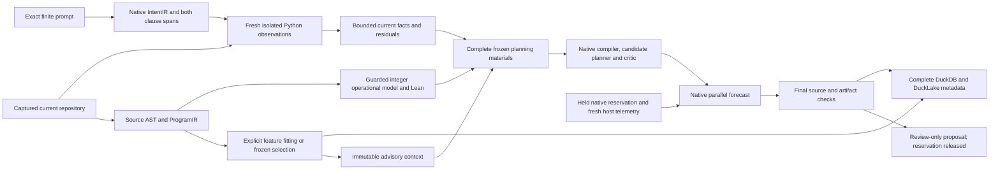

# Repository adaptation, Lean models and reserved-capacity planning

This increment adds an explicit repository feature context, an operational
integer model checked by Lean, and live native capacity to the finite supervisor
preview. It preserves the previous qualified implementations and their
recorded capacity rejection. The new proposal remains review-only.

The [joined wrapper](../../ipfs_accelerate_py/agent_supervisor/planning/finite_integer_capacity_preview.py)
accepts the exact native repository owner, prompt, IntentIR, complete reviewed
operation catalog and independently observed policy roots. It owns its fresh
source observations and model proof. Optional features require a context
prepared by the native adapter and its native registry. Caller facts, capacity
snapshots, scores, theorem receipts and service factories are not inputs.
The planner/provider call budget is zero. Selected feature verification still
invokes native numerical workers; their costs belong to preparation/validation.

## Feature preparation and continuation

The [feature adapter](../../ipfs_accelerate_py/agent_supervisor/planning/codebase_feature_context.py)
exposes `model_off`, `frozen` and `train` preparation. Model-off never loads a
model, fits or infers. Frozen mode performs current inference without fitting.
Train mode invokes the actual source-bound coordinator, then retains complete
checkpoint, report, invocation, lineage, numerical inference and metrics JSON.
The strict planning binding uses role-specific SHA256/byte identities, so its
DAG-JSON identity never coerces numerical floats into integers.

The registered profile is `codebase_ir/source_bound_feature_v1`: eight latent
dimensions and float64 structural features. It has no formal decoder. Parent
and child retain the original feature basis, weights, Adam state, split roles
and fixed evaluation cohorts; current source and ancestral replay remain
distinct. Actual attempted epochs and selected optimizer progress are reported
separately. Selected checkpoint progress can be smaller than attempted work.

Fresh operation tokens and an invocation-wide adapter guard prevent completed
or concurrent same-token retries from being reported as new fitting. Historical
load does no fitting; current verification additionally runs fresh frozen
numerical inference. Source/head, model, retained files and cancellation are
checked before return, including after source-context exit.

The joined wrapper's `@2` receipt commits
`finite-plan-immutable-advisory-feature-validation@1` into its frozen materials
and result. Enabled features receive actual numerical verification at entry and
after reservation release. Every intermediate fence still checks current native
source/head, source/AST CAS objects, frozen context/inference/report files and all
original lineage checkpoint/version identities. Final numerical verification is
followed by a detached byte closure after its callbacks have finished. Model-off
declares zero numerical replay. This is reuse of unchanged advisory inputs; it
adds no proof authority or fitting during planning.

The earlier wrapper repeatedly inferred at every nested root check and refused
two retained frozen previews after roughly 52–56 seconds. One attempt had no
meaningful scheduler wait. The timing diagnostic for the new policy completed
with 14–16-second frozen previews and active forecast ages below 3.3 seconds,
while leaving native host-pressure thresholds and the 30-second capacity policy
unchanged. Its instrumentation and fixture differ from the final qualification;
the old attempts did not retain their failed forecast ages.

Features are advisory metadata bound into planning. They do not supply a fact,
change the finite requirement domain or qualify learned retrieval quality.
The matched model-off and frozen controls must preserve the same facts and task
meanings. Semantic decoding remains a separate proposed profile with its own
source-alignment and independent-checking requirements.

## What Lean proves

The [new model projection](../../../ipfs_datasets/ipfs_datasets_py/logic/software_contracts/codebase_integer_model_lean.py)
retains the complete captured ProgramIR, frontend metadata and effects. It
records explicit source-type to `Lean.Int` mappings and a guarded expression
tree. The Lean file defines expression evaluation and proves the translated
model's offset identity for every mathematical integer. When desired and actual
offsets differ, it kernel-checks a counterexample and refutes the requested
universal model goal.

For `n + 1`, Lean proves the model identity and refutes requested `n + 2`.
For `n + 2`, it proves the requested model identity. This is stronger than the
earlier arithmetic certificate for a recorded five-input table. The source
translation itself and equivalence to all CPython execution are not proved.
`model_proved` therefore does not become a behavioral `PROVED` fact. Planning
facts still come only from fresh finite observations in the declared domain.

## Native capacity and artifact custody

The [capacity service](../../ipfs_accelerate_py/agent_supervisor/planning/finite_integer_capacity.py)
reserves a native CPU/process/memory envelope and independently samples host
resources, pressure and configured headroom at each fence. Its compiler binds
the exact candidate, selected head, complete input snapshot, reservation,
configuration, task resource demand and actual time. The native compiler and
replay determine feasibility. Source/proof work uses sibling reservations under
the original parent; it never consumes an invented second host budget.

The initial five-second profile exposed a real expiry during required joined
validation. The new `finite-integer-live-reserved-capacity@2` declares a
30,000 ms observation age policy in its bound materials. Lease and ancestor
expiry and the request deadline can shorten that interval. Every fence still
checks the reservation and fresh host samples, and an expired original forecast
rejects. The service never refreshes an old plan identity to conceal expiry.

A positive `execution_plan.admitted` value means forecast feasibility during
the live reservation. The outer receipt remains review-only, and the reservation
is released before return. It provides no execution permission or guaranteed
capacity for a later worker launch. A production launcher must acquire and
validate its own current reservation.

The [detached source guard](../../ipfs_accelerate_py/agent_supervisor/planning/finite_integer_source_custody.py)
seals the admitted manifest, every captured source and AST CAS object, native AST
rows, current working inventory and selected Git controls. After all source,
policy, model and inference callbacks, the wrapper checks this closure together
with owned finite/model/context files, result envelopes, every original selected
checkpoint in native model lineage and native executable bytes without further
observation callbacks. No-follow reads
compare descriptor and current-path inode, size, modification and change times,
as well as the expected digest. This rejects final callback tampering and atomic
replacement after opening a file. These identities do not authenticate process
origin or the complete transitive Python/Lean environment.

The source guard is an explicit small ordinary-Git profile: at most 256 working
files of 64 KiB each, with bounded complete directory and Git-control inventories.
It supports regular stage-zero v2/v3 indexes and SHA1/SHA256 object formats.
Staged path, blob, mode and assume-valid state remain bound; volatile Git stat
cache fields and optional TREE caches may refresh. Each read independently
checks its physical descriptor/path identity. Linked worktrees, extended/sparse
or split indexes, v4 indexes, opaque/conflicted/deleted entries, unsupported
extensions and inventories beyond the declared bounds refuse explicitly. These
limits leave scalable inventory and linked-worktree qualification open.

## Retained adaptation experiment

The [native harness](../../benchmarks/agent_supervisor/container_coding/terminal_codebase_adaptation_experiment.py)
uses an authored Terminal-Bench-compatible five-file repository and the exact
two-clause finite instruction. Four files retain the fixed training/tuning/canary
roles; an additional untrained consumer imports and calls the captured function
to supply actual native knowledge-graph relationships. Its capture is not a
formal source proof. Its successful native ProgramIR/frontend record is retained
without inventing an unsupported disposition. Vector/inference coverage remains
the four selected files; the consumer is explicitly metadata-only. The harness
freezes criteria and split roles before fitting:
16 attempted epochs per parent/child, learning rate 0.01 and seed 1729. It retains
model-off and frozen controls on the original and successor heads, actual native
checkpoint lineage and source-generation changes, then reopens the native owner
and registry in another Python process for fresh frozen inference and planning.

The successor changes `calc.py` privately from `n + 1` to `n + 2` at the same Git
HEAD and publishes a new native source generation. Stale requests and feature
contexts must refuse. This tests successor capture and rematching; it does not
represent an admitted worker repair. The known training variant already
contains `n + 2`, and the tuning/canary files are structurally similar authored
examples. The cohort therefore measures transductive reconstruction, with
repeated canary diagnostics rather than blind held-out semantic evaluation.

Every producer record is reconstructed exactly before hydration and again after
a fresh-process DuckDB/DuckLake reload. Source/AST/symbol/KG data, numerical
vectors/checkpoints/lineage, contracts and IntentIR, observed facts/traces, Lean
source/compiled bytes, model projections and complete service materials are
retained. Artifact occurrence records carry full bounded bytes as well as
identities. Numerical loss remains a measurement; Lean checks the explicit
integer operational model independently of those weights.

Each preparation or preview has its own 90-second deadline. The full multi-phase
experiment, cold process and metadata restart have separate measured budgets.
This does not qualify a complete public Terminal-Bench trial within one deadline.
Native host memory, CPU and I/O pressure refusals remain failures with their
artifacts and costs retained; retries use fresh output namespaces.

The [completed uninstrumented execution](../../../../artifacts/codebase_ir_terminal_bench/codebase-adaptation-qualification-20261002-05/result.json)
took 191.72 seconds, including 52.47 seconds for hydration and 29.17 seconds for
fresh-process metadata validation. Its five previews preserve one fact and the
reviewed offset task on the original head, then two facts and explicit no-work
on the successor and cold restart. The selected advisory model does not change
those outcomes. Frozen root/child previews take 16.77/17.80 seconds; the separate
cold owner/registry/preview process takes 22.46 seconds.

| Native fitting phase | Attempted epochs | Selected cumulative optimizer step | Tuning objective before → after |
| --- | ---: | ---: | --- |
| Root | 16 | 5 | 0.28196144 → 0.04982221 |
| Successor child | 16 | 19 | 0.04982221 → 0.00647275 |

Both use the same 54-column float64 feature basis and eight-dimensional latent
space. Native weights, Adam state, source/ancestral cohorts and fixed split
roles are retained. The selected checkpoint is distinct from all attempted work.
These finite measurements establish the declared reconstruction gate; they do
not prove optimizer convergence, source semantics, generalization or a learned
planning benefit.

The metadata run retains 396 complete producer records in 31 families: 15
source/AST occurrences across root, successor and cold capture, 30 symbol rows,
nine actual import/call/state KG relationships, four numerical vector records,
16 training records and complete service/model/proof materials. Lossless
packaging adds 648 metadata-chunk records. Native DuckDB retains 1,044 rows;
DuckLake retains 660 packets through 67 append commits, with snapshots 2–68.
Both reconstruction checks reproduce the original producer bytes exactly.
DuckLake uses explicit JSON payload packets; typed vector columns and general
proof-query/cache eligibility remain separate acceptance work.

Four failed qualification namespaces are retained alongside the successful fifth
run. Their attempted fitting totals are 0/32/16/16 epochs; the completed run adds
32, giving 96 attempted epochs across these five namespaces. The separate two
development attempts contain 32 epochs, and the instrumented four-file timing
diagnostic contains another 32. Test-fixture fitting is recorded separately in
the raw test history. The retained failures include native pressure/admission
refusals and generic stale-or-unavailable forecasts; their missing historical
forecast ages are not reconstructed as measured causes. Every retained scheduler
reports zero leases and waiters at exit. The previous qualified artifact set's
229 byte pins also remain unchanged.

## Focused qualification

There are 129 passing distinct focused cases with no skips: 30 capacity cases,
36 feature-context cases, 42 Lean operational-model cases and 21 joined-preview
cases. The complete joined suite passes against the revised `@2` wrapper. The
earlier `@1` wrapper's 20-case qualification combined 16 complete-run passes with
four pressure-affected cases that passed after recovery. All original results
remain retained, with their source identities. Deselections in the earlier
focused retry are not reported as skips.

The five late-observation source/manifest/AST/inventory/Git controls first
reproduced the old wrapper's final callback gap. The new detached closure rejects
those edits. Additional controls reject final compiled-artifact changes, atomic
replacement after opening a descriptor and corruption of the native registry's
original selected checkpoint after successful frozen verification. Positive
controls retain the native forecast and explicit successor no-work behavior.
The new trained-model positive control records exactly two successful native
verifications, equal model-off/frozen tasks and requirement meanings, unchanged
native registry rows and checkpoint bytes, and zero fitting during preview.

## Subsequent candidate and AST-lowering work

The additive [reviewed-candidate qualification](finite_repository_candidate_qualification.md)
completed its bounded
[current-dependency native join](../../../../artifacts/codebase_ir_terminal_bench/finite-reviewed-candidate-qualification-20261002-07/result.json)
in 230.620 seconds across separate phase budgets. It requalifies this joined
profile after a process-runner change; it does not establish general lifecycle
correctness for that dependency. The
[prior 266.063-second execution](../../../../artifacts/codebase_ir_terminal_bench/finite-reviewed-candidate-qualification-20261002-05/result.json)
retains its earlier runner identity as historical evidence. It uses the separately qualified
[finite repository admission](finite_repository_admission_qualification.md),
which signs a complete model-off context and retains every original task and
completion guard. A freshly reserved fixed trusted child generates reviewed
replacement bytes; an explicit owner fixture applies those bytes. The child
does not edit source, complete tasks or publish a successor. Same-UID execution
does not demonstrate inaccessible signing keys or worker isolation.

The new datasets
[lowering module](../../../ipfs_datasets/ipfs_datasets_py/logic/software_contracts/codebase_integer_lowering_lean.py)
independently extracts the admitted source AST grammar and complete native
ProgramIR target. Lean proves that lowering preserves evaluation for all grammar
values and mathematical integer inputs, then checks the actual target's
correspondence and requested identity or refutation. This is
`formal_ast_lowering_correctness`; byte parsing, physical origin, CPython/runtime
equivalence and execution authority remain unproved. The separate finite facts
retain their enumerated-domain meaning. Compiled generic-lowering artifacts
exceed the older finite-table 256 KiB output cap, so a new `@2` process-policy
descriptor and CID explicitly bind a 1 MiB output allowance. The baseline tool
policy, 1-CPU child, 512 MiB child reservation, 256 KiB input, 4 MiB workspace and
maximum 90-second check bounds remain unchanged. Historical failed attempts and
their producing bytes are retained separately.

The ten-file fixture retains every native source/AST/frontend disposition,
including unsupported units, and keeps its four training selections separate.
The known training variant already contains the requested offset, so the
parent/child objectives measure transductive structural reconstruction.
Checkpoint continuation binds the selected parent weights, basis, Adam state
and fixed ancestral evaluation roles. These checks do not prove optimizer
convergence or a learned planning benefit. The completed join records 32 actual
attempted training epochs and cold owner/model verification, with exact metadata
reconstruction for 504 complete producer records across 23 families. Native
DuckDB retains 1,425 rows, including 921 metadata chunks; DuckLake retains 932
packets across 94 append commits in the current run. The
[current independent read-only audit](../../../../artifacts/codebase_ir_terminal_bench/finite-reviewed-candidate-qualification-20261002-07/independent-audit.json)
passed with all 1,637 primary artifact pins unchanged. Its complete qualification
cost accounting retains seven namespaces: 144 actual attempted training epochs
and 942.192 seconds, including both successful executions and all five failures.
This subsequent evidence changes
none of the completed five-file experiment's claims above, and does not qualify
one complete public Terminal-Bench trial within a single deadline.

## Remaining acceptance gaps

All existing production backlog exits remain open. The next work is concrete:

1. Establish source parsing and runtime/domain correspondence beyond the
   completed closed AST-lowering join. Preserve
   mathematical model, finite observation and
   actual source proof as separate evidence classes. Extend logic families only
   through explicit supported lowerings and bridge obligations.
2. Register and test a source-conditioned semantic decoder with independently
   checked targets, wrong-source and zero-head controls, complete unsupported
   dispositions and preserved source spans. Structural reconstruction cannot
   provide correctness labels.
3. Qualify and integrate the existing
   [finite execution scope](../../ipfs_accelerate_py/agent_supervisor/runtime/finite_repository_execution.py)
   with the new repository-evidence admission through actual worker launch and
   publication. Preserve its complete original requirements/catalog,
   exact fact/residual/task partition and explicit no-work refusal. Independently
   reconstruct it at launch, preserve the original task population and keep
   owner signing keys outside worker access. Signed task omission requires a
   separate authorized profile.
4. Qualify the actual admitted worker edit through that integrated scope,
   capture its successor, invalidate
   affected evidence and model contexts, reprove and rematch, then issue a new
   owner-backed admission revision. A private fixture edit is not this loop.
5. Run the complete public Terminal-Bench instruction and real captured source
   with blind evaluation, complete requirement coverage and measured phase,
   resource, retry and cleanup budgets. The authored cohort is transductive;
   repeated canary diagnostics do not establish unseen generalization.
6. Specify an applicable optimizer-convergence statement and its hypotheses
   before attempting a proof. Finite loss improvement or tuning selection is
   empirical progress, not a universal convergence theorem for nonlinear Adam.
7. Qualify typed native indexes, exact proof-cache eligibility, conservative
   dependency invalidation, bounded complete inventory paging, publication
   recovery and clean released-checkout imports before default activation.
   Retain bounded forecast-age, lease/deadline and admission-reason diagnostics
   on exceptions so a failed preview's historical cause can be reconstructed.

These exits continue the existing RPI-001 through RPI-032 plan. They do not
activate the Harbor route, permit signed task omission or promote a model.
