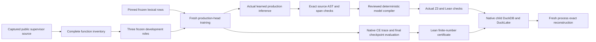

# Learned codebase candidates from public Terminal-Bench source

The [decoder experiment](../../benchmarks/agent_supervisor/container_coding/terminal_codebase_decoder_experiment.py)
continues the [structural codebase IR experiment](terminal_codebase_ir_qualification.md)
with actual learned function reconstruction. A fresh production head learns
parser-derived productions from admitted source, emits candidates without a
teacher fallback, and independently replays their source correspondence before
native formalization and local checker execution. It retains a separate native
metadata catalog referencing the complete earlier supervisor capture.

The 2026-10-01 local run completed in 15.62 seconds, followed by 69 executed
focused tests with zero failures, errors or skips in a fresh AST-seal catalog.
All three selected function
ASTs reconstructed exactly. Both header candidates passed the reviewed source
model route and actual Z3/Lean checks. Training cross-entropy and the fixed
finite stability criterion are checked as recorded-number propositions;
asymptotic optimizer convergence and whole-program correctness remain unproved.



## Scope and fitting policy

The experiment consumes the exact public Bottle capture used by the native
supervisor preplanning run, with SHA-256
`761756ce31753e526c48d28ccbca13a5d2493b16fe37aff3e1e4d2efaf3a2bba`.
It preserves all 358 function dispositions and exact original span maps. The
existing v1 grammar supports three functions; expanded v2 supports only
`html_escape`, and the typed v2 projector supports none of this fixture.
The original header functions reassign their parameters; calls in
`html_escape` remain outside pure typed lowering. No annotation, call or source
statement is removed to manufacture support.

| Exact public unit | Frozen role | Production nodes | Actual reconstruction |
| --- | --- | ---: | --- |
| `_hkey` | Training | 9 | Exact original AST |
| `_hval` | Validation development control | 5 | Exact original AST |
| `html_escape` | Test development control | 17 | Exact original AST |

The [training adapter](../../benchmarks/agent_supervisor/container_coding/terminal_codebase_decoder_training.py)
writes the corpus and policy before fitting. It fixes 160 epochs, seed 1729 and
a 32-dimensional production head. Only the nine training nodes provide gradient
targets. The final checkpoint is selected by the fixed budget, with no selection
by validation/test score and no success-selected retries.

The genuine local published lexical initializer retains its exact 3,242 token
rows and eight-dimensional values. These rows remain frozen. The production head
is freshly initialized and trained; older decoder heads and structural feature
autoencoder weights are not reused. The older admitted v1 decoder supplies
audited split history. Exact-source and normalized-shape roles cannot be
reassigned across that history. v2 ancestry is refused when its earlier v1 roles
cannot be independently reconstructed. This experiment does not qualify a v2
continuation route or alter its native API.

Native frozen inference is replayed without fitting. Model-off and zero-head
controls emit no candidates; wrong source/checkpoint identities reject. The
validator checks actual tensor bytes, corpus, policy, raw logits, candidates,
controls and native receipt bindings. The unit tests also instrument actual
native loss targets to confirm validation/test teachers do not enter gradients.
These three small related development functions are not a blind generalization
sample, despite all 31 productions being correct.

## Checked models and finite numerical evidence

The [decoder logic adapter](../../benchmarks/agent_supervisor/container_coding/terminal_codebase_decoder_logic.py)
requires actual checkpoint/inference replay and original source-span/AST matches.
Both uniquely bound top-level header candidates must match before the complete
header bundle is checked. Missing candidates, changed source, wrong bindings and
nested same-text impersonations cannot silently use a source template.

After those gates, the existing reviewed header compiler produces native
SecurityIR/formalization artifacts. Six actual Z3 obligations yield two safe
local-model results and four satisfiable vulnerability witnesses. Lean compiles
a conditional Boolean header model; a false-guard control is rejected as a
false proposition. Ordinary-string conversion, delimiter-preserving
normalization and callback/property roles are explicit premises. Their Python
implementations and whole-program behavior are not proved.

The learned head emits source-bound Python production candidates. Formal logic
formulas are generated by the deterministic native compiler downstream of
matching. `learned_formula_count` is therefore zero, while the actual learned
function candidate count is three. The 40-family matrix still contains two
conditional locally checked projections, one transition declaration projection
and 37 unsupported projections. No family-specific semantic decoder or broader
Lean projection is claimed.

Native training CE starts at 3.1354942321777344. The last trace point is
0.00039817800279706717, recorded **before** the final optimizer update. A separate
read-only evaluation of the actual stored weights, with the same native loss
kernel and nine training targets, measures final CE
0.00039563688915222883: a 99.9874% decrease from the initial observation.

The fixed finite criterion uses four consecutive recorded native CE changes,
each at most 0.0002. The largest change is 0.0000026734778657556, so this decoder
run meets it. Lean checks exact integer cross-products for the loss inequality
and all four decimal-rational bounds; a reversed-loss control is rejected.
Floating measurement error is not removed. No statement about future epochs,
Adam convergence or held-out accuracy follows from that numeric certificate.
The earlier structural autoencoder's failed stability criterion remains a
separate result on a different objective.

## Metadata and replay

The child namespace contains 117 bounded native DuckDB rows across 21 family
views: 79 complete producer records plus 38 chunk records. It retains the entire
358-function corpus/report, candidate/control data, exact four-file model
package including weight bytes, source correspondence, formal family statuses,
source bytes, actual checker receipts, numerical observations and implementation
digests. Native DuckLake stores 55 versioned row packets across six append
snapshots, IDs 2–7, with managed Parquet files.

Both native stores replay in a new process, and all complete producer fields
reconstruct exactly. The earlier 8,723-row/28-family AST/KG/vector/contract
catalog remains retained under its exact parent manifest reference. Required
generic child views are explicitly empty; they do not claim rehydrated typed
indexes. Native JSON persistence is qualified, while typed graph/vector/ANN
queries and authoritative proof-cache lookup remain open.

## Reproduce

Use the same qualified native environment described in the structural run:
actual DuckDB 1.5.5, local pinned extensions, PyTorch/NumPy and installed Z3/Lean.
The tested interpreter is `/home/barberb/.local/bin/python`. From the workspace
root, with an admitted v1 descriptor and genuine local published binding:

```bash
PYTHONPATH="$PWD/external/ipfs_accelerate:$PWD/external/ipfs_datasets" \
  /home/barberb/.local/bin/python \
  -m benchmarks.agent_supervisor.container_coding.terminal_codebase_decoder_experiment \
  --prepared-experiment /path/to/completed/supervisor-preplanning-experiment \
  --parent-checkpoint /path/to/admitted/v1/descriptor.json \
  --published-binding /path/to/genuine/published-binding-descriptor.json \
  --output /path/to/fresh/decoder-experiment
```

Inspect `experiment-policy.json`, `decoder/corpus.json`, `decoder/policy.json`,
`decoder/decoder-report.json`, `final-checkpoint-objective.json`,
`numeric-logic/RecordedDecoderTraining.lean`, `logic/decoder-logic-result.json`,
`metadata/manifest.json`, `metadata-replay.json`, `metadata-reconstruction.json`,
`codebase-ir-manifest.json` and `result.json`.

From the accelerate checkout, select a fresh AST-seal catalog to execute cold
tests instead of reusing earlier passes:

```bash
IPFS_TEST_PROOF_REUSE_MODE=off \
IPFS_ACCELERATE_PYTEST_SEAL_DUCKDB=/path/to/fresh/decoder-test-seal.duckdb \
PYTHONPATH="$PWD:$PWD/../ipfs_datasets" \
  /home/barberb/.local/bin/python -m pytest -q \
  test/api/test_terminal_codebase_decoder_training.py \
  test/api/test_terminal_codebase_decoder_logic.py \
  test/api/test_terminal_codebase_decoder_corpus.py \
  test/api/test_terminal_codebase_decoder_experiment.py
```

## Remaining qualification

The next source-semantics slice needs exact public units supported by typed v2
lowering or a new explicitly reviewed profile. Preserve unsupported regions;
authored positive controls remain labeled as such. Continue with complete
decoder-generation ancestry and actual candidate-to-typed-IR correspondence
before broader logic-family compilers.

The subsequent [conditional evidence and IntentIR control experiment](terminal_codebase_intent_qualification.md)
qualifies bounded exact-key lookup, reviewed model-only matching, residual
retention and a separately authored native symbolic planning snapshot.
Behavioral facts, automatic public instruction formalization, repository-evidence
admission and post-edit invalidation/reproof remain open. This decoder test runs
no planning provider, coding worker, official verifier or live supervisor
admission, and grants no execution or completion authority. The production RPI
backlog remains open.
