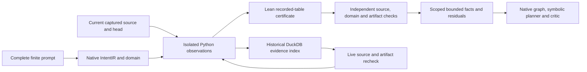

# Finite source observations, IntentIR and symbolic planning

The 2026-10-02 qualification adds an actual current-source path from an explicit
finite requirement to a bounded observation fact and a residual obligation.
The [execution report](../../../../artifacts/codebase_ir_terminal_bench/finite-observation-qualification-20261002-03/REPORT.md)
and [native result](../../../../artifacts/codebase_ir_terminal_bench/finite-observation-qualification-20261002-03/result.json)
retain the receipts. The authored experiment completed in **9.333 seconds**,
excluding its tests. The previous [repository qualification](terminal_codebase_repository_qualification.md)
and its 29 artifact pins remain intact.

## Actual behavior

The complete authored prompt has two native IntentIR clauses on inputs
`[-2,-1,0,1,2]`: return an exact integer and return `n + 2`.

| Captured function body | Finite facts | Residual | Native selection |
| --- | --- | --- | --- |
| `return n + 1` | Exact integer output for every declared input | Requested offset, with five observed counterexamples | One proposed repair task |
| Private successor `return n + 2` | Both clauses for every declared input | None within this domain | Existing planner reports already complete |

At input `0`, the original function actually returned `1`, while the request
requires `2`. Both goal roots and both declared task candidates remain in each
native graph. Explicit clause IDs join evidence to its intended requirement;
task identities retain those meanings across source generations even when
content-based predicate IDs sort differently. The model-disabled symbolic planner and independent critic run on
the real typed materials. No production service or benchmark worker is launched.

## Implemented boundaries

The [datasets observer](../../../ipfs_datasets/ipfs_datasets_py/logic/software_contracts/codebase_finite_integer_observation.py)
independently guards a singleton integer function before executing exact captured
bytes with pinned Python `-I -S`. Missing coverage, bool inputs, unsupported
effects and changed tools cannot create eligible evidence. Lean checks arithmetic
about the recorded table under standard trusted compiled Init imports. This is
not a theorem about Python execution origin or general CPython semantics.

The [finite intent adapter](../../ipfs_accelerate_py/agent_supervisor/planning/finite_integer_codebase.py)
rebuilds the complete controlled sentences, native predicates and source spans.
It calls the observer itself and validates source/head/domain/receipt closure
before emitting `BOUNDED_OBSERVATION` facts. Every supported match executes
afresh. Existing conditional profiles remain unchanged.

The [typed native index](../../benchmarks/agent_supervisor/container_coding/terminal_codebase_finite_index.py)
preserves complete observation, fact-label, clause and match records. Its schema,
constraints, exact counts and rows are independently rederived. Queries check
live source before and after reading and return historical labels with **no
current facts**. Cold Python processes reproduce both queries exactly. This does
not bypass proof checking or weaken FormalVerificationCache's kernel-only gate.

## Successor, storage and tests

The private edit retains Git HEAD. Old observation requests, old index queries
and old planning materials all reject reuse. A newly published structural
generation and fresh observations qualify the successor.

Native DuckDB/DuckLake readback preserves **52 complete records across 24
families**, with **21 JSON packets and three append commits** at snapshots 2–4.
Records include source inventories, native AST, symbols, contracts, compiled
logic, traces, certificates, intent, facts, queries, plans and controls. KG
dependencies, vectors and training are explicitly empty in this singleton
profile. Earlier full-repository graph/vector/model evidence retains its scope.

The exact original 175,565-byte Bottle module is an unsupported control; it
invokes neither target Python execution nor Lean. This authored fixture is not
public benchmark success.

The [test ledger](../../../../artifacts/codebase_ir_terminal_bench/finite-observation-qualification-20261002-03/tests.json)
records **89 distinct current passing cases, zero skips**: 40 observer, 29 matcher
and 20 index/planning cases. Its 91 passing executions include two planner cases
rerun after stable task-to-requirement binding. The two initial closure failures
and corrected reruns remain in the [historical ledger](../../../../artifacts/codebase_ir_terminal_bench/finite-observation-qualification-20261002-01/tests.json).
The closure fix attaches retained candidates
to actual discharged predicate leaves when their producer nodes are absent.
Tests cover stale source/generation, malformed domains, forged/corrupt evidence,
tool drift, unsupported source, cancellation and fully repinned SQL mutations.

The [independent audit](../../../../artifacts/codebase_ir_terminal_bench/finite-observation-qualification-20261002-03/independent-audit.json)
checks source/tool/artifact closure, stable requirement meanings, actual records, native schemas and complete
storage readback. Broad behavioral, proof, execution, completion and mutation
authority remain false; only the exact finite facts are eligible.

Earlier executions retain their original source identities. Qualification 02's
[audit refusal](../../../../artifacts/codebase_ir_terminal_bench/finite-observation-qualification-20261002-02/current-source-drift-audit.json)
records the helper change made afterward; qualification 03 reruns the complete
experiment with the final implementation. The [history record](../../../../artifacts/codebase_ir_terminal_bench/finite-observation-qualification-20261002-03/qualification-history.json)
preserves those distinctions.

## Remaining integration

This run performs **zero training steps and zero provider calls**, and adds no
optimizer-convergence theorem. The [main plan](../architecture/REPOSITORY_PROOF_INDEX_AND_CODEBASE_IR_PLAN.md)
and [backlog](../architecture/repository_proof_index_and_codebase_ir.todo.md)
retain repository-specific fitting, literal-sensitive features, model ancestry,
canary comparisons, learned formalization, complete public-prompt interpretation,
signed service admission and a worker repair/reproof loop. All 32 production
tasks remain open; this is partial RPI-005/006/007/012/013/016/022/023/032 evidence.
