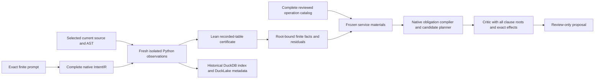

# Finite CodebaseIR observations through the supervisor service

The 2026-10-02 increment joins fresh finite source observations to the real
`PlanCreateService` pipeline. Its [retained result](../../../../artifacts/codebase_ir_terminal_bench/finite-service-qualification-20261002-01/result.json)
records the authored experiment, which completed in **12.997 seconds**, excluding
tests. All **70 focused cases pass, with zero skips**. This is an additive Python
proposal API; the existing structural opt-in and Harbor defaults keep their
previous behavior.

## Prompt, source evidence and planning

The complete authored prompt requests exact integer output and `result = n + 2`
for inputs `[-2,-1,0,1,2]`, targeting `calc.py::increment(n)`. The native IntentIR
retains both clauses and source spans. An explicit operation catalog declares
both reviewed update tasks, producers, targets and clause identities. Its review
reference records caller custody; it does not authenticate human review.

| Captured body | Fresh facts | Service proposal |
| --- | --- | --- |
| `return n + 1` | Integer-output clause; five counterexamples to the requested offset | Only `task:finite:offset`, with its reviewed update effect |
| Private same-HEAD successor `return n + 2` | Both clauses within the five-input domain | Explicit no-work candidate, zero tasks and effects |
| Cold process on the successor | Both clauses after another real Python/Lean execution | The same no-work disposition; historical lookup contributes no current facts |

Both graph roots, both catalog rows, both declared task candidates and the stable
task-to-requirement mapping survive the successor. Only the residual operation
is selected before the edit. Empty work has its own typed candidate and
`no_execution_requested` artifact; it does not trigger generic fallback tasks.
The private edit is an authored control, rather than an executed worker repair.

## Implemented boundaries

The [public wrapper](../../ipfs_accelerate_py/agent_supervisor/planning/finite_integer_plan_preview.py)
accepts a selected native repository owner, exact prompt/native IntentIR, complete
operation catalog, independently observed policy roots and selected native tool
policy. It accepts no caller match, fact, receipt, materials or service factory.
Every supported invocation runs the existing native observer afresh. Prompt and
IR roots use distinct DAG-JSON SHA256/byte-count descriptors; the IR descriptor
binds complete canonical bytes, including confidence values.

Source/head, policy, observation artifacts and selected Python/Lean identities
are rechecked at service fences, after policy callbacks and after inner and
outer source-context exit observations. Cancellation and the complete request
deadline include final result serialization. Final inner-exit tampering blocks
service publication/cache; outer-exit tampering blocks returning a completed
proposal. Selected executable digests establish identity and detect drift;
they do not authenticate checker provenance.

The [finite service](../../ipfs_accelerate_py/agent_supervisor/planning/finite_integer_plan_service.py)
freezes the full match and exact operation bindings, rejects injected stages and
models, and requires the complete two-producer graph with executable singleton
task bindings. Hidden logical producers, premises, assumptions, proof or
validation requirements and undeclared task meanings reject. The actual native
critic receives both clause roots, full observation evidence and exact effect
IDs. The service permits no generic effect rewrite or truncated critique.

The nonempty native parallel compiler still rejects missing process-slot and
fresh-capacity evidence with `resource_infeasible` and `stale_capacity`. That
actual rejection remains in the result. Admission is always `review_only`, with
no signed evidence admission, mutation, execution, omission or completion
authority. No worker launches.

## Storage, restart and verification

The [retained harness](../../benchmarks/agent_supervisor/container_coding/terminal_codebase_finite_service_experiment.py)
keeps exact prompt bytes, requests, source generations, native database/CAS,
Python traces, compiled logic, Lean artifacts, full frozen inputs, graph,
portfolio, effects, critiques, capacity debt and stale-owner controls. Selected
implementation identities are fenced before and after execution. Earlier
qualified implementations and artifacts remain preserved separately.

Native DuckDB/DuckLake reloads reproduce **83 complete producer records across
31 families**, in **32 JSON packets and four append commits** at snapshots 2–5.
The authored singleton has no KG dependency edges, vectors or training records;
their families are explicitly empty. This preserves all produced metadata
without inventing coverage. The storage format remains the existing bounded
experimental JSON packet projection, rather than typed vector columns.

A separate cold Python process opens the native owner, replays both retained
critics, queries the historical finite index, and performs a third fresh
Python/Lean observation. Its index query yields zero current facts. Old owner
requests and historical queries reject after the same-HEAD edit; the superseded
generation also rejects. Resource reservation and waiting counts end at zero.

The [test ledger](../../../../artifacts/codebase_ir_terminal_bench/finite-service-qualification-20261002-01/tests.json)
retains final 50 native owner cases and 20 pure service cases, plus prior runs
and their diagnostics. It covers binding mismatches, unsupported source,
caller-evidence injection, exact operations, hidden producers, artifact/tool
drift, policy drift, source changes, cancellation, deadlines and empty work.
Historical passing revisions are not substituted for the final frozen sources.
The [independent audit](../../../../artifacts/codebase_ir_terminal_bench/finite-service-qualification-20261002-01/independent-audit.json)
checks the retained source/tool/artifact identities and complete metadata records.

## Remaining production work

Lean certifies arithmetic of the recorded table under compiled Init imports.
It does not prove execution origin, universal Python semantics or correctness
on unlisted inputs. Historical storage grants no authenticated proof-checking
bypass. This run has **zero training steps and provider calls**, and proves no
optimizer convergence or public Terminal-Bench task success.

Next qualify applicable source semantics and evidence provenance, actual bound
execution capacity, a newly signed repository-evidence admission, complete
public instruction interpretation, worker evidence delivery and the real repair,
capture and reproof loop. Registered source-bound CodebaseIR training retains
its separate qualification; neither reconstruction profile supplies a formal
decoder. The [comprehensive plan](../architecture/REPOSITORY_PROOF_INDEX_AND_CODEBASE_IR_PLAN.md)
and [backlog](../architecture/repository_proof_index_and_codebase_ir.todo.md)
keep all 32 production exits open.
