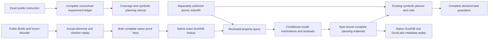

# Conditional repository evidence and IntentIR planning controls

The [intent experiment](../../benchmarks/agent_supervisor/container_coding/terminal_codebase_intent_experiment.py)
continues the [learned codebase candidate experiment](terminal_codebase_decoder_qualification.md)
with native exact-key model-evidence lookup, current-source intent matching and
a frozen symbolic planning control. It performs no fitting. The complete public
Terminal-Bench instruction stays unresolved; an independently authored atomic
IntentIR exercises the existing administrative planner separately.

The completed 2026-10-01 joined run took 57.02 seconds. It reconstructed seven
native evidence entries and 197 bounded metadata rows exactly in fresh processes.
The reviewed control nominated seven local models while retaining its one
behavioral requirement as unresolved. Evidence-off, exact-key-miss and
prohibition-without-evidence controls remained unknown.

All 148 focused tests executed and passed in a fresh AST-seal catalog, with zero
failures, errors or skips. An independent read-only audit verified the complete
native index, current source bindings and lossless DuckLake reconstruction.



## Exact model-evidence index

The [index producer](../../benchmarks/agent_supervisor/container_coding/terminal_codebase_proof_index.py)
independently replays the real frozen decoder on exact public Bottle bytes and
executes the existing source/model qualifier in a fresh output namespace. The
profile admits seven entries: six native Z3 model results and the positive
compiled Lean Boolean model package. The false-guard control must also reject.
Historical receipt markers do not qualify the producer; read paths perform no
optimizer steps and replay current inference and exact artifact bindings.

Each entry retains both datasets `CanonicalProofCacheKey@1` and the supervisor
`ProofCacheKey`, their complete raw dimensions and an exact versioned
relationship. Keys bind source and captured dependencies, spans, expressions,
formalization, obligations, seven premises, bounds, translator sources,
checker identities, environment, policy, network policy, model package and
evidence scope. Candidate outputs do not acquire kernel authority. The evidence
ceiling is bounded conditional-model evidence.

Native DuckDB persists full key and entry bodies, with exact-key parameterized
lookup. Manifest, database, complete row and actual artifact identities must
match; missing, corrupt, duplicated or altered rows reject. Native readback in a
new Python process reconstructs all seven entries. A changed complete policy
key produces an explicit miss; it cannot discharge a requirement.

The pinned Lean/Z3 executables, compiled imports, native libraries and
shared-dependency inventory are retained once.
A closed environment reference binds that full inventory and the compact
checker/package details in every key. Both full and reference digests are
checked. Python and ML package/module identities and current learned inference
are bound; whole-machine and complete transitive ML-library attestation remain
outside this profile. No native version guard or storage bound is relaxed.

## Native intent, current source and residuals

The [control builder](../../benchmarks/agent_supervisor/container_coding/terminal_codebase_intent_control.py)
retains every byte of the public instruction under its original SHA-256.
Without an admitted frontend, its ledger has complete source accounting,
unsupported content and zero native requirements. Plan coverage rejects it and
the symbolic adapter refuses it. There is no automatic provider fallback.

The separate sentence `agent must repair bottle.` is explicitly authored
development data, with its own immutable source file, native document, ledger
and v2 reviewed operation contract. It is not a recovered interpretation of the
full public instruction. The independent operation retains the Bottle modify
and JSONL report create outputs and the public structural smoke declaration.
That check remains distinct from official benchmark correctness.

The [matching adapter](../../ipfs_accelerate_py/agent_supervisor/planning/intent_codebase_matching.py)
binds the exact native statement ID, predicate and arguments. An independently
reviewed query nominates the `_hkey`/`_hval` delimiter-rejection focus with
explicit guard, ordinary-string type, universal domain and requested exception
effect. The generic `repair(agent,bottle)` atom does not intrinsically express
that header property. Query alignment, request-domain coverage and source
meaning remain unqualified.

Matching consumes complete owner-validated lookup envelopes and independently
reconstructs both key namespaces, current source/unit bindings, environment and
translator references, property classifications and full checker receipts.
All statements remain residual. SAT witnesses are counterexamples in the local
model; they are not verified runtime refutations. UNSAT or a checked Lean model
is not satisfied software behavior. Unsupported and ambiguous domains, missing
rows and evidence-off controls remain unknown; absence cannot prove a
prohibition. This pure matcher runs no checker or persistence operation itself.

## Frozen administrative planning control

Native public preparation runs in a fresh disposable repository. The distinct
authored source is tracked alongside the exact Bottle, public instruction and
declared smoke input before a new v4 control manifest is signed. Original
captures and signatures are retained independently.

The authored request has a signed model-disabled policy and a native create-plan
budget of zero model calls. The existing obligation compiler, symbolic candidate
planner, critic and formal output compiler select the complete declared task
population. They receive zero behavioral facts and grant no proof or completion
authority. The full public request is not reported as planned.

The [snapshot adapter](../../benchmarks/agent_supervisor/container_coding/terminal_codebase_planning_snapshot.py)
checks the current signed Bottle leaf against the proof source snapshot; complete
source forests remain distinct. It checks nominated hits against exact pinned
index entries and reconstructs the native intent/query/residual match. Existing
`PlanCreateMaterials.extra` binds the complete control, match, operation and
explicit model-off identity through the native semantic input snapshot.

The full proof-index manifest exceeds the planner's four-MiB material limit.
Its closed artifact reference binds complete bytes, canonical identity and
source snapshot; the complete body stays in native storage and is checked before
freezing and replay. No inventory fields are truncated. Changed artifact bytes,
query, evidence, source, request or signature invalidate exact replay. Repository
proof facts are not admitted through the older administrative execution gate.

Native DuckDB/DuckLake metadata retains complete index bodies, matches,
counterexample context, residuals, signatures, graph, receipts and snapshots,
using lossless versioned chunks for large records. Generic child AST/KG/vector/
contract views are explicitly empty; earlier full catalogs remain referenced.
Typed ANN/graph queries and authoritative cache publication remain open.

## Reproduce

Use the qualified local Python/native environment from the earlier experiments,
including actual DuckDB 1.5.5, installed pinned extensions, PyTorch, Z3 and Lean.
From the workspace root:

```bash
PYTHONPATH="$PWD/external/ipfs_accelerate:$PWD/external/ipfs_datasets" \
  /home/barberb/.local/bin/python \
  -m benchmarks.agent_supervisor.container_coding.terminal_codebase_intent_experiment \
  --decoder-experiment /path/to/completed/decoder-experiment \
  --output /path/to/fresh/intent-codebase-experiment
```

From the accelerate checkout, execute focused tests in a fresh AST-seal catalog:

```bash
IPFS_TEST_PROOF_REUSE_MODE=off \
IPFS_ACCELERATE_PYTEST_SEAL_DUCKDB=/path/to/fresh/intent-codebase-tests.duckdb \
PYTHONPATH="$PWD:$PWD/../ipfs_datasets" \
  /home/barberb/.local/bin/python -m pytest -q \
  test/api/test_terminal_codebase_proof_index.py \
  test/api/test_terminal_codebase_intent_control.py \
  test/api/test_intent_codebase_matching.py \
  test/api/test_terminal_codebase_planning_snapshot.py
```

The index tests require the real frozen decoder capture and installed native
checkers for their native claims. Authored envelope and snapshot controls remain
named as such. No provider, coding worker, official verifier or live benchmark
is invoked by this experiment.

## Remaining qualification

This supplies partial exact-key, matching and material-binding evidence. The
production RPI tasks remain open. A behavioral planning route still needs
qualified typed source meaning, satisfiable premises, request-domain coverage,
one genuine eligible behavioral fact and a qualified residual, followed by a new
repository-evidence admission profile and source-edit invalidation/reproof.
Automatic public instruction formalization and broader logic-family compilation
need their own learned frontend and semantic qualification.

The subsequent [current repository catalog lane](terminal_codebase_repository_qualification.md)
populates real source metadata, typed query joins and complete frozen learned
inventories, and binds them to a fresh native symbolic selection. It adds
conservative private source-edit invalidation and cold comparison while keeping
the semantic and admission limits above.
