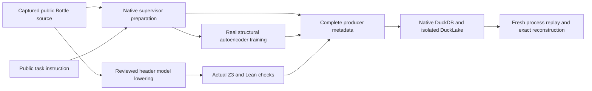

# Terminal-Bench codebase IR qualification

The [experimental runner](../../benchmarks/agent_supervisor/container_coding/terminal_codebase_ir_experiment.py)
joins real supervisor preparation, code-only autoencoder training, source-bound
local checker execution and isolated native DuckDB/DuckLake persistence. It is
the first test slice of the [repository proof index plan](../architecture/REPOSITORY_PROOF_INDEX_AND_CODEBASE_IR_PLAN.md).
Its `completed` status means that the experiment ran through every stage;
individual qualification outcomes remain separate in `result.json`.

This lane prepares one public Terminal-Bench repository. It stops before task
planning, signed admission and worker execution. The representation is an
experimental catalog over existing datasets artifacts, with learned structural
features and separately derived formal models. It is not yet the production
`codebase-ir-manifest@1`, a learned semantic compiler or an authoritative planner
proof cache.



## Captured inputs and native entry point

The first profile requires the captured public `fix-code-vulnerability`
environment's `bottle.py`, with SHA-256
`761756ce31753e526c48d28ccbca13a5d2493b16fe37aff3e1e4d2efaf3a2bba`.
It does not obtain training labels from a solution, hidden verifier or reward.
The instruction is captured independently and bound before training; changes to
either its original or captured copy reject completion.

The [fixture](../../benchmarks/agent_supervisor/container_coding/terminal_codebase_supervisor_fixture.py)
copies the source into a fresh Git repository and uses the existing
`terminal_indexed_preparation.prepare`, `Supervisor.init_local` and
`prepare_initial_context(train_autoencoder=True)` path. It retains the existing
context and training limits. The complete Bottle body exceeds the inline worker
context limit; its exact captured bytes remain available in the artifact store
with a fetch-required reference. The public instruction and declared smoke
input are retained verbatim. No coding provider is called.

The training source ledger contains Bottle and the declared public smoke input.
Only Bottle contributes function samples: 358 functions are encoded using 44
AST/control-flow/literal/argument features and an eight-dimensional learned
latent representation. Instruction prose is not a reconstruction target.
The baseline trains 24 epochs with seed 1729. Controls reproduce that exact
checkpoint and objective curve, train 32 epochs with seeds 2718 and 31415, and
evaluate zero weights without mutating any trained checkpoint.

## Metadata retained and checked

The export preserves every field produced by the selected native source/index
and training paths, rather than narrowing each record to a preferred subset.

| Family | Coverage in the captured public fixture |
| --- | --- |
| Raw sources | Exact Bottle, public instruction and declared smoke bytes, provenance and hashes |
| AST | 2,153 existing evidence facts and the complete Bottle AST index, including its 23,948 nodes |
| KG | 4,652 descriptive dependency/effect edges from the native evidence extractor |
| Symbols | 531 indexed symbols across Bottle and smoke |
| Learned vectors/features | 358 structural feature rows and 358 learned latent vectors |
| Retrieval vectors | 426 lexical retrieval rows and the complete semantic-index snapshot |
| Contracts and source correspondences | Candidate contract records, header lowering assumptions, native declarations and obligation bindings |
| Training | Actual weights/checkpoint, receipt, losses, gradients, source ledger, numerical implementation and control summaries |
| Checking | Native formalization claims/obligations, source-bound SMT queries/verdicts and positive/negative Lean receipts |
| Scope and lineage | Planning material, explicit family support statuses, source generation and implementation file digests |

Some complete index or receipt records exceed the existing per-row JSON bound.
Versioned chunk descriptors bind their full canonical JSON byte count, digest,
family, ordinal and ordered chunks. Reconstruction must recover the exact
original record. Missing, extra, reordered or modified chunks reject; there is
no silent truncation.

The [metadata helper](../../benchmarks/agent_supervisor/container_coding/codebase_ir_metadata.py)
creates a fresh native DuckDB file with primary row identities, unique ordinals,
source bindings and family views. Original records remain exact JSON payloads.
DuckLake stores versioned packets of those canonical row wrappers as JSON text
in actual native history events, with managed Parquet files and snapshot
receipts. Packets target 100 rows/128 KiB; the original row, population, depth,
node and native batch limits remain enforced. This explicitly versioned packet
layout avoids adding event-wrapper depth to original records.

Both stores are reopened and every row, export, source root, packet and native
receipt is checked. A new Python process repeats native readback. Complete
producer JSON is reconstructed again and compared with its original digest.
This qualifies bounded persistence and replay. It does not establish typed
graph tables, an ANN/vector index, domain foreign keys, distributed ownership
or authority for any caller-supplied proof label.

## Formal projections and convergence evidence

The [logic qualification](../../benchmarks/agent_supervisor/container_coding/terminal_codebase_logic_qualification.py)
uses the existing datasets header derivation and SecurityIR/formalization
families. It binds the exact source spans for `_hkey` and `_hval`, with explicit
reviewed WSGI input and normalization premises. Twelve native formulas and six
actual Z3 obligations are retained. On the captured vulnerable source, four
unsafe-acceptance goals are satisfiable and two safe-normalization model goals
are unsatisfiable. The focused tests also check an explicitly authored guarded
source candidate.

Lean compiles a conditional Boolean acceptance/abstract string-normalization
model and an exact integer comparison of the recorded before/after decimal
losses. Reversed-loss and false-guard controls must be rejected specifically as
false propositions. These are checked model/recorded-number statements: Python
string conversion, the normalization implementation and whole-program behavior
remain outside their proof scope.

The 40-family inventory records two locally checked projections (first-order
string SMT and propositional Boolean Lean), one transition-system declaration
projection and 37 unsupported projections. Direct native family emission of
the untyped header declarations is not qualified; typed semantic artifacts are
needed for those emitters. No HOL, modal, temporal, deontic, DCEC or TDFOL proof
is inferred from structural reconstruction. These formulas come from the
deterministic reviewed header lowerer; the feature autoencoder generated zero
formulas in this lane.

Training assessment separates endpoint reconstruction MSE from the native
combined reconstruction/cosine objective. The fixed finite stability test uses
four consecutive native-objective changes, each at most 0.0002. All finite
loss/gradient observations, exact seeds, parameter changes and failures are
retained. Loss reduction or Lean compilation of recorded-number inequalities
does not prove that Adam on this nonconvex model converges asymptotically.
There is no held-out accuracy measurement for this transductive run.

## Run and inspect

Use a Python environment with the actual pinned DuckDB 1.5.5 engine and local
digest-pinned Quack/DuckLake/httpfs extensions, PyTorch, NumPy and the existing
datasets/accelerate dependencies. Z3 and a local Lean executable must be
available. The runner probes the native backend before supervisor indexing or
training; it does not install or relax pins. In the tested workspace, the
qualified interpreter is `/home/barberb/.local/bin/python`; workspace
`.venv/bin/python` has DuckDB 1.4.3 and fails the native guard.

From the workspace root, with a fresh output path:

```bash
PYTHONPATH="$PWD/external/ipfs_accelerate:$PWD/external/ipfs_datasets" \
  /home/barberb/.local/bin/python \
  -m benchmarks.agent_supervisor.container_coding.terminal_codebase_ir_experiment \
  --source /path/to/captured/public/bottle.py \
  --instruction "$PWD/.benchmarks/terminal-bench-2/fix-code-vulnerability/instruction.md" \
  --output /path/to/fresh/qualification
```

Inspect `experiment-policy.json`, `runtime-preflight.json`, `fixture.json`,
`logic/qualification.json`, `metadata/manifest.json`, `metadata-replay.json`,
`metadata-reconstruction.json`, `codebase-ir-manifest.json` and `result.json`.
Failed runs retain prior stage artifacts and a separate `failure.json`; they
cannot become completed runs merely because training or Lean succeeded.

From the accelerate checkout, run the focused native acceptance tests in the
same qualified environment. Select a new test-seal catalog for a cold run;
the repository's existing AST-seal cache otherwise reports unchanged tests as
skipped. Skips must not be counted as newly executed tests.

```bash
IPFS_TEST_PROOF_REUSE_MODE=off \
IPFS_ACCELERATE_PYTEST_SEAL_DUCKDB=/path/to/fresh/test-seal.duckdb \
PYTHONPATH="$PWD:$PWD/../ipfs_datasets" \
  /home/barberb/.local/bin/python -m pytest -q \
  test/api/test_terminal_codebase_supervisor_fixture.py \
  test/api/test_terminal_codebase_logic_qualification.py \
  test/api/test_codebase_ir_metadata.py \
  test/api/test_terminal_codebase_ir_experiment.py
```

## Next qualification slice

The first [learned function candidate qualification lane](terminal_codebase_decoder_qualification.md)
has now trained the existing v1 production decoder on exact public Bottle units,
checked all three reconstructed ASTs, and joined both header candidates to
actual conditional Z3/Lean checks and a separate native child metadata catalog.
Its recorded CE and fixed finite tail bounds compile in Lean. This does not
change the structural autoencoder's failed stability result or prove optimizer
convergence. Broader typed semantic decoding remains open.

Add a separate typed semantic decoder lane using the existing
`security_formula_decoder_v2` and `security_formula_decoder_continuation` APIs.
Enumerate parser-supervised source targets and freeze source/shape-separated
evaluation splits before training. Bind actual decoder inference, weights and
candidate AST correspondence, then use the existing typed v2 lowering or the
reviewed header candidate adapter and execute the native checkers. Structural
feature weights are not a compatible semantic decoder checkpoint.

The reviewed planning join still needs exact checked proof keys, current-source
IntentIR matching, residual obligations, signed planning materials, independent
admission replay and post-edit invalidation/reproof. These remain open in
RPI-004 through RPI-016. This experiment supplies concrete test evidence for
parts of source capture, training, checking and native persistence; it does not
close those production acceptance milestones or measure an official
Terminal-Bench score.
