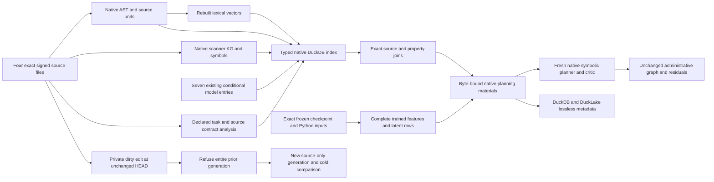

# Current repository metadata and indexed planning qualification

The [repository experiment](../../benchmarks/agent_supervisor/container_coding/terminal_codebase_repository_experiment.py)
continues the [conditional evidence and IntentIR control](terminal_codebase_intent_qualification.md).
It builds real current-source metadata and a typed native DuckDB query index,
restores exact frozen learned inventories, and binds the resulting context to
the existing symbolic planner's actual input identity. It performs no fitting.
The full public Terminal-Bench request remains unresolved and every behavioral
requirement remains residual.



## Completed development experiment

The [2026-10-02 joined report](../../../../artifacts/codebase_ir_terminal_bench/repository-qualification-20261002-01/REPORT.md)
records a real completed run in 373.294 seconds with a final exact planning and
source replay. It retains all preceding qualification artifacts and produces
the following current inventories:

| Inventory | Complete records |
| --- | ---: |
| Signed sources / Python inputs | 4 / 2 |
| Native AST facts | 2,177 |
| Native graph edges | 4,652 |
| Scoped symbols | 531 |
| Signed task declarations / header analyses | 1 / 1 |
| Lexical retrieval vectors | 426 |
| Frozen trained features / eight-dimensional latent rows | 358 / 358 |
| Conditional model entries / source-unit query joins | 7 / 8 |

The typed retrieval database has 7,800 data rows and one singleton identity row.
The separate metadata database and actual DuckLake agree on 8,919 bounded rows
across 31 family views. Reconstructing 366 chunk rows recovers all 8,553 complete
producer records without truncation. DuckLake stored 505 canonical JSON row
packets through 53 writes at snapshots 2–54, after bootstrap snapshots 0/1; its
existing history layout has no typed vector columns.

All 91 distinct focused test cases have passing latest outcomes: 30 learning
capture, 50 typed index and 11 indexed planning cases. The five qualification
receipts contain 92 executions and retain one initial SQL test-fixture failure
with its explicit passing rerun. An earlier ten-case planning fixture-error
diagnostic is also retained separately. The
[test ledger](../../../../artifacts/codebase_ir_terminal_bench/repository-qualification-20261002-01/acceptance-tests/latest-outcomes.json)
does not describe these receipts as one combined pytest run. The
[artifact audit](../../../../artifacts/codebase_ir_terminal_bench/repository-qualification-20261002-01/audit.json)
checks receipt, implementation, source, parent-artifact and complete-export pins.

The source edit at unchanged HEAD refused all three old index, frozen learning
and conditional proof bindings. Its new source-only query was unknown and
agreed with an independent cold rebuild after removing only the storage manifest
identity. No new fitting or checker execution occurred. The earlier structural
autoencoder's finite-tail gate remains failed; the separate decoder's passed
finite-tail gate remains a finite numeric qualification, with no proof of
asymptotic optimizer convergence.

## Current source and native metadata

The [native index producer](../../benchmarks/agent_supervisor/container_coding/terminal_codebase_repository_index.py)
uses exact source bytes supplied by the existing signed manifest. The forest
includes Bottle, the complete public instruction, the declared public smoke
file and the separately authored atomic intent. Ambient files and Git HEAD are
not substitutes for this byte inventory.

Existing native producers supply program-evidence AST facts, scoped symbols,
semantic graph edges, artifacts and lexical vectors. Complete producer objects,
source-unit spans and AST hashes, source leaves and producer implementation pins
remain stored. Non-Python documents remain source/context inputs and are not
treated as successfully parsed Python.

Task contracts are signed declarations and header analyses are source-bound
candidate interpretations under a reviewed protocol. Storage or parse success
does not make either a behavioral theorem. The index preserves those roles.

Typed DuckDB tables expose current source, unit, AST, graph, vector, contract and
conditional evidence relationships. A closed query specifies source path,
qualified symbols, property and a bounded context limit. Exact source/unit joins
resolve the reviewed header focus. Lexical context is ranked separately and
does not truncate the complete stored inventory. This qualification does not
activate an ANN index or assert semantic nearest-neighbor correctness.

Manifest, database, complete table population and producer reconstruction must
agree. Replaying the current producers rejects caller-supplied forged rows even
when file pins are updated. Unknown symbols/properties and unavailable proof
entries cannot become behavioral satisfaction. The typed join does not replace
the owner authentication of the earlier proof index.

## Frozen learned inventories

The [learning capture](../../benchmarks/agent_supervisor/container_coding/terminal_codebase_catalog_capture.py)
reconstructs the complete original qualification catalog through its native
DuckDB/DuckLake exports and versioned chunks. It verifies the qualified fixture,
original source scope, source-derived features, artifact bytes and actual native
frozen-weight inference before carrying all trained feature, latent, frontier
and training records.

The active Python inputs must exactly match the original Bottle and public smoke
pair. Public instruction and authored intent bytes are retained as context and
never become model labels. These latent rows belong to the earlier structural
autoencoder; the later learned decoder and its conditional checking package
retain separate model identities and exact references.

Latent reconstruction and ranking remain candidate evidence. A checkpoint hash,
AST hash, vector distance or successful replay does not infer a specification,
prove a source operation or discharge an IntentIR requirement. No optimizer
steps occur in this capture, index, query or planning path.

## Native planning inputs and complete metadata

The [indexed planning adapter](../../benchmarks/agent_supervisor/container_coding/terminal_codebase_indexed_planning.py)
independently reconstructs the current typed query and frozen learning capture.
It then binds the complete index and learning artifact bytes and exact query
values in `PlanCreateMaterials.extra`, through the existing native input
snapshot. The complete large bodies remain in byte-checked artifacts within
the existing planner material limit.

The native semantic input identity changes when repository context is added.
The original administrative graph, complete declared task population, zero-model
budget and behavioral residuals remain unchanged. This is an experimental
context binding, not a new repository-evidence admission profile.

A fresh native obligation compilation, symbolic portfolio, critic, coverage and
formal output compilation consume the indexed input identity. Its receipt binds
that identity and the actual frozen candidate context; the baseline receipt is
retained separately. This establishes context consumption and provenance. The
single unchanged declared task does not demonstrate better task choice or a
behavioral effect from retrieval.

The new metadata generation replaces the earlier empty AST, KG, vector and
contract views with complete actual producer records. It also retains original
control, conditional evidence, match and planning receipts. Existing lossless
chunking preserves large complete values within native metadata limits. Native
fresh-process readback and reconstruction verify DuckDB and actual DuckLake
storage independently of the typed retrieval database.

## Source changes and cold comparison

The edit control creates a private Git copy of all four exact source files,
commits it, and adds a comment to Bottle without changing HEAD. Original source,
model, database, signatures and qualification artifacts remain untouched.

The changed full source hash refuses the old repository index, conditional proof
bindings and frozen learned generation. This deliberately invalidates the
whole prior generation, including when the parsed function AST is unchanged.
Source identity is not reduced to AST equality or Git revision.

A new source-only index retains zero inherited proof entries and zero active
learned rows. A separate cold producer and native index rebuild must produce
the same complete source metadata and semantic query result. Only storage-local
identities may differ. This qualifies conservative invalidation and cold
equivalence; selective dependency reuse, changed-source adaptation and reproof
remain open. The private successor has no signed admission or dispatch authority.

## Reproduce

Use the qualified native environment from the preceding experiments, including
DuckDB 1.5.5, its installed pinned extensions, PyTorch, Lean and Z3. From the
workspace root:

```bash
PYTHONPATH="$PWD/external/ipfs_accelerate:$PWD/external/ipfs_datasets" \
  /home/barberb/.local/bin/python \
  -m benchmarks.agent_supervisor.container_coding.terminal_codebase_repository_experiment \
  --intent-experiment /path/to/completed/intent-experiment \
  --output /path/to/fresh/repository-experiment
```

From the accelerate checkout, run the new focused modules with a fresh AST seal:

```bash
IPFS_TEST_PROOF_REUSE_MODE=off \
IPFS_ACCELERATE_PYTEST_SEAL_DUCKDB=/path/to/fresh/repository-tests.duckdb \
PYTHONPATH="$PWD:$PWD/../ipfs_datasets" \
  /home/barberb/.local/bin/python -m pytest -q \
  test/api/test_terminal_codebase_repository_index.py \
  test/api/test_terminal_codebase_catalog_capture.py \
  test/api/test_terminal_codebase_indexed_planning.py
```

Native claims require the real completed parent capture and installed native
backends. Authored receipt controls remain distinct. No provider, coding worker,
official verifier or live benchmark trial runs in this lane.

## Remaining qualification

This adds actual current repository hydration, typed retrieval and conservative
edit invalidation. It does not close production RPI tasks. Behavioral source
semantics, premise applicability and complete request-domain coverage still
need qualification before checked models can discharge requirements. Automatic
full public prompt formalization, broader logic-family compilation, actual
changed-source training, selective reproof and successor admission remain open.
