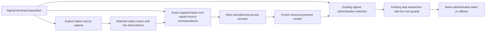

# Native repository metadata through terminal symbolic planning

The 2026-10-02 qualification implements an explicit repository preview at the
terminal planning entrypoint. Exact current native structural metadata reaches
the real `PlanCreateService` obligation, candidate and critique stages. Live
source/head and policy observations protect its frozen input and cached results.
The existing signed administrative builder still selects and materializes the
same task population. No behavioral facts, model fitting, checker invocation or
worker launch occur in this increment.

The [retained qualification](../../../../artifacts/codebase_ir_terminal_bench/repository-preview-qualification-20261002-01/REPORT.md)
and [test ledger](../../../../artifacts/codebase_ir_terminal_bench/repository-preview-qualification-20261002-01/tests.json)
record the actual executions and initial diagnostics. Earlier finite observations,
training and DuckLake experiments retain their original profiles and artifacts.

## Implemented route



The [native preview adapter](../../ipfs_accelerate_py/agent_supervisor/planning/repository_plan_preview.py)
requires the actual datasets `RepositoryCodebaseIndex`, shared native catalog/CAS,
an exact selected `CodebaseHead`, explicit typed intent and complete declared
producer/task materials. It supplies no facts and rejects injected stages,
static roots, model providers and structural-context overrides. Native metadata
and the strict root-observation profile enter the full frozen input identity.
Repository locators and resource controls remain ephemeral application wiring.

The [service](../../ipfs_accelerate_py/agent_supervisor/prompt/plan_create_service.py)
adds `require_live_root_observation=True`. A callable observer must supply all
authority-root fields. Static roots are checked separately and cannot replace
live observation. Fresh checks run on entry, before the admission stage, before
persisting/caching and on cached return. Material mutation after freezing rejects.
Default service callers retain the existing optional-observation behavior.

The [terminal adapter](../../benchmarks/agent_supervisor/container_coding/terminal_repository_preview.py)
checks every signed source against captured CAS bytes. Existing signed-baseline
verification separately checks source bytes, Git baseline and executable modes.
This binds two distinct root formats explicitly without changing the signed
manifest or its task meanings. The service preview remains a proposal: its
production, proof, execution and completion authorities are false. Its generic
admission stage does not grant authority to the later administrative route.

## Explicit Python opt in

After ordinary reviewed symbolic preparation, the application supplies its
existing native index and shared scheduler:

```python
from benchmarks.agent_supervisor.container_coding import terminal_indexed_preparation as preparation

owner = preparation.prepare_repository_preview(
    state=state,
    index=index,
    repository_id="terminal:repository",
    operation_id="repository:capture:initial",
    scheduler=scheduler,
)
result = preparation.plan(state, repository_preview=owner)
```

Capture is an explicit mutating operation with an idempotent native operation
identity. The defaults bound capture to 256 entries, 256 KiB per file and a 1 GiB
resource reservation, including AST work. Capture and planning have separate
bounded calls; this qualification does not establish full terminal-trial timing.
Preview and replay never prepare a head, choose a model, fit or infer. The owner
must remain live; it is not reconstructed from serialized preview claims.
Passing no owner retains the existing terminal path and creates no repository
preview artifact. The CLI and Harbor agent do not activate this option.

## Signed replay and transaction behavior

The terminal route reobserves the selected native source/head before and after
administrative admission replay. The selected route also wraps the independently
owned native task transaction with fresh entry and exit observations. The exit
check runs before commit; a changed generation, source, cancellation or expired
budget raises through the existing rollback. Task-store lock admission is bounded
by the remaining planner budget. `admission.json` is published after successful
selected-route materialization. Signed administrative receipt fields, graph,
requirement bindings and selection remain unchanged.

A successful preview can remain as historical output when a later fence fails.
An immutable local receipt written during materialization can also survive a
rolled-back task transaction. Neither artifact establishes a committed task or
current freshness. Observations are cooperative and do not lock the repository
against a concurrent edit after the final check. Dispatch requires a separate
live gate; this route launches no worker.

## Qualified scope

The authored terminal fixture captures three signed sources, including the
hidden public-smoke script: two Python AST inputs, six semantic symbols, one
unindexed instruction file, zero opaque entries and zero checked or formalized
properties. Its actual service obligation, candidate and critique stages pass;
the proposal admission and parallel execution stages remain unqualified. The
unchanged administrative graph contains one task. The original source is not
edited and no report is created by planning.

Focused tests cover complete live roots, static-root shadowing, strict cache
identity, mutation before persistence, stale source/head, mid-stage changes,
native successors, zero-fact materials, cancellation, deadlines, lease cleanup,
capture retry and no implicit recapture. Terminal regressions inject head changes
and cancellation during admission and materialization replay, verify task
rollback, and retain the default provider and symbolic behavior. A scanner
regression verifies distinct hidden-script namespaces and resolved local calls.

This supplies partial RPI-001/003/013/022/023/026/032 evidence in the
[comprehensive plan](../architecture/REPOSITORY_PROOF_INDEX_AND_CODEBASE_IR_PLAN.md).
All 32 production acceptance tasks remain open. The next service gate must bind
eligible source properties to complete requirements, reviewed operation effects,
independent critic evidence and a newly signed repository-evidence admission,
then qualify actual worker repair and successor reproof. This increment adds no
optimizer convergence theorem, new trained CodebaseIR or DuckLake publication.
