# Agent Supervisor Control-Plane Planner/Doctor V2 Plan (CPD)

Status: proposed successor program  
Audited baseline: `66c6fb4d46d9472e2f5bba9a4cb3e6f78d858aa5`  
Board namespace: `agent-supervisor-control-plane-planner-doctor-v2`  
Task prefix: `## CPD-`  
Goal prefix: `CPD-G`  

This is an append-only successor to the proof-directed Planner/Doctor (PDR)
and prompt-bootstrap (ASI) programs. It does not reopen completed PDR or ASI
tasks. It imports their current-tree receipts, tests their public behavior,
and closes the remaining end-to-end integration gaps.

Companion machine inputs:

- `agent_supervisor_control_plane_planner_doctor_v2.objectives.md`
- `agent_supervisor_control_plane_planner_doctor_v2.todo.md`
- `config/agent_supervisor_control_plane_planner_doctor_v2_scheduler.json`

## 1. Outcome

One prompt, submitted through the Python API, CLI, or MCP, can safely and
reproducibly produce an admitted, content-addressed initial control plane and,
under separate authority, materialize and start it. The generated control
plane includes:

1. normalized intent, assumptions, non-goals, constraints, budgets, and
   uncertainty;
2. a hierarchy of goals and subgoals;
3. executable tasks with dependencies, acceptance criteria, validations,
   output scopes, conflicts, resource requirements, and provider policy;
4. an evidence/query/obligation graph and a resource-feasible parallel plan;
5. Markdown and DuckDB task-source projections with identical task CIDs;
6. a scheduler profile, protected-path policy, benchmark policy references,
   and a typed supervisor launch specification;
7. exact content roots, signatures, receipts, and optional narrow ZK proofs;
   and
8. a bounded self-improvement policy that lets the Planner and Doctor propose,
   test, repair, benchmark, reject, roll back, and refill work without granting
   themselves authority.

The Planner and Doctor share one deterministic-first reasoning kernel. The
Planner asks what should exist and how to build it. The Doctor asks what does
exist, which obligations fail, and which smallest safe mutation could close
the mismatch. Both produce evidence-bearing proposals; neither can certify
its own plan, repair, benchmark result, or promotion.

## 2. Current progress and the exact delta

The existing foundation is substantial:

- PDR has 43 tasks, of which 34 are completed and 9 remain pending (79.1%).
- ASI-142 through ASI-159 supplied prompt contracts, scanning, goal planning,
  admission, projections, transports, lifecycle, rescue, and tests.
- PDR supplied canonical repository snapshots, capability routing, hybrid
  evidence retrieval, proof caches, plan revisions, query and obligation
  compilation, bounded candidate planning, critique, parallel planning,
  admission, durable revision storage, Doctor composition, causal diagnosis,
  repair operators, isolated worktrees, live fixed points, portfolios, refill,
  and benchmark telemetry.

The remaining product gap is not another analyzer. It is composition:

| Area | Shipped capability | Remaining gap |
| --- | --- | --- |
| Raw prompt | CLI accepts inline/file/stdin prompts and creates a body-free descriptor | The default handler discards access to the body and returns `plan_request_present=false`; it does not build a typed workflow/create request |
| Python service | `PromptSupervisorService` can scan, plan, admit, materialize, and start | It is parallel to, rather than the default composition root for, `PlanSupervisorService`; durable continuation depends on caller injection |
| Create Planner | `PlanCreateService` can use the production analysis factory and formal admission | Default control construction sets `build_analysis_factory=False` and the transport requires a prebuilt `parameters.plan_request` |
| CLI/MCP parity | All transports use the same operation catalog | They are equivalent at the sparse proposal path, not at raw-prompt-to-running-supervisor behavior |
| Apply | Revision and projection effects are gated | Convenience inputs do not compile the required apply request; `--start` is parsed but is not an end-to-end saga |
| Parallel plan | Tasks, waves, conflicts, resources, providers, and worktrees are modeled | No admitted-plan-to-`LifecycleProfile`/argv/environment compiler exists |
| Doctor/Planner | Most symbolic components exist | No single public control-plane compiler guarantees those components are invoked at initial planning and every mutation boundary |
| Benchmark | Contracts and telemetry exist | Live paired runs, independent quality oracle, bounded epochs, rollout, chaos, operations, and terminal release remain open PDR work |

CPD therefore treats PDR/ASI outputs as imported capabilities. A receipt is
reused only after its artifact CIDs and behavior are revalidated against the
current repository forest. A task's historical `completed` label alone is not
evidence.

A current-tree implementation audit also found concrete authority gaps that
CPD must fix rather than paper over:

- repository snapshot validation can compare a caller's expected tree to the
  same selected expected value instead of an independently recomputed tree;
- the analysis registry declares a broad taxonomy, while a much smaller set of
  providers executes, and lazy/boolean declarations can overstate assurance;
- ProgramGraph, value-provenance, dependency, CFG/dataflow and related kernels
  exist but are not assembled by the default production factory;
- lexical retrieval currently behaves like coverage/Jaccard rather than true
  IDF/document-length BM25, and live evidence adapters remain caller-injected;
- some multi-prover call sites permit authoritative results without a pinned
  executable capability matrix and reconstructed certificate evidence;
- production Doctor planning, typed stages and transaction paths deliberately
  defer, so discovery is not yet a closed self-correction loop;
- absent intent effects can be replaced by code effects, collapsing independent
  IntentIR and CodeIR streams into a tautological security pass;
- cross-stage reasoning/proof caches exist but are not part of one live
  composition root;
- cryptographic ZK attestation can trust eligibility flags instead of an
  independently verified program-ZKP receipt; and
- the current live benchmark/oracle can derive or accept candidate/recipe IDs
  rather than execute protected tests, proofs and mutations outside candidate
  authority.

These become explicit CPD-013 through CPD-017 and CPD-045/046 tasks. Until
their current-root receipts exist, capability count is not proof of a live
Planner/Doctor loop.

## 3. Authority and safety invariants

These rules are non-compensable. Speed, token savings, or benchmark score may
never outweigh them.

1. **Proposal is not authority.** Prompts, models, retrieval, generated tests,
   generated code, Planner output, Doctor output, and benchmark candidates are
   proposal inputs only.
2. **Separate stages and permits.** Preview is read-only. Apply, start,
   mutation, merge, benchmark activation, canary, automatic rollout, and
   promotion each require their own current-root-bound authority.
3. **Exact roots.** Every decision binds the superproject tree, recursive
   gitlinks/submodules, dirty overlay, task source, policy/IR roots, toolchains,
   solver versions, capability catalog, provider policy, and relevant cache
   roots.
4. **No self-certification.** A candidate cannot edit its oracle, holdout,
   authority policy, seed board, scheduler/promotion policy, protected paths,
   or proof kernel, and cannot mark its own goal complete.
5. **Evidence tiers stay distinct.** BM25, vectors, GraphRAG, embeddings,
   model output, history, and mined invariants nominate evidence. Checked facts,
   solver results, model-check traces, kernel proofs, and independent live
   validation establish bounded assurance.
6. **Unknown is not pass.** Missing capability, incomplete frontier, stale
   cache, timeout, translation uncertainty, absent telemetry, or unproved
   impact closure produces debt, abstention, or a blocker.
7. **Deterministic Doctor is model-free.** Report-only Doctor has no LLM,
   remote-model, remote-embedding, or network permission. Hybrid repair may use
   an LLM only for residual candidate generation after deterministic methods.
8. **Real bytes and real effects.** Mutation receipts re-read actual before and
   after bytes, commit roots, submodule pointers, tests, processes, and resource
   counters. Caller-supplied booleans or mappings cannot mint evidence.
9. **Isolated reversible mutation.** Changes happen in bounded worktrees or VFS
   overlays under lease, fence, expected-effects, ref-CAS, checkpoint, rollback,
   and merge-train rules.
10. **ZKP has a narrow meaning.** It may prove possession, lineage, policy
    evaluation, or execution of a fixed circuit without revealing a witness.
    It does not prove general program correctness, inventory completeness, or
    translator soundness.
11. **Provider fallback is typed.** The implementation provider is Grok 4.5.
    Codex `gpt-5.6-terra` at medium reasoning is eligible only after a verified,
    durable Grok hard-quota-exhaustion receipt. Transient errors, rate limits,
    malformed output, or preference do not authorize fallback.
12. **Generated control planes are bounded.** Closed schemas, count/depth/byte/
    token/time/resource limits, allowlisted roots, argv arrays, secret handles,
    and protected fields are enforced before materialization or launch.

## 4. Target architecture

```mermaid
flowchart LR
    A[CLI / MCP / Python prompt] --> B[Prompt artifact resolver]
    B --> C[PromptIntentEnvelope]
    C --> D[RepositoryReasoningSnapshot]
    D --> E[Shared reasoning kernel]
    E --> F[Evidence and obligation graph]
    F --> G[Planner candidate portfolio]
    G --> H[Independent plan admission]
    H --> I[ControlPlaneBundle]
    I --> J[Markdown / DuckDB / CAS projections]
    I --> K[SupervisorLaunchSpec]
    K --> L[Separately authorized lifecycle start]
    L --> M[Parallel supervisor execution]
    M --> N[Doctor diagnosis]
    N --> O[Repair portfolio in isolated overlays]
    O --> P[Independent fixed-point validation]
    P --> Q[Paired benchmark and hidden oracle]
    Q --> R{Quality-safe improvement?}
    R -->|yes| S[Canary / promotion receipt]
    R -->|no| T[Reject / rollback]
    S --> U[Bounded residual refill]
    T --> U
    U --> E
```



There is one domain service and three thin transports:

```text
ControlPlaneBootstrapService
  preview(PromptBootstrapRequest) -> ControlPlanePreviewReceipt
  apply(ControlPlaneApplyRequest) -> ControlPlaneMaterializationReceipt
  start(ControlPlaneStartRequest) -> SupervisorStartReceipt
  bootstrap(...) -> resumable saga receipt

Python facade ─┐
CLI adapter ───┼─ canonical request/result encoding ─ domain service
MCP adapter ───┘
```

No transport implements planning, authority, mutation, or launch policy.

## 5. Canonical contracts

### 5.1 `PromptIntentEnvelope@1`

The raw prompt body is stored only in an authorized, bounded artifact store or
CAS. Durable requests and logs contain an opaque artifact handle, CID, media
type, byte count, redaction/secret-scan receipt, and provenance. The envelope
also records:

- repository/directory/output/state roots and caller identity;
- desired outcome, explicit constraints, non-goals, assumptions, open
  questions, acceptance signals, and authority requested;
- task/goal/depth/context/model/cost/time/resource bounds;
- IntentIR, SecurityIR, LegalIR, policy, capability, benchmark, and rollout
  roots; and
- prompt-normalization version and deterministic parse receipt.

`PromptArtifactResolver@1` is configured by the embedding application. It
resolves only handles beneath allowlisted stores, verifies the CID before use,
returns bounded UTF-8 bytes, and never places the body in a receipt. Inline CLI
and stdin inputs are atomically placed in an ephemeral authorized store before
the body-free `OperationRequest` is constructed. MCP accepts an artifact
handle, not an unrestricted server path.

### 5.2 `ControlPlaneBundle@1`

This is the single immutable result of successful preview/admission:

- `PromptIntentEnvelope` reference and normalization receipt;
- `RepositoryReasoningSnapshot` and capability/health roots;
- goal/subgoal DAG and objective evidence requirements;
- task graph with stable aliases and content identities;
- analysis query plan, evidence coverage, AND/OR obligation graph, proof debt,
  assumptions, counterexamples, and abstentions;
- `ParallelExecutionPlan` with waves, conflicts, resources, worktrees, leases,
  merge order, and validation barriers;
- Markdown/DuckDB projection specifications;
- scheduler, protected-path, Doctor, benchmark, refill, rollout, and provider
  policies by CID;
- `SupervisorLaunchSpec@1`;
- exact expected effects and separate permits required for apply/start; and
- canonical manifest, bundle CID, Merkle root, optional signature and optional
  ZK claim reference.

The bundle contains no prompt/source/model bodies and no secret values.

### 5.3 Goal and task records

Each goal has: stable alias, CID, parent(s), AND/OR semantics, outcome,
invariants, dependencies, priority, proof obligations, evidence requirements,
completion query, producing tasks, and current status as a separate mutable
projection.

Each task has: stable alias, CID, goal, title, dependencies, preconditions,
effects, acceptance criteria, outputs, predicted files, read/write sets,
interfaces, validation argv arrays, required proof/security checks, evidence
subset, resource class, accelerator need, provider eligibility, lane/bundle,
conflict policy, timeout, retry policy, and completion mode. Mutable execution
state never changes its semantic CID.

### 5.4 `SupervisorLaunchSpec@1`

The launch compiler consumes only an admitted bundle. It emits:

- executable and argv arrays, never a shell command string;
- exact cwd, repository, state, worktree-pool, merge-target, log, and receipt
  paths;
- task prefix, task-source identity, objective heap, scheduler profile, lanes,
  poll/stale/timeout/restart values, validation workers, and submodule policy;
- environment allowlist and opaque secret handles, never secret values;
- CPU/RAM/disk/process/network and optional CUDA/GPU allocation;
- Grok 4.5 primary route plus the hard-quota-gated Terra-medium fallback;
- health, heartbeat, ownership, idempotency, lease/fence, kill-switch, drain,
  stop, restart, and recovery settings; and
- launch-spec CID, expected process identity, expected effects, and required
  start permit.

Compilation validates values through the same CLI/lifecycle parsers used at
runtime. A launch receipt records the observed argv hash, environment-name
set, process birth identity, CUDA allocation, profile/bundle roots, and health
state.

### 5.5 Revisions and receipts

`ControlPlaneRevision@1` is append-only and uses compare-and-swap ancestry.
Create, steer, Doctor residual, benchmark residual, and operator intervention
are distinct origins. Preview, apply, start, mutation, validation, benchmark,
rollout, and promotion receipts are separate and resumable across processes.

## 6. Shared deterministic-first reasoning kernel

Planner and Doctor use the same stages:

1. **Snapshot.** Enumerate the exact repository forest without importing
   target code; bind dirty state, recursive gitlinks, generated files,
   exclusions, toolchains, policies, tasks, proofs, and index health.
2. **Normalize intent/property.** Compile natural-language intent into typed
   properties, assumptions, questions, contracts, and explicit unknowns.
3. **Plan queries.** Choose the least-cost sufficient analysis for each
   property and record required/optional capabilities and budgets.
4. **Retrieve evidence.** Fuse exact AST/graph facts with BM25/vector/GraphRAG
   nominations; prove coverage and retain open frontiers.
5. **Compile obligations.** Build AND/OR obligations linking intent, API and
   behavioral contracts, dependency/call/data flow, security policy, tests,
   proofs, and expected effects.
6. **Generate candidates.** Prefer deterministic templates, synthesis,
   semantic patches, e-graphs, solvers, and counterexample-guided search.
   Send only unresolved evidence slices to an LLM under budget.
7. **Critique and replan.** Check dependency soundness, satisfiability,
   evidence coverage, impact closure, conflict/resource feasibility, security,
   proof debt, and likely validation value. Counterexamples trigger bounded
   repair/replan; exhaustion produces abstention.
8. **Admit independently.** Reconstruct required evidence from current roots;
   a candidate cannot pass by supplying its own proof result.
9. **Compile minimal context.** Emit declarations, contracts, call/data slices,
   counterexamples, relevant tests, exact target files, and validation commands
   only. Context has CIDs, reasons, and strict byte/token limits.
10. **Validate fixed point.** After mutation, refresh the impacted SCC and all
    callers/consumers, rerun required gates, and either close all obligations,
    iterate within budget, roll back, or return typed residuals.

The Planner is invoked for initial control-plane creation, steering, before a
mutation, after a Doctor residual, after an unexpected validation result, and
after accepted changes alter the repository graph. The Doctor is invoked on
schedule, at task failure, before merge, after merge, and at epoch boundaries.

## 7. Analysis and formal-method portfolio

`AnalysisStrategyRegistry` routes property classes rather than importing tools
directly. Each adapter reports capability, version, soundness/completeness
scope, bounds, timeout, input/output schema, cache rules, and assurance tier.

| Property class | Preferred methods | Evidence use |
| --- | --- | --- |
| Syntax and structure | Tree-sitter/compiler AST, symbol/type resolution, API diff | exact checked facts when parser coverage is complete |
| Control and data | CFG, SSA, PDG, dominance, reaching definitions, use-def, slicing | impact/query/context closure |
| Calls and dynamic dispatch | call graph, points-to, alias, escape, ownership, effects | bounded may/must facts with open-world frontier |
| Contracts and state | pre/postconditions, invariants, refinement types, typestate, protocol/session types | obligations and counterexamples |
| Values and safety | abstract interpretation, taint, interval/range/nullness, information flow | over-approximate checked facts |
| Logic | Datalog/Horn/CHC, SAT/SMT/MaxSAT, weakest preconditions, separation logic | solver result plus encoding and assumptions |
| Temporal/concurrent | temporal logic, TLA+/TLC/Apalache, race/deadlock/atomicity, happens-before | bounded trace/proof with bounds recorded |
| Search/refinement | symbolic/concolic execution, CEGAR/PDR/IC3, CEGIS, e-graphs, superoptimization | candidate/counterexample production |
| Executable behavior | unit/integration/property/fuzz/mutation/differential/metamorphic tests, sanitizers | independent live validation |
| Runtime contracts | invariant mining, tracing, protocol/state-machine inference | nominated invariants until independently checked |
| Supply chain | dependency graph, lockfiles, SBOM, OSV/advisories, signatures, SLSA/provenance | current-root security evidence |
| Security policy | IntentIR/SecurityIR/LegalIR, authorization Datalog, noninterference/hyperproperties | mandatory boundary gates |
| Kernel proof | Lean, Coq, Isabelle or other checked proof artifacts | highest assurance for the proved theorem only |
| Retrieval | BM25, vector, GraphRAG, knowledge graph, history/provenance | nomination and ranking only |
| Cryptographic lineage | multihash/CID, Merkle proof, signature, transparency log | identity, integrity, ordering, provenance |
| Privacy/fixed computation | approved ZK circuit with fixed verifier | only the circuit's explicit claim |

Additional overlooked checks to include are build-graph and packaging
analysis, schema/database migrations, ABI/API compatibility, feature-flag and
configuration-state analysis, resource/liveness and cancellation contracts,
serialization round trips, determinism/reproducibility, license/provenance,
secret detection, prompt-injection data boundaries, and cross-language FFI.
High-value benchmark-driven extensions include IFDS/IDE demand-driven
interprocedural dataflow; Andersen/Steensgaard points-to with context/object
sensitivity; proof-producing SAT with DRAT/LRAT and translation validation;
relational/product-program verification for IntentIR-to-CodeIR and
noninterference; DPOR/happens-before/linearizability analysis; separation-logic
bi-abduction for heap footprints; and differential-dataflow maintenance for
incremental knowledge graphs and indexes. They are admitted only when a
measured residual justifies their cost and a truthful capability adapter exists.

## 8. Planner behavior

The Planner produces a portfolio, not a single unexamined answer:

- deterministic decomposition from repository capabilities, contracts,
  previous accepted plans, dependency topology, and policy templates;
- optional bounded LLM decomposition using only the residual context packet;
- alternative goal/task graphs when requirements are ambiguous;
- explicit assumptions and operator questions, with safe default branches
  only where policy permits;
- estimated critical path, parallel width, resource envelope, token/model
  budget, conflict graph, and validation cost;
- proof and evidence debt per branch; and
- a critic ranking candidates by constraint satisfaction and risk, never by
  prose confidence.

Admission rejects cycles, dangling dependencies, fake lanes, overlapping write
sets without serialization, infeasible resources, missing acceptance checks,
unresolved required evidence, unsafe outputs, unbounded commands, invalid
provider routes, hidden-oracle access, and any attempt to weaken protected
policy.

## 9. Doctor and self-correction behavior

The Doctor starts report-only. It computes mismatches among intent, declared
contracts, graph facts, executable behavior, security policy, and observed
effects. Findings include causal slice, impacted SCC/callers/consumers,
confidence tier, counterexample, missing evidence, likely repair operators,
and a typed obligation.

Repair order is:

1. formatting/import/schema/config mechanical repair;
2. predefined semantic patch and API migration;
3. solver- or proof-derived constant/guard/contract repair;
4. e-graph rewrite or CEGIS/template synthesis;
5. bounded multi-candidate deterministic search;
6. residual-only LLM candidate generation; and
7. abstain and emit a targeted task when no candidate can be admitted.

Every candidate is applied to its own overlay, measured against exactly the
same snapshot and budget, and admitted independently. Passing a generated test
alone is insufficient. Required gates include semantic diff, targeted tests,
impact-closure tests, contract/proof/security checks, mutation/differential
checks where applicable, resource regression bounds, actual byte/root change,
ref-CAS, and a renewed live fixed point. Rollback is exact and tested.

## 10. SecurityIR, intent and mutation gates

Security and intent are checked at five boundaries:

1. candidate control-plane admission;
2. pre-materialization expected-effects admission;
3. pre-mutation plan admission;
4. pre-commit and post-merge current-tree validation; and
5. benchmark promotion.

The security compiler translates relevant code/AST/KG facts and declared
intent into typed predicates and obligations. Datalog/SMT/model-check/proof
adapters can show forbidden flows, missing authorization, capability leakage,
privilege escalation, unsafe deserialization, command/path injection, secret
exposure, supply-chain risk, or hyperproperty violations. Translation coverage
and open-world boundaries are explicit; an untranslated construct cannot be
silently treated as safe.

## 11. Content addressing, caches, and ZKP

Cache keys include all semantic inputs: repository forest and dirty overlay,
query/property, parser/index/translator/toolchain/provider versions, policy/IR
roots, proof assumptions, bounds, environment class, and dependency roots.
Delta invalidation follows AST, call, data, contract, build, test, policy, and
submodule edges. Cache hits reconstruct assurance and never upgrade it. Single
flight prevents duplicate expensive work.

Receipts form an append-only CID/Merkle lineage from prompt artifact through
snapshot, plan, materialization, launch, mutation, validation, benchmark, and
promotion. Signatures or transparency logs may establish issuer and ordering.

ZKP is optional and late. An operator-approved threat model may justify a
circuit proving, for example, that a private prompt's CID was normalized under
a fixed policy, that an allowlist predicate passed, or that a fixed benchmark
aggregation was computed from committed measurements. Simulated proofs remain
`SIMULATED`, and ZKP never substitutes for semantic validation.

## 12. Unattended self-improvement controller

The controller is a bounded state machine:

```text
BASELINE -> PROPOSE -> SHADOW -> EVALUATE
                     -> REJECT -> ROLLBACK -> REFILL/STOP
                     -> RETAIN -> CANARY -> RECHECK
                                         -> PROMOTE -> REFILL/STOP
                                         -> ROLLBACK -> REFILL/STOP
```

- Baseline and challenger use the same clean repository root, corpus,
  mutations, hardware class, concurrency, provider policy, budgets, cache
  stratum, and denominators.
- Automatic mutation and rollout are disabled at bootstrap.
- Residuals go to a separate derived DuckDB/CAS source; seed plan, objective
  heap, board, policies, holdout, and oracle are immutable to candidates.
- Refill is capped at 8 goals, 24 tasks, 48 open tasks, depth 3, two retries,
  and a cooldown for unchanged failures. Epochs are capped at 8.
- Promotion requires zero safety-floor violations and quality non-inferiority
  before Pareto comparison. There is no compensating scalar score.
- Stop on budget exhaustion, repeated unchanged residuals, missing authority,
  unavailable required capability/telemetry, quality regression, rollback
  failure, or explicit kill switch.

## 13. Repository-self benchmark and holdout

The repository itself is the corpus, including Python, configuration, schemas,
build/packaging files, docs-as-contract, tests, generated artifacts, and
recursive configured submodules. Partition by provenance family (package,
module/API family, commit lineage, and mutation family), never random rows, to
reduce leakage. Keep development cases visible and the holdout membership and
oracle bodies operator-sealed and inaccessible to candidate processes.

Compare:

1. current baseline;
2. deterministic symbolic Planner/Doctor;
3. hybrid residual-only LLM Planner/Doctor; and
4. ablations removing AST/KG/retrieval/proof/cache/critic/parallelism.

Run cold, exact-cache, delta-cache, and restart-cache strata at concurrency 1,
2, 4, and `min(6, admitted DAG width, resource capacity)`.

| Dimension | Required metrics |
| --- | --- |
| Parallel clock | makespan, critical-path ratio, speedup, lane occupancy, ready/queue/blocked time, analysis/validation/merge serialization, cancellation waste |
| Token efficiency | model calls; input/output/reused/retry/cancelled tokens; tokenizer/model identity; context bytes; cache reuse; tokens/cost per accepted criterion and proved obligation; deterministic LLM-avoidance rate |
| Resource use | process-tree user/system CPU and CPU-seconds, peak RSS and GiB-seconds, read/write/network bytes, artifact/disk growth, process count, GPU utilization/VRAM/GPU-seconds, provider quota and monetary cost |
| Plan quality | requirement/acceptance coverage, dependency precision/recall, cycle/conflict/resource/path prediction, evidence coverage, calibration, abstention correctness, minimal context relevance |
| Repair quality | diagnosis precision/recall, causal localization, correct repair rate, tests/proofs/security gates, mutation score, regression rate, semantic minimality, rollback fidelity, fixed-point closure |
| Solution quality | independent hidden-oracle pass rate, public API/transport parity, kernel-proof validity, security violations, live E2E success, reproducibility, operator interventions |

Missing metrics are `unavailable`, never zero. Synthetic fixtures establish
conformance only and cannot promote a candidate.

## 14. Delivery waves

The companion taskboard is the executable source of truth. Its dependency DAG
admits these waves (tasks separated by `|` may run concurrently when write-set
and resource admission agree):

```text
W0  CPD-000
W1  CPD-001 | CPD-002 | CPD-010 | CPD-011
W2  CPD-013 | CPD-020 | CPD-050
W3  CPD-012 | CPD-051
W4  CPD-014 | CPD-015 | CPD-016 | CPD-017
W5  CPD-046
W6  CPD-040
W7  CPD-021 | CPD-041
W8  CPD-022 | CPD-042
W9  CPD-023 | CPD-024 | CPD-045
W10 CPD-030 | CPD-043
W11 CPD-031 | CPD-032
W12 CPD-033 | CPD-034 | CPD-035
W13 CPD-044 | CPD-061
W14 CPD-060
W15 CPD-062
W16 CPD-070
W17 CPD-071
W18 CPD-072
W19 CPD-080
W20 CPD-081
W21 CPD-082
```

The nominal maximum is six lanes. The compiled plan may reduce width when
write sets, solvers, GPU capacity, merge order, or validation barriers require
it. Lane labels are hints; the compiler's conflict and resource proof is
authoritative.

## 15. Definition of done

CPD is complete only when all of the following hold on one current repository
forest:

- the same raw prompt artifact produces the same admitted bundle CID through
  Python, CLI, and MCP;
- no public raw-prompt path returns the current sparse
  `plan_request_present=false` success response;
- preview is demonstrably effect-free, while apply and start require distinct
  valid permits and survive process restart without prompt bodies in receipts;
- the bundle contains complete goals, subgoals, tasks, projections, scheduler
  policy, and a parser-validated launch argv/environment specification;
- launch uses Grok 4.5 and permits Terra medium only after verified Grok hard
  quota exhaustion;
- Planner and Doctor use the shared reasoning kernel at all declared mutation
  boundaries and expose typed open frontiers rather than false passes;
- deterministic repair precedes bounded residual LLM use, all changes occur in
  isolated reversible overlays, and fixed-point validation covers impacted
  callers/consumers and SecurityIR/IntentIR;
- paired live repository-self benchmarks publish attributable clock, token,
  resource, and quality results with an independent protected oracle;
- restart, stale roots, partial projection/start, provider exhaustion, solver
  loss, cache corruption, process death, merge conflict, rollback, and kill
  switch pass chaos tests; and
- automatic rollout remains disabled until an independently replayed current-
  tree promotion and release receipt is operator-authorized.
