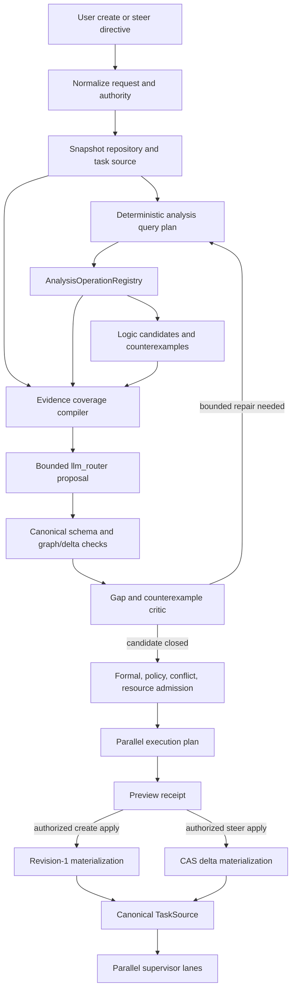

# Codebase-Aware Plan Creation and Steering Plan

> **Execution status:** This document remains the design basis for
> codebase-aware create/steer semantics, but its proposed `ASI-172` through
> `ASI-185` delivery aliases are retired because the live ASI board later
> reused some of those identifiers. Execute the collision-free `ASE-G…` /
> `ASE-…` objective and task population in
> [`AGENT_SUPERVISOR_PROMPT_ONLY_ENTRYPOINTS_PLAN.md`](AGENT_SUPERVISOR_PROMPT_ONLY_ENTRYPOINTS_PLAN.md),
> [`agent_supervisor_prompt_only_entrypoints.objectives.md`](agent_supervisor_prompt_only_entrypoints.objectives.md),
> and
> [`agent_supervisor_prompt_only_entrypoints.todo.md`](agent_supervisor_prompt_only_entrypoints.todo.md).

## Outcome

Extend the existing prompt-driven supervisor workflow into two explicit,
codebase-aware tool families:

1. **create a new plan** from a user directive, an allowlisted repository
   scope, current code and task-source state, registered analysis, and
   non-authoritative logic results; and
2. **steer an existing plan** by proposing and atomically applying a bounded
   delta against an exact plan/task-source revision without rewriting accepted
   history or mutating work already claimed by a lane.

Both families use `llm_router` only to propose strict goal, subgoal, task, and
delta records. Deterministic code owns scanning, analysis/logic queries,
identity, policy, graph validity, parallel schedulability, authorization,
materialization, lifecycle safety, and completion.

This is a successor to
`AGENT_SUPERVISOR_PROMPT_BOOTSTRAP_AND_RESCUE_PLAN.md`, not a replacement for
it. The existing scanner, prompt planner, admission pipeline, Markdown and
DuckDB task sources, control catalog, conflict graph, resource scheduler, and
usage-aware provider gateway remain the implementation foundations.

## Current baseline and residual gaps

The repository already has a substantial prompt-to-taskboard implementation.
The remaining work is integration and contract closure.

| Area | Existing implementation | Residual gap |
| --- | --- | --- |
| New-plan workflow | `PromptSupervisorService.preview`, `materialize`, and `start` | Public naming is workflow/bootstrap-oriented; there is no first-class create-plan revision contract |
| Steering | Objective refine/reconcile primitives and event-driven replanning exist | There is no user-facing, revision-bound `PlanDelta` workflow for an existing materialized plan |
| Repository scan | `PromptDirectoryScanner` captures the dirty tree, AST/program behavior, interfaces, tests, docs, policy, exclusions, and content-addressed evidence | Registry analysis is an injected `optional_analysis`; the default service supplies `None`, so normal tool use does not query the analysis or logic registry |
| Analysis and logic | `AnalysisOperationRegistry` exposes symbol impact, GraphRAG retrieval, premise selection, contradiction search, logic translation, proof-candidate analysis, and counterexample-candidate analysis | No deterministic query planner connects a plan request or steer directive to those operations and no coverage receipt proves that required queries ran |
| Model proposal | `prompt_goal_planner.py` calls `llm_router` with a strict schema and deterministic fallback | It is single-pass plan generation; there is no bounded critique/query/repair loop and no strict delta schema |
| Goal/task schema | Content-addressed goals/tasks include parents, dependencies, evidence, outputs, validation, priority, track, bundle, lane, resource class, and predicted files | Records do not carry the complete conflict, resource, lease, retry, merge, validation-DAG, or readiness contract needed to prove safe parallel execution |
| Graph admission | One connected goal tree, goal/task DAGs, evidence references, policy roots, and formal admission are validated | Admission does not prove achievable ready width, resource feasibility, conflict-free waves, merge order, or that every leaf goal has a closed producer population |
| Task sources | Markdown and DuckDB share canonical task identities, status CAS, revisions, events, and cursors | Materialization is append-oriented; steering needs an atomic, history-preserving revision delta across both projections |
| Controls | Shared Python/control-plane, CLI, and MCP operations expose workflow preview/materialize | There are no create/steer preview/apply operations with identical schemas and stale-revision behavior |
| Runtime adoption | Supervisors can execute materialized tasks in multiple lanes | The daemon does not require a canonical parallel execution plan or reject caller-authored lane labels that are not actually schedulable |

## Non-negotiable invariants

1. **Two user intents, four authority boundaries.** Create and steer are the
   two user-facing tool families. Each has a proposal operation and a separate
   authorized mutation operation.
2. **The current tree is always scanned.** A stored plan, `HEAD`, prose
   description, model memory, or prior scan is never accepted as current
   codebase evidence.
3. **Analysis and logic are queried through the registry.** Planning code does
   not import or call `ipfs_datasets_py` directly. Capability negotiation,
   provenance, bounds, fallback, and lazy loading stay centralized.
4. **Logic is advisory.** Premises, translations, proof candidates,
   contradictions, and counterexamples can create obligations or reject a
   candidate, but cannot authorize an effect or prove completion.
5. **The model proposes only canonical data.** It cannot emit shell commands,
   mutate a board, select its own authority, hide uncertainty, or mark work
   complete.
6. **Steering is additive and revisioned.** A steer creates a child plan
   revision and a durable delta. It never erases an earlier plan, task,
   attempt, receipt, validation, or accepted output.
7. **Claimed work is immutable.** Completed tasks and accepted evidence are
   immutable. Running/claimed/settling tasks retain their exact specification;
   steering may add a successor or request a separate lifecycle action.
8. **Parallelism is compiled, not asserted.** A `parallel_lane` string is a
   hint. Only a deterministic dependency, conflict, resource, lease, and merge
   projection can make a task schedulable.
9. **Every task closes a goal obligation.** Every leaf goal has producing
   tasks or a typed closed producer population; every task has acceptance,
   validation, output/effect, evidence, and completion-authority rules.
10. **One canonical plan, multiple lossless projections.** Python, CLI, MCP,
    Markdown, and DuckDB preserve the same CIDs, revision ancestry, graph,
    delta, execution plan, and receipts.
11. **Every mutation is CAS- and fence-bound.** Apply operations bind the base
    plan root, task-source identity and revision, event cursor, current dirty
    tree, policy/IR roots, lease, fence, expected effects, and idempotency key.
12. **Provider use is budgeted.** Scanner, analysis, logic, model, repair, and
    validation stages receive child budgets and use the shared endpoint-aware
    provider gateway when remote capacity is required.

## Public tool and operation model

The operator experiences two tool families:

```text
plan create: preview -> apply -> optional start
plan steer:  preview -> apply -> supervisor observes new revision
```

Preserve the proposal/mutation boundary in every transport:

| Operation | Authority | Purpose |
| --- | --- | --- |
| `plan_create_preview` | proposal | Scan, query, generate, repair, admit, and return a new canonical plan without writes |
| `plan_create_apply` | mutation | Materialize the exact admitted preview as revision 1 |
| `plan_steer_preview` | proposal | Snapshot an existing plan/run, scan current changes, query impacted evidence, and return an admitted `PlanDelta` |
| `plan_steer_apply` | mutation | CAS-apply the exact delta as a child plan revision |

Recommended public names:

- Python:
  `PlanSupervisorService.preview_create`, `apply_create`,
  `preview_steer`, and `apply_steer`;
- CLI:
  `plan-create-preview`, `plan-create`, `plan-steer-preview`, and
  `plan-steer`;
- MCP:
  `agent_supervisor_plan_create_preview`,
  `agent_supervisor_plan_create_apply`,
  `agent_supervisor_plan_steer_preview`, and
  `agent_supervisor_plan_steer_apply`.

The existing `workflow-preview` and `workflow-create` commands remain
compatibility aliases for create-plan behavior during migration. They must
return the same canonical receipts, not invoke a parallel implementation.

## End-to-end architecture



The loop is finite. Request policy fixes maximum scan bytes, analysis
operations, evidence items, logic families, model calls, repair rounds, output
records, latency, tokens, and cost before any provider is invoked.

## Canonical contract set

Add provider-free versioned contracts. Every contract rejects unknown fields,
non-canonical paths, duplicate keys, floats where integer units are required,
unbounded text/collections, inline secrets, and identity mismatches.

### `PlanCreateRequest`

Required fields:

- prompt source CID and redacted source metadata;
- repository ID, allowlisted absolute root, repository-relative scope, and
  expected clean/dirty-tree policy;
- pinned repository root and current dirty-worktree root, or an explicit
  request for the service to observe and return them;
- task-source output kind and locator: Markdown, DuckDB, or both;
- board namespace, alias prefix, and requested initial supervisor profile;
- scan, analysis, logic, planning, parallelism, resource, validation, and
  provider-usage budgets;
- required versus optional analysis operations and logic families;
- policy, IntentIR, LegalIR, SecurityIR, program, capability-catalog, provider
  catalog, and usage-policy roots;
- maximum goals, tasks, graph depth, output paths, ready width, and repair
  rounds;
- fallback policy for unavailable analysis, logic, model, or endpoint capacity.

### `PlanSteerRequest`

In addition to a bounded directive and the policies above, require:

- base admitted plan root and base materialized plan root;
- plan revision and parent revision;
- exact task-source identity, schema, root, projection revision, and event
  cursor;
- supervisor run ID and state/configuration revision when a run exists;
- status population digest and exact references for claimed/running/settling
  attempts;
- accepted output/evidence root and completion revision;
- expected repository and dirty-worktree roots;
- allowed delta operation kinds;
- whether the steer may request a separate cancel/pause/drain operation;
- a maximum affected-goal/task/path population.

A steer request with a stale plan, source revision, cursor, tree, policy,
claimed population, accepted evidence root, lease, or fence fails with a typed
conflict. It is never silently regenerated against newer state.

### `PlanQueryPlan`

The deterministic query planner emits:

- a query ID and request/plan/tree/policy bindings;
- ordered/batched query specifications;
- operation, question, artifact references, scope paths, required capability,
  selected logic family, provider preference, maximum result bytes/items, and
  per-query deadline;
- why each query is required and which goal/task/acceptance slots it may
  support;
- cache key and reuse constraints;
- required, optional, or conditional disposition;
- fallback and failure semantics.

No model chooses provider credentials, raw endpoint URLs, arbitrary corpus
paths, or query authority.

### `PlanEvidenceBundle`

Combine only bounded, body-free records:

- exact scan receipt and selected content-addressed artifacts;
- symbol impact and reverse dependency references;
- GraphRAG/retrieval references;
- interfaces, configuration, tests, policies, taskboards, and current status
  summaries;
- premise, contradiction, translation, proof-candidate, and
  counterexample-candidate results;
- capability/fallback/degradation and provider-usage receipts;
- an evidence coverage matrix;
- truncation and uncertainty debt.

Every record binds repository/tree, objective/plan revision, policy,
operation-spec and producer capability revisions, query ID, provider result,
authority (`scan_advisory` or `diagnostic_candidate`), and cache identity.
Source bodies and model transcripts remain outside the durable receipt.

### `PlanDelta`

Use a closed delta language:

- `add_goal`;
- `supersede_goal`;
- `amend_unstarted_goal`;
- `add_task`;
- `supersede_unstarted_task`;
- `split_unstarted_task`;
- `coalesce_unstarted_tasks`;
- `rewire_unstarted_dependency`;
- `block_unstarted_task`;
- `unblock_task`;
- `reprioritize_unstarted_task`;
- `assign_parallel_contract`;
- `attach_evidence`;
- `record_uncertainty`;
- `request_lifecycle_action`.

Each delta item has:

- stable item key and CID;
- target CID and expected target lifecycle/spec revision when applicable;
- before digest, after canonical record or patch, and effect classification;
- rationale and directive/evidence/logic provenance;
- preconditions, expected effects, rollback/compensation;
- affected goals/tasks/paths;
- dependency/conflict/resource impact;
- whether it is materializable now or deferred until a running task is
  terminal.

Forbidden delta behavior:

- deleting any historical record;
- editing task/goal CID-bearing fields in place;
- changing completed or claimed task specifications;
- changing accepted validation/evidence/output receipts;
- marking tasks complete, accepted, or authorized;
- removing a dependency needed by completed evidence;
- widening repository, policy, provider, resource, or effect authority;
- introducing a cycle, orphan, uncovered goal, alias collision, or
  unschedulable parallel claim.

### `PlanRevision`

Each revision records:

- plan root CID, semantic revision, and parent plan root;
- create or steer origin;
- base/delta/request/scan/query/evidence/admission/execution-plan receipt CIDs;
- task-source identity, projection revision, and event cursor;
- repository, dirty tree, program, policy/IR, catalog, usage, and
  configuration roots;
- complete goal/task/dependency/evidence population digests;
- added, superseded, retained, deferred, claimed, completed, and blocked
  populations;
- materialization transaction and rollback references.

## Codebase and logic query pipeline

### Stage 1: exact local scan

Reuse `PromptDirectoryScanner` and `program_behavior` as the authoritative
local snapshot builder. For create, scan the requested scope. For steer,
compute a current full root plus a bounded delta from the base revision:

- added, modified, deleted, renamed, staged, and policy-admitted untracked
  paths;
- changed symbols/interfaces/configuration/tests/docs/policies;
- reverse dependencies and affected existing task outputs;
- taskboard/objective/status changes and accepted output drift;
- every exclusion, instability, truncation, or unavailable artifact.

A delta scan is an optimization only. Admission still binds a verified current
full root.

### Stage 2: deterministic analysis-query planning

Build `PlanAnalysisQueryPlanner` over the registered operation catalog. It
selects from the existing operations:

- `symbol_impact` for definitions, callers, imports, public interfaces, and
  reverse impact;
- `graph_rag_retrieval` for bounded code/document/test/policy relationships;
- `premise_selection` for candidate invariants and preconditions;
- `contradiction_search` for conflicting requirements and task effects;
- `logic_translation` for typed obligations suitable for deterministic
  admission;
- `proof_candidate_analysis` for candidate validation/proof strategies;
- `counterexample_candidate_analysis` for failure cases and missing
  acceptance criteria.

Query selection is driven by request type, directive concepts, changed paths,
existing task outputs, risk class, and uncovered evidence slots. A fixed
rule-set owns required queries; `llm_router` may suggest additional bounded
queries but cannot suppress required ones.

### Stage 3: registry dispatch and capability policy

Dispatch only through `AnalysisOperationRegistry`:

1. normalize and validate the request;
2. negotiate the exact operation and logic-family capability;
3. prefer deterministic/local producers when policy permits;
4. lazily invoke the optional `ipfs_datasets_py` producer when selected;
5. verify result tree/provenance/capability bindings;
6. record typed success, empty, truncated, unavailable, timeout, cancelled,
   malformed, or degraded outcomes;
7. cache only under the operation's content-addressed reuse rules.

Required query failure is fail-closed unless request policy names a reviewed
deterministic substitute. Optional failure remains explicit uncertainty debt;
it never disappears from the model packet or preview receipt.

### Stage 4: evidence coverage

Before model invocation, create coverage slots for:

- root goal and each subgoal objective;
- each task rationale and scope;
- each output/effect;
- each dependency and precondition;
- each validation and acceptance criterion;
- each predicted path/conflict override;
- each resource/provider requirement;
- each risk, assumption, fallback, and completion rule.

After proposal, re-run coverage against actual records. Missing required slots
become gap queries or an admission rejection. A citation to the prompt alone
cannot support a codebase-state, policy, security, proof, or completion claim.

## Bounded `llm_router` planning loop

Use the shared usage-aware provider execution gateway, with a deterministic
fallback at every model boundary.

### Round 0: deterministic seed

Construct a minimal candidate from the directive, scan, task-source snapshot,
required obligations, and known gaps. This guarantees a bounded fallback and
prevents the model from inventing the entire state space.

### Round 1: candidate proposal

Send only:

- canonical request core and hard bounds;
- compact evidence references and summaries;
- current goal/task/status summary for steering;
- required constraints and evidence coverage slots;
- strict create-graph or delta JSON schema;
- operation/tool capability summaries;
- explicit non-authority, no-shell, no-secret, and no-completion rules.

Reject prose wrappers, unknown fields, invalid CIDs/paths/enums, duplicate
keys, over-limit output, or references outside the supplied population.

### Round 2: deterministic critique

Compile:

- schema/identity errors;
- graph cycles, disconnects, unknown references, and uncovered leaf goals;
- evidence/acceptance/validation gaps;
- changed-code impact omissions;
- logic contradictions/counterexamples;
- output/path conflicts;
- resource/provider infeasibility;
- insufficient ready width or false lane independence;
- lifecycle immutability violations;
- policy/IR/formal-plan failures.

### Round 3: targeted query and repair

Run only the newly justified bounded queries, then ask `llm_router` for a
schema-constrained repair referencing critique IDs. A repair can replace only
rejected candidate records; it cannot alter scanner, registry, policy, or
admission findings.

Repeat until admitted, rejected, or the configured round/budget/deadline limit
is reached. Default maximum: two model proposal/repair calls and one
deterministic fallback. Record every attempt and provider usage receipt.

## Taskboard schema required for parallel work

Introduce `PromptGoalRecord@2`, `PromptTaskRecord@2`, and a compatible
`TaskSourceTask.body` projection. Version 1 remains readable but is upgraded
to conservative defaults and is not treated as parallel-ready without a
compiled execution plan.

### Goal record

Every goal needs:

- `goal_cid`, stable alias/key, schema version, plan root/revision, parent, and
  dependency goal CIDs;
- title, objective, rationale, scope, risks, assumptions, status, and
  lifecycle revision;
- direct child goal CIDs;
- producing task CIDs for a leaf, or a `closed_producer_population` digest;
- acceptance criteria with validation and evidence requirements;
- required evidence kinds, authority levels, freshness, and source policy;
- uncertainty debt and explicit gap-task policy;
- completion authority and proof obligations;
- priority, track, bundle, deadline, and refinement policy;
- provenance linking prompt/directive, scan, analysis/logic, planner, and
  admission receipts.

### Task identity and governance

Every task needs:

- task CID, stable alias/key, schema version, board namespace, plan root and
  revision, parent plan root, goal CID, and dependency CIDs;
- objective, rationale, scope, priority, status, lifecycle revision,
  `is_schedulable`, `review_only`, and typed blocked reason;
- policy/IR/program/catalog/usage roots;
- creation/supersession provenance and immutable predecessor/successor links;
- completion authority and forbidden authority.

### Dependency and correctness contract

Add:

- typed dependency edges: data, code, policy, proof, validation, merge, or
  lifecycle;
- preconditions and postconditions/effects;
- outputs with create/modify/delete effect, media type, ownership, and
  materialization rule;
- validation DAG rather than an unordered command list;
- acceptance criteria linked to validation nodes and evidence slots;
- expected evidence kinds, source authority, freshness, tree binding, and
  post-merge/current-tree requirements;
- uncertainty, fallback, and typed failure policy.

### Conflict and merge contract

Add:

- predicted files, directories, symbols, interfaces, submodules, generated
  artifacts, and taskboard/objective paths;
- read-only, protected, and exclusive path sets;
- conflict policy and explicit `allow_concurrent_with` population;
- exclusive group, shard key, affinity, and anti-affinity keys;
- change budget: maximum files/bytes/symbols and allowed effects;
- merge strategy, merge train/group, ordering constraints, validation after
  merge, and conflict-repair policy;
- generated conflict-surface CID and conflict-wave assignment receipt.

An override never defeats a real protected-path, output-ownership, submodule,
or semantic conflict. It only records a reviewed exception that deterministic
policy independently permits.

### Resource and provider contract

Project the existing `LaneResourceRequirements` fields:

- resource class and stage;
- CPU/process slots, memory, GPU memory, disk, wall time, and child-process
  limits;
- required capabilities and optional hardware affinity;
- provider requirement, endpoint policy class, context tokens, output token
  budget, quota units, cost currency/limit, and maximum provider latency;
- deadline, estimated duration, critical-path value, downstream unlock value,
  queue fairness key, and enqueue sequence;
- validation resource budget distinct from implementation budget.

Zero/unknown quantitative requirements use explicit conservative semantics;
they do not mean unlimited.

### Execution and lifecycle contract

Add:

- implementation capability/profile, never an arbitrary unreviewed shell
  string;
- worktree policy and expected base/merge-target revisions;
- lease scope, lease duration, monotonic fence, and owner identity rules;
- idempotency scope, timeout, progress timeout, heartbeat interval;
- retry count, retryability classes, backoff, circuit-breaker, and
  compensation;
- cancellation behavior and safe-point policy;
- terminal evidence and cleanup requirements.

## Parallel schedulability compiler

Add a deterministic `ParallelPlanCompiler` that consumes the admitted graph,
current task-source state, conflict surfaces, resource policy, provider
capacity snapshot, worktree policy, and requested maximum lanes.

### Required validation

1. Validate goal and task DAGs, parent connectivity, aliases, policy roots,
   and complete references.
2. Prove every leaf goal has a producing population and every producer has
   acceptance/validation/evidence coverage.
3. Compute dependency-ready waves and critical path.
4. Build complete conflict surfaces from paths, symbols, interfaces,
   submodules, generated artifacts, protected paths, historical receipts, and
   explicit exceptions.
5. Reject output ownership collisions and ancestor/descendant path overlap
   that cannot be isolated.
6. Color each dependency wave with the existing canonical conflict projection.
7. Intersect ready width with process, CPU, memory, GPU, disk, validation,
   provider quota/token/cost/context/concurrency, and per-stage limits.
8. Allocate shard, affinity/anti-affinity, exclusive-group, lease, and
   worktree scopes.
9. Emit deterministic execution waves, lane candidates, merge trains,
   post-merge validation gates, and rollback boundaries.
10. Prove replay equivalence from the canonical inputs.

### Admission outcomes

- `parallel_ready`: at least the requested minimum independent width is
  feasible now;
- `parallel_ready_with_capacity_wait`: graph is independent but currently
  constrained by a fresh reset/capacity condition;
- `serial_ready`: correct and schedulable, but true dependencies/conflicts
  require serialization;
- `degraded_parallelism`: safe width is below request and policy allows the
  exact reduced width;
- `unschedulable`: missing resources, unresolved conflicts, incomplete
  metadata, or impossible deadline;
- `review_only`: useful plan output that cannot enter execution.

The compiler rejects “fake parallelism”: multiple lane labels with ready width
one, overlapping exclusive outputs, a single protected taskboard bottleneck,
or resource requirements that cannot coexist.

### `ParallelExecutionPlan`

Persist:

- requested, graph-theoretic, conflict-free, resource-feasible, and admitted
  width;
- critical path and ready-wave population;
- per-wave task CIDs and conflict colors;
- per-task lane candidates, resource lease budgets, and provider envelope
  roots;
- exclusive groups, worktree leases, fence scopes, merge trains/order, and
  post-merge validation;
- capacity snapshot IDs/reset times and stale behavior;
- degraded/blocked reasons;
- compiler policy/version/input root and replay digest.

The supervisor consumes this record as a constraint. It still takes fresh
resource/provider/lease observations at dispatch time.

## Create-plan workflow

`preview_create` performs:

1. normalize and bind the request;
2. observe exact repository, dirty tree, program, policy/IR, catalog, and
   task-source output roots;
3. scan;
4. compile and dispatch required analysis/logic queries;
5. build the evidence coverage matrix;
6. generate/repair a strict goal graph through `llm_router` or deterministic
   fallback;
7. run formal, policy, security, code/effect, quality, conflict, resource, and
   parallel admission;
8. return a body-free preview receipt and artifact handles.

`apply_create` requires the exact preview plus fresh mutation authority. It:

- re-observes every bound root and task-source revision;
- writes intent before effects;
- creates revision 1 in Markdown, DuckDB, or both;
- verifies canonical round-trip and cross-backend parity;
- emits task-source events and an apply receipt;
- optionally hands a separate exact materialization reference to the existing
  start operation.

Starting remains a distinct lifecycle mutation even when a convenience saga
composes the calls.

## Steer-plan workflow

`preview_steer` performs:

1. load and integrity-check the exact base plan and task-source snapshot;
2. partition completed, accepted, claimed/running/settling, unstarted,
   blocked, superseded, and failed populations;
3. observe the supervisor run, attempts, leases, fences, worktrees, merge
   state, and event cursor;
4. scan the current tree and compute impact since the base revision;
5. compile and dispatch directive- and impact-specific analysis/logic queries;
6. generate a strict `PlanDelta`;
7. apply the delta to an in-memory copy;
8. run lifecycle immutability, graph, evidence, formal/policy, conflict,
   resource, and parallel admission on the entire resulting plan;
9. return old root, delta root, candidate new root, exact effects, deferred
   items, and all rejection reasons.

`apply_steer`:

- requires the exact admitted preview, authorization, expected effects,
  idempotency key, lease, and fence;
- CAS-checks plan root/revision, task-source revision/cursor, repository/tree,
  status/claimed population, accepted evidence, policy/IR/catalog/usage roots,
  and supervisor state;
- appends new goal/task/spec records and supersession links;
- updates only mutable lifecycle fields through their existing CAS operations;
- appends the revision/delta/events transactionally;
- atomically commits Markdown/DuckDB parity or compensates/quarantines;
- notifies the event-driven runtime of the new canonical revision;
- leaves claimed tasks unchanged and activates deferred successors only when
  their preconditions become true.

### Steering running work

The steer tool never edits a running task. It may:

- add a successor depending on the running task;
- add a validation or integration task consuming its eventual output;
- defer a supersession until the current attempt is terminal;
- request, but not itself perform, a separately authorized cancel/pause/drain;
- block downstream unclaimed work against the new revision.

If the directive requires stopping work, the preview names the exact lifecycle
operation, target, consequences, and authority needed. Apply does not smuggle
that effect into a taskboard write.

## Atomic materialization and recovery

Extend the task-source transaction model with:

- one intent journal entry containing base root/revision/cursor and complete
  expected effects;
- append-only plan revision, delta, goal/task version, supersession, and event
  records;
- Markdown projection revision and DuckDB transaction ID;
- dual-backend prepare/verify/commit with deterministic compensation;
- crash recovery at every before/after intent, write, fsync/commit, rename,
  event, and receipt boundary;
- exact idempotent replay;
- rollback to the prior active projection without deleting the failed child
  revision;
- quarantine for irreconcilable split-brain or parity failure.

Markdown human-readable fields remain compatible with the current daemon, but
the canonical metadata marker carries the complete v2 records and execution
plan. DuckDB adds normalized revision/delta/execution-plan tables or exact
lossless views.

## Supervisor adoption

Update the canonical `TaskSource` and implementation daemon to:

- load the active plan revision and `ParallelExecutionPlan`;
- reject partial or mixed revisions;
- compute readiness from typed dependencies and status CAS;
- treat caller-authored lane/bundle labels only as hints;
- acquire the compiled worktree/lease/fence scope before publishing a claim;
- take a fresh resource and provider-capacity decision before dispatch;
- preserve fairness and critical-path ordering within safe waves;
- enforce exclusive groups, affinity/anti-affinity, merge train, and
  post-merge validation;
- stop admitting work when its plan revision is superseded unless the task is
  explicitly retained;
- keep claimed work on its original immutable revision;
- emit attempt/result/evidence events bound to task, plan revision, tree,
  lease, fence, provider usage, and validation roots.

ASI-171's fenced worktree lifecycle is a prerequisite for automatic parallel
execution of newly generated plans. Create/steer preview work can land before
that prerequisite; apply-to-running-supervisor and multi-lane rollout cannot.

## Python, CLI, and MCP conformance

All transports use the shared operation catalog and domain service.

Required equivalence fixture:

- identical canonical request bytes;
- identical operation authority and target;
- identical roots, bounds, query plan, graph/delta, execution plan, effects,
  errors, receipts, and cursor behavior;
- identical stale/conflict and idempotent replay outcomes;
- no provider, database, process, repository scan, or secret-store access
  during import, help, or discovery.

CLI/MCP allowlists are server/operator configured. A model-selected tool,
prompt text, tool description, repository file, or caller-provided path cannot
widen them.

## Security and trust boundaries

- Treat prompt text, repository text, comments, docs, taskboards, retrieved
  text, analysis output, logic output, and model output as untrusted.
- Detect repository prompt-injection patterns and preserve them as evidence;
  never interpret them as supervisor policy.
- Exclude credentials, private keys, tokens, `.env`, object databases,
  supervisor state, foreign worktrees, large binaries, and unapproved ignored
  paths.
- Keep raw source and prompt bodies out of durable control receipts, logs,
  metrics, provider-usage events, and taskboard metadata.
- Validate all paths after symlink resolution and again immediately before a
  write.
- Allow only cataloged operations, validation profiles, output effects,
  resource classes, logic families, and provider policy classes.
- Require separate authorization for repository writes, state writes,
  lifecycle actions, validation execution, and provider use where policy
  distinguishes them.
- Never let plan quality, logic confidence, model consensus, passing one test,
  task status, or provider success become completion evidence.

## Observability

Emit bounded, low-cardinality metrics and content-addressed receipts for:

- create/steer requests, admitted/rejected/degraded outcomes, and latency;
- scan files/bytes/truncations/instability;
- analysis/logic operations, cache hits, fallback, unavailable and malformed
  outcomes;
- model proposal/repair/fallback calls and endpoint usage settlement;
- schema/graph/evidence/formal/policy/conflict/resource rejection codes;
- requested versus admitted parallel width, ready width, critical path,
  conflict serialization, capacity wait, and merge debt;
- delta item kinds, affected population, stale conflicts, deferred running
  work, and idempotent replay;
- materialization parity, recovery, compensation, and quarantine;
- execution throughput, starvation, duplicate compute, merge conflicts,
  validation failures, and post-steer terminal outcomes.

Metrics are operational evidence only. High throughput or low token use cannot
prove task correctness or plan completion.

## Validation matrix

### Contract and identity

- unknown/missing fields, duplicate keys, non-canonical JSON/path/CID;
- v1 read/upgrade and v2 round-trip;
- timestamp/status-independent spec identity;
- parent/delta/revision ancestry and supersession;
- secret and oversized payload rejection.

### Scan, analysis, and logic

- tracked/staged/modified/deleted/untracked and unstable worktrees;
- symlink/nested-repository/path escape and exclusion policy;
- default registry wiring without eager optional imports;
- every analysis operation and logic family;
- missing optional provider, timeout, cancellation, truncation, malformed
  provenance, wrong tree, stale capability, cache replay;
- evidence coverage gap generation and required-query failure.

### Model planning

- deterministic fallback equivalence;
- valid create graph and steer delta;
- malformed/prose/over-budget/unknown-field/model-injected output;
- contradiction and counterexample repair;
- bounded rounds, tokens, cost, latency, and provider retries;
- direct-provider-call coverage and usage-receipt propagation.

### Graph and lifecycle

- one root, connected parents, goal/task DAGs, leaf producer closure;
- completed/accepted immutability;
- steering with unstarted, running, settling, failed, blocked, superseded, and
  mixed populations;
- deferred successors and separate lifecycle requests;
- stale tree/plan/source/cursor/status/lease/fence/policy/catalog conflicts.

### Parallel execution

- independent tasks reaching configured lane width;
- dependencies reducing width;
- file/directory/symbol/interface/submodule/generated/protected-path conflicts;
- invalid concurrency override;
- CPU/memory/GPU/disk/process/provider/token/quota/cost/context constraints;
- affinity/anti-affinity, exclusive group, sharding, merge train, and
  post-merge validation;
- fake lane labels and infeasible deadline;
- deterministic replay of waves and resource decisions.

### Materialization and transports

- Markdown, DuckDB, and dual parity;
- append/supersede/CAS/event-watch behavior;
- crash before/after every transaction boundary;
- idempotent replay, rollback, compensation, and quarantine;
- Python/CLI/MCP canonical fixture equivalence;
- lazy help/import/discovery.

### Paired E2E and chaos

Run the same frozen repository/task population through:

- deterministic and model-assisted create;
- deterministic and model-assisted steer;
- serial and six-lane execution;
- mid-run steering;
- endpoint exhaustion/reset/reroute/backpressure;
- analysis/logic/provider/ledger outage;
- supervisor/child crash, PID reuse, stale lease, worktree race, merge
  conflict, task-source split brain, and repository drift.

Require zero scope, secret, identity, policy, authority, lifecycle, usage,
parallelism, worktree, projection, evidence, or completion escapes.

## Rollout

Use independent gates for create and steer:

1. `off`: existing workflow only;
2. `observe`: scan/query/compile metrics, no model and no changed result;
3. `shadow`: generate candidate graph/delta and execution plan, no writes;
4. `assist`: operator reviews preview and separately authorizes apply;
5. `apply`: authorized create/steer materialization, no automatic lifecycle
   changes;
6. `automatic`: policy-approved event/directive steering only after a later
   fresh-root paired report.

Promotion gates:

- canonical transport and projection parity;
- no stale apply, history rewrite, claimed-task mutation, or duplicate effect;
- complete required query/evidence coverage;
- no provider bypass or usage double charge;
- deterministic fallback and bounded degradation;
- predicted parallel width tracks observed safe width;
- no cross-lane worktree disposal, retry loss, starvation, or merge herd;
- equal or better accepted quality within reviewed latency/cost limits.

Any binding, parity, authority, evidence, usage, lifecycle, or worktree safety
regression returns the affected feature to shadow/off immediately. Rollback
does not erase observed receipts or child plan revisions.

## Delivery sequence

Attach the implementation to the existing agent-supervisor self-improvement
board as one successor objective with a closed producer population.

| Task | Deliverable | Can run in parallel with |
| --- | --- | --- |
| ASI-172 | create/steer request, delta, revision, preview, and apply contracts | prerequisite |
| ASI-173 | v2 goal/task/validation/conflict/resource/lifecycle schema and v1 conservative adapter | after ASI-172 |
| ASI-174 | deterministic codebase query planner and evidence coverage | ASI-175, ASI-179 |
| ASI-175 | registry-backed logic query adapter and provenance/fallback policy | ASI-174, ASI-179 |
| ASI-176 | bounded `llm_router` create/delta proposal, critique, and repair loop | after ASI-174/175 |
| ASI-177 | create-plan preview and admission service | ASI-178 |
| ASI-178 | steer-plan snapshot, immutable delta, and preview service | ASI-177 |
| ASI-179 | parallel schedulability compiler and execution-plan receipt | ASI-174/175; joins before apply |
| ASI-180 | journaled create/delta materialization with Markdown/DuckDB parity | after ASI-177/178/179 and ASI-171 |
| ASI-181 | shared control-catalog and Python service operations | after ASI-180 |
| ASI-182 | thin CLI create/steer commands and conformance | ASI-183, ASI-184 |
| ASI-183 | lazy MCP create/steer tools and conformance | ASI-182, ASI-184 |
| ASI-184 | task-source/daemon/scheduler adoption of v2 execution plans | after ASI-179/180 and ASI-171 |
| ASI-185 | paired E2E, adversarial, chaos, rollout, docs, and runbook | final join |

The dependency graph intentionally opens three early lanes after ASI-173,
then two service lanes after planning, and three transport/runtime lanes near
the end. ASI-180 and ASI-184 remain fenced on ASI-171 so taskboard steering
cannot reintroduce the cross-lane worktree race.

## Definition of done

The work is complete only when:

- a user can preview and separately apply a new codebase-aware plan;
- a user can preview and separately apply a steer to an exact existing plan;
- normal service construction runs the deterministic scan plus required
  registered analysis/logic queries without direct provider coupling;
- `llm_router` receives bounded evidence, emits only strict proposal-tier
  records, and repairs only within fixed budgets;
- the resulting taskboard contains complete v2 goal/task, conflict, resource,
  lifecycle, evidence, and parallel execution metadata;
- deterministic admission proves the plan is serial-ready,
  parallel-ready/degraded, review-only, or unschedulable with exact reasons;
- steering preserves completed, accepted, claimed, and historical records and
  fails stale;
- Markdown and DuckDB plus Python, CLI, and MCP are canonically equivalent;
- six-lane paired/chaos runs have no authority, usage, worktree, projection,
  retry, evidence, or completion escape;
- automatic steering remains disabled until a later, independent fresh-root
  evaluation passes the published promotion gates.
