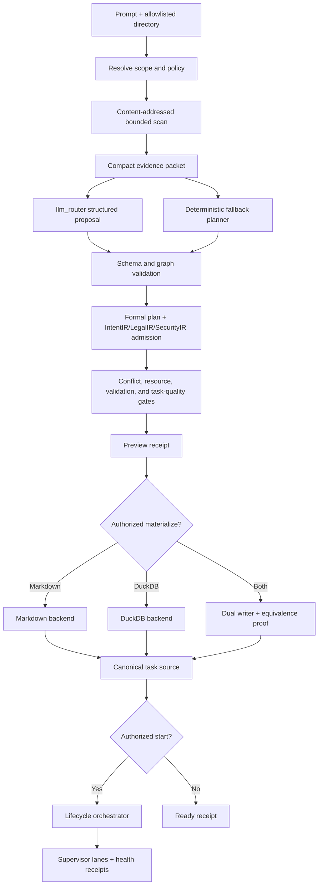

# Prompt-Driven Supervisor Bootstrap and Bounded Rescue Plan

## Outcome

Build one content-addressed workflow that accepts a user prompt and an
allowlisted repository directory, scans that directory, asks `llm_router` for a
strictly structured goal graph, validates and constrains the graph, persists
the same task identities to Markdown, DuckDB, or both, and optionally starts
the `ipfs_accelerate_py` agent supervisor.

The same workflow must be available through:

- a stable Python API;
- the `ipfs-accelerate agent` CLI and a thin `python -m`/script entry point;
- provider-free, lazily discovered MCP tools.

The same control boundary must also expose status, start, stop, restart, and
bounded rescue. Rescue is programmatic first. An `llm_router` fallback may
propose only a closed, typed sequence of existing control operations after
deterministic recovery produces an exhaustion receipt. It never receives
arbitrary execution authority.

## Why this is an integration project

The repository already contains most of the necessary primitives. The work is
to compose them behind one contract, not to create parallel planning, storage,
or control stacks.

| Existing component | Reuse in this plan | Missing integration |
| --- | --- | --- |
| `control_contracts.py` and `control_plane.py` | One operation catalog, shared service, authorization, expected effects, idempotency, CAS, lease/fence, audit, and repair | Prompt workflow, explicit restart, and rescue operations |
| `control_cli.py` | One command per catalog operation | Prompt input conveniences and compound bootstrap UX |
| native agent-supervisor MCP tools | Catalog-driven lazy tool generation | Schemas and conformance fixtures for the new operations |
| `objective_graph.py` and `analysis_pipeline.py` | Bounded repository evidence, AST/retrieval analysis, objective/task records | A prompt-plus-directory bootstrap request and snapshot receipt |
| `objective_daemon.py` and `task_proposal_router.py` | Schema-bounded `llm_router` calls, bounded context, deterministic fallback | Canonical root goal/subgoal/task graph generation |
| `formal_plan_compiler.py` | Goal, subgoal, task, dependency, policy, lease, evidence, JSON, and DuckDB admission | A workflow-specific adapter and round-trip validation |
| `taskboard_store.py` | Locked, journaled Markdown materialization and events | A common task-source protocol and DuckDB implementation |
| `duckdb_state.py`, `artifact_store.py`, `proof_carrying_planner.py` | Lazy DuckDB lifecycle, transactions, content identities, queryable projections | Versioned workflow schema and direct task loading |
| `multi_supervisor_runner.py` and `supervisor_watchdog.py` | Process launch, PID markers, health monitoring, bounded lane restart | One lifecycle orchestrator with canonical receipts |
| `supervisor_recovery.py` and `implementation_supervisor.py` | Typed recovery, stale-attempt cleanup, worktree rescue, quarantine, retry budgets | A unified diagnostic ladder and model-fallback exhaustion gate |
| proof-directed decision runtime | IntentIR, LegalIR, SecurityIR, program-root, context, permit, and effect enforcement | Apply the same admission and permit rules to bootstrap and rescue |

## Non-negotiable design decisions

1. **One domain service, three transports.** Python, CLI, and MCP call the same
   service. A transport may parse input or render output, but it may not invent
   policy, lifecycle semantics, task identities, or rescue behavior.
2. **Preview and mutation are separate.** Scanning and planning return a
   proposal receipt. Materialization and lifecycle changes require separate,
   authorized, idempotent mutation requests.
3. **One canonical graph, multiple projections.** Markdown and DuckDB are
   lossless projections of the same canonical goal and task records. Their
   content IDs, dependencies, acceptance criteria, and validation definitions
   must agree.
4. **Directory access is explicit and bounded.** The target must resolve below
   an allowlisted repository root. Symlink escapes, nested repositories,
   secrets, generated state, object databases, large binaries, and ignored
   vendor trees are rejected or represented only by bounded metadata.
5. **The model proposes; deterministic code admits.** `llm_router` output is
   untrusted proposal-tier data. A schema parser, graph linter, formal-plan
   compiler, IR constraint compiler, conflict/resource analyzer, and task
   quality gate decide whether it can be materialized.
6. **No raw prompt or corpus in durable receipts.** Store a prompt CID,
   redacted bounded summary, source kind, and encrypted/external handle when
   configured. Source bodies and model transcripts stay in bounded artifact
   storage and never become completion evidence.
7. **Programmatic recovery comes first.** An LLM is not called until a typed
   recovery classifier proves that the allowed deterministic steps have been
   attempted or are inapplicable.
8. **LLM rescue is a closed plan, not a shell.** The model can select only
   cataloged operations and exact targets. It cannot provide a command string,
   code patch, new authority, new path, altered policy, or completion verdict.
9. **Every effect is fenced and observable.** Lifecycle and rescue mutations
   bind repository/state roots, process identity, lease, fencing epoch,
   idempotency key, expected effects, preconditions, rollback, and post-effect
   health.
10. **Safe degradation is deterministic.** Missing DuckDB, optional analysis,
    `llm_router`, model credentials, or MCP support yields an explicit local
    fallback or a fail-closed result; import and discovery remain side-effect
    free.

## End-to-end workflow



### Phase 1: request normalization

Define an immutable `PromptWorkflowRequest` with:

- `prompt_source`: exactly one of inline text, file, stdin, or artifact handle;
- resolved `repository_root` and requested `directory`;
- an explicit repository/state allowlist identity;
- scan profile, include/exclude patterns, file/byte/symbol/token/time budgets;
- planning policy, provider/model preference, candidate count, and local
  fallback policy;
- output mode: `markdown`, `duckdb`, or `both`;
- output paths and a board namespace/task prefix;
- objective and task limits;
- requested supervisor profile and state root;
- `dry_run`, `materialize`, and `start_after_materialize` as distinct intent
  fields;
- caller, authority, expected effects, idempotency key, lease, and fence for
  mutations;
- optional pinned IntentIR, LegalIR, and SecurityIR roots.

Normalize paths before hashing. Reject ambiguous prompt sources, unknown
fields, unresolved roots, output paths outside policy, and any mutation
without the normal control-plane authority fields.

### Phase 2: content-addressed directory scan

Build a `DirectoryScanReceipt` over the current worktree, not Git `HEAD`
alone. Reuse the program-behavior root, AST index, analysis cache, retrieval
registry, and objective evidence model.

The scanner should:

- include tracked, staged, modified, deleted, and policy-admitted untracked
  inputs;
- honor explicit scope plus repository ignore policy;
- identify languages, package/build metadata, public interfaces, symbols,
  tests, documentation, current task boards, and relevant policies;
- return bounded summaries and artifact handles instead of source bodies;
- exclude `.git`, supervisor state, worktrees, credentials, key material,
  caches, generated build output, and large binaries by default;
- record every exclusion and truncation reason;
- detect symlink/path escapes, nested repository ambiguity, unstable files,
  and root changes during the scan;
- bind the repository root, dirty-worktree root, scanner policy/version,
  evidence CIDs, AST/index roots, counts, budgets, and truncation state.

The scan output is advisory context. File presence, matching prose, retrieval
rank, and model interpretation do not satisfy code, proof, policy, or
completion requirements.

### Phase 3: structured goal-graph generation

Add a strict `PromptGoalGraph` schema:

- one root goal;
- bounded subgoals with parent and dependency edges;
- tasks with stable local keys before final CID assignment;
- objective, rationale, scope, acceptance criteria, outputs, validations,
  dependencies, priority, track, bundle, parallel lane, resource class,
  predicted files, risks, assumptions, and fallback behavior;
- trace links from every goal/task claim to scan evidence or the user prompt;
- unresolved questions and uncertainty debt;
- provenance for model-generated versus deterministic fields.

Call `llm_router` through the existing bounded helper used by objective/task
planning. Send only:

- the immutable request core;
- the compact scan receipt and selected evidence handles;
- output schema and hard limits;
- relevant operation/tool capabilities;
- pinned IR constraint summaries and required proof handles;
- explicit non-authority and no-shell rules.

Parse strict JSON. Reject prose wrappers, unknown fields, duplicate keys,
cycles, excessive breadth/depth, invalid paths, arbitrary shell actions,
missing acceptance/validation, or references outside the scan roots. Run a
deterministic planner whenever the model is unavailable, malformed, over
budget, or policy-disabled.

### Phase 4: deterministic admission

Admission is an ordered, receipt-producing pipeline:

1. schema and canonicalization;
2. graph connectivity, acyclicity, and stable topological ordering;
3. goal grammar and uncertainty-debt lint;
4. task split/coalesce and acceptance-coverage checks;
5. predicted-file conflict and resource scheduling checks;
6. formal-plan compilation;
7. IntentIR conformance;
8. LegalIR applicability, prohibition, obligation, and conflict checks;
9. SecurityIR authorization/state checks;
10. program/effect scope and proof-obligation checks;
11. validation command policy and output-path checks;
12. canonical ID assignment and round-trip verification.

Hard-domain failures cannot be offset by scores from another domain. Unknown
mandatory applicability, security state, authority, proof, or effect fails
closed. The result is a `PromptWorkflowPreviewReceipt` with admitted and
rejected branches, exact reasons, roots, budgets, provider receipt,
deterministic-fallback state, and expected materialization effects.

### Phase 5: canonical identities

Canonicalize records with sorted keys, normalized paths, explicit schema
versions, and no volatile timestamps in identity bytes.

Recommended identity chain:

- `prompt_cid` over redacted canonical prompt input metadata and separately
  protected prompt bytes;
- `scan_cid` over the directory scan receipt;
- `goal_cid` over the goal excluding mutable status;
- `task_cid` over goal, task specification, dependencies, acceptance,
  outputs, validations, scope, and policy roots;
- `plan_root_cid` over the sorted goal/task/dependency population;
- `projection_cid` over the exact Markdown or DuckDB representation;
- `run_cid` over plan root, supervisor profile, state root, and lifecycle
  request;
- `incident_cid` and `rescue_plan_cid` for recovery deduplication.

Human-readable IDs such as `ASI-142` remain stable aliases. The CID is the
primary identity used across projections, task queues, receipts, caches, and
recovery.

## Markdown and DuckDB task storage

### Common task-source protocol

Introduce a small `TaskSource` protocol used by the implementation daemon:

- `snapshot() -> TaskSourceSnapshot`;
- `list_tasks(status, cursor, limit)`;
- `get_task(task_cid_or_alias)`;
- `ready_tasks(completed_ids, blocked_ids, limit)`;
- `compare_and_set_status(task, expected_revision, status, receipt)`;
- `append_event(event, lease, fence)`;
- `watch(cursor, timeout)`;
- `validate_integrity()`.

Provide:

- `MarkdownTaskSource` as an adapter over `TaskboardStore`;
- `DuckDBTaskSource` with equivalent transaction and event semantics;
- `DualTaskSource` for migration/shadow mode, requiring equivalent canonical
  task populations and applying one fenced logical transaction.

The daemon must consume DuckDB directly. Generating a temporary Markdown file
is useful for compatibility testing but is not sufficient for the requested
DuckDB mode.

### Markdown projection

Keep the current heading/field grammar so existing supervisors can consume it.
Add optional fields for `Task CID`, `Plan root CID`, schema version, and
projection revision. Mutable status and completion metadata do not change the
task CID.

Use the existing file lock, CAS revision, materialization journal, atomic
replace, event cursor, and recovery behavior. Re-rendering the same canonical
graph must be byte-stable.

### DuckDB schema

Use a versioned schema such as `agent_supervisor_workflow/v1`:

```text
workflow_metadata(key, value, value_json)
artifacts(cid, media_type, byte_length, digest, storage_uri, provenance_json)
goals(goal_cid, goal_alias, parent_goal_cid, ordinal, title, body_json)
tasks(task_cid, task_alias, goal_cid, ordinal, status, revision, body_json)
task_dependencies(task_cid, dependency_task_cid, kind)
task_outputs(task_cid, ordinal, path, effect_json)
task_validations(task_cid, ordinal, argv_json, policy_json)
task_acceptance(task_cid, ordinal, criterion, evidence_policy_json)
task_events(event_cid, sequence, task_cid, event_type, body_json)
materialization_receipts(receipt_cid, plan_root_cid, revision, body_json)
```

Also write lossless `formal_plan_input_records` and
`formal_plan_input_metadata` projections, or provide a view with those exact
columns, so `FormalPlanCompiler.compile_duckdb` can independently recompile
the materialized graph.

Requirements:

- primary/unique keys and foreign keys are checked in application code even
  where DuckDB enforcement is limited;
- one fenced writer and many read-only consumers;
- explicit transaction boundaries and monotonic revision/event sequence;
- crash-safe temporary creation followed by atomic installation for new
  databases; transactional updates for existing databases;
- schema migration preview, backup/rollback identity, and compatibility
  matrix;
- bounded query results and cursors;
- no external extension installation or network access during import,
  discovery, or normal local reads;
- deterministic JSON encoding inside flexible columns;
- parity tests proving Markdown -> canonical -> DuckDB -> canonical retains
  exactly the same task CIDs and edges.

## Python API

Expose a lazy public service without importing providers:

```python
service = PromptSupervisorService(control_service=control_service)

preview = service.preview(
    PromptWorkflowRequest(
        prompt_source=PromptSource.inline("Improve retry recovery"),
        repository_root=repo,
        directory=repo,
        output_mode="both",
        dry_run=True,
    )
)

materialized = service.materialize(
    preview_ref=preview.receipt_cid,
    authorization=authorization,
    idempotency_key="...",
)

started = service.start(
    materialization_ref=materialized.receipt_cid,
    supervisor_profile="local-parallel",
    authorization=authorization,
    idempotency_key="...",
)
```

A convenience `bootstrap(...)` method may compose preview, materialize, and
start as a receipt-linked saga, but it must not collapse their authority or
rollback boundaries. If a later step fails, prior durable artifacts remain
valid and the result names the exact partial state and safe continuation.

## CLI and Python script

Recommended commands:

```bash
ipfs-accelerate agent workflow-preview \
  --directory /path/to/repository \
  --prompt-file request.md \
  --output-mode both \
  --markdown-path plan.todo.md \
  --duckdb-path plan.duckdb

ipfs-accelerate agent workflow-create \
  --directory /path/to/repository \
  --prompt-file request.md \
  --output-mode duckdb \
  --start

ipfs-accelerate agent restart --repository-root /path/to/repository ...
ipfs-accelerate agent rescue-preview --repository-root /path/to/repository ...
ipfs-accelerate agent rescue --allow-llm-fallback ...
```

Support exactly one of `--prompt`, `--prompt-file`, or stdin. Avoid putting an
inline prompt into process listings by recommending file/stdin for sensitive
requests. Emit JSON by default for machine use and an optional concise human
view. Exit codes distinguish validation rejection, authorization denial,
conflict, unavailable optional capability, partial saga, and unresolved
quarantine.

Provide:

- `python -m ipfs_accelerate_py.agent_supervisor.prompt_workflow`;
- a thin `scripts/ops/agent_supervisor/prompt_workflow.py` wrapper;
- no policy or provider imports in either wrapper.

## MCP tools

Extend the catalog so provider-free discovery generates:

- `agent_supervisor_workflow_preview`;
- `agent_supervisor_workflow_materialize`;
- `agent_supervisor_restart`;
- `agent_supervisor_rescue_preview`;
- `agent_supervisor_rescue`.

The MCP server must be configured with repository and state-root allowlists.
It may not accept a caller-provided arbitrary directory as sufficient
authority. All schemas, bounds, errors, request IDs, event cursors, and effects
must be equivalent to Python and CLI fixtures.

Prompt text is untrusted input and may contain repository instructions that
attempt to widen scope or alter policy. MCP metadata, tool descriptions, or a
model's selection of a tool never grant mutation authority.

## Lifecycle orchestration

Retain existing atomic lifecycle operations and add explicit `restart`.
`workflow-create --start` is a client-side or service-side saga over:

1. `workflow_preview`;
2. `workflow_materialize`;
3. `start`.

Define canonical lifecycle states:

```text
stopped -> starting -> running -> pausing -> paused
running -> draining -> stopped
running/paused/failed -> stopping -> stopped
running/paused/failed -> restarting -> starting
any transient state -> failed or quarantined on bounded recovery exhaustion
```

Each transition:

- resolves exact process-tree identity rather than trusting a PID file;
- checks repository/state roots, lease, fence, revision, and idempotency;
- declares expected process/file/state effects;
- writes intent before the effect and a post-effect receipt afterward;
- has a bounded deadline and compensation path;
- verifies a health window rather than treating process creation as success;
- rejects stale PID reuse, split brain, cross-run signals, and overlapping
  transition attempts.

`restart` is not merely stop followed by an unbound start. Its receipt binds
the old run, termination/fencing proof, preserved configuration, new run,
health window, and partial-failure state.

## Autonomous recovery and rescue

### Incident classification

Build a bounded `SupervisorIncident` from:

- lifecycle/status/health receipts;
- PID and process-tree identity;
- heartbeat and event cursor age;
- task lease/fence state;
- queue/task/attempt status;
- task-source integrity and lock state;
- worktree and merge state;
- bounded log/error fingerprints;
- disk/resource/provider/validation health;
- prior recovery actions and cooldowns.

The incident CID excludes volatile observation timestamps but includes the
semantic failure fingerprint. This prevents repeated model calls for the same
unchanged incident.

### Deterministic recovery ladder

Run the least invasive applicable action first:

1. observe and reconcile stale projections without mutation;
2. repair stale lifecycle state, expired leases, orphaned locks, and consumed
   attempts;
3. retry a task or restart one lane with the original validated configuration;
4. rescue dirty work to a recovery branch and reconcile the worktree;
5. replay validation or merge resolution under its existing bounded policy;
6. quarantine a corrupt task/lane/artifact and reassign independent work;
7. refill/reconcile objectives only when a typed backlog condition permits it.

Every action has typed preconditions, maximum attempts, cooldown, deadline,
expected effects, rollback/compensation, and a fresh post-action health test.
Do not loop indefinitely. If all applicable actions fail or none applies,
emit `ProgrammaticRecoveryExhaustionReceipt`.

### LLM fallback

Only `rescue_preview` may invoke `llm_router`, and only when:

- the caller/policy explicitly allows it;
- the exhaustion receipt is current and incident-bound;
- the incident is not in cooldown or circuit-breaker state;
- prompt/token/latency/cost limits remain;
- bounded redacted evidence is available;
- the selected provider has no mutation authority.

The model receives a closed action catalog and returns `RescuePlan/v1`:

```text
incident_cid
exhaustion_receipt_cid
ordered actions[
  operation_id
  exact target
  typed parameters
  preconditions
  expected effects
  success test
  stop condition
]
rationale references
unresolved risks
```

Reject plans containing shell commands, code patches, new paths, new
credentials, policy edits, task completion, taskboard rewrites, unknown
operations, unbound targets, missing stop conditions, or more actions than
policy permits.

The model plan is still proposal-tier. A deterministic validator:

1. rebinds it to the current incident and exhaustion receipt;
2. checks every operation against the shared catalog and target allowlists;
3. simulates/dry-runs expected effects;
4. compiles current IntentIR, LegalIR, SecurityIR, program, and proof
   constraints;
5. obtains a separate exact execution permit for each action;
6. executes one action at a time with fresh lease/fence/root checks;
7. stops on success, drift, denial, budget exhaustion, or unexpected effect;
8. records a final recovery, partial-recovery, or quarantine receipt.

The fallback cannot authorize itself, change its own bounds, create arbitrary
operations, suppress a denial, or mark a task complete. A repeated unchanged
incident reuses the prior proposal or remains quarantined rather than spending
more model calls.

## Catalog changes

Add atomic operations to the shared catalog:

| Operation | Class | Purpose |
| --- | --- | --- |
| `workflow_preview` | proposal | Scan and create an admitted goal/task proposal without durable taskboard or process effects |
| `workflow_materialize` | mutation | Persist an accepted preview to Markdown, DuckDB, or both |
| `restart` | mutation | Fence an old run and start the same validated profile as one lifecycle transaction |
| `rescue_preview` | proposal | Diagnose, run or account for deterministic recovery, and optionally return a validated LLM rescue proposal |
| `rescue` | mutation | Execute a previously validated, current, bounded rescue plan one action at a time |

Keep existing `status`, `health`, `events`, `start`, `pause`, `resume`,
`drain`, `stop`, `retry`, `cancel`, `quarantine`, `validation_replay`,
`objective_reconcile`, and `backlog_refill`. Rescue composes these operations;
it does not introduce a bypass.

## Observability and receipts

Every workflow emits content-addressed, size-bounded records for:

- normalized request;
- scan;
- provider call/fallback;
- proposal parse and rejection;
- formal and IR admission;
- canonical plan root;
- projection materialization/equivalence;
- lifecycle transition;
- incident diagnosis;
- each deterministic recovery attempt;
- recovery exhaustion;
- LLM rescue proposal and validation;
- each permitted rescue effect;
- post-recovery health or quarantine.

Expose bounded event cursors through all three transports. Metrics should
include scan reuse, prompt and provider tokens, proposal rejection reasons,
materialization latency, projection parity, ready-task width, task acceptance,
idle CPU, incident rate, deterministic recovery success, LLM fallback rate,
repeat-incident suppression, mean time to healthy, quarantines, unexpected
effects, and false recovery claims.

Raw prompts, source bodies, secrets, unbounded logs, and nested receipt graphs
must be referenced rather than duplicated.

## Threat model and failure policy

Required adversarial cases:

- prompt injection in user text, repository files, README, taskboards, and
  model output;
- symlink, relative-path, output-path, nested-repository, and validation
  command escape;
- secret files and credential-like strings in scans, prompts, errors, events,
  and receipts;
- forged CID/digest, schema downgrade, stale preview, changed directory root,
  changed IR root, and cross-repository replay;
- cyclic or orphan goal/task graphs, duplicate aliases, status-dependent task
  identities, and Markdown/DuckDB drift;
- SQL injection through values/identifiers, external DuckDB extension load,
  corrupt database, concurrent writers, partial transaction, and migration
  interruption;
- PID reuse, orphan descendants, split-brain runners, stale heartbeat,
  overlapping restart, signal escape, and state-root mismatch;
- model-proposed shell commands, policy weakening, authority escalation,
  completion forgery, endless restart loops, repeated equivalent incidents,
  and rescue after roots change;
- unavailable model/provider/DuckDB/MCP/ipfs_datasets dependencies;
- crash at every intent/effect/receipt boundary.

Default behavior is deterministic fallback for proposal generation when safe,
and fail-closed quarantine for ambiguous mutation/recovery authority.

## Test strategy

### Contract and property tests

- canonical request/graph/receipt round trips;
- stable IDs under map/order/timestamp/status variation;
- graph acyclicity, closure, task coverage, and boundedness;
- path, symlink, secret, and prompt-redaction invariants;
- model parser fuzzing and unknown-field rejection;
- Markdown/DuckDB equivalence and mutation CAS properties;
- operation-catalog exact coverage and transport conformance;
- lifecycle state-machine and idempotency properties;
- rescue plan closed-vocabulary and permit properties.

### Integration tests

- prompt -> scan -> deterministic plan -> Markdown -> supervisor-ready;
- prompt -> `llm_router` -> DuckDB -> direct ready-task loading;
- dual materialization and exact CID equivalence;
- Python/CLI/MCP preview and mutation fixture parity;
- preview staleness after worktree/IR/policy change;
- start, stop, restart, partial start, and restart compensation;
- stale PID, orphan process, stale lease, lock, corrupt board/DB, dirty
  worktree, provider loss, validation failure, and merge interruption;
- deterministic recovery success without a model;
- programmatic exhaustion -> LLM proposal -> deterministic admission ->
  permitted recovery;
- malicious LLM proposal rejection and circuit breaking.

### End-to-end and chaos gate

Run the same frozen prompt/repository fixtures through Markdown and DuckDB and
prove identical admitted task graphs and terminal supervisor outcomes. Inject
crashes before and after every lifecycle/recovery effect. Require no
cross-root effects, no duplicate accepted task, no unfenced process, no
completion from model claims, bounded retries/model calls/storage, and a
typed recovery or quarantine result for every injected failure.

## Rollout

1. **Contracts only:** request, graph, receipt, task-source, incident, and
   rescue-plan schemas; no live mutations.
2. **Local preview:** deterministic and shadow `llm_router` proposal generation
   with admission receipts.
3. **Markdown materialization:** use the existing supervisor path and compare
   against hand-authored boards.
4. **DuckDB shadow:** write/read DuckDB, mirror Markdown, and require exact
   graph parity.
5. **Direct DuckDB assist:** one supervised task source at a time with
   automatic fallback to the verified Markdown projection.
6. **Lifecycle assist:** cataloged start/stop/restart with operator-requested
   mutations and post-effect health windows.
7. **Programmatic auto-recovery:** bounded deterministic ladder, quarantine,
   and circuit breaker.
8. **LLM rescue shadow:** proposals only, compared with operator decisions.
9. **Policy-approved rescue assist/automatic:** execute only independently
   admitted catalog operations; any authority, root, parity, effect, or safety
   regression returns the affected feature to shadow/off.

Promotion requires a later evaluation on a fresh repository root. Task
completion, a successful demo, model confidence, process liveness, or a
passing happy-path test is insufficient.

## Delivery goal graph

The executable ASI-G400 tree is appended to:

- `agent_supervisor_self_improvement.objectives.md`;
- `agent_supervisor_self_improvement.todo.md`.

The dependency shape is:

```text
contracts
  -> bounded scan
  -> structured generation
  -> admission
      -> Markdown backend ----\
      -> DuckDB backend -------+-> task-source parity
                               +-> dual equivalence
  -> control catalog ----------+-> Python workflow
                                  -> CLI
                                  -> MCP
  -> lifecycle orchestration
      -> deterministic diagnosis/recovery
          -> LLM rescue proposal
              -> permitted rescue executor
                  -> automatic unstall integration
all paths -> adversarial E2E, rollout, and documentation
```

The initial tranche is intentionally limited to fewer than 24 tasks and uses
separate predicted-file lanes so the existing conflict scheduler can safely
parallelize independent Markdown, DuckDB, lifecycle, and transport work.

## Definition of done

The project is complete only when:

- one prompt and directory produce a bounded, traceable, formally admitted
  goal/subgoal/task graph;
- the same graph is directly consumable from Markdown or DuckDB with identical
  task CIDs and dependency readiness;
- Python, CLI, the Python script/module, and MCP produce schema-equivalent
  results and effects through the shared service;
- preview/materialize/start are distinct, replay-safe, resumable steps;
- start, stop, restart, status, health, and event behavior is process-tree
  aware, fenced, idempotent, and receipt-backed;
- deterministic recovery autonomously repairs every supported injected fault
  or reaches bounded quarantine;
- an optional `llm_router` rescue proposal is invoked only after current typed
  exhaustion, can select only closed catalog actions, and cannot self-authorize
  or execute arbitrary commands;
- every rescue action receives a fresh independent permit and post-effect
  verification;
- repeated unchanged incidents do not generate infinite retries or model
  spend;
- missing optional dependencies degrade explicitly without import/discovery
  side effects;
- adversarial and chaos gates have zero scope, authority, identity, task,
  lifecycle, completion, or mandatory-evidence escapes.
