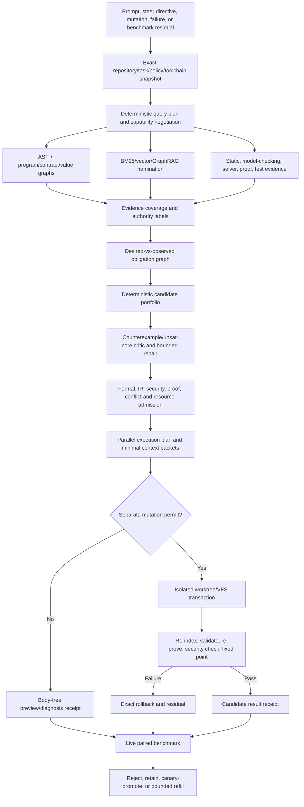

# Proof-Directed Planner and Doctor Self-Improvement Plan

Status: implementation-ready seed plan

Program prefix: `PDR-`

Board namespace: `agent-supervisor-proof-directed-planner-doctor-v1`

Audited baseline: `origin/main` at
`f25e5719cb738a50fb96bac4bea3f66ebca9800b` (2026-08-01)

Companion machine inputs:

- `agent_supervisor_proof_directed_planner_doctor.objectives.md`
- `agent_supervisor_proof_directed_planner_doctor.todo.md`
- `config/agent_supervisor_proof_directed_planner_doctor_scheduler.json`

## 1. Outcome

Deliver one evidence-bound reasoning and mutation loop in which:

1. the **PLANNER** turns a prompt, steer directive, or proposed code mutation
   into a versioned goal/subgoal/task graph, formal obligations, a
   resource-feasible parallel execution plan, and a separately authorized
   control-plane mutation;
2. the **Doctor** turns observed code, contract, proof, security, runtime, or
   benchmark mismatches into the same obligation, plan, edit, validation, and
   fixed-point contracts;
3. deterministic analysis, retrieval, theorem proving, model checking,
   program synthesis, and exact caches do as much work as their evidence
   permits before an LLM is considered;
4. an LLM receives only a minimal residual problem with exact paths,
   obligations, counterexamples, authority roots, and validation requirements;
5. every candidate change is isolated, impact-closed, re-indexed, re-proved,
   security-checked, transactionally applied, and rolled back on failure; and
6. a live paired benchmark can run baseline and challenger configurations
   unattended, measure clock time, token use, resources, and solution quality,
   and emit bounded successor goals/tasks without letting the candidate edit
   the benchmark, policy, or completion authority.

The program is an integration and production-hardening successor to:

- `AGENT_SUPERVISOR_PROMPT_BOOTSTRAP_AND_RESCUE_PLAN.md`;
- `AGENT_SUPERVISOR_PLAN_CREATE_AND_STEER_PLAN.md`;
- `AGENT_SUPERVISOR_CODEBASE_PROOF_CONTEXT_PLAN.md`;
- `AGENT_SUPERVISOR_PROOF_GATED_CONTRACT_REPAIR_PLAN.md`;
- `AGENT_SUPERVISOR_TACTICIAN_HAMMER_LOGIC_REPAIR_PLAN.md`;
- `AGENT_SUPERVISOR_SELF_IMPROVEMENT_V2_PLAN.md`;
- `LOGIC_FORMAL_VERIFICATION_EXPANSION_PLAN.md`; and
- `FORMAL_VERIFICATION_TACTICIAN_READINESS_PLAN.md`.

It must compose their contracts. It must not create another supervisor,
assurance lattice, proof cache, repository graph, or completion authority.

## 2. Audited progress and residual gaps

The mainline has substantial completed implementation work. Taskboard status
is useful scheduling evidence, but is not objective-completion proof.

| Area | Reusable mainline foundation | Residual production gap |
| --- | --- | --- |
| Prompt to task graph | ASI-142 through ASI-159 are completed; prompt workflow contracts, bounded scan, strict provider JSON, deterministic fallback, admission, Markdown/DuckDB projections, transports, lifecycle, and rescue exist | Normal `PromptSupervisorService` construction leaves `optional_analysis` and `admission_request_factory` unset, so the default path neither runs the reasoning registry nor admits its own plan |
| Planning | Formal plan compiler/validator/conformance, adaptive planner, AND/OR evaluation, formal replanner, failure memory, proof-carrying planner, bundle optimizer, and resource scheduler exist | Prompt planning is single-pass; `candidate_count` is unused; no production query planner, create/steer revision model, or parallel-plan compiler joins these components |
| Create and steer | A detailed successor design exists in `AGENT_SUPERVISOR_PLAN_CREATE_AND_STEER_PLAN.md` | `PlanCreateRequest`, `PlanSteerRequest`, `PlanDelta`, `PlanRevision`, `ParallelExecutionPlan`, and their services do not exist; the proposed ASI task IDs now collide with landed retry tasks |
| Program evidence | AST index, repository indexer, program/call/dependency/value/contract/evidence graphs, BM25/vector/GraphRAG nomination, logic providers, IR adapters, and proof-directed retrieval exist | No default production factory builds one exact, bounded evidence view for planning and Doctor use; required-query coverage is not proved |
| Deterministic Doctor | The RPR and LPR boards contain completed contract-repair, Tactician/Hammer, analytical transform, impact, transaction, fixed-point, policy, rollout, CLI, and release tasks | `DeterministicDoctorService` has injected stage slots but its normal factory and CLI bind none; `--checkout-root` is parsed but not used to build a live evidence snapshot |
| Doctor contracts | Two useful snapshot/finding families exist | The repository-diagnostics and deterministic-Doctor snapshot schemas are incompatible and lack a checked, tamper-resistant bridge |
| Doctor proof | Hammer, proof-cache, reconstruction, and synthesis surfaces exist | Mutation-capable paths can accept caller-supplied mappings/booleans without proving a theorem body through a pinned native solver and independent kernel replay |
| Doctor mutation | Transaction and fixed-point validators, leases, checkpoints, rollback contracts, and sandbox policy exist | Default transaction application can report success without changing bytes; default restore can report true without restoration; fixed-point validation consumes supplied evidence instead of running reparse/static/security/replan/reprove stages |
| Security and attestation | IntentIR, SecurityIR, code-security facts, security contract analysis, hyperproperty verification, proof adapters, and program-analysis ZKP exist | These gates are not joined to every Doctor/planner boundary; ZKP needs a narrow threat model and must not be mistaken for semantic correctness |
| Benchmarks | Prompt workflow, deterministic Doctor, symbolic efficiency, generation-2, proof, token, scheduler, and rollout contracts exist | Doctor and generation-2 producers are synthetic/passive; no live paired runner invokes the real services or attributes process-tree resource use |
| Self-improvement | Bounded epoch, refill, novelty, rollout, and completion contracts exist | The running supervisor does not invoke the epoch controller; refill is disabled in the current Doctor scheduler; no live benchmark receipt can authorize a bounded challenger cycle |
| Import hygiene | Cold-import rules and optional-provider checks exist | A reproduced Doctor service cold-import test still loads `requests`; current release checks do not cover all network-client roots |

The PDR program therefore focuses on live composition, independent evidence
production, trust hardening, and guarded automation. It does not reopen
completed RPR, LPR, CBP, or ASI task identities.

## 3. Normative principles

1. **Planner and Doctor are dual views of one kernel.** The Planner reasons
   backward from desired behavior; the Doctor reasons backward from an
   observed mismatch. Both compile the same typed obligations and produce the
   same plan, edit, validation, execution, and fixed-point records.
2. **Discovery nominates; independent checks admit.** AST, BM25, vectors,
   embeddings, GraphRAG, knowledge graphs, history, invariant mining, and
   model output can nominate evidence or candidates. They cannot authorize a
   write, satisfy a proof, or declare completion.
3. **The current tree is an input, not an assumption.** Every run binds the
   exact superproject, recursive gitlinks, dirty overlay, task-source revision,
   policy/IR roots, capability catalog, toolchains, and provider policy.
4. **Preview and mutation are separate.** Planning, diagnosis, explanation,
   and repair preview are read-only. Apply/repair requires a fresh permit,
   lease, fence, exact roots, expected effects, checkpoint, and rollback.
5. **Candidate evidence cannot certify itself.** A candidate implementation,
   generated test, supplied proof flag, benchmark expectation, or serialized
   receipt cannot act as its own oracle.
6. **Assurance is typed and scoped.** Static findings, bounded observations,
   solver candidates, bounded model checks, kernel proofs, runtime traces, and
   cryptographic attestations remain distinct.
7. **Cache hits re-derive assurance.** A cache is memoization under exact
   semantic keys. It does not upgrade trust or make stale evidence current.
8. **Parallelism is compiled.** Lane labels are hints. Dependency, conflict,
   resource, provider, lease, worktree, merge-train, and validation constraints
   determine admitted width.
9. **Deterministic mode remains model-free.** The existing deterministic
   Doctor keeps LLM, remote-model, remote-embedding, and network flags hard
   off. A separately named hybrid repair path may request bounded residual
   syntax from an LLM but can never inherit deterministic-Doctor authority.
10. **Automatic promotion cannot change its judge.** Candidate work may not
    edit the seed board, objective heap, plan, scheduler policy, holdout
    manifest, hidden oracle, metric denominator, safety floors, or promotion
    policy.
11. **Unknown is not pass.** Missing required capabilities, incomplete impact
    frontiers, unavailable telemetry, skipped live checks, ambiguous
    semantics, and unverified receipts cause abstention or review.
12. **Completion is evidence authority.** Completed task rows are not enough;
    objective completion requires current-tree evidence and an independently
    replayed terminal receipt.

## 4. Shared target architecture



### 4.1 Canonical join records

Prefer checked adapters and versioned extensions over duplicate models.

| Join record | Reuses / extends | Required binding |
| --- | --- | --- |
| `RepositoryReasoningSnapshot@1` | prompt directory scan, repository indexer, Doctor snapshots, program behavior root | superproject/tree/dirty overlay, recursive gitlinks, task-source state, parser/index/toolchain/capability/policy/IR roots, exclusions and truncation |
| `ReasoningQueryPlan@1` | `AnalysisOperationRegistry` and proof-directed retrieval | required/optional query, question, evidence slot, capability, bounds, cache key, fallback, deadline |
| `PlanningEvidenceBundle@1` | analysis results, code evidence graph, proof query, Doctor findings | body-free evidence handles, authority tier, provenance, current-root check, coverage matrix, uncertainty debt |
| `ObligationGraph@1` | formal plan contracts, code proof obligations, logic goals, counterexamples | desired and observed predicates, AND/OR refinements, assumptions, invalidators, proof/validation requirements |
| `PlanRevision@1` and `PlanDelta@1` | prompt goal graph, formal work plan, task-source revision/event models | immutable ancestry, create/steer origin, retained/superseded/deferred population, exact expected effects |
| `ParallelExecutionPlan@1` | conflict graph, bundle optimizer, resource scheduler, worktree lifecycle, merge train | ready waves, admitted width, resources, providers, leases/fences, worktrees, merge ordering, post-merge validation |
| `DiagnosisObligationBridge@1` | repository diagnostics and deterministic-Doctor finding schemas | checked round trip, issue CID, expected/observed contract, causal slice, open frontier, tamper rejection |
| `ReasoningRunManifest@1` | Planner/Doctor/benchmark receipts | exact input/output CIDs and span relationships without collapsing their evidence tiers |

The join layer may reference large artifacts by CID. It must not copy source,
proof transcripts, prompts, secrets, or complete graph bodies into control
receipts.

### 4.2 Planner/Doctor duality

| Concern | PLANNER | Doctor | Shared mechanism |
| --- | --- | --- | --- |
| Starting fact | Desired intent/control-plane change | Observed mismatch/failure | exact repository reasoning snapshot |
| Primary inference | Backward chaining and abductive gap analysis | Causal localization and contract delta | typed obligation graph |
| Search | HTN/partial-order/AND-OR plan portfolio | repair operator/synthesis portfolio | hard-constrained adaptive evaluator |
| Negative evidence | Plan critic, contradiction, infeasible resource/conflict | counterexample, unsat core, failing trace, open caller frontier | formal replanner/failure memory |
| Output | plan revision and parallel execution plan | repair plan expressed as a plan revision/delta | formal plan, edit packet, permits |
| Success condition | admitted preview or applied revision | renewed program+logic+security fixed point | independent current-tree receipts |

## 5. Reasoning and analysis strategy

### 5.1 Deterministic strategy registry

Introduce a closed, capability-negotiated strategy registry. The registry
routes a property/question class to existing local or optional providers and
records unavailable support explicitly. It does not require every technique
to be installed before report-only operation.

| Property/question | Preferred methods | Authority and use |
| --- | --- | --- |
| Syntax, symbols, imports, calls | Python AST and Tree-sitter multi-language parsing; symbol/call indexes | structural evidence under exact blob/parser roots |
| Control and data flow | CFG, SSA, PDG, reaching definitions, def-use, interprocedural summaries | exact when supported; otherwise open frontier |
| Aliasing and state | points-to/alias analysis, typestate, ownership, escape/effect analysis | candidate or checked fact according to provider certification |
| Values and security flow | taint, information-flow/noninterference, provenance, nullness/range abstract domains | static finding; hyperproperty proof when required |
| Contracts | interface/schema/config/build/API diff, pre/postconditions, invariants, weakest preconditions, Hoare triples | obligations and checked counterexamples |
| Heap/native safety | separation logic, lifetime/ownership tools, CBMC/KLEE/angr or language-specific checkers | required capability for in-scope claims; otherwise approval/abstain |
| Recursive invariants | abstract interpretation, CHC/Horn clauses, Datalog, CEGAR/PDR | bounded or solver evidence with exact assumptions |
| Constraint solving | SAT/SMT/MaxSAT, Z3/CVC5, Tactician/Hammer, CEGIS | candidate search followed by native reconstruction |
| State/concurrency | TLA+/TLC/Apalache, temporal logic, race/deadlock/atomicity analysis | bounded model-check or certified proof with recorded bounds |
| Protocol/security | Tamarin/ProVerif, SecurityIR, authorization Datalog/SecPAL, hyperproperties | fail closed for required forbidden/authorization properties |
| Behavioral tests | property-based, fuzz, concolic, mutation, differential and metamorphic testing; sanitizers | independent bounded observations; never theorem substitution |
| Runtime contracts | temporal monitors, invariant mining, trace comparison, delta debugging | diagnostic candidates and regression evidence |
| Rewrite/synthesis | reviewed templates, semantic patches, e-graphs/equality saturation, superoptimization, enumerative/constraint synthesis | candidate code only until all gates pass |
| Supply chain | SBOM, lockfile/reproducible-build/SLSA checks, OSV/pip-audit or equivalent scanners | security and reproducibility evidence under pinned databases/tool versions |
| Retrieval | BM25, vectors, embeddings, GraphRAG, history and KG neighborhoods | nomination/ranking only |
| Formal kernels | Lean, Rocq/Coq, Isabelle or other certified kernels from the prover matrix | kernel assurance only after exact theorem replay |
| Cryptographic lineage | CIDs/Merkle proofs, signatures, optional ZKP | integrity/privacy/computation attestation, not arbitrary code correctness |

Required-provider absence causes a typed abstention. Optional-provider absence
adds uncertainty debt and may reduce recall, but may not silently change a
claim from unknown to true.

### 5.2 Query planning and evidence coverage

The deterministic query planner chooses queries from:

- request type and directive concepts;
- changed paths/symbols/contracts and reverse dependencies;
- risk and security class;
- uncovered goal/task/acceptance/validation/output slots;
- proof obligations and failed assumptions;
- Doctor causal slices, counterexamples, and open impact frontiers; and
- prior failure memory and cache invalidators.

Every required slot has one of:

- current authoritative evidence at its required assurance;
- a scheduled query/proof/validation;
- a reviewed deterministic substitute;
- an explicit review/abstention blocker.

A prompt citation cannot support codebase state, security, resource,
authorization, or completion. A retrieval result cannot satisfy a proof slot.

## 6. Content addressing, caches, and ZKP

### 6.1 Exact identity chain

The repository identity is a forest root over:

- superproject commit/tree and recursive gitlink commits;
- staged, modified, deleted, renamed, and admitted untracked overlay blobs;
- relevant generated/schema/build/config inputs;
- task-source plan revision, status population, accepted evidence, and event
  cursor;
- AST/parser/index/translator/provider/toolchain versions;
- property catalog, premise/assumption set, policy and IR roots;
- capability and provider-use policy snapshots; and
- benchmark manifest, oracle, seed, hardware profile, and cache stratum when
  benchmarking.

Use a semantic computation key equivalent to:

```text
H(
  operation + property + repository_forest + scope + premises + assumptions
  + parser/index/translator + toolchain + provider_capability
  + policy/IR/catalog + required_assurance + bounds
)
```

### 6.2 Cache rules

- Reuse `analysis_cache` for analysis observations.
- Reuse `formal_verification_cache` as the sole proof-receipt memoization
  trust boundary.
- Reuse the artifact/CAS layer for body-free snapshots, plans, patches,
  benchmark manifests, and receipts.
- Use one single-flight coordinator for identical concurrent computation.
- Dependency edges drive delta invalidation; a cache miss is not a refutation.
- Hits must reload source receipts, recompute preimages/CIDs, validate current
  roots and assurance, and expose hit/reject reason codes.
- Secrets/private witnesses never enter public keys, logs, taskboards, or
  receipts.

### 6.3 ZKP boundary

ZKP is optional and late-gated. An approved threat model may use it to attest:

- execution of a fixed bounded circuit/program against committed inputs;
- possession of a private benchmark witness without revealing it;
- policy-root membership or receipt lineage; or
- correct aggregation of committed counters.

It does **not** establish inventory completeness, translator soundness,
arbitrary Python semantics, a theorem not encoded in the circuit, or
completion. Simulated ZK never emits production `ATTESTED` assurance.

## 7. PLANNER workflow

1. Normalize a create or steer request with exact scope, authority, budgets,
   non-goals, policy/IR roots, and task-source expectations.
2. Build the exact repository/task-source snapshot.
3. Compile and run required analysis/logic queries through the registry.
4. Build an evidence coverage matrix and explicit uncertainty debt.
5. Compile desired behavior and current facts into an AND/OR obligation graph.
6. Generate a deterministic seed portfolio using templates, backward
   chaining, HTN/partial-order planning, proof feasibility, failure memory,
   conflict/resource constraints, and expected information gain.
7. If policy allows, request bounded LLM candidates only for residual
   semantics/syntax not closed by deterministic methods.
8. Run deterministic critique: graph/coverage defects, contradictions,
   counterexamples, unsat cores, impact omissions, policy/IR violations,
   conflict/resource infeasibility, and false parallelism.
9. Run bounded query/repair rounds. A repair may alter only rejected proposal
   records.
10. Independently compile and validate the formal plan, proof/security
    obligations, and parallel execution plan.
11. Emit a body-free preview. Create/steer apply is a separate CAS/fenced
    transaction against fresh roots.

Steering is append-only. Completed, accepted, claimed, running, and historical
records are immutable. A running task may gain a successor or deferred
supersession, but its specification is not edited in place.

## 8. Doctor workflow

1. A production composition root enumerates the allowlisted checkout and
   builds the canonical snapshot without importing target code.
2. Diagnosis compares observed behavior with reviewed contracts, formal-plan
   effects, IntentIR/SecurityIR constraints, tests, runtime evidence, and
   current proof obligations.
3. Causal localization uses contract deltas, dynamic/static slices, dependency
   and value provenance, delta debugging, counterexamples, and minimal unsat
   cores. Unknown dynamic/native/generated/concurrent frontiers remain open.
4. The diagnosis is converted through a checked bridge into the shared
   obligation graph.
5. Deterministic repair candidates come from reviewed analytical transforms,
   semantic patches, mappings, constructors/adapters, e-graph rewrites, and
   bounded synthesis.
6. Tactician/Hammer/solver candidates require an exact theorem body, current
   roots, pinned toolchain, independent native reconstruction, and sealed
   receipt-store replay before mutation authority.
7. An explicitly hybrid, approval-gated path may ask an LLM for residual code
   only after behavior, target, paths, values, obligations, and validation are
   fixed. The deterministic Doctor never invokes it.
8. Candidates are applied to a disposable worktree/VFS overlay. The runtime
   independently rereads changed bytes and proves before/after blob/tree CIDs.
9. Property, mutation, differential, metamorphic, fuzz, static, security,
   proof, and impact-selected validation select or reject candidates.
10. A writer lease, checkpoint, ref CAS, atomic impact/SCC transaction, and
    compensating rollback govern any target mutation.
11. The live fixed-point runner reparses, re-indexes, invalidates, re-diffs,
    recloses impact, rechecks security, replans, revalidates, and re-proves.
    Second-order defects trigger another bounded iteration.
12. Failure, ambiguity, oscillation, resource exhaustion, or open frontiers
    restore exact roots and emit a residual; success emits a current-tree
    fixed-point receipt.

Report-only remains the default. Validators stay pure; live runners produce
the evidence they validate.

## 9. Live benchmark

### 9.1 Paired design

Each case freezes:

- repository forest and seeded mutation;
- prompt/directive and task-source state;
- policy, IntentIR, SecurityIR, property catalog, toolchains and providers;
- tokenizer, model, context/output limits, token/cost budgets;
- cache stratum: cold, exact warm, delta, restart;
- worker limit and hardware profile;
- independent acceptance/quality oracle; and
- deterministic seed and deadline.

Run at least:

1. current mainline baseline;
2. deterministic symbolic Planner/Doctor;
3. hybrid residual-only LLM mode; and
4. relevant subsystem ablations.

Sweep concurrency at `1`, `2`, `4`, and `min(8, admitted_DAG_width)`.
Development and held-out roots are separate. The hidden oracle is mounted
read-only outside candidate worktrees.

### 9.2 Metrics

| Dimension | Required measurements |
| --- | --- |
| Parallelism / clock | end-to-end makespan, critical path, speedup, parallel efficiency, worker occupancy, queue p50/p95, ready/admitted/observed width, merge/conflict serialization, time to first useful counterexample, accepted criteria/hour |
| Token efficiency | provider-native input/output/reused/retry/cancelled tokens, model calls, tokenizer identity, context bytes, cache reuse, tokens and cost per accepted criterion/proved obligation, deterministic LLM-avoidance rate |
| Resources | process-tree user/system CPU, CPU-seconds, peak RSS, GiB-seconds, read/write bytes, disk/artifact growth, process count, GPU utilization, peak VRAM, GPU-seconds, network bytes, provider quota/cost, optional energy estimate |
| Planner quality | first-valid-plan rate, goal/acceptance coverage, unnecessary tasks, dependency precision/recall, critical-path and path/symbol/resource prediction error, correct ready width, replan locality |
| Doctor quality | seeded-defect precision/recall, causal localization, correct abstention, analytical repair rate, convergence iterations, recurrence, blast radius, rollback integrity |
| Solution quality | independent test pass, mutation score, property/fuzz/differential/metamorphic results, proof-obligation coverage, kernel-reconstructed fraction, SecurityIR/IntentIR conformance, API/schema compatibility, patch minimality, flake and post-merge regression rate |

Unavailable telemetry is recorded as `unavailable`, never as zero.

### 9.3 Non-compensable gates

No speed, token, cost, or throughput gain can offset:

- an authority, policy, scope, secret, or path escape;
- a stale/forged/cache/CID/proof admission;
- a missed mandatory consumer or open required impact frontier;
- a security/IntentIR prohibition;
- a hidden-oracle or benchmark mutation;
- a partial transaction, false fixed point, rollback failure, or false
  completion;
- lower solution quality outside a preregistered non-inferiority margin; or
- a synthetic/skipped observation used as live promotion evidence.

Initial ASI efficiency targets remain useful diagnostics (for example stable
prefix reuse, cache reuse, duplicate-compute, retry-token, idle-CPU and
throughput targets), but promotion uses paired current-tree evidence and
quality/safety hard gates rather than one scalar score.

## 10. Unattended improvement controller

The finite state machine is:

```text
BASELINE
  -> PROPOSE (bounded goal/task delta)
  -> SHADOW (isolated challenger)
  -> EVALUATE (paired live receipts)
  -> REJECT | RETAIN | CANARY
  -> CURRENT-TREE RECHECK
  -> PROMOTE | ROLLBACK
  -> REFILL or STOP
```

Per epoch:

- at most 8 successor goals and 24 tasks;
- fixed wall, CPU, memory, GPU, disk, token, provider-cost, process and
  storage budgets;
- bounded model calls, candidates, proof routes, repair rounds and fixed-point
  iterations;
- novelty/deduplication and unchanged-failure cooldown;
- one challenger branch and isolated state/worktrees;
- exact baseline restoration and no-op replay; and
- stop on safety violation, quality regression, repeated residual, no admitted
  improvement, telemetry/oracle loss, rollback failure, or exhausted budget.

The protected seed plan/objectives/taskboard/config are read-only. Automatically
discovered work is written to a separate CAS/DuckDB runtime task source with
its own admission receipts. It cannot rewrite the seed population to make
itself appear complete.

Promotion progresses independently:

```text
off -> observe -> shadow -> assist -> canary -> automatic
```

`automatic` remains disabled in the seed configuration. It requires a later
independent held-out evaluation on a fresh current tree, zero safety-floor
violations, complete live telemetry/oracle evidence, quality
non-inferiority, and a Pareto improvement under the configured resource
ceilings.

## 11. Parallel delivery shape

The companion board carries exact dependencies. Expected concurrency is:

```text
W0  PDR-000
W1  PDR-001 | PDR-002 | PDR-003
W2  PDR-010 | PDR-012 | PDR-015 | PDR-020
W3  PDR-011
W4  PDR-013 | PDR-014
W5  PDR-021 | PDR-040 | PDR-041
W6  PDR-022 | PDR-026 | PDR-042
W7  PDR-023 | PDR-043 | PDR-050
W8  PDR-024 | PDR-052
W9  PDR-025 | PDR-027 | PDR-051
W10 PDR-028 | PDR-030 | PDR-053
W11 PDR-031 | PDR-054 | PDR-060
W12 PDR-032
W13 PDR-033
W14 PDR-055 | PDR-071
W15 PDR-072
W16 PDR-070
W17 PDR-080
W18 PDR-081
W19 PDR-082
W20 PDR-090
W21 PDR-091
W22 PDR-092
```

The scheduler may start a task earlier whenever its actual dependencies are
complete and file/resource conflict checks pass. The wave display is not
authority.

## 12. Supervisor ingestion and bootstrap

The companion taskboard uses stable `## PDR-###` headings and the existing
legacy Markdown task-source fields. The objective heap uses parent goal IDs,
so every `PDR-G010` through `PDR-G100` goal is a subgoal of `PDR-G000`.

Before implementation:

1. check out the target mainline tree in a clean worktree;
2. validate goal/task IDs, references, dependencies, acyclicity, and the
   initial ready set;
3. protect the plan, objective heap, seed taskboard, scheduler config, holdout
   manifest, oracle, and promotion policy;
4. run one `--once`/no-implementation parse pass;
5. use isolated state, worktrees, one merge queue, and a maximum of six
   implementation lanes for the seed program;
6. keep Doctor mutation and self-promotion off while foundation tasks run; and
7. enable derived refill only after `PDR-081`, and only into the separate
   runtime task source.

The generic implementation daemon can consume the seed board with:

```bash
python -m ipfs_accelerate_py.agent_supervisor.todo_daemon.implementation_daemon \
  --once \
  --todo-path docs/architecture/agent_supervisor_proof_directed_planner_doctor.todo.md \
  --task-source-kind legacy-markdown \
  --task-prefix "## PDR-" \
  --objective-path docs/architecture/agent_supervisor_proof_directed_planner_doctor.objectives.md \
  --state-dir data/agent_supervisor/proof_directed_planner_doctor/bootstrap \
  --implementation-protected-path docs/architecture/AGENT_SUPERVISOR_PROOF_DIRECTED_PLANNER_DOCTOR_PLAN.md \
  --implementation-protected-path docs/architecture/agent_supervisor_proof_directed_planner_doctor.objectives.md \
  --implementation-protected-path docs/architecture/agent_supervisor_proof_directed_planner_doctor.todo.md \
  --implementation-protected-path config/agent_supervisor_proof_directed_planner_doctor_scheduler.json
```

This command is intentionally read-only because it omits `--implement`.
`PDR-091` owns the validated multi-lane launcher and lifecycle runbook; the
seed scheduler configuration keeps automatic promotion disabled.

## 13. Definition of done

The PDR program is complete only when:

- default create/steer planning performs an exact scan, required registered
  analysis/logic queries, evidence coverage, deterministic candidate search,
  formal/IR/security/proof admission, and parallel-plan compilation;
- Python, CLI, MCP, Markdown, and DuckDB preserve one canonical create/steer
  revision and fail stale without process-local continuation dependence;
- the ordinary Doctor service/CLI builds a live snapshot from
  `--checkout-root`, runs all configured stages, and needs no caller-supplied
  findings, proof flags, plans, or fixed-point evidence;
- incompatible Doctor snapshot/finding schemas have checked bridges and
  tampered records fail;
- mutation authority requires a real theorem body, pinned solver/toolchain,
  independent kernel replay, typed sealed receipt provenance, and current
  roots;
- an eligible repair changes actual bytes only inside an isolated worktree/VFS
  overlay before authorized transaction, and rollback restores exact
  blob/tree/ref identities;
- the live fixed-point runner independently reparses, re-indexes, recloses,
  rechecks security, replans, revalidates, and re-proves;
- IntentIR/SecurityIR prohibitions and required security/hyperproperty checks
  are enforced at planning, pre-render, pre-commit, and fixed point;
- live benchmarks invoke real Planner and Doctor services on hermetic
  repositories, use independent oracles, measure actual process-tree/token/
  resource data, and never derive outcomes from fixture expectations;
- the supervisor lifecycle invokes bounded shadow epochs, emits derived tasks
  to the separate runtime source, and deterministically stops or rolls back;
- no synthetic, skipped, stale, forged, self-validating, or candidate-authored
  evidence can promote a challenger;
- a later independent held-out current-tree report passes all safety and
  quality gates before automatic mode is enabled; and
- the final completion receipt replays from current source evidence and does
  not infer objective completion from completed task counts.
