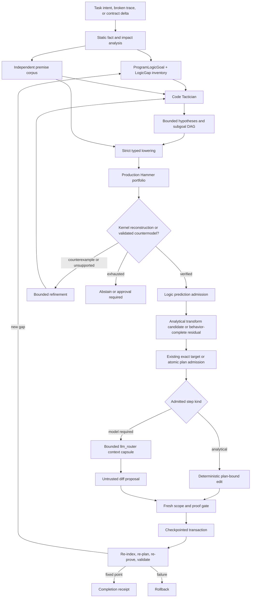

# Agent Supervisor Tactician-Hammer Logic Repair Plan

Status: implementation-ready successor plan
Program prefix: `LPR-`
Board namespace: `agent-supervisor-tactician-hammer-logic-repair-v1`
Merge target: `agent/proof-gated-contract-repair`
Depends on: completed `RPR-000` through `RPR-047`

## 1. Outcome

Extend `ipfs_accelerate_py.agent_supervisor` from proof-gated repair of a
caller-supplied contract problem into a live, proof-guided repair controller
that can:

1. discover a broken or changed code contract;
2. find every statically resolved caller and preserve an explicit unknown
   dynamic frontier;
3. infer the finite logic obligations that a correct repair must satisfy;
4. use a domain-neutral Tactician to plan evidence retrieval, premise
   selection, goal decomposition, and proof-search escalation;
5. use the production `ipfs_datasets_py.logic.hammers` pipeline to nominate
   proofs/countermodels, independently reconstruct proofs, and independently
   replay countermodels for supported obligations;
6. synthesize a deterministic repair when the result is analytically unique;
7. otherwise give `llm_router` a small, provenance-bearing context capsule
   containing the exact admitted behavior, counterexamples, paths,
   postconditions, and tests; and
8. apply all affected-file edits transactionally and re-run analysis to a
   candidate-tree fixed point; and
9. use that machinery to extract instance-specific assurance programs into
   reusable semantic-package engines with typed profiles and thin ops
   adapters, while proving the original job contract remains intact; and
10. operate a separately gated deterministic doctor that freezes real-checkout
    AST/graph/cache/index/CID evidence, retrieves candidates through exact and
    advisory sources, proves one closed analytical repair or abstains, and
    reaches an atomic all-caller fixed point without invoking an LLM.

The runtime order is normative:

```text
task intent or broken trace
  -> static program facts and authoritative contract delta
  -> complete resolved impact closure plus explicit unknown frontier
  -> finite ProgramLogicGoal and LogicGap inventory
  -> content-addressed independent premise corpus
  -> Code Tactician search/decomposition plan
  -> bounded hypothesis nomination
  -> strict lowering to typed proof obligations
  -> Hammer portfolio candidate/counterexample
  -> native kernel reconstruction
  -> prediction admission or abstention
  -> analytical transform candidate or behavior-complete residual
  -> exact target/atomic plan admission
  -> plan-bound deterministic packet or bounded llm_router proposal
  -> fresh scope/proof/provider gate
  -> exact atomic multi-file transaction
  -> re-index, re-resolve, re-plan, re-prove, and validate to a fixed point
```

Static analysis and analytical synthesis are the primary route. Tactician,
vector search, knowledge graphs, learned ranking, solver output, runtime
witnesses, and LLM output nominate or explain; none independently authorizes
program semantics or a write.

## 2. Current foundation and actual gap

### 2.1 Reuse the completed RPR program

The completed proof-gated repair/change-propagation program already supplies:

- broken trace classification:
  `analysis/broken_contract_trace.py`;
- independently sourced sender/receiver contracts:
  `analysis/sender_receiver_contracts.py`;
- explicit native/ownership/lifetime evidence:
  `analysis/memory_safety_facets.py`;
- snapshot-bound code symbol retrieval:
  `analysis/code_symbol_vector_index.py` and
  `analysis/contract_repair_candidate_retrieval.py`;
- typed program dependency graphs and reverse impact closure:
  `analysis/program_dependency_graph.py`,
  `analysis/contract_change_impact.py`, and
  `analysis/dynamic_impact_frontier.py`;
- semantic contract deltas and one obligation per caller:
  `analysis/program_contract_delta.py` and
  `analysis/change_consumer_inventory.py`;
- missing-value retrieval and dataflow provenance:
  `analysis/missing_input_candidate_retrieval.py` and
  `analysis/value_provenance_graph.py`;
- independently sourced complex behavior:
  `analysis/required_behavior_synthesis.py`;
- exact LogicIR obligations and proof reconstruction:
  `proof/contract_repair_obligations.py`,
  `proof/change_propagation_obligations.py`,
  `proof/contract_repair_prover.py`, and
  `proof/missing_input_synthesis.py`;
- deterministic transforms and exact plan admission:
  `planning/analytical_change_transforms.py`,
  `planning/support_behavior_placement.py`, and
  `planning/change_propagation_plan.py`;
- proposal-only LLM routing with exact path leases:
  `todo_daemon/change_propagation_provider_router.py`;
- checkpointed atomic mutation and fixed-point completion:
  `planning/change_propagation_transaction.py` and
  `validation/change_propagation_validation.py`.

These interfaces remain the authority-bearing substrate. LPR adds live logic
goal discovery and Tactician/Hammer orchestration; it does not create a second
program graph, contract language, impact algorithm, edit transaction, or
completion definition.

### 2.2 The existing pipelines validate supplied artifacts

`analysis_pipeline.run_proof_gated_contract_repair` consumes supplied
candidates and proof results. `ChangePropagationPipeline` similarly validates
and orders bound artifacts supplied by a caller. Both are strong artifact
orchestrators, but neither currently constructs the complete live chain from
task intent or a source-tree delta.

LPR closes that integration gap. The live controller will invoke the existing
trace, contract, graph, retrieval, proof, plan, provider, transaction, and
fixed-point components in their required order.

The remaining doctor-specific gap is a real-checkout artifact builder and
controller. Existing change-propagation tests can validate caller-supplied
deltas, closures, obligations, proofs, transforms and applicators, but no
production service currently freezes those inputs from a checkout, selects
only a closed analytical repair, executes it in isolation, invalidates every
derived artifact, and repeats the whole analysis to a fixed point with a hard
no-LLM invariant.

### 2.3 “Tactician” is not yet a program-logic API

At the pinned datasets revision audited for this plan, the only concrete
Tactician is:

```text
ipfs_datasets_py.processors.legal_data.proof_tactician.ProofTactician
```

It deterministically routes legal docket work among local documents, BM25,
vector-index metadata, legal parsers, and web-search fallbacks. Its useful
design pattern is an ordered search plan with proof-gap focus and escalation.
It does not:

- live under `ipfs_datasets_py.logic`;
- inspect code, types, effects, dataflow, callers, or contracts;
- execute vector search or knowledge-graph traversal;
- emit versioned or content-addressed authority records;
- invoke Hammer or validate a theorem;
- infer program behavior; or
- carry repository, toolchain, policy, or invalidation roots.

The legal implementation must not be imported as code-repair authority.
LPR-003 first defines a domain-neutral `ipfs_datasets_py.logic.tactician`
protocol and preserves the legal Tactician only as a domain adapter.

### 2.4 Use the production Hammer surface

The authority-capable Hammer surface is
`ipfs_datasets_py.logic.hammers`, which provides:

- versioned requests, policies, premise records, translations, solver
  attempts, proof candidates, reconstructions, environment locks, and results;
- content-addressed premise corpora;
- deterministic premise selection and an opt-in, digest-pinned learned
  selector with deterministic fallback;
- bounded Z3/CVC5/Vampire/E portfolio execution;
- normalized proof/counterexample provenance;
- Lean/Coq/Isabelle reconstruction; and
- a result invariant under which only a matching, kernel-accepted
  reconstruction can be `VERIFIED`.

Do not use `logic.integration.reasoning.hammer.HammerPipeline` as an autonomous
repair authority. That bridge has a weaker Boolean-text lowering and can
report `PROVED` with reconstruction verification disabled.

The supervisor already exposes the production stack lazily through
`integrations/ipfs_datasets_logic_provider.py`. LPR extends that adapter; it
does not bypass it.

## 3. Non-negotiable authority rules

1. **Independent expected behavior.** Reviewed IDL/schema, public
   signatures/stubs, normative specifications, conformance tests, and
   manifests define expectations under explicit precedence. Candidate code,
   comments, embeddings, and LLM text cannot validate themselves.
2. **Exact state identity.** Every goal, premise, vector/KG query, tactic plan,
   translation, proof, prediction, packet, edit, and completion receipt binds
   the same repository forest, base/candidate tree, dirty overlay, graph,
   indexes, corpus, model, translator, toolchain, policy, and environment
   identities where applicable.
3. **Finite obligation inventory.** A repair starts with a bounded, typed
   inventory of positive and negative obligations. Natural-language intent is
   never copied into the theorem context as an axiom.
4. **Tactician is advisory.** It may select sources, order searches, nominate
   premises, split goals, and request more information. It cannot prove a
   clause, select a write path, or authorize an edit.
5. **Retrieval is advisory.** Vector similarity, lexical matches, Git history,
   knowledge-graph edges, ordinary tests, and observations nominate premises
   or candidates. A reviewed conformance test may define an expectation under
   the existing source-precedence policy, but a passing test is still not a
   proof by itself. Each item retains its evidence class and authority level.
6. **Hammer candidates are untrusted.** An ATP/SMT success remains a candidate
   until a native proof is reconstructed and checked by the exact pinned
   kernel. A solver countermodel remains a diagnostic even when its translation
   binding is valid; it becomes authoritative for rejection only after
   deterministic replay/model checking against the exact originating semantics
   or a kernel-checked proof of negation.
7. **No ex falso repair.** A validated contradictory premise set produces a
   conflict report and abstention; unknown consistency also abstains. The
   controller cannot derive arbitrary behavior from inconsistency.
8. **No proof transfer across state.** A reconstruction for one tree, corpus,
   contract, translator, policy, or environment cannot authorize another.
9. **Static/type/runtime evidence stays distinct.** A theorem proves only the
   encoded model. Type checkers, effect analysis, linters, tests, sanitizers,
   resource enforcement, and native-boundary checks remain independent gates.
10. **Memory claims remain scoped.** A Python/TypeScript type proof or a
    `max_memory_bytes` bound is not a general memory-safety proof. Ownership,
    lifetime, aliasing, unsafe code, allocators, serialization, and FFI use the
    existing `MemorySafetyFacet@1` and may remain unsupported.
11. **All resolved consumers are dispositioned.** Every statically resolved
    caller, constructor, adapter, serializer, registration, schema consumer,
    test, and migration receives one explicit migration disposition. An open
    required dynamic/generated/FFI frontier blocks autonomous mutation.
12. **Analytical first.** Unique dataflow mappings, constructor routes,
    codemods, adapters, and finite state-machine completions are rendered
    deterministically before any model request.
13. **LLM proposal only.** `llm_router` receives only admitted semantics and
    exact paths. It cannot choose meaning, value source, owner, caller set,
    target, dependency direction, or validation policy.
14. **Transactional writes.** Every multi-file or SCC edit uses an exact writer
    lease, checkpoint, before hashes, dependency order, and rollback.
15. **Fixed-point completion.** Clean compilation or passing tests is not
    completion. The candidate tree must produce no new breaking delta,
    unresolved required logic gap, missed resolved consumer, stale proof, or
    unplanned second-order edit.
16. **Fail closed.** Missing capability, incomplete slice, ambiguity,
    inconsistency, unsupported lowering, timeout, bound exhaustion, stale
    evidence, failed reconstruction, or scope escape yields abstention or
    approval-required work.
17. **Deterministic doctor never escalates to a model.** Its lifecycle is
    report-only by default and its repair route contains no LLM/model-provider
    fallback. Optional KG/vector/embedding/prover failure lowers recall or
    causes abstention; it cannot broaden authority or mutate code heuristically.

## 4. Proposed architecture



### 4.1 Static fact plane

The controller first obtains facts without executing untrusted candidate code:

- AST/signature/import/export/call facts;
- conservative call resolution and dependency edges;
- control-flow, reaching definitions, dominance, path conditions, and
  def-use chains;
- before/after `ProgramContractDelta@1`;
- per-consumer `ConsumerMigrationObligation@1`;
- type/schema, nullability, async, error, effect, capability, authorization,
  resource, lifecycle, concurrency, ownership, and serialization facets;
- tests/specifications/manifests as references with explicit precedence; and
- the unresolved dynamic/generated/native frontier.

Each analyzer records language coverage and unsupported constructs. A bounded
analysis is allowed to say incomplete, never “complete by exhaustion.”

### 4.2 Program logic goal compiler

`ProgramLogicGoalCompiler` converts task intent and static facts into a finite
goal set. Goal families include:

- receiver input acceptance and caller-supplied value sufficiency;
- output/postcondition refinement;
- allowed errors and permitted effects;
- required capabilities and authorization;
- totality, nullability, range, ordering, idempotence, atomicity, and
  consistency;
- lifecycle, cancellation, state-transition, and concurrency invariants;
- schema, constructor, serializer, registration, and compatibility behavior;
- information provenance for a missing argument;
- implementation/support-type placement;
- resource bounds; and
- supported ownership/lifetime/native-boundary claims.

Every goal has a negated or counterexample target where the selected logic
supports it. Unsupported clauses remain explicit and cannot silently disappear
during decomposition.

### 4.3 Independent program premise corpus

`ProgramLogicPremiseCorpusBuilder` projects referenced evidence into a
supervisor-owned content-addressed corpus. The lazy integration layer projects
that record into a Hammer `CorpusManifest`; `analysis` never imports optional
datasets/Hammer types eagerly. Premises carry:

- statement and typed lowering reference;
- source class and precedence;
- source span/content digest without unbounded bodies;
- tree/contract/graph identity;
- applicable symbol, type, effect, and import features;
- dependency edges;
- license/redaction/export policy;
- assumptions and invalidators; and
- `expectation_authority` and `semantic_authority` flags.

Reviewed contracts/specs and explicitly reviewed conformance tests can be
authoritative premises under the existing precedence policy. Candidate
implementation observations, runtime witnesses, vector hits, graph analogies,
comments, and LLM proposals are hypotheses only. Cycles in purported
derivation, self-reference, and duplicate/conflicting theorem identity are
detected before proof search. `CorpusManifest` establishes structural and
identity integrity, not arbitrary logical consistency. Potentially conflicting
authoritative premises therefore create separate bounded consistency
obligations. Only a translation-valid, independently replayed unsat core or
native proof may establish a logical conflict; unknown consistency fails
closed without claiming a minimal conflict.

### 4.4 Domain-neutral Code Tactician

The generic datasets API has four parts:

- typed/versioned models for goals, sources, routes, subgoals, exclusions,
  budgets, and receipts;
- deterministic planning policy;
- optional pinned learned ranking that can only reorder admitted sources and
  always has a deterministic fallback; and
- content-addressed plan receipts.

The supervisor adapter provides program-domain source types:

```text
authoritative_contract
type_and_effect_facts
value_provenance
program_graph
schema_protocol
tests_and_specs
git_lineage
theorem_corpus
vector_analogue
runtime_witness
model_hypothesis
```

The local-first route is normative:

```text
authoritative exact facts
  -> local theorem/dataflow/graph facts
  -> lexical/vector/history nomination
  -> bounded analytical construction
  -> Hammer decomposition/fallback
  -> approval-gated model hypothesis
```

The plan records why every source was selected or excluded, the information
gap it is intended to close, the maximum premises/subgoals/rounds, and the
condition under which search stops or abstains.

### 4.5 Hypothesis retrieval and reranking

Hypotheses are unioned from deterministic templates, static dataflow,
knowledge-graph neighborhoods, vector similarity, Git lineage, analogous
tests/specifications, Tactician subgoals, and optional model suggestions.

Hard gates precede scores:

- same exact state/corpus roots;
- independently sourced expectation;
- permitted evidence source;
- compatible type/effect/auth/resource/lifecycle facet;
- acyclic derivation and no self-validation;
- complete required premise slice;
- no contradiction; and
- supported lowering.

Eligible hypotheses are ranked lexicographically by authoritative exact
evidence, dataflow/graph proof relevance, reviewed test/spec evidence,
history/AST/lexical evidence, then vector/learned score. A score cannot erase
a failed gate or establish information sufficiency.

### 4.6 Strict lowering and Hammer coordination

`TacticianHammerObligationCompiler` maps admitted goals and hypotheses to
existing `CodeProofObligation`, contract-repair
`ProofObligation`/`ContractRepairObligationCompilation`, or
`ChangePropagationObligation` records. It carries exact premise IDs and
translation maps into the existing `IpfsDatasetsLogicProvider`.

`ProgramLogicNativeGoalCompiler` separately emits a
`ProgramLogicNativeGoalBinding@1` containing the exact `GoalSnapshot`,
single-goal native theorem source, kernel/toolchain identity, and a
round-trip receipt proving that the native statement denotes the same admitted
LogicIR claim. Wrong-theorem, altered-assumption, and native-source drift
fixtures fail before reconstruction.

The coordinator:

1. intersects supervisor, request, and provider resource policies;
2. checks a pinned environment lock;
3. uses deterministic premise selection by default;
4. optionally permits a digest-pinned learned selector for ranking only;
5. runs the allowlisted bounded portfolio;
6. normalizes proof/counterexample evidence;
7. passes an explicit supervisor-owned native-execution authorization gate;
8. reconstructs the exact native proof;
9. independently replays any countermodel against the originating semantics;
10. persists a complete Hammer receipt; and
11. returns a typed mapping for verified, candidate, counterexample, timeout,
    unsupported translation, unavailable, policy-denied, unknown, stale, and
    error outcomes.

The existing Hammer lazy-load path must be hardened before concurrent
autonomous use. Its temporary process-global `HOME`/`sys.prefix` mutation is
replaced by import-safe upstream initialization or an isolated worker. Full
translation-map provenance and Hammer receipts become mandatory.

Native solver/frontend/kernel execution is disabled by default and requires an
exact operation permit, resource policy, and environment binding. A declared
`network=false` policy is not treated as OS-level network isolation.
Executable paths and versions in an environment lock are not treated as
cryptographic supply-chain integrity; autonomous modes additionally require
reviewed executable digests or a stronger isolated execution receipt.
CPU/memory enforcement strength is reported per platform because POSIX
`RLIMIT` behavior is not portable. If required bounds cannot be enforced, the
native lane is unavailable for autonomous work.

### 4.7 Bounded counterexample-guided refinement

The refinement loop is monotonic:

- an independently replayed countermodel or kernel-checked proof of negation
  narrows or rejects a hypothesis;
- an unvalidated solver countermodel may guide diagnostic retrieval but cannot
  eliminate a candidate or influence admission authority;
- an unsupported construct creates an explicit residual goal;
- a missing premise requests a bounded source route;
- a large goal may be decomposed into smaller goals whose conjunction refines
  the original;
- the original goal cannot be weakened or deleted; and
- repeated state, cycles, or budget exhaustion terminate inconclusively.

Default bounds are policy fields, not constants hidden in prompts:

- maximum goals, subgoals, premises, and source routes;
- maximum refinement rounds and repeated states;
- per-backend and aggregate wall/CPU/memory/process budgets;
- context/token limits;
- maximum counterexamples and diagnostics; and
- cancellation/deadline behavior.

LLM-authored decomposition remains approval-only unless each resulting clause
has independent source authority and its own native reconstruction.

### 4.8 Prediction admission

`LogicPredictionAdmission` can promote only a consequence that:

- traces to independently authoritative premises;
- binds the exact current goal, corpus, translation, tree, and policy;
- has a current native kernel reconstruction;
- has no independently validated countermodel or proof of negation;
- does not rely on an inconsistent corpus;
- preserves every required facet and unsupported field; and
- is unique where an automatic value, placement, or transform is requested.

An admitted receipt may fill a logically implied clause in the existing
`RequiredBehaviorSynthesizer` or prove a missing-value/placement claim. It
cannot override a higher-precedence reviewed contract or promote an
unsupported memory/lifetime/native claim.

### 4.9 Context-rich but bounded LLM edits

When analytical synthesis cannot render the implementation but semantics are
complete, the canonical `LogicGuidedRepairPacket@1` defined by LPR-001 is a
bounded context overlay projected into an existing
`ChangePropagationEditPacket@1` or `ContractRepairEditPacket@2`. It is never a
third source of write authority. The overlay carries:

- objective and exact changed symbol/caller/SCC IDs;
- before/after contracts and semantic delta;
- admitted behavior clauses and chosen value/construction mappings;
- relevant proof and counterexample receipt references;
- exact read paths, write paths, spans, and before hashes;
- forbidden paths and forbidden semantic changes;
- static analyzer findings and unknown limitations;
- required postconditions, type/effect/resource checks, tests, and fixed-point
  validation;
- expansion handles with separate budgets; and
- provider/model/config identity and writer lease.

The prompt does not contain unbounded repository bodies or secrets. Retrieved
comments, documentation, issue text, test strings, and source snippets are
delimited as untrusted data so prompt directives cannot become instructions.

The exact target/atomic plan is admitted before either packet materialization
or provider invocation. The returned diff is parsed, scope-checked, and
treated as untrusted. It cannot reach the transaction without the existing
plan authority and a fresh pre-provider gate.

### 4.10 Live orchestration and caller repair

For broken contracts, the integrated controller invokes:

```text
BrokenTraceClassifier
  -> SenderRequirementCompiler / ReceiverGuaranteeCompiler
  -> candidate retrieval
  -> ProgramLogicGoalCompiler
  -> Tactician/Hammer prediction
  -> CandidateProofBundle projection
  -> ContractRepairReranker / RepairTargetAdmission
  -> exact edit packet
```

For intentional changes or model-modified functions, it invokes:

```text
ProgramContractDeltaAnalyzer
  -> ProgramDependencyGraph / impact closure
  -> consumer inventory and schema/dynamic frontiers
  -> value provenance and behavior gaps
  -> ProgramLogicGoalCompiler
  -> Tactician/Hammer prediction
  -> analytical transform / exact atomic propagation plan
  -> all affected caller files in one transaction
```

The LLM may never edit a callee first and defer caller discovery. In addition
to explicit LPR requests, the ordinary implementation proposal boundary
intercepts every model-produced patch as a read-only candidate overlay before
mutation. It computes the base-to-proposal callable contract delta, impact
closure, and consumer ledger; a proposal that changes `f(a, b)` to
`f(a, b, c)` but omits affected callers is rejected or expanded into a newly
admitted atomic plan. The contract delta and impact closure are therefore
computed before mutation, and every resolved caller is part of the admitted
plan or has an explicit compatibility/no-change proof.

The live controller belongs at an edge orchestration layer such as
`todo_daemon/`, not in `analysis/`: it injects pure analysis, proof, planning,
and validation callbacks while preserving the package dependency DAG.

### 4.11 Candidate-tree fixed point

After each transaction, the validator rebuilds affected:

- repository/AST indexes and tombstones;
- call, dependency, schema, and value-provenance graphs;
- code vector/KG rows;
- contract deltas and impact closure;
- logic goals, premise corpus, and Tactician plan;
- Hammer translations, reconstructions, and prediction receipts; and
- policy-required type, lint, test, effect, resource, and native-boundary
  checks.

Post-transaction validation has a finalize/compensating-rollback protocol:
failure or incompleteness after a provisional commit restores the checkpoint.
Broken-contract repairs either enter the same atomic propagation transaction
after target admission or extend `contract_repair_validation.py` with the same
logic-evidence fixed point.

Completion requires:

```text
no unresolved mandatory original consumer
and no newly discovered resolved consumer
and no open required frontier
and no unplanned breaking contract delta
and no new required logic gap
and all promoted clauses have current reconstructions
and all policy validations pass
```

Bound exhaustion is incomplete, not success. Failure restores the transaction
checkpoint and preserves diagnostics.

### 4.12 Generalize the VFS assurance instantiation

Seven root-level VFS assurance modules were implemented on the reviewed
`origin/main` lineage but are not present in the initial LPR target tree. The
generalization source is therefore a Git object set, not an assumed working
tree state. `LPR-021` pins commit
`0cc04ebb640c4c981cf4650016e096a73ab0e8c0`, the seven exact module blobs, the
corresponding test blobs, public exports, schemas, CLI behavior, and authority
flags. Workers may read those blobs but must not merge or cherry-pick the broad
source snapshot.

The required extraction is:

| Instance-specific source | Reusable destination |
| --- | --- |
| `vfs_surface_inventory.py` | `analysis/repository_surface_inventory.py` |
| `vfs_contract_pack.py` | `analysis/program_contract_profile.py` |
| `vfs_differential_harness.py` | `validation/differential_contract_harness.py` |
| `vfs_mcp_contract_checker.py` | `analysis/interface_contract_parity.py` |
| `vfs_symbolic_benchmark.py` | `validation/symbolic_efficiency_benchmark.py` |
| `vfs_symbolic_pilot.py` | `runtime/symbolic_assurance_pilot.py` |
| `vfs_symbolic_rollout.py` | `control/symbolic_assurance_rollout.py` |

Generic engines accept immutable, bounded, content-identified policies,
profiles, adapter registries, schemas, operation/invariant vocabularies,
normalizers, fixtures, resource bounds, and stage definitions. They contain no
VFS/IPFS/fsspec/SwissKnife constants, fixed repository aliases, board IDs,
environment-variable names, or implicit optional-provider imports.

The IPFS Kit job is assembled only by
`integrations/ipfs_kit_vfs_assurance.py` from
`config/ipfs_kit_vfs_symbolic_assurance.json`. The sole executable facade is
`scripts/ops/agent_supervisor/ipfs_kit_vfs_symbolic_assurance.py`, with
inventory, contracts, differential, parity, benchmark, pilot, rollout, and
verify subcommands. It resolves the checkout, validates the profile,
lazy-loads the integration, and delegates; it owns no scan, proof, comparison,
gate, repair, or mutation logic.

The cutover itself is a contract-changing multi-file repair. It must run
ProgramContractDelta and impact closure over imports, string-based imports,
exports, tests, documentation, entry points, schemas, and generated surfaces;
use Tactician/Hammer to prove delegation/profile equivalence where supported;
and give every resolved consumer a migrated, compatibility-proved, or explicit
abstention disposition. Root `agent_supervisor/vfs_*.py` implementations and
compatibility shims are forbidden after cutover. A hermetic non-VFS profile
must traverse the same engines to demonstrate genuine generality.

### 4.13 Content-addressed deterministic doctor

The supervisor needs a semantic code doctor in addition to its existing
lifecycle `doctor`. The lifecycle command remains a read-only health and
capability check. The new deterministic doctor is a separately gated Python
service with `inspect`, `explain`, `plan`, `repair`, `replay`, and `rollback`
operations. `inspect`, `explain`, and `plan` never write. `repair` is permitted
only for the closed analytical repair class below. None of these operations
may invoke `llm_router`, another model provider, or an unpinned network
service; an attempted LLM or remote model-provider call in deterministic mode is a safety
violation, not a fallback.

The doctor composes the existing AST, program graph, contract-delta, impact,
value-provenance, proof, transaction, and fixed-point interfaces. It does not
put semantic source editing into `ProgrammaticRecoveryController`, whose
responsibility remains process, lease, lock, worktree, and lifecycle recovery.
It also does not introduce a second proof cache, identity scheme, contract
language, edit packet, transaction engine, or completion receipt.

The deterministic flow is:

```text
freeze exact repository/evidence roots
  -> parse source as data and compile typed findings
  -> close imports, symbols, callers, values, effects, and required frontiers
  -> consult current positive proof-cache entries and exact local evidence
  -> let AST/KG/history/vector/embedding routes nominate bounded candidates
  -> use the datasets Code Tactician to plan finite proof/synthesis searches
  -> enumerate closed typed repair operators
  -> use Hammer/CEGIS to prove or refute operator obligations
  -> reconstruct the exact native theorem in the pinned kernel
  -> require one complete uniquely admitted repair plan
  -> render exact-span edits into an isolated candidate worktree
  -> validate, transact the complete caller SCC, re-index, and re-prove
  -> finish at a program-and-logic fixed point or compensate and abstain
```

#### 4.13.1 Frozen evidence snapshot and content identity

Every run begins with an immutable `DoctorEvidenceSnapshot@1`. It binds the
repository forest, base tree, overlay, admitted roots, file/blob CIDs, AST
index, symbol table, import and dependency graphs, evidence/knowledge graph,
impact and value-provenance indexes, theorem corpus, vector snapshot and
embedding configuration, proof-cache generation, translator, solver, kernel,
toolchain, operator registry, policy, sandbox, and environment. Target code is
parsed as inert data and is never imported into the doctor process.

Content identities use the existing canonical identity bridge and CAS. A
digest-shaped string is not accepted as a CID: canonical preimages, CID
version/profile, codecs, multihashes, dependency links, and current roots are
verified. Changed semantic roots invalidate descendants and create vector/KG
tombstones. An incremental snapshot must be identity-equivalent to a clean
rebuild before it may support mutation.

#### 4.13.2 Deterministic diagnosis and impact closure

Diagnostics combine syntax/AST failures, unresolved imports and symbols,
call/signature mismatches, type constraints, contract deltas, reaching
definitions, value provenance, dataflow, error/effect/resource/state/schema
facets, validation failures, and broken traces. Each finding records observed
facts separately from required behavior and produces finite proof obligations,
candidate consumers, unknown frontiers, and one of `supported`, `abstain`, or
`approval_required`. Type or resource compatibility cannot stand in for
ownership, lifetime, allocator, concurrency, unsafe, native, or FFI safety.

Before a write, the current AST/import/entry-point/string-import/export and
dependency graphs must close every resolved affected consumer. Each consumer
receives exactly one disposition. Reflection, unknown dispatch, generated
code, native edges, or any other required open frontier blocks automatic
repair.

#### 4.13.3 Exact-first retrieval, proof caches, and advisory indexes

Retrieval follows a hard precedence order: current reviewed contract/schema/
IDL/specification facts; exact AST, symbol, import, type, dataflow, impact and
value facts; current reconstructed proof-cache results; Git rename/move
lineage and exact structural matches; knowledge-graph neighborhoods; then
lexical/vector/embedding similarity. Approximate sources can find a renamed
definition, constructor, adapter, theorem, value source, or analogous repair,
but remain `semantic_authority=false` and cannot select the target, required
behavior, value, placement, or write path.

The embedding adapter pins provider/model artifact, revision, dimension,
chunker, normalization, distance function, and corpus/index root. A bounded
deterministic canary rejects missing dependencies disguised as success,
constant fallback vectors, non-finite values, wrong dimensions, configuration
drift, or query/document incompatibility. Failure disables the optional vector
lane; it neither blocks exact AST/graph analysis nor permits an unpinned remote
fallback.

A thin cache-federation gate reuses `FormalVerificationCache`,
`ProverEvidenceStore`, `RuntimeCAS`, MCP proof caches, and the canonical
identity bridge. A positive hit inherits only the authority of its recorded
premises and is reusable only after complete key validation and native
reconstruction against the current roots. Negative hits, timeouts, resource
exhaustion, raw countermodels, partial receipts, and solver-only success are
diagnostics, never proofs. Cache bindings are rechecked immediately before
render and commit; poisoned or equivocal entries are quarantined.
Datasets Hammer caches remain provider-local acceleration; an attested proof
corpus may nominate reusable theorems after applicability filtering. Legacy
IPFS proof-cache entries are transport hints only until the supervisor's full
cache key and attestation/reconstruction checks succeed.

#### 4.13.4 Tactician, Hammer, and deterministic synthesis

The domain-neutral datasets Tactician receives only bounded, content-addressed
goals, source references, operator capabilities, and budgets. It orders exact
sources before approximate routes, decomposes the problem, records exclusions
and residuals, and plans proof search. It cannot add an axiom, choose a write,
or promote an embedding/KG/solver score. Deterministic mode supplies no model
route.

The synthesis engine enumerates a closed `DoctorRepairOperatorRegistry@1` and
uses constraints plus counterexample-guided refinement to find a repair. Each
operator declares typed preconditions, semantic postconditions, frame
conditions, exact read/write sets, value-source requirements, idempotency, an
inverse or compensation, and supported language/frontier limits. Hammer may
nominate a proof or countermodel, but only the exact reconstructed theorem or
independently replayed countermodel affects admission. Zero or multiple
eligible target/value/placement/operator combinations cause abstention.

Initially eligible operators are deliberately narrow:

- exact symbol, keyword, or parameter rename with proved equivalence;
- add, rename, reorder, or transitively thread a uniquely proved argument;
- add an exact import, export, re-export, registration, constructor, or
  factory route already present in the current tree;
- introduce a finite total adapter whose complete mapping is independently
  specified and proved;
- apply a total schema, serializer, manifest, or fixture projection from its
  authoritative generator; and
- restore an exact tracked artifact from a verified CID and canonical
  preimage.

Arbitrary text/templates or commands, splats with unresolved shape, ambiguous
overloads, reflection, monkey patching, target-generated operators, new
dependencies, public contract/schema changes, stateful invention,
cross-repository edits, target changes to the doctor's trusted computing base,
and unsupported native/FFI/memory/concurrency semantics are not autonomously
eligible.

#### 4.13.5 Isolated materialization and transactional fixed point

An admitted operator is rendered deterministically from exact source spans,
before hashes, AST identities, and proved substitutions. The complete patch is
first applied to a disposable worktree at the frozen tree/overlay identity.
The sandbox inherits no secrets and requires allowlisted commands, repository
path confinement, network denial, and process/CPU/memory/time limits before it
may execute target code. Where the platform cannot enforce those properties,
the doctor may perform pure static rendering/replay but must abstain from an
execution-dependent automatic repair. Symlinks, hardlinks, submodules, device
paths, and path races fail closed.

Candidate validation reparses all changed files, recomputes types, imports,
graphs, contracts, values, effects/resources/memory facets and impact closure,
runs bounded differential/static/native checks, invalidates dependent cache
and index entries, and renews every proof. Integration reuses the existing
checkout/merge locks, writer lease, before hashes, checkpoint,
`ChangePropagationTransaction`, SCC grouping, merge queue, ref compare-and-
swap, and compensating rollback. It never overwrites a dirty user tree.

After integration, the doctor repeats diagnosis, indexing, closure, planning,
and proof. Completion requires no original or second-order mandatory finding,
no open required frontier, current reconstructed obligations, identity-
equivalent replay, and an existing program completion receipt extended by a
current deterministic-doctor fixed-point receipt. Bound exhaustion,
oscillation, drift, or rollback failure produces abstention or quarantine,
never partial success.

#### 4.13.6 Automation boundary and rollout

Automatic mutation is admitted only when all of these are true:

1. every evidence, identity, cache, toolchain, policy, and sandbox root is
   current and mutually bound;
2. expected behavior comes from an independent authority source;
3. impact closure is complete and every resolved consumer is dispositioned;
4. no required dynamic/generated/native/unknown frontier remains;
5. exactly one target, value source, placement, and registered operator is
   eligible;
6. every mandatory obligation is analytically discharged or reconstructed by
   the pinned kernel;
7. no protected/TCB, public-schema/API, cross-root, new-dependency, stateful,
   native/FFI, unsafe, or unsupported memory/lifetime change is present;
8. the required sandbox enforcement, lease, checkpoint, and rollback are
   available; and
9. candidate and committed trees both reach the renewed program-and-logic
   fixed point.

The feature ships disabled in shadow mode. Operators enable deterministic
narrow-auto independently of all model flags, with bounded findings,
candidates, proof routes, operators, plan steps, iterations, files, bytes,
time, processes, CPU, and memory. `ABSTAIN` and `APPROVAL_REQUIRED` are normal
successful doctor outcomes. There is no silent escalation to an LLM.

## 5. Versioned records

LPR-001 defines these canonical records:

### `ProgramLogicGoal@1`

- objective/task and parent trace/change/consumer IDs;
- exact authority roots;
- goal family, positive statement, negative/counterexample target;
- affected symbols and source references;
- required facets and unsupported facets;
- assumptions with source/authority;
- proof logic/translation requirements;
- bounds, invalidators, and content ID.

### `LogicGap@1`

- goal ID and missing information class;
- observed fact, required fact, and discrepancy;
- minimal static dependency slice;
- candidate source-route types;
- unknown frontier and coverage;
- severity/automation disposition;
- no body text or semantic authority.

### `TacticianSearchPlan@1`

- goal/corpus/root IDs;
- ordered source routes and query references;
- selected/excluded premises and rationale;
- finite acyclic subgoal DAG;
- planned logic families/translations;
- stop, escalation, abstention, and resource policy;
- planner/model/config IDs;
- `semantic_authority=false`.

### `LogicHypothesis@1`

- hypothesis and target goal IDs;
- claimed consequence and construction/placement/value reference;
- evidence references by class;
- selected premise IDs;
- counterexample target;
- authority, completeness, and unsupported flags;
- nomination scores separated from hard-gate disposition.

### `LogicPredictionReceipt@1`

- goal/hypothesis/tactic/corpus identities;
- exact Hammer request, translation, candidate, reconstruction, kernel, and
  environment receipt IDs;
- proved/validated-refutation/inconclusive/unsupported/stale disposition;
- derived clause/value/placement reference;
- assumptions, counterexamples, residual gaps, invalidators;
- authority class and automation eligibility.

### `ProgramLogicNativeGoalBinding@1`

- exact LogicIR obligation and source premise IDs;
- native ITP, `GoalSnapshot`, theorem statement/source and single proof hole;
- kernel, toolchain, imports, environment and source-position identities;
- semantic round-trip/statement-equivalence receipt;
- unsupported native constructs and invalidators.

### `CountermodelValidationReceipt@1`

- solver countermodel and translation-map IDs;
- exact originating LogicIR semantics;
- deterministic replay/model-check or proof-of-negation result;
- validated, diagnostic-only, unsupported, stale, or inconsistent disposition;
- assumptions, toolchain, policy, resource and invalidation roots.

### `LogicGuidedRepairPacket@1`

- admitted prediction and existing RPR packet/plan/step IDs;
- exact scope, before hashes, and lease;
- bounded context capsule and expansion handles;
- deterministic vs model-required disposition;
- forbidden changes, postconditions, validations, and rollback policy.

### `LogicFixedPointEvidenceAttachment@1`

- existing `PropagationCompletionReceipt@1` or contract-repair completion ID;
- per-iteration goal/corpus/Tactician/Hammer/prediction roots;
- original and second-order consumer coverage;
- residual/unsupported logic gaps;
- post-commit finalize or compensating-rollback receipt.

LPR-029 through LPR-042 add these doctor-specific projections over the same
authority roots and receipts:

### `DoctorEvidenceSnapshot@1`

- exact repository forest/tree/overlay and file/blob CIDs;
- parser/AST/symbol/import/dependency/evidence/KG/impact/value index roots;
- contract/corpus/vector/embedding/cache/operator/policy roots;
- translator/solver/kernel/toolchain/sandbox/environment identities;
- completeness, unsupported frontiers, tombstones, and dependency links; and
- canonical snapshot CID plus clean-rebuild equivalence receipt.

### `DeterministicDoctorFinding@1`

- immutable snapshot and originating diagnostic/trace/change IDs;
- observed structural facts separated from required authoritative behavior;
- typed contract/type/value/effect/resource/memory/schema discrepancy;
- affected symbols, consumers, SCCs, and open frontier;
- finite goal, premise, and candidate query references; and
- supported, abstain, or approval-required disposition and reason codes.

### `DoctorProofCacheAuditReceipt@1`

- exact cache namespace/key, canonical preimage, CID, and dependency DAG;
- obligation/premise/native-goal/reconstruction/kernel identities;
- tree/AST/graph/corpus/translator/toolchain/policy/resource/sandbox roots;
- hit/miss/stale/quarantined/reconstructed disposition;
- provider-local versus authoritative-cache role; and
- invalidation, tombstone, single-flight, and replay evidence.

### `DoctorRepairOperatorSpec@1`

- closed operator kind and supported language/AST shapes;
- typed preconditions, postconditions, frame conditions, and proof templates;
- exact read/write/value/placement constraints and forbidden paths;
- deterministic renderer identity, idempotency, inverse/compensation; and
- resource bounds and approval/unsupported exclusions.

### `DeterministicDoctorPlan@1`

- finding/snapshot/Tactician plan and complete impact-closure identities;
- selected premises, goals, proof routes, candidates, and exclusions;
- one disposition for every affected consumer and required frontier;
- unique target/value/placement/operator or explicit abstention;
- exact edit sites, before hashes, validations, SCCs, and rollback; and
- no-model invariant, budgets, invalidators, and canonical plan CID.

### `DeterministicDoctorRunReceipt@1`

- operation and incident IDs plus snapshot/plan/candidate/committed tree CIDs;
- cache audits, native reconstructions, validated countermodels, and residuals;
- sandbox enforcement, process/network/secret/resource observations;
- lease/checkpoint/transaction/merge/rollback receipts;
- post-edit re-index, invalidation, impact, and fixed-point evidence; and
- provider/model invocation count, which must be zero in deterministic mode.

## 6. Failure and abstention taxonomy

Stable reason codes must distinguish:

- `capability_unavailable` / `capability_incompatible`;
- `static_analysis_incomplete`;
- `impact_frontier_open`;
- `expectation_missing` / `expectation_conflict`;
- `premise_corpus_inconsistent`;
- `premise_untrusted` / `premise_self_referential`;
- `tactician_plan_invalid` / `tactician_plan_cyclic`;
- `hypothesis_ambiguous`;
- `translation_unsupported` / `translation_stale`;
- `solver_timeout` / `solver_unknown` / `solver_counterexample`;
- `countermodel_unvalidated` / `countermodel_replay_failed`;
- `reconstruction_missing` / `kernel_rejected`;
- `prediction_non_unique`;
- `analytical_transform_unsupported`;
- `provider_unavailable` / `provider_refused`;
- `prompt_or_path_escape`;
- `transaction_drift` / `transaction_rollback`;
- `new_second_order_impact`; and
- `fixed_point_bound_exhausted`.

These codes feed task refinement and operator metrics. They do not trigger a
broader write or a weaker proof.

## 7. Threat model

| Threat | Mandatory mitigation |
| --- | --- |
| Poisoned code comment, test string, vector row, KG edge, or model output becomes an axiom | Evidence-class tags, source precedence, untrusted-data delimiters, independent expectation requirement |
| Legal Tactician semantics leak into code repair | New domain-neutral versioned API; legal implementation only behind a domain adapter |
| Stale or cross-task proof is replayed | Bind and revalidate tree/overlay/graph/index/corpus/model/translator/toolchain/policy/environment identities |
| Learned selector/model poisoning | Explicit opt-in, pinned model digest, ranking only, deterministic fallback, no authority |
| Solver lies or trace is malformed | Candidate only until normalized provenance and native kernel reconstruction |
| Contradictory/circular/self-validating premises | Provenance DAG plus bounded consistency obligations; validated conflict receipt or fail-closed unknown; no explosion |
| A caller is missed by reflection/generated/native behavior | Explicit frontier; required unknown frontier blocks autonomous mode |
| Prompt injection or secret leakage | Body-free references, redaction, source text treated as data, exact expansion budgets |
| Prover or retrieval denial of service | Explicit native-execution permit, hard node/premise/round/process/time/context bounds, platform-reported CPU/memory enforcement, cancellation |
| LLM chooses a new target or meaning | Packet fixes semantics, values, owner, dependencies, paths, and validation before invocation |
| Partial multi-file update | Existing writer lease, checkpoint, SCC transaction, rollback, and fixed-point gate |
| Memory-safety overclaim | Separate `MemorySafetyFacet@1`; unsupported native/lifetime claims cannot be promoted |
| Import/concurrency race | Remove or isolate process-global environment mutation before concurrent Hammer execution |
| Toolchain/supply-chain drift | Exact two-repository gitlink receipts, executable digests where required, environment lock, isolated lane; policy-declared network denial is not claimed as OS isolation |

## 8. Task, goal, and subgoal decomposition

The companion objective heap models child goals as subgoals of `LPR-G000`.
The companion taskboard is the executable projection.

| Goal | Outcome | Tasks |
| --- | --- | --- |
| `LPR-G000` | Aggregate proof-guided logic prediction and safe repair | all |
| `LPR-G010` | Trust contracts, capabilities, generic Tactician, fixtures | `LPR-001`–`004` |
| `LPR-G020` | Independent premises and finite program logic goals | `LPR-005`–`007` |
| `LPR-G030` | Tactician planning, hypotheses, and plan security | `LPR-008`–`010` |
| `LPR-G040` | Strict lowering, Hammer proof, refinement, admission | `LPR-011`–`014` |
| `LPR-G050` | Existing RPR bridge, contextual edits, live fixed point | `LPR-015`–`018` |
| `LPR-G060` | Adversarial efficacy, operations, and staged rollout | `LPR-019`–`020` |
| `LPR-G070` | General assurance engines plus a thin IPFS Kit VFS job profile | `LPR-021`–`028` |
| `LPR-G080` | Content-addressed deterministic-doctor evidence and repair primitives | `LPR-029`–`033` |
| `LPR-G090` | No-model Tactician/Hammer planning, proof, and synthesis | `LPR-034`–`036` |
| `LPR-G100` | Complete-impact transactional repair and fixed-point operations | `LPR-037`–`039` |
| `LPR-G110` | Adversarial benchmark, staged rollout, and joined release | `LPR-040`–`042` |

Parallel waves:

```text
W0  LPR-000                       (bootstrap validator/scheduler/launcher)
W1  LPR-001 | LPR-002 | LPR-003 | LPR-004
W2  LPR-005 | LPR-006
W3  LPR-007 | LPR-008 -> LPR-009 -> LPR-010
W4  LPR-011 -> LPR-012 -> LPR-013 -> LPR-014
W5  LPR-015 -> LPR-016
W6  LPR-017 -> LPR-018          (shared cutover serialized)
W7  LPR-019 -> LPR-020
W8  LPR-021                     (exact source lock plus generic inventory)
W9  LPR-022 | LPR-025
W10 LPR-023 | LPR-024 | LPR-026
W11 LPR-027 -> LPR-028          (profile integration and atomic cutover)

In parallel after W7:

D0  LPR-029 | LPR-030 | LPR-031 | LPR-032
D1  LPR-033 | LPR-034
D2  LPR-035 -> LPR-036
D3  LPR-037 -> LPR-038 -> LPR-039
D4  LPR-040 -> LPR-041
D5  (LPR-028 & LPR-041) -> LPR-042  (joined terminal release)
```

The dependency graph, file ownership, validation commands, acceptance
criteria, resource classes, and embedding/AST hints are normative in
`agent_supervisor_tactician_hammer_logic_repair.todo.md`.

## 9. Test and benchmark program

### 9.1 Positive fixtures

- function changes from two required arguments to three, with:
  - a unique local reaching definition;
  - an upstream threadable value;
  - a deterministic constructor;
  - an adapter required at one caller;
  - multiple transitive callers;
- rename/move/re-export with behavioral equivalence;
- new immutable support type;
- new stateful class with explicit construction and transitions;
- serializer/schema migration;
- sync-to-async and error-contract migration;
- complete analytical repair;
- behavior-complete syntax gap suitable for a bounded model proposal; and
- second-order caller discovered after the first candidate edit.

### 9.2 Adversarial fixtures

- same-typed but semantically wrong missing value;
- nearest-vector wrong lemma or target;
- poisoned/stale vector and KG rows;
- prompt instructions embedded in comments/spec text;
- candidate implementation used as its own expectation;
- contradictory reviewed sources;
- circular premise/decomposition graph;
- raw or malformed solver countermodel that fails independent replay;
- forged solver `verified` status or wrong-theorem reconstruction;
- stale tree/corpus/model/policy/cache receipt;
- ambiguous construction/placement;
- dynamic dispatch, reflection, generated code, FFI, unsafe/lifetime, and
  unsupported concurrency semantics;
- timeout, process-budget exhaustion, and cancellation;
- LLM write-scope/semantic escape;
- partial SCC failure and rollback;
- a passing test suite with an unupdated caller; and
- an ordinary provider patch that changes a callable signature before an
  explicit LPR request exists; and
- a clean compile that still has a new logic gap.

### 9.3 Safety floors

The following release metrics must remain exactly zero:

- missed resolved impacted consumer rate;
- unreconstructed logic or unvalidated-countermodel admission rate;
- unauthorized premise/axiom admission rate;
- behavior invented without independent authority rate;
- wrong value/source/placement admission rate;
- stale root/corpus/receipt admission rate;
- failed obligation overridden by ranking rate;
- LLM scope or semantic escape rate;
- partial transaction completion rate; and
- false fixed-point completion rate.

The deterministic-doctor release additionally requires zero:

- LLM or remote model-provider invocation in deterministic mode;
- KG/vector/history/embedding authority promotion;
- stale, poisoned, partial, forged, or mismatched proof-cache admission;
- invalid CID or canonical-preimage admission;
- incomplete doctor impact closure or mutation with an open required frontier;
- unauthorized, trusted-base, symlink, or repository path escape;
- sandbox network, secret, process, or resource escape;
- non-atomic doctor mutation or rollback-restoration failure;
- nondeterministic patch/receipt replay; and
- deterministic-doctor false completion.

### 9.4 Efficacy and cost metrics

Report, without converting them into authority:

- goal/subgoal inventory recall and precision;
- hypothesis precision/recall;
- premise recall@k and irrelevant-premise rate;
- first-plan closure rate;
- supported-lowering coverage;
- portfolio candidate, reconstruction, and kernel acceptance rates;
- counterexample usefulness and residual-gap reduction per round;
- correct abstention rate by reason;
- analytical repair coverage;
- LLM fallback and accepted-diff rates;
- all-caller repair recall;
- fixed-point iteration count;
- p50/p95 wall time, solver CPU/memory, context, and tokens; and
- cache hit, single-flight, and invalidation accuracy;
- deterministic diagnosis precision/recall and issue-CID stability;
- eligible analytical repair coverage and correct abstention by reason;
- exact rename/move and missing-value candidate recall before proof;
- embedding capability/canary rejection and optional-lane availability;
- proof-cache useful-hit, reconstruction, stale-rejection, and quarantine rates;
- deterministic first-plan closure, fixed-point success, and rollback frequency;
- deterministic patch/receipt byte-equivalence; and
- LLM or remote model-provider invocation count in deterministic mode, which must remain zero.

## 10. Rollout and operator controls

Rollout stages are monotonic and independently reversible:

0. **Doctor/replay:** capability probes, corpus/plan construction, and receipt
   replay only.
1. **Shadow:** goals, tactic plans, Hammer outcomes, and proposed repairs;
   no edit packets.
2. **Assist:** operator receives goals, premises, counterexamples, admitted
   behavior, and exact suggested plan.
3. **Narrow auto:** complete-frontier supported Python changes with a unique
   reconstructed result and deterministic analytical transform only.
4. **Approval-gated model edit:** behavior-complete, syntax/implementation-only
   gaps with exact paths and postconditions.

The deterministic doctor has an orthogonal, no-model ladder:

0. **Report only:** freeze roots, diagnose, explain, and emit issue CIDs.
1. **Plan:** retrieve, prove, and render a candidate plan without a source
   write.
2. **Sandbox auto:** apply and validate the uniquely admitted plan only in a
   disposable isolated worktree.
3. **Narrow auto:** transact the complete proved SCC into the target through
   the existing lease/merge authority and renew the fixed point.

Report-only is the default and narrow-auto is disabled. Advancing this ladder
does not enable any model flag. A deterministic run that cannot finish its
proof, isolation, transaction, or fixed-point obligations returns an
actionable abstention receipt and stays on the current stage.

Stateful behavior, public API/schema changes, dynamic/generated/native/FFI
paths, cross-repository edits, new external dependencies, and any unsupported
memory/lifetime claim remain approval-required.

Independent feature flags disable:

- live logic prediction;
- learned Tactician ranking;
- Hammer execution;
- counterexample refinement;
- LLM packet routing; and
- narrow autonomous mutation.

Any nonzero safety floor, corpus inconsistency, capability/schema/root drift,
loss of reconstruction, transaction failure, or material budget regression
rolls back one stage. Shadow mode remains the default.

## 11. Operational plan

LPR-000 bootstraps the plan, objective heap, taskboard, board/DAG validator,
scheduler configuration, protected paths, and minimal
`doctor/start/status/stop/restart` launcher. A generic one-lane supervisor may
execute this first task from the Markdown board; after the bootstrap is
committed, the dedicated launcher exposes the four file-disjoint foundation
lanes. It does not mutate the completed RPR board.

LPR-020 owns release hardening around that protected bootstrap:

- terminal safety/efficacy validation and rollback;
- exact accelerator/datasets worktree bindings;
- isolated state/worktrees and one merge queue;
- capability and dependency health checks;
- bounded retries and recovery;
- the operator guide.

LPR-021 through LPR-028 form an append-only post-release generalization
program. In parallel, LPR-029 through LPR-041 form the append-only
deterministic-doctor program: contracts and frozen diagnostics; proof-cache,
KG/vector/embedding, and datasets logic adapters; closed AST transforms;
Tactician/Hammer synthesis; impact closure; transactional fixed-point repair;
operations; benchmark; and rollout. LPR-042 joins LPR-028 and LPR-041 and is
the unique board terminal. It verifies VFS/non-VFS generalization and the
no-model doctor together, including exact replay, cold imports, provider
absence, abstention cleanliness, rollback, and renewed logic/program fixed
point.

Before parallel implementation launch:

1. run the generic one-lane bootstrap task `LPR-000`;
2. parse the `LPR-` board with the canonical Markdown task source;
3. validate all local task dependencies, goal references, acyclicity, and the
   exact post-bootstrap ready set `LPR-001` through `LPR-004`;
4. confirm `RPR-047` capabilities and fixed-point interfaces;
5. pin the exact datasets gitlink and Tactician/Hammer schemas;
6. ensure protected planning/bootstrap artifacts are committed and clean;
7. run cold-import/capability doctor without installing dependencies, while
   reporting the current Hammer import-isolation limitation rather than
   loading it unsafely;
8. require four initially ready file-disjoint tasks; and
9. launch in shadow mode.

When the append-only doctor extension is present, launch validation also
requires 43 canonical tasks, 12 goals, preserved semantic CIDs for LPR-000
through LPR-028, the new dependency tail, a report-only doctor policy, zero
LLM/model-provider authority, and LPR-042 as the sole sink. No new dependency is
required: optional datasets graph, embedding, Tactician, and Hammer facilities
are capability-probed and lazy-loaded; an unavailable or failed optional lane
reduces recall or produces abstention instead of blocking supervisor startup.

## 12. Definition of done

The program is complete only when:

- the generic Tactician API is versioned, bounded, content-addressed and
  domain-neutral, committed in the datasets repository, and bound by an exact
  updated superproject gitlink;
- the supervisor can construct live logic goals and an independent premise
  corpus from a task, broken trace, or contract delta;
- Tactician plans remain advisory and every promoted consequence has a current
  native Hammer reconstruction or independently validated proof of negation;
- a two-to-three-argument change repairs every resolved caller or abstains on
  an open frontier;
- complex new support behavior is independently specified before either
  analytical or model implementation;
- analytical transforms precede model calls;
- model prompts contain exact proved behavior, relevant counterexamples,
  scope, and validation without granting semantic authority;
- ordinary model proposals that change callable contracts are analyzed as
  candidate overlays before any write and cannot omit affected callers;
- all edits use existing atomic plan, lease, transaction, rollback, and
  fixed-point mechanisms;
- adversarial safety floors remain zero across repeated identity-equivalent
  runs;
- shadow/assist/narrow-auto controls and rollback are operator-visible; and
- the seven reviewed VFS assurance implementations have reusable
  semantic-package cores, one lazy typed VFS profile, and one thin ops entry
  point, with no root `vfs_*.py` module remaining;
- the migrated VFS job and a non-VFS fixture traverse identical generic code,
  and every contract/identity/caller difference is proved, explicitly
  approved, or conservatively abstained; and
- the deterministic doctor diagnoses a real checkout from frozen AST/graph/
  contract/value evidence without importing target code, and every finding,
  query, candidate, proof, edit, transaction, and fixed-point receipt is
  content-addressed and replayable;
- exact proof-cache reuse reconstructs against current roots, while stale,
  poisoned, partial, forged, provider-local, or legacy-compatible entries are
  rejected, tombstoned, or quarantined;
- KG, GraphRAG, history, vector search, and validated pinned embeddings improve
  recall without ever becoming semantic or write authority; unavailable,
  constant-fallback, non-finite, or dimension-drifted embeddings disable their
  lane;
- the datasets Tactician and Hammer can derive and prove a unique closed
  analytical operator for eligible rename/import/export/registration/
  missing-argument/constructor/adapter/schema/artifact repairs, with no model
  call and a typed abstention for every ambiguous or unsupported case;
- automatic repair requires complete all-caller/SCC closure, strong-enough
  sandbox enforcement, exact leases/checkpoints, atomic transaction,
  re-indexing, cache invalidation, renewed proof, and compensating rollback;
- report-only remains the doctor default, deterministic narrow-auto is
  independently gated, and all deterministic-doctor safety floors—including
  LLM or remote model-provider invocation count—remain zero; and
- the supervisor can drain the task DAG without a dependency, capability,
  protected-path, merge, or process-lifecycle blocker.
