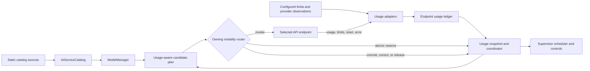

# Endpoint Usage-Aware Routing and Supervisor Capacity Plan

## Outcome

Add one shared, provider-neutral usage and limit control plane that lets
`ipfs_accelerate_py`:

- identify the exact API endpoint and non-secret credential/account scope that
  owns a limit;
- collect configured limits and provider-observed request, token, media,
  concurrency, cost, and reset information;
- reserve capacity atomically before an invocation and reconcile it with the
  provider's final usage;
- expose current headroom and typed exhaustion reasons through `ModelManager`;
- optionally let `llm_router`, `embeddings_router`, `multimodal_router`, and
  `voice_router` select another eligible endpoint under an explicit fallback
  policy; and
- let the agent supervisor budget, schedule, defer, or reroute its provider
  work without exceeding a shared endpoint limit.

Usage-aware routing is opt-in. The initial runtime mode is `off` or `shadow`;
promotion to enforcement requires deterministic conformance and paired rollout
evidence. Existing explicit provider, model, deployment, authorization, and
side-effect constraints remain authoritative.

## Current foundation and remaining gaps

The AI service catalog and supervisor already provide most of the static and
local scheduling foundations. This plan composes them instead of creating a
parallel catalog or invocation stack.

| Existing component | Reuse | Gap closed by this plan |
| --- | --- | --- |
| Catalog schemas, registry, resolver, and deployment records | Canonical provider, model, deployment, operation, and router-binding identities | A separate dynamic usage snapshot keyed to an exact endpoint and credential/account scope |
| `ModelManager` catalog facade | Side-effect-free listing, resolution, health, snapshots, and refresh | Usage/headroom queries and usage-aware candidate planning without provider invocation |
| Four modality routers | Provider construction, request semantics, batching, streaming, caching, and fallback ownership | A common estimate/reserve/invoke/reconcile protocol and policy-bounded endpoint fallback |
| `resource_scheduler.ProviderCapacity` | Health, concurrency, quota, token, latency, context, and retry-after admission inputs | Multi-window, multi-unit endpoint truth backed by atomic reservations rather than advisory scalar fields |
| `provider_batch_scheduler.ProviderBatchCapacity` | Batch compatibility, queueing, cancellation, and per-provider concurrency | Reservation-aware batch admission and exact per-member settlement |
| `supervisor_token_ledger` and `scheduler_metrics` | Stage/task token and cost attribution plus aggregate operator metrics | Provider-limit admission, endpoint scope, resets, corrections, and no-double-charge reconciliation |
| Catalog selection receipts | Candidate/filter/ranking provenance without prompts or secrets | Usage snapshot revision, requested units, reservation result, fallback boundary, and final settlement |
| Codex and provider-specific error parsing | Quota/error clues already available at individual call sites | Bounded adapters that normalize headers, bodies, CLI JSON, and errors for every supported endpoint type |

Three distinctions are essential:

1. Inbound MCP/server rate limits are not outbound provider limits.
2. Aggregate token/cost metrics are not an atomic admission ledger.
3. Provider health/concurrency is not the same as a time-window or billing
   quota.

## Architectural boundaries

The static catalog remains the information and capability plane. Dynamic usage
is an overlay with its own revision and freshness rules. The four routers
remain the invocation plane.



The following boundaries are non-negotiable:

1. `ModelManager` may list, inspect, filter, and rank candidates, but it does
   not make a provider request. A router performs the final atomic reservation
   and invocation.
2. Static capabilities and dynamic usage do not share a revision. A changing
   request counter must not churn the catalog CID.
3. Unknown is not unlimited. Enforcement policy decides whether an unknown or
   stale dimension is denied, allowed with a conservative configured ceiling,
   or observed only.
4. Limits for unrelated credentials, accounts, projects, tenants, endpoints,
   deployments, models, or operations are never pooled.
5. Provider-observed usage can reconcile an estimate, but neither a model
   response nor an untrusted federated catalog record grants quota authority.
6. Hard capability, authorization, policy, user pin, context, media, safety,
   locality, and usage gates run before soft ranking. A high score cannot
   bypass a failed hard gate.
7. Explicit provider/model/deployment requests do not cross their stated
   boundary unless the caller selects a fallback policy that permits it.
8. Every reservation, invocation attempt, retry, fallback, cancellation, and
   settlement is idempotently identified. A process crash cannot erase usage
   or charge it twice.
9. Durable records contain no prompt, input media, model output, credential,
   bearer URL, or raw private endpoint.
10. Response-cache hits do not consume remote quota. They retain separate
    local compute/cache metrics and must not fabricate a provider settlement.

## Canonical endpoint and scope identity

One `EndpointUsageScope/v1` identifies the limit owner. It binds:

- canonical catalog `provider_id`;
- `deployment_id` or a secret-free endpoint fingerprint;
- protocol/transport kind;
- operation and, only when the provider scopes it that way, model ID;
- tenant/project/account identifiers when the provider returns stable,
  non-secret values;
- a local credential-scope fingerprint;
- region or organization scope when it changes the provider's limit; and
- schema and identity-policy versions.

The credential fingerprint is a keyed local pseudonym derived from a
credential configuration reference, not a stored secret and not a plain hash
of a token. It must remain stable for one configured ledger while preventing
offline comparison of token values. When the scope cannot be established,
the record stays `unknown_scope` and cannot be combined with another unknown
credential.

Endpoint normalization must remove user information, query secrets, fragments,
and bearer material before identity derivation. Public diagnostics expose
catalog IDs and bounded pseudonyms, never raw private URLs.

## Usage dimensions and limit windows

Dimensions remain typed instead of being converted into a fictional universal
token:

| Dimension | Representative use |
| --- | --- |
| `requests` and `batch_items` | Request-per-minute/day and batch limits |
| `input_tokens`, `output_tokens`, `total_tokens` | Text and tokenized media limits |
| `embedding_inputs`, `embedding_tokens`, `vectors` | Embedding batch and vector limits |
| `images`, `pixels`, `media_bytes` | Vision generation or analysis limits |
| `audio_seconds`, `characters` | Speech transcription and synthesis limits |
| `concurrent_requests`, `concurrent_streams` | In-flight and streaming capacity |
| `cost_micros` plus currency | Operator/provider spend envelopes |

Each `UsageLimit/v1` declares:

- dimension and non-negative ceiling;
- scope identity;
- window kind: fixed, sliding, token bucket, concurrent, billing cycle, or
  lifetime;
- window length, anchor/reset time, refill rate, burst, and safety reserve
  where applicable;
- source: policy, configured provider metadata, response header/body, error,
  or reconciled local observation;
- observation time, expiry, confidence, and parser version;
- whether the value is a hard deny, soft preference, or diagnostic; and
- provenance digest and bounded reason codes.

The control plane stores wall-clock reset time and monotonic local deadlines.
It validates skew, clamps unreasonable durations and values, adds bounded
jitter to retry release, and never interprets a missing reset as an immediate
reset.

An endpoint's effective availability is one of:

- `available`;
- `near_limit`;
- `exhausted`;
- `cooling_down`;
- `stale`;
- `unknown`;
- `disabled`; or
- `unroutable`.

The effective hard ceiling is the conservative intersection of caller budget,
local policy, configured provider limit, fresh provider observation, active
reservations, and distributed lease capacity.

## Events, snapshots, and receipts

The ledger is append-only at the semantic level. It records:

- estimates;
- reservations;
- incremental streaming settlements;
- successful provider observations;
- failure observations;
- commits and releases;
- expiry recovery;
- refunds where a provider explicitly reports them; and
- corrections that reference the event they supersede.

Events are immutable and content-addressed. Materialized counters and windows
may be compacted, but a correction never silently rewrites its source event.
The ledger exposes a bounded immutable `UsageSnapshot/v1` with its own
`usage_revision`, freshness, limit states, in-flight reservations, and next
eligible times.

Every route attempt emits a bounded `UsageRoutingReceipt/v1` that binds:

- catalog and usage revisions;
- request/attempt/idempotency identities;
- caller, tenant, supervisor goal/task/lane/stage references where present;
- operation, required capabilities, explicit pins, and fallback policy;
- bounded estimated units and estimate method/version;
- considered bindings and hard rejection reason codes;
- soft ranking inputs and selected binding;
- reservation ID, lease/fence, expiry, and decision;
- provider observation and reconciliation outcome; and
- retry/fallback chain, final status, and next eligible time.

Receipts contain digests and IDs, not prompts, media, output, raw headers,
credentials, or private endpoint URLs.

## Atomic invocation lifecycle

The authoritative lifecycle is:

1. Normalize the request and derive a conservative, operation-specific
   `UsageEstimate`.
2. Resolve statically eligible candidates from one catalog revision.
3. Read one usage snapshot and apply hard policy and limit filters.
4. Rank remaining candidates deterministically.
5. Atomically reserve every required dimension for the highest-ranked
   candidate. If compare-and-set fails, refresh and try the next candidate.
6. Invoke through the owning router using the exact reserved binding.
7. Parse response metadata or errors through the bound endpoint adapter.
8. Commit provider-reported actual usage, conservatively settle dimensions
   whose final usage is unknown, release provably unused capacity, and update
   limits/reset/cooldown.
9. If retry or fallback is permitted, create a new attempt linked to the prior
   one; never reuse the same reservation.
10. Return the result plus a bounded routing/settlement receipt.

Reservations have a TTL, owner identity, process/lease fence, and idempotency
key. Cancellation before dispatch releases the full reservation. Cancellation
or timeout after dispatch settles according to adapter evidence because a
provider may still charge the request. Streaming checkpoints settle monotonically
and the terminal event reconciles the last delta. Batch settlement attributes
shared overhead once and member usage exactly once.

## Provider observation adapters

Adapters normalize only metadata from the exact local invocation response.
They do not perform discovery or probe a provider.

The first conformance set covers:

- OpenAI-compatible HTTP endpoints, including xAI, OpenRouter, vLLM, TGI, and
  compatible gateways;
- Anthropic-style responses and rate-limit headers;
- Hugging Face Inference, TEI, and TGI response/error shapes;
- CLI-backed providers such as Codex, Copilot, Grok, Gemini, Goose, and
  Mistral Vibe when they expose structured usage or reset data;
- local transformers, llama.cpp, and backend-manager deployments with local
  concurrency/memory limits; and
- custom providers through an explicit registered adapter contract.

Adapters must:

- parse request IDs, usage bodies, rate-limit headers, `Retry-After`, reset
  timestamps, HTTP 429/503, billing exhaustion, and structured CLI errors;
- distinguish a shared account quota from an endpoint/model window;
- preserve unknown fields as bounded diagnostics rather than guessing;
- cap numbers, strings, nesting, clocks, and header counts;
- reject negative, overflowing, conflicting, stale, or scope-mismatched data;
- never raise an available ceiling above policy merely because a response says
  so; and
- update cooldown on a valid restrictive observation even if parsing the rest
  of the response fails.

Provider usage is authoritative for settlement only when it is bound to the
current request/endpoint scope. Local estimates remain explicit and are
reconciled rather than overwritten.

## ModelManager integration

`ModelManager` gains provider-free, side-effect-free methods such as:

- `usage_snapshot(...)`;
- `list_usage_limits(...)`;
- `get_endpoint_headroom(...)`; and
- `resolve_for_routing(..., usage_request, routing_policy)`.

`resolve_for_routing` returns a `UsageAwareResolution` containing the catalog
revision, usage revision, eligible candidates, hard rejection reasons, ranking
inputs, and next eligible time. It does not reserve capacity or invoke a
provider. This makes ModelManager the canonical planning facade while leaving
the race-closing reservation in the router.

The base catalog resolver continues to work unchanged when no usage service is
configured. Dynamic usage fields are never written into static provider,
model, deployment, or binding records and do not alter their CIDs.

Candidate ranking occurs only after hard filtering and uses policy-controlled
inputs:

- explicit caller affinity and endpoint stickiness;
- required operation/modality/capabilities;
- projected saturation across every required dimension;
- fresh headroom and reset horizon;
- health, circuit state, latency, and queue delay;
- configured cost envelope;
- locality/device/data-governance constraints; and
- an optional quality preference supplied by policy.

Percentages for unlike dimensions are not added together. The planner uses
the tightest required dimension and reports the full vector.

## Router integration

All router integrations share the same coordinator contract and retain their
existing public behavior when usage-aware routing is disabled.

### LLM router

Estimate input/output/tool/cache-token envelopes, support request/token/cost
windows, and normalize structured HTTP and CLI usage. Existing Codex
usage-limit parsing becomes an adapter input rather than a router-only special
case. Streaming and tool calls settle incrementally. Context errors and
semantic/client errors do not trigger endpoint fallback unless an explicit
policy classifies the retry as safe.

### Embeddings router

Reserve input count, estimated tokens, vectors, batch items, dimensions, and
bytes. Split an oversized logical batch only when the caller and provider
contract allow it, and attribute each sub-batch exactly once. A fallback must
preserve requested dimensions, normalization, input type, and model
compatibility.

### Multimodal router

Reserve images, pixels, media bytes, input/output tokens, requests, and cost as
applicable. Fallback must preserve MIME, dimensions, operation, safety/data
policy, and output contract. Media is never copied into a usage receipt.

### Voice router

Reserve audio duration, synthesis characters/tokens, media bytes, request and
stream concurrency, and cost. Streaming transcription/synthesis uses
monotonic partial settlements. Fallback must preserve language, voice,
sample-rate/codec, locality, and data-retention constraints.

For every modality, fallback policy is explicit:

- `none`;
- `same_deployment`;
- `same_provider`;
- `same_model`;
- `equivalent_model`; or
- `cross_provider`.

The policy also declares a deadline, maximum attempts, wait-versus-reroute
behavior, cost/quality/locality bounds, and whether endpoint/model changes may
be returned to the caller. Exact pins default to `none`.

## Agent supervisor integration

The supervisor adds a provider-neutral `SupervisorUsageEnvelope/v1` with
budgets at these nested scopes:

```text
deployment policy
  -> supervisor run
    -> goal / objective
      -> task / attempt
        -> stage / lane
          -> provider request
```

Each child may lower but not raise its parent budget. The envelope covers
model calls used for planning, analysis, proof, rescue, validation assistance,
and implementation-agent endpoints. Process-based CLI agents are included
when their provider exposes usage or subscription reset metadata.

The supervisor reuses the common coordinator:

- `supervisor_token_ledger` attributes accepted-work efficiency but consumes
  reconciled endpoint events instead of independently charging provider use;
- `resource_scheduler.ProviderCapacity` becomes a compatibility projection of
  the richer endpoint snapshot;
- `provider_batch_scheduler` obtains an atomic lease/reservation for a
  physical batch and settles members without duplicate overhead;
- the common isolated `todo_daemon.llm` path propagates request, task, lane,
  stage, deadline, and budget identities;
- direct provider call sites migrate through that gateway or an equivalent
  typed execution adapter; and
- scheduler events wake blocked work at a reset/capacity transition rather
  than polling.

Admission behavior is deadline-aware:

1. use an eligible configured endpoint with sufficient reserved headroom;
2. route to another policy-permitted endpoint;
3. wait until the bounded next-eligible time when it fits the task deadline;
4. use an explicit deterministic/local fallback where its capability and
   authority are sufficient; or
5. return a typed `usage_capacity_unavailable` result and apply supervisor
   backpressure.

Fairness is enforced across tenants, goals, tasks, and lanes. High parallelism
cannot consume all of a scarce account window, and a reset cannot cause a
thundering herd. Weighted fair queues, admission jitter, per-scope reserves,
and single-flight refresh limit contention.

Usage receipts are operational evidence only. They cannot prove task
correctness, validation, authorization, or objective completion.

## Supervisor execution prerequisite: cross-lane worktree ownership

The usage program must not spend provider capacity through an implementation
worker whose checkout can be removed by another supervisor lane. A live
six-lane rehearsal on 2026-07-28 reproduced a startup race: a worker created
and entered a task worktree whose branch still pointed at the merge target,
while another lane classified that same checkout as already merged before
process discovery became visible and removed it. The worker remained alive in
an unlinked directory, subsequent validation could not produce changes, and
protected-path identity monitoring correctly failed closed even though the
protected file hashes were unchanged.

Treat a managed worktree as a fenced lifecycle resource rather than inferring
ownership from branch ancestry or a momentary process scan:

- acquire the global task-attempt claim and a monotonic workspace fence before
  publishing or creating a cleanup-visible worktree;
- persist `preparing`, `active`, `settling`, and `terminal` lifecycle states
  with task CID, attempt, lane, owner PID plus process-birth identity, lease,
  workspace, branch, and merge-target binding;
- require cleanup/reconciliation to acquire a compare-and-delete fence and
  skip every nonterminal or unexpired claimed workspace, including the window
  between `git worktree add` and child-process discovery;
- let only the fenced owner transition the workspace to terminal, and preserve
  conservative startup grace for partial creation, daemon restart, PID reuse,
  and temporarily unavailable process inspection;
- distinguish a setup/reconciliation race from an implementation failure so it
  cannot consume a task retry or make a remote model call; and
- prove the behavior with deterministic barrier-controlled multi-lane tests
  covering cleanup during preparation, active execution, settlement, restart,
  stale-lease reclamation, and legitimate merged-worktree disposal.

`AICAT-025` remains externally blocked until `ASI-171` lands this prerequisite.
This prevents further guaranteed-failure implementation attempts while leaving
the endpoint-usage design and downstream dependency graph intact.

## Persistence and coordination

Define a `UsageLedgerStore` protocol with:

- an in-memory/fake-clock backend for deterministic tests;
- a durable local transactional backend for one supervisor host;
- a single-writer coordination path for multiple local worker processes; and
- an optional distributed lease backend for multi-host deployments.

Content-addressed/IPFS records provide audit, replication, and recovery
evidence; they are not used as the real-time compare-and-set authority.
Distributed enforcement requires a strongly consistent reservation service or
fenced lease backend. If that backend is unavailable, distributed enforcement
fails closed or falls back to a separately configured per-node partition; it
must not assume eventual consistency is sufficient.

The store supports schema migration, bounded retention, checkpoint/compaction,
crash recovery, expired-reservation reclamation, read-only inspection, and
backup/restore. A ledger outage in `shadow` records a diagnostic and preserves
legacy routing. In `enforce`, remote endpoint admission fails closed unless a
reviewed degraded policy supplies an independent conservative ceiling.

## Security and privacy

- Usage mutation requires local invocation authority; federated peers and
  model output cannot update a credential-scoped ledger.
- Configuration may name secret-store references but never carries secret
  values through the catalog, ledger, receipt, metric, CLI, MCP, or logs.
- Credential-scope pseudonyms are keyed and access-controlled.
- Tenant/account/project boundaries are mandatory policy inputs, not optional
  metric labels.
- Raw headers and provider bodies are parsed in memory and reduced to bounded
  typed observations.
- Public status defaults to aggregate headroom/state. Exact cost, account
  pseudonym, and endpoint details require explicit read authority.
- Reset/import/mutation controls require separate administrative authority,
  idempotency, expected revision, and an audit receipt.
- Metrics use bounded provider/deployment/state/reason labels; request,
  credential, tenant, model alias, and endpoint URL do not become unbounded
  labels.

## Controls and observability

The shared Python service, CLI, MCP, and MCP++ projections expose equivalent
bounded operations for:

- usage status and health;
- endpoint limits and headroom;
- active reservations;
- recent redacted routing/settlement receipts;
- candidate route preview;
- policy and adapter capability discovery;
- explicit provider-counter reconciliation/import; and
- privileged limit override, correction, or reset.

Read operations are side-effect free. Preview never reserves. Mutations use
the existing control-plane authorization, lease/fence, expected-revision,
idempotency, and audit rules.

Low-cardinality metrics include reservation attempts/denials/expiry,
estimate-to-actual error, usage by typed dimension, headroom bands, limit/reset
observations, stale/unknown scopes, cooldowns, reroutes, waits, fallbacks,
no-capacity outcomes, ledger latency/failure, reconciliation corrections, and
double-charge prevention. Histograms and aggregates are derived from ledger
events so dashboards cannot become a second source of truth.

## Rollout

| Phase | Mode and scope | Exit gate |
| --- | --- | --- |
| 0. Contracts | Provider-free schemas, identities, adapters, fake clock, and in-memory store | Bounds, canonicalization, redaction, parser, property, and migration tests pass |
| 1. Observe | Collect estimates and provider observations; never change selection | Existing results are unchanged and attribution/reconciliation covers the frozen fixture population |
| 2. Shadow | Compute candidate decisions and reservations beside legacy routing | Zero false hard-limit availability, double charge, scope merge, secret leak, or pin/fallback drift |
| 3. Single-endpoint enforce | Enforce configured limits without cross-endpoint fallback | No provider-limit overshoot under concurrency, cancellation, crash, streaming, batch, and reset tests |
| 4. Router assist | Enable policy-approved alternate endpoint/model suggestions one modality at a time | Four router contract suites preserve output/capability semantics and explicit pins |
| 5. Router automatic | Allow selected fallback classes after paired comparison | Safety/parity gates pass; cost, latency, quality, and no-capacity outcomes meet reviewed thresholds |
| 6. Supervisor enforce | Apply hierarchical budgets, fair scheduling, reset wakeups, and backpressure | Exact task/stage attribution, bounded model spend, no starvation/herd, and restart recovery pass |
| 7. Distributed | Add fenced global reservation backend or explicit per-node partitions | Partition, split-brain, stale lease, clock skew, and coordinator-loss tests fail closed |

Modes are `off`, `observe`, `shadow`, `assist`, and `enforce`. Changing mode,
limit source priority, safety reserve, fallback class, score weights, or
distributed coordination changes the policy identity. Rollback immediately
returns selection to the prior router behavior while preserving the ledger for
diagnosis; it never erases already observed usage.

## Verification matrix

The implementation is not complete until deterministic tests cover:

- fixed/sliding/token-bucket/concurrent/billing windows and overlapping
  dimensions;
- unknown, stale, conflicting, decreasing, resetting, and malformed limits;
- multiple endpoints sharing one credential quota and one endpoint serving
  multiple credentials without cross-charge;
- concurrent reserve races, process crashes, TTL reclamation, replay, and
  duplicate request IDs;
- success, provider error, 429/503, timeout before/after dispatch,
  cancellation, partial stream, batch split, fallback, and retry;
- estimate lower/equal/higher than actual usage and provider corrections;
- wall-clock jumps, skew, reset jitter, and deterministic fake-clock replay;
- explicit provider/model/deployment pins and every fallback boundary;
- cost, locality, authorization, health, capability, media, and deadline hard
  constraints;
- cache hits, single-flight subscribers, and batch shared-overhead attribution;
- malformed/oversized/adversarial headers, bodies, CLI output, IDs, URLs, and
  credential-shaped values;
- Python, ModelManager, router, CLI, MCP, and MCP++ identity/result parity;
- supervisor goal/task/lane/stage budgets, fairness, reset wakeups,
  backpressure, and restart;
- local-ledger and distributed-coordinator outages; and
- zero network/provider/process side effects during import, discovery, query,
  and preview.

Live provider smoke tests remain explicitly environment-gated and use tiny
operator-approved budgets. Default tests are offline and use injected
transports.

### Offline release gate (AICAT-035)

The frozen offline population and staged rollout proofs live in:

```bash
python -m pytest \
  test/test_endpoint_usage_schema.py \
  test/test_endpoint_usage_adapters.py \
  test/test_endpoint_usage_ledger.py \
  test/test_endpoint_usage_routing.py \
  test/test_model_manager_usage_routing.py \
  test/test_llm_router_usage_routing.py \
  test/test_embeddings_router_usage_routing.py \
  test/test_multimodal_router_usage_routing.py \
  test/test_voice_router_usage_routing.py \
  test/test_ai_router_usage_contract.py \
  test/test_endpoint_usage_controls.py \
  test/test_endpoint_usage_conformance.py \
  test/test_endpoint_usage_faults.py \
  test/test_endpoint_usage_rollout.py -q
```

| Suite | Covers |
| --- | --- |
| `test_endpoint_usage_conformance.py` | Fixed/sliding/token-bucket/concurrent/billing windows; shared vs isolated credentials; multi-surface identity/revision agreement (Python, ModelManager, routers, MCP, MCP++); side-effect-free import/query/preview; zero overshoot and no double charge |
| `test_endpoint_usage_faults.py` | 429/503/billing/malformed observations; cancel/timeout before and after dispatch; partial stream and batch split; single-flight; retry/fallback; correction/reset; durable crash recovery; migration/outage; partition; clock jump; reservation race; fail-closed distributed admission |
| `test_endpoint_usage_rollout.py` | Modes `off`/`observe`/`shadow`/`assist`/`enforce`; observe/shadow non-selection; automatic fallback paired gate; pin isolation; rollback preserving ledger; opt-in live budget caps |
| `test_ai_router_usage_contract.py` | Cross-router requirement IDs, mode helpers, estimates, hard gates, fallback boundaries, ModelManager facades |

Opt-in live usage smokes (never default CI):

```bash
IPFS_ACCELERATE_PY_ENDPOINT_USAGE_LIVE=1 \
IPFS_ACCELERATE_PY_ENDPOINT_USAGE_LIVE_BUDGET_MICROS=5000 \
python -m pytest test/test_endpoint_usage_rollout.py -k opt_in_live -q
```

Rollback returns selection to legacy/`off` behavior while preserving the usage
ledger and receipts for diagnosis. Distributed enforcement without a strong
fenced coordinator fails closed.

## Taskboard attachment

The implementation is attached to the existing AI Service Catalog board as
`AICAT-025` through `AICAT-035`:

1. contracts and scope identities;
2. provider observation adapters;
3. atomic durable ledger/coordinator;
4. ModelManager usage-aware planning;
5. shared admission, ranking, fallback, and receipts;
6. LLM router integration;
7. embeddings router integration;
8. multimodal router integration;
9. voice router integration;
10. controls and observability; and
11. conformance, fault injection, documentation, and rollout (`AICAT-035`).

The supervisor-specific integration and its live execution prerequisite are
attached to the existing self-improvement board as `ASI-165` through
`ASI-171`:

1. hierarchical supervisor usage contracts and accounting bridge;
2. one reservation-aware provider execution gateway;
3. endpoint-aware resource/batch admission and fair backpressure;
4. migration of every supervisor provider consumer;
5. Python/CLI/MCP controls and metrics;
6. paired E2E, chaos, rollout, and operator guidance; and
7. fenced cross-lane worktree ownership and cleanup safety, implemented first
   as the prerequisite that unblocks `AICAT-025`.

The new objective trees are independent successors. They consume the completed
catalog and supervisor foundations without retroactively changing the closed
producer populations of earlier objective generations.

## Definition of done

This program is complete only when:

- every remote invocation is attributable to one exact, non-secret endpoint
  usage scope or explicitly reports why the scope is unknown;
- concurrent callers cannot reserve more than the effective limit;
- provider-reported usage reconciles estimates exactly once;
- ModelManager and all four routers agree on catalog identity, usage revision,
  hard exclusions, selected binding, and fallback boundary;
- optional usage-aware routing preserves legacy behavior when disabled;
- explicit pins and policy/authorization/data constraints are never silently
  weakened;
- the supervisor can meter, budget, reroute, wait, or backpressure every
  provider-consuming stage with bounded fairness;
- restart, cancellation, retry, batch, streaming, reset, and distributed
  failure behavior is deterministic and tested;
- public controls are transport-equivalent, bounded, redacted, and authorized;
  and
- staged rollout has zero limit overshoot, double charge, cross-scope
  contamination, secret exposure, false completion, or authority-boundary
  violations in the frozen adversarial population.
