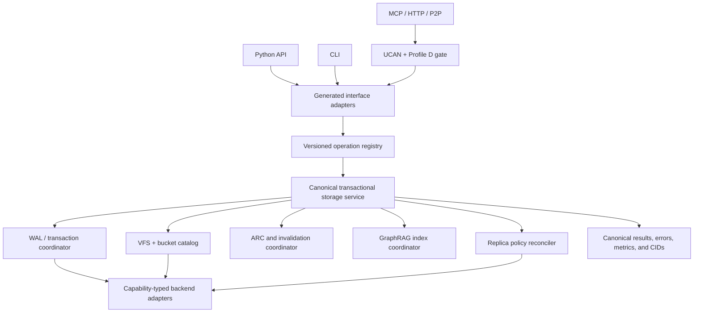

# IPFS Kit Runtime Readiness and Storage Conformance Plan

## Outcome

Make every **advertised** `ipfs_kit_py` storage capability demonstrably
correct, durable, authorized, interface-equivalent, and fast enough for its
declared workload. The implementation program must:

1. provide one canonical transactional service behind the Python package,
   CLI, MCP, and MCP++ surfaces;
2. make VFS namespace, file, directory, mount, version, snapshot, and
   transaction behavior deterministic and recoverable;
3. manage virtual buckets through a complete lifecycle with policy, quota,
   tiering, export/import, and recovery semantics;
4. make GraphRAG indexes durable, incrementally maintainable, provenance
   preserving, safe to deserialize, and backed by a real vector-index
   abstraction;
5. make write-ahead-log acknowledgement, crash recovery, replay,
   checkpointing, and compaction semantics explicit and testable;
6. establish Adaptive Replacement Cache invariants under concurrency,
   invalidation, restart, and byte-pressure workloads;
7. make replica placement and repair policies converge without hiding
   partial failure or data loss;
8. enforce MCP++ UCAN and datasets Profile D policy decisions before every
   protected dispatch, with attenuation, revocation, and replay protection;
9. guarantee Python, CLI, MCP, MCP++/transport, and installed-wheel contract
   parity;
10. certify every registered storage backend at an honest support tier and
    remove or explicitly mark functionality that cannot satisfy its contract;
11. reach checked-in throughput and latency floors without weakening
    durability, authorization, or consistency; and
12. emit supervisor-readable evidence so completion means a current-tree
    conformance result rather than a historical claim.

The native objective heap is
`docs/architecture/ipfs_kit_runtime_readiness.objectives.md`. The executable
taskboard is `docs/architecture/ipfs_kit_runtime_readiness.todo.md`. Scheduler
policy is in
`config/agent_supervisor_ipfs_kit_runtime_readiness_scheduler.json`.

## Relationship to existing assurance work

This program is a consumer of, not a replacement for:

- `docs/architecture/IPFS_KIT_VFS_SYMBOLIC_ASSURANCE_PLAN.md`;
- the `VFS-` objective and task boards;
- the `RPR-` broken-contract/change-propagation machinery; and
- the `LPR-` Tactician/Hammer logic-repair and deterministic-doctor
  machinery.

Those programs establish inventory, evidence identity, impact closure,
proof-guided repair, and general assurance engines. This `KITA-` program
applies those engines to runtime storage behavior. If a `KITA-` task changes a
public signature or schema, the supervisor must compute the affected caller
closure and either repair all resolved consumers atomically or abstain. A
vector result, graph edge, solver result, test pass, or LLM proposal never
authorizes an edit by itself.

## Frozen planning baseline

The board was authored against:

| Repository | Bound revision |
| --- | --- |
| `ipfs_accelerate_py` | `f25e5719cb738a50fb96bac4bea3f66ebca9800b` |
| `ipfs_kit_py` gitlink | `f6a574375febbcf9a46fcd24bbc7bc5cfb551de5` |
| `ipfs_datasets_py` gitlink | `7415adc5100192ee35676778f1018f6b072378f9` |

Launch preflight must record the live repository forest, recursively
initialized gitlinks, dirty overlays, package metadata, Python/platform
identity, optional-provider capabilities, and toolchain versions. A changed
revision is not automatically a failure, but it invalidates historical
findings and requires a fresh inventory and baseline.

### Confirmed baseline blockers

The initial read-only audit established concrete first-wave work:

- the primary VFS manager's `rename_item`/`move_item` paths report success
  without mutating state; it calls journal methods that do not exist, can emit
  create/delete events for failed operations, and can clear buffered dataset
  work when its destination is unavailable;
- at least five bucket management planes maintain overlapping state. Bucket
  creation crosses directory/index/registry writes without rollback, and the
  strongest Iroh tiering path performs external placement before its DuckDB
  transaction without a complete compensation protocol;
- current journal/WAL variants do not share a valid transaction protocol:
  begin/commit IDs and markers can be lost, mutation may precede durable
  intent, file/parent-directory durability is incomplete, a production path
  contains a random/mock handler, and checkpoint/archive behavior can skip or
  delete unrecovered work;
- ARC update and ghost-hit paths can leave live byte accounting stale and
  violate capacity; mutable lists are not synchronized even though wrappers
  may dispatch them to threads;
- a later `ensure_replication` definition shadows the implementation that
  performs copying, while pending replication can be counted as successful
  redundancy and policy cross-field/capability validation is incomplete;
- `BackendManager.get_backend_adapter` calls a factory absent from the legacy
  plugin protocol, so most registered named backends cannot use that canonical
  path. Registry names, schemas and the smaller adapter registry also diverge,
  and an MCP default manager can silently omit IPFS after a constructor error;
- `ipfs_kit_py/mcp_server/server.py` constructs `EventDAGStore` without
  importing it. A focused Profile C/D/MCP++ run had five construction
  failures.
- the active MCP++ server routes policy to a permissive competing evaluator
  instead of the canonical datasets Profile D bridge; the expected policy
  route and advertised profile are absent;
- UCAN and policy evaluation are advisory. Protected `tools/call` dispatch
  does not require an admitted decision, missing validation can fail open,
  and delegation lacks a complete signed attenuation/revocation/replay
  contract;
- `graphrag.py` loads caller-selected pickle cache files, brute-force scans
  embeddings, eagerly imports optional ML stacks, and may load models during
  construction;
- SQLite relations survive restart while the in-memory NetworkX/RDF views do
  not rehydrate; update history records the replacement content as the prior
  version;
- several GraphRAG implementations and wrappers expose incompatible schemas
  and result types, while canonical MCP++ has no GraphRAG tool category;
- root, CLI, MCP, and installed-package exports/version/dependencies disagree;
  the MCP server import eagerly loads heavy optional modules; and
- the default pytest configuration excludes the integration tree containing
  most WAL, ARC, replication, and backend coverage. Several remaining tests
  skip, print, accept either success or failure, permit zero recovered
  operations, omit assertions, or mock the transaction/recovery methods that
  the release gate must exercise.

These findings are observations at the bound revision. Tasks must reproduce
or supersede them with content-addressed evidence before claiming them fixed.

## Non-negotiable invariants

### One semantic implementation

Every operation is defined once in a versioned operation registry and handled
by a canonical service. Package functions, CLI commands, MCP tools, HTTP/P2P
bindings, and compatibility wrappers are adapters. They may translate
transport syntax but may not implement storage, authorization, retry,
fallback, or error semantics independently.

### Honest capability claims

Registry presence is not backend support. Each backend/type/alias is
classified as:

- `production`: complete required operations and live conformance;
- `conditional`: complete declared subset when a named capability is
  available;
- `configuration_only`: validated configuration and health discovery only;
- `experimental`: explicitly opt-in and excluded from production routing; or
- `unsupported`: typed rejection before side effects.

No adapter may silently return success, silently fall back to another backend,
or advertise an operation that it does not implement.

### Durable acknowledgement

A result described as committed/durable must survive the declared crash model.
If an acknowledgement precedes required WAL or backend durability, its state
must be named `accepted`, `queued`, or `pending`, never `committed`. Recovery
must be idempotent and must not duplicate external effects.

### Fail-closed authorization

Every protected operation is mapped to an exact UCAN resource and ability.
Token signature, audience, issuer, time window, proof chain, attenuation,
revocation, nonce/replay status, tenant/bucket/path scope, and Profile D
decision are checked before dispatch. An unavailable requested validator,
policy provider, revocation store, or audit requirement denies the operation.

### Content and contract identity

Receipts bind repository/tree/overlay, operation schema, request, principal,
policy, backend capability, WAL generation, bucket/catalog generation,
GraphRAG generation, replica policy, cache generation, and environment
identity as applicable. A stale or mismatched receipt cannot satisfy a gate.

### Safe optionality

Importing `ipfs_kit_py`, its operation registry, or MCP protocol definitions
does not start a daemon, open a network connection, download a model, inspect
system packages, mutate user files, resolve secrets, or import unrelated
heavy optional stacks. Optional providers are loaded on first authorized use
and fail with a typed actionable capability error.

### Analytical repair before model editing

Static resolution, typed contract comparison, repository graph closure,
datasets Tactician planning, Hammer proof/counterexample search, and closed
analytical transforms precede any `llm_router` call. The model receives only
the admitted behavior, exact target/consumer paths, bounded evidence CIDs,
tests, and postconditions. It returns a proposal; the existing transaction
and fixed-point gates retain write and completion authority.

## Target architecture



The arrows are authority boundaries:

- adapters cannot bypass the registry or service;
- authorization is complete before a protected MCP/MCP++ call reaches the
  service;
- WAL, cache, index, and replication state transitions are coordinated with
  the service transaction;
- adapters expose backend capability rather than fabricating equivalence; and
- every surface returns the same canonical result/error payload after
  transport-only normalization.

## Canonical operation contract

`KITA-002` defines a closed, versioned contract shared by all later tasks.
At minimum it contains:

- operation ID and schema version;
- request ID, idempotency key, deadline, cancellation token, and trace ID;
- principal, tenant, UCAN resource/ability, and admitted policy-decision CID;
- bucket, path/key, source/target, precondition version/CID, and consistency
  requirement;
- payload reference/stream descriptor rather than accidental unbounded copies;
- backend selection requirements and explicit fallback policy;
- transaction, WAL, cache, GraphRAG, and replica-policy bindings;
- typed success state (`accepted`, `committed`, `converged`, and so on);
- canonical result and error code, retryability, and partial-effect record;
- resulting content/version CIDs and durability/replication state; and
- bounded timings and evidence references.

Exceptions, exit codes, JSON-RPC errors, and MCP results are projections of the
same error taxonomy. Adapters cannot translate one semantic failure to
success, empty data, or a different retry disposition.

## Capability programs

### VFS core

The VFS program establishes path normalization, Unicode/case policy,
namespace and mount boundaries, symlink escape rules, file/directory stat and
listing order, range and streaming I/O, atomic create/replace/rename/delete,
conditional/CAS writes, snapshots, version history, transaction isolation,
deadlock/cancellation behavior, and recovery. Model-based state machines and
differential traces cover sync and async APIs.

Completion requires:

- no path or symlink escape;
- no lost update under the declared isolation level;
- atomic rename/replace inside the supported boundary;
- explicit cross-backend/mount limitations;
- stable content/version identities;
- rollback or recovery after every injected interruption point; and
- identical canonical results through every admitted interface.

### Virtual buckets

A bucket is a first-class namespace and policy object, not a directory naming
convention. The canonical catalog covers create/read/update/delete, list and
pagination, object operations, metadata, quotas, retention, encryption
requirements, backend/tier placement, import/export/CAR, snapshot, clone,
cross-bucket query, deletion fences, and recovery.

Bucket deletion cannot race an admitted write or leave untracked replicas.
Import is staged, validated, and atomically published. Export binds a catalog
snapshot and content manifest. Cross-bucket queries enforce authorization and
snapshot/consistency semantics per input bucket.

### GraphRAG

One engine owns a versioned content, entity, relation, embedding, and
provenance schema. Other historic engines become adapters or are retired.
The durable store is authoritative; NetworkX/RDF/ANN views are reconstructible
projections.

Required behavior includes:

- safe non-executable serialization and atomic generation publication;
- exact model, tokenizer, dimension, metric, schema, source, and index CIDs;
- add/update/delete/tombstone and old-version correctness;
- restart rehydration and clean-rebuild equivalence;
- incremental update equivalence to a clean index;
- ANN recall measured against exact search with bounded exact fallback;
- deterministic filtering, ranking tie-breaks, hybrid weight validation, and
  provenance;
- transaction coupling so committed content and index lag are observable;
- poisoning, stale-index, corrupt-generation, model-mismatch, and resource
  bounds; and
- identical package/CLI/MCP request and result contracts.

GraphRAG, vector similarity, and knowledge-graph neighborhoods rank evidence;
they do not invent authoritative relationships or content.

### Write-ahead log

The WAL contract defines record framing, checksums, monotonically ordered
sequence/generation identities, transaction boundaries, prepare/commit/abort,
payload references, encryption/redaction, acknowledgement and fsync policy,
group commit, segment rotation, checkpoint, compaction, retention, replay,
deduplication, poison/corrupt records, and compatibility migration.

Crash injection covers before/after append, flush, fsync, backend effect,
commit marker, checkpoint publication, compaction swap, cache invalidation,
index publication, and acknowledgement. A torn or corrupt tail is bounded and
reported; valid prior records remain recoverable. Replay never repeats a
non-idempotent backend effect without an idempotency proof or reconciliation.

### Adaptive Replacement Cache

The ARC implementation must preserve the T1/T2/B1/B2 and adaptive-target
invariants with entry and byte budgets. Tests include a reference model,
property/state-machine generation, concurrent get/put/delete, cancellation,
single-flight misses, ghost-list pressure, oversized values, version/CID
invalidation, persistence/restart, and backend/index/WAL coherence.

Cache hits never bypass authorization or consistency checks. A cached value is
bound to content/version, namespace, policy-sensitive visibility, serializer,
and generation. Corrupt or stale entries miss safely. Cache metrics distinguish
hit, ghost hit, stale rejection, admission rejection, eviction, and fill
failure.

### Replica policies

Policies are typed desired state: replica count, eligible backends/regions,
failure domains, storage class, durability, consistency, encryption,
retention, cost and locality bounds, repair priority, and conflict policy.
Placement is deterministic under a bound inventory snapshot. Reconciliation
is idempotent, cancellable, rate limited, and observable.

The program tests backend loss, network partition, delayed/listing
inconsistency, corrupt replica, divergent versions, policy changes, bucket
deletion, WAL replay, index lag, and rebalancing. It distinguishes desired,
scheduled, present, verified, durable, and converged states; replica count is
never inferred from queued work.

### MCP++ UCAN and Profile D

MCP++ startup, protocol advertisement, and tool registry are repaired before
authorization work. One dispatcher enforces:

1. envelope/version/transport validation;
2. exact tool-to-resource/ability resolution;
3. signed UCAN verification and proof-chain attenuation;
4. audience, issuer, `nbf`, expiry, nonce and replay validation;
5. durable revocation and key-rotation policy;
6. datasets Profile D decision with provenance and optional proof statement;
7. rate/resource/deadline constraints; and
8. audit receipt persistence before protected dispatch when policy requires
   it.

Negative tests use a dispatch spy and require zero handler calls for missing,
forged, tampered, expired, not-yet-valid, revoked, replayed, over-broad,
cross-tenant, confused-deputy, wrong-audience, downgrade, or policy-denied
requests. The decision CID is transport invariant across stdio, HTTP, and P2P.

### Interface and package parity

The operation registry generates or validates package signatures, async/sync
wrappers, CLI commands/options/exit codes, MCP tool schemas, MCP++ profiles,
and compatibility manifests. A single fixture corpus is executed through
every surface. After removal of transport-only fields, results, error codes,
content/version CIDs, side effects, and authorization decisions must match.

`pyproject.toml` becomes the dependency and version source of truth.
`setup.py` and `requirements.txt` are generated or mechanically checked
projections. Clean wheel tests cover minimal core and each extra independently
on supported Python versions. Cold-import tests assert that optional modules,
network/process actions, model downloads, daemon starts, and user-state writes
do not occur before use.

### Storage backend conformance

`KITA-001` inventories every registry type and alias, including the current
legacy registry surface (`cluster`, `digitalocean`, `estuary`, `filecoin`,
`filecoin_pin`, `filesystem`, `ftp`, `gdrive`, `github`, `huggingface`,
`ipfs`, `ipfs_cluster`, `lassie`, `local`, `local_fs`, `local_storage`,
`minio`, `parquet`, `s3`, `sshfs`, `storacha`) and `iroh`.

The conformance kit probes only declared capabilities:

- configuration schema/migration/redaction and secret references;
- connect/health/close lifecycle;
- put/get/head/list/delete, range and streaming behavior where declared;
- conditional write/CAS and idempotency;
- pagination, multipart/resume, timeout and cancellation;
- content integrity and CID/checksum behavior;
- retry classification and rate/backpressure behavior;
- credential isolation and log redaction;
- consistency/listing guarantees;
- fault injection and reconnect/recovery; and
- CLI/MCP/Python parity.

Hermetic reference adapters run on every required CI job. Container/daemon
adapters run in a pinned service lane. Credentialed external providers run in
an explicit non-PR certification lane with secretless receipts. A backend
without current live evidence is not marked production.

## Verification strategy

Each behavior is tested at several independent levels:

1. **Static and contract:** exports, signatures, schemas, call closure,
   effects, capability maps, and forbidden bypasses.
2. **Unit and reference-model:** deterministic state machines for VFS,
   catalog, WAL, ARC, indexes, policy, and adapters.
3. **Property and mutation:** generated operation sequences, corrupt records,
   invalid tokens, wrong versions, and fault points.
4. **Differential:** canonical fixture through Python/CLI/MCP/MCP++ and
   incremental versus clean rebuild.
5. **Crash and chaos:** process kill, torn write, network partition, backend
   loss, restart, replay, and resource exhaustion.
6. **Security:** capability attenuation, revocation, replay, path escape,
   confused deputy, downgrade, secret leakage, and unsafe deserialization.
7. **Performance:** throughput, p50/p95/p99 latency, queue depth, memory,
   write amplification, cache behavior, solver/index overhead, and recovery
   time.
8. **Release:** minimal wheels, extras matrix, supported Python/platform
   matrix, compatibility migration, soak, and rollback.

Required lanes cannot convert a failure to a skip, warning, print-only result,
or success/no-op. Environmental unavailability is a typed blocked
certification state, not a passing backend result.

## Performance and transaction objectives

“High TPS” is a reproducible workload claim, not one unqualified number.
`KITA-004` pins:

- `metadata_txn`: small stat/catalog/CAS transactions;
- `small_object_txn`: 4 KiB put/get/delete;
- `mixed_vfs`: deterministic read/write/list/rename mix;
- `wal_commit`: durable single and grouped commits;
- `arc_hotset`: hit/miss/eviction and stampede workloads;
- `graphrag_query`: exact and ANN top-k plus incremental ingestion;
- `replica_reconcile`: policy decisions and repair scheduling; and
- `interface_roundtrip`: Python, CLI, stdio, HTTP, and P2P overhead.

Results are stratified by `memory/reference`, `local-NVMe`, `local-daemon`,
and `networked-provider` profiles. The checked-in performance manifest records
hardware, OS, Python, dependency/tool versions, dataset/seed, concurrency,
durability mode, backend capabilities, warm-up, sample count, and confidence
interval.

Release gates require:

- no durability, authorization, consistency, or correctness relaxation;
- no more than 5% throughput regression or 10% p99 regression from the pinned
  accepted baseline unless an approved variance receipt explains it;
- at least 2x the initial bound-revision committed-transaction throughput in
  the optimized reference profile, or a reviewed evidence-backed ceiling and
  alternative target;
- stable or sublinear queue growth up to the admitted concurrency limit;
- bounded memory/file-descriptor/thread/task growth during soak;
- explicit backpressure rather than unbounded queues or memory;
- cache/index speedups reported separately from cold correctness paths; and
- absolute per-profile floors locked after the baseline task and never
  lowered in the same change that fails them.

## Parallel execution model

The board has one root goal and eleven executable child goals. Four strict
lanes begin after the completed control task:

| Lane | Initial task | Primary ownership |
| --- | --- | --- |
| 0 | `KITA-004` | install/import/performance baseline and later release |
| 1 | `KITA-001` | inventory, VFS/buckets/backends |
| 2 | `KITA-002` | contracts, WAL/ARC/replica |
| 3 | `KITA-003` | adversarial fixtures, GraphRAG/UCAN/parity |

The dependency DAG then exposes file-disjoint tasks across VFS, bucket,
GraphRAG, WAL, ARC, replica, authorization, interface, and backend lanes.
Cross-cutting integration tasks join those branches before performance
optimization and release.

Every nested `ipfs_kit_py` implementation task:

- starts from the recorded superproject gitlink in an isolated worktree;
- commits to a task-specific nested branch;
- advances the parent gitlink only after nested validation;
- enters the parent merge queue serially;
- replays validation after rebasing on the latest accepted nested commit; and
- leaves neither a dirty nor detached nested checkout.

Tasks that also need `ipfs_datasets_py` use a separate reviewed nested commit
and exact gitlink update. No task may merge a broad snapshot of either
submodule.

## Supervisor, proof, and model policy

The supervisor consumes headings `## KITA-NNN` and the standard metadata
fields in the companion board. Objective headings use `## KITA-GNNN`.

Scheduler policy:

- four strict numeric shards;
- objective and codebase refill disabled for the sealed first projection;
- three bounded implementation, validation, and merge attempts;
- protected plan/objective/board/config/validator artifacts;
- initialized `ipfs_kit_py` and `ipfs_datasets_py` worktrees;
- no secrets in argv, prompts, logs, or committed receipts;
- exact nested-commit/parent-gitlink agreement; and
- exit only when every task is terminal and `KITA-047` passes.

The shared configured-board adapter is the executable boundary for that
policy. It validates committed control artifacts, the branch/ancestor
binding, exact initialized gitlinks, clean nested checkouts, and the declared
board validator before it renders or starts any lane:

```bash
python scripts/ops/agent_supervisor/configured_board_scheduler.py \
  --config config/agent_supervisor_ipfs_kit_runtime_readiness_scheduler.json \
  preflight
python scripts/ops/agent_supervisor/configured_board_scheduler.py \
  --config config/agent_supervisor_ipfs_kit_runtime_readiness_scheduler.json \
  launch --implement --dry-run
python scripts/ops/agent_supervisor/configured_board_scheduler.py \
  --config config/agent_supervisor_ipfs_kit_runtime_readiness_scheduler.json \
  launch --implement
```

The first two commands never dispatch a provider. The last command is the
explicit implementation authority and starts four detached strict shards
using the existing multi-supervisor runtime.

When a task needs semantic repair:

```text
repository forest + operation contract + failing trace
  -> AST/call/dataflow/effect closure
  -> content-addressed graph and exact-first evidence
  -> advisory GraphRAG/vector/KG candidates
  -> datasets Tactician plan
  -> Hammer candidate/counterexample
  -> native reconstruction or independent counterexample validation
  -> analytical transform when uniquely admitted
  -> bounded llm_router proposal only when explicitly enabled
  -> isolated atomic edit of target and all resolved consumers
  -> reindex, invalidate, replay, conformance, crash/security/perf gates
  -> contract and program fixed point
```

Unresolved dynamic callers, unsupported ownership/lifetime/FFI behavior,
ambiguous semantics, incomplete authority, stale roots, or failed
reconstruction cause abstention or approval-required work. Type/resource
proof is not automatically memory-safety proof.

## Rollout

1. **Inventory:** produce capability, contract, backend, dependency, and
   benchmark baselines. No runtime mutation or support promotion.
2. **Reference correctness:** establish canonical service contracts,
   hermetic backends, VFS/bucket/WAL/ARC/index/replica reference models, and
   MCP++ construction.
3. **Durability and security:** enable crash/replay and authorization gates in
   shadow, then enforce fail closed after parity evidence.
4. **Interface cutover:** route package, CLI, MCP, and MCP++ adapters through
   the canonical service; retain bounded compatibility wrappers.
5. **Backend certification:** promote adapters individually from
   experimental/conditional to production using current receipts.
6. **Performance:** optimize measured bottlenecks after correctness, then lock
   absolute floors.
7. **Release candidate:** run full restart, chaos, security, extras,
   migration, soak, and interface matrix.
8. **Release and rollback:** publish capability manifest and evidence bundle;
   preserve schema/data/WAL rollback or forward-recovery procedures.

## Program-level completion

`KITA-047` may complete only when:

- all 48 task records and all 12 objective records are terminal and mapped;
- the task and goal graphs are acyclic and the supervisor parser consumes
  every task;
- every advertised VFS, bucket, GraphRAG, WAL, ARC, replica, UCAN, interface,
  and backend capability has current evidence at its declared tier;
- durable acknowledgements survive the crash matrix with zero acknowledged
  data loss;
- replay and retries produce zero duplicate non-idempotent effects;
- all protected operations fail closed and negative authorization cases
  dispatch zero handlers;
- safe serialization and path/secret boundaries pass adversarial tests;
- Python/CLI/MCP/MCP++ canonical results and errors have 100% semantic parity;
- minimal and per-extra wheel/import matrices pass with matching versions and
  dependency projections;
- accepted backend tiers pass their required hermetic, service, or external
  certification lane;
- throughput/latency/resource floors and the soak gate pass without weakening
  correctness or security;
- migration, rollback, reindex, replay, and cache invalidation are current;
  and
- an independent current-tree release receipt binds every validation and
  evidence CID.

Passing ordinary tests alone is insufficient. Unsupported or unavailable
behavior remains explicit and cannot be represented as production-ready.
