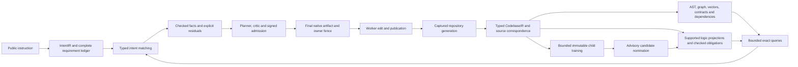

# Next gates after advisory artifact fencing

The [comprehensive plan](REPOSITORY_PROOF_INDEX_AND_CODEBASE_IR_PLAN.md) and
[32 production acceptance rows](repository_proof_index_and_codebase_ir.todo.md)
remain the governing design. This addendum orders the next work after the
[bounded native qualification](../agent_supervisor/finite_advisory_spawn_qualification.md).
It closes no production row and enables no public benchmark route.

The intended end-to-end path is:

This diagram describes the target architecture. The current authored fixture
qualifies narrower source, observation, training, lowering and native-worker
bindings. A latent vector or retrieved result supplies no checked fact, task
completion or permission to omit a requirement.

1. **Join source-bound behavioral evidence to IntentIR and admission.**
   RPI-004/005/006/012/013/014/015/028/032 must join complete proof keys, typed
   source selectors, runtime/domain assumptions and independently checked
   obligation bodies. Use one genuine satisfied requirement and one residual
   in an additive profile that preserves all administrator tasks. Freeze the
   consumed query records and exact proof/premise/effect closure into planning
   materials; independently replay them at admission. Refuse narrower theorem
   domains, contradictory premises, wrong source/model/codebook, changed
   literals, omitted requirements, incomplete query pages, unsupported types
   and stale generations. Full instruction interpretation retains its
   TIP-002/003 gates.

2. **Qualify successor invalidation and reproof.**
   RPI-007/016/023/027/032 should distinguish deterministic proof dependencies
   from model-dependent retrieval and decoding. Register reverse dependencies
   before publishing evidence. Change one source literal, one contract and one
   model independently; invalidate the conservatively affected obligations and
   recompute matches. Compare active evidence, residuals and model-dependent
   indexes with a fresh independent cold rebuild. Historical artifacts remain
   readable; successor execution requires a newly signed baseline and
   admission. Read/replay must not retrain or restore current authority.

3. **Make sharded metadata publication recoverable.**
   RPI-003/017/032 should add staged global completeness publication through
   the existing owner journal/outbox. Pin operation ID, source/index root,
   canonical payload and part population. Inject process loss before and after
   each part commit, duplicate requests and lost responses. Resume or reconcile
   against actual native DuckLake snapshots; publish one complete global root
   only after every part verifies. Query cursors must reject partial roots and
   incomplete dependency frontiers. Keep the launch archive independently
   auditable after the mutable model registry advances. Independent lake parts
   retain their separate transaction boundaries.

4. **Broaden lifecycle and resource failure qualification.**
   RPI-010/018/022/025 should cover cancellation, owner loss, lease expiry,
   response loss, a real process created before failure, active validation,
   concurrent repositories and pressure during cleanup. Preserve truthful saga
   and transaction histories, worker birth identities and cleanup capacity.
   The new no-effect refusal applies only to its exact sealed pre-Popen path
   with a fresh empty Linux tree; other failures retain repair semantics.
   Exact callback retirement remains contingent on genuine STOP and UID
   cleanup. Measure hard limits separately from sampled resource observations.

5. **Separate feature learning, semantic decoding and convergence claims.**
   RPI-008/009/011/024/027 need independent source, syntax, semantic and
   checked-property targets with frozen lineage-aware splits. Bind actual
   inference, source/codebook/weight bytes, decoder grammar and validator to
   each candidate. Run wrong-source, changed-literal/guard, teacher-substitution,
   model-off and zero-head controls. Independently check each supported logic
   projection, including assumptions and cross-family bridge obligations;
   Lean compilation alone does not establish source correspondence. Compare
   continuation with fixed canaries and forgetting controls. A finite loss
   trajectory can support a declared numerical criterion. An optimizer
   convergence theorem needs explicit assumptions verified for the actual
   loss, parameter domain, update rule and numerical execution. The current
   autoencoder fixture supplies no such theorem.

6. **Qualify scale and official outcomes before default activation.**
   RPI-019/020/021/025/026/029/030/031 retain separate exits for complete
   inventory scans, local/remote training, shared budgets, pressure, public
   entrypoints, task omission and official Terminal Bench evaluation. Preserve
   every inventory disposition independently of training/proof selections.
   Predeclare matched direct, symbolic, checked-proof and learned arms, split
   roles, tools, concurrency, cost and reward criteria. Count failed trials and
   review/contract costs. Keep hidden tests, solutions and rewards outside
   adaptation and warm artifacts. Enable default preparation only after those
   gates pass; each reduced or zero-edit task population requires its own
   explicit authority profile.

The next implementation slice should take the first gate through one complete
source-to-proof-to-IntentIR-to-admission fixture. Its acceptance artifact must
record coverage denominators, unsupported outcomes, exact current roots,
independent rechecks and all failed attempts. The artifact fence implemented
here can bind those future materials; it cannot supply their missing meaning.

The restart also exposed an evidence-retention gap. Future test, audit and
calibration drivers must write direct captures to durable qualification
directories as they run. Temporary workspaces may hold disposable DB/WAL
copies, but original commands, streams, XML, source snapshots, cost ledgers and
final manifests must survive independently. A reported historical pass with
missing raw files remains historical until fresh checks provide new retained
evidence; restoring artifacts does not retroactively qualify interrupted work.
