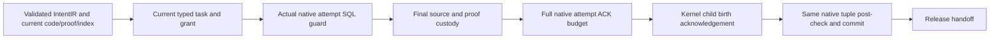

# Repository proof index and CodebaseIR: native attempt-lease addendum

The opt-in finite proof-query supervisor now has an independently checked native attempt-lease guard. **128 selected tests passed** on frozen source generation03, with independent closed DuckDB replay. Both fresh native Docker attempts failed before supervisor handoff, first during proof memory backoff and then during nested child-resource acquisition, so actual two-birth integration remains open. This increment supplies an execution-authority foundation; it does not qualify CodebaseIR training or establish a convergence theorem.

[Qualification](../agent_supervisor/finite_proof_query_attempt_lease_qualification.md) · [Machine review](repository_proof_index_and_codebase_ir.finite_proof_query_attempt_lease_review.json) · [Comprehensive prompt/IntentIR/CodebaseIR plan](REPOSITORY_PROOF_INDEX_AND_CODEBASE_IR_FINITE_PROOF_QUERY_DISPATCH_ADDENDUM.md).

## Why the separate attempt authority is necessary

A plan may bind the current prompt, IntentIR clauses, repository source, complete selected task population and proof/index keys, while the daemon's attempt has expired or been replaced in a different native store. The runtime run lease reserves the supervisor run. The worktree lease reserves its allocated worktree. A typed current claim/grant projection binds the selected task and permissions. Their successful checks cannot replace the actual daemon coordination sidecar's current claim/lease/attempt/latest-token/completion state.

The new `execute_with_task_claim_fence` holds the exact eight-field identity in one real SQL transaction before and after the callback. It passes the actual protected native lease to the callback, including authentic shortened renewal deadlines, and rejects a remaining budget of exactly 5,000 ms at entry. The broker rechecks more than 5,000 ms immediately before `prepared` and holds the coordinator transaction plus both actual process locks through the kernel birth acknowledgement. Its owner check derives the native sidecar from the genuine daemon launch and opens it with strict existing-authority validation; an absent or malformed database is refused without installation or repair.

The code changes are limited to the native coordinator primitive/strict-existing mode, the finite broker's actual attempt guard, finite-only shared daemon serialization and two source-dependency registrations. The finite profile registers 30 selected producer dependencies. The five changed production files are `merge/database_coordination.py`, `runtime/finite_proof_query_worker_dispatch.py`, `todo_daemon/implementation_daemon.py`, `runtime/finite_repository_execution.py` and `benchmarks/agent_supervisor/container_coding/finite_proof_query_worker_experiment.py`. Default daemon/supervisor routing remains unchanged.

## What this evidence establishes

The qualified run contains 64 native guard cases, 52 existing coordinator regressions and 12 structural broker/daemon cases. It retains 355 import labels/353 unique source paths, 64 guard witnesses, 72 actual guard calls, 62 closed database witnesses including deliberate invalid fixtures, 11 exact external markers and one actual OS contender. The guard's post-check can roll back its own coordinator rows/events after an external callback effect, but that effect survives. A failed guard never establishes no external effects or manufactures native failure/completion. Supplied lease/clock observations, actual native rows and process locks are tested separately from a successful supervisor kernel handoff.

The first native positive reached initial native proof publication, then refused with `proof_memory_stall` before runtime creation. Its exact instantaneous PSI value is unavailable. Its composite partial readback closes seven checks by retaining six of the original seven and correcting the distinct outer/module runner identity check on the same closed failed attempt (32.50654314199346 s plus 0.16872353499638848 s). It records 10 SMT observations/30 phases, two finite Lean compilations (768 ms), two Lean version calls (115 ms) and CPython (32 ms); source/runtime correspondence and convergence remain unproved. The same-source positive02 then failed with `LeaseTimeout` during nested `CodebaseIR.observe_current` resource admission. Both closed drivers show their containers removed and host leases/waiters drained. The [independent partial02 readback](../../../../artifacts/codebase_ir_terminal_bench/finite-proof-query-attempt-lease-20261003-01/docker-positive-02-partial-readback-01/review.json) passed seven checks in 26.103224161008256 s and confirmed `proof_memory_stall` backoff with its exact instantaneous PSI value unavailable. It retains 76 balanced resource leases, five saturation events, one timeout and no remaining leases/waiters, plus the actual native tool receipts: 10 SMT observations/30 phases (1,234/379 ms), two finite Lean compilations (2,994 ms), two version calls (414 ms) and CPython (24 ms). Final fixture provider/training/inference counters are absent and remain NULL. No further native job is scheduled in this increment. A successful positive still must close both actual wrapper and UID1001 birth guards, owner validation/publication, native STOP, UID cleanup and lease drain. Independent negative OS controls for failed-after-birth and unacknowledged-birth cleanup remain separate OPEN gates even after a positive succeeds.

## Work still required for learned CodebaseIR planning

The existing [comprehensive plan](REPOSITORY_PROOF_INDEX_AND_CODEBASE_IR_FINITE_PROOF_QUERY_DISPATCH_ADDENDUM.md) remains the governing design for these dependencies:

1. Preserve the complete public prompt and every IntentIR clause, then match them against exact current source. Unsupported, ambiguous or contradictory clauses remain visible residuals; desired intent cannot assert current code behavior.
2. Publish a complete versioned codebase generation with AST, symbols, scopes, CFG/dataflow, calls/imports/effects, dependency KG, vector/model lineage, contracts, assumptions, diagnostics, exclusions and counts. Recoverable DuckDB/DuckLake outbox publication must distinguish current native readiness from replicated history lag.
3. Validate independent source-to-model correspondence, then invalidate/rebuild affected source, contract, premise, parser, model and proof dependencies after edits. Compare full cold and incremental results and all query keys/selected tasks, rather than assuming a historical head is current.
4. Train a repository-private typed CodebaseIR only from allowed public benchmark inputs/current source and independently checked structural or semantic targets. Use real leased training, isolated corpus splits/canaries, budgeted updates, complete checkpoint/RNG/optimizer/sampler lineage, resume evaluation and fenced promotion. Hidden solutions, task rewards and desired behavior cannot become current-source facts.
5. Specify supported FOL/SMT/temporal/transition-family grammars, sorts, modalities, domains and correspondence bridges. Require exact Lean statement/theorem/premise/artifact/tool identity and reject `sorry`, weakened statements or unreviewed axioms. Successful compilation alone does not prove source or cross-family correspondence.
6. Prove a restricted convergence result for a fixed qualified encoder/features and an explicit regularized decoder objective/update rule under stated hypotheses. Connect the mathematics to the actual data, updater and floating-point error bounds. Empirical finite loss decline does not establish global nonlinear optimizer convergence.
7. Evaluate matched direct, symbolic, proof-backed and learned arms on representative official Terminal Bench tasks with full public inputs/source coverage, costs, failures and controlled hidden evaluation. Keep default activation separate from fixture qualification.

The expired-policy STOP lifecycle gap and private cached presentation-field completeness gap remain open. All 32 governing repository proof-index activation exits remain OPEN. No CodebaseIR training, complete hydration, universal logic-family correspondence or general convergence claim follows from this authority increment. The 64 new guard fixtures have zero known fits/inference; a complete count for all 128 tests or unrelated host activity remains UNKNOWN/NULL.

The evidence root is [finite-proof-query-attempt-lease-20261003-01](../../../../artifacts/codebase_ir_terminal_bench/finite-proof-query-attempt-lease-20261003-01/host-run-02/review.json). All failed source preparations, test attempts, auditors and native runs are retained. Final custody is verified separately at `../../../../artifacts/codebase_ir_terminal_bench/finite-proof-query-attempt-lease-20261003-01/final-retention-01/seal.json` with independent readback at `../../../../artifacts/codebase_ir_terminal_bench/finite-proof-query-attempt-lease-20261003-01/final-retention-01/verification/readback-01.json`; their actual results must be read separately; this document predicts no seal or verification pass.

The [closed cost ledger](../../../../artifacts/codebase_ir_terminal_bench/finite-proof-query-attempt-lease-20261003-01/accounting-preparation-01/final-ledger-03.json) sums 654.6822566919727 s across 13 measured attempt rows (three captures, two host attempts, two native wrappers and six readbacks), preserving failed/unexecuted attempts and unknown unreceipted costs. Nested Docker/prover durations are retained rather than summed again. The [32/32 selected live pin observation](../../../../artifacts/codebase_ir_terminal_bench/finite-proof-query-attempt-lease-20261003-01/ending-selected-live-pins-01.json) is a point-in-time file check, not native execution or whole-live qualification.
