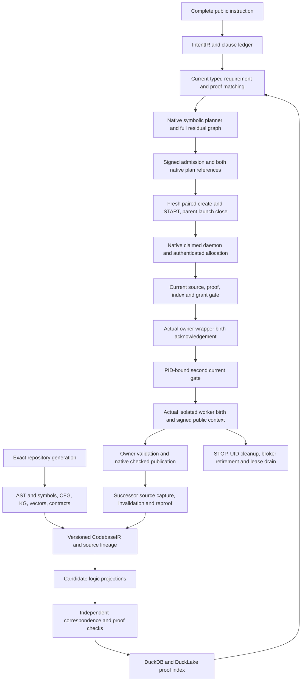

# Repository proof index and CodebaseIR: dispatch and next integration gates

This is an additive continuation of the [governing plan](REPOSITORY_PROOF_INDEX_AND_CODEBASE_IR_PLAN.md), [roadmap](REPOSITORY_PROOF_INDEX_AND_CODEBASE_IR_ROADMAP.md) and [finite proof-query join](REPOSITORY_PROOF_INDEX_AND_CODEBASE_IR_FINITE_PROOF_QUERY_JOIN_ADDENDUM.md). All 32 production acceptance exits remain OPEN. On 2026-10-03, the explicit MODEL_OFF finite dispatch fixture completed a genuine native publication and genuine late-proof and late-epoch child refusals against the same generation12 production bytes. The positive observed both owner-wrapper and isolated UID1001 births and checked two-parent publication. Both controls refused at the final current gate before an isolated birth acknowledgement, retained native callback UNKNOWN, and completed STOP, broker retirement and lease drain. These are authored integration controls, not an official Terminal Bench score or a new learned CodebaseIR qualification.

The source suite retained 22 passing calls and one diagnostic-expectation failure in generation12; the corrected hard-link control passed separately in generation13, with all 29 native production producers unchanged. The 20 allocation cases passed in generation11. Whole failed attempts remain failed. The [qualification record](../agent_supervisor/finite_proof_query_dispatch_qualification.md) and [machine review](repository_proof_index_and_codebase_ir.finite_proof_query_dispatch_review.json) bind exact generations, independent readbacks and costs. Prior native positive06 remains separately qualified against generation11; its evidence never substitutes for the matched generation12 population.

The requested path is prompt → complete IntentIR → typed requirements and logic obligations → current source/CodebaseIR/proof-index matching → symbolic plan → signed native admission → current worker gates → checked publication → successor capture and reproof. Repository-specific learned encodings propose retrieval and formalizations; current source and independent checkers determine the supported facts. Every original intent clause and native task remains represented, including unsupported and unresolved obligations.

## End-to-end route and evidence owners

The public Terminal Bench entry point and the repository-specific experimental routes remain distinct. General prompt preparation still needs the governing plan's current-code evidence wiring and complete natural-language interpretation acceptance. This opt-in finite route exercises the existing native owner, symbolic graph and signed admission with an authored two-clause fixture; it cannot substitute for parsing an arbitrary Terminal Bench instruction.

The owners remain separate: source and structural metadata belong to the native codebase index, task and plan references to the native intent repository, proof eligibility to the verification catalog, and publication to the existing supervisor task/completion path. DuckLake tables and learned vectors are projections with lineage. A serialized material, detached audit, latent neighbor or copied receipt cannot grant live execution authority.

## Current bounded change

A separate explicit finite profile binds both complete native plan references, the five canonical proof keys, complete discovery/query pages, domain and assumptions, inventory epoch, selected CAS bodies, candidate and public-context descriptors. Paired receiving and a detached parent close run after preparation callbacks and hold native owner/catalog locks across the manager launch.

The daemon sends its exact native task/attempt/claim to the owner AF_UNIX broker. Kernel peer credentials and birth identify the native bootstrap grant. The allocation join independently derives the sealed database-to-Portal binding and projected canonical task CID, authenticates the native lifecycle task index and live worktree lease, and binds its allocating process. The native database CID and the private Portal canonical CID are distinct. The local Portal retry is joined to the database attempt ordinal; a path or equal-looking alias supplies no allocation authority.

The additive linked-source profile permits exactly that one allocation and lossless Git ref packing. It preserves the canonical source/CAS witnesses, complete original ref meaning, current staged entries, exact allocated branch at the baseline commit and bidirectional Git administration bindings. The old ordinary-Git prelaunch profile remains strict. Native process grant renewal can extend the same grant deadline; both final coding gates require a fresh full acknowledgement budget. The registered wrapper obtains a second gate bound to its actual PID/birth before sudo launches the isolated UID1001 worker.

Public signed history reaches the worker without owner credentials. Explicit per-call metadata suppression covers signature verification, integer compilation, source adapters and AST reconstruction, while compiler/AST bodies and CIDs stay identical. Default owner mirroring remains enabled. Owner checks and publication determine completion. STOP remains available after authorized edits and stale source/proof/index generations; unresolved cleanup retains custody. Full allocation/source material and bounded raw witness copies are retained before linked teardown for independent readback.

This is a MODEL_OFF authored two-task/five-input integer fixture. The conditional SMT and Lean results retain their model, domain, assumptions and runtime scope. This increment executes zero learned training or inference, adds no complete DuckLake hydration, and establishes no universal source theorem, CPython equivalence, general semantic decoder, optimizer convergence or official Terminal Bench score.

## Next implementation and acceptance sequence

| Gate | Implementation | Acceptance evidence |
| --- | --- | --- |
| Complete public prompt and source-to-model correspondence | Bind original instruction bytes/UTF-8 spans, every clause/quantifier/polarity/guard/artifact/environment constraint and native task to the actual Terminal Bench preparation call. Lower only independently supported source/type/effect/model correspondences from one observed generation. | Actual public Bottle input and authored finite control run separately. Unsupported, ambiguous, contradictory and uncovered clauses stay residual. Wrong operator, shadowed builtin, omitted branch/effect, unsupported type or same-HEAD dirty edit refuses eligible facts. No candidate can truncate coverage. |
| Independently checked native attempt lease | Add an owner-held join to the actual attempt coordination store, beyond the signed claim receipt, run lease and worktree lifecycle lease. Bind task, claim, attempt, lease ID, fence/epoch, expiry and exact owner before both coding gates. | Genuine expired/replaced/cancelled attempt leases refuse; unrelated leases and task aliases cannot substitute; same-owner renewal preserves identity; STOP and UID cleanup remain available. The current allocation material explicitly keeps independent_attempt_lease_checked=false. |
| Source successor and proof invalidation | Register reverse dependencies at publication. After a genuine edit, capture a new complete source root, invalidate affected facts, contracts, proof keys, KG edges and model-derived vectors/decodings, and reprove supported obligations before signing successor admission. | Source-only, contract-only, assumption-only and model-only changes have distinct invalidations. Old artifacts remain historical. Incremental and independently cold rebuild agree on complete active obligations, residuals, dispositions and current proof eligibility. |
| Recoverable native metadata generations | Use existing source/model/proof owners; publish a derived typed planning projection rather than a competing head. Journal/outbox every immutable part, verify global completeness and then publish the root to DuckDB/DuckLake. | Fresh file-backed restart reconstructs AST and symbols/CFG, KG, vectors and lineage, contracts, assumptions, source selectors, dependency edges and proof references. Crashes and duplicate delivery around object/index/root commits never expose partial authority. Queries retain bounded root-bound cursors and all coverage denominators. |
| Repository-specific learned CodebaseIR | Train only from a published source/metadata generation. Keep exact encoder/decoder and objective lineage, split roles, source/target manifests, optimizer/seed/config/checkpoints and actual resource receipts. Preserve 8D feature and proposed 384D semantic lineages separately. | Reconstruction and held-out metrics, mutation and unsupported-language controls, deterministic target correspondence, forgetting/canary checks and exact checkpoint restart. Generated syntax/logic must type-check and pass independent source/model correspondence checks. Unknown/refuted/timeout evidence cannot become proved targets. |
| Logic-family projections and Lean | Define versioned typed projection contracts for each supported family in datasets logic, including FOL/SMT, TDFOL and CEC/DCEC where applicable, and explicit Lean lowering. Preserve types, assumptions, domains, source/dependency/model/compiler identities and uncertainty. | Each supported projection passes grammar/type checking and independent replay; wrong sorts, omitted premises and unsupported operators refuse. Actual Lean compilation/kernel receipts bind the exact generated artifacts and libraries. Cross-family composition requires a checked translation; accepting one model does not certify every family or arbitrary runtime behavior. |
| Convergence claims | Separate measured reconstruction decline/stability from theorems. For a restricted objective, specify parameter domain, update rule, smoothness/convexity assumptions and numerical interpretation, then connect the actual retained updates to that theorem. | A Lean result states and verifies its hypotheses and objective. A theorem for a restricted quadratic/linear profile cannot be transferred to nonlinear autoencoders or Adam/AdamW. Recorded epochs, failed trials and finite trajectories remain measurements until this correspondence is qualified. |
| Representative Terminal Bench invocation | Wire the reviewed prompt/IntentIR/current-source route into an explicit benchmark arm; retain direct, symbolic, checked-proof and learned arms with matched task/resource budgets. Keep hidden tests, solutions and rewards outside adaptation. | Complete task/disposition and failure/unknown accounting, actual rewards, initialization/adaptation cost, lifecycle/recovery/federation and cold-replay evidence. Default activation and task omission require their existing production exits. |

Cache identity must bind source/dependencies, parser/compiler/logic-family versions, contract/premise/assumption/domain identities, checker and environment policy, and model lineage when relevant. Discovery and learned vectors rank candidate units; complete authoritative source/proof queries still close current eligibility. A miss, unsupported region, failed proof, unknown result and stale record remain distinct outcomes.

Qualification is generation-specific. Read-only retained source, actual host imports and separate container producer/copy checks provide cooperative byte evidence, not arbitrary OS-write atomicity or live process-origin attestation. Failed and interrupted attempts, their exact sources and cumulative costs remain retained; later success never rewrites an earlier failure.

The final selected-source read observed one current `local_planning_admission.py` change outside frozen generation12. Its bytes and diff are retained without overwriting the live edit. The native three-case qualification remains attached to the immutable tested generation; it does not qualify the changed whole current runtime.

## Concrete interfaces for the next increments

The existing `RepositoryCodebaseIndex.prepare_current`/`observe_current` owns current source and structural head publication. `current()` alone is a stored head lookup, and an exact retry can return a historical operation receipt. `DuckDBASTStore` already projects source revisions/files, AST blobs/nodes, scopes/symbols, imports/references/calls/effects/interfaces, diagnostics and invalidations. Reuse these records and coverage dispositions rather than creating a competing scanner head.

Native semantic state and dependency changes currently use immutable CAS records and `SemanticIndexStore` head compare-and-swap. `CodeVectorIndexSnapshot` and `CodeSymbolLineage` are typed retrieval/model artifacts; these APIs do not establish a fully hydrated authoritative SQL knowledge graph or vector table. Proposed derived generation tables must bind their native roots, complete counts, unresolved edges, dimensions and source/model lineage. Existing meta-index catalog locators and links are discovery, not evidence that all metadata is present.

`CodebaseVerificationCatalog.publish`, `query_many_current` and `rebuild_current` already separate immutable proof evidence, current inventory, canonical keys and dependency rows. Rebuild advances the native epoch even for equal inventory content. Preserve that owner, the complete root-bound query pagination and the exact five keys in this fixture. Cache schema v1 has 16 dimensions: source, expression, formalization, slice, obligation, assumptions, bounds, translation, provider, environment, policy, schema, checker, network_policy, evidence_kind and authority_ceiling. Bind new dependency, model and family semantics in canonical preimages and native dependency records; new top-level fields require a versioned migration.

`AutoencoderRegistry` owns run/input snapshot registration, claim/renew/complete, evaluation-gated model head promotion and its event/outbox history. `deliver_ducklake_history` is bounded history delivery, not training, complete metadata hydration or production activation. The next metadata journal must reuse these owners and publish one complete derived root only after native AST, source, KG/dependency, vector, contract/assumption and proof parts are durably checked. Each part needs expected/observed record counts, cursor exhaustion, exclusions/parse failures/unsupported regions and source/model/checker/schema identities. Fresh-process recovery must independently read physical DuckDB/DuckLake rows and agree with a cold rebuild; an in-memory success or registered locator cannot satisfy this acceptance.

`decode_intent_ir`/`validate_intent_ir` supplies typed intent documents; `IntentFormalizationCompiler` supplies parse/type-check/lower/route operations and supported family projection APIs. `match_intent_codebase` consumes validated current evidence, and does not itself infer or prove source semantics. `build_intent_planning_materials` and `build_intent_symbolic_plan` require the explicit supported operations and exact signed task/requirement population. The public prompt adapter must add a complete clause/span ledger, exact repository-generation bindings and uncertainty/unsupported dispositions before using these paths. Desired intent is a requested property, never an observed label for current code.

The independent attempt-lease gate must use the existing native `DatabaseCoordinator.protect_task_claim` semantics: actual task_claims, fenced_leases, task_attempts, latest token_history and task_completions in one owner transaction. The current remote task-control receipt and local execution/coordination sidecars have different ownership and access semantics. Add an owner-authorized read/protect channel or a qualified process-serialized owner adapter, rather than blindly opening a live daemon database. Tests must expire/replace real coordination leases while preserving the signed receipt, then show both coding gates refuse. Current receipt/run/worktree joins do not claim this independent check.

## Repository-specific adaptation and proof acceptance

A training corpus records the Terminal Bench task ID/version and public instruction, exact repository checkout including dirty bytes, allowed input dispositions, AST/symbol/dependency roots, independently checked contracts and supported logic targets. Keep task solutions, hidden tests and rewards outside adaptation; record train/validation/test roles and every excluded input. The authored five-input integer fixture is an integration control, not an official Terminal Bench task score or a general training corpus.

The proposed typed CodebaseIR unit records source selector/span, parser/frontend version, symbol and type, supported effects and dependency references, contract/domain/premise identities, projection routes and explicit unresolved regions. A source observation, a proof obligation, a generated candidate and a checker result have separate types. Autoencoder targets use independently captured structure or independently checked semantics. Unknown, refuted and timed-out obligations retain their status; reconstruction confidence cannot relabel them proved.

On each published source generation, first run the deterministic model-off arm. Select frozen or train mode only through a leased registry run with explicit CPU/GPU/memory/time budget. For training, retain encoder/decoder architecture, objective and target version, exact input/target roots and splits, seed/RNG state, optimizer state, configuration, checkpoint hashes and actual epoch/resource outcomes, including failed trials. Resume from a retained checkpoint and compare with uninterrupted supported execution. The current 8D feature profile and proposed 384D semantic embedding space remain separate schemas and lineages.

Measure held-out reconstruction and retrieval, invalid/unsupported decoding rate, checker acceptance/refutation/timeout, source-mutation sensitivity, canary leakage/forgetting, wall time and full initialization/adaptation/checking cost. Promotion requires independent evaluation and head compare-and-swap; a lower training loss alone grants no planning or proof authority. Each decoded family candidate must pass grammar/type checks and independent source/model correspondence before its exact Lean/SMT proof is eligible. Perturbed sorts, omitted premises, wrong source generations, stale model checkpoints and inconsistent family translations must refuse while retaining all residual intent clauses.

For a convergence theorem, publish the exact restricted objective, parameter domain, update rule, assumptions and numerical interpretation, then prove in Lean and check correspondence to the retained actual updates. Finite loss decline from current repository feature training remains an empirical result. A restricted convex/linear theorem cannot certify a general nonlinear encoder/decoder or Adam/AdamW execution. Global convergence remains false until the applicable theorem, hypotheses and actual update correspondence are independently qualified.

## Open trust and coverage limits

The linked-source capability binds current source and proof witnesses and exact authenticated allocation. Its cached private presentation material still needs an independently rebuilt closed schema/body check for every descriptive MODEL_OFF/authority flag; a self-consistent private mutation by trusted Python can currently mislabel some descriptive fields without a demonstrated bypass of the actual grant/source/proof gates. Keep this hardening item open and add genuine mutation controls before claiming hostility resistance for arbitrary in-process callbacks. Signed public descriptors remain immutable in the qualified public verification scope.

Native provider callback intent can durably remain `started_outcome_unknown`/`unknown_may_have_started` after a genuine late child refusal. Preserve the exact claimed/context cursor, full claim tuple, Portal basis and complete actual execution ledger after STOP. A fixture reporting that its refusal checks completed does not report native task completion or no external effects. Positive qualification still requires the actual native completed task and checked two-parent publication.

All 32 governing RPI production exits remain OPEN. This increment adds no default Terminal Bench activation, learned semantic decoder qualification, complete lake hydration, universal source/runtime correspondence, arbitrary process-origin guarantee or global optimizer convergence theorem. Source generations, independent readbacks and native outcomes remain separately scoped.

## Reviewed current Terminal Bench entry point

`FullSupervisorAgent.run` in `full_supervisor_harbor_agent.py` writes and uploads the complete instruction, then invokes `terminal_container_supervisor` with the selected arm and285-second budget. An explicitly supplied requirement contract is transported as its own artifact. `terminal_indexed_preparation.prepare` signs declarations and constructs `PromptWorkflowRequest`; `_planning_strategy` selects direct when no contract is supplied, intent_symbolic for the supported v2 requirement contract, or the coverage path for the other supported contract. The symbolic policy disables model planning for that selection. Current public Bottle scanning explicitly includes bottle.py, instruction and smoke input under a bounded allowlist. This is not a general whole-repository formalization scan.

The opt-in `prepare_repository_preview` uses `RepositoryCodebaseIndex.prepare_current` and binds the prepared repository/source roots. `preview_prepared_repository_plan` builds exact typed intent planning materials and goes through native plan creation/current-source checks. The new finite proof-query experiment is a separate explicit fixture using the same supervisor owners and worker boundary. Its checked integer control does not replace the complete natural-language entry-point acceptance above.

For the requested route, add an explicit reviewed preparation arm that produces the full typed clause ledger and requests complete current repository/proof-index evidence before `PlanCreateService`. Bind that result to the existing signed materialization/admission path. Preserve default behavior until representative lifecycle, coverage and matched benchmark acceptance qualifies activation.

## Specific next training and theorem trial

The next source-generation-bound experiment should retain a frozen parent and private child registry head, exact published structural/contract targets and split/mask/canary manifests. Run deterministic model-off, frozen and bounded adaptation arms over identical captured public inputs. Persist optimizer moments/step, RNG, sampler position, precision and actual update log, then resume in a new process and compare with an uninterrupted control under a declared numerical tolerance. Freeze the selected model before preview/admission. Budget optional/required adaptation explicitly, retain refusals and fallback dispositions, and charge initialization, failed fits, projection/checking and teardown.

For a first convergence theorem, fix independently qualified encoder/features and use a regularized linear decoder objective. Establish the exact strong-convexity/smoothness constants and permitted step, prove the mathematical contraction/convergence statement in Lean, and bind the actual retained dataset/parameters/update rule to its hypotheses. Native finite precision needs a stated roundoff/error correspondence bound; it cannot inherit an ideal real-arithmetic theorem automatically. A different nonlinear/joint encoder objective or Adam(W) trajectory retains only its measured finite-loss claims.

For every supported logic family, publish a capability matrix naming source fragment, parser, type system, lowering, checker and Lean bridge. Bind expected theorem names/types, all premises, imports/tool/library identities and a reviewed axiom allowlist. Reject sorry/admit, unreviewed axioms, weaker signatures and omitted premises. Unsupported modality/sort/operator is an explicit disposition; compiling one generated model theorem grants no universal source theorem or all-family equivalence.

Expired native authorization is an additional observed lifecycle gap: host11's shared test exhausted its authored300-second grant while independent fixtures ran, and decision construction failed before STOP execution. The test ordering fix preserves the same grants and policy checks while avoiding that unrelated delay. It does not qualify STOP under expired authority. Future native recovery/cleanup tests must preserve a coherent denied/expired authorization decision and exercise an explicitly authorized cleanup route; proof staleness and policy expiry are distinct conditions.

## Review and retained evidence

The [source/API plan review](../../../../artifacts/codebase_ir_terminal_bench/finite-proof-query-dispatch-20261003-01/drafts/dispatch_architecture_addendum_03.api-plan-review.json) distinguishes existing owner interfaces and tables from proposed modules. The [attempt cost ledger](../../../../artifacts/codebase_ir_terminal_bench/finite-proof-query-dispatch-20261003-01/attempt-cost-ledger-final-01.json) retains failed, successful and unexecuted preparations separately. The [final retention manifest](../../../../artifacts/codebase_ir_terminal_bench/finite-proof-query-dispatch-20261003-01/final-retention-01/seal.json) and its [independent verification](../../../../artifacts/codebase_ir_terminal_bench/finite-proof-query-dispatch-20261003-01/final-retention-01/verification/readback-01.json) cover the retained increment. Retention establishes byte preservation, separately from source semantics, proof applicability, worker qualification and production activation.
