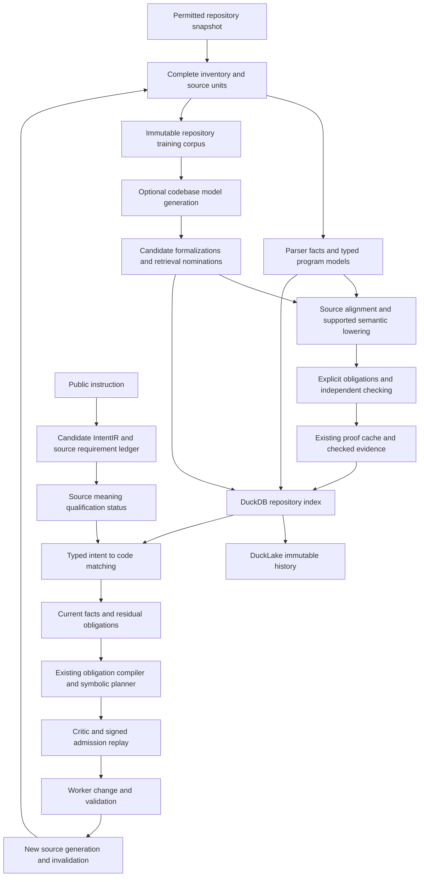

# Repository Proof Index and Codebase IR Training Plan

Build two independently grounded inputs for the supervisor: IntentIR for the requested behavior and CodebaseIR for the repository as it exists. Scan exact current source, train or reuse a repository-specific autoencoder, project supported candidates into the existing logic families, independently check their source correspondence and properties, and resolve intent against a native proof index. The symbolic planner consumes established facts and remaining obligations from that resolution. A new source generation repeats the affected scan, training, checking and matching work before a successor plan can run.

Status: production integration and qualification work remains proposed, refreshed on 2026-10-02 against current source and retained repository, finite-observation and local parallel-training evidence.

The subsequent [finite proof-query dispatch qualification](../agent_supervisor/finite_proof_query_dispatch_qualification.md)
records a genuine native publication and late-proof/epoch refusals on matched
generation12 production bytes. Its [integration addendum](REPOSITORY_PROOF_INDEX_AND_CODEBASE_IR_FINITE_PROOF_QUERY_DISPATCH_ADDENDUM.md)
specifies the remaining current-code IntentIR, metadata recovery, repository
adaptation, logic projection and restricted convergence gates. This opt-in
MODEL_OFF integer fixture adds no training or complete metadata hydration and
closes none of the 32 production acceptance exits.

The subsequent [native task-attempt lease qualification](../agent_supervisor/finite_proof_query_attempt_lease_qualification.md)
adds an exact live eight-field claim/lease/attempt check held through each child
acknowledgement in the opt-in proof-query route. Its
[attempt-lease integration addendum](REPOSITORY_PROOF_INDEX_AND_CODEBASE_IR_FINITE_PROOF_QUERY_ATTEMPT_LEASE_ADDENDUM.md)
records 128 passing selected tests and independent closed DuckDB readback.
Both fresh native worker attempts stopped at proof-memory-pressure admission
before either handoff; qualification of both worker births with the changed
guard remains open. Training, complete metadata hydration, convergence and all
32 production acceptance exits remain open.

The subsequent [native guarded-launch qualification](../agent_supervisor/finite_proof_query_attempt_lease_native_qualification.md)
closes that positive launch gap on the same frozen generation03: both actual
births pass the native attempt guard, public checks and publication succeed,
and native STOP/UID cleanup complete, with 12/12 independent closed checks.
A separate fresh generation04 passes 27 scheduler refusal-diagnostic tests
without changing admission policy. Its
[next-boundary addendum](REPOSITORY_PROOF_INDEX_AND_CODEBASE_IR_ATTEMPT_LEASE_NATIVE_ADDENDUM.md)
keeps actual post-birth negative controls, native integration of the new
diagnostics, current-code IntentIR matching, complete metadata recovery,
private model adaptation and restricted convergence as separate open gates.
All 32 production acceptance exits and default benchmark activation remain open.

A subsequent [bounded production installation milestone](../../../ipfs_datasets/workspace/shared-prover-installation-runtime-qualification-20261002/REPORT.md)
adds a finite default overall portfolio deadline and routes ordinary Isabelle
setup/lazy installation through the shared owner. A bounded worker only stages
checksummed archives; the controller retains the prior tree and launcher until
fresh bounded checks pass before and after publication. Cancellation rolls back
ordinary transactions, and unfinished bounded cleanup is recorded explicitly.
A fresh local HTTP installation of retained official bytes qualifies this route;
it does not establish a fresh remote download. Direct legacy/custom installers
and some outer discovery/lock paths remain outside that containment; persistent
HOL builds now have the separate staged path below. This extends partial RPI-022/024/025 evidence without
closing source/IntentIR correspondence, mixed-family composition, aggregate OS
enforcement, broad many-core scaling or public service activation.

The [persistent HOL build measurement](../../../ipfs_datasets/workspace/isabelle-hol-build-qualification-20261002/official-hol-build-6g/result.json)
extends the same owner to an explicit staged system-heap rebuild from a verified
retained archive, with downloads disabled. A fresh HOL UUID, preserved Pure
artifacts, fresh staged/published readiness and matching published heap manifests
establish persistent output. Its unchanged shared parent reserved four CPU
credits, twelve process credits and 6,400 MiB, with a 6 GiB sampled native RSS
budget. The build worker took 286.896 seconds, the cold transaction 329.660,
warm verification 10.319, and the full benchmark 347.482 seconds. Sampled
processes and owned leases drained; the earlier smaller-JVM failure and separate
recovery remain retained. The
[final qualification](../../../ipfs_datasets/workspace/isabelle-hol-build-qualification-20261002/REPORT.md)
records 1,217 distinct cases with passing latest results and zero latest errors
or skips. Raw execution retains 1,219 runs, including two timeouts that passed
exact unchanged-source retries without relaxing limits. This adds partial
RPI-022/024/025 evidence without qualifying general source/IntentIR matching,
proof composition, aggregate cgroup enforcement, crash-atomic publication,
broader many-core scaling or service activation.

The separate [native cancellation control](../../../ipfs_datasets/workspace/isabelle-hol-build-qualification-20261002/native-cancel/result.json)
passed sixteen checks after observing active Java and two Poly/ML processes in
three groups/sessions. Sampled PID/birth identities stopped before return,
publication was refused, and a separate admitted cleanup removed retained
staging without changing the cancelled receipt. This narrows observed native
lifecycle gaps; hostile daemon containment and aggregate cgroup limits remain open.

The subsequent [public Isabelle adapter qualification](../../../ipfs_datasets/workspace/isabelle-hammer-execution-qualification-20261002/REPORT.md)
routes default capability, goal capture and reconstruction through shared
admission and fresh native phase leases. Early source bounds precede encoding,
instrumentation and parsing; unexpected controller exceptions also trigger
observed subprocess cleanup. Its selected native and regression evidence is
reported separately from the earlier source generation. The adapter deadline
covers one operation, not a composed MCP workflow. Trusted HOL, caller theories
and installed components remain outside a hostile-source sandbox; Lean/Coq
legacy routing and aggregate cgroup enforcement are still separate gaps.
The [read-only index audit](../../../ipfs_datasets/workspace/isabelle-hammer-execution-qualification-20261002/repository-index-gap-audit.json)
recommends the next independent RPI-007/032 increment: normalized exact proof-key
membership and reverse dependencies, with cursors bound to both the source head
and sealed evidence inventory. That projection remains unimplemented by this
milestone, and historical conditional evidence cannot gain behavior or admission
authority through discovery.

The selected public-adapter native fixture passed twenty checks in 51.014
seconds with no observed admission backoff. True reconstruction was accepted,
false reconstruction was rejected, and actual in-flight capture cancellation
drained observed descendants and owned leases. The earlier pressure-affected
run remains historical evidence with its own source hashes. Latest regression
outcomes comprise 1,460 passes and ten PATH-gated legacy Coq skips across 1,470
distinct cases; native Coq remains unqualified. Raw execution retains 1,480
cases and one obsolete executable-path assertion failure, followed by a passing
complete ten-case file recheck with unchanged production code. Direct generic
canonical-backend callers still need their own shared-admission integration.

All 32 production acceptance tasks remain open. Existing source extraction, repository feature training, candidate formula decoding, verification, caching and symbolic planning components are reusable. The comprehensive design refresh itself ran no scanner, training job, prover, service or benchmark; subsequent execution is recorded separately below. The [implementation roadmap](REPOSITORY_PROOF_INDEX_AND_CODEBASE_IR_ROADMAP.md) gives the next integration gate; the [implementation backlog](repository_proof_index_and_codebase_ir.todo.md) retains ownership, dependencies and exit conditions. The [comprehensive review](repository_proof_index_and_codebase_ir.comprehensive_refresh_review.json) records selected ending observations separately from unchanged historical reviews and execution receipts. Those file digests are not an atomic capture of the entire working tree.

The subsequent [finite repository admission qualification](../agent_supervisor/finite_repository_admission_qualification.md)
implements the local model-off admission and task-commit increment. The complete
signed task population retains its original native completion guards. All 38
current boundary cases pass; a seven-unit native fixture completes in 50.720
seconds, with actual public checks, historical restart and agreement between an
explicit source successor and a cold finite observation. No worker runs in this
fixture. Native launch/publication, general semantics, live Quack integration
and zero/reduced-task authority retain their separate gates.
The [finite admission review](repository_proof_index_and_codebase_ir.finite_admission_review.json)
records its selected source identities and separate execution/test histories.

The later [finite worker qualification](../agent_supervisor/finite_repository_worker_qualification.md)
completes a distinct model-off crossing in 83.397 seconds: live Quack ownership,
actual prerequisite claim/check/completion, held launch capacity, isolated UID
1001 edit, public checks, native merge/completion, STOP and a freshly signed
successor. Both original tasks remain completed. Nine specified finite outcome
fields agree with a cold capture, and owner-local fresh-process historical replay
passes. The fixture explicitly removes its observed retained pool worktree after
STOP; automatic pool recovery remains open. This adds partial
RPI-013/014/015/016/022/023/032 evidence and trains no model. The
[worker review](repository_proof_index_and_codebase_ir.finite_worker_review.json)
retains current source, execution and separate test histories; all 32 production
exits remain open.

A subsequent additive [reviewed-candidate qualification](../agent_supervisor/finite_repository_candidate_qualification.md)
completed a bounded native join requalified against its retained `0261fd...`
process-runner dependency. Its
[retained seventh execution](../../../../artifacts/codebase_ir_terminal_bench/finite-reviewed-candidate-qualification-20261002-07/result.json)
took 230.620 seconds across separately budgeted phases, with 32 actual attempted
training epochs, cold owner/model verification and exact DuckDB/DuckLake metadata
restart. The [prior 266.063-second execution](../../../../artifacts/codebase_ir_terminal_bench/finite-reviewed-candidate-qualification-20261002-05/result.json)
retains its earlier dependency identity as separate historical evidence. It
combines that signed model-off boundary
with a freshly reserved, fixed trusted proposal subprocess, explicit owner
application of reviewed replacement bytes, successor capture and advisory
parent/child fitting. The separate datasets
[AST-lowering profile](../../../ipfs_datasets/ipfs_datasets_py/logic/software_contracts/codebase_integer_lowering_lean.py)
proves evaluation preservation for every value of the closed offset AST grammar
and every mathematical integer input, plus correspondence of an independently
reconstructed native ProgramIR target. Parsing, CPython/runtime equivalence and
physical source origin remain outside that theorem; it cannot promote a finite
observation into a universal source fact. Its new `@2` process policy explicitly
binds a 1 MiB compiled-output allowance to the unchanged baseline tool policy;
CPU, memory, input, workspace and deadline limits retain their declared bounds.
The proposal child has no mutation or task-completion API, and its same-UID
execution does not establish key isolation. The
[current independent read-only audit](../../../../artifacts/codebase_ir_terminal_bench/finite-reviewed-candidate-qualification-20261002-07/independent-audit.json)
passed and verified all 1,637 primary artifact pins. This qualifies the bounded
joined profile, not the runner's general process lifecycle. Next integrate these
prerequisites with the separately qualified model-off worker crossing above.
Signed task omission, learned semantic decoding
and optimizer convergence retain their existing exits. All 32
production acceptance tasks remain open.

The additive [advisory-to-worker qualification](../agent_supervisor/finite_repository_advisory_join_qualification.md)
completed its ten-file, two-task, five-input native join in 297.529 seconds. It
returned 48 epochs, preserved thirteen finite/task fields across advisory modes,
fed exact trusted proposal bytes to the actual isolated worker, completed native
publication/STOP and captured a successor agreeing with nine cold fields. Fresh
current numerical and historical replay fitted nothing; the independent archive
audit verified 36,801 retained files. Failed attempts, returned fitting and
recorded execution costs remain explicit. This bounded structural profile closes
no production acceptance task or default activation gate.

The additive [whole-inventory inference qualification](../agent_supervisor/codebase_inventory_scan_qualification.md)
implements `source_bound_inventory_scan_v1` with a default optimized path and
explicit opt-out. The current native fixture accounts for all 28 entries,
infers 22 rows across two shards with exact float64 agreement, and passes
thirteen integrity/current-source/cancellation controls plus three explicit
budget deferrals. It preserves owner/checkpoint state and fits nothing while
scanning. Reused weights/vocabulary and shared target transport reduce repeated
work; the measured 6.153 versus 5.801 seconds establish no throughput gain.
The [inventory review](repository_proof_index_and_codebase_ir.inventory_scan_review.json)
retains distinct attempts, actual setup fitting and selected source closure.
Broader proof publication, authoritative query reuse, larger resumable captures
and the remaining RPI-029/032 exits retain their separate gates. All 32
production rows remain open.

The subsequent [inventory and conditional evidence join](../agent_supervisor/codebase_inventory_evidence_join_qualification.md)
implements the additive current-source scan/query/model-off preview boundary.
Complete source membership survives inference and query budgets; absence is
reported only for a complete exact selector. Retained evidence pages and native
summaries replay before reuse, and fresh source/model/evidence fences surround
planning. Every independently authored task and runtime requirement remains.
The 204 new boundary cases pass. The pinned 8D CPU integration also passes five
scan profiles, four native previews and twenty refusal controls; independent
source/archive audits preserve the complete staged generation and owner exports.
The [join review](repository_proof_index_and_codebase_ir.inventory_evidence_join_review.json)
retains all four native attempts and their costs. This is partial
RPI-013/022/023/029/032 work and grants no proof,
admission or worker authority. All 32 production acceptance tasks remain open.

The subsequent [resumable inventory and worker increment](../agent_supervisor/codebase_inventory_resume_worker_qualification.md)
adds a separately versioned complete root, bounded immutable pages, restart
cursors and a completion record for captures above the legacy 256-member limit.
Explicit manifest version 5 and receipt version 3 bind the full advisory context
while preserving original tasks and checks. A separate owner-held execution
scope gates the public artifact and native worker lifecycle. Default inference
reuse retains an opt-out and fresh source/model fences. The composed pinned
300-file 8D CPU integration now joins an independently audited historical scan
and four process resumptions to fresh signed native-worker execution, publication,
explicit cleanup and old-scan invalidation. The
[machine review](repository_proof_index_and_codebase_ir.inventory_resume_worker_review.json)
retains failed attempts and measured costs. All 32 production exits remain open.

The later [source successor and runtime custody increment](../agent_supervisor/codebase_source_delta_and_runtime_qualification.md)
adds a complete, source-only old/current publication ledger with default batched
receiving and reference opt-out. Its native 300-member and ignored-but-present
controls pass independent closed-archive review. It separates exact entry
retention, byte equality and AST identity, and grants no learned-output reuse or
physical-absence authority. Current runtime failure cleanup retains original
transport, completion binding and run-fence custody until actual disposal; the
fresh signed 300-member worker qualification also passes in its separate
[review](repository_proof_index_and_codebase_ir.source_delta_runtime_review.json).
Learned successor scans and cross-shard proof dependencies retain their exit gates.

The [source-bound successor model and planning increment](../agent_supervisor/codebase_source_successor_qualification.md)
adds an explicit already-trained direct-child coordinator and a complete
source-ledger consumer for native model-off planning. A fresh 300-member source
transition, two explicit setup epochs, fresh default/reference 32-member
inference prefixes and cold receiving pass native qualification. Selection
fits nothing; the planner retains both authored requirements and tasks without
behavioral facts. The [separate review](repository_proof_index_and_codebase_ir.source_successor_review.json)
records the closed audit, exact source/test identities, failed deadline attempt
and measured costs. This partial RPI-013/022/023/029/032 work keeps all 32
production exits open. Full successor completion, signed successor admission,
global dependency closure and acquisition beyond the current capture profile
remain separate gates; repeated lineage replay is a measured speedup candidate.

The later [complete successor scan and device inference qualification](../agent_supervisor/codebase_successor_expansion_qualification.md)
adds a full ten-page CPU8D scan for all 300 captured members, four fresh-process
resumptions, and separate signed native dispatch retaining both original tasks.
The worker passes public checks, publishes source generation 3, stops and closes
its owned resources; dispatch fits nothing and runs no scan inference. Separate
actual GTE and Legal8/384 private-head CUDA jobs retain CPU opt-out and unchanged
checkpoints/Adam state; the released published core remains on CPU. The
[closed machine review](repository_proof_index_and_codebase_ir.successor_expansion_review.json)
retains independent byte receiving and failed attempts. These bounded gates do
not establish general CodebaseIR384, CUDA structural features, source semantics,
process-origin attestation, automatic crash recovery or global proof closure.
All 32 production acceptance rows retain their existing status.

## Operating decisions and next integration

The target is one frozen planning generation joining the current repository,
the complete instruction and independently eligible evidence. Autoencoders help
represent, retrieve and propose formalizations; source correspondence and the
selected checking policy decide whether a property can satisfy intent.
Repository-specific weights remain an immutable adapter over shared typed
semantic definitions. The source-derived IR corpus remains available separately
from its learned representation.

| Decision | Implementation direction |
| --- | --- |
| Current source | Reuse `RepositoryCodebaseIndex.prepare_current`, `CodebaseHead`, exact captured bytes and complete inventory dispositions. Git HEAD alone is insufficient. |
| Repository inference | Preserve cohort-bound 8D inference. Use the bounded `source_bound_inventory_scan_v1` scanner or explicitly selected versioned root/page/cursor/completion protocol with complete dispositions and reference opt-out. The pinned 300-member resumable scan and composed signed worker are qualified; general large-tree acquisition and cross-operation residency remain separate. Inference selection, training selection and proof selection remain separate. |
| Model adaptation | Explicit model-off, frozen, optional bounded child or required child. Freeze selection before planning; queries and admission replay fit nothing. Optional failure retains the declared fallback. |
| Semantic decoding | Keep registered 8D feature profiles. Qualify a new source-conditioned 384D input profile with independently recorded latent width, typed targets and source correspondence; dimensions alone do not establish compatibility. |
| Proof projection and eligibility | Reuse `CodebaseVerificationCatalog` and complete-key cache gates. A joined catalog is a derived discovery/planning projection; it cannot create source heads, promote models or grant proof authority. |
| Storage | Native DuckDB for owner-controlled hot queries/control; immutable CID artifacts for full source/model/evidence; typed Parquet/DuckLake for bulk history at an exact catalog/snapshot identity. |
| Local training performance | Reuse default indexed retries and bounded parallel clients, including control headroom, immutable execution policy and joined cleanup. Keep explicit opt-outs. |
| Federation and future gradients | One aggregate per compatible lineage and independent 8D/384D rounds. Source-bound 8D uses binary FedAvg deltas and aggregate Adam reset; each 384D profile retains its declared updater. Future collective mode requires a qualified accelerator/MCP++ backend. |
| Symbolic planning | Preserve every original clause, satisfied/residual root, exact property/domain binding and reviewed operation effect through compiler, planner and critic. |
| Admission and successors | Independently observe live roots at signing, task commit and launch. An edit invalidates affected evidence and requires rechecking, rematching and a newly signed successor context. |

The authored model-off fixture now supplies the current-source planning, signed
admission, actual native worker and successor crossing, including the same-name
decoy and unsupported unit. Its observed facts remain confined to five explicit
inputs, and its held launch reservation is separate from preview feasibility.
The successor is independently signed against the published Git baseline.

The bounded advisory join now preserves complete meaning across model-off,
root-frozen and selected-child previews, then joins the reserved proposal to
actual worker publication and zero-fit successor replay. Optional adaptation
failure/fallback and broader service selection retain their own qualification.
The additive bounded scanner now supplies complete inventory dispositions, and
the new conditional evidence join binds its advisory references into native
planning materials. The composed 300-member qualification now joins larger
resumable scans and signed full-task advisory admission to the native worker.
Next extend general large-tree acquisition, incremental successor scans and
cross-shard proof dependencies, with independent source semantics and eligibility.
Freeze exact model lineage before planning,
account fitting and inference, and reject late selection changes.
Broader source/runtime semantics, automatic worktree recovery and complete public
instruction meaning retain independent gates.

The [roadmap](REPOSITORY_PROOF_INDEX_AND_CODEBASE_IR_ROADMAP.md#next-integration-deliverable)
defines owners, required retained artifacts and mutation cases for this result.
RPI-012 through RPI-016/032 remain its planning/admission gates, with
RPI-001/005/006/007/022/023/028 prerequisites and TIP-002/003 for complete prompt
meaning. Existing local performance defaults do not activate a public service or
close these gates.

## Retained implementation evidence

Subsequent local work implemented and ran the first [Terminal-Bench codebase IR qualification slice](../agent_supervisor/terminal_codebase_ir_qualification.md): real supervisor preplanning and feature training, reviewed header-model checks with Z3/Lean, and lossless native DuckDB/DuckLake hydration. The complete production pipeline remains proposed. These execution results are separate from the earlier source review; reconstruction loss decreased, but the fixed stability criterion was unmet and optimizer convergence remains unproved.

The later [learned candidate qualification](../agent_supervisor/terminal_codebase_decoder_qualification.md) reports three exact learned source AST reconstructions, two header candidates feeding reviewed deterministic model checks, and fresh-process native child-catalog reconstruction. Its separate finite loss-stability criterion passed. The learned formula count was zero: a deterministic compiler produced formulas downstream of learned source reconstruction. Neither experiment qualifies current-code IntentIR matching, authoritative proof-cache lookup, admission or post-edit reproof.

The follow-up review proposed concrete snapshot/cache repairs, a versioned codebase training domain, mixed-family proof scheduling, shared resource admission, default activation criteria and pressure benchmarks. The [follow-up source record](repository_proof_index_and_codebase_ir.followup_review.json) identifies the additional working files reviewed. That review ran no training or proving; subsequent implementation evidence is recorded separately below.

Subsequent implementation adds the [structural codebase IR foundation](../../../ipfs_datasets/docs/software_contracts/CODEBASE_IR_FOUNDATION.md): canonical captured-snapshot ingestion, context-bound AST reuse, native durable lookup and atomic batches, immutable source/AST/manifest artifacts, and default shared datasets resource admission. Its native integration and bounded structural benchmark are separate execution evidence. This supplies partial RPI-001/002/003/022/023 evidence; the complete proof index, model training domain, cross-package resource owner and planner/admission join remain open.

The next structural slice adds a dedicated datasets catalog head and operation receipts in the same native transaction as AST publication. Expected generations prevent stale updates and ABA reuse; historical retries preserve successor heads. Explicit live-source observation checks the captured profile under shared admission. The accelerate [structural context adapter](../../ipfs_accelerate_py/agent_supervisor/planning/structural_codebase_context.py) observes before and after a local planning callback and freezes body-free metadata through existing planning materials, with no behavioral facts. The current-head experiment retains [datasets test output](../../../ipfs_datasets/workspace/codebase-current-qualification-20261001/datasets-tests.xml), [accelerate test output](../../../ipfs_datasets/workspace/codebase-current-qualification-20261001/accelerate-tests.xml) and a [sequential benchmark](../../../ipfs_datasets/workspace/codebase-current-qualification-20261001/benchmark.json); its [prose qualification report](../../../ipfs_datasets/workspace/codebase-current-qualification-20261001/qualification.md) is also available. These historical outputs were not rerun by this design refresh. Full supervisor service activation, root-schema correspondence, DuckLake publication and repository-evidence admission remain open.

A further [conditional integer qualification](../../../ipfs_datasets/workspace/codebase-integer-qualification-20261002/qualification.md) joins that current owner to guarded source/VC/SMT compilation, actual bounded Z3/CVC5 executions, a complete-key historical cache and the additive [typed intent adapter](../../ipfs_accelerate_py/agent_supervisor/planning/checked_integer_codebase.py). Its closed `python-integer-offset@1` profile checks one function under explicit exact-integer and ideal-arithmetic assumptions. It qualifies fresh checking on historical cache hits, after restart and after behavior-changing edits, with shared default admission and injected-pressure controls. Exact controlled sentences align to one native requirement; general instruction meaning and runtime applicability remain unresolved. The adapter supplies no behavioral facts, removes no tasks and activates no supervisor service. Cache entries remain `UNKNOWN` historical candidates; every supported call reruns native checking. These are partial RPI-004/005/006/007/012/022/023 inputs, not completion of their production acceptance gates or a many-core throughput claim.

The subsequent [finite source-observation qualification](../agent_supervisor/terminal_codebase_finite_qualification.md) implements a separate `python-integer-offset-finite@1` route. Exact captured singleton source executes in isolated Python over every explicitly listed integer input; Lean checks its recorded arithmetic table. Complete native IntentIR/CNL alignment yields one bounded observation fact and one residual for `n + 1`, then both finite facts after a private same-HEAD edit to `n + 2`. The actual graph, symbolic planner and critic preserve both clause roots and both declared candidates; old observation/index/planning requests reject reuse. Cold native typed-index queries return historical labels only, and DuckDB/DuckLake readback retains all 52 records across 24 families. All 89 distinct focused cases have passing latest outcomes; the current ledger retains 91 passing executions, and two initial closure failures remain in the historical ledger. Explicit clause-ID joins prevent canonical predicate ordering from swapping evidence, and stable task-to-requirement bindings preserve meaning across source generations. This adds partial RPI-005/006/007/012/013/016/022/023/032 evidence. It does not establish general source semantics, unlisted-input correctness, complete Bottle requirements, authoritative cache bypass, service admission or a worker loop. Training steps are zero; prior convergence results retain their original scopes. Full production acceptance remains open.

The source-grounding implementation now joins an exact current structural head to
the native source/VC/SMT pipeline through
[conditional verification sidecars](../../../ipfs_datasets/docs/software_contracts/CODEBASE_IR_FOUNDATION.md).
Source revision and UTF-8 spans are preserved. The admitted model requires typed
Int/Bool inputs, validates local/result types, preserves distinct symbol and
contract identities, rejects unsupported effects and operations, and preflights
all selected translations before invoking Z3/CVC5. Sidecars retain full
ProgramIR/VC/script/receipt/key and raw-process bindings; historical replay
recompiles and reparses recorded classifications without invoking a solver or
claiming live freshness. The
[execution record](../../../ipfs_datasets/workspace/codebase-conditional-verification-20261002/execution.json)
separately records the focused tests and authored one-file prove/refute fixture.
This supplies grounding and conditional-evidence inputs to RPI-004/005/006/007/028.
It does not establish runtime semantics, premise nonvacuity, complete requirement
domains, a kernel certificate, authoritative cache reuse or planner admission.
All 32 production tasks remain open.

The next [requested-domain and native index execution](../../../ipfs_datasets/workspace/codebase-domain-index-qualification-20261002/execution.json)
adds four actual typed checks per contract: SAT(P), SAT(D), D implies P, and the
source property restricted to D. A contradictory premise, empty request domain
or incomplete precondition coverage cannot become an applicable result. The
domain property is checked separately: a counterexample outside D to the parent
contract cannot refute the request. An additive native DuckDB owner projects
immutable evidence refs, full keys and dependencies without changing structural
heads. Exact current lookup replays those artifacts between source observations,
including after a fresh-process restart, without running solvers. The additive
[conditional IntentIR lookup](../../ipfs_accelerate_py/agent_supervisor/planning/conditional_codebase_evidence.py)
preserves the complete authored instruction ledger and all runtime residuals.
The retained six-case fixture includes both property outcomes, both vacuity
gates, uncovered inputs, exact domain-content selection and source-edit refusal.
These are partial RPI-003/005/006/007/012/022/023/028/032 inputs. Typed model
applicability does not establish Python runtime types or source semantics,
review custody, kernel checking, authoritative cache reuse or planner admission.
All 32 production tasks remain open.

The later [normalized query qualification](../../../ipfs_datasets/workspace/codebase-evidence-query-qualification-20261002/REPORT.md)
adds full canonical-key membership, typed reverse dependencies and bounded
pagination to the conditional catalog's existing DuckDB owner. Publication
updates a sealed inventory and durable monotonic evidence epoch atomically;
same-head additions and rebuilds invalidate old cursors. Queries validate the
complete bounded inventory before selection, then replay selected native
artifacts between current-source observations. Existing exact lookup uses this
path by default; legacy evidence requires an explicit admitted rebuild.
The supervisor requests an initial page of at most two entries, retains its
full consumption receipt, and treats missing, ambiguous or incomplete evidence
as unknown. A terminal continuation page cannot establish unique evidence.
All runtime requirements remain residual. This is partial RPI-007/032 evidence,
with bounded linear inventory work, no proof-authority increase and no new
DuckLake delivery, model training, retention or production admission route.

The subsequent [bounded conditional SMT increment](../../../ipfs_datasets/workspace/codebase-smt-execution-qualification-20261002/REPORT.md)
implements default `@2` verification and requested-domain applicability
producers. Native Z3/CVC5 version discovery, the verdict query and retrieval of
the applicable model or unsat core each acquire a fresh pressure-checked child
of the existing shared parent. One finite solver-call deadline includes those
admissions and executions. The common Linux process runner enforces a declared
per-process address-space limit (128 MiB by default), sampled process-tree RSS,
finite CPU, output and private-workspace bounds, a minimal environment and
cancellation with observed descendant cleanup. Strict clean exit and protocol
checks precede conditional classification; exact phase receipts bind commands,
scripts, limits, observations and the final result. Artifact retrieval must
repeat the first verdict without an error diagnostic.

Historical readers preserve the explicitly reviewed `@1` generation with its
original limitations; they do not retroactively attest bounded execution.
Current exact catalog queries and supervisor consumption retain conditional
scope and every runtime residual. This is completed partial RPI-022/024/025
safety work and RPI-007/032 compatibility work. Generic SMT backend launches
remain unchanged. Hard aggregate cgroup or parent-RSS enforcement, general
mixed-family composition and production activation remain open. These checks
establish neither model truth nor unsat-core sufficiency and add no proof,
behavior or admission authority. All 32 production acceptance tasks remain open.

The [restart safety increment](../../../ipfs_datasets/workspace/codebase-restart-safety-qualification-20261002/REPORT.md)
adds partial RPI-022/024/025 evidence: new leases/waiters bind a Linux boot ID,
confirmed old-boot owners can drain despite reused PID/start ticks, and obsolete
owners are recovered before an idle configuration transition. Live descendants
and ambiguous legacy owners retain conservative accounting. Known cgroup-v2
memory constraints with unreadable or malformed counters trigger admission
backoff instead of disappearing from the resource estimate. The post-restart
qualification pins the saved pool, refuses configuration drift and preserves conditional
producer schemas/history. Aggregate kernel limits and production admission
remain open. Cross-call head/epoch memoization cannot replace omission detection.

The [bounded query batch increment](../../../ipfs_datasets/workspace/codebase-query-many-qualification-20261003/REPORT.md)
implements ordered multi-selector reads with one complete inventory check,
source entry/exit observations, one query transaction and admission, and
operation-local projection replay reuse. Input count/entries and aggregate
request, receipt and evidence byte ceilings preserve bounded work. Existing
single-page and cursor schemas remain compatible; a failed selector, integrity
check or final observation withholds the complete batch.

The separate supervisor `conditional_codebase_batch` API matches up to 32
explicit requirement envelopes against that inventory. Supported, unsupported
and duplicate mathematical requests retain ordered identities; every runtime
requirement remains unresolved. Its native per-requirement receipts agree with
individual matching, and the result adds no admission or task-removal authority.
This is partial RPI-007/012/032 work. Public preparation, learned semantic
decoding, authenticated sublinear index validation and DuckLake delivery remain
separately gated.

Updated scheduler facades refuse externally changed configuration before reads,
admission, renewal, release or recovery can restore cached limits. Explicit new
construction or reconfiguration still permits a drained pool to change. This
preserves operator settings when concurrent clients retain older facades.

This extends the [Terminal Bench IntentIR planning plan](TERMINAL_BENCH_INTENT_PLANNING_PLAN.md), especially software-effect grounding, repository evidence and generic task preparation. Reuse the [codebase proof and context contracts](AGENT_SUPERVISOR_CODEBASE_PROOF_CONTEXT_PLAN.md), [proof-directed planner and Doctor](AGENT_SUPERVISOR_PROOF_DIRECTED_PLANNER_DOCTOR_PLAN.md), [incremental proof sealer](INCREMENTAL_PROOF_SEALER_PLAN.md) and [proof-grounded learning](PROOF_GROUNDED_IR_LEARNING_SUCCESSOR_PLAN.md). Existing campaign records and their qualification decisions remain historical inputs, not authorization for a new training run.

The [bounded batch and native evidence-index qualification](../../../ipfs_datasets/workspace/codebase-batch-qualification-20261002/qualification.md) extends the integer route with resource-admitted independent contract workers, a finite pending-work queue, thread-safe Linux limit application, owner-thread atomic native index publication, exact current-head historical queries and reverse dependencies. The additive [requirement-ledger adapter](../../ipfs_accelerate_py/agent_supervisor/planning/checked_integer_batch.py) preserves every explicit requirement, including duplicates, unknowns and refutations. This supplies further partial RPI-007/012/022/023/024/032 evidence and a bounded 1/2/4-worker measurement. Every eligible contract is still checked afresh; historical lookup grants no proof bypass or behavioral fact. Mixed logic-family DAG execution, scalable retention, operational semantics, broader CodebaseIR training qualification and public planner/admission activation remain separate acceptance gates.

The [bounded CodebaseIR feature-training benchmark](../../../ipfs_datasets/workspace/codebase-feature-qualification-20261002/benchmark.json) and [implementation description](../../../ipfs_datasets/docs/software_contracts/CODEBASE_FEATURE_TRAINING.md)
adds the explicit `codebase_ir/codebase_feature_v1` runtime, replayable captured
integer-model targets and default resource-admitted CPU isolation. A source
edit produces an immutable child using the same vocabulary, fixed tuning/canary
envelopes and saved Adam state. Tuning selects numerical state and repeated
canary acceptance is not independent semantic/generalization evidence. Complete bounded ancestry prevents role reassignment and
forgotten historical splits; unknown atoms require an explicit new basis.
The native fixture joins actual fitting and continuation to independent source
property checking, then reopens model and evidence artifacts after restart.
Feature reconstruction remains separate from learned semantic decoding and
proof authority. This is partial RPI-008/009/010/022/027 evidence, with no model
promotion, source-behavior facts or production task closure. The separately registered `source_bound_feature_v1` coordinator and its captured ProgramIR/contract targets are current implementations; the closed feature benchmark excludes them. Their separate source-training execution is recorded below.

The [implementation roadmap](REPOSITORY_PROOF_INDEX_AND_CODEBASE_IR_ROADMAP.md) organizes this design into eight dependency-ordered phases, identifies the two current registered feature runtimes, and specifies the next public-service crossing. The [roadmap review](repository_proof_index_and_codebase_ir.roadmap_review.json) records this later source/documentation refresh without changing historical execution receipts. Feature reconstruction, learned semantic decoding and checked source properties remain separate objectives.

The additive
[source-bound training coordinator](../../../ipfs_datasets/ipfs_datasets_py/logic/software_contracts/codebase_source_training.py)
uses `codebase_ir/source_bound_feature_v1` over captured ProgramIR and
aggregate-contract targets. Its owner-managed profile fits an 8D candidate with
the existing CPU float64 backend in an isolated single-thread worker, under
default shared admission and bounded native process cleanup. Root training
freezes the feature basis and replay cohort. A source-successor child preserves
exact Adam state, the original tuning/canary/replay targets and bounded ancestral
split roles; native run completion binds its parent, request, attempt and fence.
Complete current source/head checks surround fitting, publication and explicit
inference. Unknown atoms remain explicit coverage rather than a vocabulary
change or a claim that unseen literal/operator values were learned.

Historical loads replay native captured source, canonical checkpoint bytes and
model/run lineage without fitting, model inference, artifact writes or live-freshness claims.
Exact completed-operation retries recover the candidate without another fit.
Tuning selects the state; subsequent canary and replay reconstruction remain
repeated diagnostics, not unseen held-out qualification or child promotion.
There is no semantic decoder, runtime theorem, checked-property objective,
authoritative proof-cache eligibility, behavioral fact or planner authority.
The source-specific
[usage and scope](../../../ipfs_datasets/docs/software_contracts/CODEBASE_IR_FOUNDATION.md#train-source-bound-programir-feature-generations)
documents the public train/load/current-infer boundaries. The retained
[source-training execution](../../../ipfs_datasets/workspace/codebase-source-training-qualification-20261002/execution.json)
records a real 53-feature, 8D parent at Adam step 1 and a changed-parameter child
at step 2 on the same basis, with current `n + 2` source and frozen `n + 1`
replay. Its one unknown literal atom remains explicit. Current child inference
succeeds; stale parent inference refuses. Actual worker cancellation creates no
candidate completion. Fresh-process parent/child replay forbids fitting,
inference, scans and CAS writes and preserves all 16 artifact files. Original
tuning/canary/replay cohorts remain fixed, model head and authority stay absent,
and scheduler leases/waiters return to zero. Retained
[coordinator and mutation tests](../../../ipfs_datasets/workspace/codebase-source-training-qualification-20261002/source-training-tests.xml)
pass 32 cases and the
[target/runtime/compatibility suite](../../../ipfs_datasets/workspace/codebase-source-training-qualification-20261002/runtime-targets-tests.xml)
passes 206: 238 distinct tests with no failures, errors or skips. This supplies
narrow RPI-008/009/010/022/027 implementation evidence;
all 32 production acceptance tasks remain open.

The additive [source-owned federation coordinator](../../../ipfs_datasets/ipfs_datasets_py/logic/software_contracts/codebase_federated_training.py)
now materializes one compatible 8D feature aggregate per lineage. Two to eight
private clients sequentially partition all inherited current training paths in
one captured repository, with owner-derived target counts and one frozen
parent/feature contract. Binary deltas use the existing reducer and codec;
aggregate Adam moments, steps and progress reset explicitly to zero. Original
tuning remains fixed and original replay is diagnostic rather than duplicated
local fitting data. Fresh bounded processes compare parent and aggregate on
canary/replay without selecting or promoting the aggregate. Historical replay
rederives binary deltas and exact reduction; explicit provenance recovery can
repair a durable completion after a source successor without fitting or live
freshness claims. Existing source/runtime implementation pins remain unchanged.

The [retained execution](../../../ipfs_datasets/workspace/codebase-federation-qualification-20261002/execution.json)
contains two 2:1-weighted rounds, four actual private fits, the same 55-feature
basis, one unknown successor literal, current/stale inference, real cancellation,
completed retry recovery and fresh-process replay preserving 28 artifact files.
The [focused federation suite](../../../ipfs_datasets/workspace/codebase-federation-qualification-20261002/codebase-federation-tests.xml)
passes 97 cases and native regressions pass 215:
[312 distinct passing cases](../../../ipfs_datasets/workspace/codebase-federation-qualification-20261002/qualification.md).
This adds narrow RPI-030/031 implementation evidence, not
production task closure, cross-repository alignment, source semantics or model
promotion. All 32 production acceptance tasks remain open.

The [typed work/synchronization seam](../../../ipfs_datasets/ipfs_datasets_py/optimizers/logic_theorem_optimizer/codebase_federated_sync.py)
binds round/base/source/client/count/attempt/fence and four float64 buckets,
and declares artifact-reference tasks for canonical `p2p_taskqueue_submit`.
It submits no work. Federation remains default; gradient requests fail explicitly
in the executor and the separate controller requires an independently qualified
backend. The local native artifact dispatch extension below now exercises queue
claims and resource ownership; remote peer retry remains a prerequisite for
parallel fleet use. Independent checked-property
targets and behavioral/source correspondence remain parallel requirements;
feature reconstruction cannot supply correctness labels or planner facts.

The additive [dispatched datasets owner](../../../ipfs_datasets/ipfs_datasets_py/logic/software_contracts/codebase_dispatched_federation.py),
[artifact worker](../../../ipfs_datasets/ipfs_datasets_py/logic/software_contracts/codebase_federated_artifacts.py)
and canonical [accelerator dispatcher](../../ipfs_accelerate_py/p2p_tasks/codebase_federated_dispatch.py)
now qualify a bounded local native queue path. Unique queue claim identities and
exact request digests fence attempts; scoped owner guards check the current
source head and full native training lease before and after dispatch. Workers
receive verified inert round/base/client/context artifacts, execute isolated
numerical fitting and return private binary delta/checkpoint references. Durable
locked receipts recover exact requests after response loss without refitting.
The datasets owner alone validates/reduces updates and registers the candidate.
Existing producer pins and model checkpoints remain compatible; separate CAS
sidecars bind exact terminal queue history and all returned bytes.

The [retained dispatch qualification](../../../ipfs_datasets/workspace/codebase-dispatch-qualification-20261002/qualification.md)
executes two 2:1 rounds, four worker fits, a changed-source successor, private
receipt response-loss recovery and actual cancellation. Fresh-process pure
model/sidecar/task/receipt replay preserves 70 retained files. Exact sidecar-CID
loading uses recorded task IDs; discovery without it is bounded to 1,000 completed
tasks. This supplies additional RPI-030/031 evidence for sequential local dispatch,
without closing any of the 32 production acceptance tasks. Remote peer protocol,
the generic worker loop, parallel fleet pressure, gradient synchronization,
semantic/property targets and promotion remain open; no inference speedup is
claimed from this lifecycle run.

The additive [native request-history reader](../../ipfs_accelerate_py/p2p_tasks/codebase_federated_history.py)
and datasets [indexed recovery API](../../../ipfs_datasets/ipfs_datasets_py/logic/software_contracts/codebase_indexed_dispatch_recovery.py)
now remove the 1,000-task discovery ceiling for the new load/recover entrypoints.
They reconstruct the exact original artifact request from verified committed
work, parent bytes and inherited context, then query the existing unique native
idempotency index once per client. Protected model/transport verifiers still
check every source, completion, artifact, reduction and published snapshot.
Indexed discovery is the default in the new API, with an explicit opt-out; all
paths enforce the caller's feature/history bounds. The
[retained qualification](../../../ipfs_datasets/workspace/codebase-indexed-recovery-qualification-20261002/qualification.md)
recovers prior real model/sidecar identities among 10,000 authored terminal tasks,
confirms a native index scan and replays after restart without fitting, queue
inventory or durable artifact writes. Timings measure request discovery only.
The protected original training entrypoint retains bounded discovery. The new
[indexed training wrapper](../../../ipfs_datasets/ipfs_datasets_py/logic/software_contracts/codebase_indexed_dispatched_training.py)
now integrates exact completed retries without changing that producer's pins.
It rebuilds the live requested round and verifies the complete native creation
payload before recovering completion, with no dispatch, claim or fitting.
`use_request_index=True` is default; opting out changes discovery while retaining
parent feature and prospective training-history checks before native creation.

The additive [parallel owner](../../../ipfs_datasets/ipfs_datasets_py/logic/software_contracts/codebase_parallel_dispatched_federation.py)
and [resource context](../../../ipfs_datasets/ipfs_datasets_py/logic/software_contracts/codebase_parallel_resources.py)
implement bounded local parallel clients with default `parallel=True`,
`max_workers=2` and `use_request_index=True`. Explicit `parallel=False` or
`max_workers=1` executes serially; the index flag opts out of exact discovery.
The admitted root reserves `W + 1` CPU/process slots and
`W * worker_memory_mb + control_memory_mb`; both memory defaults are 1,024 MB.
Each thread establishes dispatcher/worker scopes, at most `W` futures are
submitted, source/fence checks serialize in the control envelope and reduction
retains canonical client order. Failure cancels peers and joins every worker
before native failure or root release. Capacity is admitted without silently
changing the requested worker count.

A versioned immutable execution policy binds worker count, budgets, index policy
and implementation into the native run identity. A fixed operation creation key
rejects changed requests; a separate policy/transport sidecar preserves all older
model/checkpoint schemas and producer pins. Completed retries recover exact
history without fitting. Historical loads publish nothing and assert no live
freshness; explicit recovery repairs provenance. A newly fenced interrupted
attempt does not reuse private fits bound to the older attempt.

The [retained local qualification](../../../ipfs_datasets/workspace/codebase-parallel-dispatch-qualification-20261002/qualification.md)
records actual simultaneous numerical processes and trainer leases, peer failure
and cancellation cleanup, source-change/replaced-fence refusal, bounded native
retry among 10,000 distractor tasks, and seven fresh-process loads preserving 186
artifact/lock/receipt files. Three matched trials per mode on the authored
five-file 8D/55-feature fixture yield identical aggregate states, with whole-round
medians of 15.738 seconds serial and 13.428 seconds parallel (1.172 times the
rate). These instrumented startup-dominated measurements supply narrow
RPI-022/025/030/031 evidence, not inference, remote fleet or general workload
throughput qualification. Remote peer/Quack delivery, generic worker integration,
aggregate hard-resource limits, gradient collectives, independently checked
semantic/property targets and model promotion remain open. All 32 production
acceptance tasks remain open.

The [shared datasets/supervisor resource qualification](../../../ipfs_datasets/workspace/shared-prover-qualification-20261002/qualification.md) adds partial RPI-022/024/025 evidence. An explicit bridge uses one default-safe native host envelope, checks current pressure at child admission, and retains cancelled or expired live work until cleanup. Checked propositional Z3/CVC5 tasks and router runners receive the actual native child; failed observations retain their ledgers and block dependents. The retained 1/2/4-worker experiment demonstrates bounded native overlap, but this tiny monitored fixture gains no throughput from additional workers. Larger-workload profiling, faithful mixed-family composition, aggregate cgroup limits and public service activation remain open; no production task is closed.

The subsequent [scaling measurements](../../../ipfs_datasets/workspace/shared-prover-scaling-qualification-20261002/scaling.json)
and [native integration tests](../../../ipfs_datasets/workspace/shared-prover-scaling-qualification-20261002/datasets-integration.xml)
adds partial RPI-022/024/025 evidence: unchanged scheduler reads avoid durable
rewrites, the bounded supervisor refills dependency-ready work with weighted
admission forecasts, and generated Nat commutativity theorems execute through
the installed Lean kernel under the same owner as SMT tasks. Exact native/result
bindings reject stale or contradictory evidence. Across 144 native Z3/CVC5
checks, the larger deterministic fixture measures 2.42× execution speedup at
four workers (1.87× including target preparation); the tiny fixture still loses
throughput as width grows. These outcomes do not establish repository source
semantics or cross-family proof composition. General Lean, Rocq/Isabelle/TLA+
adapters, aggregate enforcement, wider scaling and public-service activation
remain open; no production task is closed.

The subsequent [bounded TLC and mixed-family execution qualification](../../../ipfs_datasets/workspace/shared-prover-tlc-qualification-20261002/qualification.md)
adds a closed finite-counter TLC task under the same native owner as SMT and
Lean. Model/version launches now carry CPU, RSS, virtual-memory, deadline and
cancellation bounds; genuine counterexamples block dependent tasks. The
state-model downloader streams capped chunks and checks cached-file growth,
checksum and publication failures. The mixed benchmark captures selected source
and runtime identities before and after execution. These remain execution and
resource milestones: general family adapters, logical correspondence, full
installer admission/probe bounds, aggregate enforcement and production service
activation remain open. No production acceptance task is closed.

The subsequent [Isabelle adapter evidence](../../../ipfs_datasets/workspace/shared-prover-isabelle-qualification-20261002/adapter-corrected.xml)
and task-sized bundle work
adds a closed generated Isabelle/HOL Nat theorem, a default-admitted bundle API
that derives its resource envelope from actual task costs, and bounded installed
TLC runtime preparation. The conservative planner caps worker width against the
configured host or supplied parent; live admission still waits for competing
work and pressure. JVM/Poly/ML helper reservations include measured headroom,
and fresh kernel evidence retains only its generated-theorem scope. This is
partial RPI-022/024/025 evidence. General source/IntentIR correspondence,
cross-family composition, full installer containment, aggregate OS enforcement
and public-service activation remain open; no production exit is closed.
The aggregate qualification report was not yet present at this review; the
linked adapter test artifact retains its own recorded scope.

The next partial RPI-022/024/025 milestone adds default live PID/thread-pressure
backoff without changing persisted process capacity, admitted installed-Isabelle
command/HOL/smoke preparation, and a fresh pressure-checked child for each native
phase of the closed Nat task. Default setup inspection/smoke uses that preparation
route. Separately bounded archive download/extraction and ordinary publication
rollback preserve the prior installation on failure. The [shared-resource guide](../agent_supervisor/SHARED_DATASETS_PROVER_RESOURCES.md)
states the estimated thread credits, sampled enforcement and legacy setup limits;
the [retained native installation result](../../../ipfs_datasets/workspace/shared-prover-installer-qualification-20261002/official-archive-retry/result.json)
records a successful fresh local HTTP installation of retained official archive
bytes, warm reuse and bounded kernel smoke. This
milestone adds no larger process policy, full installer admission or cross-family
semantic authority.
All 32 production acceptance tasks remain open.

The [release integration update](REPOSITORY_PROOF_INDEX_AND_CODEBASE_IR_ROADMAP.md#release-integration-before-expansion)
reconciles the untracked source-owned CodebaseIR work with the separately
released scalar/native supervisor pipeline. It specifies a proposed new 384D
source-conditioned semantic-decoder profile, preserves the existing 8D feature
models and distinct update protocols, and identifies durable invalidation,
complete proof discovery, typed IntentIR matching and native successor
admission as integration gates. Its additional acceptance and ablation matrix
includes the cost of repository adaptation. This is a planning update only;
historical qualification scopes and all 32 production task exits remain intact.

## Completed baseline and remaining work

The subsequent [repository preview qualification](../agent_supervisor/terminal_repository_preview_qualification.md)
implements an opt-in native structural service route at the actual terminal
planning entrypoint. It supplies exact source/head metadata and frozen inputs to
the real obligation compiler, candidate planner and critic, with mandatory live
root observations. Signed administrative selection remains unchanged. Its task
transaction rejects drift and cancellation during internal replay before commit.
This supplies partial service/currentness evidence without behavioral facts,
model fitting, checker execution or a new evidence admission profile.

The subsequent [finite service preview qualification](../agent_supervisor/terminal_codebase_finite_service_qualification.md)
adds a distinct `finite-integer-owner-observation-preview@1` service. Its public
Python wrapper accepts a selected native repository owner, complete finite
IntentIR/prompt and an explicit two-clause operation catalog. It performs fresh
isolated Python observations and Lean recorded-table checks, freezes the full
match and exact operations, and invokes the real obligation compiler, symbolic
planner and critic. Both clause roots and stable task meanings remain present
after an observed successor permits a zero-task proposal. The 70 focused cases
pass without skips. This profile supplies bounded-observation facts only and
always withholds signed admission, execution and completion authority. Its
nonempty parallel compilation retains missing-capacity rejection; it changes
no Harbor default or older qualified projection.

The new [repository adaptation and capacity qualification](../agent_supervisor/terminal_codebase_adaptation_qualification.md)
adds an explicit source-bound 8D feature context and exact Adam continuation,
an operational `Lean.Int` expression model, and a held native reservation with
independent host telemetry. All 129 new focused cases pass without skips.
Features and universal model theorems are bound into complete service materials
but cannot become behavioral facts. The native parallel stage can establish
current resource feasibility; its outer proposal still has no execution
authority and releases capacity before return. The measured five-second
forecast expiry is retained; the new capacity `@2` profile explicitly binds a
30-second policy bounded by lease/ancestor/request expiry with fresh live checks
at every fence. Detached final source/inventory/CAS/checkpoint and byte/inode
checks close callback tampering and atomic path replacement. The bounded Git
profile preserves staged meaning while permitting stat-cache refresh and refuses
unsupported layouts. This supplies further partial RPI-008/009/010/013/022/023/
027/028/029 evidence. Source/runtime correspondence, semantic decoding, signed
repository-evidence admission, actual worker successors and universal optimizer
convergence remain separate acceptance work; no production row closes.

The [adaptation source/execution review](repository_proof_index_and_codebase_ir.adaptation_review.json)
records the uninstrumented five-file run, exact cold reconstruction of 396
producer records, real nonempty KG/vector metadata and all retained failure costs.
The wrapper's explicit entry/final advisory-inference policy keeps every native
source/version/checkpoint fence while avoiding redundant inference; capacity
freshness and host-pressure policy remain unchanged.

The [conditional IntentIR experiment](../agent_supervisor/terminal_codebase_intent_qualification.md)
and [current repository experiment](../agent_supervisor/terminal_codebase_repository_qualification.md)
now provide a real development baseline. The latter completed in 373.294 seconds;
its [execution report](../../../../artifacts/codebase_ir_terminal_bench/repository-qualification-20261002-01/REPORT.md)
and [independent native audit](../../../../artifacts/codebase_ir_terminal_bench/repository-qualification-20261002-01/independent-audit.json)
record actual storage and planner consumption. This run has a four-file signed
development scope, including two Python inputs. It is not a scan of every file
in an arbitrary Terminal-Bench task repository.

| Boundary | Completed development evidence | Remaining production acceptance |
| --- | --- | --- |
| Current repository metadata | 2,177 AST facts, 4,652 graph edges, 531 symbols, one signed task declaration, one header analysis and 426 lexical vectors | General captured repository inventory, scalable shards, live owner queries and complete dispositions |
| Learned repository inventory | Actual frozen-weight replay of all 358 original feature rows and 358 eight-dimensional latent rows | Registered CodebaseIR objectives, genuine changed-source child training and qualified parent promotion |
| Conditional proof lookup | Seven existing conditional model entries, eight exact source-unit joins; each SMT row binds its actual target | Behavioral source correspondence, applicable premises, request-domain coverage and eligible current facts |
| Native persistence | 7,800 typed query data rows plus one identity row; 8,919 metadata rows in 31 views reconstruct 8,553 complete records through 366 chunk rows | Production owner, durable dependencies, bounded service queries, migrations and recovery |
| Symbolic planning | A fresh native compiler, portfolio and critic consume the indexed input; their receipt binds actual materials and input identities | Public preparation/service wiring and a separately qualified repository-evidence admission profile |
| Source edit | Comment-only dirty edit at unchanged HEAD refuses old index, learning and conditional proofs; a new source-only index agrees with a cold rebuild | Behavior-changing edits, selective reuse, actual reproof, rematched intent and signed successor dispatch |

All 91 distinct focused test cases have passing latest outcomes, with corrected
diagnostics retained. No model fitting or checker invocation occurred in this
last joined run. It supplied zero behavioral facts, retained the same one-task
administrative graph, and left the full public instruction unresolved. Context
consumption does not demonstrate better task selection or a solved benchmark.

Existing `intent-codebase-match@1` and `repository-proof-planning-snapshot@1`
already encode conditional, non-authoritative context. The later
`repository-indexed-planning-snapshot@1` binds actual indexed context. Preserve
all three meanings. This plan proposes `intent-codebase-match@2` and
`repository-proof-planning-snapshot@2` for the behavioral route, with explicit
schema dispatch and a new admission policy. They are proposed contracts rather
than callable APIs or upgrades of existing receipts.

## Supervisor entry point and preparation sequence

The current full indexed route begins in
[FullSupervisorAgent.run](../../benchmarks/agent_supervisor/container_coding/full_supervisor_harbor_agent.py),
which uploads the exact instruction and invokes
[terminal_container_supervisor.run](../../benchmarks/agent_supervisor/container_coding/terminal_container_supervisor.py).
That runner calls [preparation.prepare](../../benchmarks/agent_supervisor/container_coding/terminal_indexed_preparation.py),
the full arm's initial context stage, and then `preparation.plan`. The reviewed
operation contract selects the `intent_symbolic` strategy; `_plan_symbolic`
builds the administrative intent plan, invokes local admission and materializes
the native task graph. Its initial model/context summaries are currently unused
for symbolic selection. The completed repository experiment is a separate
adapter qualification, not an automatic replacement for this public route.

An explicit Python caller can now invoke `preparation.prepare_repository_preview`
with its native index and resource owner, then pass the returned ephemeral owner
as `repository_preview` to `preparation.plan`. This captures current source
before planning and consumes body-free native structural metadata through the
strict service. Exact captured bytes are checked against every signed manifest
source; the existing verifier separately checks the signed baseline and modes.
The correspondence is a frozen preview input, not a signed evidence upgrade.
The old deterministic builder still selects the complete administrative task
population. Preview/cache reads never prepare a new head or train a model.
No CLI or Harbor default activates this opt-in.

Add a versioned repository preparation contract at this existing boundary,
before planning preview. It binds exact public instruction bytes, task/input
policy, admitted repository scope, interpretation profile, model mode, required
evidence tier and one end-to-end budget. Preparation must produce the following
artifacts in order; independent extraction, training and proving work may run
concurrently only after their common source snapshot is sealed.

| Step | Output consumed by the next step | Required boundary |
| --- | --- | --- |
| Capture and inventory | Existing structural manifest and exact captured source references | Every admitted path is accounted for; source races refuse publication |
| Formalize the complete instruction | IntentIR plus original-span requirement ledger and interpretation status | All behavior, conditions, prohibitions, output and validation clauses retain meaning or an explicit unresolved disposition |
| Construct repository corpus | Enumerated source-unit samples, optional qualified semantic labels, fixed evaluation membership | The current implementation is the reconstruction target; desired changes are separate requirements |
| Select or train the repository model | Explicit model-off, exact frozen model or immutable qualified child | Actual work and ancestry are recorded; optional rejection retains a declared parent |
| Encode and lower source | Typed ProgramIR, effect/dependency models, candidate logic projections and unsupported frontiers | Learned proposals pass source alignment and an admitted semantic profile |
| Check and publish evidence | Complete cache keys, checker receipts and native source/IR/evidence generation | Candidates, conditional model results and checked source properties retain different roles |
| Resolve intent | Root-bound requirement-to-unit/property matches and residual obligations | Retrieval nominates; premise/domain/evidence qualification determines satisfaction |
| Freeze and plan | Versioned planning snapshot, actual native input, portfolio, critic and coverage receipts | The planner consumes the exact resolved records; observations cannot become planned effects |
| Admit and execute | Newly signed repository-evidence profile and worker context | Live source/evidence roots agree across preview, admission and launch |
| Capture the successor | New source head, affected training/proof frontier and rematched intent | Old plans cannot dispatch against changed source; active results agree with a cold rebuild |

Keep preparation resumable through existing owner operations and immutable
artifact references. A watcher requests capture; it cannot publish a new current
head merely from a filename event. A model or proof arriving after the freeze
creates a candidate successor and cannot alter an admitted plan in place.

## Current design priorities

Extend the existing datasets `CodebaseIRManifest` and `RepositoryCodebaseIndex`, rather than introduce a second repository representation. The existing structural manifest accounts for the captured inventory and deliberately reports zero formalized and checked properties. Add versioned behavior, obligation, evidence and model sidecars referencing that manifest. Preserve `codebase-ir-structural-manifest@1` unchanged; the richer manifest proposed below composes it and existing `ProgramIR` artifacts.

The finite fixture now demonstrates current-source bounded facts, a residual,
edit invalidation and an explicit no-work successor through the strict finite
service. Reviewed effects and the full independent critic input are frozen
with the observation. The later authored model-off worker fixture qualifies a
held executable reservation, signed finite admission, actual isolated edit and
publication, and successor rechecking for its two tasks and five inputs.
The bounded advisory join now adds fixed source-bound lineage and exact trusted
proposal bytes. Next extend whole-inventory inference and source coverage with
applicable source/runtime semantics. Native historical lookup
still grants no authoritative proof bypass; lower reconstruction loss cannot
complete these broader integration gates.

Three source-grounding gates precede authoritative use of the automatic lowerer:

1. [`adapt_source_to_software_verification`](../../../ipfs_datasets/ipfs_datasets_py/logic/software_verification/source_adapters.py) now forwards the supplied revision through Python and JS/TS lowering in the current working source. Qualify exact captured-snapshot/revision binding through every emitted model, contract, proof key and planning root; a default `workspace:local` is not an eligible current-repository identity.
2. Its current `_ast_byte_span` resolves AST UTF-8 columns against byte offsets. Retain this repair and qualify multibyte identifiers, literals, comments, CRLF, multiline spans and exact-byte selection through the complete source-to-proof path. A repaired helper does not establish correspondence for every emitted artifact.
3. The current [`_sort_for_type_ref`](../../../ipfs_datasets/ipfs_datasets_py/logic/software_verification/pipeline.py) admits explicit integer/boolean sorts and rejects other types. Preserve that repair and qualify the admitted operation/type profile across contracts and matching. An annotation still needs an applicable runtime/domain contract before behavioral admission. Begin with explicitly declared mathematical-integer assumptions and audited operations; do not infer arbitrary Python execution from that model.

These are selected current-source observations, not newly executed qualification results. The earlier revision/span/type defect findings remain historical. The current [snapshot-grounding tests](../../../ipfs_datasets/tests/integration/logic/software_verification/test_source_adapter_snapshot_grounding.py) specify focused regressions; this planning review did not run them. Fixes in the working source do not close the integrated RPI-028 gate. RPI-029 adds large-repository paging and complete inventory accounting; RPI-030/031 extend the new federation boundary to compatible codebase models and later synchronization; RPI-032 defines exact query and cache joins. Existing production tasks remain open.

## Intended architecture

The repository and instruction are independent inputs. IntentIR describes desired behavior and constraints. The proposed `codebase_IR` describes a specific repository generation through existing typed program models, source facts, contracts, dependencies and evidence. Matching these inputs produces obligations about what is already established, what must change and what remains unknown.

The index will contain candidate formalizations and references to checked proofs as separate record types. Autoencoder reconstruction, embedding similarity, a stored formula, a cache hit and a proof of that formula establish different things. A source property can guide authoritative planning only when its source correspondence, assumptions, property, checker and freshness meet the selected policy.

## Existing implementation and concrete gaps

The findings below concern the inspected local source. They are not deployment or fresh execution results.

| Concern | Existing component | Gap to close |
| --- | --- | --- |
| Repository snapshot and extraction | Datasets [snapshot_repository](../../../ipfs_datasets/ipfs_datasets_py/logic/software_contracts/semantic_index/snapshot.py) and [RepositoryScanner](../../../ipfs_datasets/ipfs_datasets_py/logic/software_contracts/semantic_index/scanner.py) capture exact bytes and extract Python/pytest symbols and dependencies without importing the target. | Join their complete dispositions and source identities to training, formalization, proof and planner inputs. Broader structural language support is not semantic proof support. |
| AST index projection | [DuckDBASTIngestor](../../../ipfs_datasets/ipfs_datasets_py/logic/software_contracts/duckdb_ingest.py), [DuckDBASTStore](../../../ipfs_datasets/ipfs_datasets_py/logic/software_contracts/duckdb_ast_store.py) and [CodeEvidencePlane](../../../ipfs_datasets/ipfs_datasets_py/knowledge_graphs/adapters/duckdb_code_evidence.py) supply AST rows and supervisor query contracts. The structural foundation adds captured-snapshot ingestion, context-bound cache keys, atomic batches and native restart reads. | Integrate the new route with the durable current-head owner and planning snapshots. Legacy Git-object ingestion retains its explicit commit-view contract; repository preparation must use the captured-snapshot route. Full catalog/proof hydration and authoritative publication remain broader tasks. |
| Repository training | [train_codebase_autoencoder](../../../ipfs_datasets/ipfs_datasets_py/logic/formalization/autoencoder/security/codebase_autoencoder.py) performs real transductive feature reconstruction and advisory ranking, bounded to 32 epochs, 1,024 functions and 256 source files. | This `security-code@1` representation is not a general logical compiler. Add deadline/cancellation control and explicit model-generation lineage; retain files outside the training selection. |
| Incremental learning contracts | [Incremental training](../../../ipfs_datasets/ipfs_datasets_py/optimizers/logic_theorem_optimizer/autoencoder_incremental_training.py), [modality contracts](../../../ipfs_datasets/ipfs_datasets_py/optimizers/logic_theorem_optimizer/autoencoder_modality_contracts.py) and [runtime registry](../../../ipfs_datasets/ipfs_datasets_py/optimizers/logic_theorem_optimizer/autoencoder_runtime_registry.py) provide batching, resume identities and typed domain adapters. | The registry dispatches `codebase_ir/codebase_feature_v1` and `codebase_ir/source_bound_feature_v1`; both are numerical feature-pretraining profiles and reject formal decoding. The newer coordinator now retains actual parent/child execution, cancellation and fresh-process replay evidence. Broader source/service qualification and separate semantic-decoding/property objectives remain open. Registration does not establish general formula or 384D support. |
| Learned candidate decoder | [security_formula_decoder_v2](../../../ipfs_datasets/ipfs_datasets_py/logic/formalization/autoencoder/security/security_formula_decoder_v2.py) learns grammar productions from explicit source samples and an exact v1 parent. [Source-unit decoding](../../../ipfs_datasets/ipfs_datasets_py/logic/formalization/autoencoder/security/security_formula_source_units.py) checks source correspondence; the separate [continuation lane](../../../ipfs_datasets/ipfs_datasets_py/logic/formalization/autoencoder/security/security_formula_decoder_continuation.py) initializes full parent parameters with new AdamW state. | These SecurityIR candidates are not a registered CodebaseIR adaptation/lowering contract. The [existing formalization pipeline](../../../ipfs_datasets/ipfs_datasets_py/logic/formalization/autoencoder/security/security_formalization_pipeline.py) imports v1. Qualify explicit v1/v2 boundaries, complete ancestry and admitted child objectives. |
| Typed code semantics | The existing [structural CodebaseIR](../../../ipfs_datasets/ipfs_datasets_py/logic/software_contracts/codebase_ir.py) owns snapshot/AST/semantic-state bindings. [code_logic_projection](../../../ipfs_datasets/ipfs_datasets_py/logic/security_ir/code_logic_projection.py) joins exact code bodies to supplied ProgramIR and contracts; [source adapters](../../../ipfs_datasets/ipfs_datasets_py/logic/software_verification/source_adapters.py) support declared Python and JS/TS fragments, with current revision/byte-span repairs. | Extend structural CodebaseIR with behavioral sidecars. Qualify exact revision/span grounding end to end, reject unsupported type/operation refinements, and qualify each lowerer's runtime assumptions. Structural language coverage is broader than checked semantic coverage. |
| Actual verification | [SourceToVerificationPipeline](../../../ipfs_datasets/ipfs_datasets_py/logic/software_verification/pipeline.py) can run source-to-VC-to-SMT checks with Z3/CVC5 and explicit contracts. [security_formula_lean](../../../ipfs_datasets/ipfs_datasets_py/logic/formalization/autoencoder/security/security_formula_lean.py) executes a Lean build for equality of lowered pure models. | Bind actual checker execution and complete obligation coverage. A theorem about lowered models does not establish arbitrary Python runtime behavior. |
| Proof validation and durability | [canonical cache keys](../../../ipfs_datasets/ipfs_datasets_py/logic/common/canonical_cache_key.py), [ProofRepository](../../../ipfs_datasets/ipfs_datasets_py/logic/common/proof_repository.py) and [ProofCorpusIndex](../../../ipfs_datasets/ipfs_datasets_py/logic/proof_corpus/query.py) supply useful contracts. | [Corpus native-proof verification](../../../ipfs_datasets/ipfs_datasets_py/logic/proof_corpus/verifier.py) checks hashes/text markers rather than executing a mathematical checker. [DuckDBProofStore](../../../ipfs_datasets/ipfs_datasets_py/logic/common/duckdb_proof_store.py) and [corpus repository lookup](../../../ipfs_datasets/ipfs_datasets_py/logic/proof_corpus/duckdb_repository.py) retain memory-backed state despite SQL surfaces. Independent checking and restart hydration are required. |
| Durable ownership and history | [AutoencoderRegistry](../../../ipfs_datasets/ipfs_datasets_py/duckdb_control/autoencoder_registry.py), [SourceCorpusCatalog](../../../ipfs_datasets/ipfs_datasets_py/duckdb_control/source_corpus_catalog.py), [autoencoder history](../../../ipfs_datasets/ipfs_datasets_py/ducklake/autoencoder_history.py) and [source corpus history](../../../ipfs_datasets/ipfs_datasets_py/ducklake/source_corpus.py) provide native owners and isolated native DuckLake sinks. | Qualify the selected runtime and a new catalog schema. General catalog/snapshot reference APIs include simulated state; isolated sinks do not establish production activation. |
| Supervisor proof consumers | [formal_verification_cache](../../ipfs_accelerate_py/agent_supervisor/proof/formal_verification_cache.py), [code proof obligations](../../ipfs_accelerate_py/agent_supervisor/proof/code_proof_obligations.py), [DoctorProofCacheGate](../../ipfs_accelerate_py/agent_supervisor/proof/doctor_proof_cache.py) and [ProofScopeIndex](../../ipfs_accelerate_py/agent_supervisor/proof/proof_scope_index.py) provide trust-aware reuse, binding validation and invalidation. | Supply independently checked receipts and complete keys. A [CodeProofQuery](../../ipfs_accelerate_py/agent_supervisor/proof/code_proof_query.py) status or linked cache ID does not perform full cache verification. |
| Incremental verification | [plan_incremental_verification](../../../ipfs_datasets/ipfs_datasets_py/logic/software_verification/incremental_verification.py) combines verified semantic deltas, contract dependencies, strongly connected components and canonical cache-key readmission. | Persist its evidence bindings and replayable invalidation decisions in the native index; compose this existing frontier with supervisor scope/reproof rather than duplicate invalidation rules. |
| Current experimental matching | [intent_codebase_matching](../../ipfs_accelerate_py/agent_supervisor/planning/intent_codebase_matching.py) implements bounded conditional header-model nominations. [structural_codebase_context](../../ipfs_accelerate_py/agent_supervisor/planning/structural_codebase_context.py) fences structural observations around local planning. | The matching profile retains behavioral requirements as residuals; the structural adapter supplies no behavioral facts. Add a versioned checked-property route and full service/admission wiring while preserving those existing meanings. |
| Federation and future synchronization | Datasets [FedAvg](../../../ipfs_datasets/ipfs_datasets_py/optimizers/logic_theorem_optimizer/autoencoder_federated.py), [binary updates](../../../ipfs_datasets/ipfs_datasets_py/optimizers/logic_theorem_optimizer/autoencoder_federated_update_codec.py) and [training synchronization contracts](../../../ipfs_datasets/ipfs_datasets_py/optimizers/logic_theorem_optimizer/autoencoder_training_sync.py) now exist, with separate Legal modal and released 384D formula-head adapters. | The bounded source-bound 8D adapter now materializes exact compatible aggregates with reset Adam and verified binary updates. Qualify native remote dispatch, cross-repository semantic alignment and owner promotion before fleet use. Compatible numeric layouts alone do not establish shared feature/token/target/latent meaning; the future gradient contract has no running backend. |
| Symbolic planning join | [ObligationGraphCompiler](../../ipfs_accelerate_py/agent_supervisor/planning/obligation_graph_compiler.py) exposes facts, producers, tasks, code obligations, query plans and evidence hooks. [PlanCreateMaterials](../../ipfs_accelerate_py/agent_supervisor/prompt/plan_create_service.py) carries semantic materials. The [experimental indexed adapter](../../benchmarks/agent_supervisor/container_coding/terminal_codebase_indexed_planning.py) now performs a real indexed native selection. | The current [requirement adapter](../../ipfs_accelerate_py/agent_supervisor/planning/intent_requirement_adapter.py) still supplies administrative predicates and `current_facts=()`. Public [terminal preparation](../../benchmarks/agent_supervisor/container_coding/terminal_indexed_preparation.py) does not use code evidence for symbolic selection. Add explicit service code-obligation/query wiring, a checked source-evidence adapter and required live root observation. |

Two gaps must be closed before enabling source facts to discharge requirements. First, a `FactAuthority` enum or caller-provided kernel flag cannot verify a proof. Second, the compiler and critic currently permit empty fact roots for compatibility. The proposed repository route must reject unbound facts and independently reconstruct every admitted evidence binding. Existing administrative coverage remains a separate statement about the signed plan.

## Repository snapshot and scan contract

Create an immutable `repository-codebase-snapshot@1` using the existing snapshot authority. Bind an explicit repository identity, recursive Git forest, commit/tree/blob identities where available, captured dirty overlay, admitted read scope, exclusions, source bytes, executable modes and acquisition generation. Do not identify the current code solely by HEAD, path names, symbol names or normalized AST hashes.

Every admitted entry receives a disposition: parsed, excluded by policy, unsupported language, opaque dynamic behavior, unreadable, oversized, changed during acquisition or deferred by budget. The manifest accounts for the whole admitted inventory even when only a subset receives neural inference or proof work. Scan coverage, formalization coverage and proved-property coverage have different denominators and must be reported separately.

Pin a repository-specific exclusion profile for generated workspaces, artifacts, caches, vendored trees and model outputs, and keep the cache outside the scanned tree. The snapshot defaults do not exclude every `workspace` or `artifacts` directory. Its entry-count bound rejects an oversized inventory; its per-file byte bound records an opaque entry. Preserve that distinction, and expose the bounded profile instead of presenting a failed or partial scan as full-repository coverage.

Parse captured bytes rather than rereading live files after hashing them. Fence acquisition against changes to HEAD, Git index, worktree and submodules. Follow the existing symlink, path, encoding and exclusion contracts. Repository import hooks, package installation, tests and build scripts are not part of passive scanning; authorized execution belongs to the later validation/checker phase.

For each unit retain exact source CID/digest, file path, byte/character span, enclosing scope, logical symbol ID, version CID, parser/extractor identity, imports, calls, effects, type assumptions, configuration dependencies and diagnostics. Logical IDs support navigation across revisions; exact source/version bindings support evidence. A rename or normalized-body match alone does not authorize proof reuse.

Use `snapshot_repository` as acquisition authority and `RepositoryScanner.scan_snapshot` as the canonical extraction/verification bridge; consume the implemented captured-snapshot AST ingestion route. Its `SourceShardContext` already binds source bytes, language/path/module, frontend capability/options/implementation and AST schema. Qualify that complete route with current-head and proof/planner consumers, and extend only separately admitted frontend profiles. Two dirty overlays over the same commit must keep different snapshot identities; deleted and untracked admitted files must remain accounted for. Keep content-local syntax reuse separate from path-, environment- and revision-dependent symbol resolution. Test joined inventories against the canonical scanner.

Start with Python and the existing supported pure arithmetic or explicitly reviewed contract profiles. Tree-sitter syntax inventories can retain other languages as structural context. Dynamic imports, reflection, aliasing, mutation, exceptions, external calls, concurrency and unresolved dependencies remain explicit frontiers until their semantics are qualified. An unresolved dependency expands conservative invalidation scope; it must not disappear because a learned rank is low.

### Preparation stages and incremental work

| Stage | Existing owner and input | Proposed output and reuse rule |
| --- | --- | --- |
| Capture | `snapshot_repository`, exact view/worktree and scan policy | Complete source inventory and immutable captured-byte references; content root includes dirty bytes, scope and exclusions. |
| Extract | `RepositoryScanner.scan_snapshot`, snapshot bytes; captured-snapshot AST ingestion | Stable symbol IDs, semantic version CIDs, ASTs, imports/calls/effects/tests/configuration. Syntax reuse binds the full frontend profile; resolution includes its dependency context. |
| Encode | Qualified model runtime, captured units and selected embedding producer | Bounded function/class/module vectors and candidate outputs, keyed by exact source plus model/tokenizer/embedding/preprocessing/decoder identities. Embeddings nominate work. |
| Lower | Audited source adapter plus independently aligned learned proposals | `ProgramIR`, source correspondence, assumptions, unsupported frontiers and explicit property obligations. Deterministic lowering remains available with the model disabled. |
| Check | Existing VC/prover routes, exact property/premise/dependency closure | Actual checker outcomes and replayable receipts; timeout or unavailable capability remains an open result. |
| Publish | Native datasets owners and immutable CAS | Complete source/IR/evidence generation; owner transaction updates hot projections and outbox. DuckLake delivery has its own reconciled snapshot. |
| Match and plan | Original instruction ledger, exact intent interpretation, frozen code/evidence query | Requirement status, current checked facts, counterexamples and residual proof/change tasks, consumed by existing symbolic stages. |
| Edit and refresh | Authorized worker result and new captured bytes | Semantic delta and existing verification frontier; changed matches/embeddings are rebuilt, eligible exact proofs are readmitted, and a successor planning snapshot is frozen. |

The current structural wrapper defaults to 256 entries and 64 KiB per file; the repository feature trainer admits at most 256 source ledger files, 4 MB of corpus and 1,024 functions. Large-tree paging is not implemented in the wrapper. RPI-029 must add deterministic, resumable shards rather than simply increase all in-memory limits. Seal a complete inventory root first, then reference bounded source/AST/inference shards and their exact membership. A resumed shard must use the same snapshot; changed source creates a successor. Account for every admitted entry and every deferred unit before publishing a complete generation. Cross-shard dependency resolution uses the global inventory and preserves unresolved frontiers.

The additive resumable scanner above now supplies the root/page/cursor/completion
boundary independently of that legacy wrapper, with at most 1,024 members and
64 members per page. The pinned 300-file capture and frozen 8D CPU lineage have
passed historical process resumption and fresh composed signed-worker qualification.
General large-tree acquisition, incremental
successors, cross-shard proof dependencies, CUDA/384D and production latency
retain the remaining RPI-029 exits.

Use one bounded writer queue and independently schedulable parse, inference and checker workers. Batch compatible model inputs, retain an accounted resident model, and overlap GPU inference with CPU extraction/checking when the shared lease permits. Prioritize units reachable from the current intent, interface/contract changes and stale proof frontiers; finish the remaining inventory in background. A low learned rank never removes a required obligation. Measure batching and process-start overhead before selecting worker counts.

Qualify a batched Git object reader against identical captured snapshots: the current clean-Git route starts size/blob `cat-file` operations per entry. Add bounded change notifications and polling intervals for large repositories; watcher events only trigger canonical acquisition. Default-on inference optimizations should include bounded batching, resident encoder/decoder reuse and CUDA for compatible encoders when available, with an explicit opt-out. The current tiny code feature trainer remains CPU-only until its device-specific implementation and receipts are qualified. Measure end-to-end latency and peak memory before claiming a speedup.

The [concrete inference audit](REPOSITORY_PROOF_INDEX_AND_CODEBASE_IR_ROADMAP.md#concrete-inference-work-to-remove)
identifies three complete source observations per current cohort inference call,
repeated ancestry/runtime loading, per-target manifest duplication and isolated
Torch startup. Numerical rows already run as a batch. The additive
[inventory scanner](../agent_supervisor/codebase_inventory_scan_qualification.md)
now reuses verified state within one bounded operation and finite shard
sequence, retaining source/artifact fences and complete dispositions. Its
two-shard native comparison removes repeated tensor/vocabulary setup and shared
target bytes without demonstrating an end-to-end throughput win in that earlier
generation. The subsequent [paired inference reuse qualification](../agent_supervisor/codebase_inventory_inference_reuse_qualification.md)
retains full native conditions while reusing exact canonical ancestry targets,
candidate snapshots and receiving-boundary shared membership within one scan.
Four balanced calls on a fixed 8D CPU fixture measured median public latency
of 3.763 seconds versus 6.050 seconds for the reference, with exact outputs and
fifteen integrity/lifecycle refusals. The reuse remains default-on and opt-out;
source/CID/checkpoint and closing model fences remain required. This finite
measurement establishes no generalized production or 384D speedup. Join scan
rows to the existing normalized conditional-evidence query and supervisor
consumer next, then measure bounded Git batching before changing production
defaults or qualifying cross-operation model residency.

## Codebase IR representation

Use `codebase_IR` as the user-facing name for the existing structural representation and a proposed richer `codebase-ir-manifest@1` that references it. The richer manifest is a catalog over existing semantic artifacts, not another AST graph or a model-defined replacement for ProgramIR. A manifest binds:

- The complete repository snapshot and unit membership.
- Existing structural, ProgramIR, contract, transition, effect and dependency artifacts, with their schemas and source correspondences.
- Candidate formalizations, unsupported frontiers and independent alignment results.
- Reviewed property catalog, explicit assumptions/bounds and compiled obligations.
- Checked receipts, counterexamples and their active or historical dependency bindings.
- Optional repository model generation, codebook, inference configuration and retrieval index.
- A coverage summary and immutable catalog/publication revision.

Separate a unit's structural facts, supplied specification, observed behavior and checked property. Comments and tests can help recover intended contracts; they do not establish implementation correctness. The desired IntentIR property also cannot become a training label asserting that the current code already satisfies it.

A repository-specific model may learn vocabulary, latent features, grammar production preferences and retrieval representations. Predicate definitions, numeric semantics, quantifier scope, effect meaning and checker contracts remain shared, versioned semantic definitions. A learned codebook entry must resolve through a typed mapping with an immutable mapping identity; an opaque latent coordinate cannot satisfy a planner predicate.

Extend the registered `codebase_ir` feature profiles through separately versioned semantic contracts with explicit source, target, decoder, validator, objective and resume identities. Preserve existing `codebase_feature_v1` and `source_bound_feature_v1` replay meanings. Distinguish the common manifest schema from each repository's learned adapter. Reuse `RepositoryState`, `SemanticStateBundle` and `ProgramIR` within the manifest. Feature reconstruction, structured decoding and property prediction require distinct objective identifiers and qualification; feature pretraining cannot silently acquire source-semantics authority.

Publish the repository's own intermediate representation as a composition of
source-bound artifacts and a separately identified learned adapter. Every decoded
node resolves to a shared typed constructor or an explicit unsupported result.
Two repositories can learn different token/codebook assignments while their
integer, string, effect, guard and quantifier definitions remain comparable.
IntentIR matches those semantic definitions and exact source units, rather than
comparing opaque latent coordinates. Record model-dependent candidate mappings
separately so a changed checkpoint cannot silently change an existing theorem.

## On the fly repository training

### Training modes and corpus

Expose three separately measured modes: frozen shared model, fresh repository reconstruction, and shared model with an immutable repository-specific child, alongside a model-off control. Registered CodebaseIR feature coordinators now implement bounded reconstruction and frozen-basis Adam continuation. Both feature lanes retain bounded numerical/restart evidence; the newer source-bound fixture additionally records changed-source child updates, cancellation, exact current inference and pure historical loading. Neither feature profile decodes formal logic. Semantic/property objectives, broader source and service qualification, basis evolution, durable interrupted-job progress resume and production promotion remain open.

| Model profile | Existing capability | Proposed role |
| --- | --- | --- |
| Registered source-bound feature autoencoder, default 8D | `codebase_ir/source_bound_feature_v1` prepares captured ProgramIR/contract features, reports advisory unknown-atom coverage and retains actual parent/child execution, current-inference and restart controls with fixed basis/Adam/evaluation/replay ancestry | Qualify basis evolution and broader source/service model selection; no formal decoder or behavior authority. |
| Registered integer feature autoencoder, default 8D | `codebase_ir/codebase_feature_v1` reconstructs exact closed compiler targets, preserves Adam/basis/evaluation on continuation and rejects unknown atoms | Reuse the retained bounded fitting/replay lane; broaden targets only under explicit versioned qualification. |
| Repository feature autoencoder, normally 8D | `security-code@1` AST reconstruction; accepts latent widths 2–16, uses CPU tensors and one Torch thread | Fast repository vocabulary/structure diagnostics and retrieval ordering. Add bounded continuation and a qualified device policy; measure CPU versus CUDA for this small model. |
| Shared 384D source decoder with codebase child | Existing domain-specific structured/sequence heads and a narrow SecurityIR-to-ProgramIR candidate qualifier | Source embeddings and a new registered codebase head for typed grammar candidates and retrieval. Qualify target vocabulary, source alignment and wider language constructs explicitly. |
| Legal 8D and Legal 384D federation | Actual separate Legal modal and formula-head adapters | Reusable federation infrastructure or explicitly validated initialization only. These models do not already implement the codebase training objective. |

There is no general 384D CodebaseIR decoder in the inspected runtime registry. The existing 384D source-program qualifier supports a single straight-line Python function with two annotated integer arguments and a supported operation. Broader ProgramIR frontends must qualify their own profiles. A 384D source embedding and an 8D learned latent are different representations; fixed width alone cannot align IntentIR and CodebaseIR. Retrieval across them needs a qualified common encoder or explicit learned alignment, followed by typed symbol/property binding.

Distinguish the numerical operation within each mode. Frozen inference performs
zero optimizer steps. Fresh structural fitting learns from source-derived features.
The completed decoder experiment inherited exact lexical weights and fitted a
fresh head; that is a fork with partial inheritance, not continuation of the
entire parent optimizer state. The existing
[SecurityIR continuation function](../../../ipfs_datasets/ipfs_datasets_py/logic/formalization/autoencoder/security/security_formula_decoder_continuation.py)
copies complete parent parameters but starts new AdamW moments. The current
CodebaseIR feature continuations preserve saved Adam state and a frozen basis.
A broader semantic continuation contract must still declare weights-only
initialization, optimizer reset or exact optimizer/progress restoration;
completed-operation replay is distinct from durable interrupted-job resume.
Compare each operation separately and
reject unsupported resume requests rather than silently substituting a method.

Build the corpus only from the admitted repository generation and approved auxiliary inputs. Enumerate exact units before training. Keep source bytes, AST projections, typed models, teacher provenance and validation evidence independently addressable. Provide separate objectives:

| Training objective | Eligible targets | What improvement establishes |
| --- | --- | --- |
| Feature reconstruction and retrieval | Exact parser-derived features, token/source units and dependency relations | Better reconstruction or ranking on the declared repository selection. |
| Syntax reconstruction | Grammar productions derived from exact source, with AST and span checks | Candidate source reconstruction under the supported grammar. |
| Typed semantic lowering | Source models from a qualified lowerer or independently reviewed source correspondence | Candidate semantic translation within that exact profile. |
| Property and counterexample prediction | Independently checked source properties, assumptions and replayed counterexamples | Predictions that still require checking at use time. |

Model predictions cannot manufacture trusted training labels. Teacher forcing is allowed as a recorded training method; inference must not silently replace a wrong model production with the teacher's result. Preserve rejected productions, unsupported samples and missing labels. Reconstruction loss, roundtrip syntax and theorem syntax acceptance are separate metrics.

Define a new codebase corpus frontend instead of relabeling existing legal-corpus samples. Freeze train/validation/test membership and deduplicate source, normalized shape and connected lineage before fitting. When the entire repository is used for transductive reconstruction, report that fact and do not claim held-out accuracy. If a small or highly connected repository cannot produce an independent split, report insufficient evaluation data rather than inventing one.

Require complete source/normalized-shape split roles across every admitted
ancestor, including initialization and continuation parents. Current-split-only
fallback is not sufficient for a claimed held-out child evaluation. Reject an
incomplete parent history or explicitly classify the result as transductive.
Add paired known/unseen `n + 1`/`n + 2` literals and changed-guard controls.
The older AST-count feature extractor omits integer values. The newer positional
projection tokenizer preserves known literal atoms but omits unseen atoms from
its frozen numerical basis; different unseen values can still collide. The
integer coordinator rejects unknown atoms, while the newer source-bound
coordinator records them and permits advisory fitting. Vocabulary expansion
requires a declared migration/fork and optimizer policy, not implicit exact
resume. Extend raw-byte/path ancestry checks to normalized AST clones and
dependency-connected groups before claiming held-out evaluation.
Exact source/AST identities and semantic
checking must still distinguish them and invalidate affected behavior bindings.

### Model generations and ownership

Create a proposed `codebase-model-generation@1` linking the authoritative registry variant/version/run to repository snapshot, enumerated corpus, parent checkpoint, child weights, architecture, feature vocabulary, codebook, dtype/layout, trainer implementation, hyperparameters, seed, numerical environment, split policy and actual resource usage. Hash actual weight/package bytes; a checkpoint name or claimed training success is insufficient.

Use private numerical state and immutable child packages. Existing lexical weight transfer is useful only under its exact token-key and width constraints; it does not transfer legal proof semantics or turn a reconstruction head into a formula head. Add an explicit child-adapter API where the current trainer cannot continue from the selected parent.

One owner controls leases and promotion. Concurrent children remain separate candidates, and promotion uses expected `(version_id, generation)` compare-and-swap after current qualification. Add terminal `cancelled` and `superseded` states through a versioned control contract. Atomically change terminal state, lease and fence; reject old-worker completion, publication and promotion afterward. The current registry's failed runs remain reclaimable, so an obsolete-source cancellation must not be represented solely as an ordinary failure. Historical completion receipts can remain readable without authorizing current availability or a new job.

### Timing and adaptation loop

Train as an explicit preplanning stage, then freeze weights, codebook, inference outputs and index membership before preview/admission. After an admitted patch, a new source generation may request a separately budgeted child model. Read/query/cache replay never retrains silently, and a late child cannot replace the checkpoint used by an already admitted plan.

Add wall-time deadlines, memory/device limits, maximum samples/bytes, optimizer steps, checkpoint size, retry limits and cooperative cancellation with bounded process termination. Epoch caps alone do not enforce the total task deadline. Record completed, cancelled, superseded, insufficient-data, budget-exhausted and rejected outcomes with actual work performed and retained parent identity.

The initial profile should make short repository adaptation optional and keep proving demand-driven. A declared profile can retain its frozen parent when adaptation cannot finish, while recording that outcome; selecting a required training profile must reject failure. Neither outcome silently changes the planning strategy or upgrades candidate evidence. Large repositories require incremental batches and coverage accounting, rather than assuming a full neural training and proving sweep fits one terminal trial.

Reuse the incremental trainer's immutable batches and durable progress ledger for changed symbols plus a bounded replay sample of unchanged symbols. Its existing lanes maintain independent private heads: use one ordered lane per evolving child, or qualify lane heads as separate candidates. Bind machine/lane/shard topology in lineage; merging checkpoints requires a separate qualified algorithm. Group related revisions and clones before splitting; reserve a fixed canary set to detect forgetting. Promotion compares the child with its parent on retrieval quality, admitted structured-decoding accuracy, semantic rejection rate and cost under the same frozen evaluation corpus. Require no regression in checked-source acceptance rules. Publish an immutable child only after those gates; otherwise keep the declared parent and record the rejected child. Benchmark full fitting against delta adaptation to determine when adaptation earns back its cost.

### Bounded adaptation lifecycle

Use existing registry and incremental-training owners to implement the proposed
lifecycle `requested → captured → corpus_ready → leased → fitting → evaluated →
sealed → promoted`. Promotion checks the expected model parent and current source
generation together. Rejected, cancelled, superseded and insufficient-data children
retain their work receipts but never replace the parent. These terminal states
require the versioned ownership contract described above.

Initial preparation can request a fresh repository head or an eligible shared
parent. A source change creates a new corpus delta over exact changed units,
their dependency neighborhood and fixed replay/canary units. Seal membership
before fitting; use complete inventory dispositions for units outside the
admitted training profile. A comment change and a behavior-changing literal or
guard change are separate qualification cases. Both change source identity; only
a checked correspondence/dependency contract can authorize reuse across them.

After evaluation, freeze the selected weights, mapping, corpus, source generation
and inference outputs as one immutable candidate package. Rebuild all embeddings
and formalizations affected by that selected model. Revalidate checked evidence
under its complete key, then rematch intent and build new planning materials.
A training worker cannot publish a new source head, authorize its own proof
labels, change an admitted model selection or discharge a signed task.

### Training convergence and semantic qualification

Predeclare separate gates for finite numerical progress, held-out candidate
quality, source semantics and optimizer theory. Keep every seed and failed gate.
The original structural experiment lowered reconstruction loss but failed its
fixed tail criterion. The later decoder passed a finite tail criterion and
compiled a Lean certificate about recorded numbers. Neither result proves that
the optimizer converges or that decoded logic describes arbitrary source.

For a model-convergence claim, first specify the actual loss, parameter domain,
update rule, initialization, assumptions and arithmetic model. A proposed
certifiable baseline is a regularized linear head over fixed admitted features;
prove its optimization theorem in Lean under explicit smoothness/convexity and
step-size hypotheses, then separately account for finite-precision execution.
This would qualify that head and update rule, not existing nonlinear
autoencoders or Adam/AdamW training. Broader convergence work needs its own verified
hypotheses; a loss plateau cannot supply them. Conditional convergence results
under the Polyak–Łojasiewicz condition provide one research route, not evidence
that the current models meet that condition.
[Karimi, Nutini and Schmidt](https://arxiv.org/abs/1608.04636).

Require finite-value gradients/weights, genuine optimizer-step receipts and the
declared parent/child evaluation for on-the-fly promotion. Report transductive
reconstruction, raw and constrained decoding, invalid projections, checker
acceptance, retrieval quality, forgetting and complete cost independently.
Source-property acceptance remains invariant across model-off and model-on
controls. A failed or absent optimizer theorem leaves that claim open while
independently checked source properties retain their stated scope.

### Federated codebase adaptation and future synchronization

The selected federation policy combines compatible updates into one model per lineage. The new [CodebaseIR feature adapter](../../../ipfs_datasets/ipfs_datasets_py/optimizers/logic_theorem_optimizer/autoencoder_federated_codebase.py) uses the existing [numerical reducer and checkpoint adapters](../../../ipfs_datasets/docs/autoencoders/control_plane_and_sync.md) under its own source contract. Native artifact dispatch now covers bounded sequential and separately qualified local parallel execution; remote peer delivery and fleet pressure remain separate gates. The local Legal worker retains its original domain. Keep codebase 8D and any admitted 384D profile in independent rounds. A repository may retain a private child head while contributing only a shared, compatible parameter subset to its lineage.

For each round, the owner freezes the common parent, model/profile ID, parameter names/shapes/dtypes, feature semantics, token/target vocabulary, embedding producer, objective, semantic definitions, approved client dataset digests/counts and step budget. All clients start from that exact parent and use private optimizer state. Existing sample-weighted FedAvg can reduce their numeric deltas only after this semantic compatibility check. Independent latent rotations, repository-specific token IDs, new output predicates or different local feature layouts require separate heads or a separately qualified alignment; averaging equal-shaped tensors is insufficient.

Sparse semantic dictionaries need a sealed shared key union before local fitting. Any newly discovered key starts a new model contract/round; it cannot silently expand a fixed update layout. Client corpora remain bound to their repository snapshots. A successor source view supersedes obsolete fitting jobs and fences their publication. Duplicate client updates, wrong parents, wrong corpora and stale fences reject. Aggregated weights are a candidate child: evaluate against the parent, retain per-repository canaries and atomically promote the model only after the declared gates. Proof artifacts and theorem authority are never parameters to aggregate.

Exchange deltas using the existing binary update codec, whose artifact SHA-256 equals the update commitment and whose CIDv1 uses the declared raw/sha2-256 profile. Use canonical small manifests for identities and CAS references; weights need not become JSON arrays. Preserve existing checkpoint formats through explicit adapters. The raw update CID and software-contract DAG-JSON CID identify different encodings and must not be substituted. Whole-artifact verification is current behavior; Merkle or chunk-level incremental verification would require a separate admitted format and dependency manifest.

`ipfs_accelerate_py` should own orchestration, worker placement and retry lifecycle. The datasets owner retains authoritative round/model contracts, training leases/fences, local numerical meaning, reduction, qualification and head promotion; resource leases join one host accounting owner. Reuse existing [native task queue operations](../../ipfs_accelerate_py/mcp_server/tools/p2p/native_p2p_tools.py) and MCP++ proof-context contracts to carry typed work, status and immutable artifact references. RPI-031 must bind each message to round, source/model contract, worker, attempt and fence; transport success does not certify training or a proof. Expose future gradient mode through [`TrainingSyncController`, `TrainingRoundBinding`, `GradientBucketSpec` and `GradientSynchronizer`](../../../ipfs_datasets/ipfs_datasets_py/optimizers/logic_theorem_optimizer/autoencoder_training_sync.py). Gradient mode requires an injected backend and deployment verifier, and errors must abort without silently switching to FedAvg. The collective backend must qualify membership, step/bucket ordering, reduction/scaling, failure handling and resource/device accounting before use. Federated rounds remain the initial mode.

## Formalization and proof qualification

Use a chain with independently checkable boundaries: exact source unit → decoded candidate → source alignment → supported semantic lowering → explicit property/assumptions → verification condition → actual checker result → replayable receipt. Store each failed or unsupported boundary, not only successful candidates.

AST equality establishes the stated reconstruction property. A source-to-model correspondence must also state runtime assumptions, omitted effects and the supported language subset. Supply explicit contracts for behavioral proofs; never prove an autoencoder's proposed formula and then infer that the repository implements it merely because it came from that repository.

Check premise satisfiability and non-vacuity before using a property to discharge intent. The existing [VC lowering](../../../ipfs_datasets/ipfs_datasets_py/logic/software_verification/pipeline.py) uses theorem-by-negation, which can return UNSAT under contradictory assumptions or a precondition narrower than the request. Establish that the requirement's admitted input/guard domain implies the theorem's preconditions, with any vacuous or unsupported branch explicitly retained. An unverified `any`-to-integer refinement cannot silently narrow the public requirement. If these checks are unavailable, retain the conditional model theorem while leaving behavioral satisfaction open.

The implemented
[applicability builder](../../../ipfs_datasets/ipfs_datasets_py/logic/software_verification/applicability.py)
and [native execution owner](../../../ipfs_datasets/ipfs_datasets_py/logic/software_contracts/codebase_applicability.py)
now perform those mathematical input checks for the typed straight-line
Int/Bool profile. Entry checks admit only the selected function's parameter
predicates and exclude body equations and postconditions. A fourth VC replaces
the parent's input premises with the complete requested domain and checks the
actual source property there. Use that result for domain-bound conditional
classification; keep the parent's wider result independently recorded. These
checks do not prove that annotated Python inputs meet exact built-in runtime
types or that the mathematical fragment is an operational semantics theorem.

Use the existing software verification pipeline, reviewed code-property catalog and prover/kernel services. Pin translator, solver, kernel, theorem library, toolchain and execution policy. Capture actual process invocation, target body, result, proof/certificate bytes, resource outcome and independent reconstruction. Unsupported theory, timeout, solver `unknown`, disagreement or missing kernel support retains an open obligation at the corresponding evidence tier.

Replace marker-only verification with real checker execution or a qualified reconstruction backend before granting theorem authority. Caller-provided `kernel_accepted`, proof text containing expected markers, a successful pipeline summary, and a serialized corpus envelope are not sufficient. Solver results can remain bounded solver evidence under an explicit policy; kernel proof labels require actual kernel checking. Zero-knowledge attestation is a separate optional requirement and is not needed for this first public-code profile.

Record proof coverage at the property/obligation level. A proof of one arithmetic equation, a local string model or equality of two lowered programs does not prove a whole module, vulnerability fix or public instruction. A countermodel is a source refutation only after checking its source correspondence and replay under the declared assumptions. Otherwise it is a countermodel of the candidate formalization.

## Parallel proof work across logic families

Compile repository properties into the existing tactician [goal compiler](../../../ipfs_datasets/ipfs_datasets_py/logic/software_verification/tactician/goal_compiler.py), [obligation graph](../../../ipfs_datasets/ipfs_datasets_py/logic/software_verification/tactician/proof_graph.py) and [AND/OR proof plans](../../../ipfs_datasets/ipfs_datasets_py/logic/software_verification/tactician/proof_plan.py). Each node binds source/dependency roots, logic family, query operation, semantic lowering profile, assumptions, bounds, required assurance and capability requirements. Independent ready nodes provide the main source of parallelism. Alternative tactics, premise selections and compatible solvers form bounded portfolios within each node.

| Obligation class | Execution route | Completion evidence |
| --- | --- | --- |
| Arithmetic and scalar contracts | Existing source-to-VC pipeline, Z3/CVC5 | Source/translation receipts plus the requested SMT evidence; preserve disagreements. |
| Admitted propositional or first-order search | Family-specific lowering, then compatible Z3/CVC5/Vampire/E transport | Candidate proof or countermodel for the exact operation and premises; reconstruct when kernel assurance is required. |
| Interactive theorem-prover goals | Lean, Rocq/Coq or Isabelle tactics and hammer reconstruction | Acceptance by the selected kernel under its pinned libraries and admitted axiom/oracle policy. Coq/Rocq naming aliases do not count as independent votes. |
| Temporal and transition properties | Existing [TLC and Apalache execution](../../../ipfs_datasets/ipfs_datasets_py/logic/backends/tla/execution_v2.py) | Evidence for the declared model, domains, bounds and applicable fairness assumptions. The repository's TLC profile and Apalache finite-trace safety profile have different capabilities. |
| Source refinement or logic-family bridge | Explicit correspondence/composition obligations | Checked justification for transferring a property between source/models/families. |

The existing [hammer semantic router](../../../ipfs_datasets/ipfs_datasets_py/logic/hammers/semantic_routing.py) admits exact binder-free propositional ASTs; it does not justify flattening temporal, modal, quantified or higher-order formulas into atoms. Capability registration and installed executables are distinct from qualified source lowering. TLA+ execution exists, but the codebase feature autoencoder does not derive arbitrary repository transition semantics. Add state variables, transitions, domains and fairness through a separately qualified source profile.

Run ready nodes concurrently under shared parent/child leases. Within one equivalent-obligation portfolio, accept the first result meeting its assurance policy, cancel and reap remaining workers, and release their leases. An unverified solver success cannot cancel required kernel reconstruction or unrelated temporal nodes. Prioritize source alignment, shared lemmas and nodes on the critical path; use single-flight keys to avoid duplicate work across intents. Persist completed node receipts so pressure backoff or a supervisor restart does not discard checked progress. A failed required premise blocks its AND composition; failed or cancelled alternatives leave a checked winning OR branch valid. Observed contradictory qualified results quarantine the node for disagreement review. Unresolved cycles require an explicit induction or invariant obligation.

For a requirement such as safe retry without duplicate writes, schedule scalar retry-counter VCs, a finite transition-model check, an idempotence lemma and source/refinement obligations as separate nodes. Publish a composed claim only when every required branch and assumption correspondence is checked. This makes multiple logic families useful without confusing their evidence scopes.

## Proof cache and index identity

Reuse datasets `CanonicalProofCacheKey` and accelerate's existing `ProofCacheKey`/trust-aware lookup through a reviewed versioned adapter. Their vocabularies differ. Preserve the complete original keys and their relationship; do not discard a field to fit another cache or treat equal-looking root strings as equal identities.

The shared proof binding includes exact source/slice and dependency closure, canonical formal model, obligation, premises, assumptions, bounds, translator, solver, kernel/checker, theorem registry, toolchain/environment, policy, network policy, evidence class/authority ceiling and relevant resource limits. When learned inference affects the formalization, bind checkpoint, codebook, decoder implementation and inference configuration too. Intent matching additionally binds the requirement ledger, interpretation, symbol resolution and match rule version.

Maintain separate caches for reproducible stages: parse/extraction, feature computation, pinned inference, canonical lowering, obligation compilation and checked proof lookup. Training jobs have immutable outputs and lineage rather than a mutable lookup that reruns numerical work. Timeout/unknown/refuted entries retain their status and resource profile; a negative cache entry cannot satisfy an obligation.

Keep one proof trust boundary. The new SQL index stores existing cache keys and receipt references, then invokes full trust-aware reconstruction and binding validation. It does not introduce a second assurance hierarchy or a boolean `proven` shortcut. A hit must revalidate artifact bytes, premise activity, source correspondence and required assurance. Lease/fence validity, current source availability, admission and live task/check status still require current owner observations.

Model updates invalidate their dependent embeddings, predictions, correspondences and intent matches. Independently checked deterministic source properties can remain reusable when their complete proof key and source/dependency closure are unchanged. The initial learned profile should conservatively bind all model-produced formalization evidence to its model generation; any broader reuse needs an explicit equivalence/revalidation contract.

## DuckDB and DuckLake storage

Reuse the existing native `CodebaseVerificationCatalog` for the source-owned
evidence projection and its dedicated AST-owner connection. The proposed
`intent-codebase-catalog@1` is a derived discovery/planning projection joining
existing source, corpus, model and evidence identities. It is not a replacement
proof eligibility, source-head or model-run authority. Add it only when measured
queries need the joined projection. Existing catalogs enforce exact table sets
and schema hashes; new normalized columns/tables or a separate projection need
explicit versioning and lossless migration rather than insertion into a closed
catalog without a schema change.

Assign one authority per state domain. Existing `CodebaseCatalog` retains structural head and AST publication authority. The derived catalog references its complete `CodebaseHead` and receipt, existing evidence records and native eligibility decisions; it owns discovery projections and their ingestion jobs only. The existing training registry remains the sole authority for model runs, leases and head promotion. Derived model rows reference that authority and cannot independently mutate it. Source corpus state likewise stays with its current owner. Consume datasets-owned semantic truth instead of activating accelerate's legacy compatibility AST writers.

Reuse the native SQL lookup and fenced single-flight support of accelerate `FormalVerificationCache` through the reviewed complete-key adapter. Its durable lookup is distinct from datasets `DuckDBProofStore` and proof-corpus projections that still read process-local dictionaries. Likewise, native AST bodies do not make the in-process `CodeEvidencePlane` dependency/conflict/evidence graph restart-durable. RPI-007 must persist those projections or reconstruct them deterministically from pinned artifacts and prove fresh-process lookup without warmed dictionaries.

Native DuckDB owns bounded lookup indexes, uniqueness, job state, leases, heads and publication control. Immutable artifact storage owns exact source, canonical IR, codebooks, weights and proof bodies. DuckLake owns bulk historical rows and reproducible analytical snapshots. DuckLake does not currently support indexes or enforced primary/foreign/unique keys, so owner-side validation and the native control catalog must enforce identity and referential rules. [DuckLake unsupported features](https://ducklake.select/docs/stable/duckdb/unsupported_features), [constraints](https://ducklake.select/docs/stable/duckdb/advanced_features/constraints).

The completed development catalog uses actual typed DuckDB columns for exact
unit/property/evidence joins and the existing DuckLake JSON-packet history.
Those historical packets are a qualified storage baseline, not the proposed
typed bulk schema or an ANN service. Migrate to dedicated AST, dependency,
embedding, contract and proof-history projections under a new catalog version;
verify lossless conversion, exact row identities, native restart and pinned
snapshot queries before switching consumers. Keep hot proof eligibility and
control constraints in native DuckDB even if bulk history gains typed columns.

| Proposed native catalog records | Content and purpose |
| --- | --- |
| `source_revisions`, `source_units`, `unit_dependencies` | Complete snapshot membership, source selectors, typed dependency edges and frontiers. |
| `ir_artifacts`, `candidate_results`, `alignment_results` | Canonical semantic bodies and separately labeled model candidates/source checks. |
| `obligations`, `checked_evidence`, `counterexamples` | Exact properties, assumptions, actual checker receipts and refutation scope. |
| `cache_keys`, `cache_entries`, `cache_dependencies`, `invalidations` | Complete existing keys, immutable receipts, reverse dependencies and historical activity. |
| `intent_matches`, `planning_snapshots` | Requirement-to-symbol/property lineage and the exact frozen planning material set. |
| `repo_corpus_snapshots`, `repo_model_generations` | Links to existing corpus/registry authorities and repository-specific codebooks. |
| `jobs`, `singleflight_claims`, `operations`, `publication_journal`, `outbox`, `snapshot_pins` | Fenced work, idempotency, recovery and retention roots. |

Partition DuckLake history around repository, artifact family, source/model generation and bounded event batches; qualify actual query plans before fixing the physical layout. Use native DuckDB projections for hot exact lookup and optional qualified FTS/vector nomination. Approximate retrieval can nominate units; exact artifact and proof checks determine eligibility.

Complete experimental producer archives also need a bounded assembly protocol:
retained checkpoints, full feature contexts, proof bytes and native worker
receipts can exceed one sink's allowance even for a ten-file repository. The
additive [advisory worker experiment](../agent_supervisor/finite_repository_advisory_worker_qualification.md)
uses deterministic 32 MiB native parts under the existing 64 MiB sink bound.
Its separate retained `9035ba...` run passed in 522.178 seconds with 32 actual
training epochs, native worker publication and successor/cold verification.
The independent audit verified all 38,671 primary pins, all three native parts
and exact reconstruction of 723 producer records. This does not renew the older
runner's ninety-three candidate/lowering cases or close a production exit.
A global manifest binds original family order, exact source/model roots,
per-part manifests, complete payload digests and cross-part chunk membership.
Part restart and genuinely separate global reconstruction are distinct checks.
This is a lossless storage assembly, not a typed proof index or one native
transaction. RPI-017/023/032 must add staged global publication, journaled
recovery and root-bound queries before production consumers can treat a partial
assembly as a current repository view. Inject failures between parts and before
the complete marker; retain the last complete generation and report incomplete
new assemblies explicitly. Never solve population growth by dropping metadata
or weakening row, packet, artifact or process bounds.

### Query contracts and cache dependencies

The proof index answers where an implementation, property or candidate lemma can be found. The proof cache answers whether one exact obligation has reusable evidence under its full key. Join these functions through existing keys and receipts; do not accept a search result as a cache hit. Proposed typed queries in RPI-032 are `FindRelevantUnits`, `GetUnitEvidence`, `ResolveIntentRequirement` and `GetResidualObligations`. These are interface proposals, not callable APIs today. Each request pins the repository view/head generation, snapshot, IR/property profile, evidence policy and any model used for nomination. Each page carries a query digest, root-bound cursor, complete result status and bounded row/byte counts. The planner's material snapshot commits the exact consumed records and receipts.

A narrower callable API now exists in
[CodebaseVerificationCatalog](../../../ipfs_datasets/ipfs_datasets_py/duckdb_control/codebase_verification_catalog.py).
Its `publish` and `lookup_current` retain historical conditional evidence on a
separate native schema, with exact complete-head/path/authored-contract/domain
and optional verification/key selectors. The full predicate-content CID is
required for unambiguous domain selection; a logical domain ID alone is not
enough. Results are bounded tuples of native replay records; missing evidence
is unknown and multiple exact runs require caller selection. SQL rows, sealed
CAS payloads, derived keys, environment and operation links are independently
compared. Conservative head matching keeps successor history ineligible until
explicit rechecking/publication. This supplies no authoritative cache bypass,
semantic search, generic service query or authenticated checker execution.

| Cache stage | Identity and invalidation dependencies |
| --- | --- |
| Syntax/AST | Exact captured source, path/language context, parser/toolchain/configuration and schema. |
| Resolved symbols and effects | Syntax identity plus imports, dependencies, configuration, environment and resolver profile. |
| Embeddings/candidate decoding | Source/unit identity plus checkpoint, tokenizer, embedding producer, preprocessing, vocabulary, decoder and inference configuration. |
| Canonical lowered program | Source correspondence, complete supported semantic profile, translator and target schema; include model/candidate identity when that path contributed. |
| Proof evidence | Existing complete proof key: source/expression/formalization/slice/obligation/assumptions/bounds/translation/provider/environment/policy/schema/checker/network policy/evidence kind/authority ceiling, plus complete premise dependencies and checker artifacts. Preserve both packages' additional dimensions through the existing versioned key relationship. |
| Intent matching and plans | Exact instruction interpretation and requirement domain, symbol/property bindings, consumed evidence, operation effects, current code head and model/index generations used. |

Register reverse source, contract, premise, tool and model dependencies at evidence publication. Semantic invalidation can consume `proof_depends_on` edges, but the current frontend does not emit the complete proof edges automatically. Unregistered dependencies cannot be discovered later by calling invalidation. Reuse `plan_incremental_verification` to recompute the semantic/contract/SCC frontier and readmit complete keys; compose its decisions with the existing supervisor scope index.

A model update invalidates its embeddings, decoded candidates and derived matches. It does not invalidate a deterministic theorem whose complete source, translation, premises and checker keys remain unchanged. An unrelated code edit can retain such evidence only after validating its exact source/dependency closure and rebinding it into the new planning snapshot. Even formatting-only reuse requires a fresh source-span correspondence. A body or literal edit invalidates behavior-dependent obligations and their dependent facts; unknown dynamic edges expand the conservative frontier. Negative or timeout entries retain explicit status and retry policy, never a false theorem label.

Keep the current native owner behind scoped Quack commands. DuckLake with a DuckDB metadata catalog remains a single-client deployment; a future multi-user lake may use a PostgreSQL catalog after separate qualification. This is a catalog choice, not permission for workers to open a shared native authority file directly. [DuckDB concurrency](https://duckdb.org/docs/current/connect/concurrency), [DuckLake catalog selection](https://ducklake.select/docs/stable/duckdb/usage/choosing_a_catalog_database). Quack changes the access protocol; it does not provide application evidence validation or federated reduction.

DuckLake commits produce snapshots and support querying recorded versions. Pin an actual catalog identity and native snapshot ID together with the artifact/row manifest; a snapshot number is not a content identity or semantic proof. Never join independently moving `latest` tables for one planning request. [DuckLake transactions](https://ducklake.select/docs/stable/duckdb/advanced_features/transactions), [time travel](https://ducklake.select/docs/stable/duckdb/usage/time_travel).

Keep authority access behind the existing owner pattern and typed commands. Workers use bounded owner queries or immutable analytical snapshots; they do not independently open live authority database files, including for reads. This agrees with DuckDB's distinction between in-process file ownership and client-server access through Quack. A future multi-writer DuckLake metadata backend is a separately qualified deployment choice. [DuckDB concurrency](https://duckdb.org/docs/current/connect/concurrency).

### Publication and recovery

There is no assumed atomic transaction spanning artifact files, native control state and DuckLake. Reuse the existing [outbox delivery](../../../ipfs_datasets/ipfs_datasets_py/duckdb_control/autoencoder_ducklake.py) and [immutable publication](../../../ipfs_datasets/ipfs_datasets_py/duckdb_control/autoencoder_publication.py) patterns:

1. Verify and durably seal the immutable artifact package.
2. Commit its native control records and an outbox operation under the current owner fence.
3. Freeze the exact delivery batch and each operation's ID, command and complete canonical payload in a journal.
4. Commit DuckLake rows and a deterministic operation marker in one lake transaction.
5. Resolve response loss against that exact operation/command/payload by the marker and actual native snapshot lookup before retrying.
6. Verify the returned row/package identity before acknowledging delivery and advancing a permitted head.

The control catalog records which exact artifact generation and optional lake snapshot are available. History lag must be visible; if planning can proceed from native/CAS state, that is an explicit profile, not a fabricated lake commit. Changed payload under a reused operation ID, conflicting duplicate markers, stale owners or partial packages fail closed. Historical publication receipts do not establish current availability. Retain snapshot pins and CAS roots for every active model/plan/proof; compaction or expiration must not remove a live premise. Fresh-process recovery must work without warmed Python dictionaries.

## Matching IntentIR against current code

Introduce the proposed behavioral `intent-codebase-match@2` over the existing source requirement ledger; retain the implemented conditional-nomination `@1` profile. Each match binds requirement ID and original source span, normative modality/guards, repository/model/IR roots, exact symbol/version candidates, typed property, assumptions, matching rule and evidence references.

Matching proceeds in two stages. Retrieval and learned similarity nominate relevant symbols, contracts and call paths. Deterministic resolution and reviewed translation map the requirement into an explicit property of those units. Preserve ambiguity and alternatives; a name or embedding match cannot discharge a behavioral requirement. Guard, quantifier, polarity, effect and artifact scope must survive the mapping.

Source-ledger coverage does not qualify the natural-language interpretation. The existing [requirement ledger](../../../ipfs_datasets/ipfs_datasets_py/logic/intent_ir/formalize/requirements.py) preserves candidate/reviewed interpretation status. Carry it into matching and independently qualify source meaning before claiming the code satisfies the original instruction. Also check premise consistency and requirement-domain coverage; proving a property only for positive integers does not discharge an unrestricted integer request. Retain uncovered domains as residual obligations.

### Complete public instruction interpretation

Make full prompt interpretation an explicit parallel workstream with the
existing TIP ledger and operation-contract tasks. Its frontend must classify
every original span as normative requirement, context/definition, ambiguity or
unsupported content; extraction completeness and semantic interpretation are
separate gates. Preserve conditions, quantifiers, negation, alternatives and
artifact/check requirements through typed IntentIR projections. Learn candidate
interpretations from an approved corpus and independently review qualification
labels; repository reconstruction targets and desired intent remain separate.

For the public Bottle instruction, retain vulnerability identification, CWE
classification, report creation/schema, repair, exception behavior and testing
as distinct obligations. Its report-schema wording says three keys while naming
two; preserve that ambiguity. Referenced CWE definitions remain context unless
the instruction separately requires an action. The authored repair atom used
in the completed control cannot substitute for this complete prompt. Compare
the frontend against a frozen independently reviewed ledger, disclose that
review's cost, and retain unresolved interpretations as residuals.
[Captured public instruction](../../../../artifacts/codebase_ir_terminal_bench/qualification-20261001-04/supervisor/repository/.supervisor-instruction.md).

Classify every requirement as established for the current profile, contradicted by a qualified source counterexample, open awaiting evidence, unsupported, ambiguous, stale or observation-only. Missing index rows and cache misses mean unknown. A prohibition is not satisfied merely because no violation was retrieved. Report the matching/source-interpretation qualification separately from proof correctness.

For example, under a qualified pure-integer profile, source `def increment(n): return n + 1` can yield a source-bound model of that behavior. An IntentIR goal requesting `result = n + 2` becomes a distinct property. A checked counterexample at `n = 0` can identify a residual code change. Training must not label the existing function as implementing the requested behavior. Reproof after the change must bind the new bytes; any statement about full Python execution remains subject to the explicit lowering assumptions.

Artifact-creation and workflow requirements retain their task/output/check lifecycle. A code property about a report writer does not prove that the required report artifact was actually produced. Conditions, alternatives and prohibitions need qualified lowering and planner branches before a new profile accepts them; current symbolic-profile rejection remains in force until then.

## Symbolic planner and admission integration

Add a proposed `build_checked_repository_planning_materials(snapshot, intent_contract, operation_catalog)` in the existing planning domain, with proof verification supplied by the proof domain. Its behavioral input `repository-proof-planning-snapshot@2` binds the source forest/ledger, codebase IR, model generation, property/operation catalogs, query/results/frontiers, verified receipt set, native catalog revision and optional exact lake snapshot. Preserve the conditional-context `@1` profile and indexed-context snapshot unchanged. Deterministic arms use an explicit model-off identity with no implicit checkpoint or inference dependency.

Construct `TypedPredicate`, root-bound `ObservedFact`, `ProducerRule` and `TaskCandidate` using existing classes. Narrow deterministic facts can establish structural predicates. A behavioral fact requires the corresponding verified source property and assurance policy. An empty current-fact set is valid when nothing meets the evidence policy; each supplied fact requires nonempty exact roots. Retain nominations and observations separately. Reject empty roots, forged authority labels, wrong source/predicate/assumptions, and incomplete evidence bindings before the compiler sees them.

Use explicit `PlanCreateMaterials`, the existing obligation compiler, candidate planner, critic and formal compiler. Extend and wire the materials/service boundary explicitly for code obligations, query plans and proof results instead of assuming those compiler hooks already flow through the service. The repository route must refuse missing real materials and synthetic `proof:<concept>` references. Current evidence can establish preconditions or identify unmet obligations; future producer effects remain planned work. Critique independently reconstructs the producer/premise closure, exact task effects and all proof bindings.

Required repository-evidence checks must run as explicit service/admission gates. The symbolic planner's optional IR context enrichment catches setup exceptions; an optional hook cannot enforce this required route. Reuse `IRLearningCampaign` contracts and resource classes for scan/corpus/adapt/evaluate/decode/check/publish workers, but supply the actual worker bridge: the existing campaign control operation returns a validated control receipt rather than executing numerical training.

Require an owner-backed live root observer for the new repository profile.
The implemented `require_live_root_observation=True` service profile rejects a
missing observer and incomplete observed roots. Supplied static roots cannot
shadow its observer; both must independently agree. Complete frozen input/cache
identity includes `repository-live-root-observation@1`. Observations occur on
entry, immediately before admission, before persistence and on cached return.
The default service retains its legacy optional-observation behavior.
`RepositoryCodebaseIndex.current()` reads a
durable head; `observe_current` verifies live source against its captured profile.
Use checked root-schema correspondence and observations before and after
planning, then publish only after the final fence passes. Cache reuse, preview,
admission and launch repeat their required current-root observations. Reading a
stored head or comparing caller-supplied roots cannot establish live freshness.

The structural terminal opt-in rechecks native source/head after administrative
admission replay and at entry/exit of the existing task transaction. Its final
check executes before native commit; a failure rolls back task rows and withholds
`admission.json`. Immutable receipt artifacts and earlier successful preview
files may remain as history. These are cooperative observations, not a lock over
repository edits or an atomic transaction across repository, catalog and intent.
Worker launch needs its own independent currentness gate.

Version the requirement/admission profile to bind code evidence and evidence-backed requirement discharge. A new profile is required even when retaining the task population: the current [local admission gate](../../ipfs_accelerate_py/agent_supervisor/runtime/local_planning_admission.py) accepts its exact administrative policy, requires empty compiled proof results and replays the original version 2 builder. Existing manifests and contract versions retain their meaning. The current version 2 symbolic route prescribes the complete signed task population; it cannot yet skip a task just because a requirement is proved. First qualify evidence and residual explanations under that population using the new profile. A later generic profile may admit zero-edit or reduced plans only with explicit coverage and independently authorized task-population rules.

Preview, admission, materialization and launch replay the same frozen roots, complete fact contents, signed operation effects and receipt set. Rehashing a query summary is not enough. Codebase/model/index changes invalidate affected previews; replay performs no fitting, model selection or fresh interpretation. Existing root formats differ, so sign a checked correspondence through the exact source ledger instead of comparing unrelated root strings.

Current learned validators deliberately repeat frozen-weight inference, and the
indexed planning adapter requires that validation. Preserve those guards and
account for their cost in the current profile. A future receipt-only numerical
replay optimization needs a separate qualification: the owner must authenticate
the original completed validation, complete source/features, actual weights,
producer/configuration/environment and exact output artifacts under one full
key. Test forged or resealed outputs, wrong checkpoints and missing receipts
before enabling it. A caller flag or matching outer file pin cannot replace
numerical validation. State explicitly which replay profile was measured.

Extend the current worker requirement context with relevant source units, exact proof assumptions, current evidence references, counterexamples, open obligations and invalidation selectors. Keep the original instruction verbatim and include this context after semantic encoding. Public worker replay still requires no owner secrets; actual persistence, scope and dispatch remain checked by the native owner. Native completion, public checks, proof status and official benchmark reward remain separate.

## Incremental changes and residual repair

After a patch, capture a new complete repository snapshot. Reuse existing semantic-index deltas, `ProofScopeIndex`, reproof scheduling and residual packets. Changes to files, symbols, interfaces, imports, configuration, assumptions, policies, toolchains, contracts or model-dependent correspondences invalidate their dependent entries before current planning queries can return them.

Require incremental and cold rebuilds to agree on active eligible evidence and residual obligations. Preserve old receipts and models for audit. Unknown dependency edges require conservative closure; incomplete scans cannot claim unaffected proofs. Model-independent deterministic proofs may be reused only under exact unchanged keys and source closure.

Retain the original instruction, source requirement ledger and interpretation lineage while changing source/evidence/model generations. Reinterpretation requires a new semantic intent revision. Distinguish that lineage from the [current observer's](../../ipfs_accelerate_py/agent_supervisor/runtime/intent_requirement_observation.py) runtime `intent_revision_cid`, which also hashes manifest, planning receipt, graph and contract: a successor admission changes that runtime revision even when instruction meaning is retained. Reprove supported changed obligations, refresh matching and plan materials, then nominate bounded repairs using the existing packet and signed scope.

A generic successor dispatch after publication needs a newly signed baseline and independently admitted context through a successor-capable API. The current [router](../../ipfs_accelerate_py/agent_supervisor/runtime/router_public_instruction.py) checks canonical and allocated worktree HEAD against the signed baseline; the [initial context binder](../../benchmarks/agent_supervisor/container_coding/terminal_initial_context.py) requires its exact initial task/native row and unchanged source/model bindings. Replacing evidence roots on the old context cannot authorize successor execution. Historical worker context remains replayable as history.

## Shared resource admission and defaults

Extend the existing datasets [global scheduler](../../../ipfs_datasets/ipfs_datasets_py/optimizers/logic_theorem_optimizer/resource_scheduler.py), [host sampler](../../../ipfs_datasets/ipfs_datasets_py/optimizers/logic_theorem_optimizer/proof_resource_safety.py) and [training resource wrapper](../../../ipfs_datasets/ipfs_datasets_py/optimizers/logic_theorem_optimizer/autoencoder_daemon_resources.py) through accelerate's [runtime scheduler](../../ipfs_accelerate_py/agent_supervisor/runtime/resource_scheduler.py) and [prover leases](../../ipfs_accelerate_py/agent_supervisor/proof/multi_prover_resources.py). Choose one host admission authority; supervisor envelopes and datasets child leases must share its accounting. Independent schedulers must never each allocate the full host budget. Version this bridge rather than depending on matching Python singleton objects across processes.

The datasets default proof profile currently uses 80 percent of detected CPU/RAM capacity, leaves memory headroom, reserves validation capacity and bounds admission waiters. Accelerate's policy has separate defaults, including disabled adaptive scheduling. These existing pieces do not establish a unified default. The proposed repository profile should preserve the conservative proof envelope, intersect it with affinity/cgroup limits and live available capacity, and subtract owner, database, model, checkpoint and cleanup overhead before admitting children. Validate remaining capacity before each launch; reservations alone cannot account for unrelated workloads.

| Work class | Reservation and scheduling rule |
| --- | --- |
| Snapshot and parse | Bounded file/byte batches, CPU/process slots, acquisition deadline and backpressure from the writer. |
| DuckDB queries and DuckLake publication | Owner RSS allowance, query threads, buffers, queued result bytes, temporary disk and durable storage limits. Batch publication; bound analytical queries and maintenance. |
| Model inference | Exact resident model plus activation/batch memory, device identity and CPU/GPU thread limits. Reuse resident weights only within an accounted worker lifetime. |
| Optional adaptation | Low-priority, checkpointable microbatches; weights, gradients, optimizer state, replay buffers and checkpoint duplication all count. |
| Solver and tactic search | Positive per-worker process-tree memory estimate, CPU/thread count, output-size and wall-time bounds; portfolio width derives from remaining capacity. |
| Kernel validation and recovery | Protected capacity within the same envelope so speculative search cannot starve checking, publication or cleanup. |

Cap internal Torch/BLAS/OpenMP, DuckDB, solver and prover parallelism to each lease; multiplying process count by unconstrained internal thread count must fail qualification. Account GPU capacity per device and reconcile unified-memory devices with host RAM to avoid double counting. Set DuckDB memory/thread/temp-space budgets below the owner's reservation and monitor total process RSS: its buffer-manager limit does not cover every allocation. [DuckDB memory guidance](https://duckdb.org/docs/current/guides/troubleshooting/oom_errors).

Use a persisted pressure state with normal, constrained, cooldown and recovery transitions. External CPU contention lowers future width; memory, swap, I/O or device pressure stops new expensive admissions. Checkpoint or cancel optional training and redundant search first; do not rely on suspending memory-heavy processes to free RAM. Allow bounded active checks to finish only within their limits. Critical pressure cancels owned children through their process group, reaps them, fences late writes and releases reservations after termination. Keep unrelated processes untouched.

Start from the existing two-second cooldown, with configurable repeated-pressure backoff and gradual recovery after several healthy samples. Bound total queue length, queued bytes and wait duration; expose a deferred/resource-exhausted result when a deadline expires. Add fairness across repositories and age waiting work without taking capacity reserved for validation. Missing or stale telemetry disables growth and defers heavy jobs whose capacity cannot be established. Emit reason, observed pressure, admitted width, lease usage and recovery timing with each transition.

On supported Linux deployments, use a delegated cgroup for hard memory/process limits and CPU control, including descendants. Keep sampled process-tree RSS enforcement as the explicitly weaker fallback when cgroups are unavailable. Device admission also needs measured VRAM headroom. No sampled controller can guarantee prevention of a host OOM caused by an unconstrained outside process; qualification must report enforcement mode, detection delay and measured overshoot.

After the functional and pressure gates pass, enable the qualified preparation profile by default when the supervisor starts a repository task: capture the current snapshot, update changed index projections, reconstruct eligible proofs and request missing intent-relevant obligations. Make resource safety and pressure backoff unconditional defaults for this route. Keep optional bounded adaptation a declared preplanning choice initially; a later qualified `adaptive` profile may attempt one bounded child automatically and retain its declared parent or model-off state on pressure/budget failure. A required-training profile fails preparation if it cannot complete. Freeze the chosen source/model/index before preview. Imports, ordinary cache reads, queries and admission replay never start training or change the selected model.

## Budgets and evaluation

Include snapshotting, parsing, cold index construction, corpus construction, training, inference, lowering, checking, cache reconstruction, matching, planning, worker calls and cleanup in the same trial budget. The current [container runner](../../benchmarks/agent_supervisor/container_coding/terminal_container_supervisor.py) defaults to 285 seconds, permits 90–300 seconds and reserves 40 seconds for cleanup. Bind the selected actual profile before each trial. The 373.294-second joined development qualification ran separately and is not evidence that this work fits the deployed trial budget. Measure latency first and publish configurable stage limits and worker reserves; prioritize intent-relevant obligations while retaining complete inventory accounting.

Separate warm reused artifacts from cold work. Report total and per-stage wall time, CPU/GPU time, peak memory, optimizer steps, source/logic coverage, actual checker invocations, cache misses/hits/rejections, stale-proof counts, unresolved matches, provider tokens and failure/retry costs. For learned decoding retain raw logits/production accuracy, feasibility-constrained accuracy, singleton-mask share and changed-argmax counts so [deterministic grammar constraints](../../../ipfs_datasets/ipfs_datasets_py/logic/formalization/autoencoder/security/security_formula_grammar_v2.py) are not credited to adaptation. A skipped or unknown stage is not a zero-cost success.

Run a matched matrix with fixed task revision, worker model/reasoning/tools, attempt and concurrency limits, budget, index/Doctor settings and permitted inputs. Retain the native Codex comparator from the [existing protocol](../../benchmarks/agent_supervisor/container_coding/INDEXED_ABLATIONS.md). Disclose independently authored operation/match contract inputs and their review cost; the administrative symbolic arm has pre-grounded inputs despite having no planning provider call:

| Arm | Purpose |
| --- | --- |
| Direct planner | Current end-to-end planning baseline. |
| Administrative IntentIR symbolic | Current reviewed operation/coverage route. |
| Repository facts symbolic | Qualified structural/current facts and exact intent-to-code matching. |
| Checked proof symbolic | Adds independently checked behavioral properties and proof reuse. |
| Learned repository symbolic | Adds frozen shared or adapted candidate formalization/ranking. |

Within the learned arm, separately compare frozen shared weights, fresh repository training, and shared-to-repository children. Add model-off, zero-head and shuffled-rank controls; fixed checker inputs should remain correct when learned ranking is disabled. Measure adaptation benefit against its complete cost and avoid attributing deterministic parser/prover work to the autoencoder.

Use public repository/task inputs only for in-trial adaptation. Hidden verifier tests, official solutions, previous solution patches and official reward feedback are not initial training labels or eligible warm artifacts. Freeze foundation-model/corpus lineage, evaluation repositories, warm-artifact eligibility and tuning policy. Report transductive reconstruction separately from held-out semantic interpretation and official task success. Retain rejected/timeout trials and unknown provider usage. Promote a route only against predeclared correctness and efficiency criteria.

### Resource and scaling qualification

Extend the existing datasets [resource benchmark](../../../ipfs_datasets/benchmarks/bench_resource_aware_proving.py) and [real competing-load benchmark](../../../ipfs_datasets/benchmarks/bench_proving_real_stress.py) with the complete repository pipeline. Their earlier isolated prover results are not evidence that training, SQL and the supervisor share a safe budget. Use the same frozen source, obligations and assurance policy at 1, 2, 4, 8 and higher allocated core counts only when host capacity permits. Separate small startup-dominated obligations from long independent goals and dependency-heavy graphs; report speedup against the same sequential workload instead of assuming linear scaling.

| Experiment | Required observations and acceptance |
| --- | --- |
| Cold, warm and one-edit runs | Complete inventory; fresh-process exact lookup; no unnecessary inference/checker calls on an eligible warm hit; incremental eligible evidence agrees with cold rebuild. |
| Outside CPU, RAM and I/O competition | Zero new disallowed admissions after the measured pressure transition; bounded queued bytes; deferred adaptation; recovery within the declared cooldown/deadline; no leaked child or lease. |
| GPU/device pressure when available | Per-device headroom, bounded batch reduction/defer, correct unified-memory accounting and no invisible fallback to a different model. Unavailable devices remain an explicit coverage gap. |
| Crash, cancellation and supersession | Previous complete publication stays readable; resume deduplicates completed work; stale workers cannot promote models, prove changed source or publish a current planning snapshot. |
| Mixed logic families | All completed branches retain exact semantics; a finite-model pass cannot discharge an unbounded theorem; solver disagreement and unsupported lowering keep composition open. |
| Default public preparation | Default safety is active without flags; cold/warm/deferred modes are visible; repeated preparation is idempotent; read/replay performs no fitting, while required frozen inference remains measured unless a new receipt-only profile is qualified. |

Predeclare peak RSS/VRAM, temp-disk, queue, cancellation-latency and recovery bounds for each hardware profile before running it. Measure unique checked obligations per second, complete intent-to-plan latency, useful versus cancelled CPU time, p50/p95 query latency, model promotion/rejection, exact cache hit rate and invalidation fanout. Retain failed trials, OOM events and unsupported cases. Compare model-off, frozen-model, fresh-repository and delta-adaptation arms; include index and training cost when judging benefit. Use repeated trials with dispersion and retain machine/cgroup/toolchain/source/model identities in machine-readable results.

Run deterministic telemetry tests in ordinary CI, real installed-tool integration in a provisioned job, and bounded competing-process stress in an isolated opt-in job. Injected telemetry proves controller transitions; it does not substitute for real competition. Stress workers need their own lifetime and memory limits plus a host reserve; test low-memory behavior with an isolated budget rather than exhausting the machine. A default release requires both functional qualification and the applicable hardware stress profile.

## Delivery milestones

| Milestone | Deliverable | Exit gate |
| --- | --- | --- |
| Source and storage foundation | Qualified source snapshots, complete Python inventory, typed codebase manifest and durable native/CAS catalog. | Exact byte/source ownership, restart hydration, bounded queries and no silent source omissions. |
| Shared resource control | One cross-package parent/child budget for scan, SQL, learning, search and checking. | External pressure prevents new heavy admission; nested threads, device memory, cancellation and stale owners stay within the declared profile. |
| Deterministic proof index | Supported semantic lowering, explicit reviewed properties, real checking, complete cache bindings and reverse invalidation. | Valid properties survive independent replay; marker-only/forged/stale evidence cannot become facts. |
| Repository training | Codebase corpus frontend, immutable child generations and explicit cancellation/resource limits. | Real numerical work, fixed semantic definitions, source/model lineage and honest transductive metrics. |
| Learned formalization | Qualified decoder-to-typed-model path with source alignment and conservative unsupported handling. | Model-off/zero-head controls demonstrate weight-dependent inference; inference never substitutes target productions and candidates still require independent semantic checking. |
| Mixed-family proof graph | Typed obligations, compatible portfolios, kernel/model-check routes and explicit bridge obligations. | Parallel progress preserves source bindings, bounds and evidence authority; cancellation never skips required checking. |
| Complete prompt interpretation | Full original-span requirement ledger and independently qualified IntentIR interpretation, including artifacts, checks and ambiguity | No normative clause is omitted or replaced by an authored atom; unsupported meaning remains a residual. |
| Intent matching and planning | Strict checked facts, residual obligations and existing symbolic stages with material-bound previews. | Empty roots, lost guards, incorrect effect bindings, unsupported claims and synthetic proof references reject. |
| Native lifecycle and history | Versioned signed admission, worker evidence delivery, source/model successors, lake journal/recovery. | Genuine native claim/check/publication/reproof and crash recovery preserve exact evidence and intent identity. |
| Deployment qualification | Matched cold/warm trials and learned-mode ablations. | Official outcomes and complete overhead are measured without an unexplained strategy fallback. |
| Default preparation | Automatic incremental indexing, eligible proof reuse and resource-aware demand-driven work. | Public entrypoints pass functional and pressure gates; model choice freezes before admission, read/replay remains free of training, and frozen numerical validation follows the selected qualified profile. |

The smallest useful first slice is one supported Python repository snapshot, one reviewed source property, a real checker receipt, a durable cache/index roundtrip, one IntentIR requirement matched to that property, and existing symbolic planning classes using a strictly bound fact under a new repository-evidence admission profile. Add bounded per-repository reconstruction alongside it, then qualify learned formalization. This establishes the integration without claiming a theorem for every file.

### Implementation sequence

| Phase | Concrete next result | Backlog and gate |
| --- | --- | --- |
| Grounding qualification | Existing revision/span/sort repairs integrated with exact captured source; admitted operational profile; existing structural head reused | RPI-001/002/023/028. No unsupported source construct, annotation or model refinement acquires behavioral authority. |
| Complete prompt interpretation in parallel | Original public instruction ledger, reviewed requirement meanings and explicit ambiguous/unsupported spans | TIP-002/003 with RPI-012. The complete request remains traceable; an authored atom cannot substitute for it. |
| One durable checked property | Actual checker receipt, complete cross-package cache keys, registered reverse dependencies, fresh-process native lookup | RPI-003 through RPI-007 and RPI-022. Source/property/assumption/tool mutations reject reuse; exact eligible evidence survives restart. |
| One intent-to-code plan | Independently qualified requirement bindings, a genuine current fact and a residual, with an applicable counterexample where relevant, service materials and signed repository-evidence admission | RPI-012 through RPI-015 and RPI-032. Preview and admission consume identical source/evidence roots; current administrative behavior remains compatible. |
| Successor repair loop | Worker edit, new source generation, affected frontier, reproof, rematched intent and successor plan | RPI-016. Cold and incremental builds return the same eligible evidence and residual requirements. |
| Repository adaptation in parallel | Bounded actual feature fitting, registered semantic head, explicitly declared continuation semantics, immutable parent/child lineage, replay/canary evaluation and optional child selection | RPI-008 through RPI-011/027. Account all work; learned candidates stay independently checked; finite progress and conditional optimizer theory remain separate; training does not run during lookup or admission replay. |
| Scaled index and history | Sealed full inventory with bounded shards, resident/batched inference, native outbox and exact DuckLake snapshots | RPI-017/029. Every admitted entry has a disposition; restart/crash/cancellation retains the prior complete generation. |
| Compatible federation | Real codebase local updates, separate lineage aggregates, evaluated owner promotion; typed transport and later collective qualification | RPI-030/031. Same semantic parameter contract and parent are mandatory; unavailable gradient backend is an explicit failure. |
| Qualified default preparation | Full phase-cost measurements and matched model-off/frozen/adapted trials, functional and resource-pressure gates | RPI-018 through RPI-020/025/026, plus the selected scale/federation gates. Default indexing/proof reuse is enabled only for the qualified profile. |

The correctness floor is complete accounting of the admitted inventory, zero accepted stale or forged evidence in mutation fixtures, and exact cold/incremental agreement on eligible evidence and residuals. Predeclare hardware-specific p50/p95 latency, peak RSS/VRAM, queued bytes and cancellation bounds before performance trials. Show whether repository adaptation pays for itself against a frozen-model and deterministic baseline; a slower or rejected child remains recorded without delaying an already available deterministic proof result.

The completed authored fixture captures `def increment(n: int) -> int: return n + 1` and two finite clauses: exact integer output and `result = n + 2` over five enumerated inputs. It establishes the first bounded clause and retains the second with actual counterexamples before fresh successor observations. The original direct-planner run used empty critic effects. The later finite service run instead freezes explicit reviewed update effects and complete critic evidence, then preserves both goals, both declared catalog rows and stable clause-to-task meanings when the successor produces an explicit zero-task proposal. Neither of those earlier runs qualifies signed task omission or a worker loop. The joined preview profile supplies held capacity forecasting; the subsequent model-off worker fixture adds fresh launch capacity, signed scoped repair and owner-backed successor admission for the original complete population. The subsequent advisory join adds fixed structural adaptation and zero-fit replay. Broader source/runtime correspondence remains open. Training reconstructs the captured implementation and never labels the old function as satisfying the desired change.

The earlier finite-observation fixture demonstrates bounded observation, fact/residual, native planning and private successor controls. The additive local model-off boundary qualifies signed context admission and guarded full-task materialization for that limited profile. The later [worker fixture](../agent_supervisor/finite_repository_worker_qualification.md) qualifies actual isolated edit/publication and successor rechecking, with explicit owner pool cleanup after STOP. The [advisory join](../agent_supervisor/finite_repository_advisory_join_qualification.md) adds bounded structural adaptation to that loop; broader public service integration remains open. The admitted requirement must enumerate the exact tested domain; this result cannot satisfy an unbounded integer requirement or a general Bottle behavior claim.

That fixture qualifies narrow integration contracts, not Terminal-Bench success.
The next acceptance run must use the real captured Bottle source and complete
public instruction, preserve the report-schema ambiguity, and qualify actual
header source semantics before using model results as facts. Compare the existing
comment-only control with a deliberate local literal/guard change and its
restoration. The behavioral change must invalidate affected proofs and trigger
real child training when the selected profile requests it; newly eligible
evidence and residuals must agree with an independent cold rebuild. Keep any
authored source edit and reviewed specification separate from official outcomes.

| Acceptance crossing | Required cases and outcome |
| --- | --- |
| Source identity and behavior | Comment/formatting; literal/guard; helper/import/configuration; rename; addition/deletion; unresolved dependency. Account for all entries and invalidate before lookup. |
| Model selection and training | Model-off; exact frozen parent; genuine changed-source child; partial inheritance versus continuation; rejected/cancelled child; zero-head and wrong checkpoint. Record work and preserve source-proof authority. |
| Formalization and evidence | Valid property; applicable refutation; unknown/timeout; contradictory premises; narrower domains; wrong bounds; missing kernel and solver disagreement. Only qualified evidence satisfies a requirement. |
| Query and storage | Actual obligation target versus dependency footprint; missing/extra/resealed rows; schema mutation; fresh-process lookup; exact historical snapshot; root-bound pagination/frontiers. Search absence remains unknown. |
| Full intent | Complete supported clauses; ambiguous output schema; guards, quantifiers, alternatives, negation and unsupported clauses. Preserve ledger coverage and interpretation status independently. |
| Lifecycle and resources | Source/model change during freeze/admission; missing or statically shadowed live observation; stale fence; lost response; late child; pressure and selected trial-budget exhaustion. No stale publication or dispatch. |

Run focused mutation cases at each boundary, then the complete cold, exact warm
and behavior-changing successor paths. Avoid treating a large synthetic matrix
or skipped native toolchains as executed end-to-end coverage. Before production
activation, require zero accepted stale/forged facts, exact cold/incremental
agreement, complete requirement dispositions and the selected profile's measured
cost/resource gates.

## Acceptance and review evidence

Required tests cover snapshot races and source omissions; exact spans and normalized literal changes; wrong checkpoint/codebook/source generation; split leakage and teacher substitution; budget cancellation and stale-worker completion/publication refusal; forged fact authority and empty roots; wrong theorem/assumptions/toolchain; contradictory premises, narrowed requirement domains and unjustified type refinements; candidate versus checked evidence; cache key mismatch and stale premises; missing/duplicate index rows; durable restart without warmed dictionaries; owner/CAS conflicts and changed idempotency payloads; lost lake responses; retained snapshot pins; cold/incremental agreement; source/model changes between preview/admission; actual worker delivery; and native publication/reproof before successor admission against a newly signed baseline.

Use actual installed numerical and checker backends for the corresponding qualification claims. Stubbed transport/schema tests remain useful but do not establish training, theorem checking or deployment. A skipped toolchain test reports capability unavailable. Evidence that a file contains a class or a fixture passes does not establish a production proof index.

This 2026-10-02 planning update read local source/docs, the completed development receipts and official DuckDB/DuckLake documentation, with separate read-only reviews of the entry point, training and qualification gates. It performed no inference, training, proving, repository-under-test scan, production catalog mutation or live benchmark. Existing working-source repairs and earlier executed tests qualify their own scope, not this complete pipeline. Documentation verification checks source links, backlog correspondence and selected current file digests. Source files changed during review, so the new review record is a collection of ending per-file observations, not an atomic repository snapshot or a rerun against the completed experiment's frozen environment. Use the sibling `external/ipfs_accelerate` lineage consistently; the nested accelerator checkout is not interchangeable. New execution results must be recorded separately against their actual source and runtime generations.

## Direct prover resource increment (2026-10-03)

The datasets canonical Lean, Rocq, Isabelle and TLC execution paths now select
shared resource admission by default. Actual parent-lease injection uses child
admission; explicit plain runners retain caller ownership. Lean worker/stack
sizing is explicit and finite memory bounds are required. See the sibling
[native qualification](../../../ipfs_datasets/workspace/generic-prover-admission-qualification-20261003/REPORT.md).

This is partial progress on RPI-022. Legacy SMT, Apalache, setup-to-execution
deadlines, aggregate memory/PID containment and the supervisor's separate owner
remain open. It changes neither planner activation nor source-proof authority,
and preserves the previously qualified CodebaseIR producer and proof artifacts.

Public datasets Z3/CVC5 adapters, the standard registry and V2 engine now also
select shared admission by default. Query, applicable artifact replay and version
collection share per-solver deadlines and output budgets; native failures cannot
supply a conclusive verdict. See the separate
[SMT qualification](../../../ipfs_datasets/workspace/generic-smt-admission-qualification-20261003/REPORT.md).
Historical compiler/differential sources remain pinned and their direct legacy
APIs still need migration. This does not connect the supervisor's separate owner,
activate planning, or complete RPI-022.

The next [consumer increment](../../../ipfs_datasets/workspace/smt-consumer-admission-qualification-20261003/REPORT.md)
routes the datasets verification API and classical SMT parser through admission,
and exposes admitted public source-pipeline/differential facades. The old semantic
modules remain pinned; historical replay retains its authority limits. This does
not aggregate budgets across a full pipeline or connect the supervisor owner.
Direct legacy imports and self-hashed security header checking remain migration work.

The [aggregate control increment](../../../ipfs_datasets/workspace/smt-operation-control-qualification-20261003/REPORT.md)
adds default deadlines and cancellation to public differential and source-pipeline
operations, including final API result validation. Interrupted operations withhold
all results; native children clean up before lease release. Python callbacks have
cooperative checkpoints. Prior semantic receipts stay fixed while current runtime
changes have explicit before/after records. V2 is covered by the next increment
below; legacy/header/setup integration, hard containment and the supervisor owner
remain open RPI-022 gates.

The [V2 operation-control increment](../../../ipfs_datasets/workspace/smt-v2-operation-control-qualification-20261003/REPORT.md)
adds default aggregate deadlines/cancellation to standalone execution and replay,
including automatic primary replay and final evidence/receipt construction.
Runtime controls remain outside serialized evidence; successful wire records are
compared with the retained original implementation. Python callbacks remain
cooperative. Historical CodebaseIR sources and cache artifacts stay fixed.
Legacy/header/setup migration, hard containment and supervisor ownership remain
open; this does not activate planning or complete RPI-022.

The [JVM probe increment](../../../ipfs_datasets/workspace/jvm-probe-admission-qualification-20261003/REPORT.md)
closes the unadmitted Java identity subprocess in default TLC/Apalache
construction. Finite JVM settings, shared admission, local/ambient deadlines and
cancellation now apply. These are runtime support observations, not model checks
or proof authority. Constructor setup still has an independent root reservation;
installation/tool probes, setup-to-proof ownership, Apalache execution, hard
containment and supervisor integration remain open RPI-022 work.

The [state-model startup-probe increment](../../../ipfs_datasets/workspace/state-model-probe-admission-qualification-20261003/REPORT.md)
adds default shared admission and finite JVM/output limits to installer TLC help
and Apalache version checks. Parent ownership, cancellation and one local deadline
cover each probe call, including TLC fallback and final normalization. Incomplete
output cannot establish usability. Managed launcher bytes and existing identities
remain unchanged; exact TLC launcher expansion records the actual Java command.
This is support evidence only. Whole-install budgets, setup-to-proof ownership,
Apalache execution, TLA interrupted-counterexample classification and aggregate
containment remain open. Historical CodebaseIR semantics, stored evidence and
production planner admission retain their existing acceptance gates.

The [TLA outcome-integrity increment](../../../ipfs_datasets/workspace/tla-outcome-integrity-qualification-20261003/REPORT.md)
closes the interrupted-counterexample classification gap identified above. Both
model-checker adapters reject unsafe native lifecycles before conclusive markers;
late cancellation/deadlines clear receipt traces and result witnesses. Complete
TLC violation exit 12 and help exit 1 remain valid. Native qualification uses
admitted TLC checks; Apalache result handling has controlled regression coverage.
Constructor/compile-to-check/TLA V2 operation ownership, installation, Apalache
execution admission and hard containment remain open RPI-022 work. Stored proof
artifacts stay fixed; this increment does not change training eligibility or
production planner admission.

The final source-preservation audit found independent changes to
`software_verification/pipeline.py` and `software_verification/source_adapters.py`
during qualification. Those changes are retained without adoption or reversal.
The joined tests and native benchmark bind their actual stable source generation;
historical source preservation remains unresolved. Prior qualification artifacts
and the original proof cache remain byte-identical. See the linked report's drift
record before relying on historical compatibility.

## Source mirroring and proof-generation compatibility (2026-10-03)

The public admitted source pipeline, its convenience helper and the source adapter
object accept the per-call `mirror` option. `mirror=False` suppresses the optional
supervisor's metadata-mirroring attempt while retaining source evidence and
translation. The default remains enabled and preserves calls to legacy supervisors.
Only actual booleans are accepted. A legacy supervisor without the keyword
fails without retrying a call that could mirror data. The option does not
control arbitrary import side effects or make default best-effort mirroring durable.

The [qualification](../../../ipfs_datasets/workspace/source-mirroring-compatibility-qualification-20261003/REPORT.md) reviews the prior pipeline,
source-adapter and integer-profile mirroring additions and completes the public
routes. Historical source bytes remain a distinct generation. Identical selected
source/ProgramIR/VC/SMT encodings do not authorize reuse of old receipts under new
implementation hashes. Existing exact-generation validators and legacy compatibility
tables remain unchanged: stale records are rejected, while fresh conditional
verification/applicability records bind the actual current module inventory and
receive new cache keys. Prior database, CAS objects and qualification artifacts
remain immutable. The expanded inventory includes the integer-profile dependency
that earlier runtime manifests omitted.

This resolves the previously unreviewed mirroring change through explicit generation
qualification, not by declaring old source pins current. Fresh observations retain
conditional authority. This increment does not implement training or activate
planner execution. Whole-install budgets, Apalache admission, hard aggregate containment,
supervisor scheduling ownership, DuckLake delivery and learned semantic IR remain
separate work.

Provider selection is explicit in the qualification. The default test environment
resolves an older nested supervisor that lacks the mirroring keyword and correctly
refuses `mirror=False`. Positive parser tests inject the reviewed sibling parser
and record its actual supporting dependencies; they do not silently upgrade the
installed provider. `include_supervisor_evidence=False` supports native-only
verification without that optional dependency. Production provider-version
selection and negotiation remain open.

## Optional program-AST provider capabilities (2026-10-03)

The source adapter now checks the selected optional provider before running its
language detector or parser when `mirror=False` is requested. The provider must
explicitly declare a keyword-capable `mirror` parameter. Legacy signatures,
`**kwargs` alone, positional-only parameters and uninspectable signatures do not
establish that capability. A `ProgramASTProviderCompatibilityError` (also a
`TypeError`) explains the incompatibility without a trial call or retry. Default
and explicit-enabled calls retain their previous behavior.

`inspect_program_ast_provider()` in `software_verification.source_adapters`
reports the provider selected by normal imports and its advertised capability.
Inspection may import the optional package, but does not call the detector or
parser. The diagnostic is separate from source/proof result encodings and does
not attest a provider's behavior or absence of arbitrary side effects. Capability
checks use the callable pair captured for that request, without a global support
cache, provider replacement or changes to import paths. Native-only execution
continues to use `include_supervisor_evidence=False`.

The [qualification](../../../ipfs_datasets/workspace/program-ast-provider-qualification-20261003/REPORT.md) records selected regression tests,
separate-process checks of the actual nested and sibling providers, and fresh
conditional proof generation under the changed source hash. Prior evidence remains
immutable; no compatibility aliases or authority promotion are introduced.
Runtime capability negotiation is implemented within this scope. Installing or
selecting a compatible provider remains deployment work, and the older nested
provider continues to reject the opt-out. Whole-install budgets, hard aggregate
containment, supervisor scheduling ownership, authenticated index scaling,
DuckLake, learned semantic IR and production planner admission remain open.

## Bundled program-AST provider deployment (2026-10-03)

The bundled source-tree supervisor now implements the reviewed per-call `mirror`
control already present in the sibling checkout. Normal imports from the datasets
repository accept `mirror=False` while retaining source evidence and translation.
The default remains enabled. Exact booleans are validated before detection or
parsing, and the opt-out applies to every return path, including malformed input,
unsupported languages, source-size rejection and fact truncation. Other provider
APIs and their mirroring policies are unchanged.

This is a narrow source-tree backport, with the old file preserved and the result
compared against the reviewed sibling implementation. It does not change import
selection or upgrade an external installation. The capability diagnostic still
rejects legacy or ambiguous providers before executing callbacks. The
[qualification](../../../ipfs_datasets/workspace/bundled-program-ast-provider-qualification-20261003/REPORT.md) records regression tests and coherent cold
processes using both actual source-tree providers with an in-memory metadata sink.
Real metadata persistence remains outside that test scope.

The closed native-only proof producers omit optional supervisor evidence; their
74 recorded runtime sources and 27/29 producer dependency inventories remain
unchanged. Existing conditional receipts therefore retain their source bindings,
cache keys and CIDs, and are checked through solver-free current-head queries and
intent matching against a copied catalog with its original CAS binding. No proof
hashes are aliased, old artifacts rewritten or authority flags promoted. The
earlier 60-phase native benchmark remains historical evidence; this increment
does not count or repeat those solver executions.

Deploying compatible external packages remains separate from this bundled-checkout
fix. Whole-install budgets, setup-to-proof ownership, Apalache admission, hard
aggregate containment, supervisor scheduling, authenticated index scaling, DuckLake,
learned semantic IR and production planner admission remain open.

## TLA aggregate operation control (2026-10-03)

TLA `compile_and_check` and `run`, plus the V2 execution engine and helpers, now
use a shared cooperative operation deadline. The default is the request's timeout
bound (30 seconds where no request supplies one); `operation_timeout_ms` provides
an explicit aggregate override. A caller cancellation signal and any enclosing
proof operation also apply. Compilation, request normalization, selected-provider
setup, model checking, descriptive version probes and final evidence publication
are checked under that operation. Interrupted aggregate calls raise the existing
typed proof-operation exception without returning partial or late conclusions.
Original request bounds and evidence schemas retain their meanings.

Native qualification also exposed oversized TLC help metadata at the V2 boundary.
V2 now summarizes a complete bounded provider version banner, or records `unknown`
when none is available. The raw backend receipt remains intact.

V2 engines construct default provider backends lazily, so a TLC request need not
probe the unused Apalache provider. The selected JVM validation inherits the
active deadline. Low-level `check` retains its original standalone result behavior
and consumes a tighter ambient operation when present. Existing shared resource
admission remains responsible for each native phase; this change does not add a
root reservation across the whole operation or transfer a caller-owned setup lease.

The [qualification](../../../ipfs_datasets/workspace/tla-operation-control-qualification-20261003/REPORT.md) records regression and bounded native
TLC tests, source identities, interruption controls and process cleanup. Apalache
aggregate behavior is covered with controlled fixtures; its native process profile
and admission remain separate work. Direct standalone backend/facade construction
retains its separate support-probe budget. Python callbacks and optional lazy
installation are checked before and after each call. Installer internals, including
locks, downloads and extraction, are not newly checkpointed or forcibly preempted
and still require whole-install budgets.

Stored proof evidence and prior qualifications remain immutable. This increment
does not activate training or production planner admission. Hard aggregate cgroup
containment, supervisor scheduling ownership, authenticated index scaling, DuckLake
and learned semantic IR retain their acceptance gates.

## Apalache default execution admission (2026-10-03)

Apalache model checks and descriptive version commands now use shared resource
admission by default. Each phase reserves one CPU, three process slots for the
reviewed launcher helpers, and the caller's requested resident-memory bound.
The reviewed solver loads Z3 through JNI inside the JVM; no separate Z3 executable
is required by that profile. Shared admission applies existing pressure backoff
before launch. Cancellation and aggregate operation deadlines remain active
during native execution.

The managed profile limits the Java heap to half the requested RSS budget,
rounded down to whole MiB, with serial GC and an active-processor setting
matched to the admitted CPU reservation.
It requires at least 256 MiB requested RSS without increasing that request.
Native-library extraction stays in the private workspace under explicit 64-MiB
per-file and 128-MiB workspace limits. The existing finite address-space bound
remains separate from RSS. These reservations and sampled guards do not provide
hard aggregate cgroup CPU, memory or PID containment.

Managed execution isolates Java user configuration, supplies its own empty
Apalache runtime configuration and routes output to a fixed private directory.
For the reviewed stock launcher and default environment, this prevents ambient
configuration from changing the solver defaults. Arbitrary custom launchers and
custom base environments remain caller-trusted.
An explicitly admitted runner needs at least three process slots and receives
the managed profile; an injected plain runner keeps its caller-owned contract.
TLC's execution profile and the request/receipt schemas remain unchanged.

The preceding Apalache qualification recorded a separate registry defect
(repaired by the subsequent registry increment below):
its protocol enum has no `TIMEOUT` member, so a completed delegate can become
an `ERROR` receipt. The new regression records that existing failure explicitly;
native success in this qualification covers the V2 engine and helper routes.
Fixing registry conversion without promoting bounded or candidate evidence
remains a follow-up.

The [qualification](../../../ipfs_datasets/workspace/apalache-execution-admission-qualification-20261003/REPORT.md)
records private-scheduler pressure tests, real installed-tool runs, selected source
and tool identities, and cleanup. Native violations retain their raw Apalache
witness. Its `State0 ==` output is not parsed into TLC-style `State 1:` blocks;
this increment does not claim a parsed or semantically replayed Apalache trace.
The legacy `replayed` flag does not establish replay when `states` is empty.

The accepted qualification passed 1,708 selected regression tests, including 47
new admission tests, and 60 native phases across a smoke run and a full batch.
The full batch took 23.418 seconds. Requested caller widths of one, two and four
all dispatched one operation at a time under the unchanged four-process pool;
these measurements do not establish many-core speedup. Earlier capacity-wait
and resource-limit attempts remain recorded separately from accepted results.

Earlier proof receipts and qualifications remain immutable. Whole-install budgets,
setup-to-proof parent ownership, standalone facade operation controls, Apalache
trace parsing, hard aggregate containment, supervisor scheduling ownership,
DuckLake scaling, learned semantic IR and production planner admission remain
separate acceptance work.

## Foreign solver outcomes in the generic registry (2026-10-03)

Validation passed: **1,914 selected regression tests**, including **82 new
foreign-outcome cases**, and two real Apalache registry cases in **3.54 seconds**.
The accepted run contains six admitted native phases with complete owned-resource
cleanup. An earlier three-phase attempt is retained separately; its fixture
assertion exposed the artifact-decoding gap described below. All 1,341 artifact
bodies from 16 earlier qualifications remain unchanged. These serial cases
qualify result conversion and resource lifecycle, with no many-core throughput claim.

The generic registry conversion now uses its own protocol status vocabulary.
A completed foreign adapter outcome produces a bound `UNKNOWN` result and retains
the original typed result, status and authority as descriptive payload. A tool's
`proved`, `satisfied`, `candidate` or reconstruction status does not become a
positive generic protocol conclusion. The existing protocol-pair path remains
unchanged. Provider-specific typed and V2 routes retain their scoped semantics.

Timeout, unavailability, cancellation and malformed/unsupported outcomes retain
explicit execution classifications. The normalizer records its authority limit
in diagnostics. This repairs the enum mismatch recorded in the preceding Apalache
qualification while preserving the original bounded model-check evidence.

The [qualification](../../../ipfs_datasets/workspace/registry-foreign-outcome-qualification-20261003/REPORT.md) records regression tests,
actual installed Apalache execution through the registry, exact source and tool
identities, and preservation of earlier receipts. Native qualification supplies
an explicit outer operation budget in the harness; it does not add automatic
aggregate setup budgeting to the production registry.

At the registry qualification above, the TLA payload reader substituted the
compiler's default bounds and dropped source-map/loss metadata (repaired below). The native
conversion qualification uses a matching default 64-step fixture; general
serialized-artifact round-tripping remains a separate gap. The retained initial
attempt exposes the three-step payload becoming a 64-step checker command.

Python getters and serializers remain cooperative callbacks. The output cap
bounds the serialized payload; it does not hard-limit callback memory or runtime.
Extremely small output budgets can still fail in the existing terminal helper
when even its fallback envelope cannot fit.

This increment changes result conversion. Apalache trace parsing and its legacy
replay label, whole-install budgets, hard aggregate resource containment, wider
concurrency qualification, learned CodebaseIR and production planner admission
remain separate work. Earlier proof-cache producer inventories stay unchanged.

## Serialized TLA artifact preservation (2026-10-03)

Validation passed on the first attempts: **2,015 selected regression tests**,
including **101 new artifact cases**, and **531 focused tests**. Two installed
Apalache registry cases completed in **3.47 seconds** with six admitted native
phases, exact three-step artifact preservation and complete owned-resource
cleanup. All 1,420 artifact bodies from 17 previous qualifications remain
unchanged. Focused and joined test counts overlap and are not additive.

The typed runner, generic registry route and V2 mapping route now share artifact
payload decoding. Full generated records preserve their declared compilation
bounds, source maps, projection losses, property lists, translator/version data,
and exact model/configuration text. Model, configuration and supplied artifact
digests are checked before model checking. Canonical records with malformed or
missing fields, unsupported versions or mismatched digests are rejected instead
of being silently repaired. Use the complete text-bearing `artifacts.to_dict()`
record when transferring compiled artifacts between these APIs.
The standalone reader also accepts an omitted outer artifact digest and
recomputes it; V2 callers should keep that digest because the existing compact
request identity reads the supplied value. That identity scheme is unchanged.

Minimal legacy model/configuration payloads keep their separate default-bounds
path. Adding bounds, source-map/loss or canonical identity fields requires a
complete canonical record. This avoids silently discarding declared semantics.
Deserialization establishes record consistency; it does not independently verify
the supplied source mapping or translation claims. Existing request identity,
authority classification, resource admission and operation-budget behavior remain
unchanged. V2 capability/setup work can precede artifact rejection.

The [qualification](../../../ipfs_datasets/workspace/tla-artifact-payload-qualification-20261003/REPORT.md) records exact round trips, malformed-input rejection,
and installed Apalache execution with a non-default three-step bound and nonempty
source-map/loss metadata. The native cases retain generic `UNKNOWN` results with
original bounded checker evidence. The harness supplies its explicit 30-second
outer operation budget; production aggregate setup budgeting is unchanged.

Apalache's raw counterexample parser/replay-label gap, whole-install cancellation,
hard aggregate resource containment, many-core scaling, learned IR and planner
acceptance remain separate work.

## Apalache counterexample parsing and structural validation (2026-10-03)

The counterexample reader recognizes Apalache's `State0 == ...` definitions as
well as TLC's `State 1:` blocks. It preserves the raw trace and original state
labels while exposing positive state indexes through the existing schema.
Assignment values remain text; parsing does not evaluate TLA expressions.

The legacy `replayed` flag now reports successful structural source-symbol
validation only. Empty, malformed, incomplete or unmapped traces cannot report a
successful replay. Parser diagnostics survive supplemental counterexample-file
handling, and V2 no longer promotes a raw-only trace into `REPLAYED`. A structural
match does not independently check transitions, the violated invariant, fairness,
liveness or the truth of supplied source-map metadata.

The [qualification](../../../ipfs_datasets/workspace/tla-counterexample-replay-qualification-20261003/REPORT.md) records regression coverage and installed Apalache
execution through the default generic registry. Its invalid three-step model
retained parsed values 0, 1 and 2, its original raw witness, the complete artifact
and bounded checker evidence. Generic conclusions remain `UNKNOWN`. The harness
keeps the existing shared-pool guard and finite resource profiles, with its own
explicit 30-second outer operation budget per serial case.

Validation passed **2,089 selected tests**, including **74 new cases**; the focused
subset passed 605 tests. Fifteen legacy native tests remain explicitly deselected.
The two real Apalache cases completed in **4.230 seconds**, with six admitted
native phases, cleaned workspaces and no remaining owned leases or waiters.
An initial duplicate-diagnostic failure with long source identifiers was fixed;
its source snapshot and failed run remain in the qualification alongside the
passing rerun. All 1,509 prior artifact bodies from 18 qualifications are unchanged.

Parsing is bounded to 512 states, 262,144 characters and nesting depth 128.
Unsupported or incomplete syntax keeps raw evidence and prevents structural
replay; the implementation does not evaluate arbitrary TLA expressions.

Semantic counterexample replay, production registry setup budgeting, whole-install
cancellation, hard aggregate resource containment, many-core scaling, learned IR
and planner acceptance remain separate work. Earlier qualification artifacts keep
their historical zero-state/legacy-flag observations unchanged.

## Automatic generic registry operation budgets (2026-10-03)

Generic registry execution and direct callable/lazy wrappers now use one
cooperative operation deadline by default. It covers setup, availability checks,
compilation, execution and result conversion. The default is the request timeout,
capped at the operation helper's maximum; `operation_timeout_ms` can tighten it.
Nested scopes inherit the earliest deadline. The original request, bounds and
digests remain unchanged. `cancellation` joins any inherited cancellation signal.

An observed interruption produces a bound `TIMED_OUT` or `CANCELLED` attempt with
an `UNKNOWN` result. A late Python callback cannot publish a conclusive result.
A stopped parent scope remains stopped even if a nested adapter returns a terminal
pair or a cancellation event is later cleared. Interrupted lazy initialization
can be retried by a fresh call; concurrent callers wait under their own controls
and cannot observe a partially initialized delegate.

The [qualification](../../../ipfs_datasets/workspace/registry-operation-budget-qualification-20261003/REPORT.md) records tests and installed Apalache execution through
the default registry without a benchmark-owned outer scope. Existing shared-pool
policy, real pressure sampling and per-phase resource profiles remain in use.

Validation passed on the first runs: **2,215 selected tests**, including **126 new
cases**, and **747 focused tests**. Fifteen legacy native tests remain explicitly
deselected. The two real Apalache cases completed in **3.917 seconds** with six
admitted native phases. Recorded factory/setup/model/version observations share
one production-created deadline per case; all workspaces cleaned up and no owned
leases or waiters remained. All 1,618 prior artifact bodies from 19 qualifications
are unchanged. Focused and selected counts overlap and are not additive.

This is cooperative control at Python callback boundaries. The admitted SMT/TLA
paths consume the remaining deadline; other native adapters still require their
own propagation audit. Explicit standalone availability probes, hard callback
preemption, whole-installer cancellation, hard aggregate containment and many-core
scaling remain separate work. The prior qualifications' benchmark-owned scopes
remain unchanged historical evidence.

## Ambient budgets for admitted native execution (2026-10-03)

`ResourceAdmittedToolRunner` now inherits the current proof operation's deadline
and cancellation signal. Registry-created budgets reach existing admitted kernel,
SMT, TLA and JVM launches without each adapter forwarding a new argument. The
effective wall deadline is the earlier of the tool request and ambient deadline.
Admission and workspace preparation consume that same budget; an existing CPU
ceiling is tightened to remaining time when an ambient operation is present.
Original requests, memory/output/storage limits and reservation profiles remain
unchanged. CPU limits retain their operating-system rounding behavior.

Stops are checked before scheduler resolution, during queued admission, before
native launch, after output/workspace cleanup and after lease release. The final
check uses caller/operation signals rather than the released lease. Observed stops
are sticky, and late results retain their raw evidence and existing failure flags
while becoming non-successful. An ambient timeout may accompany a native
cancellation flag because the process polls a stop signal. The registry/outer
scope retains the logical interruption reason. Runner-local stops do not revoke
a separate, still-live ambient operation. Cleanup failures continue to propagate.

The [qualification](../../../ipfs_datasets/workspace/native-operation-inheritance-qualification-20261003/REPORT.md) records actual Lean and Rocq positive/negative registry
cases plus separate Python transport timeout/cancellation controls. Python controls
exercise the admitted transport; they are not native solver cancellation proofs.
The benchmark retains the saved shared-pool guard and real pressure sampler.

Validation passed: **2,314 joined tests**, retaining all 2,215 prior cases and
adding 58 new inheritance cases plus 41 previously unselected kernel cases;
**818 focused tests** also passed. These populations overlap. Fifteen legacy
native cases remain deselected. Four real Lean/Rocq cases and two owned Python
transport controls passed in **2.270 seconds** with six admitted launches. The
one-second deadline control completed in 1.028 seconds; the cancellation control
completed in 0.187 seconds. All owned PIDs/workspaces cleaned up and owned leases
and waiters drained. This serial benchmark does not measure parallel speedup.

The qualification retains all attempts: nine initial failures were fixed by
aligning three synthetic-clock fixtures, with every assertion unchanged. A first
native attempt was rejected by the source-import guard before pool access or
solver execution; a one-line benchmark entry-point correction selects the sibling
checkout consistently, and static preflight now checks that ordering. Production
code was unchanged during those corrections. All 1,708 artifact bodies from the
20 prior qualifications remain unchanged, alongside their reports and manifests.

This increment changes admitted launches. ATP, ProVerif, Tamarin and hyperproperty
defaults still using plain runners need a separate admission/profile migration.
Explicit plain injected runners retain caller-owned behavior. Native Isabelle
execution, whole-install cancellation, hard aggregate containment, semantic trace
replay and many-core scaling are not established by this qualification. Python
callbacks remain cooperative and cleanup may finish after a deadline expires.

## Default resource admission for Vampire and E (2026-10-03)

Canonical Vampire/E adapters and the V2 live-solver fallback now select
`ResourceAdmittedToolRunner` when no runner is supplied. Their finite request
memory, wall/CPU, output and workspace limits feed the existing shared admission
policy. Registry operation deadlines and cancellation reach the native lifecycle
automatically. Explicit runners keep caller-owned behavior; hermetic V2 mode
still requires an injected fixture runner. Discovery remains inert.

Vampire's command now requests `--output_mode szs --proof tptp`; the former
`--output_mode=tptp` value is unsupported by the installed 5.0.1 release.
Every option/value pair, including `--time_limit`, uses separate argv tokens.
The [tagged options source](https://raw.githubusercontent.com/vprover/vampire/v5.0.1/Shell/Options.cpp)
separates the status-output mode from the proof format. One existing regression
assertion was corrected to require both option/value pairs; other assertions and
case identities are retained.

Unsafe lifecycle results are rejected before SZS parsing and proof/model
reconstruction: workspace-limit failures, process errors, unclean cleanup,
terminated trees and combined UTF-8 output overruns return `ERROR`. Process
metadata now retains the tree/workspace flags and termination reason. Existing
cancellation/timeout precedence remains intact.

The qualification covers isolated pressure/backoff fixtures and four serial real
ATP calls with the installed Vampire/E binaries. It does not establish native V2
execution, many-core speedup or hard aggregate containment. Unreconstructed ATP
success remains candidate evidence. E's existing nonzero satisfiable exit remains
an error at the typed adapter boundary; the raw SZS result is retained.

See the [qualification](../../../ipfs_datasets/workspace/atp-default-admission-qualification-20261003/REPORT.md) for exact scope and retained evidence.

Next runner migrations require separate checks: ProVerif already supplies finite
profiles; Tamarin needs a reviewed Haskell/Maude process profile; Hyper requires
finite memory/CPU limits, guarded version probing and complete failure handling.

Standalone V2 parsing/reconstruction still lacks an aggregate operation budget;
its inherited default version label is not installed-version verification.
One CPU/process reservation is an estimate, not an enforced process-tree ceiling.

Registry requests should bind `requested_backend_id="eprover"`; selection may use
`backend_id="e"`. An alias stored in the bound request still conflicts with the
canonical attempt identity when constructing the result. That existing alias
compatibility gap remains open.

Validation passed: **2,408 joined tests**, including all 2,314 previous cases,
**53 new ATP admission cases** and **41 additionally selected existing ATP cases**;
**370 focused tests** also passed. These populations overlap. Fifteen legacy
native cases remain deselected. The four actual ATP cases completed in
**0.344 seconds**, each with one CPU/process reservation, 128 MiB address-space
bound and a five-second request budget reduced by preceding registry work.
All four workspaces and owned PIDs cleaned up; owned leases and waiters drained.
Three results remained unverified candidates. E's satisfiable case retained its
raw SZS result and exit 1 while returning the documented typed error.

All attempts are retained, including the initial test-fixture failures, the
superseded static preflight, and Vampire's first native argument rejection.
The final tests assert exact separate option/value tokens. All **1,902 prior
artifact bodies from 21 qualifications**, and their reports/manifests, remain
unchanged. This serial benchmark establishes neither many-core speedup nor
native cancellation/stress behavior of these two solvers.

## E satisfiable exit normalization (2026-10-03)

The E adapter now recognizes integer exit code 1 with an exact, unambiguous
`Satisfiable` or `CounterSatisfiable` SZS status. E 3.2.5 documents this
[exit convention](https://raw.githubusercontent.com/eprover/eprover/E-3.2.5/BASICS/clb_error.h)
and uses it in its [satisfiable return path](https://raw.githubusercontent.com/eprover/eprover/E-3.2.5/PROVER/eprover.c).
Lifecycle failures and combined UTF-8 output overruns are still rejected before
parsing. Other E exits, inconsistent statuses and Vampire nonzero exits remain
errors. Raw exit codes, termination reasons and request/source bindings survive
normalization. No executable-name heuristic is used.

Default direct, registry and V2 routes retain unvalidated candidate authority;
only an explicitly supplied validator can establish the existing validated-model
contract. E exit 1 cannot establish a proof or bypass reconstruction. This closes
the exit-normalization gap recorded in the preceding ATP admission increment.
See the [qualification](../../../ipfs_datasets/workspace/eprover-satisfiable-exit-qualification-20261003/REPORT.md)
for tests and native measurements.

ProVerif is the next runner migration: its finite profile can use shared admission,
but its result handling first needs workspace/error/cleanup and combined-output
gates. Tamarin/Haskell/Maude and Hyper profiles remain separate work. Registry
alias-valued request bindings, standalone V2 aggregate budgets, native ATP
cancellation, hard aggregate containment and many-core scaling remain open.

Validation passed: **2,458 joined tests**, retaining all 2,408 previous cases and
adding **50 new exit-status cases**; **420 focused tests** also passed. Counts
overlap. Fifteen legacy native cases remain deselected. Six real serial ATP
cases (UNSAT, SAT and counter-SAT for both providers) completed in **0.474 seconds**
(**0.816 seconds** including the benchmark wrapper). All six results remained
candidates with generic `UNKNOWN`; both E model cases preserved raw exit 1 and
`nonzero_exit`. Each used one CPU/process reservation, 128 MiB address-space
bound, five-second request budget, 64 KiB input/output and 128 KiB workspace
limits. Every owned process/workspace cleaned up and owned leases/waiters drained;
shared policy and real pressure sampling were unchanged.

The current qualification pins 98 native and 185 selected source files and
preserves all **2,109 artifact bodies from 22 prior qualifications**, alongside
their reports and manifests. The only existing regression adjustment permits
bounded status parsing for the E exit-1/Theorem rejection fixture; its error and
no-callback assertions remain intact. This serial benchmark measures integration
latency; native V2, solver stress/cancellation, many-core speedup and hard aggregate
OOM/PID containment are not established by this increment.

## ProVerif default admission and lifecycle checks (2026-10-04)

ProVerif now selects `ResourceAdmittedToolRunner` when the caller supplies no
runner. The default registry and protocol V2 paths inherit that choice. Explicit
runners remain caller-owned, including falsey runner instances. Construction,
capability discovery and default toolchain metadata do not acquire resources or
start version/OPAM probes. The existing finite wall/CPU, address-space, input,
output and workspace limits feed shared resource admission and pressure backoff.

Native output reaches claim classification only after a clean lifecycle and an
integer zero exit status. Workspace limits, process errors, unclean cleanup,
terminated process trees and combined UTF-8 overruns now stop interpretation.
Unavailable, cancellation and timeout precedence is retained. Actual executions
also retain process flags, exit codes and stream digests in typed metadata;
unsafe output cannot establish protocol security or an attack receipt.

The [qualification](../../../ipfs_datasets/workspace/proverif-default-admission-qualification-20261004/REPORT.md)
records default-path tests and native admission checks. The native profile uses
the existing installed ProVerif ELF directly, with no compiler, installer or
probe substitution. Default toolchain labels remain descriptive metadata.

Query/result correspondence is a separate open gap: a secrecy query such as
`attacker(s)` may be reported as `not attacker(s[])`, while the current
parser compares literal normalized strings. Fixing this requires explicit query
identity and polarity handling, with tests that reject foreign or ambiguous
claim results. Existing attack replay emits normalized step tokens and may use
a false-result marker; it does not establish semantic trace execution. The
admission increment leaves these semantics unchanged.

Tamarin and Hyper still need reviewed default admission profiles. Standalone
protocol V2 aggregate budgets, native cancellation/stress, many-core scaling and
hard aggregate memory/PID containment remain separate work. One CPU/process
reservation remains an estimate of demand, not a process-tree ceiling.

Validation passed: **2,556 joined tests**, retaining all 2,458 previous cases and
adding **59 new admission/lifecycle cases** plus **39 existing protocol adapter/V2
cases**; **374 focused tests** also passed. These populations overlap. Fifteen
legacy native cases remain deselected. Existing test sources are unchanged.
The new cases exercise CPU/RAM/PID and unknown-telemetry backoff, recovery,
queued deadline/cancellation, reservation ownership and rejection before parsing.

Two actual serial ProVerif calls passed their admission/lifecycle assertions in
**0.192 seconds** (**0.565 seconds** including the benchmark wrapper). They
reported `not attacker(s[])` as true for an undisclosed private constant and
false after public disclosure. Both canonical and generic results remained
`UNKNOWN`, with the requested `attacker(s)` claim unmatched and quarantined;
this benchmark does not establish working native claim normalization. Each call
used one CPU/process reservation, 128 MiB address-space, a five-second request
budget, 64 KiB input/output and 128 KiB workspace limits. Owned PIDs/workspaces
cleaned up and leases/waiters drained; saved policy and real sampling were retained.

The first native attempt used the reserved identifier `secret` and exited 2.
The fixture now uses `s`, as in installed release examples. That failed run,
its reviewed source generation and every test attempt are retained separately;
production and tests did not change during the fixture correction. The final
qualification pins 107 native/dependency and 194 selected sources and preserves
all **2,209 artifact bodies from 23 prior qualifications**, including their reports
and manifests. Native V2, native cancellation/stress, many-core speedup and hard
aggregate containment remain unqualified by this increment.

## ProVerif source-qualified secrecy binding — 2026-10-04

[Qualification report](../../../ipfs_datasets/workspace/proverif-query-binding-qualification-20261004/REPORT.md).

The canonical ProVerif backend now binds native `not attacker(s[])` results
to the requested `attacker(s)` claim when the exact compiled source has a
complete, unambiguous population of ground secrecy queries over declared free
names. The supported source shape is single-name `bitstring`/`channel` free
declarations, followed by attacker queries before `process`, with whitespace and
nested comments. Successful native parsing/execution remains required; the
binding helper does not validate reserved words or process-body syntax.

Identifiers remain case-sensitive, empty name brackets have a specific meaning,
and verdicts are not inverted. Missing, foreign or ambiguous results remain
nonconclusive; duplicate verdicts are deduplicated and conflicting verdicts are
quarantined. Native `cannot be proved` output is recognized. Other source/query
forms retain legacy exact matching and are outside this native qualification.

A qualified true result produces an accepted `SECURE` protocol receipt with
`PROTOCOL` authority and a `BOUNDED` symbolic ceiling. A qualified false result
retains its native query, source claim ID and false verdict, with no attack trace
or replay witness. Disclosed-secret results remain `UNKNOWN` with
`malformed_output` quarantine; mixed true/false results remain `UNKNOWN` with
`disagreement` quarantine. Generic theorem projections remain `UNKNOWN` in every
case. Legacy synthetic trace behavior is unchanged and does not establish
semantic attack replay.

Validation passed **2,612 joined tests**, retaining all 2,556 previous
cases and adding **56 query-binding cases**; **430 focused tests** passed. These
populations overlap. Fifteen legacy native cases remain deselected. Controlled
tests exercise direct, registry and protocol V2 paths using private admission
state and retained native stdout. One existing synthetic disagreement fixture
was corrected to match its submitted queries, with stronger claim-ID assertions.
The initial 429-pass/one-failure run and static evidence remain preserved.

Three actual serial ProVerif cases passed in **0.275 seconds**
(**0.615 seconds** including the wrapper): private `s`, disclosed
`s`, and mixed private `s`/`t` with only `s` disclosed. Their typed statuses were
`SECURE`, `UNKNOWN`, `UNKNOWN`; every generic result was `UNKNOWN`. Each launch
retained the default admitted runner and registry budget, one CPU/process
reservation, 128-MiB address-space bound, five-second request, 64-KiB input/output
and 128-KiB workspace bounds. Real sampling and the exact saved policy remained
in use; owned leases/waiters drained and workspaces were cleaned.

The qualification pins 109 native/dependency and 196 selected sources and
preserves **2,394 artifact bodies from 24 prior qualifications**, plus their
reports and manifests. The preservation guard detected an independently changed
resource scheduler before native execution. Its current exact body was captured
and separately reviewed; accepted static/tests/native all use that generation.
Earlier scheduler bodies were unavailable, so no historical diff or behavioral
equivalence is claimed. The refused capture and initial diagnostic generation
remain in the report.

Remaining work includes broader query/compiler handling, validated semantic
attack reconstruction, verified toolchain identity, standalone protocol V2
aggregate budgeting, and reviewed Tamarin/Hyper defaults. This increment does
not establish native V2 execution, native cancellation/stress, installer safety,
many-core throughput or hard aggregate memory/PID containment. CodebaseIR's
closed producer inventories remain 27 verification and 29 applicability modules;
this change adds no learned IR, proof-cache replay, indexing or planner authority.

## Standalone protocol V2 operation budget — 2026-10-04

[Qualification report](../../../ipfs_datasets/workspace/protocol-operation-budget-qualification-20261004/REPORT.md).

`ProtocolExecutionEngineV2.execute`, `execute_split_providers` and the
`execute_protocol` / `execute_proverif` / `execute_tamarin` helpers now use a
cooperative operation budget by default. The budget covers request/document
normalization, capability callbacks, backend execution and final evidence
construction. Split-provider execution shares one deadline and publishes no
partial result after interruption.

The default is the declared request timeout (1,000 ms when bounds are omitted),
clamped to the shared operation maximum. Constructor defaults and per-call
`operation_timeout_ms` controls may tighten that request timeout; a per-call
override replaces the constructor default, while a tighter parent deadline still
wins. Constructor and per-call cancellation signals combine with the parent.
An observed cancellation stays latched, even if its event is subsequently cleared.
Interruption raises the existing `ProofOperationTimeout` or
`ProofOperationCancelled` exception before evidence publication. Runtime controls
do not change serialized request bounds, receipt identities or evidence schemas.

Canonical backend methods receive the current operation signal. ProVerif's
default admitted runner consumes the remaining wall/CPU budget; Tamarin's existing
plain runner can poll the signal but still needs a separate admission migration.
Explicit runners remain caller-owned. Legacy `run(request)` and
`execute(request)` overrides are called exactly once, with their original
signatures and checks around the call. Opaque Python callbacks and backend-internal
compilation/probes remain cooperative and cannot be forcibly preempted.

Validation passed **2,702 joined tests**, preserving all 2,612 previous
cases and adding **90 operation-control cases**. **578 focused tests** also passed;
these populations overlap. Fifteen legacy native cases remain deselected.
Controlled tests cover deadline exhaustion, cancellation and clearing, split
budgets, final evidence construction, private pressure queues, concurrent engine
reuse and complete healthy evidence serialization. One retained V2 runner test
now expects the exact forwarded operation signal instead of `None`; direct-call
signal identity, runner ownership, no-admission behavior and declared native
limits remain asserted. The initial 577-pass/one-failure attempt is preserved.

Three real standalone V2 ProVerif calls passed in **0.414 seconds**
(**0.766 seconds** including the wrapper). Private `s` yielded
bounded `SECURE` protocol evidence. Disclosed `s` and mixed private `s`/`t` with
only `s` disclosed yielded V2 `QUARANTINED`, retaining canonical `UNKNOWN` results
and no attack replay. Fourteen observations per case bind one engine-owned
deadline across setup, compilation, canonical execution and evidence packaging;
native invocation shares that deadline. No benchmark-created outer operation or
registry call supplies it.

The serial native profile remains one CPU/process reservation, 128-MiB address
space, a five-second request, 64-KiB input/output and 128-KiB workspace bounds.
Actual native wall/CPU limits consume the remaining budget. Saved policy and real
pressure sampling remain unchanged; owned leases/waiters drain and workspaces
are cleaned. The qualification pins 111 native/dependency and 198 selected
sources and preserves **2,519 artifact bodies from 25 prior qualifications**,
including their reports and manifests. The scheduler is unchanged this turn.

This closes the standalone protocol V2 aggregate-operation gap within the
cooperative contract. Native validation covers successful standalone ProVerif
execution; real cancellation, split-provider native execution, stress tolerance,
many-core speedup and hard aggregate memory/PID containment remain unqualified.
Semantic attack reconstruction, broader query/compiler coverage, verified
toolchain identity and Hyper admission remain open.

The next Tamarin increment needs complete lifecycle/output gates and a reviewed
admission profile. Installed source enables Haskell `-N` threading and launches
Maude subprocesses. Its runtime capability count, explicit Maude selection and
process allowance must be reviewed before native migration; a one-CPU/one-process
assumption is insufficient. This V2 qualification constructs its default Tamarin
object inertly and never probes or executes Tamarin. The static report's
`test_only_dependency_pins` field does not exclude that Python constructor from
the dependency graph.

CodebaseIR producer inventories remain 27 verification and 29 applicability
modules. This increment adds no proof-cache replay, learned representation,
DuckLake indexing or planner authority.

## Tamarin default admission and lifecycle integrity — 2026-10-04

The canonical Tamarin backend now uses resource admission by default, including
registry, protocol V2 and helper calls. This completes the implementation of the
Tamarin default-runner migration described in the preceding increment; successful
native execution of the new profile remains unqualified.

The default runner requests two CPU slots and eight process slots to account for
one Haskell capability, overlapping Maude handles and launcher helpers. It passes
`+RTS -N1 -M<max(1, floor(requested bytes / 2))> -RTS` and selects Maude explicitly
with `--with-maude`. The Maude path must be a shell-safe ASCII token because
Tamarin also uses it in a shell command. The default environment excludes
`GHCRTS` and `DEBUG_MAUDE`. Constructor, discovery and default metadata probes
remain inert; explicitly supplied runners, including falsey objects, remain
caller-owned and retain their previous arguments and memory limits.
Use a name available on `PATH` or an absolute Maude path; relative paths resolve
inside the private workspace.

Memory admission and sampled Linux process-tree RSS use the requested memory
bound. The separate per-process address-space limit is `max(2 GiB, 4 × requested
memory)`. At the standard 512-MiB request this gives a 256-MiB Haskell heap limit
and 2-GiB address-space limit. Matching GHC 9.6.7 source adapts its virtual
reservation to finite `RLIMIT_AS`; newer GHC's `-xr` option is unsupported here and
is not passed. Runtime startup sufficiency still needs native qualification.
These reservations are estimates, RSS sampling can overshoot, and neither this
profile nor the Haskell heap limit provides hard aggregate OOM/PID containment.
Custom oracle processes remain outside the ordinary-stock process estimate.

Result parsing now requires a clean lifecycle, an exact integer zero exit status
and combined stdout/stderr UTF-8 bytes within the requested output bound.
Cancellation, timeout, resource/workspace exhaustion, reported errors and forced
process-tree termination cannot produce accepted protocol evidence. Every runner
result carries lifecycle metadata and stream digests; early unsupported or missing
tool results retain their previous shape. Claim matching and structural attack
trace parsing are unchanged and remain separate semantic qualification gaps.

Validation passed **2,771 joined tests**, retaining all
2,702 previous cases and adding **69 cases**.
The **647 focused tests** overlap with the joined population.
Fifteen legacy native cases remain deselected. Controlled private schedulers cover
pressure backoff, recovery, cancellation, deadline exhaustion, default routes,
caller-owned injection and complete cleanup without adding host load.

The end-to-end benchmark exercised actual production admission against the saved
pool. Its four process slots cannot fit the eight-slot reservation, so both cases
returned unaccepted capacity errors with **zero native launches and zero input
workspaces**. This qualifies refusal behavior, not successful native Tamarin
proving, native stress tolerance or many-core speedup. The benchmark took
**0.355 seconds** inside the driver and
**0.716 seconds** including the wrapper.
Pool policy and the real sampler configuration remained unchanged; owned leases
and waiters drained. Capacity refusal does not establish pressure sampling during
that acquisition. All 2,648 artifact bodies from 26 prior qualifications remain
unchanged.

Next work is native qualification under a separately reviewed adequate capacity
policy, complete Tamarin claim-set/source binding, semantic attack reconstruction
and the remaining Hyper default-runner migration. No pool widening, tool downloads
or installer changes were performed. CodebaseIR producer inventories remain
27 verification and 29 applicability modules; this increment adds no cache replay,
DuckLake indexing, learned representation or planner authority.

Evidence: `workspace/tamarin-default-admission-qualification-20261004/REPORT.md`
and its `qualification.json` in the datasets repository.

## Tamarin source and lemma binding — 2026-10-04

The canonical Tamarin backend now binds results to a nonempty, unique and complete
claim/lemma mapping derived from the actual compiled source. It ignores quoted and
commented pseudo-declarations, rejects duplicate/unsupported declarations and checks
trace quantifiers. Identical verdicts deduplicate; conflicting, unknown, missing or
malformed results remain quarantined. Diagnostic IDs cannot impersonate declared
claims, and quarantine IDs remain unique. Source text, request bounds and digest
bindings remain intact.

Native parsing reads the last summary per stream with complete result rows and a
closed metadata format. Echoed source cannot supply missing results; malformed rows,
unexpected summary text and wellformedness warnings block acceptance. Every parsed
falsified result now carries no attack trace, including existential failures that
report no trace found. Rule/marker text therefore cannot produce automatic attack
replay authority through the canonical backend or V2. The separately called legacy
trace utility remains structural only.

The binding scanner supports ordinary ASCII lemma names, `(modulo E)`, the
`sources`, `reuse`, `use_induction` attributes and universal/existential trace modes.
Preprocessing and other syntax conservatively refuse binding. This scanner does
not replace native syntax or semantic validation. Expected names `analyzed` or
`output` may conservatively conflict with summary metadata. Direct parser calls
without source retain map-only compatibility; complete legacy rows remain supported
when neither a native summary nor a theory echo is detected. These compatibility
paths do not attest native output authenticity.

Validation passed **2,858 joined tests**, retaining all 2,771
previous cases and adding **87 new cases**.
The **734 focused passes** overlap the joined population;
15 legacy native cases remain deselected. Four retained fixture files now assert
UNKNOWN/no replay for unvalidated falsification, preserving resource and identity
checks.

All **15 controlled E2E cases** passed across direct, registry and standalone V2
routes. Synthetic availability, solver output and healthy pressure used an isolated
scheduler, while the default runner, compiler, parser, workspace lifecycle and
evidence projections executed unchanged. Native launches and shared-pool access
were zero; workspaces and leases drained. The benchmark took
**0.556 seconds** in the driver and
**0.916 seconds** including the wrapper.

The benchmark also recorded **36 serial parser timing samples** across 10, 100 and
1,000 lemmas with complete, unknown, conflicting and missing outputs. The complete
1,000-lemma case had a median of **7.251 ms**. Timings include source/claim
binding and output parsing, excluding classification and serialization. They do
not establish native proving speed, native stress tolerance or many-core scaling.
The full table and raw samples are retained in the qualification.

All **2,764 artifact bodies from 27 earlier qualifications** remain unchanged.
The shared pool was not accessed or resized. Successful native Tamarin startup and
summary qualification under an adequate reviewed policy remain open, alongside
broader syntax/compiler coverage, semantic attack reconstruction and the Hyper
default-runner migration. The previous four-slot saved pool still cannot fit the
eight-slot Tamarin estimate. CodebaseIR producer inventories remain 27 verification
and 29 applicability modules; this increment adds no learned representation,
index/cache replay or planner authority.

Evidence: `workspace/tamarin-claim-binding-qualification-20261004/REPORT.md` and
`qualification.json` in the datasets repository.

## Hyper engine default admission and V2 bounds — 2026-10-04

HyperLTL, AutoHyper and MCHyper now use lazy shared admission for their owned
default runners: two CPU slots, four process slots, and the caller's requested
memory as the reservation and sampled process-tree RSS ceiling. Admission waits
consume the same native invocation deadline, and ambient proof-operation stops
remain effective. Discovery creates no scheduler state or native processes.
Standalone V2 now forwards caller bounds to `check`, aligning actual limits with
its evidence. Default version access is inert; declared identity versions remain
available without an extra `--version` subprocess.

Owned profiles set finite CPU and per-process address-space limits. Address space
is `max(2 GiB, 4 × requested RSS)`, or `max(4 GiB, 4 × requested RSS)` for AutoHyper.
AutoHyper uses `DOTNET_PROCESSOR_COUNT=1`, `DOTNET_gcServer=0` and a hexadecimal
`DOTNET_GCHeapHardLimit` equal to half the requested memory (minimum one byte).
Conflicting GC aliases/per-heap overrides are removed; required runtime paths are
preserved. CPU/process reservations are estimates, GC heap is not total memory,
and RSS sampling can overshoot. Native startup under these profiles is unqualified.
AutoHyper retains its documented `RLIMIT_FSIZE` compatibility exception: workspace
size is checked after execution, with no live disk-write ceiling.

Unsafe resource, cancellation, timeout, cleanup, process-tree, error, output-limit
or malformed-stream conditions block verdict/witness interpretation. Conclusive
verdicts require an exact integer zero exit status. A clean unsupported-fragment
exit remains nonconclusive `UNSUPPORTED`. Results retain lifecycle metadata and
stream digests. NUL-containing output is rejected and sanitized in receipt text;
metadata and byte usage retain the original stream binding. Explicit plain,
falsey and admitted runners retain caller-owned resource/environment profiles;
an explicit admitted runner must supply finite limits itself. Safe explicit-runner
version probes remain a separate three-second metadata call. Custom backend
`check` overrides must accept the new `bounds` keyword for V2.

Validation passed **2,993 joined tests**, retaining all 2,858 previous
cases and adding **80 new admission cases** plus 55 existing Hyper
integration cases. The **469 focused passes** overlap that population;
15 legacy native cases remain deselected. The retained initial focused attempt
found the exit-2 compatibility regression, which was corrected before final runs.

All **26 controlled end-to-end cases** passed: direct and V2 execution for every
engine, the actual HyperLTL registry delegate, resource-failure rejection,
impossible-capacity refusal and nine pressure/recovery samples. Each uses an
isolated private scheduler, synthetic engine output/discovery and synthetic host
pressure. Actual admission queues backed off before any workspace/executor work,
then recovered after pressure release; owned leases, waiters and workspaces drained.
Median controlled admission waits: hyperltl **20.71 ms**, autohyper **20.72 ms**, mchyper **20.85 ms**. These timings include an intentional
20-ms fixture backoff and do not measure native proving or many-core scaling.
Driver time was **1.970 seconds**, or **2.418 seconds**
including the wrapper. Native launches and shared-pool accesses were zero.

All **2,883 artifact bodies from 28 previous qualifications** remain unchanged.
CodebaseIR producer inventories remain 27 verification and 29 applicability
modules, with no additional cache/index, learned-IR or planner authority.

Remaining gaps: registry AutoHyper/MCHyper aliases currently select HyperLTL;
standalone V2 whole-operation budgeting/cancellation; explicit-runner version
budgeting; native Hyper startup/stress/scaling; hard aggregate containment and
AutoHyper live disk bounds; semantic witness qualification. Tamarin native startup,
broader syntax and semantic attack reconstruction also remain open.

Evidence: `workspace/hyper-default-admission-qualification-20261004/REPORT.md`
and `qualification.json` in the datasets repository.

## Post-birth control source and host expiry qualification — 2026-10-04

The [new qualification](../agent_supervisor/finite_proof_query_post_birth_controls_and_host_expiry_qualification.md)
and [acceptance addendum](REPOSITORY_PROOF_INDEX_AND_CODEBASE_IR_POST_BIRTH_CONTROLS_AND_HOST_EXPIRY_ADDENDUM.md)
retain the two explicit native post-birth control implementations (13 source
checks), one real-clock host expiry control (11 independent checks), and two
generation05 native matching-positive failures before the main START phase.
Each failed attempt passes seven partial cold-readback checks plus separate
wrapper custody; neither becomes a qualified native positive. Native post-birth
controls ran zero times and native ACK expiry remains OPEN. Recorded historical
pressure refusals are distinct from the unretained exact final timeout observation.

Next retain structured final admission failures and complete native positive,
callback-error/ACK-drop, authentic expiry and recovery tests under unchanged safe
budgets. Continue the complete prompt/IntentIR/current-code correspondence,
AST/KG/vector/contract DuckDB/DuckLake join, on-the-fly private training and resume,
family/Lean correspondence, update-bound convergence and official matched arms.
The [machine review](repository_proof_index_and_codebase_ir.post_birth_controls_and_host_expiry_review.json)
keeps all 32 production exits OPEN, default Terminal Bench activation false and
the official score null. This is partial RPI-007/012/013/016/022/023/029/032 work;
no general hydration, autoencoder formalization or nonlinear Adam convergence
qualification transfers from the bounded fixture, host control or old positive.

## Independent Hyper engine registry routing — 2026-10-04

`hyperltl`, `autohyper` and `mchyper` now select their own lazily constructed,
independently cached backends through the default registry. Previously those IDs
were aliases for the combined family and all selected HyperLTL. Each engine keeps
default resource admission, caller bounds, request identity and typed engine
evidence. Generic bounded results remain UNKNOWN and confer no theorem authority.

The legacy `hyperltl_autohyper_mchyper` ID still executes HyperLTL, and implicit
provider ordering is preserved. To select an engine, set its canonical ID in the
request, or leave the request ID empty and pass that engine as the explicit
selector. If both are present they must agree. A legacy-family request paired
with an individual-engine selector is now a conflict, rejected before delegate
construction. Missing engines do not silently select a peer.

The provider catalog, conformance axes, alignment PATH probes and source audit now
agree on 18 executable provider IDs (20 including advisory entries). Three current
generated JSON catalogs were refreshed with retained before/after bytes. These
declarations and source observations do not establish installed native capability.

Validation: **3,195 joined tests passed**, retaining all 2,993 previous cases and
adding **41 new routing cases** plus 161 existing catalog/API checks. The final
selection deselects 19 native cases. Earlier focused validation passed 519 tests;
518 overlap the final joined population, so counts are not added. The first
attempt's two fixture errors and stale generated audit were corrected and retained.

All **29 controlled E2E benchmark cases** passed. With three concurrent engines
and a private pool sized for two jobs, the scheduler observed two active leases
and one waiting request, then drained all leases, waiters and workspaces. The pool
had four CPU slots, 256 MiB and eight process slots; each request reserved two CPU
slots, 128 MiB and four process slots. The driver took **0.694 seconds**
(**1.166 seconds** including its wrapper). Discovery, engine output
and pressure samples were synthetic; the registry, admission, workspace and result
binding paths executed. This measures controlled routing, not native proof speed.

Validation scope: earlier focused attempts inadvertently included uninstrumented
legacy API tests capable of native/portfolio execution. Their native and shared-pool
activity is **unmeasured**. All four such API cases are excluded from the final
joined selection. Zero native launches/shared-pool accesses applies only to the
guarded new routing fixtures and controlled benchmark, not the entire turn.

All **3,014 artifact bodies from 29 prior qualifications** remain unchanged.
CodebaseIR producer inventories remain 27 verification and 29 applicability modules;
this increment adds no learned representation, cache/index replay or planner authority.
Remaining gaps include standalone Hyper V2 whole-operation budgets/cancellation,
explicit-runner version budgets, native startup/stress/many-core scaling, aggregate
containment, AutoHyper live disk limits and semantic witness qualification. Tamarin
native startup, broader syntax and semantic attack reconstruction also remain open.

Evidence: `workspace/hyper-registry-routing-qualification-20261004/REPORT.md`
and `qualification.json` in the datasets repository.

## Hyper whole-operation budgets and cancellation — 2026-10-04

Standalone Hyper V2 execution now establishes a cooperative operation deadline by
default from the request timeout. The engine constructor, `execute`,
`execute_split_capabilities` and convenience helpers accept `operation_timeout_ms`
and `cancellation`. A per-call timeout overrides the constructor default, capped by
the declared request timeout; a tighter enclosing operation still wins. Constructor,
call and enclosing cancellation signals combine, and observed stops remain latched.

One budget covers normalization, capability callbacks, translation, admission,
native execution, metadata, witness handling and evidence construction. A split
shares that budget across all three engines; interruption raises
`ProofOperationTimeout` or `ProofOperationCancelled` without returning a partial
mapping or late evidence. Python callbacks are checked at boundaries and cannot be
forcibly preempted. Cleanup may extend beyond the deadline.

Native and explicit-runner version invocations use the remaining enclosing budget.
Requests, declared bounds and receipt timeouts retain their original values;
effective invocation limits are recorded separately. Default admission and memory
profiles remain in place. Falsey injected backends/engines retain ownership, and
legacy callback signatures are called once without retry. Direct adapter checks
and standalone capability probes do not create a new operation scope themselves;
they observe an existing enclosing scope.

Validation passed **3,290 joined tests**, including **95 new cases** and all
3,195 previously retained cases. The **594 focused passes** overlap this population;
19 native cases remain deselected. The first full run passed, but an external
scheduler edit occurred during it. That edit only adds timeout diagnostics; both
generations were retained and reviewed, and the complete suite was rerun with
stable source hashes. A subsequent diagnostic-only edit bounds the timeout lane
text; the benchmark used that later stable generation. The full suite ran against
the preceding generation. Owned Hyper code was identical in both runs, and the
exact dependency hashes and review of both deltas are retained.

All **19 controlled E2E benchmark cases** passed, including six queued stops,
three external-pressure recovery fixtures, successful splits and two interrupted
splits. All eight stopped calls returned no result. Private leases, waiters and
workspaces drained. Driver time was **3.153 seconds**, or
**3.672 seconds** including its wrapper. Discovery, solver
output and pressure were synthetic; native launches and shared-pool accesses were
zero in this benchmark. These measurements do not establish native preemption,
real host-pressure resilience, proof throughput or many-core speedup.

All **3,150 artifact bodies from 30 earlier qualifications** remain unchanged.
CodebaseIR inventories remain 27 verification and 29 applicability modules; no new
learned representation, cache/index replay or planner authority is established.
Remaining work includes native Hyper startup/stress/scaling, hard aggregate
containment, AutoHyper live disk limits and semantic witness validation. Explicit
runner metadata outside an enclosing scope still uses its separate three-second
limit. Tamarin native startup, broader syntax and semantic attack reconstruction
also remain open.

Evidence: `workspace/hyper-operation-control-qualification-20261004/REPORT.md`
and `qualification.json` in the datasets repository.

## Hyper counterexample structural validation — 2026-10-04

Native Hyper witness parsing now requires exact declared trace labels and complete,
unique approved assignments. It rejects ambiguous fields, inconsistent DIFF rows,
malformed Unicode/control records and inputs exceeding finite byte/line/field/trace
limits. Differences and digests are recomputed; no missing difference is fabricated.
Context-bound validation requires exactly two forall traces, equal low-input and
subject projections, and a genuine approved observation difference. Native bundles
require explicit `observation_map`, `quantifier_order` and `formula_id`; manual replay
also requires expected `formula_id`. V2 rechecks the actual request, including
reconstructed positive witness claims. Incomplete legacy witness fixtures must be
updated to include every approved public, observation and subject field.

Validation: **3390 selected tests passed**, retaining all **3290** previous
cases and adding **100**; **694** focused tests passed. The same
19 native-capable legacy cases remain deselected. **36 controlled end-to-end cases**
cover three engines, three routes and valid/malformed/equal-observation/unequal-low
witnesses, using default managed runners and a private 2-CPU / 128-MiB / 4-child-slot
pool. All leases and workspaces were released; guarded native launches and shared
pool accesses were zero. Timings measure synthetic-executor orchestration and
structural validation; they do not establish native throughput or many-core speedup.

Engine-reported `VIOLATED` remains separate from witness validation; generic registry
results retain `UNKNOWN` and no theorem authority. The legacy `replayed` flag means
only structural projection validation. Native reachability, temporal semantics,
high-input variation and output authenticity remain unvalidated. The bounded
self-composition evaluator retains its separate non-authoritative bundle path.
Canonical witness raw text retains approved assignments only; original receipt
stdout/stderr are still captured separately. Earlier qualifications and 27 verification
/ 29 applicability producer inventories are preserved. Native startup/profile,
real external-pressure stress, aggregate containment and scaling gaps remain open.

Evidence: `workspace/hyper-counterexample-validation-qualification-20261004/REPORT.md`.

## Admission failure custody and next CodebaseIR training join — 2026-10-04

The finite fixture now retains the actual terminal timeout decision separately
from its waiter's historical refusal, and preserves the escaping exception,
partial metadata and original connection-close outcome. Generation06 passed 65
captured tests; independent unit evidence has six retained passes plus one
corrected report/XML check. One native positive failed during CodebaseIR
child-lease preparation on the source path before main START. Its failure
readback has seven retained passes plus one corrected source check; both failed
reader attempts remain preserved. The exact exclusive timeout cause stays null.
The retained host and native scheduler states drained. No positive or post-birth
native qualification transfers to this generation.

The next training test will join existing real Bottle training to native
IntentIR source nominations and complete DuckDB/DuckLake cold metadata recovery.
Its acceptance population covers prompt/source joins, weight-dependent controls,
semantic hard negatives, metadata reconstruction and proof/evaluation scope.
Learned reconstruction ranks nominate source units; they do not establish
intent/source equivalence, generate proved formulas or prove convergence.
All 32 RPI exit criteria remain OPEN; default activation is false and the official
score is null. Nested STOP/error priority and aggregate formatting containment
also remain OPEN.

Evidence: [qualification](../agent_supervisor/finite_proof_query_admission_failure_custody_qualification.md)
and [machine review](repository_proof_index_and_codebase_ir.admission_failure_custody_review.json).

## Default live workspace guard — 2026-10-04

The shared bounded subprocess runner now inspects private workspace logical bytes,
entry count and directory depth before launch, about every 100 ms between completed
samples, and after execution. This is enabled by default, including AutoHyper's
explicit per-file-limit opt-out. Entry/depth defaults are 16,384/64, with configurable
hard ceilings of 1,000,000/256. POSIX traversal uses no-follow directory descriptors;
symlinks and special files count as entries without reading their targets or bodies.
Non-transient inspection errors fail conservatively. Cancellation/deadlines are
checked between scan steps and immediately before launch. A normalized executor
exception is preserved without calling a failed cancellation callback again.

Observed workspace overruns terminate through the existing process-tree cleanup
and remain latched even when a SIGTERM handler removes files and exits zero. Final
checks cover injected executors too; stopped or failed runs can interrupt that scan.
The admission lease remains held through process/workspace cleanup. Per-file limits,
AutoHyper runtime settings and scheduler capacities are unchanged. A previous test
expecting an over-budget process to exit zero now permits earlier termination while
still requiring resource/workspace failure.

Validation: **3522 selected tests passed**, retaining all **3390** previous
cases, adding **56** new guard tests and selecting **76** existing
process tests. **477** focused tests passed; the same 19 native-capable
legacy cases remain deselected. The retained first focused attempt exposed three
callback-error cleanup regressions, which were fixed before the accepted runs.
**12 real Python-process benchmark cases** passed in **2.397s**,
with one owned child and two waves of two concurrent jobs. The private pool had capacity
2 CPU / 256 MiB / 4 child slots; each job reserved 1 CPU / 128 MiB / 2 child slots,
with finite wall/CPU/AS/RSS/output limits and an 8-KiB workspace budget. Scheduled writes totalled 242,688 bytes across all cases.
Healthy/exact-budget runs succeeded; all eight overruns and the cancellation were
refused, including two delete-on-shutdown cases. Processes, workspaces and leases
drained; shared scheduler access was zero. These are real process-lifecycle tests
with synthetic healthy resource samples, not installed solver or pressure tests.

This is sampled logical-size protection, not a disk quota. Between-sample overshoot,
external-path writes and open-unlinked files are outside the guarantee; hard links
are conservatively counted per entry and sparse files by logical size. Filesystem
calls/cleanup are not forcibly preemptible. The portable path-based fallback is not
a hostile-race security boundary; native qualification here is Linux only. Native
solver startup, real-pressure stress, hard aggregate containment, temporal witness
replay and many-core scaling remain open. A separate Hyper follow-up is immutable
evidence plus complete request-ID/digest/bounds binding during reconstruction.

All **3440 artifact bodies from 32 prior qualifications** remain unchanged. Current
CodebaseIR producer inventories still contain 27 verification / 29 applicability
modules; only the process module hash changes. Historical records retain their
original pins, and strict current-generation cache checks are not relaxed. This
increment adds no proof-cache migration, learned representation or planner authority.

Evidence: `workspace/process-workspace-guard-qualification-20261004/REPORT.md`.

## Hyper V2 evidence integrity — 2026-10-04

Hyper V2 request/evidence payloads and attached translation mappings now freeze
nested containers, and public JSON exports return detached values. Supplied
evidence content digests are checked against the existing digest preimage; the
schema and digest algorithm are unchanged. Reconstructing a result checks its
request ID/digest/source references, document/formula/system, declared execution
bounds, typed backend result, translation and receipt links. Structural witness
validation remains bound to the actual request; a path declaring no evidence
cannot carry a counterexample or witness bundle. Each payload copy is limited to
16 MiB of UTF-8 string content, 65,536 nodes and depth 64, with cooperative
operation checkpoints.
Existing UTF-8 and ASCII digest encodings are preserved. Receipt identity checks
restore the declared timeout float from the request bounds before hashing.
Attached translations must match the canonical engine renderer, projection maps
and auxiliary files for the retained request; internally consistent custom
translations that differ from those canonical bindings are rejected. Callers
editing payloads must use detached public `to_dict()` values to rebuild records.
No existing test files changed.

Validation: **3652 selected tests passed**, retaining all **3522** previous
cases and adding **130**; **608** focused tests passed. The
same 19 native-capable legacy cases remain deselected. **12 controlled end-to-end
cases** passed in **0.445s**: three engines with satisfied
and violated outputs, three capability probes, mock/fallback-payload rejection,
and bounded evaluator fallback through an explicitly unavailable discovery
fixture. Six production managed-runner paths executed against private
2-CPU / 128-MiB / 4-child-slot pools with synthetic outputs and healthy host samples.
All **108 binding mutations** and **93 nested mutation attempts** were
rejected; all 12 records retained stable public wire projections and digests.
Workspaces and leases drained; guarded native launches and shared pool access
were zero. Timings measure these mixed controlled paths, not native throughput.

Reconstruction retains the typed request/source/model: the existing request wire
contains digests and trace counts, not complete raw documents, models or private
trace contents. This adds no standalone full-result JSON decoder or private-trace
content binding. Public `to_dict()` exports are the supported detached snapshots;
no `deepcopy(MappingProxyType)` contract is added. Consistent records and valid
digests do not establish solver authenticity, signatures, model membership or
temporal witness replay. Mock, supplied fallback and capability-only paths retain
no proof or theorem authority. Bounded evaluator fallback remains separate from
native structural replay. Real external-pressure stress, hard containment and
many-core scaling remain open.

All **3523 artifact bodies from 33 prior qualifications** remain unchanged,
including every retained earlier attempt. The 27 verification / 29 applicability
producer inventories are unchanged. No cache authority, learned CodebaseIR or
planner authority is added by this increment.

Evidence: `workspace/hyper-evidence-integrity-qualification-20261004/REPORT.md`.

## Finite learned CodebaseIR / authored IntentIR artifact recovery — 2026-10-04

The opt-in experiment now retains a source/checkpoint-bound advisory IntentIR nomination family. Actual CAP07 execution performed one 358-sample, 24-epoch transductive fit with lower reconstruction loss, then failed at native fresh restart; its original failure and absent full result remain intact. A separately admitted CAP08 native DuckDB/DuckLake cold reader recovered 8,871 stored rows/29 families into 28 original families, exactly rebuilt the join and rejected five detached alteration controls, without repeating training or checkers. The actual restart-path shadow regression passed. Original 84 unit outcomes have a separate file-only custody correction, not a replacement full run.

Next work should evaluate independently authored held-out intent/source relevance and unsupported clauses before planner use. The two residuals remain unknown; reconstruction ordering, deterministic local checker models and decimal loss ordering add no proof or planner authority. The fixed convergence tail test failed, no holdout was evaluated, all 32 exit criteria remain OPEN, default activation false and official score null. The selected seven-outer ledger is closed; final retention remains pending as of the linked qualification. Existing foreign appendix qualifications and costs do not transfer. See [qualification](../agent_supervisor/terminal_codebase_ir_learned_intent_join_qualification.md) and [machine review](repository_proof_index_and_codebase_ir.learned_intent_join_review.json).

## Hyper bounded fallback applicability — 2026-10-04

V2 fallback result construction now re-evaluates the retained traces with the
canonical bounded evaluator and checks the resulting disposition, redacted
counterexample, witness bundle and successful evaluator reason suffix. A same-count trace substitution can no longer
retain a violation witness that the supplied traces do not support. Equivalent
private-value renaming and trace permutation remain accepted when these public
outcomes agree. This establishes outcome applicability, not private-trace identity.
The V2 wire format and digest algorithms remain unchanged; the request descriptor
still binds trace count rather than private contents, and no public private-input
hash is added. Generic `BackendRequest` payload redaction is unchanged.
The generic registry retains its availability veto: a missing tool stops before
the fallback delegate runs. Missing-tool registry fallback remains an integration
gap; the actual fallback qualification here covers the direct/V2 paths.

Trace normalization has finite limits of 16,384 records, 262,144 nodes, 16 MiB of
UTF-8 string content, depth 32 and 4,096-bit integers. Normalization, bounded
selection, pair evaluation and witness publication have cooperative checkpoints.
Direct backend normalization and fallback use separate bounded operation scopes,
with discovery between them; this is not a single aggregate deadline for the
whole direct run. V2 reconstruction uses bounded operation control, and nested
validation inherits a tighter parent deadline and cancellation.
These limits bound input traversal/copy work, not process RSS or opaque callback
execution. They do not establish hard preemption or aggregate memory containment.

Validation: **3738 selected tests passed**, retaining all **3652** previous
cases, adding **70** new tests and selecting **16** existing
core evaluator tests; **694** focused tests passed. The
same 19 native-capable legacy cases remain deselected. **15 controlled end-to-end
cases** passed in **0.730s**: all three providers exercise
violated, clean and limited fallback evaluations, followed by three managed
engine paths with synthetic SAT output and three typed cooperative stops.
The nine fallback cases invoke the actual evaluator and canonical revalidation.
**21 changed outcomes were rejected**, **18 equivalent outcomes were accepted**,
and all **three interrupted operations withheld results**. The interruption
fixture sets cancellation or consumes the deadline at entry to the actual
evaluator, including a second-evaluation stop during result validation.

The managed paths retain private 2-CPU / 128-MiB / 4-child-slot pools. Discovery,
native-shaped output and healthy host samples are synthetic. Three synthetic
executor calls ran; actual native launches and shared pool accesses were zero.
Workspaces and owned leases drained. Private fixture sentinels were absent from
recorded results and errors. Mixed-path timings include an intentional deadline
delay and are not a native proof-throughput or parallel-scaling measurement.

Clean and limited fallback results remain UNKNOWN; fallback violations remain
bounded and do not establish external-engine or theorem authority. Successful
evaluations require the canonical reason suffix; the unsupported branch does not
claim exact canonical reason binding. Exact private values remain unbound. Broader
declassification behavior, missing-field semantics, whole-private-map comparison
and `max_steps` disclosure semantics are unchanged. Native authenticity,
model membership, general temporal replay, real external-pressure stress and
many-core scaling remain open.

All **3695 artifact bodies from 34 prior qualifications** remain unchanged,
including every retained earlier attempt. The 27 verification / 29 applicability
producer inventories are unchanged. No existing test files changed. No cache,
learned CodebaseIR or planner authority is added by this increment.

Evidence: `workspace/hyper-fallback-validation-qualification-20261004/REPORT.md`.

## Request-scoped Hyper registry fallback — 2026-10-04

The default registry can now use bounded local fallback when the selected Hyper
tool is missing, the request opts in with exact boolean `allow_fallback=True`,
and nonempty traces are supplied. Eligibility is checked for that request and
the matching canonical HyperLTL, AutoHyper, MCHyper or legacy-family delegate.
Public native availability remains false. Caller-defined availability contracts
remain in force; their refusals, probe failures and explicit vetoes do not acquire
the missing-tool exception. The delegate rechecks discovery. With default
adapters, a newly available tool uses the ordinary resource-admitted native
runner; caller-provided runners keep their existing contract.

This closes the narrow missing-tool registry fallback gap recorded in the prior
qualification. The six existing gate tests now expect the opted-in behavior;
their original bodies and case IDs are retained as historical evidence. Prior
qualification reports and artifacts remain unchanged.

Validation: **3809 selected tests passed**, retaining all **3738** previous
cases and adding **71**; **989** focused tests passed. The
same 19 native-capable legacy cases remain deselected. **20 controlled results**
passed in **0.535s**: the four selectors each cover
violated, clean and limited fallback; paired negatives cover disabled opt-in,
empty traces, an explicit availability veto and a discovery failure. Two stops
produce bound CANCELLED/TIMED_OUT attempts with generic UNKNOWN results. Two
overlapping calls on one registry demonstrate that an opted-in fallback does not
enable a concurrent request lacking opt-in.

The actual bounded evaluator produced **13 fallback outcomes**, with **five
unavailable refusals** and **two normalized stops**. The registry preserves typed
redacted outcomes while every generic result remains UNKNOWN. Private fixture
sentinels are absent from recorded outcomes and errors. Full generic requests
are not persisted by this benchmark: their existing payload format contains
trace inputs, so artifacts store only safe descriptors, trace counts and request
digests. This artifact policy does not change generic request redaction or remove
the existing request digest's commitment to its payload.

Discovery is synthetic; availability is never forced true and evaluator results
are not injected. Actual native launches, transports and scheduler accesses were
zero. Pure Python fallback does not acquire scheduler leases or provide host
pressure backoff. It retains finite input/evaluation bounds and cooperative
operation cancellation, without hard RSS containment or opaque callback
preemption. Timings include controlled deadline and rendezvous delays and do not
measure native proving throughput or many-core scaling. V2 outcome applicability,
private-trace identity limitations and broader evaluator semantics are unchanged.

All **3856 artifact bodies from 35 prior qualifications** remain unchanged,
including retained earlier attempts. The 27 verification / 29 applicability
producer inventories are unchanged. This increment changes two production files
and the six expectations in one existing test file. It adds no theorem, cache,
learned CodebaseIR or planner authority.

Evidence: `workspace/hyper-registry-fallback-qualification-20261004/REPORT.md`.

## Post-fit intent/source relevance development evaluation — 2026-10-04

The new passive relevance consumer evaluates all 358 retained feature functions against one post-fit authored _hkey/_hval case, retaining the full original request as unjudged. First-positive ranks are trained98, zero163 and reverse18; recall@1/5/10 is zero for each complete order. The lexical five-hit prefix has no positive and leaves its unseen tail unknown; model-off and unjudged relevance metrics remain null. This is no blind holdout or useful general ranking-gain qualification. All 4,652 KG edges, original native match and two unknown residuals remain unchanged. Thirty-seven selected tests passed; no new fit, tensor inference, SQL, checker, search or worker jobs were introduced. Prior failed-parent and separate cold-recovery statuses remain intact.

Before further fits, freeze a richer independently reviewed intent/code relevance corpus with exact source/AST, versioned CodebaseIR and checkpoint/head-model bindings. Test prompt-conditioned ranking separately from reconstruction with paired lexical/KG/zero controls and explicit unknown tails. Qualified metadata may inform planner advice only; full-clause interpretation, source/formula projection and general convergence remain open. All 32 criteria remain OPEN, default activation false and official score null. Final retention is pending as of the [qualification](../agent_supervisor/terminal_codebase_ir_intent_relevance_qualification.md); [machine review](repository_proof_index_and_codebase_ir.intent_relevance_review.json) binds the actual results. All earlier and foreign qualifications/costs retain their own scope.

## Hyper installer hardening and Python admission — 2026-10-04

Hyper fallback and V2 applicability reevaluation now use default scheduler
admission: one CPU, the requested finite memory reservation, and zero process
slots. Admission waits under external pressure and honors cancellation and the
aggregate deadline. This supersedes the earlier note that Python fallback has
no scheduler admission. Already admitted Python work is not paused by subsequent
host pressure, and reservations do not impose a hard Python RSS ceiling.

The Hyper installer now streams digest-checked downloads into unique temporary
files; limits compressed/expanded bytes, archive structure and hashing; rejects
unsafe members and redirects; serializes same-tool installations; and retains
the previous tree and launcher through identity audit and publication. Build
and probe subprocesses acquire scheduler capacity by default. Their CPU, memory,
output, workspace and time controls also apply during cancellation and cleanup.
AutoHyper output and its temporary package cache stay inside the guarded source
workspace. Lazy setup supports reviewed dependency roots and retry after an
interrupted attempt. Missing dependencies remain explicit blockers.

Validation: **4,060 selected tests passed**, including all 3,809 prior cases,
177 new cases and 74 newly selected existing setup tests; **1,163 focused tests
passed**. The same 19 legacy native cases remain deselected. Nine controlled
installer benchmark groups passed in **1.035 s**, using eight actual small
Python subprocesses, with concurrent requests, rollback, pressure recovery and
cancellation. Eight Python admission cases passed in **0.454 s**, including
three queued cancellations and two overlapping reservations. All owned leases,
waiters and subprocesses drained. Pressure was injected through private sampler
fixtures; these timings are not many-core proving throughput measurements.

Fresh official pinned EAHyper, AutoHyper and MCHyper main-source archives all
passed actual download, digest and extraction checks (19,723,238 compressed
bytes total). Full fresh upstream compilation and native Hyper proving remain
unqualified; required toolchains are not on this host's PATH. Automatic
provisioning of those dependencies and real many-core proving benchmarks remain
follow-up work. Sampled process limits can overshoot; no hard aggregate memory
or disk guarantee is claimed. Import/discovery does not initiate installation.
No proof-cache, learned CodebaseIR, or planner authority is added.

Evidence: `workspace/hyper-installer-resource-qualification-20261004/REPORT.md`.
All 3,975 artifact bodies from 36 earlier qualifications and the 27/29 producer
inventories are preserved. Earlier failed attempts remain in the new report.

## Frozen native intent/source corpus and conditioned relevance head — 2026-10-04

A new source-bound corpus retains all 362 functions across four public initial codebases, five native IntentIR navigation queries, complete opaque original guards and explicit positive/negative-navigation/unjudged dispositions. Shared Bottle queries remain one training family; source/body/alpha and native query-family guards refuse cross-role leakage. The content-addressed envelope was durably frozen and independently reviewed before one scratch 80-parameter head fit on four train-only pairs. All previous autoencoder/source exposure stays declared and scoped.

The 128-step objective fell 0.693147181→0.112718314; Bottle training-query first-positive ranks are 1 and 15 versus complete lexical 79 and 183. MNIST matches lexical rank1 in its two-function development bank; singleton test banks supply no ranking-discrimination evidence. Fifty-eight captured controls passed. All 4,000 source/AST/KG/vector/query/judgment/split/checkpoint/ranking/status rows survive native DuckDB/DuckLake cold readback; contracts and symbolic proofs remain unknown. Independent postfit file replay passed nine checks. File-preparation and both initial reader failures, plus the admission refusal before any public fit, remain retained. No new autoencoder or checker fit ran, and resource policy is unchanged.

Next expand the frozen corpus and nontrivial controls, then qualify current-source-bound symbolic projections, proof-cache joins and advisory supervisor planning. Complete prompt interpretation, source/formula correctness, general convergence and activation remain open. All 32 exit criteria remain OPEN, default activation false and official score null. The four measured producer outers total 48.359421246 seconds including admission refusal; audits, preparation, documentation and retention have separate scope and global totals remain null. See [qualification](../agent_supervisor/terminal_codebase_ir_intent_corpus_head_qualification.md) and [machine review](repository_proof_index_and_codebase_ir.intent_corpus_head_review.json). Existing foreign appendices and all earlier qualifications retain their original scope.

## Native Hyper setup validation — 2026-10-04

The native Hyper gap is now narrower: EAHyper, AutoHyper and MCHyper were built
from fresh pinned main-source downloads into an isolated prefix, using the
existing managed compiler/runtime dependencies outside PATH. The actual shared
scheduler and default installer limits governed all 42 top-level build/probe
launches. All three installations passed identity audits and cached reuse
without additional native commands. The complete build run took **43.867 s**
(EAHyper 11.817 s, AutoHyper 11.191 s, MCHyper 20.805 s).

Five native smoke checks passed through the default admitted adapters in
**6.316 s**: EAHyper satisfiability, plus holding and violating models for
AutoHyper and MCHyper. Each check reserved two CPUs, 512 MiB and four process
slots, with a 30-second operation budget. Owned leases, processes and workspaces
were released, and vendor identities were unchanged. This supersedes the prior
absence of fresh native build/check evidence; these small cases do not establish
many-core speedup or a complete semantic certification.

New setup utilities provide an inert dependency plan and explicitly authorized
repair of MCHyper's three pinned provenance archives. The actual missing AIGER,
ABC and Python source archives were downloaded into a separate cache and
checksum-verified. Filesystem candidates remain unvalidated until normal
installer probes and audits pass. Invalid explicit executable roots now fail
before probes instead of silently selecting a PATH tool; explicit archive
paths remain authoritative during repair.

**4,137 selected tests passed**, preserving all 4,060 previous cases and adding
77 (42 resolver and 35 setup cases); **1,063 focused tests passed**. The same
19 legacy native cases remain deselected; this increment's five native checks
ran separately. All **4,561 artifact bodies from 37 prior qualifications** and
the 27/29 producer inventories remain preserved.

Remaining work includes reviewed compiler/runtime provisioning on a clean
machine, larger mixed-solver parallel workloads, and pressure-response/scaling
qualification. The native builds reused existing compiler installations; the
setup utility repairs provenance archives and does not bootstrap those
compilers. Reservations and sampled process guards remain estimates rather
than hard aggregate memory/disk limits. This adds no learned CodebaseIR,
proof-cache or symbolic-planner authority.

Evidence: `workspace/hyper-native-setup-qualification-20261004/REPORT.md`.

### 2026-10-04 — complete source-analysis order consumption

The frozen intent relevance head now has a pure complete-bank consumer and a
file receiver that actually visits source spans in selected order. It cross-binds
the full original dual-source IntentIR, current admitted source bytes, external
checkpoint/fit pins and every row of the retained 12-family metadata projection.
The new 31 controls passed; the public run completed 10 calls / 2,510 span visits.
Disabled and model-off preserve identical baseline visitation, and all variants
retain every candidate and unknown original requirement. Planning stays
abstained, with empty tasks, facts, effects and outputs; defaults are unchanged.

This increment performs no new native DuckDB/DuckLake reopen, public training,
autoencoder fitting, proving or PlanCreate. It associates pinned exports with
the preceding native readback. Two actual synthetic test fixtures fitted four
epochs each; all admission/fixture/collection failures and source generations
are retained. Six producer outers total 102.53240990295308 seconds; full-session
resource use remains unknown. All 32 proof-index criteria stay OPEN.

Next work: freeze larger development banks before training, independently ground
the full original prompt into native mandatory requirements, review complete
planner evidence coverage including the current eight-query prefix, and qualify
source-to-logic/Lean/cache and optimizer obligations separately from ranking.

Evidence: [source-analysis consumer qualification](../agent_supervisor/terminal_codebase_ir_analysis_consumer_qualification.md)
and [review record](repository_proof_index_and_codebase_ir.analysis_consumer_review.json).

## Hyper setup integrity and bounded parallel validation — 2026-10-04

MCHyper preparation now rejects conflicting archive destinations before any
transfer, rehashes the final archive set under the original operation budget,
and refuses a verified result if files change during validation. Explicit GHCup
aliases also retain precedence over automatically discovered managed roots.
Three fresh official provenance archives passed actual download, final hashing
and cache-reuse checks in **4.366 s**. Verification records observed bytes; it
does not lock the cache against later writers or provision missing compilers.

The native benchmark ran the same ten EAHyper/AutoHyper/MCHyper fixtures serially
and with two workers through unchanged default admitted adapters and the actual
shared scheduler/host sampler. The serial phase took **1.812 s** and the parallel
phase **0.896 s**, with sampled live native-root peaks of one and two. All twenty
native cases passed, and owned processes, workspaces and leases drained. The
**2.022** elapsed ratio is one sequential-then-parallel trial on small repeated
fixtures, not evidence of general many-core scaling or CPU utilization.

A separate scheduler-only check filled a 4-CPU/1-GiB/eight-process parent
envelope with two children, observed its uniquely identified third child wait,
and released capacity. Admission resumed in **0.058 s**; all four leases and
the owned waiter drained. This exercises parent-capacity contention, without
manufacturing host pressure or reserving the whole shared pool.

The first native attempt encountered actual kernel memory-stall pressure
(**20.89%** at the retained refusal, above the default **2%** threshold).
Default admission launched no solver, and the request timed out after its
30-second budget with no leaked waiter or reservation. After three unmodified
sampler readings below the stall thresholds, a separate retry completed the
native benchmark. This establishes an observed natural-pressure refusal and a
later successful retry; it does not establish the cause of that pressure or
recovery of the original timed-out request. No safety threshold was relaxed.

**4,215 selected tests passed**, retaining all 4,137 previous case IDs and adding
78 (29 setup-integrity and 49 benchmark cases). **1,141 focused tests passed**;
the same 19 legacy native cases remain deselected. Both native attempts and the
superseded focused test generation remain recorded. All **4,796 artifact bodies
from 38 earlier qualifications** and the 27/29 producer inventories are intact.

Next work is to pin compiler/runtime distributions per supported platform,
provide bounded runtime-specific extraction and installation recipes, and
qualify a clean-machine bootstrap. Larger mixed-solver trials need repeated
measurements and a safely isolated pressure environment. Existing reservations
and sampled guards remain estimates; no hard aggregate containment, semantic
witness certification or additional proof/planner authority is introduced.

Evidence: `workspace/hyper-parallel-setup-qualification-20261004/REPORT.md`.

### 2026-10-04 — frozen expanded-corpus transfer without refitting

An opt-in transfer API now evaluates the historical intent relevance head on a
frozen six-source / 375-function / nine-query development corpus. It preserves
the old checkpoint, fit receipt, four training pairs and five original query
results exactly; new validation/test banks include all six batching and seven
FEAL functions. Full native original guards and unknown residuals survive.
The trained head improves batching ranks (1/2 versus lexical 2/4), but worsens
FEAL (2/5 versus 1/1); new-query mean reciprocal rank is .55 versus .6875.
No general ranking gain is qualified, and defaults stay off.

The corrected 29 cases / 87 phases passed. The initial 13-pass/16-fail strict
boolean production-guard failure is retained; tests stayed unchanged. Two
synthetic four-epoch fits ran, with zero new public/autoencoder fits or provers.
Native DuckDB/DuckLake hydration and fresh restart verified 4,174 rows across
13 families and 67 packets, including a distinct old/new lineage transfer row.
AST vectors remain native features; KG is syntactic/navigation; contracts are
empty and unknown. This is not complete metadata or formal source semantics.

All four leases released and drained; measured producer outers total
31.541022538993275 seconds, with full-session resource use unknown. Planning
abstains and all 32 proof-index criteria remain OPEN. Next: ground original
mandatory requirements, qualify source-to-logic/Lean/cache/optimizer obligations,
and review complete evidence coverage plus explicit migration of the current
closed 12-family analysis consumer. Predeclare any adaptation experiment before
fitting, preserving the mixed transfer result.

Evidence: [expanded transfer qualification](../agent_supervisor/terminal_codebase_ir_expanded_transfer_qualification.md)
and [review record](repository_proof_index_and_codebase_ir.expanded_transfer_review.json).

## Bounded .NET SDK bootstrap for AutoHyper — 2026-10-04

The separate `plan_dotnet_sdk_setup` / `ensure_dotnet_sdk` API provisions the
fixed .NET SDK 8.0.300 distribution used by the current AutoHyper vendor recipe,
with runtime 8.0.5 and reviewed Linux glibc ARM64/x64 archive pins. Planning and
`yes=False` remain inert. Provisioning requires `yes=True`; this API is not yet
connected to automatic lazy dependency installation. The fixed version is a
vendor compatibility target, not a recommendation to use it for other workloads.

The SDK archive is authenticated with its pinned SHA-512 before extraction.
Finite byte, member, path and depth limits constrain acquisition and extraction;
publication is transactional, and cache reuse derives a fresh archive inventory
and audits the installed tree. Staged and published version probes use owned
first-use directories and an isolated environment. The receipt identifies a
support dependency and grants no proof authority. Verification observes current
bytes; it does not make a writable installation immutable.

The default operation budget is 30 minutes. Native install commands retain the
existing one-CPU, 1-GiB sampled RSS, four-process admission request and finite
8-GiB address-space limit. These controls inherit cancellation and parent
deadlines; sampled guards and reservations do not guarantee aggregate process
containment. SDK acquisition reuses the host OS loader/libraries, and the
AutoHyper recipe still requires an existing reviewed Spot installation. OCaml,
GHC and other compiler provisioning remain separate work.

The cold-bootstrap driver uses fresh SDK/cache/engine destinations, then performs
AutoHyper build, cache reuse and two default-runner native smoke checks under one
operation. Large live trees stay outside the qualification artifact directory.
“Cold” describes fresh filesystem destinations, not cold OS or network caches;
these checks do not establish clean-machine portability, semantic witness
certification, many-core scaling or new proof-index/planner authority.

Current qualification is **blocked by host pressure**. All **4,393 selected
tests passed**, retaining all 4,215 previous case IDs and adding 178 cases
(SDK 40, archive 77, command controls 17, benchmark 44). **1,299 focused tests
passed**; the existing 19 native deselections remain. This establishes the
regression checks, not completion of the full fresh native pipeline.

The final fresh attempt authenticated and extracted the 217,385,231-byte SDK
archive and completed one staged native version probe. Its published-version
probe could not obtain admission: the observer retained 15 actual matching
memory-stall refusals against the unchanged 2% threshold, with the last sample
at 20.71%. The operation stopped after **49.637 seconds**; the transaction
removed the published SDK and staging payload, leaving only coordination-lock
metadata. No AutoHyper build or native solver ran in that final attempt.
Healthy preflight samples had preceded this attempt; they did not guarantee
continued headroom. These observations establish refusal and rollback, not
recovery of a timed-out request or the source of the host pressure.

Earlier attempts are retained. Two exposed an extra empty SDK metadata directory
created by the CLI restore/build route, correctly rejected by cache validation.
The recipe now uses direct MSBuild Restore/Build targets, owned caches and
explicit workload/signature controls. An earlier generation completed all seven
SDK/build commands and both authenticated cache checks, then timed out before
launching a native smoke solver. Its matching historical refusal record is not
uniquely bound to that smoke waiter. The final signature-control generation has
not completed the whole native pipeline. The first attempt's deciding admission
cause was not captured and is not inferred from later samples.

Full final-generation SDK bootstrap, AutoHyper build/reuse and two native smoke
checks remain pending a sufficiently healthy host. No safety threshold was
relaxed and no failed attempt is presented as complete end-to-end qualification.

Current status and retained evidence:
`workspace/hyper-dotnet-bootstrap-qualification-20261004/STATUS.md`.

### 2026-10-04 — partial original requirement grounding and finite shape proof

An opt-in native IntentIR grounding slice preserves the entire batching prompt,
both SourceRefs, native opaque guard and two unknown residuals. Eight authored
candidate atoms from four exact constraint bullets enter the native source
ledger; all 4,346 characters / 4,365 UTF-8 bytes are accounted for, with remaining
requirements and performance/file-immutability frontiers unknown. Six source
functions, including the nested helper, and all 16 families / 17 native reports
survive; both transition-system profiles remain intact.

Native Lean checks the uninterpreted IntentIR declarations and a separate finite
countermodel: two disjoint eight-shape buckets give 16 distinct three-component
shapes globally, exceeding cap eight. The false global-cap theorem is rejected.
This is conditional model evidence; source execution, dependency semantics,
source-to-model equivalence and full-task satisfaction remain unproved. The
native scalar ProgramIR/contract fragment is unsupported here.

Final 30 cases / 90 phases passed without skips. The initial report-count test
failure and wrong cleanup-field check remain retained; scheduler snapshots show
zero final counts. Two initial native finite artifacts were truncated/inconclusive;
the successor omits unused executable code generation for the model constants
and retains complete kernel-checked artifacts under unchanged limits. Native
DuckDB/DuckLake hydration and fresh restart verify 4,209 rows / 22 families /
78 packets, preserving all prior 4,174 payloads. Contracts remain unknown
and empty, AST vectors native, and KG syntactic/navigation. Seven producer outers
total 89.5378604530415 seconds; full-session resource use remains unknown.

No new model fits, optimizer steps or task creations occurred. The native
unresolved-source gate refuses planning, defaults stay off, and all 32 criteria
remain OPEN. Next: qualify list/closure/import semantics and typed original
obligations, validate dependency-aware proof-cache invalidation, predeclare
autoencoder adaptation controls, and review evidence-complete supervisor plus
analysis-consumer integration. Convergence remains a separate obligation.

Evidence: [requirement grounding qualification](../agent_supervisor/terminal_codebase_ir_requirement_grounding_qualification.md)
and [review record](repository_proof_index_and_codebase_ir.requirement_grounding_review.json).
