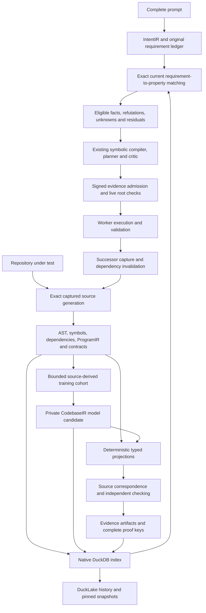

# Repository CodebaseIR, proof index and IntentIR implementation roadmap

Prepare the repository under test before symbolic planning: capture its exact
current source, build source-bound CodebaseIR, optionally train a private
repository adapter, independently check supported properties, and match the
complete IntentIR against that evidence. The supervisor plans the remaining
obligations. Repeat the affected work after each admitted change.

This is the implementation roadmap for the [comprehensive design](REPOSITORY_PROOF_INDEX_AND_CODEBASE_IR_PLAN.md)
and its [32 acceptance tasks](repository_proof_index_and_codebase_ir.todo.md).
It reflects selected working-source review on 2026-10-02, refreshed after the
retained local parallel-training milestone. It does not activate training,
change the production strategy or claim a proof for every source file.
The [current review](repository_proof_index_and_codebase_ir.comprehensive_refresh_review.json)
and unchanged [earlier roadmap review](repository_proof_index_and_codebase_ir.roadmap_review.json)
separate current implementations, retained experiments and proposed gates.

The [finite proof-query dispatch qualification](../agent_supervisor/finite_proof_query_dispatch_qualification.md)
adds matched native publication and late-proof/epoch refusal controls. The
[dispatch and next integration gates](REPOSITORY_PROOF_INDEX_AND_CODEBASE_IR_FINITE_PROOF_QUERY_DISPATCH_ADDENDUM.md)
order current intent grounding, native lease checks, complete recoverable
metadata, successor reproof, bounded repository adaptation and exact Lean
projection/convergence acceptance. All 32 production exits remain OPEN; the
MODEL_OFF authored fixture supplies no new learned model or default activation.

The subsequent [native task-attempt lease qualification](../agent_supervisor/finite_proof_query_attempt_lease_qualification.md)
and [attempt-lease integration gates](REPOSITORY_PROOF_INDEX_AND_CODEBASE_IR_FINITE_PROOF_QUERY_ATTEMPT_LEASE_ADDENDUM.md)
add the independently held native claim/lease/attempt fence, strict existing
authority selection and 128 passing tests with cold DuckDB readback. Both fresh
native worker attempts stopped at proof-memory-pressure admission before either
handoff. The changed guard's two-worker-birth qualification and negative
after-birth lifecycle controls remain open, as do all 32 production exits.

The subsequent [native guarded-launch qualification](../agent_supervisor/finite_proof_query_attempt_lease_native_qualification.md)
closes the positive two-birth gap on the same captured generation03, with
publication, native STOP/UID cleanup and 12/12 independent closed checks.
Separately captured generation04 passes 27 tests of refusal diagnostics with
unchanged resource admission policy. The
[next-boundary addendum](REPOSITORY_PROOF_INDEX_AND_CODEBASE_IR_ATTEMPT_LEASE_NATIVE_ADDENDUM.md)
orders actual post-birth failure/ACK-drop/expiry controls before broader
current-code IntentIR matching, recoverable metadata, private adaptation and
restricted convergence qualification. These remaining boundaries and all 32
production exits stay open; the new diagnostics have no native-run qualification
from the older captured container.

The subsequent [repository preview qualification](../agent_supervisor/terminal_repository_preview_qualification.md)
implements the model-off structural service boundary and terminal Python opt-in.
It preserves the administrative task population; behavioral evidence admission
and automatic Harbor activation remain open.
The later [finite service preview qualification](../agent_supervisor/terminal_codebase_finite_service_qualification.md)
adds fresh finite observations, exact reviewed operation effects and a complete
two-clause critic input. It remains a separate Python proposal API with no
signed admission or execution permission.

The new [adaptation and reserved-capacity qualification](../agent_supervisor/terminal_codebase_adaptation_qualification.md)
adds explicit source-bound feature selection/fitting, exact child continuation,
a universal integer operational-model theorem and native resource feasibility.
Its 129 focused cases pass without skips. The model remains advisory, source
facts remain finite observations, and feasibility never grants execution
permission. Source/runtime correctness and learned semantic decoding remain
open. The subsequent model-off fixtures below qualify signed finite evidence
admission and a bounded worker successor loop. The subsequent advisory join
below adds adaptation and exact proposal-to-worker binding for that authored
profile. Broader service integration and all 32 production exits remain open.

The subsequent [finite repository admission qualification](../agent_supervisor/finite_repository_admission_qualification.md)
now joins a complete owner-signed declaration to fresh model-off observations
and an atomic native commit of every original task. All 38 current boundary
cases pass. Its seven-unit, 50.720-second fixture checks a same-name decoy,
unsupported AST unit, actual public acceptance, historical restart and agreement
between explicit successor and cold finite outcomes. It runs no worker and
uses an exclusive native DuckDB file. The later worker fixture below adds a
scoped launch/publication adapter and live Quack for that authored population.
Production activation and unrestricted source behavior remain open.
The [finite admission review](repository_proof_index_and_codebase_ir.finite_admission_review.json)
records selected ending identities, the clean boundary run and separate
compatibility retries without changing the production exit conditions.

The later [finite worker qualification](../agent_supervisor/finite_repository_worker_qualification.md)
completes an 83.397-second authored two-task, five-input model-off loop using live
Quack, a real held launch reservation, isolated worker editing and native
validation/publication/completion. STOP and UID cleanup precede explicit owner
cleanup of the observed retained pool worktree. A newly signed successor agrees
with nine cold finite fields; fresh-process history retains both completed tasks.
No model or training runs. General source semantics, automatic pool/crash recovery,
advisory adaptation integration and service activation remain open. The
[worker review](repository_proof_index_and_codebase_ir.finite_worker_review.json)
records this subsequent execution separately; all 32 production exits remain open.

The additive [trusted proposal and lowering qualification](../agent_supervisor/finite_repository_candidate_qualification.md)
completed its bounded
[retained `0261fd...` native join](../../../../artifacts/codebase_ir_terminal_bench/finite-reviewed-candidate-qualification-20261002-07/result.json)
in 230.620 seconds across separate phase budgets, with 32 actual training epochs
and a cold DuckDB/DuckLake restart. Its
[independent read-only audit](../../../../artifacts/codebase_ir_terminal_bench/finite-reviewed-candidate-qualification-20261002-07/independent-audit.json)
passed with all 1,637 primary artifact pins unchanged. The
[prior execution](../../../../artifacts/codebase_ir_terminal_bench/finite-reviewed-candidate-qualification-20261002-05/result.json)
remains historical evidence under its earlier process-runner identity. The
current join does not qualify the runner's general lifecycle. It retains the full signed administrator
task population while a reserved fixed child produces reviewed bytes and an
explicit owner fixture applies them. The new
[AST-lowering module](../../../ipfs_datasets/ipfs_datasets_py/logic/software_contracts/codebase_integer_lowering_lean.py)
checks a universal theorem over its closed syntax and mathematical integers,
then checks the independently extracted native target. Parser and CPython
correctness, physical origin and actual worker isolation remain unproved.
Its explicit `@2` capture policy permits 1 MiB compiled output without changing
the old tool policy or other resource bounds. This is bounded joined execution
evidence for RPI-005/013/014/016/022/023/028, with advisory adaptation for
RPI-008/009/010/027. Next integrate these prerequisites with the separately
qualified model-off worker crossing above. Semantic decoding, general convergence and all
32 acceptance exits remain open.

The new [advisory join qualification](../agent_supervisor/finite_repository_advisory_join_qualification.md)
completed a ten-file fixture in 297.529 recorded native seconds: 48 returned
epochs, invariant advisory task meanings, exact trusted proposal bytes consumed
by the actual isolated worker, native publication/STOP, successor/cold finite
agreement and fresh numerical/historical replay without fitting. Its independent
archive audit verified 36,801 retained files. Failed attempts keep their actual
fitting and recorded execution costs; all 32 production acceptance tasks remain
open.

The subsequent [whole-inventory inference qualification](../agent_supervisor/codebase_inventory_scan_qualification.md)
adds default-on operation-scoped vocabulary/tensor reuse, complete sealed
dispositions and lossless shared-manifest transport. Its earlier 59.347-second
native run includes three setup epochs, five no-fit positive scans and thirteen
refusal controls. All 28 entries are accounted for, and 22 inferred rows agree
exactly with opt-out across two shards. Tensor builds halve and target transport
falls about 73%; a 6.153 versus 5.801-second pair shows no throughput improvement.
The [inventory review](repository_proof_index_and_codebase_ir.inventory_scan_review.json)
keeps this bounded RPI-029/032 increment separate from the prior joined worker
evidence. The subsequent [paired inference reuse](../agent_supervisor/codebase_inventory_inference_reuse_qualification.md)
removes repeated ancestry candidate reads and exact target replays, while the
child still performs native source/AST/contract/lowering/canonical checks on all
22 rows. Four balanced 8D CPU calls measured 3.763 versus 6.050-second median
latency; fifteen integrity/lifecycle refusals and 205 focused tests pass. Reuse
defaults on with an unchanged reference opt-out. This small fixture does not
qualify 384D/CUDA, historical-head transitions or production throughput.
Public activation and all 32 exits remain open. The subsequent bounded
conditional-evidence join below adds its own current-source qualification.

The [inventory and conditional evidence join](../agent_supervisor/codebase_inventory_evidence_join_qualification.md)
now implements exact captured membership, bounded native evidence pagination
and advisory consumption by the generic model-off preview. Partial and empty
budget results cannot establish absence; inferred and deferred source rows keep
the same independently indexed evidence ledger. Receiving validation replays
native pages and summaries, then checks current source/model/catalog fences.
All 204 new boundary cases pass. Every runtime requirement and authored task
remains, with zero observed facts or execution authority. The pinned 8D CPU run
passes five scan profiles, four native previews and twenty refusal controls.
Independent audits pass for all 14,399 staged files and the complete native
archive. The [join review](repository_proof_index_and_codebase_ir.inventory_evidence_join_review.json)
retains source pins, failed attempts and actual fitting cost; this bounded
RPI-013/022/023/029/032 increment closes no production acceptance task.

The subsequent [resumable inventory and worker increment](../agent_supervisor/codebase_inventory_resume_worker_qualification.md)
implements complete root-bound paging above 256 members, explicit signed
full-task advisory admission and a separate owner-held worker execution scope.
The public artifact keeps original checks and dependencies; learned vectors
grant no facts or proof authority. The composed pinned 300-file 8D CPU
qualification joins the independently audited historical scan and four process
resumptions to fresh signed native-worker execution, publication, explicit cleanup
and old-scan invalidation. Failed results, archive endpoint changes and fitting
costs are retained in the
[review](repository_proof_index_and_codebase_ir.inventory_resume_worker_review.json).
The new optimization defaults on with reference opt-out. All 32 production
acceptance tasks remain open.

The [source successor and current runtime increment](../agent_supervisor/codebase_source_delta_and_runtime_qualification.md)
qualifies a complete old/current source publication ledger and a separate
ignored-but-present removal control. Exact capture-entry retention remains
separate from source bytes, AST provenance and learned inference eligibility.
The default batch path keeps its reference opt-out. Current constructor cleanup
now retains original native resources and exact completion binding custody when
disposal is unproved; the fresh full 300-member worker run also passes in the
[separate review](repository_proof_index_and_codebase_ir.source_delta_runtime_review.json).
This partial RPI-003/007/013/022/023/032 work closes no production task.

The [source-bound successor model and planning increment](../agent_supervisor/codebase_source_successor_qualification.md)
requires explicit child training against the new head before creating a fresh
scan root. Native 300-member qualification compares two fresh 32-member CPU 8D
prefixes and reopens owners for no-fit receiving. Complete source metadata
enters native planning while every authored task remains residual. Its
[separate review](repository_proof_index_and_codebase_ir.source_successor_review.json)
retains the independent closed audit, failed reference deadline, source pins
and actual costs. This partial RPI-013/022/023/029/032 work closes no production
task. Next gates include full successor completion and signed baseline/worker
admission, with operation-local lineage replay and bounded Git batching as
separately qualified speed improvements.

The later [complete successor scan and device inference qualification](../agent_supervisor/codebase_successor_expansion_qualification.md)
adds a full ten-page CPU8D scan for all 300 captured members, four fresh-process
resumptions, and separate signed native dispatch retaining both original tasks.
The worker passes public checks, publishes source generation 3, stops and closes
its owned resources; dispatch fits nothing and runs no scan inference. Separate
actual GTE and Legal8/384 private-head CUDA jobs retain CPU opt-out and unchanged
checkpoints/Adam state; the released published core remains on CPU. The
[closed machine review](repository_proof_index_and_codebase_ir.successor_expansion_review.json)
retains independent byte receiving and failed attempts. These bounded gates do
not establish general CodebaseIR384, CUDA structural features, source semantics,
process-origin attestation, automatic crash recovery or global proof closure.
All 32 production acceptance rows retain their existing status.

The [adaptation review](repository_proof_index_and_codebase_ir.adaptation_review.json)
retains the completed five-file native execution, source/test identities and
historical failures. It demonstrates exact cold metadata reconstruction and
bounded advisory inference without changing the existing capacity policy.

## Release integration before expansion

The earlier 2026-10-02 integration review distinguished inspected working code
from its tested release worktrees, recording untracked source outside those
releases. Subsequent local qualification also has its own source pins. Reconcile
the complete dependency closures into a pinned integration checkout before a
reproducible benchmark; verify release inclusion rather than infer it from local
presence. Preserve existing owners and closed schemas. Local implementation
evidence does not close the 32 production acceptance tasks.

The separately released [scalar supervisor qualification](https://github.com/endomorphosis/ipfs_accelerate_py/blob/6ab718bf96126c0f78d60d322cf86c6de74eac72/docs/agent_supervisor/evidence/scalar-repair-supervision-20261002/README.md)
adds a useful execution endpoint: actual Intent384/Security384 inference, a
live bounded counterexample, two fresh candidate checks, independent admission,
native worker validation/publication/completion and context refresh. Its single
controlled task took 38.521 seconds with zero LLM-provider calls. It does not
resolve IntentIR against a repository proof index or generate its goal/task
graph from that index. Join the repository preview to this native execution
boundary through a new evidence admission profile; do not turn its explicit
parameter mapping into an inferred repository-wide correspondence claim.

The [integration review record](repository_proof_index_and_codebase_ir.integration_review.json)
records selected source hashes and release identities. It is a planning review,
not a new training or benchmark result. The immediate work has two parallel
lanes: qualify current repository evidence through planning and execution;
qualify a source-conditioned learned decoder through training and checking.
Join those lanes only after each works independently.

## Architecture and ownership

The model learns repository vocabulary, structural representations, retrieval
rankings and eventually typed candidate constructions. Shared definitions retain
the meaning of integers, guards, effects, quantifiers and logic-family operators.
The repository's own intermediate representation is a source-bound composition
of existing artifacts and an immutable learned adapter. Latent coordinates do
not define new predicate meanings or establish source correctness.

Use the existing structural `CodebaseCatalog` for source heads, the existing
`AutoencoderRegistry` for model runs and candidates, and the existing
`SourceCorpusCatalog` for corpus state. Evidence projections reference those
owners. Their journal, query and publication adapters must not create competing
source heads or independently promote model versions.

## Current capability and remaining gap

| Area | Available now | Remaining production gate |
| --- | --- | --- |
| Repository capture | Exact snapshots, captured ASTs, structural manifests, durable heads and live observation | Complete admitted inventory at scale; shared source roots through the public service |
| `codebase_ir/codebase_feature_v1` | Registered 8D feature reconstruction for the closed integer-offset compiler profile; bounded parent/child fitting and retained native replay experiment | Broader source coverage, semantic decoder, property objectives and model selection/promotion |
| `codebase_ir/source_bound_feature_v1` | Registered source-bound ProgramIR/contract feature targets, private fitting coordinator and frozen-basis Adam continuation; [retained coordinator execution](../../../ipfs_datasets/workspace/codebase-source-training-qualification-20261002/execution.json) | Broader joined pipeline, behavioral targets, semantic decoding and production service acceptance |
| Local federated CodebaseIR fitting | [Retained indexed/parallel qualification](../../../ipfs_datasets/workspace/codebase-parallel-dispatch-qualification-20261002/qualification.md): default two-client overlap, exact no-fit completed retries, compatible checkpoints and joined cancellation; 170 distinct passing cases | Whole-inventory inference, remote peers/Quack delivery, gradient collectives, hard aggregate limits and promotion |
| Conditional proof lookup | Native bounded evidence owners replay exact source/contract/domain/key bindings | Operational source applicability, independently authenticated checker custody and authoritative cache reuse |
| Finite behavior matching | [89 passing cases](../agent_supervisor/terminal_codebase_finite_qualification.md): five-input observations; [70 service cases](../agent_supervisor/terminal_codebase_finite_service_qualification.md): complete critic/effects/no-work; [129 prerequisite cases](../agent_supervisor/terminal_codebase_adaptation_qualification.md): advisory features/model/capacity; [local worker fixture](../agent_supervisor/finite_repository_worker_qualification.md): signed model-off admission, held actual launch, native publication and successor; [advisory join](../agent_supervisor/finite_repository_advisory_join_qualification.md): fixed structural lineage, exact trusted proposal and zero-fit successor replay | General source/runtime semantics, complete public prompt, optional adaptation/fallback, whole-inventory inference, automatic pool/crash recovery and production activation |
| Shared prover resources | Default-safe task-sized datasets bundle, dependency-ready queue, live pressure/PID backoff and retained cleanup; [Z3/CVC5, closed Lean/Isabelle and finite TLC execution](../../../ipfs_datasets/workspace/shared-prover-isabelle-qualification-20261002/qualification.md), with a historical 2.44× mixed execution speedup at four workers; [bounded installed readiness and fresh local archive qualification](../../../ipfs_datasets/workspace/shared-prover-installer-qualification-20261002/official-archive-retry/result.json) | General native adapters, mixed-family proof composition, broader many-core scaling, complete installer admission/probe limits, aggregate enforcement and default public-service activation |
| Terminal entrypoint | Existing Harbor administrative route plus an explicit Python opt-in that passes current native structural metadata through real `PlanCreateService` stages and guards the task transaction | Eligible behavioral facts, reviewed effects, complete critic evidence, new signed evidence profile and worker successor loop |

The next partial RPI-022/024/025 milestone adds default live PID/thread-pressure
backoff without changing persisted process capacity, admitted installed-Isabelle
command/HOL/smoke preparation, and a fresh pressure-checked child for each native
phase of the closed Nat task. Default setup inspection/smoke uses that preparation
route. Separately bounded archive download/extraction and ordinary publication
rollback preserve the prior installation on failure. The [shared-resource guide](../agent_supervisor/SHARED_DATASETS_PROVER_RESOURCES.md)
states the estimated thread credits, sampled enforcement and legacy setup limits;
the [retained native installation result](../../../ipfs_datasets/workspace/shared-prover-installer-qualification-20261002/official-archive-retry/result.json)
records a successful fresh local HTTP installation of retained official archive
bytes, warm reuse and bounded kernel smoke. This
milestone adds no larger process policy, full installer admission or cross-family
semantic authority.

A subsequent [bounded production installation milestone](../../../ipfs_datasets/workspace/shared-prover-installation-runtime-qualification-20261002/REPORT.md)
adds a finite default overall portfolio deadline and routes ordinary Isabelle
setup/lazy installation through the shared owner. A bounded worker only stages
checksummed archives; the controller retains the prior tree and launcher until
fresh bounded checks pass before and after publication. Cancellation rolls back
ordinary transactions, and unfinished bounded cleanup is recorded explicitly.
A fresh local HTTP installation of retained official bytes qualifies this route;
it does not establish a fresh remote download. Direct legacy/custom installers
and some outer discovery/lock paths remain outside that containment; persistent
HOL builds now have the separate staged path below. This extends partial RPI-022/024/025 evidence without
closing source/IntentIR correspondence, mixed-family composition, aggregate OS
enforcement, broad many-core scaling or public service activation.

The [persistent HOL build measurement](../../../ipfs_datasets/workspace/isabelle-hol-build-qualification-20261002/official-hol-build-6g/result.json)
extends the same owner to an explicit staged system-heap rebuild from a verified
retained archive, with downloads disabled. A fresh HOL UUID, preserved Pure
artifacts, fresh staged/published readiness and matching published heap manifests
establish persistent output. Its unchanged shared parent reserved four CPU
credits, twelve process credits and 6,400 MiB, with a 6 GiB sampled native RSS
budget. The build worker took 286.896 seconds, the cold transaction 329.660,
warm verification 10.319, and the full benchmark 347.482 seconds. Sampled
processes and owned leases drained; the earlier smaller-JVM failure and separate
recovery remain retained. The
[final qualification](../../../ipfs_datasets/workspace/isabelle-hol-build-qualification-20261002/REPORT.md)
records 1,217 distinct cases with passing latest results and zero latest errors
or skips. Raw execution retains 1,219 runs, including two timeouts that passed
exact unchanged-source retries without relaxing limits. This adds partial
RPI-022/024/025 evidence without qualifying general source/IntentIR matching,
proof composition, aggregate cgroup enforcement, crash-atomic publication,
broader many-core scaling or service activation.

The separate [native cancellation control](../../../ipfs_datasets/workspace/isabelle-hol-build-qualification-20261002/native-cancel/result.json)
passed sixteen checks after observing active Java and two Poly/ML processes in
three groups/sessions. Sampled PID/birth identities stopped before return,
publication was refused, and a separate admitted cleanup removed retained
staging without changing the cancelled receipt. This narrows observed native
lifecycle gaps; hostile daemon containment and aggregate cgroup limits remain open.

The subsequent [public Isabelle adapter qualification](../../../ipfs_datasets/workspace/isabelle-hammer-execution-qualification-20261002/REPORT.md)
covers default admitted capability, native goal capture and true/false proof
reconstruction, including cancellation during an observed native capture.
Source bounds precede instrumentation, and unexpected controller exceptions
clean up observed subprocesses. The report separates current source evidence
from the retained earlier benchmark and interrupted test generation. Each
adapter operation owns its deadline; whole MCP workflows, Lean/Coq legacy
routing, hostile-source containment and aggregate cgroups remain outside this
increment. The [index-gap audit](../../../ipfs_datasets/workspace/isabelle-hammer-execution-qualification-20261002/repository-index-gap-audit.json)
identified normalized exact key/dependency queries with source-head and sealed
evidence-inventory-bound cursors as the next independent RPI-007/032 step. The
subsequent [query qualification](../../../ipfs_datasets/workspace/codebase-evidence-query-qualification-20261002/REPORT.md)
implements that bounded local projection, atomic publication, explicit legacy
backfill, exact and reverse pagination, and supervisor initial-page consumption.
It retains historical conditional scope and all runtime residuals. Full
inventory integrity checks remain bounded linear work; DuckLake delivery,
retention and many-core scaling are still open. Direct generic canonical-backend callers still need their own
shared-admission integration.

The implemented [conditional SMT `@2` increment](../../../ipfs_datasets/workspace/codebase-smt-execution-qualification-20261002/REPORT.md)
now makes the existing shared owner the default for native conditional
verification and requested-domain applicability. Each Z3/CVC5 version, verdict
and applicable model/core phase uses a fresh child reservation, with pressure
backoff and one admission-inclusive solver-call deadline. The common Linux
runner supplies per-process address-space limits (128 MiB by default), sampled
tree RSS, finite CPU/output/workspace bounds, a minimal environment and
cancellation cleanup. Only clean exit and a matching, error-free protocol
response can produce a completed phase receipt. Those receipts preserve exact
command, input, limit and observation joins through historical replay.

This completes a bounded safety increment within RPI-022/024/025 and compatibility
work within RPI-007/032; it does not close their production exits. The explicitly
reviewed `@1` artifacts retain their original historical meaning, and catalog
discovery and supervisor matching acquire no new authority. Model truth and
unsat-core sufficiency are not independently established. Generic SMT backend
launches remain unchanged; hard aggregate cgroups, a hard parent RSS limit,
broader mixed-family execution and public-service activation remain open.

The [restart safety qualification](../../../ipfs_datasets/workspace/codebase-restart-safety-qualification-20261002/REPORT.md)
extends partial RPI-022/024/025 work with boot-bound ownership, conservative stale
recovery before an idle configuration change, and default admission backoff for
unusable known cgroup-v2 memory controls. Existing same-boot/live-descendant and
legacy-unknown reservations remain protected. Its parent and fresh-process
benchmark pin the currently saved pool and refuse configuration drift without
resetting it or stopping foreign work. Historical conditional records retain their schemas.
Kernel aggregate memory/PID enforcement, cgroup-v1 sampling and stricter optional
CPU/PSI handling remain unqualified. The following query increment amortizes
index work within one bounded multi-selector call. This closes no production exit.

The [bounded batch query qualification](../../../ipfs_datasets/workspace/codebase-query-many-qualification-20261003/REPORT.md)
adds an ordered native request tuple with one complete inventory validation,
one query transaction and admission, source entry/exit observations, and
operation-local projection replay reuse. Count, requested entries, request,
receipt and retained evidence bytes have separate ceilings. Existing individual
page and cursor schemas remain intact. Unselected corruption still refuses the
entire operation; there is no integrity cache across calls.

The supervisor's separate `conditional_codebase_batch` matcher consumes supported
requirements through that batch and retains unsupported and runtime residuals in
an ordered complete ledger. Exact per-requirement matches agree with the existing
individual matcher. Neither API supplies runtime semantics, plan admission or
task-removal authority. Track this as partial RPI-007/012/032 work; authenticated
sublinear indexing, DuckLake delivery and public preparation remain open.

Existing scheduler facades now refuse shared configuration drift without
rewriting it. Only explicit construction or reconfiguration can change a drained
pool, so ordinary reads and admission cannot undo another client's saved limits.

The selected native public-adapter run passed twenty checks in 51.014 seconds,
including true/false reconstruction and in-flight capture cancellation. All
sampled live descendants and owned leases drained; no admission backoff was
observed in this run. The prior pressure-affected run retains separate source
hashes and is not substituted for the selected current-source evidence.
Latest regression outcomes are 1,460 passes and ten PATH-gated legacy Coq skips
across 1,470 distinct cases. Native Coq remains unqualified; raw execution
retains 1,480 cases, including one old executable-path assertion failure whose
complete ten-case file passed after the test-only correction.

All 32 production acceptance tasks remain open.

Neither registered feature runtime has a formal decoder. The existing narrow
feature experiment has [retained benchmark evidence](../../../ipfs_datasets/workspace/codebase-feature-qualification-20261002/benchmark.json)
and an [implementation description](../../../ipfs_datasets/docs/software_contracts/CODEBASE_FEATURE_TRAINING.md).
Its scope excludes `source_bound_feature_v1`. The original roadmap review ran no
training, inference, tests, checker or benchmark. The subsequent structural
preview qualification executes focused tests without fitting or proving code.

## Implementation phases and exit criteria

| Phase | Concrete work | Exit gate and existing tasks |
| --- | --- | --- |
| 0. Reconcile and freeze | Inventory released and working implementations, preserve existing owners, import reviewed dependency closures, and pin one complete integration checkout | Reproducible imports and existing focused qualification in a clean checkout; no untracked module is required implicitly. Prerequisite to all phases below |
| 1. Capture and corpus | Seal exact current bytes and dispositions; parse captured bytes without importing the target; enumerate source units and dependencies; bind complete prompt spans separately | Same-HEAD dirty edits, races, submodules, missing/excluded/opaque files and Unicode spans are accounted for. RPI-001/002/023/028/029 |
| 2. Native metadata join | Reference structural, corpus and model owners; persist typed source/IR/contract/evidence/reverse-dependency projections plus bounded query contracts | Fresh-process results equal complete immutable producer records; corrupted rows and schemas reject. RPI-003/004/007/017/032 |
| 3. Operational property route | Qualify one supported source profile with explicit request domain, assumptions and actual checker evidence; keep deterministic model-off control | Valid, refuted, contradictory, uncovered, unsupported and timed-out obligations remain distinct; no forged or stale fact is accepted. RPI-005/006/012/028 |
| 4. Service planning and admission | Add an opt-in preparation/materials profile at the existing entrypoint; resolve the full IntentIR; bind native tasks, effects, evidence, critic and newly signed admission | Preview, admission and launch independently observe live roots; every requirement and task has a disposition; no static-root or caller-flag bypass. RPI-012/013/014/015/026/032 and TIP-002/003 |
| 5. Repository adaptation | Integrate the locally qualified feature coordinator and exact retry/parallel owner; declare parent/resume/fork, fixed basis and ancestral splits; select immutable model candidate before preview | Real optimizer work and full lineage are replayable; cancelled/rejected children cannot promote or alter a frozen plan. RPI-008/009/010/022/027 |
| 6. Learned formalization | Introduce a new typed semantic-decoding objective using reviewed teacher targets and existing family adapters | Free-running output depends on learned weights, preserves source meaning and passes independent checking; missing families and projection losses stay explicit. RPI-011/024/028 |
| 7. Actual successor loop | Deliver evidence to the native worker; execute the admitted edit; capture a new head; invalidate, adapt when selected, reprove and rematch; sign new baseline/context | Cold rebuild and incremental results agree on eligible facts and residuals; stale source/model/plan dispatch rejects. RPI-016/023/027/032 |
| 8. Scale and default activation | Compare cold, warm and edited-source trials with model-off, frozen and adapted modes under one resource owner; qualify publication recovery and retention | Official outcomes, full phase cost, pressure/cancellation bounds and coverage meet predeclared gates. RPI-018/019/020/021/025/026/029; federation RPI-030/031 follows compatible semantics |

Develop phases 4 and 5 in parallel after exact capture and deterministic evidence
are stable. Phase 4 first uses the model-off route so learned reconstruction
quality cannot conceal a service/admission defect. Keep old administrative and
conditional profiles replayable; assign new schemas for broader evidence scope.

## Repository scanning and batched inference

Scan the entire admitted inventory once from exact captured bytes. Enumerate
functions, classes and statement blocks with reversible UTF-8 spans, qualified
symbols, imports/calls, configuration/test references and unresolved dependency
frontiers. Parsing does not import or execute the target. Unsupported languages,
opaque files, excessive size and failed extraction keep explicit dispositions.
Capture/index coverage, training coverage, formalization coverage and checked
property coverage have separate denominators.

The current [structural wrapper](../../../ipfs_datasets/ipfs_datasets_py/logic/software_contracts/codebase_ir.py)
defaults to 256 entries and 64 KiB per file. Larger repositories need bounded
sealed shards, root-bound paging and a final completeness manifest before a new
head can replace the last complete generation. Lower-level
[`RepositoryScanner`](../../../ipfs_datasets/ipfs_datasets_py/logic/software_contracts/semantic_index/scanner.py)
already accepts source/extractor/schema-bound previous state. The structural
wrapper deliberately re-extracts semantic state; authenticate that reuse route
before enabling it. Test dirty overlays, source races, renames, deletions,
submodules, encodings and missing final shards.

The existing `infer_current_codebase_features` intentionally serves only its
registered source cohort, at most 16 paths. Each call replays lineage, prepares
targets, loads a model and starts an isolated worker. It is not an unrestricted
repository scanner. Add a separately versioned resource-owned batched/resident
inference entrypoint over sealed units and target shards, keeping protected
historical APIs unchanged. Verify immutable assets at acquisition, bind every
batch to the selected source/model generation, bound residency and queued bytes,
and revalidate current roots before publishing results. Frozen inference has
zero optimizer steps.

Use AST/function boundaries and bounded overlapping windows for the new 384D
input path, preserving parent context and exact spans. The current
[source embedding implementation](../../../ipfs_datasets/ipfs_datasets_py/logic/formalization/autoencoder/source_embeddings_384.py)
supports CUDA selection and batching but rejects input above its token limit;
retain explicit overflow/unsupported coverage rather than silently truncate.
A model output is a candidate with source and validation records, even when it
is stored beside an independently checked formula. Measure capture, parsing,
targets, model integrity/load, tokenization, inference, checking and publication
separately, including cold and warm costs.

## On-the-fly CodebaseIR training

Capture once, then enumerate exact source-derived targets. Intent identifies
requested properties and relevant regions; it must not label the existing
implementation as already satisfying the requested change. Keep source-body
targets and desired contract goals separately identifiable in each envelope.

Choose explicitly among model-off, frozen inference, fresh repository fitting
and a private child of an exact parent. Start with the existing eight-dimensional
feature backend under its default isolated CPU/resource owner. Do not advertise
384D, CUDA, semantic decoding or cross-repository latent compatibility from a
feature runtime's presence.

Exact continuation preserves the feature basis, target schema, numerical policy,
weights, Adam moments/steps and declared progress. Weights-only inheritance or
optimizer reset is a different operation. A new token/literal basis requires an
explicit migration or fork with its own lineage and evaluation; do not expand a
vocabulary while claiming exact resume.

The older AST-count encoder omits integer values. Newer positional feature
tokens retain known literal values, but unknown atoms are omitted from the frozen
numerical basis. The integer coordinator rejects unknown atoms; the newer
source-bound coordinator records them and permits advisory fitting. Require
paired known/unseen-literal and changed-guard controls. Unknown coverage cannot
become semantic discrimination or a proof through embedding distance.

Keep fixed tuning and held-out canary envelopes, root replay and full bounded
ancestry. Extend current raw-byte/path split checks to normalized AST clones,
related revisions and dependency-connected groups. Acceptance canaries never
enter fitting but may gate candidate promotion; repeated use makes them
acceptance diagnostics. Untouched final tests never select a model or decide
promotion. Report transductive reconstruction when independent
splits cannot be made. Durable interrupted-job resume and promotion need their
own qualification beyond idempotent replay of a completed training operation.

Freeze source generation, selected weights, vocabulary, outputs and consumed
index records before planning. Bound samples, bytes, optimizer steps, wall time,
memory, device use and retries under the end-to-end trial budget. A late child
is a successor candidate. Queries, cache reads and admission replay perform zero
fitting. Optional adaptation failure retains the explicitly declared parent;
a profile requiring adaptation must report failure rather than silently switch.

The current supervisor hook
[`prepare_codebase_feature_context`](../../ipfs_accelerate_py/agent_supervisor/planning/codebase_feature_context.py)
already supports `model_off`, `frozen` and `train`, retaining exact source,
invocation, checkpoint, full lineage and inference metrics. Reuse its native
`verify_current_context` before consuming advisory features. Extend the
preparation policy with separately declared optional/required adaptation and a
frozen fallback; no late fit may change already frozen planning materials.

### Source conditioned semantic decoder

Add an explicitly new proposed profile, `codebase_ir/source_conditioned_384_v1`,
in the shared datasets runtime registry. Keep `codebase_feature_v1` and
`source_bound_feature_v1` replayable with their current dimensions and meanings.
Here 384D identifies the input embedding width. Select and record the latent
width, decoder architecture and numerical layout separately.
The new profile has two products: repository-specific learned weights and a
source-bound typed CodebaseIR corpus. Weights help predict the corpus; they are
not the repository's only stored representation.

Build its paired corpus from the existing `RepositoryCodebaseIndex`,
`prepare_codebase_targets` and native source/contract adapters. Every source unit
retains its exact byte span, enclosing scope, qualified symbol, dependencies,
types, requested projection profile, teacher target and label provenance.
Inventory the entire permitted repository even when inference or proving is
demand-driven. Use functions/classes and statement blocks as primary units.
Reuse semantic chunking to select sub-boundaries inside those units, keeping
parent context, dependency references and reversible spans. Long units use
bounded overlapping windows; never silently truncate to an embedding limit or
treat an isolated continuation as a complete function.

Reuse the pinned GTE-small 384D input path, batching on CUDA where the selected
runtime and host admission support it. Measure tokenization, transfer and GPU
cost; retain a qualified CPU route. Initialize compatible components from the
published SecurityIR/shared autoencoder lineage, with LegalIR inheritance where
its parameter and feature contracts match. Record transferred and newly added
blocks explicitly. Do not reshape an 8D checkpoint into 384D, overwrite any
domain's published parent, or claim compatibility from dimension alone.

Decode typed declarations, symbol references, expressions, guards, return and
exception effects, contracts and supported transitions. Start with the existing
pure Int/Bool source fragment; widen through separately qualified profiles.
Use grammar constraints plus source/KG-derived slots for identifiers and types.
Unknown entities, operators and effects remain explicit. A referent needed to
compile must be traceable to source, a selected dependency or a declared premise;
an invented axiom cannot fill a missing source fact. Preserve learned output
before validation so deterministic lowering cannot silently replace a failed
prediction with the teacher answer.

| Training objective | Target and independent evaluation |
| --- | --- |
| Typed IR reconstruction | Compiler-derived or reviewed targets; exact structure, operator, argument order, literals, quantifiers and reference resolution, including free-running decoding |
| Source correspondence | Source maps and a qualified lowering/differential route; semantic changes and counterexamples must distinguish nearly identical code |
| Applicable logic projections | Shared family compilers over unchanged predicted IR; type checking, projection coverage/losses, source binding and actual checker outcomes reported separately |
| Intent and code retrieval | Independently bound requirement/property pairs; hard negatives with changed guards, domains, effects or symbols; retrieval never creates an established fact |
| Repository retention | Frozen parent replay and untouched final repository/function groups; report adaptation gains alongside regressions and unsupported coverage |

Begin with supervised reconstruction and reference/type objectives. Add checked
property labels only when their source/domain/prover provenance qualifies; a
timeout is unknown, not a negative correctness label. The desired instruction
defines a property to investigate, not the target behavior of unchanged source.
Keep the original instructions out of source-truth labels unless they are
explicitly designated specification inputs.

Group clones, related revisions and dependency-connected units before splitting.
Keep training, tuning, repeated acceptance canaries and untouched final tests
distinct. Adaptation using benchmark-permitted source is transductive and must
be labeled as such; held-out tests, reference patches and benchmark rewards do
not enter training or model selection. Pin each active plan to one immutable
model generation. Later fitting creates a candidate for a future planning cycle.

### Parallel training and checkpoint exchange

Reuse existing registry, source-owner fences, resource leases and Hugging Face
transport while keeping numerical protocols explicit:

| Existing path | Actual update protocol | Integration decision |
| --- | --- | --- |
| Released `distributed_384` | Frozen 384D projection and structured ridge-head refit from sufficient statistics | Reuse for a compatible new head only after domain/target/reader registration; include the complete intended round corpus and reject duplicate contributions |
| Working CodebaseIR federation | Same-parent 8D float64 feature parameters, weighted FedAvg, explicit aggregate Adam reset | Keep as the feature baseline; do not reinterpret its deltas as ridge statistics or synchronized gradients |
| Qualified local artifact execution | New indexed training wrapper plus default-on bounded parallel owner; separate immutable execution policy and compatible transport sidecar | Reuse native source/fence checks, shared control headroom and joined cleanup; preserve explicit serial/index opt-outs and distinguish local overlap from remote delivery |
| Proposed learned semantic adapter | Numerical architecture and updater not yet selected | Benchmark compatible head refit first; any SGD/adapter optimizer requires its own exact-base delta, resume, merge and validation contract |

A compatible ridge refit preserves the inherited projection, target schema and
vocabulary while replacing/refitting the head from complete round statistics.
It is not continuation of a parent's head optimizer. New operators or target
classes require an explicit vocabulary/schema fork and reader qualification;
adding a domain name alone is insufficient. Record which inherited parameters
actually survive fitting.

Start on this machine with bounded workers and one local journal owner. Bind
every contribution to parent checkpoint, source generation, vocabulary, target
schema, shard/split, round, worker, attempt and fence. Workers publish immutable
updates to the owner; the owner validates, deduplicates and merges them.
Reuse `LocalTrainingStore` for the compatible 384D workflow and the native
CodebaseIR registry for its existing profile rather than sharing one file among
independent writers. Hugging Face stores immutable round/checkpoint artifacts
and pinned manifests; it is not a shared mutable optimizer or live lease owner.
Select a merged checkpoint only after holdout/replay/source-check gates pass.
Remote machines follow duplicate-delivery, stale-parent, cancellation and
restart qualification locally. A failed update leaves the selected parent
available and never rewrites an admitted task's model identity.

The parallel owner defaults to `parallel=True`, `max_workers=2` and
`use_request_index=True`. `parallel=False` or `max_workers=1` executes serially;
the index flag opts out of exact completed-history discovery. Resource/policy
changes require a new operation ID. The retained local five-file fixture has
15.738-second sequential and 13.428-second parallel whole-round medians, with
identical aggregate states in three trials per mode. This is 8D feature-training
evidence, not repository-wide inference or learned logic throughput. Existing
source checkpoints remain compatible; binary update transport already uses
raw CIDv1/SHA-256. Any full tensor-package migration needs a new versioned reader
and measured benefit before replacing historical JSON checkpoints.

## Logic projections and proving

Reuse the canonical family registry, source adapters and software syntax bridge.
The [current logic requirement declarations](../../../ipfs_datasets/ipfs_datasets_py/optimizers/logic_theorem_optimizer/autoencoder_logic_requirements.py)
describe first-order, temporal/deontic compositions, cognitive/event routes,
frame and propositional capabilities, native software routes and code-state
requirements. They run no checker and confer no authority. A capability floor
does not assert an equivalent projection of every source span into every family.

For each applicable projection retain the canonical family/profile, typed body,
source correspondence, assumptions, quantifier/argument/operator coverage,
explicit translation losses, obligation and checker identity. Missing canonical
compositions remain explicit gaps. Use existing SMT, Lean and bounded temporal
routes only within independently qualified profiles; establish bridge obligations
before combining evidence from different families.

For decoded output, qualify an actual pinned, offline `lake build <Lib>` over the
emitted typed schema and instance, retaining source, project, toolchain, command
and full log identities. Reject `sorry`, `admit` and newly supplied axioms under
that profile. Schema compilation, a theorem about two supplied models, or a
certificate about recorded numbers does not prove arbitrary source behavior.
Applicable runtime/source correspondence and premise/domain coverage remain
separate gates. Bounded TLA/state checks retain fairness, initial/next relation,
invariant/liveness and model bounds; they are not unbounded proofs.

Use the existing family registry as the coverage owner. The initial projection
priorities are proposed below; an available family name is not evidence that
the decoder or native checker supports every construct in that family.

| Source or intent property | Applicable representation and logic | Required grounding |
| --- | --- | --- |
| Values, guards, preconditions and postconditions | ProgramIR/ProgramContract, first-order formulas, SMT and Lean proof obligations | Types, expression semantics, satisfiable premises and requested input-domain coverage |
| State machines and concurrency | StateTransitionIR, temporal logic and TLA+ state profiles | Initial/next relation, shared state, scheduler/fairness assumptions and declared bounds |
| Ownership, mutation and aliasing | HeapModel and SeparationLogicIR | Heap regions, references, ownership and effects; unavailable information remains residual |
| Information flow | HyperpropertyIR and relational obligations | Explicit security policy and relation between executions |
| Actors, obligations, events and workflows | IntentIR plus applicable deontic, cognitive event calculus and temporal deontic first-order profiles | Actor/action/event identity, modality, temporal scope and reviewed bridge into code effects |
| Entities, methods and graph relations | Frame logic and typed graph relationships | Current symbol/reference resolution; no behavioral conclusion from a graph edge alone |
| UI and legal constraints | Existing UI/UX IR and LegalIR projections | Explicit applicability, selected constraint versions and cross-domain bridge obligations |

For Lean acceptance, check the actual theorem's elaborated dependencies against
the profile's permitted axioms as well as building the generated project.
Preserve syntax success, source correspondence, conditional/model proof,
finite observation and full declared-property discharge as separate dimensions.
Countermodels should become typed residuals or repair nominations through the
existing tactician/hammer interfaces; a failed proof is not automatically a
source defect.

## Proof index, cache and metadata

The proof index locates units, contracts and candidate or checked properties.
The proof cache decides eligibility for one exact obligation under its complete
key. Retrieval similarity nominates candidates; exact source and evidence joins
determine whether they can satisfy an IntentIR requirement.

| Metadata group | Required retained bindings |
| --- | --- |
| Inventory and AST | Repository/view/head, captured bytes, paths/spans, parser profile, source units and every disposition |
| KG and resolution | Symbols, imports/calls, effects, contracts/tests/configuration and unresolved dependency frontiers |
| Corpus and model | Target envelopes, split ancestry, objective, vocabulary/codebook, checkpoint, optimizer lineage and resource/work receipts |
| Vectors and decoded candidates | Exact source/model/tokenizer/preprocessing, candidate body, coverage, rejection and validation records |
| Logic and obligations | Canonical family/profile, typed formula, correspondence, premises, request domain, bounds and projection losses |
| Evidence and proof cache | Complete existing cross-package keys, actual checker artifacts/certificates, status, counterexamples and reverse dependencies |
| Intent and planning | Original instruction spans, interpretation status, stable clause IDs, exact property matches, residuals, tasks/effects and signed materials |
| Lifecycle and history | Fenced owner operations, outbox/journal, immutable packages, native lake snapshots, retention pins and recovery decisions |

Empty or unsupported metadata families remain explicit; never fabricate vectors,
contracts, proofs or training receipts. Count inventory, trained units,
formalized units and checked properties separately.

Keep native DuckDB hot/control projections behind their existing owners.
DuckLake holds bulk historical projections; immutable artifacts hold complete
source/model/proof bodies. DuckLake currently supports `NOT NULL` but no enforced
primary, foreign, unique or check constraints, and no indexes. Enforce identity
and reference validation in the native owner. [DuckLake constraints](https://ducklake.select/docs/stable/duckdb/advanced_features/constraints),
[unsupported features](https://ducklake.select/docs/stable/duckdb/unsupported_features).

Use typed Parquet/DuckLake rows for bulk targets, vectors, candidate metadata and
history; keep complete tensor/proof bodies in immutable packages referenced by
small manifests. Record vector width and model identity explicitly in a portable
bulk schema. Native controls retain exact identities, fences and uniqueness.
Quack can expose scoped owner commands for future clients; it changes the access
protocol rather than application evidence rules. The current local training
qualification opens no remote service. [DuckDB concurrency](https://duckdb.org/docs/current/connect/concurrency).

For the local terminal profile, use one native owner process; workers submit
bounded commands or consume immutable snapshots. A future PostgreSQL-backed
DuckLake deployment is separate qualification, not a reason to open the same
native authority file from every worker. [DuckDB concurrency](https://duckdb.org/docs/current/connect/concurrency),
[catalog selection](https://ducklake.select/docs/stable/duckdb/usage/choosing_a_catalog_database).

There is no assumed transaction across CAS, native state and DuckLake. Seal
artifacts, commit native records/outbox, journal the complete immutable operation,
commit lake rows and marker, then resolve lost responses by that exact operation
before acknowledgment. Pin catalog identity and snapshot together; avoid joining
moving `latest` generations. Qualify crash recovery, duplicate/payload conflicts,
schema/row tampering, fresh-process reconstruction and retention of active roots.

The additive [advisory worker archive](../agent_supervisor/finite_repository_advisory_worker_qualification.md)
addresses a measured small-repository population overflow with deterministic
bounded native parts and a complete global manifest. It retains every original
producer occurrence and full owned artifact bytes. Existing sink, row, chunk
and packet caps stay fixed. Its separate retained `9035ba...` execution passed
in 522.178 seconds with 32 training epochs, actual worker publication and cold
metadata verification. The independent audit passed against all 38,671 primary
pins and 723 complete producer records. Older `0261fd...` regression results
retain their own scope; all 32 production exits remain open. Separate part
restart and global-process reassembly
check full membership, family ordinals and packaged/producer digests. Extend
this storage control through RPI-017/023/032 with staged complete-generation
publication, failure recovery and snapshot-bound typed queries. Neither
successful assembly nor stored proof labels confer evidence eligibility, task
omission or worker authority; the native evidence/admission owners retain those
decisions.

### Existing owners and persistence repairs

Reuse `CodebaseVerificationCatalog.publish/lookup_current` for the source-owned
evidence projection and its existing AST-owner connection. Keep the datasets
`CodebasePropertyCache` historical behavior explicit: its stored candidates
remain `UNKNOWN` and do not avoid fresh checking. Bridge complete keys into the
supervisor's `FormalVerificationCache` and `DoctorProofCacheGate`; do not add a
third authority store with a looser key. A key bridge never upgrades a
historical conditional row: only a separately qualified receipt adapter may
admit evidence under the receiving cache's existing assurance contract.

Version the evidence projection before replacing JSON key nomination with
normalized proof-key membership and reverse-dependency rows. Measure exact
indexes for repository/head/path/contract/domain selectors and root-bound paged
queries; the present bounded lookup lacks this scalable query contract. Reject
missing pages, extra rows, changed query roots and incomplete dependency
frontiers as complete eligibility results. A derived joined catalog references
these owners and supplies discovery/material views only.

The released Doctor adapter's root reverse map, tombstones and quarantine are
process-local. Persist the dependency/invalidation events through the existing
native owner, rebuild them before serving queries after restart, and test that
an old positive entry cannot revive. The released `SupervisorMetaIndex` opens
DuckDB per operation and projects history; it is a catalog-discovery building
block, not a qualified concurrent-ingestion service. Add bounded owner commands
and incremental outbox publication. Existing board proof-file ingestion has a
512-entry cap per file per call and skips unreadable stores; expose pagination, scan cursors and
omission dispositions before using it as a repository coverage inventory.

Cache keys must preserve source bytes/dirty overlay, resolved dependencies,
typed IR and formula, premise and domain roots, projection/compiler versions,
checker/kernel/toolchain, policy and relevant environment. Include the exact
checkpoint and embedding/decoder configuration when the candidate depends on
them. Keep logical symbol identity distinct from its current source version.
Reuse `ProofScopeIndex` for transitive invalidation. An unresolved call/import
widens the invalidation frontier instead of implying no dependency.

Offer separate discovery and eligibility queries: relevant-unit search,
exact unit/property evidence, requirement resolution and residual obligations.
Each query binds the source head and consumed records and returns an explicit
coverage frontier. Use typed source dependencies to complete the mandatory
closure after vector/KG retrieval; similarity must not prune required premises.

Initially reuse captured bytes, embeddings, decoded candidates, generated
projects and historical checking outcomes while rerunning live checking where
the existing gate requires it. To save proof time, separately qualify a
verifier-owned compiled-proof revalidation route. It must inspect exact
artifact/dependency/tool identities and issue fresh eligibility evidence;
deserializing a saved Lake execution handle is never that route. Count
preparation-cache hits and accepted proof-reuse hits separately.

Expose execution disposition, assurance level, source correspondence, freshness,
scope and reuse eligibility separately. Keep refutations, empty enabled domains,
unsupported units, timeouts and quarantined records in the index. A missing
record is unknown. Only the typed eligibility gate may supply planner facts.

## Intent matching, service integration and successor behavior

Preserve every normative clause, original span, guard, quantifier, negation,
artifact/check requirement and ambiguity. A retrieval miss is unknown; a
counterexample is scoped to its exact domain. Finite observations satisfy only
the enumerated inputs. Conditional model results preserve their assumptions.

Join evidence by explicit clause IDs and semantic property bindings. Content
sorting cannot establish requirement correspondence. Preserve stable task
meanings and the complete declared population across source generations; the
finite qualification already exercises this distinction.

The [structural preview increment](../agent_supervisor/terminal_repository_preview_qualification.md)
now supplies explicit native capture and selected-owner inputs at
`terminal_indexed_preparation._plan_symbolic`. Strict `PlanCreateService` observes
complete live roots on entry, before its admission stage, before persistence and
on cache return. Native source/head observations surround the preview, the
existing signed administrative replay and the task transaction. Drift or
cancellation during materialization rolls back tasks before commit. The default
Harbor route remains unchanged; the Python opt-in supplies no observed facts,
training, checker invocation, task omission or worker launch.

The additive finite service now compiles freshly observed bounded facts and
residual code obligations, projects the explicitly reviewed operation meanings,
and gives the native critic both clause roots and the full observation record.
It returns an explicit no-work proposal only when both exact finite roots are
discharged, while retaining both catalog rows and their requirement mappings.
It does not turn an empty native selection into fallback tasks. Independent
live policy/source observations and Python/Lean artifact checks surround the
preview. Public calls always rerun the native observation; historical index
results supply no current facts.

The next admission increment must bind independently established source
semantics and the applicable evidence policy, deliver worker context, and issue
a newly versioned signed evidence admission. The older finite preview preserves
its missing-capacity rejection. The newer capacity-bound preview qualifies
feasibility while a native reservation is held; that reservation is released
before return and grants no later launch permission. Its universal Lean theorem
concerns the mathematical translated model, with source/runtime equivalence
still open. Repeat owner observation and acquire current resources at worker
launch. Neither preview authorizes dispatch, signed task omission or a successor
worker loop.

After a worker change, revoke eligibility of the affected source/property/model
bindings before rematching. Reuse the existing semantic/contract/SCC invalidation
frontier and complete-key readmission. Unknown dependencies widen invalidation.
A model update invalidates its candidates/vectors/matches; deterministic evidence
with unchanged complete source/translator/checker dependencies need not depend
on that model. Rebind reused evidence into the new head only through an explicit
checked correspondence contract. A successor needs a newly signed baseline and independently admitted context
through a successor-capable API. The existing initial-context binder does not
authorize successor dispatch; an old plan cannot launch against changed bytes.

The new repository route should express this join explicitly in the existing
`PlanCreateService` materials: original clause ledger, selected current symbols,
property/domain bindings, eligible facts, refutations, unknowns and required
evidence queries. Preserve goal/subgoal/task coverage through the critic.
Unresolved prompt meaning fails open into residual planning with the original
instruction; it cannot fail open into a discharged property or task completion.
Required source/evidence checks fail closed at admission and publication.

Send the worker the relevant semantic capsule and dependency closure, retaining
counterexamples, assumptions and the original task. Reuse
`semantic_router_translation` for reversible typed-identifier aliases to and
from the LLM router. Bind the translation table to the context digest and verify
the reverse mapping before applying generated references. Measure original,
encoded provider-input and restored token counts, including translation-table
overhead; minification does not change literal/source semantics.
Where a reviewed symbolic operator can discharge the residual, use the existing
ProgramWorld/tactician/hammer path and fresh post-edit inference/checks before
requesting model-generated code.

## Next integration deliverable

Deliver a complete current-source plan, independently admitted native edit and
rechecked successor before expanding to general learned formalization. Reuse
the finite integer-offset route for the first explicitly enumerated input
domain. Preserve its finite-observation, mathematical-model and source-behavior
evidence classes: a Lean model theorem does not establish unrestricted CPython
equivalence. Qualification must establish the receiving admission policy and
checker custody appropriate to the evidence it consumes.

Capture multiple source units with one selected implementation, a same-name
decoy, related dependencies and an unsupported/effectful unit. Bind the complete
supported instruction to stable clause IDs: one scoped property is established,
and another remains residual because the current body implements `n + 1` while
the desired property is `n + 2`. The training label remains the captured `n + 1`
body. An independent reviewed requirement binding supplies the desired contract.
The unsupported source unit stays in inventory. Additional negative prompts
include an unbounded clause, a prohibition and ambiguous or unsupported meaning;
none may silently disappear or become satisfied through retrieval absence.

| Crossing and owner | Required retained result | Acceptance gate |
| --- | --- | --- |
| Capture and exact queries, datasets | Complete current source head, symbol/dependency inventory, domain/contract references, evidence rows and query frontier | Same-name decoy does not alias the selected symbol; every admitted entry has a disposition; cold native lookup works after restart |
| Requirement interpretation, datasets IntentIR and supervisor | Original prompt ledger, reviewed clause-to-property/domain/symbol bindings and unresolved spans | Changed guard, quantifier, polarity or effect cannot reuse a different requirement's evidence; finite results cannot satisfy unbounded intent |
| Frozen planning, supervisor | Exact `PlanCreateMaterials`, facts, counterexamples, residuals, complete operation effects, compiler/planner/critic receipt | Every clause and declared task retains its meaning; canonical sorting cannot swap evidence; initial signed task population stays complete |
| Independent admission, supervisor native owner | New versioned repository-evidence profile and signed materials/task bindings, independently reconstructed live roots | Caller flags or stored preview receipts cannot grant admission; policy/source/model/index drift refuses signing or task commit |
| Native launch and edit, supervisor runtime | Fresh resource reservation, scoped worker context, actual claim/edit/check/publication events | Preview capacity released earlier is not launch capacity; original clauses, source units, assumptions and evidence reach the worker |
| Successor, datasets and supervisor | New source head, invalidated dependency frontier, genuine recheck/rematch and newly signed baseline/context | Old plan cannot dispatch after the edit; eligible facts and residuals agree with a cold rebuild; historical parent remains replayable |
| Advisory adaptation, datasets registry | Matched model-off/frozen/optional-child records, actual numerical work and exact source/model lineage | Facts and task meanings are invariant under feature mode; a late, failed or cancelled child cannot change selected materials or promote itself |

Freeze one proposed generation envelope across these crossings. It binds the
full source head/snapshot/profile, corpus and selected model or explicit model-off
identity, IR/semantic definitions, original requirement ledger and interpretation,
property/domain/assumption policy, native projection revision, optional exact
DuckLake catalog/snapshot, complete query pages/frontier, consumed row/artifact
commitments and reviewed operation effects. Planning, admission and launch
compare this same envelope while independently observing live roots. Historical
load returns history; it cannot certify that a previously frozen generation is
still eligible.

The initial admission increment preserves the complete signed task population.
Qualified zero-work or reduced-population behavior requires its own RPI-021
scope/coverage policy. Continue complete public-prompt interpretation in parallel
under TIP-002/003; a two-clause control does not establish general instruction
understanding. Current source-bound feature preparation and held-capacity preview
are reusable inputs, not replacements for this admission crossing.

The [implemented admission increment](../agent_supervisor/finite_repository_admission_qualification.md)
qualifies this crossing locally for model-off context and the original manifest
`@1` fixture. It binds complete clauses/tasks, rejects changed source/policy and
rolls back all native rows after late mutation. The callable adapter explicitly
supports manifest versions 1 through 3 and rejects version 4; the newer joins
for versions 2/3 are not independently qualified by this fixture. A no-work
review still grants no local admission or task omission.

The [qualified launch increment](../agent_supervisor/finite_repository_worker_qualification.md)
now retains both rows, completes type through a genuine typed claim and owner
checks, and dispatches the ready offset through a private scoped profile. The
profile binds the ready predecessor; the existing typed owner issues the actual
later claim/fence. Resources remain held through START, publication and STOP/UID
cleanup. Existing single-task automatic refresh gates keep their scope; this
fixture explicitly captures and independently signs its successor after owner
cleanup of the retained pool worktree.

The [bounded advisory join](../agent_supervisor/finite_repository_advisory_join_qualification.md)
now integrates source-bound features and the reserved proposal with this worker
loop. Model-off/frozen/selected-child outcomes preserve every requirement
disposition and task meaning; successor replay fits nothing. The additive
inventory scanner now covers the bounded admitted capture, and the additive
conditional-evidence join preserves exact membership in model-off planning
materials. The composed pinned 300-member resumable scan and signed worker
qualification now cover this bounded crossing under the existing owners.
General large-tree acquisition, incremental successors and cross-shard proof
dependencies remain under RPI-029/032. Broader source coverage,
public-prompt interpretation, authoritative reuse, automatic pool/crash recovery
and default activation remain separate exits.

## Incremental reuse and measured exits

### Concrete inference work to remove

The current [source-bound inference entrypoint](../../../ipfs_datasets/ipfs_datasets_py/logic/software_contracts/codebase_source_training.py)
already batches numerical rows. It is restricted to the registered source
cohort, with a default maximum of 16 selections. Its surrounding work repeats
complete source observation at resource entry, after inference and at resource
exit, reconstructs ancestry and reloads the selected runtime, then starts a new
isolated Torch process. This is the eight-dimensional CPU float64 structural
profile; it is separate from LegalIR/GTE CUDA inference.

For ordinary admitted clean blobs, [snapshot capture](../../../ipfs_datasets/ipfs_datasets_py/logic/software_contracts/semantic_index/snapshot.py)
executes two Git object commands per file. Three full observations can therefore
issue roughly six object commands per file, in addition to repository metadata
commands. Each [prepared feature target](../../../ipfs_datasets/ipfs_datasets_py/logic/software_contracts/codebase_ir_targets.py)
also embeds the complete manifest and semantic state. These are inspected code
paths, not measured throughput improvements.

The separately versioned [inventory scanner](../../../ipfs_datasets/ipfs_datasets_py/logic/software_contracts/codebase_inventory_scan.py)
now preserves the cohort API and qualified limits. It acquires one genuine
resource scope, seals the admitted manifest, replays model ancestry once and
reuses verified tensors/vocabulary within one bounded child for finite shards.
Entry and final live observations, final artifact/owner checks and complete
inventory dispositions precede the returned raw-CID numerical record. Native
target replay remains independent at the receiving boundary. The explicit
`optimized=False` path invokes native ancestry/target validation and v1 inference
per shard. Current proof-index
publication/joined query consumption and cross-operation residency remain open.
The separate versioned resumable protocol has passed the pinned 300-member
historical restart scan and fresh composed worker cleanup/invalidation crossing;
general large-tree acquisition and successor scanning remain open.

The additive [shared target transport](../../../ipfs_datasets/ipfs_datasets_py/logic/software_contracts/codebase_inventory_targets.py)
uses exact per-entry bindings and reconstructs unchanged native targets from a
single manifest/publication envelope. The 22-row native fixture removes about
73% of repeated target-transport bytes while preserving exact output. Add bounded Git object batching
with size-first rejection, object identity checks, total byte limits and
cancellation. The existing [batch object reader](../../../ipfs_datasets/ipfs_datasets_py/logic/software_contracts/repository.py)
is a useful pattern, but its SHA1 filter, byte limits and cancellation behavior
need qualification before reuse in captured-source custody.

The output population must equal the sealed inventory exactly. Retain explicit
dispositions for inferred, opaque, unindexed or captured AST failure,
unsupported target, zero fitted-vocabulary coverage, and deferred units. Missing
or mismatched captured artifacts, broken publication receipts, changed heads or
models, cancellation and failed numerical processes abort final publication;
they are integrity failures rather than ordinary unsupported dispositions.
Complete inventory accounting does not imply complete inference, training,
formalization or checking. Structural reconstructions remain advisory.

Instrument observation count, Git subprocess count, target replay count,
duplicated manifest bytes, ancestry reads, worker startup/import cost, tensor
initialization, feature extraction, numerical time and peak queued bytes before
changing a qualified production default. The bounded fixture records two live
observations, one ancestry replay and one child in both paths, with four versus
eight weight tensors and one versus two vocabulary builds. Public calls measured
6.153 and 5.801 seconds in the earlier generation: no meaningful throughput gain
was established there. The
opt-out is the unchanged v1 numerical routine inside identical scan custody;
it is not a benchmark of the old cohort API's surrounding operations. Compare
broader profiles and genuine Git batching next. The separately qualified reuse
generation measured 3.763 versus 6.050 seconds through record serialization and
final fences, with identical outputs. Actual parent profile probes, excluded
from timing samples, counted three versus 41 full native target validators and
two versus five runtime candidate reads. All receiving rows retained complete
native lowering and comparison. Pressure refusal, historical-source transitions, cold rebuild and
cross-operation recovery retain separate controls.

Start `scan_current_codebase_features` under a new profile using the existing
256-entry, 64-KiB structural capture limits. Keep the registered model's exact
current source head and unchanged fitted vocabulary. Reuse registered cohort
contracts only on their bound paths; additional entries carry an explicit
`none_declared` contract inventory and `not_in_registered_cohort` role. They do
not acquire training or held-out evaluation labels. Shards retain the existing
maximum of 16 numerical rows, deterministic order, byte budgets, cancellation
and pressure checks. This first slice improves work inside an admitted inventory;
larger-tree acquisition and cross-operation residency retain their own gates.

The optimization should default on in this new profile, with an explicit
`optimized=False` reference path. Both paths must return identical source/model
roots, per-entry dispositions, shard membership and numerical results within a
predeclared tolerance. Record repeated verification, startup and byte costs for
both; a fallback must preserve the same complete inventory and final fences.

Track source, dependency, formalization, assumption, tool, policy and model
dependencies before enabling selective reuse. CIDv1/SHA-256 checks artifact byte
identity; complete proof-key and source-correspondence validation establish
semantic reuse eligibility. Whole-artifact verification remains the baseline.
Chunk/Merkle verification requires a separate admitted format and dependency
manifest. A formatting edit still needs span rebinding; a body/guard/helper edit
reopens affected obligations; an unresolved dynamic dependency widens the
frontier. A model-only update reopens model-dependent candidates/matches without
automatically invalidating an unchanged deterministic theorem's complete key.

| Measure | Required reporting or gate |
| --- | --- |
| Inventory and semantic coverage | Complete dispositions for every admitted entry; separate units inferred, trained, formalized and checked, plus unsupported/opaque denominators |
| Evidence and matching correctness | Zero accepted stale/forged evidence in mutation cases; every normative clause has a disposition; assumptions and domain coverage are explicit |
| Incremental equivalence | Exact cold/incremental agreement on eligible facts, applicable refutations and residuals after source/model/policy changes and restart |
| Reuse efficiency | Preparation-cache hits and accepted proof-reuse hits separately; actual checker invocations, invalidation fanout, recheck cost and rejected hits |
| Complete latency | Capture-to-plan and edit-to-successor p50/p95, cold/warm stage costs, batched inference, SQL paging, snapshot publication and cleanup |
| Adaptation value | Compare model-off, frozen, fresh and parent-child modes with all training/validation cost; report break-even, failed/late fits, canary regressions and raw/constrained decoder quality |
| Resource lifecycle | Peak RSS/VRAM/temp storage/queued bytes, admitted concurrency, cancellation latency, peer cleanup and zero leaked children/leases/waiters under the declared hardware profile |

Predeclare numerical latency and resource thresholds for the actual hardware
before qualification. Preserve failed runs and policy-specific unavailable
capabilities. The latest local parallel timing is useful evidence for its small
feature-training workload; it cannot set whole-repository inference, full planner
or remote fleet performance claims.

## Evaluation and next acceptance run

Run the complete cold, exact warm and behavior-changing successor paths on the
same admitted source and prompt. Compare model-off, frozen, fresh and adapted
modes. Require zero accepted stale/forged facts, exact cold/incremental agreement,
complete requirement dispositions and true native restart hydration. Preserve
failed runs, cancellations, missing tools and incomplete coverage.

The bounded model-off fixture now combines a satisfied requirement and residual,
reviewed worker effects, signed admission, actual worker publication/rechecking
and successor admission. The bounded advisory join adds structural adaptation
and exact reserved proposal bytes without changing signed model-off admission.
Next extend to the full captured Terminal Bench source and complete public
instruction. The Bottle module remains unsupported by the five-input integer
profile; the authored worker fixture does not change that disposition.

Measure all capture, extraction, fitting, decoding, checking, query, publication,
planning, worker and cleanup cost. The current runner defaults to 285 seconds,
allows 90–300 and reserves 40 for cleanup; allocate within the chosen end-to-end
profile using measured phase costs. The earlier 373-second development run does
not establish terminal-trial feasibility.

The first joined acceptance run should contain multiple source units and two
complete requirements: one already true under the declared profile and one
requiring an actual edit. Include a semantically similar decoy function and an
unsupported unit. Verify exact entity binding, preserved unknown coverage,
real resource capacity, signed admission and native worker publication. Train
a bounded repository child in a separate arm with actual numerical updates;
select it only if the declared gates pass. A rejected child is a retained
outcome, not a reason to relax the gate. Restart the native owners, then perform
a same-HEAD dirty edit and compare incremental facts/residuals against a cold
rebuild. Add wrong checkpoint, changed literal/guard, unavailable proof tool,
forged receipt and mid-run source-drift controls.

Compare these arms on the same permitted task inputs and public validation:

| Arm | Added capability | Attribution |
| --- | --- | --- |
| Native Codex | Native harness | External comparator; disclose model/tool differences |
| Supervisor without indexes | Same router/model and worker budgets as indexed supervisor | Supervisor baseline |
| Structural index | AST/KG/lexical or pinned embedding retrieval | Retrieval and context benefit |
| Checked property index | Current typed facts, residual matching and proof preparation/reuse | Proof-guided planning benefit |
| Frozen shared decoder | Selected 384D source-to-IR candidates with independent checks | Learned formalization benefit |
| Repository-adapted decoder | Same frozen architecture plus bounded source-only fitting | Adaptation benefit including training cost |

Toggle minification and parallel worker count within the final indexed arms,
with identical total resource/budget ceilings; do not attribute a larger compute
allocation to indexing. Separate cold preparation, exact warm reuse and edited
source runs. Report official reward/pass rate, all admitted-unit coverage,
IR reconstruction and source correspondence, nonvacuous property outcomes,
accepted proof hits, stale-hit rejection, task completion, provider tokens,
wall time, unit/obligation throughput, RAM/VRAM, CPU/GPU time and cleanup.
Include scan/training/index/proof costs in each cold trial. For repeated tasks,
report amortization and the observed break-even task count; if initialization
does not pay back within the measured workload, report that result. Use paired
repeats and confidence intervals rather than a single timing to claim gains.

Report four separate results: finite numerical progress/stability, held-out
candidate quality, independently checked source properties, and optimizer
convergence theory. The current nonlinear clipped floating-point Adam backend
has no demonstrated convergence theorem. A proposed regularized linear-head
Lean theorem would qualify only its declared loss/update/assumptions, with
finite-precision execution accounted for separately. All 32 broader production
acceptance exits remain open until their stated gates are met.

## Resource admission progress (2026-10-03)

RPI-022 now includes default shared admission for canonical datasets native
Lean, Rocq, Isabelle and TLC execution, with actual child-lease ownership,
pressure backoff, cancellation, finite budgets and bounded cleanup. Lean has an
explicit runtime worker/stack profile. The
[qualification](../../../ipfs_datasets/workspace/generic-prover-admission-qualification-20261003/REPORT.md)
separates native success, refusal and controlled-pressure coverage.

RPI-022 remains open for legacy SMT/Apalache, setup deadlines, aggregate
containment and supervisor ownership. A future systemd cgroup executor must
bind ownership to the actual service, verify limits before target execution and
drain all descendants before releasing a lease. No production acceptance exit
is closed by this increment.

The subsequent [SMT increment](../../../ipfs_datasets/workspace/generic-smt-admission-qualification-20261003/REPORT.md)
adds default admission to public Z3/CVC5, registry and V2 execution. Verdict,
applicable artifact replay and version collection use one per-solver deadline
and output budget. Native concurrent execution and historical-cache preservation
are qualified separately. Direct pinned compiler/differential APIs still need
compatibility migration; whole-differential budgets and supervisor ownership
remain open. No broader production acceptance exit is closed.

The [SMT consumer qualification](../../../ipfs_datasets/workspace/smt-consumer-admission-qualification-20261003/REPORT.md)
adds admitted verification-API/classical defaults and public source-pipeline and
differential facades without changing pinned semantic modules. Budgeting remains
per solver; whole-pipeline control, direct legacy/header migration and the broader
RPI-022 resource owner and containment gates remain open.

Public source-pipeline and differential operation deadlines/cancellation now have
default aggregate scopes, with final result withholding and native cleanup;
see the [qualification](../../../ipfs_datasets/workspace/smt-operation-control-qualification-20261003/REPORT.md).
This closes that runtime slice without changing historical semantic owners.
Legacy/header/setup integration, aggregate memory/PID containment and supervisor
ownership remain open; V2 is covered below. In-process parsing and injected callbacks
are cooperatively checked, not forcibly interrupted.

Standalone V2 execute/replay now have default aggregate operation scopes, including
automatic replay and final evidence/receipt gates. The
[V2 qualification](../../../ipfs_datasets/workspace/smt-v2-operation-control-qualification-20261003/REPORT.md)
retains runtime preimages and compares successful wire records while preserving
frozen historical producers. Remaining RPI-022 work includes legacy/header/setup
coverage, Apalache, aggregate memory/PID containment and supervisor ownership.

The [JVM probe increment](../../../ipfs_datasets/workspace/jvm-probe-admission-qualification-20261003/REPORT.md)
closes the unadmitted Java identity subprocess in default TLC/Apalache
construction. Finite JVM settings, shared admission, local/ambient deadlines and
cancellation now apply. These are runtime support observations, not model checks
or proof authority. Constructor setup still has an independent root reservation;
installation/tool probes, setup-to-proof ownership, Apalache execution, hard
containment and supervisor integration remain open RPI-022 work.

The [state-model startup-probe increment](../../../ipfs_datasets/workspace/state-model-probe-admission-qualification-20261003/REPORT.md)
adds default shared admission and finite JVM/output limits to installer TLC help
and Apalache version checks. Parent ownership, cancellation and one local deadline
cover each probe call, including TLC fallback and final normalization. Incomplete
output cannot establish usability. Managed launcher bytes and existing identities
remain unchanged; exact TLC launcher expansion records the actual Java command.
This is support evidence only. Whole-install budgets, setup-to-proof ownership,
Apalache execution, TLA interrupted-counterexample classification and aggregate
containment remain open. Historical CodebaseIR semantics, stored evidence and
production planner admission retain their existing acceptance gates.

The [TLA outcome-integrity increment](../../../ipfs_datasets/workspace/tla-outcome-integrity-qualification-20261003/REPORT.md)
closes the interrupted-counterexample classification gap identified above. Both
model-checker adapters reject unsafe native lifecycles before conclusive markers;
late cancellation/deadlines clear receipt traces and result witnesses. Complete
TLC violation exit 12 and help exit 1 remain valid. Native qualification uses
admitted TLC checks; Apalache result handling has controlled regression coverage.
Constructor/compile-to-check/TLA V2 operation ownership, installation, Apalache
execution admission and hard containment remain open RPI-022 work. Stored proof
artifacts stay fixed; this increment does not change training eligibility or
production planner admission.

The final source-preservation audit found independent changes to
`software_verification/pipeline.py` and `software_verification/source_adapters.py`
during qualification. Those changes are retained without adoption or reversal.
The joined tests and native benchmark bind their actual stable source generation;
historical source preservation remains unresolved. Prior qualification artifacts
and the original proof cache remain byte-identical. See the linked report's drift
record before relying on historical compatibility.

## Source mirroring and proof-generation compatibility (2026-10-03)

The public admitted source pipeline, its convenience helper and the source adapter
object accept the per-call `mirror` option. `mirror=False` suppresses the optional
supervisor's metadata-mirroring attempt while retaining source evidence and
translation. The default remains enabled and preserves calls to legacy supervisors.
Only actual booleans are accepted. A legacy supervisor without the keyword
fails without retrying a call that could mirror data. The option does not
control arbitrary import side effects or make default best-effort mirroring durable.

The [qualification](../../../ipfs_datasets/workspace/source-mirroring-compatibility-qualification-20261003/REPORT.md) reviews the prior pipeline,
source-adapter and integer-profile mirroring additions and completes the public
routes. Historical source bytes remain a distinct generation. Identical selected
source/ProgramIR/VC/SMT encodings do not authorize reuse of old receipts under new
implementation hashes. Existing exact-generation validators and legacy compatibility
tables remain unchanged: stale records are rejected, while fresh conditional
verification/applicability records bind the actual current module inventory and
receive new cache keys. Prior database, CAS objects and qualification artifacts
remain immutable. The expanded inventory includes the integer-profile dependency
that earlier runtime manifests omitted.

This resolves the previously unreviewed mirroring change through explicit generation
qualification, not by declaring old source pins current. Fresh observations retain
conditional authority. This increment does not implement training or activate
planner execution. Whole-install budgets, Apalache admission, hard aggregate containment,
supervisor scheduling ownership, DuckLake delivery and learned semantic IR remain
separate work.

Provider selection is explicit in the qualification. The default test environment
resolves an older nested supervisor that lacks the mirroring keyword and correctly
refuses `mirror=False`. Positive parser tests inject the reviewed sibling parser
and record its actual supporting dependencies; they do not silently upgrade the
installed provider. `include_supervisor_evidence=False` supports native-only
verification without that optional dependency. Production provider-version
selection and negotiation remain open.

## Optional program-AST provider capabilities (2026-10-03)

The source adapter now checks the selected optional provider before running its
language detector or parser when `mirror=False` is requested. The provider must
explicitly declare a keyword-capable `mirror` parameter. Legacy signatures,
`**kwargs` alone, positional-only parameters and uninspectable signatures do not
establish that capability. A `ProgramASTProviderCompatibilityError` (also a
`TypeError`) explains the incompatibility without a trial call or retry. Default
and explicit-enabled calls retain their previous behavior.

`inspect_program_ast_provider()` in `software_verification.source_adapters`
reports the provider selected by normal imports and its advertised capability.
Inspection may import the optional package, but does not call the detector or
parser. The diagnostic is separate from source/proof result encodings and does
not attest a provider's behavior or absence of arbitrary side effects. Capability
checks use the callable pair captured for that request, without a global support
cache, provider replacement or changes to import paths. Native-only execution
continues to use `include_supervisor_evidence=False`.

The [qualification](../../../ipfs_datasets/workspace/program-ast-provider-qualification-20261003/REPORT.md) records selected regression tests,
separate-process checks of the actual nested and sibling providers, and fresh
conditional proof generation under the changed source hash. Prior evidence remains
immutable; no compatibility aliases or authority promotion are introduced.
Runtime capability negotiation is implemented within this scope. Installing or
selecting a compatible provider remains deployment work, and the older nested
provider continues to reject the opt-out. Whole-install budgets, hard aggregate
containment, supervisor scheduling ownership, authenticated index scaling,
DuckLake, learned semantic IR and production planner admission remain open.

## Bundled program-AST provider deployment (2026-10-03)

The bundled source-tree supervisor now implements the reviewed per-call `mirror`
control already present in the sibling checkout. Normal imports from the datasets
repository accept `mirror=False` while retaining source evidence and translation.
The default remains enabled. Exact booleans are validated before detection or
parsing, and the opt-out applies to every return path, including malformed input,
unsupported languages, source-size rejection and fact truncation. Other provider
APIs and their mirroring policies are unchanged.

This is a narrow source-tree backport, with the old file preserved and the result
compared against the reviewed sibling implementation. It does not change import
selection or upgrade an external installation. The capability diagnostic still
rejects legacy or ambiguous providers before executing callbacks. The
[qualification](../../../ipfs_datasets/workspace/bundled-program-ast-provider-qualification-20261003/REPORT.md) records regression tests and coherent cold
processes using both actual source-tree providers with an in-memory metadata sink.
Real metadata persistence remains outside that test scope.

The closed native-only proof producers omit optional supervisor evidence; their
74 recorded runtime sources and 27/29 producer dependency inventories remain
unchanged. Existing conditional receipts therefore retain their source bindings,
cache keys and CIDs, and are checked through solver-free current-head queries and
intent matching against a copied catalog with its original CAS binding. No proof
hashes are aliased, old artifacts rewritten or authority flags promoted. The
earlier 60-phase native benchmark remains historical evidence; this increment
does not count or repeat those solver executions.

Deploying compatible external packages remains separate from this bundled-checkout
fix. Whole-install budgets, setup-to-proof ownership, Apalache admission, hard
aggregate containment, supervisor scheduling, authenticated index scaling, DuckLake,
learned semantic IR and production planner admission remain open.

## TLA aggregate operation control (2026-10-03)

TLA `compile_and_check` and `run`, plus the V2 execution engine and helpers, now
use a shared cooperative operation deadline. The default is the request's timeout
bound (30 seconds where no request supplies one); `operation_timeout_ms` provides
an explicit aggregate override. A caller cancellation signal and any enclosing
proof operation also apply. Compilation, request normalization, selected-provider
setup, model checking, descriptive version probes and final evidence publication
are checked under that operation. Interrupted aggregate calls raise the existing
typed proof-operation exception without returning partial or late conclusions.
Original request bounds and evidence schemas retain their meanings.

Native qualification also exposed oversized TLC help metadata at the V2 boundary.
V2 now summarizes a complete bounded provider version banner, or records `unknown`
when none is available. The raw backend receipt remains intact.

V2 engines construct default provider backends lazily, so a TLC request need not
probe the unused Apalache provider. The selected JVM validation inherits the
active deadline. Low-level `check` retains its original standalone result behavior
and consumes a tighter ambient operation when present. Existing shared resource
admission remains responsible for each native phase; this change does not add a
root reservation across the whole operation or transfer a caller-owned setup lease.

The [qualification](../../../ipfs_datasets/workspace/tla-operation-control-qualification-20261003/REPORT.md) records regression and bounded native
TLC tests, source identities, interruption controls and process cleanup. Apalache
aggregate behavior is covered with controlled fixtures; its native process profile
and admission remain separate work. Direct standalone backend/facade construction
retains its separate support-probe budget. Python callbacks and optional lazy
installation are checked before and after each call. Installer internals, including
locks, downloads and extraction, are not newly checkpointed or forcibly preempted
and still require whole-install budgets.

Stored proof evidence and prior qualifications remain immutable. This increment
does not activate training or production planner admission. Hard aggregate cgroup
containment, supervisor scheduling ownership, authenticated index scaling, DuckLake
and learned semantic IR retain their acceptance gates.

## Apalache default execution admission (2026-10-03)

Apalache model checks and descriptive version commands now use shared resource
admission by default. Each phase reserves one CPU, three process slots for the
reviewed launcher helpers, and the caller's requested resident-memory bound.
The reviewed solver loads Z3 through JNI inside the JVM; no separate Z3 executable
is required by that profile. Shared admission applies existing pressure backoff
before launch. Cancellation and aggregate operation deadlines remain active
during native execution.

The managed profile limits the Java heap to half the requested RSS budget,
rounded down to whole MiB, with serial GC and an active-processor setting
matched to the admitted CPU reservation.
It requires at least 256 MiB requested RSS without increasing that request.
Native-library extraction stays in the private workspace under explicit 64-MiB
per-file and 128-MiB workspace limits. The existing finite address-space bound
remains separate from RSS. These reservations and sampled guards do not provide
hard aggregate cgroup CPU, memory or PID containment.

Managed execution isolates Java user configuration, supplies its own empty
Apalache runtime configuration and routes output to a fixed private directory.
For the reviewed stock launcher and default environment, this prevents ambient
configuration from changing the solver defaults. Arbitrary custom launchers and
custom base environments remain caller-trusted.
An explicitly admitted runner needs at least three process slots and receives
the managed profile; an injected plain runner keeps its caller-owned contract.
TLC's execution profile and the request/receipt schemas remain unchanged.

The preceding Apalache qualification recorded a separate registry defect
(repaired by the subsequent registry increment below):
its protocol enum has no `TIMEOUT` member, so a completed delegate can become
an `ERROR` receipt. The new regression records that existing failure explicitly;
native success in this qualification covers the V2 engine and helper routes.
Fixing registry conversion without promoting bounded or candidate evidence
remains a follow-up.

The [qualification](../../../ipfs_datasets/workspace/apalache-execution-admission-qualification-20261003/REPORT.md)
records private-scheduler pressure tests, real installed-tool runs, selected source
and tool identities, and cleanup. Native violations retain their raw Apalache
witness. Its `State0 ==` output is not parsed into TLC-style `State 1:` blocks;
this increment does not claim a parsed or semantically replayed Apalache trace.
The legacy `replayed` flag does not establish replay when `states` is empty.

The accepted qualification passed 1,708 selected regression tests, including 47
new admission tests, and 60 native phases across a smoke run and a full batch.
The full batch took 23.418 seconds. Requested caller widths of one, two and four
all dispatched one operation at a time under the unchanged four-process pool;
these measurements do not establish many-core speedup. Earlier capacity-wait
and resource-limit attempts remain recorded separately from accepted results.

Earlier proof receipts and qualifications remain immutable. Whole-install budgets,
setup-to-proof parent ownership, standalone facade operation controls, Apalache
trace parsing, hard aggregate containment, supervisor scheduling ownership,
DuckLake scaling, learned semantic IR and production planner admission remain
separate acceptance work.

## Foreign solver outcomes in the generic registry (2026-10-03)

Validation passed: **1,914 selected regression tests**, including **82 new
foreign-outcome cases**, and two real Apalache registry cases in **3.54 seconds**.
The accepted run contains six admitted native phases with complete owned-resource
cleanup. An earlier three-phase attempt is retained separately; its fixture
assertion exposed the artifact-decoding gap described below. All 1,341 artifact
bodies from 16 earlier qualifications remain unchanged. These serial cases
qualify result conversion and resource lifecycle, with no many-core throughput claim.

The generic registry conversion now uses its own protocol status vocabulary.
A completed foreign adapter outcome produces a bound `UNKNOWN` result and retains
the original typed result, status and authority as descriptive payload. A tool's
`proved`, `satisfied`, `candidate` or reconstruction status does not become a
positive generic protocol conclusion. The existing protocol-pair path remains
unchanged. Provider-specific typed and V2 routes retain their scoped semantics.

Timeout, unavailability, cancellation and malformed/unsupported outcomes retain
explicit execution classifications. The normalizer records its authority limit
in diagnostics. This repairs the enum mismatch recorded in the preceding Apalache
qualification while preserving the original bounded model-check evidence.

The [qualification](../../../ipfs_datasets/workspace/registry-foreign-outcome-qualification-20261003/REPORT.md) records regression tests,
actual installed Apalache execution through the registry, exact source and tool
identities, and preservation of earlier receipts. Native qualification supplies
an explicit outer operation budget in the harness; it does not add automatic
aggregate setup budgeting to the production registry.

At the registry qualification above, the TLA payload reader substituted the
compiler's default bounds and dropped source-map/loss metadata (repaired below). The native
conversion qualification uses a matching default 64-step fixture; general
serialized-artifact round-tripping remains a separate gap. The retained initial
attempt exposes the three-step payload becoming a 64-step checker command.

Python getters and serializers remain cooperative callbacks. The output cap
bounds the serialized payload; it does not hard-limit callback memory or runtime.
Extremely small output budgets can still fail in the existing terminal helper
when even its fallback envelope cannot fit.

This increment changes result conversion. Apalache trace parsing and its legacy
replay label, whole-install budgets, hard aggregate resource containment, wider
concurrency qualification, learned CodebaseIR and production planner admission
remain separate work. Earlier proof-cache producer inventories stay unchanged.

## Serialized TLA artifact preservation (2026-10-03)

Validation passed on the first attempts: **2,015 selected regression tests**,
including **101 new artifact cases**, and **531 focused tests**. Two installed
Apalache registry cases completed in **3.47 seconds** with six admitted native
phases, exact three-step artifact preservation and complete owned-resource
cleanup. All 1,420 artifact bodies from 17 previous qualifications remain
unchanged. Focused and joined test counts overlap and are not additive.

The typed runner, generic registry route and V2 mapping route now share artifact
payload decoding. Full generated records preserve their declared compilation
bounds, source maps, projection losses, property lists, translator/version data,
and exact model/configuration text. Model, configuration and supplied artifact
digests are checked before model checking. Canonical records with malformed or
missing fields, unsupported versions or mismatched digests are rejected instead
of being silently repaired. Use the complete text-bearing `artifacts.to_dict()`
record when transferring compiled artifacts between these APIs.
The standalone reader also accepts an omitted outer artifact digest and
recomputes it; V2 callers should keep that digest because the existing compact
request identity reads the supplied value. That identity scheme is unchanged.

Minimal legacy model/configuration payloads keep their separate default-bounds
path. Adding bounds, source-map/loss or canonical identity fields requires a
complete canonical record. This avoids silently discarding declared semantics.
Deserialization establishes record consistency; it does not independently verify
the supplied source mapping or translation claims. Existing request identity,
authority classification, resource admission and operation-budget behavior remain
unchanged. V2 capability/setup work can precede artifact rejection.

The [qualification](../../../ipfs_datasets/workspace/tla-artifact-payload-qualification-20261003/REPORT.md) records exact round trips, malformed-input rejection,
and installed Apalache execution with a non-default three-step bound and nonempty
source-map/loss metadata. The native cases retain generic `UNKNOWN` results with
original bounded checker evidence. The harness supplies its explicit 30-second
outer operation budget; production aggregate setup budgeting is unchanged.

Apalache's raw counterexample parser/replay-label gap, whole-install cancellation,
hard aggregate resource containment, many-core scaling, learned IR and planner
acceptance remain separate work.

## Apalache counterexample parsing and structural validation (2026-10-03)

The counterexample reader recognizes Apalache's `State0 == ...` definitions as
well as TLC's `State 1:` blocks. It preserves the raw trace and original state
labels while exposing positive state indexes through the existing schema.
Assignment values remain text; parsing does not evaluate TLA expressions.

The legacy `replayed` flag now reports successful structural source-symbol
validation only. Empty, malformed, incomplete or unmapped traces cannot report a
successful replay. Parser diagnostics survive supplemental counterexample-file
handling, and V2 no longer promotes a raw-only trace into `REPLAYED`. A structural
match does not independently check transitions, the violated invariant, fairness,
liveness or the truth of supplied source-map metadata.

The [qualification](../../../ipfs_datasets/workspace/tla-counterexample-replay-qualification-20261003/REPORT.md) records regression coverage and installed Apalache
execution through the default generic registry. Its invalid three-step model
retained parsed values 0, 1 and 2, its original raw witness, the complete artifact
and bounded checker evidence. Generic conclusions remain `UNKNOWN`. The harness
keeps the existing shared-pool guard and finite resource profiles, with its own
explicit 30-second outer operation budget per serial case.

Validation passed **2,089 selected tests**, including **74 new cases**; the focused
subset passed 605 tests. Fifteen legacy native tests remain explicitly deselected.
The two real Apalache cases completed in **4.230 seconds**, with six admitted
native phases, cleaned workspaces and no remaining owned leases or waiters.
An initial duplicate-diagnostic failure with long source identifiers was fixed;
its source snapshot and failed run remain in the qualification alongside the
passing rerun. All 1,509 prior artifact bodies from 18 qualifications are unchanged.

Parsing is bounded to 512 states, 262,144 characters and nesting depth 128.
Unsupported or incomplete syntax keeps raw evidence and prevents structural
replay; the implementation does not evaluate arbitrary TLA expressions.

Semantic counterexample replay, production registry setup budgeting, whole-install
cancellation, hard aggregate resource containment, many-core scaling, learned IR
and planner acceptance remain separate work. Earlier qualification artifacts keep
their historical zero-state/legacy-flag observations unchanged.

## Automatic generic registry operation budgets (2026-10-03)

Generic registry execution and direct callable/lazy wrappers now use one
cooperative operation deadline by default. It covers setup, availability checks,
compilation, execution and result conversion. The default is the request timeout,
capped at the operation helper's maximum; `operation_timeout_ms` can tighten it.
Nested scopes inherit the earliest deadline. The original request, bounds and
digests remain unchanged. `cancellation` joins any inherited cancellation signal.

An observed interruption produces a bound `TIMED_OUT` or `CANCELLED` attempt with
an `UNKNOWN` result. A late Python callback cannot publish a conclusive result.
A stopped parent scope remains stopped even if a nested adapter returns a terminal
pair or a cancellation event is later cleared. Interrupted lazy initialization
can be retried by a fresh call; concurrent callers wait under their own controls
and cannot observe a partially initialized delegate.

The [qualification](../../../ipfs_datasets/workspace/registry-operation-budget-qualification-20261003/REPORT.md) records tests and installed Apalache execution through
the default registry without a benchmark-owned outer scope. Existing shared-pool
policy, real pressure sampling and per-phase resource profiles remain in use.

Validation passed on the first runs: **2,215 selected tests**, including **126 new
cases**, and **747 focused tests**. Fifteen legacy native tests remain explicitly
deselected. The two real Apalache cases completed in **3.917 seconds** with six
admitted native phases. Recorded factory/setup/model/version observations share
one production-created deadline per case; all workspaces cleaned up and no owned
leases or waiters remained. All 1,618 prior artifact bodies from 19 qualifications
are unchanged. Focused and selected counts overlap and are not additive.

This is cooperative control at Python callback boundaries. The admitted SMT/TLA
paths consume the remaining deadline; other native adapters still require their
own propagation audit. Explicit standalone availability probes, hard callback
preemption, whole-installer cancellation, hard aggregate containment and many-core
scaling remain separate work. The prior qualifications' benchmark-owned scopes
remain unchanged historical evidence.

## Ambient budgets for admitted native execution (2026-10-03)

`ResourceAdmittedToolRunner` now inherits the current proof operation's deadline
and cancellation signal. Registry-created budgets reach existing admitted kernel,
SMT, TLA and JVM launches without each adapter forwarding a new argument. The
effective wall deadline is the earlier of the tool request and ambient deadline.
Admission and workspace preparation consume that same budget; an existing CPU
ceiling is tightened to remaining time when an ambient operation is present.
Original requests, memory/output/storage limits and reservation profiles remain
unchanged. CPU limits retain their operating-system rounding behavior.

Stops are checked before scheduler resolution, during queued admission, before
native launch, after output/workspace cleanup and after lease release. The final
check uses caller/operation signals rather than the released lease. Observed stops
are sticky, and late results retain their raw evidence and existing failure flags
while becoming non-successful. An ambient timeout may accompany a native
cancellation flag because the process polls a stop signal. The registry/outer
scope retains the logical interruption reason. Runner-local stops do not revoke
a separate, still-live ambient operation. Cleanup failures continue to propagate.

The [qualification](../../../ipfs_datasets/workspace/native-operation-inheritance-qualification-20261003/REPORT.md) records actual Lean and Rocq positive/negative registry
cases plus separate Python transport timeout/cancellation controls. Python controls
exercise the admitted transport; they are not native solver cancellation proofs.
The benchmark retains the saved shared-pool guard and real pressure sampler.

Validation passed: **2,314 joined tests**, retaining all 2,215 prior cases and
adding 58 new inheritance cases plus 41 previously unselected kernel cases;
**818 focused tests** also passed. These populations overlap. Fifteen legacy
native cases remain deselected. Four real Lean/Rocq cases and two owned Python
transport controls passed in **2.270 seconds** with six admitted launches. The
one-second deadline control completed in 1.028 seconds; the cancellation control
completed in 0.187 seconds. All owned PIDs/workspaces cleaned up and owned leases
and waiters drained. This serial benchmark does not measure parallel speedup.

The qualification retains all attempts: nine initial failures were fixed by
aligning three synthetic-clock fixtures, with every assertion unchanged. A first
native attempt was rejected by the source-import guard before pool access or
solver execution; a one-line benchmark entry-point correction selects the sibling
checkout consistently, and static preflight now checks that ordering. Production
code was unchanged during those corrections. All 1,708 artifact bodies from the
20 prior qualifications remain unchanged, alongside their reports and manifests.

This increment changes admitted launches. ATP, ProVerif, Tamarin and hyperproperty
defaults still using plain runners need a separate admission/profile migration.
Explicit plain injected runners retain caller-owned behavior. Native Isabelle
execution, whole-install cancellation, hard aggregate containment, semantic trace
replay and many-core scaling are not established by this qualification. Python
callbacks remain cooperative and cleanup may finish after a deadline expires.

## Default resource admission for Vampire and E (2026-10-03)

Canonical Vampire/E adapters and the V2 live-solver fallback now select
`ResourceAdmittedToolRunner` when no runner is supplied. Their finite request
memory, wall/CPU, output and workspace limits feed the existing shared admission
policy. Registry operation deadlines and cancellation reach the native lifecycle
automatically. Explicit runners keep caller-owned behavior; hermetic V2 mode
still requires an injected fixture runner. Discovery remains inert.

Vampire's command now requests `--output_mode szs --proof tptp`; the former
`--output_mode=tptp` value is unsupported by the installed 5.0.1 release.
Every option/value pair, including `--time_limit`, uses separate argv tokens.
The [tagged options source](https://raw.githubusercontent.com/vprover/vampire/v5.0.1/Shell/Options.cpp)
separates the status-output mode from the proof format. One existing regression
assertion was corrected to require both option/value pairs; other assertions and
case identities are retained.

Unsafe lifecycle results are rejected before SZS parsing and proof/model
reconstruction: workspace-limit failures, process errors, unclean cleanup,
terminated trees and combined UTF-8 output overruns return `ERROR`. Process
metadata now retains the tree/workspace flags and termination reason. Existing
cancellation/timeout precedence remains intact.

The qualification covers isolated pressure/backoff fixtures and four serial real
ATP calls with the installed Vampire/E binaries. It does not establish native V2
execution, many-core speedup or hard aggregate containment. Unreconstructed ATP
success remains candidate evidence. E's existing nonzero satisfiable exit remains
an error at the typed adapter boundary; the raw SZS result is retained.

See the [qualification](../../../ipfs_datasets/workspace/atp-default-admission-qualification-20261003/REPORT.md) for exact scope and retained evidence.

Next runner migrations require separate checks: ProVerif already supplies finite
profiles; Tamarin needs a reviewed Haskell/Maude process profile; Hyper requires
finite memory/CPU limits, guarded version probing and complete failure handling.

Standalone V2 parsing/reconstruction still lacks an aggregate operation budget;
its inherited default version label is not installed-version verification.
One CPU/process reservation is an estimate, not an enforced process-tree ceiling.

Registry requests should bind `requested_backend_id="eprover"`; selection may use
`backend_id="e"`. An alias stored in the bound request still conflicts with the
canonical attempt identity when constructing the result. That existing alias
compatibility gap remains open.

Validation passed: **2,408 joined tests**, including all 2,314 previous cases,
**53 new ATP admission cases** and **41 additionally selected existing ATP cases**;
**370 focused tests** also passed. These populations overlap. Fifteen legacy
native cases remain deselected. The four actual ATP cases completed in
**0.344 seconds**, each with one CPU/process reservation, 128 MiB address-space
bound and a five-second request budget reduced by preceding registry work.
All four workspaces and owned PIDs cleaned up; owned leases and waiters drained.
Three results remained unverified candidates. E's satisfiable case retained its
raw SZS result and exit 1 while returning the documented typed error.

All attempts are retained, including the initial test-fixture failures, the
superseded static preflight, and Vampire's first native argument rejection.
The final tests assert exact separate option/value tokens. All **1,902 prior
artifact bodies from 21 qualifications**, and their reports/manifests, remain
unchanged. This serial benchmark establishes neither many-core speedup nor
native cancellation/stress behavior of these two solvers.

## E satisfiable exit normalization (2026-10-03)

The E adapter now recognizes integer exit code 1 with an exact, unambiguous
`Satisfiable` or `CounterSatisfiable` SZS status. E 3.2.5 documents this
[exit convention](https://raw.githubusercontent.com/eprover/eprover/E-3.2.5/BASICS/clb_error.h)
and uses it in its [satisfiable return path](https://raw.githubusercontent.com/eprover/eprover/E-3.2.5/PROVER/eprover.c).
Lifecycle failures and combined UTF-8 output overruns are still rejected before
parsing. Other E exits, inconsistent statuses and Vampire nonzero exits remain
errors. Raw exit codes, termination reasons and request/source bindings survive
normalization. No executable-name heuristic is used.

Default direct, registry and V2 routes retain unvalidated candidate authority;
only an explicitly supplied validator can establish the existing validated-model
contract. E exit 1 cannot establish a proof or bypass reconstruction. This closes
the exit-normalization gap recorded in the preceding ATP admission increment.
See the [qualification](../../../ipfs_datasets/workspace/eprover-satisfiable-exit-qualification-20261003/REPORT.md)
for tests and native measurements.

ProVerif is the next runner migration: its finite profile can use shared admission,
but its result handling first needs workspace/error/cleanup and combined-output
gates. Tamarin/Haskell/Maude and Hyper profiles remain separate work. Registry
alias-valued request bindings, standalone V2 aggregate budgets, native ATP
cancellation, hard aggregate containment and many-core scaling remain open.

Validation passed: **2,458 joined tests**, retaining all 2,408 previous cases and
adding **50 new exit-status cases**; **420 focused tests** also passed. Counts
overlap. Fifteen legacy native cases remain deselected. Six real serial ATP
cases (UNSAT, SAT and counter-SAT for both providers) completed in **0.474 seconds**
(**0.816 seconds** including the benchmark wrapper). All six results remained
candidates with generic `UNKNOWN`; both E model cases preserved raw exit 1 and
`nonzero_exit`. Each used one CPU/process reservation, 128 MiB address-space
bound, five-second request budget, 64 KiB input/output and 128 KiB workspace
limits. Every owned process/workspace cleaned up and owned leases/waiters drained;
shared policy and real pressure sampling were unchanged.

The current qualification pins 98 native and 185 selected source files and
preserves all **2,109 artifact bodies from 22 prior qualifications**, alongside
their reports and manifests. The only existing regression adjustment permits
bounded status parsing for the E exit-1/Theorem rejection fixture; its error and
no-callback assertions remain intact. This serial benchmark measures integration
latency; native V2, solver stress/cancellation, many-core speedup and hard aggregate
OOM/PID containment are not established by this increment.

## ProVerif default admission and lifecycle checks (2026-10-04)

ProVerif now selects `ResourceAdmittedToolRunner` when the caller supplies no
runner. The default registry and protocol V2 paths inherit that choice. Explicit
runners remain caller-owned, including falsey runner instances. Construction,
capability discovery and default toolchain metadata do not acquire resources or
start version/OPAM probes. The existing finite wall/CPU, address-space, input,
output and workspace limits feed shared resource admission and pressure backoff.

Native output reaches claim classification only after a clean lifecycle and an
integer zero exit status. Workspace limits, process errors, unclean cleanup,
terminated process trees and combined UTF-8 overruns now stop interpretation.
Unavailable, cancellation and timeout precedence is retained. Actual executions
also retain process flags, exit codes and stream digests in typed metadata;
unsafe output cannot establish protocol security or an attack receipt.

The [qualification](../../../ipfs_datasets/workspace/proverif-default-admission-qualification-20261004/REPORT.md)
records default-path tests and native admission checks. The native profile uses
the existing installed ProVerif ELF directly, with no compiler, installer or
probe substitution. Default toolchain labels remain descriptive metadata.

Query/result correspondence is a separate open gap: a secrecy query such as
`attacker(s)` may be reported as `not attacker(s[])`, while the current
parser compares literal normalized strings. Fixing this requires explicit query
identity and polarity handling, with tests that reject foreign or ambiguous
claim results. Existing attack replay emits normalized step tokens and may use
a false-result marker; it does not establish semantic trace execution. The
admission increment leaves these semantics unchanged.

Tamarin and Hyper still need reviewed default admission profiles. Standalone
protocol V2 aggregate budgets, native cancellation/stress, many-core scaling and
hard aggregate memory/PID containment remain separate work. One CPU/process
reservation remains an estimate of demand, not a process-tree ceiling.

Validation passed: **2,556 joined tests**, retaining all 2,458 previous cases and
adding **59 new admission/lifecycle cases** plus **39 existing protocol adapter/V2
cases**; **374 focused tests** also passed. These populations overlap. Fifteen
legacy native cases remain deselected. Existing test sources are unchanged.
The new cases exercise CPU/RAM/PID and unknown-telemetry backoff, recovery,
queued deadline/cancellation, reservation ownership and rejection before parsing.

Two actual serial ProVerif calls passed their admission/lifecycle assertions in
**0.192 seconds** (**0.565 seconds** including the benchmark wrapper). They
reported `not attacker(s[])` as true for an undisclosed private constant and
false after public disclosure. Both canonical and generic results remained
`UNKNOWN`, with the requested `attacker(s)` claim unmatched and quarantined;
this benchmark does not establish working native claim normalization. Each call
used one CPU/process reservation, 128 MiB address-space, a five-second request
budget, 64 KiB input/output and 128 KiB workspace limits. Owned PIDs/workspaces
cleaned up and leases/waiters drained; saved policy and real sampling were retained.

The first native attempt used the reserved identifier `secret` and exited 2.
The fixture now uses `s`, as in installed release examples. That failed run,
its reviewed source generation and every test attempt are retained separately;
production and tests did not change during the fixture correction. The final
qualification pins 107 native/dependency and 194 selected sources and preserves
all **2,209 artifact bodies from 23 prior qualifications**, including their reports
and manifests. Native V2, native cancellation/stress, many-core speedup and hard
aggregate containment remain unqualified by this increment.

## ProVerif source-qualified secrecy binding — 2026-10-04

[Qualification report](../../../ipfs_datasets/workspace/proverif-query-binding-qualification-20261004/REPORT.md).

The canonical ProVerif backend now binds native `not attacker(s[])` results
to the requested `attacker(s)` claim when the exact compiled source has a
complete, unambiguous population of ground secrecy queries over declared free
names. The supported source shape is single-name `bitstring`/`channel` free
declarations, followed by attacker queries before `process`, with whitespace and
nested comments. Successful native parsing/execution remains required; the
binding helper does not validate reserved words or process-body syntax.

Identifiers remain case-sensitive, empty name brackets have a specific meaning,
and verdicts are not inverted. Missing, foreign or ambiguous results remain
nonconclusive; duplicate verdicts are deduplicated and conflicting verdicts are
quarantined. Native `cannot be proved` output is recognized. Other source/query
forms retain legacy exact matching and are outside this native qualification.

A qualified true result produces an accepted `SECURE` protocol receipt with
`PROTOCOL` authority and a `BOUNDED` symbolic ceiling. A qualified false result
retains its native query, source claim ID and false verdict, with no attack trace
or replay witness. Disclosed-secret results remain `UNKNOWN` with
`malformed_output` quarantine; mixed true/false results remain `UNKNOWN` with
`disagreement` quarantine. Generic theorem projections remain `UNKNOWN` in every
case. Legacy synthetic trace behavior is unchanged and does not establish
semantic attack replay.

Validation passed **2,612 joined tests**, retaining all 2,556 previous
cases and adding **56 query-binding cases**; **430 focused tests** passed. These
populations overlap. Fifteen legacy native cases remain deselected. Controlled
tests exercise direct, registry and protocol V2 paths using private admission
state and retained native stdout. One existing synthetic disagreement fixture
was corrected to match its submitted queries, with stronger claim-ID assertions.
The initial 429-pass/one-failure run and static evidence remain preserved.

Three actual serial ProVerif cases passed in **0.275 seconds**
(**0.615 seconds** including the wrapper): private `s`, disclosed
`s`, and mixed private `s`/`t` with only `s` disclosed. Their typed statuses were
`SECURE`, `UNKNOWN`, `UNKNOWN`; every generic result was `UNKNOWN`. Each launch
retained the default admitted runner and registry budget, one CPU/process
reservation, 128-MiB address-space bound, five-second request, 64-KiB input/output
and 128-KiB workspace bounds. Real sampling and the exact saved policy remained
in use; owned leases/waiters drained and workspaces were cleaned.

The qualification pins 109 native/dependency and 196 selected sources and
preserves **2,394 artifact bodies from 24 prior qualifications**, plus their
reports and manifests. The preservation guard detected an independently changed
resource scheduler before native execution. Its current exact body was captured
and separately reviewed; accepted static/tests/native all use that generation.
Earlier scheduler bodies were unavailable, so no historical diff or behavioral
equivalence is claimed. The refused capture and initial diagnostic generation
remain in the report.

Remaining work includes broader query/compiler handling, validated semantic
attack reconstruction, verified toolchain identity, standalone protocol V2
aggregate budgeting, and reviewed Tamarin/Hyper defaults. This increment does
not establish native V2 execution, native cancellation/stress, installer safety,
many-core throughput or hard aggregate memory/PID containment. CodebaseIR's
closed producer inventories remain 27 verification and 29 applicability modules;
this change adds no learned IR, proof-cache replay, indexing or planner authority.

## Standalone protocol V2 operation budget — 2026-10-04

[Qualification report](../../../ipfs_datasets/workspace/protocol-operation-budget-qualification-20261004/REPORT.md).

`ProtocolExecutionEngineV2.execute`, `execute_split_providers` and the
`execute_protocol` / `execute_proverif` / `execute_tamarin` helpers now use a
cooperative operation budget by default. The budget covers request/document
normalization, capability callbacks, backend execution and final evidence
construction. Split-provider execution shares one deadline and publishes no
partial result after interruption.

The default is the declared request timeout (1,000 ms when bounds are omitted),
clamped to the shared operation maximum. Constructor defaults and per-call
`operation_timeout_ms` controls may tighten that request timeout; a per-call
override replaces the constructor default, while a tighter parent deadline still
wins. Constructor and per-call cancellation signals combine with the parent.
An observed cancellation stays latched, even if its event is subsequently cleared.
Interruption raises the existing `ProofOperationTimeout` or
`ProofOperationCancelled` exception before evidence publication. Runtime controls
do not change serialized request bounds, receipt identities or evidence schemas.

Canonical backend methods receive the current operation signal. ProVerif's
default admitted runner consumes the remaining wall/CPU budget; Tamarin's existing
plain runner can poll the signal but still needs a separate admission migration.
Explicit runners remain caller-owned. Legacy `run(request)` and
`execute(request)` overrides are called exactly once, with their original
signatures and checks around the call. Opaque Python callbacks and backend-internal
compilation/probes remain cooperative and cannot be forcibly preempted.

Validation passed **2,702 joined tests**, preserving all 2,612 previous
cases and adding **90 operation-control cases**. **578 focused tests** also passed;
these populations overlap. Fifteen legacy native cases remain deselected.
Controlled tests cover deadline exhaustion, cancellation and clearing, split
budgets, final evidence construction, private pressure queues, concurrent engine
reuse and complete healthy evidence serialization. One retained V2 runner test
now expects the exact forwarded operation signal instead of `None`; direct-call
signal identity, runner ownership, no-admission behavior and declared native
limits remain asserted. The initial 577-pass/one-failure attempt is preserved.

Three real standalone V2 ProVerif calls passed in **0.414 seconds**
(**0.766 seconds** including the wrapper). Private `s` yielded
bounded `SECURE` protocol evidence. Disclosed `s` and mixed private `s`/`t` with
only `s` disclosed yielded V2 `QUARANTINED`, retaining canonical `UNKNOWN` results
and no attack replay. Fourteen observations per case bind one engine-owned
deadline across setup, compilation, canonical execution and evidence packaging;
native invocation shares that deadline. No benchmark-created outer operation or
registry call supplies it.

The serial native profile remains one CPU/process reservation, 128-MiB address
space, a five-second request, 64-KiB input/output and 128-KiB workspace bounds.
Actual native wall/CPU limits consume the remaining budget. Saved policy and real
pressure sampling remain unchanged; owned leases/waiters drain and workspaces
are cleaned. The qualification pins 111 native/dependency and 198 selected
sources and preserves **2,519 artifact bodies from 25 prior qualifications**,
including their reports and manifests. The scheduler is unchanged this turn.

This closes the standalone protocol V2 aggregate-operation gap within the
cooperative contract. Native validation covers successful standalone ProVerif
execution; real cancellation, split-provider native execution, stress tolerance,
many-core speedup and hard aggregate memory/PID containment remain unqualified.
Semantic attack reconstruction, broader query/compiler coverage, verified
toolchain identity and Hyper admission remain open.

The next Tamarin increment needs complete lifecycle/output gates and a reviewed
admission profile. Installed source enables Haskell `-N` threading and launches
Maude subprocesses. Its runtime capability count, explicit Maude selection and
process allowance must be reviewed before native migration; a one-CPU/one-process
assumption is insufficient. This V2 qualification constructs its default Tamarin
object inertly and never probes or executes Tamarin. The static report's
`test_only_dependency_pins` field does not exclude that Python constructor from
the dependency graph.

CodebaseIR producer inventories remain 27 verification and 29 applicability
modules. This increment adds no proof-cache replay, learned representation,
DuckLake indexing or planner authority.

## Tamarin default admission and lifecycle integrity — 2026-10-04

The canonical Tamarin backend now uses resource admission by default, including
registry, protocol V2 and helper calls. This completes the implementation of the
Tamarin default-runner migration described in the preceding increment; successful
native execution of the new profile remains unqualified.

The default runner requests two CPU slots and eight process slots to account for
one Haskell capability, overlapping Maude handles and launcher helpers. It passes
`+RTS -N1 -M<max(1, floor(requested bytes / 2))> -RTS` and selects Maude explicitly
with `--with-maude`. The Maude path must be a shell-safe ASCII token because
Tamarin also uses it in a shell command. The default environment excludes
`GHCRTS` and `DEBUG_MAUDE`. Constructor, discovery and default metadata probes
remain inert; explicitly supplied runners, including falsey objects, remain
caller-owned and retain their previous arguments and memory limits.
Use a name available on `PATH` or an absolute Maude path; relative paths resolve
inside the private workspace.

Memory admission and sampled Linux process-tree RSS use the requested memory
bound. The separate per-process address-space limit is `max(2 GiB, 4 × requested
memory)`. At the standard 512-MiB request this gives a 256-MiB Haskell heap limit
and 2-GiB address-space limit. Matching GHC 9.6.7 source adapts its virtual
reservation to finite `RLIMIT_AS`; newer GHC's `-xr` option is unsupported here and
is not passed. Runtime startup sufficiency still needs native qualification.
These reservations are estimates, RSS sampling can overshoot, and neither this
profile nor the Haskell heap limit provides hard aggregate OOM/PID containment.
Custom oracle processes remain outside the ordinary-stock process estimate.

Result parsing now requires a clean lifecycle, an exact integer zero exit status
and combined stdout/stderr UTF-8 bytes within the requested output bound.
Cancellation, timeout, resource/workspace exhaustion, reported errors and forced
process-tree termination cannot produce accepted protocol evidence. Every runner
result carries lifecycle metadata and stream digests; early unsupported or missing
tool results retain their previous shape. Claim matching and structural attack
trace parsing are unchanged and remain separate semantic qualification gaps.

Validation passed **2,771 joined tests**, retaining all
2,702 previous cases and adding **69 cases**.
The **647 focused tests** overlap with the joined population.
Fifteen legacy native cases remain deselected. Controlled private schedulers cover
pressure backoff, recovery, cancellation, deadline exhaustion, default routes,
caller-owned injection and complete cleanup without adding host load.

The end-to-end benchmark exercised actual production admission against the saved
pool. Its four process slots cannot fit the eight-slot reservation, so both cases
returned unaccepted capacity errors with **zero native launches and zero input
workspaces**. This qualifies refusal behavior, not successful native Tamarin
proving, native stress tolerance or many-core speedup. The benchmark took
**0.355 seconds** inside the driver and
**0.716 seconds** including the wrapper.
Pool policy and the real sampler configuration remained unchanged; owned leases
and waiters drained. Capacity refusal does not establish pressure sampling during
that acquisition. All 2,648 artifact bodies from 26 prior qualifications remain
unchanged.

Next work is native qualification under a separately reviewed adequate capacity
policy, complete Tamarin claim-set/source binding, semantic attack reconstruction
and the remaining Hyper default-runner migration. No pool widening, tool downloads
or installer changes were performed. CodebaseIR producer inventories remain
27 verification and 29 applicability modules; this increment adds no cache replay,
DuckLake indexing, learned representation or planner authority.

Evidence: `workspace/tamarin-default-admission-qualification-20261004/REPORT.md`
and its `qualification.json` in the datasets repository.

## Tamarin source and lemma binding — 2026-10-04

The canonical Tamarin backend now binds results to a nonempty, unique and complete
claim/lemma mapping derived from the actual compiled source. It ignores quoted and
commented pseudo-declarations, rejects duplicate/unsupported declarations and checks
trace quantifiers. Identical verdicts deduplicate; conflicting, unknown, missing or
malformed results remain quarantined. Diagnostic IDs cannot impersonate declared
claims, and quarantine IDs remain unique. Source text, request bounds and digest
bindings remain intact.

Native parsing reads the last summary per stream with complete result rows and a
closed metadata format. Echoed source cannot supply missing results; malformed rows,
unexpected summary text and wellformedness warnings block acceptance. Every parsed
falsified result now carries no attack trace, including existential failures that
report no trace found. Rule/marker text therefore cannot produce automatic attack
replay authority through the canonical backend or V2. The separately called legacy
trace utility remains structural only.

The binding scanner supports ordinary ASCII lemma names, `(modulo E)`, the
`sources`, `reuse`, `use_induction` attributes and universal/existential trace modes.
Preprocessing and other syntax conservatively refuse binding. This scanner does
not replace native syntax or semantic validation. Expected names `analyzed` or
`output` may conservatively conflict with summary metadata. Direct parser calls
without source retain map-only compatibility; complete legacy rows remain supported
when neither a native summary nor a theory echo is detected. These compatibility
paths do not attest native output authenticity.

Validation passed **2,858 joined tests**, retaining all 2,771
previous cases and adding **87 new cases**.
The **734 focused passes** overlap the joined population;
15 legacy native cases remain deselected. Four retained fixture files now assert
UNKNOWN/no replay for unvalidated falsification, preserving resource and identity
checks.

All **15 controlled E2E cases** passed across direct, registry and standalone V2
routes. Synthetic availability, solver output and healthy pressure used an isolated
scheduler, while the default runner, compiler, parser, workspace lifecycle and
evidence projections executed unchanged. Native launches and shared-pool access
were zero; workspaces and leases drained. The benchmark took
**0.556 seconds** in the driver and
**0.916 seconds** including the wrapper.

The benchmark also recorded **36 serial parser timing samples** across 10, 100 and
1,000 lemmas with complete, unknown, conflicting and missing outputs. The complete
1,000-lemma case had a median of **7.251 ms**. Timings include source/claim
binding and output parsing, excluding classification and serialization. They do
not establish native proving speed, native stress tolerance or many-core scaling.
The full table and raw samples are retained in the qualification.

All **2,764 artifact bodies from 27 earlier qualifications** remain unchanged.
The shared pool was not accessed or resized. Successful native Tamarin startup and
summary qualification under an adequate reviewed policy remain open, alongside
broader syntax/compiler coverage, semantic attack reconstruction and the Hyper
default-runner migration. The previous four-slot saved pool still cannot fit the
eight-slot Tamarin estimate. CodebaseIR producer inventories remain 27 verification
and 29 applicability modules; this increment adds no learned representation,
index/cache replay or planner authority.

Evidence: `workspace/tamarin-claim-binding-qualification-20261004/REPORT.md` and
`qualification.json` in the datasets repository.

## Hyper engine default admission and V2 bounds — 2026-10-04

HyperLTL, AutoHyper and MCHyper now use lazy shared admission for their owned
default runners: two CPU slots, four process slots, and the caller's requested
memory as the reservation and sampled process-tree RSS ceiling. Admission waits
consume the same native invocation deadline, and ambient proof-operation stops
remain effective. Discovery creates no scheduler state or native processes.
Standalone V2 now forwards caller bounds to `check`, aligning actual limits with
its evidence. Default version access is inert; declared identity versions remain
available without an extra `--version` subprocess.

Owned profiles set finite CPU and per-process address-space limits. Address space
is `max(2 GiB, 4 × requested RSS)`, or `max(4 GiB, 4 × requested RSS)` for AutoHyper.
AutoHyper uses `DOTNET_PROCESSOR_COUNT=1`, `DOTNET_gcServer=0` and a hexadecimal
`DOTNET_GCHeapHardLimit` equal to half the requested memory (minimum one byte).
Conflicting GC aliases/per-heap overrides are removed; required runtime paths are
preserved. CPU/process reservations are estimates, GC heap is not total memory,
and RSS sampling can overshoot. Native startup under these profiles is unqualified.
AutoHyper retains its documented `RLIMIT_FSIZE` compatibility exception: workspace
size is checked after execution, with no live disk-write ceiling.

Unsafe resource, cancellation, timeout, cleanup, process-tree, error, output-limit
or malformed-stream conditions block verdict/witness interpretation. Conclusive
verdicts require an exact integer zero exit status. A clean unsupported-fragment
exit remains nonconclusive `UNSUPPORTED`. Results retain lifecycle metadata and
stream digests. NUL-containing output is rejected and sanitized in receipt text;
metadata and byte usage retain the original stream binding. Explicit plain,
falsey and admitted runners retain caller-owned resource/environment profiles;
an explicit admitted runner must supply finite limits itself. Safe explicit-runner
version probes remain a separate three-second metadata call. Custom backend
`check` overrides must accept the new `bounds` keyword for V2.

Validation passed **2,993 joined tests**, retaining all 2,858 previous
cases and adding **80 new admission cases** plus 55 existing Hyper
integration cases. The **469 focused passes** overlap that population;
15 legacy native cases remain deselected. The retained initial focused attempt
found the exit-2 compatibility regression, which was corrected before final runs.

All **26 controlled end-to-end cases** passed: direct and V2 execution for every
engine, the actual HyperLTL registry delegate, resource-failure rejection,
impossible-capacity refusal and nine pressure/recovery samples. Each uses an
isolated private scheduler, synthetic engine output/discovery and synthetic host
pressure. Actual admission queues backed off before any workspace/executor work,
then recovered after pressure release; owned leases, waiters and workspaces drained.
Median controlled admission waits: hyperltl **20.71 ms**, autohyper **20.72 ms**, mchyper **20.85 ms**. These timings include an intentional
20-ms fixture backoff and do not measure native proving or many-core scaling.
Driver time was **1.970 seconds**, or **2.418 seconds**
including the wrapper. Native launches and shared-pool accesses were zero.

All **2,883 artifact bodies from 28 previous qualifications** remain unchanged.
CodebaseIR producer inventories remain 27 verification and 29 applicability
modules, with no additional cache/index, learned-IR or planner authority.

Remaining gaps: registry AutoHyper/MCHyper aliases currently select HyperLTL;
standalone V2 whole-operation budgeting/cancellation; explicit-runner version
budgeting; native Hyper startup/stress/scaling; hard aggregate containment and
AutoHyper live disk bounds; semantic witness qualification. Tamarin native startup,
broader syntax and semantic attack reconstruction also remain open.

Evidence: `workspace/hyper-default-admission-qualification-20261004/REPORT.md`
and `qualification.json` in the datasets repository.

## Post-birth control source and host expiry qualification — 2026-10-04

The [new qualification](../agent_supervisor/finite_proof_query_post_birth_controls_and_host_expiry_qualification.md)
and [acceptance addendum](REPOSITORY_PROOF_INDEX_AND_CODEBASE_IR_POST_BIRTH_CONTROLS_AND_HOST_EXPIRY_ADDENDUM.md)
retain the two explicit native post-birth control implementations (13 source
checks), one real-clock host expiry control (11 independent checks), and two
generation05 native matching-positive failures before the main START phase.
Each failed attempt passes seven partial cold-readback checks plus separate
wrapper custody; neither becomes a qualified native positive. Native post-birth
controls ran zero times and native ACK expiry remains OPEN. Recorded historical
pressure refusals are distinct from the unretained exact final timeout observation.

Next retain structured final admission failures and complete native positive,
callback-error/ACK-drop, authentic expiry and recovery tests under unchanged safe
budgets. Continue the complete prompt/IntentIR/current-code correspondence,
AST/KG/vector/contract DuckDB/DuckLake join, on-the-fly private training and resume,
family/Lean correspondence, update-bound convergence and official matched arms.
The [machine review](repository_proof_index_and_codebase_ir.post_birth_controls_and_host_expiry_review.json)
keeps all 32 production exits OPEN, default Terminal Bench activation false and
the official score null. This is partial RPI-007/012/013/016/022/023/029/032 work;
no general hydration, autoencoder formalization or nonlinear Adam convergence
qualification transfers from the bounded fixture, host control or old positive.

## Independent Hyper engine registry routing — 2026-10-04

`hyperltl`, `autohyper` and `mchyper` now select their own lazily constructed,
independently cached backends through the default registry. Previously those IDs
were aliases for the combined family and all selected HyperLTL. Each engine keeps
default resource admission, caller bounds, request identity and typed engine
evidence. Generic bounded results remain UNKNOWN and confer no theorem authority.

The legacy `hyperltl_autohyper_mchyper` ID still executes HyperLTL, and implicit
provider ordering is preserved. To select an engine, set its canonical ID in the
request, or leave the request ID empty and pass that engine as the explicit
selector. If both are present they must agree. A legacy-family request paired
with an individual-engine selector is now a conflict, rejected before delegate
construction. Missing engines do not silently select a peer.

The provider catalog, conformance axes, alignment PATH probes and source audit now
agree on 18 executable provider IDs (20 including advisory entries). Three current
generated JSON catalogs were refreshed with retained before/after bytes. These
declarations and source observations do not establish installed native capability.

Validation: **3,195 joined tests passed**, retaining all 2,993 previous cases and
adding **41 new routing cases** plus 161 existing catalog/API checks. The final
selection deselects 19 native cases. Earlier focused validation passed 519 tests;
518 overlap the final joined population, so counts are not added. The first
attempt's two fixture errors and stale generated audit were corrected and retained.

All **29 controlled E2E benchmark cases** passed. With three concurrent engines
and a private pool sized for two jobs, the scheduler observed two active leases
and one waiting request, then drained all leases, waiters and workspaces. The pool
had four CPU slots, 256 MiB and eight process slots; each request reserved two CPU
slots, 128 MiB and four process slots. The driver took **0.694 seconds**
(**1.166 seconds** including its wrapper). Discovery, engine output
and pressure samples were synthetic; the registry, admission, workspace and result
binding paths executed. This measures controlled routing, not native proof speed.

Validation scope: earlier focused attempts inadvertently included uninstrumented
legacy API tests capable of native/portfolio execution. Their native and shared-pool
activity is **unmeasured**. All four such API cases are excluded from the final
joined selection. Zero native launches/shared-pool accesses applies only to the
guarded new routing fixtures and controlled benchmark, not the entire turn.

All **3,014 artifact bodies from 29 prior qualifications** remain unchanged.
CodebaseIR producer inventories remain 27 verification and 29 applicability modules;
this increment adds no learned representation, cache/index replay or planner authority.
Remaining gaps include standalone Hyper V2 whole-operation budgets/cancellation,
explicit-runner version budgets, native startup/stress/many-core scaling, aggregate
containment, AutoHyper live disk limits and semantic witness qualification. Tamarin
native startup, broader syntax and semantic attack reconstruction also remain open.

Evidence: `workspace/hyper-registry-routing-qualification-20261004/REPORT.md`
and `qualification.json` in the datasets repository.

## Hyper whole-operation budgets and cancellation — 2026-10-04

Standalone Hyper V2 execution now establishes a cooperative operation deadline by
default from the request timeout. The engine constructor, `execute`,
`execute_split_capabilities` and convenience helpers accept `operation_timeout_ms`
and `cancellation`. A per-call timeout overrides the constructor default, capped by
the declared request timeout; a tighter enclosing operation still wins. Constructor,
call and enclosing cancellation signals combine, and observed stops remain latched.

One budget covers normalization, capability callbacks, translation, admission,
native execution, metadata, witness handling and evidence construction. A split
shares that budget across all three engines; interruption raises
`ProofOperationTimeout` or `ProofOperationCancelled` without returning a partial
mapping or late evidence. Python callbacks are checked at boundaries and cannot be
forcibly preempted. Cleanup may extend beyond the deadline.

Native and explicit-runner version invocations use the remaining enclosing budget.
Requests, declared bounds and receipt timeouts retain their original values;
effective invocation limits are recorded separately. Default admission and memory
profiles remain in place. Falsey injected backends/engines retain ownership, and
legacy callback signatures are called once without retry. Direct adapter checks
and standalone capability probes do not create a new operation scope themselves;
they observe an existing enclosing scope.

Validation passed **3,290 joined tests**, including **95 new cases** and all
3,195 previously retained cases. The **594 focused passes** overlap this population;
19 native cases remain deselected. The first full run passed, but an external
scheduler edit occurred during it. That edit only adds timeout diagnostics; both
generations were retained and reviewed, and the complete suite was rerun with
stable source hashes. A subsequent diagnostic-only edit bounds the timeout lane
text; the benchmark used that later stable generation. The full suite ran against
the preceding generation. Owned Hyper code was identical in both runs, and the
exact dependency hashes and review of both deltas are retained.

All **19 controlled E2E benchmark cases** passed, including six queued stops,
three external-pressure recovery fixtures, successful splits and two interrupted
splits. All eight stopped calls returned no result. Private leases, waiters and
workspaces drained. Driver time was **3.153 seconds**, or
**3.672 seconds** including its wrapper. Discovery, solver
output and pressure were synthetic; native launches and shared-pool accesses were
zero in this benchmark. These measurements do not establish native preemption,
real host-pressure resilience, proof throughput or many-core speedup.

All **3,150 artifact bodies from 30 earlier qualifications** remain unchanged.
CodebaseIR inventories remain 27 verification and 29 applicability modules; no new
learned representation, cache/index replay or planner authority is established.
Remaining work includes native Hyper startup/stress/scaling, hard aggregate
containment, AutoHyper live disk limits and semantic witness validation. Explicit
runner metadata outside an enclosing scope still uses its separate three-second
limit. Tamarin native startup, broader syntax and semantic attack reconstruction
also remain open.

Evidence: `workspace/hyper-operation-control-qualification-20261004/REPORT.md`
and `qualification.json` in the datasets repository.

## Hyper counterexample structural validation — 2026-10-04

Native Hyper witness parsing now requires exact declared trace labels and complete,
unique approved assignments. It rejects ambiguous fields, inconsistent DIFF rows,
malformed Unicode/control records and inputs exceeding finite byte/line/field/trace
limits. Differences and digests are recomputed; no missing difference is fabricated.
Context-bound validation requires exactly two forall traces, equal low-input and
subject projections, and a genuine approved observation difference. Native bundles
require explicit `observation_map`, `quantifier_order` and `formula_id`; manual replay
also requires expected `formula_id`. V2 rechecks the actual request, including
reconstructed positive witness claims. Incomplete legacy witness fixtures must be
updated to include every approved public, observation and subject field.

Validation: **3390 selected tests passed**, retaining all **3290** previous
cases and adding **100**; **694** focused tests passed. The same
19 native-capable legacy cases remain deselected. **36 controlled end-to-end cases**
cover three engines, three routes and valid/malformed/equal-observation/unequal-low
witnesses, using default managed runners and a private 2-CPU / 128-MiB / 4-child-slot
pool. All leases and workspaces were released; guarded native launches and shared
pool accesses were zero. Timings measure synthetic-executor orchestration and
structural validation; they do not establish native throughput or many-core speedup.

Engine-reported `VIOLATED` remains separate from witness validation; generic registry
results retain `UNKNOWN` and no theorem authority. The legacy `replayed` flag means
only structural projection validation. Native reachability, temporal semantics,
high-input variation and output authenticity remain unvalidated. The bounded
self-composition evaluator retains its separate non-authoritative bundle path.
Canonical witness raw text retains approved assignments only; original receipt
stdout/stderr are still captured separately. Earlier qualifications and 27 verification
/ 29 applicability producer inventories are preserved. Native startup/profile,
real external-pressure stress, aggregate containment and scaling gaps remain open.

Evidence: `workspace/hyper-counterexample-validation-qualification-20261004/REPORT.md`.

## Admission failure custody and next CodebaseIR training join — 2026-10-04

The finite fixture now retains the actual terminal timeout decision separately
from its waiter's historical refusal, and preserves the escaping exception,
partial metadata and original connection-close outcome. Generation06 passed 65
captured tests; independent unit evidence has six retained passes plus one
corrected report/XML check. One native positive failed during CodebaseIR
child-lease preparation on the source path before main START. Its failure
readback has seven retained passes plus one corrected source check; both failed
reader attempts remain preserved. The exact exclusive timeout cause stays null.
The retained host and native scheduler states drained. No positive or post-birth
native qualification transfers to this generation.

The next training test will join existing real Bottle training to native
IntentIR source nominations and complete DuckDB/DuckLake cold metadata recovery.
Its acceptance population covers prompt/source joins, weight-dependent controls,
semantic hard negatives, metadata reconstruction and proof/evaluation scope.
Learned reconstruction ranks nominate source units; they do not establish
intent/source equivalence, generate proved formulas or prove convergence.
All 32 RPI exit criteria remain OPEN; default activation is false and the official
score is null. Nested STOP/error priority and aggregate formatting containment
also remain OPEN.

Evidence: [qualification](../agent_supervisor/finite_proof_query_admission_failure_custody_qualification.md)
and [machine review](repository_proof_index_and_codebase_ir.admission_failure_custody_review.json).

## Default live workspace guard — 2026-10-04

The shared bounded subprocess runner now inspects private workspace logical bytes,
entry count and directory depth before launch, about every 100 ms between completed
samples, and after execution. This is enabled by default, including AutoHyper's
explicit per-file-limit opt-out. Entry/depth defaults are 16,384/64, with configurable
hard ceilings of 1,000,000/256. POSIX traversal uses no-follow directory descriptors;
symlinks and special files count as entries without reading their targets or bodies.
Non-transient inspection errors fail conservatively. Cancellation/deadlines are
checked between scan steps and immediately before launch. A normalized executor
exception is preserved without calling a failed cancellation callback again.

Observed workspace overruns terminate through the existing process-tree cleanup
and remain latched even when a SIGTERM handler removes files and exits zero. Final
checks cover injected executors too; stopped or failed runs can interrupt that scan.
The admission lease remains held through process/workspace cleanup. Per-file limits,
AutoHyper runtime settings and scheduler capacities are unchanged. A previous test
expecting an over-budget process to exit zero now permits earlier termination while
still requiring resource/workspace failure.

Validation: **3522 selected tests passed**, retaining all **3390** previous
cases, adding **56** new guard tests and selecting **76** existing
process tests. **477** focused tests passed; the same 19 native-capable
legacy cases remain deselected. The retained first focused attempt exposed three
callback-error cleanup regressions, which were fixed before the accepted runs.
**12 real Python-process benchmark cases** passed in **2.397s**,
with one owned child and two waves of two concurrent jobs. The private pool had capacity
2 CPU / 256 MiB / 4 child slots; each job reserved 1 CPU / 128 MiB / 2 child slots,
with finite wall/CPU/AS/RSS/output limits and an 8-KiB workspace budget. Scheduled writes totalled 242,688 bytes across all cases.
Healthy/exact-budget runs succeeded; all eight overruns and the cancellation were
refused, including two delete-on-shutdown cases. Processes, workspaces and leases
drained; shared scheduler access was zero. These are real process-lifecycle tests
with synthetic healthy resource samples, not installed solver or pressure tests.

This is sampled logical-size protection, not a disk quota. Between-sample overshoot,
external-path writes and open-unlinked files are outside the guarantee; hard links
are conservatively counted per entry and sparse files by logical size. Filesystem
calls/cleanup are not forcibly preemptible. The portable path-based fallback is not
a hostile-race security boundary; native qualification here is Linux only. Native
solver startup, real-pressure stress, hard aggregate containment, temporal witness
replay and many-core scaling remain open. A separate Hyper follow-up is immutable
evidence plus complete request-ID/digest/bounds binding during reconstruction.

All **3440 artifact bodies from 32 prior qualifications** remain unchanged. Current
CodebaseIR producer inventories still contain 27 verification / 29 applicability
modules; only the process module hash changes. Historical records retain their
original pins, and strict current-generation cache checks are not relaxed. This
increment adds no proof-cache migration, learned representation or planner authority.

Evidence: `workspace/process-workspace-guard-qualification-20261004/REPORT.md`.

## Hyper V2 evidence integrity — 2026-10-04

Hyper V2 request/evidence payloads and attached translation mappings now freeze
nested containers, and public JSON exports return detached values. Supplied
evidence content digests are checked against the existing digest preimage; the
schema and digest algorithm are unchanged. Reconstructing a result checks its
request ID/digest/source references, document/formula/system, declared execution
bounds, typed backend result, translation and receipt links. Structural witness
validation remains bound to the actual request; a path declaring no evidence
cannot carry a counterexample or witness bundle. Each payload copy is limited to
16 MiB of UTF-8 string content, 65,536 nodes and depth 64, with cooperative
operation checkpoints.
Existing UTF-8 and ASCII digest encodings are preserved. Receipt identity checks
restore the declared timeout float from the request bounds before hashing.
Attached translations must match the canonical engine renderer, projection maps
and auxiliary files for the retained request; internally consistent custom
translations that differ from those canonical bindings are rejected. Callers
editing payloads must use detached public `to_dict()` values to rebuild records.
No existing test files changed.

Validation: **3652 selected tests passed**, retaining all **3522** previous
cases and adding **130**; **608** focused tests passed. The
same 19 native-capable legacy cases remain deselected. **12 controlled end-to-end
cases** passed in **0.445s**: three engines with satisfied
and violated outputs, three capability probes, mock/fallback-payload rejection,
and bounded evaluator fallback through an explicitly unavailable discovery
fixture. Six production managed-runner paths executed against private
2-CPU / 128-MiB / 4-child-slot pools with synthetic outputs and healthy host samples.
All **108 binding mutations** and **93 nested mutation attempts** were
rejected; all 12 records retained stable public wire projections and digests.
Workspaces and leases drained; guarded native launches and shared pool access
were zero. Timings measure these mixed controlled paths, not native throughput.

Reconstruction retains the typed request/source/model: the existing request wire
contains digests and trace counts, not complete raw documents, models or private
trace contents. This adds no standalone full-result JSON decoder or private-trace
content binding. Public `to_dict()` exports are the supported detached snapshots;
no `deepcopy(MappingProxyType)` contract is added. Consistent records and valid
digests do not establish solver authenticity, signatures, model membership or
temporal witness replay. Mock, supplied fallback and capability-only paths retain
no proof or theorem authority. Bounded evaluator fallback remains separate from
native structural replay. Real external-pressure stress, hard containment and
many-core scaling remain open.

All **3523 artifact bodies from 33 prior qualifications** remain unchanged,
including every retained earlier attempt. The 27 verification / 29 applicability
producer inventories are unchanged. No cache authority, learned CodebaseIR or
planner authority is added by this increment.

Evidence: `workspace/hyper-evidence-integrity-qualification-20261004/REPORT.md`.

## Finite learned CodebaseIR / authored IntentIR artifact recovery — 2026-10-04

Implemented: explicit full-request native IntentIR context; current-source/AST/checkpoint advisory nomination receipt; one added bounded metadata family; detached original-input reconstruction across native DuckDB/DuckLake. Observed: one real 358-sample/24-epoch fit with lower reconstruction MSE and a failed fixed tail test. CAP07 parent failed after artifact writes; separate CAP08 cold recovery passed without rerunning fit, inference or local checks. The tiny native shadow-package restart control passed; original 84 unit tests plus file-only custody correction remain a composite.

Still OPEN: independent held-out intent/source relevance, complete clause interpretation, useful ranking gain, source-to-formula correctness, whole-repository projections, general convergence and planner/default activation. Native match retains both unknown residuals and all authority flags false. All 32 exit criteria remain OPEN and official score null. The selected seven-outer ledger is closed; final retention remains pending as of the [qualification](../agent_supervisor/terminal_codebase_ir_learned_intent_join_qualification.md); [machine review](repository_proof_index_and_codebase_ir.learned_intent_join_review.json) binds distinct producer07/reader08 generations. Foreign appendix qualification/cost claims are preserved and not transferred.

## Hyper bounded fallback applicability — 2026-10-04

V2 fallback result construction now re-evaluates the retained traces with the
canonical bounded evaluator and checks the resulting disposition, redacted
counterexample, witness bundle and successful evaluator reason suffix. A same-count trace substitution can no longer
retain a violation witness that the supplied traces do not support. Equivalent
private-value renaming and trace permutation remain accepted when these public
outcomes agree. This establishes outcome applicability, not private-trace identity.
The V2 wire format and digest algorithms remain unchanged; the request descriptor
still binds trace count rather than private contents, and no public private-input
hash is added. Generic `BackendRequest` payload redaction is unchanged.
The generic registry retains its availability veto: a missing tool stops before
the fallback delegate runs. Missing-tool registry fallback remains an integration
gap; the actual fallback qualification here covers the direct/V2 paths.

Trace normalization has finite limits of 16,384 records, 262,144 nodes, 16 MiB of
UTF-8 string content, depth 32 and 4,096-bit integers. Normalization, bounded
selection, pair evaluation and witness publication have cooperative checkpoints.
Direct backend normalization and fallback use separate bounded operation scopes,
with discovery between them; this is not a single aggregate deadline for the
whole direct run. V2 reconstruction uses bounded operation control, and nested
validation inherits a tighter parent deadline and cancellation.
These limits bound input traversal/copy work, not process RSS or opaque callback
execution. They do not establish hard preemption or aggregate memory containment.

Validation: **3738 selected tests passed**, retaining all **3652** previous
cases, adding **70** new tests and selecting **16** existing
core evaluator tests; **694** focused tests passed. The
same 19 native-capable legacy cases remain deselected. **15 controlled end-to-end
cases** passed in **0.730s**: all three providers exercise
violated, clean and limited fallback evaluations, followed by three managed
engine paths with synthetic SAT output and three typed cooperative stops.
The nine fallback cases invoke the actual evaluator and canonical revalidation.
**21 changed outcomes were rejected**, **18 equivalent outcomes were accepted**,
and all **three interrupted operations withheld results**. The interruption
fixture sets cancellation or consumes the deadline at entry to the actual
evaluator, including a second-evaluation stop during result validation.

The managed paths retain private 2-CPU / 128-MiB / 4-child-slot pools. Discovery,
native-shaped output and healthy host samples are synthetic. Three synthetic
executor calls ran; actual native launches and shared pool accesses were zero.
Workspaces and owned leases drained. Private fixture sentinels were absent from
recorded results and errors. Mixed-path timings include an intentional deadline
delay and are not a native proof-throughput or parallel-scaling measurement.

Clean and limited fallback results remain UNKNOWN; fallback violations remain
bounded and do not establish external-engine or theorem authority. Successful
evaluations require the canonical reason suffix; the unsupported branch does not
claim exact canonical reason binding. Exact private values remain unbound. Broader
declassification behavior, missing-field semantics, whole-private-map comparison
and `max_steps` disclosure semantics are unchanged. Native authenticity,
model membership, general temporal replay, real external-pressure stress and
many-core scaling remain open.

All **3695 artifact bodies from 34 prior qualifications** remain unchanged,
including every retained earlier attempt. The 27 verification / 29 applicability
producer inventories are unchanged. No existing test files changed. No cache,
learned CodebaseIR or planner authority is added by this increment.

Evidence: `workspace/hyper-fallback-validation-qualification-20261004/REPORT.md`.

## Request-scoped Hyper registry fallback — 2026-10-04

The default registry can now use bounded local fallback when the selected Hyper
tool is missing, the request opts in with exact boolean `allow_fallback=True`,
and nonempty traces are supplied. Eligibility is checked for that request and
the matching canonical HyperLTL, AutoHyper, MCHyper or legacy-family delegate.
Public native availability remains false. Caller-defined availability contracts
remain in force; their refusals, probe failures and explicit vetoes do not acquire
the missing-tool exception. The delegate rechecks discovery. With default
adapters, a newly available tool uses the ordinary resource-admitted native
runner; caller-provided runners keep their existing contract.

This closes the narrow missing-tool registry fallback gap recorded in the prior
qualification. The six existing gate tests now expect the opted-in behavior;
their original bodies and case IDs are retained as historical evidence. Prior
qualification reports and artifacts remain unchanged.

Validation: **3809 selected tests passed**, retaining all **3738** previous
cases and adding **71**; **989** focused tests passed. The
same 19 native-capable legacy cases remain deselected. **20 controlled results**
passed in **0.535s**: the four selectors each cover
violated, clean and limited fallback; paired negatives cover disabled opt-in,
empty traces, an explicit availability veto and a discovery failure. Two stops
produce bound CANCELLED/TIMED_OUT attempts with generic UNKNOWN results. Two
overlapping calls on one registry demonstrate that an opted-in fallback does not
enable a concurrent request lacking opt-in.

The actual bounded evaluator produced **13 fallback outcomes**, with **five
unavailable refusals** and **two normalized stops**. The registry preserves typed
redacted outcomes while every generic result remains UNKNOWN. Private fixture
sentinels are absent from recorded outcomes and errors. Full generic requests
are not persisted by this benchmark: their existing payload format contains
trace inputs, so artifacts store only safe descriptors, trace counts and request
digests. This artifact policy does not change generic request redaction or remove
the existing request digest's commitment to its payload.

Discovery is synthetic; availability is never forced true and evaluator results
are not injected. Actual native launches, transports and scheduler accesses were
zero. Pure Python fallback does not acquire scheduler leases or provide host
pressure backoff. It retains finite input/evaluation bounds and cooperative
operation cancellation, without hard RSS containment or opaque callback
preemption. Timings include controlled deadline and rendezvous delays and do not
measure native proving throughput or many-core scaling. V2 outcome applicability,
private-trace identity limitations and broader evaluator semantics are unchanged.

All **3856 artifact bodies from 35 prior qualifications** remain unchanged,
including retained earlier attempts. The 27 verification / 29 applicability
producer inventories are unchanged. This increment changes two production files
and the six expectations in one existing test file. It adds no theorem, cache,
learned CodebaseIR or planner authority.

Evidence: `workspace/hyper-registry-fallback-qualification-20261004/REPORT.md`.

## Post-fit intent/source relevance development evaluation — 2026-10-04

The new passive relevance consumer evaluates all 358 retained feature functions against one post-fit authored _hkey/_hval case, retaining the full original request as unjudged. First-positive ranks are trained98, zero163 and reverse18; recall@1/5/10 is zero for each complete order. The lexical five-hit prefix has no positive and leaves its unseen tail unknown; model-off and unjudged relevance metrics remain null. This is no blind holdout or useful general ranking-gain qualification. All 4,652 KG edges, original native match and two unknown residuals remain unchanged. Thirty-seven selected tests passed; no new fit, tensor inference, SQL, checker, search or worker jobs were introduced. Prior failed-parent and separate cold-recovery statuses remain intact.

Before further fits, freeze a richer independently reviewed intent/code relevance corpus with exact source/AST, versioned CodebaseIR and checkpoint/head-model bindings. Test prompt-conditioned ranking separately from reconstruction with paired lexical/KG/zero controls and explicit unknown tails. Qualified metadata may inform planner advice only; full-clause interpretation, source/formula projection and general convergence remain open. All 32 criteria remain OPEN, default activation false and official score null. Final retention is pending as of the [qualification](../agent_supervisor/terminal_codebase_ir_intent_relevance_qualification.md); [machine review](repository_proof_index_and_codebase_ir.intent_relevance_review.json) binds the actual results. All earlier and foreign qualifications/costs retain their own scope.

## Hyper installer hardening and Python admission — 2026-10-04

Hyper fallback and V2 applicability reevaluation now use default scheduler
admission: one CPU, the requested finite memory reservation, and zero process
slots. Admission waits under external pressure and honors cancellation and the
aggregate deadline. This supersedes the earlier note that Python fallback has
no scheduler admission. Already admitted Python work is not paused by subsequent
host pressure, and reservations do not impose a hard Python RSS ceiling.

The Hyper installer now streams digest-checked downloads into unique temporary
files; limits compressed/expanded bytes, archive structure and hashing; rejects
unsafe members and redirects; serializes same-tool installations; and retains
the previous tree and launcher through identity audit and publication. Build
and probe subprocesses acquire scheduler capacity by default. Their CPU, memory,
output, workspace and time controls also apply during cancellation and cleanup.
AutoHyper output and its temporary package cache stay inside the guarded source
workspace. Lazy setup supports reviewed dependency roots and retry after an
interrupted attempt. Missing dependencies remain explicit blockers.

Validation: **4,060 selected tests passed**, including all 3,809 prior cases,
177 new cases and 74 newly selected existing setup tests; **1,163 focused tests
passed**. The same 19 legacy native cases remain deselected. Nine controlled
installer benchmark groups passed in **1.035 s**, using eight actual small
Python subprocesses, with concurrent requests, rollback, pressure recovery and
cancellation. Eight Python admission cases passed in **0.454 s**, including
three queued cancellations and two overlapping reservations. All owned leases,
waiters and subprocesses drained. Pressure was injected through private sampler
fixtures; these timings are not many-core proving throughput measurements.

Fresh official pinned EAHyper, AutoHyper and MCHyper main-source archives all
passed actual download, digest and extraction checks (19,723,238 compressed
bytes total). Full fresh upstream compilation and native Hyper proving remain
unqualified; required toolchains are not on this host's PATH. Automatic
provisioning of those dependencies and real many-core proving benchmarks remain
follow-up work. Sampled process limits can overshoot; no hard aggregate memory
or disk guarantee is claimed. Import/discovery does not initiate installation.
No proof-cache, learned CodebaseIR, or planner authority is added.

Evidence: `workspace/hyper-installer-resource-qualification-20261004/REPORT.md`.
All 3,975 artifact bodies from 36 earlier qualifications and the 27/29 producer
inventories are preserved. Earlier failed attempts remain in the new report.

## Frozen native intent/source corpus and conditioned relevance head — 2026-10-04

A new source-bound corpus retains all 362 functions across four public initial codebases, five native IntentIR navigation queries, complete opaque original guards and explicit positive/negative-navigation/unjudged dispositions. Shared Bottle queries remain one training family; source/body/alpha and native query-family guards refuse cross-role leakage. The content-addressed envelope was durably frozen and independently reviewed before one scratch 80-parameter head fit on four train-only pairs. All previous autoencoder/source exposure stays declared and scoped.

The 128-step objective fell 0.693147181→0.112718314; Bottle training-query first-positive ranks are 1 and 15 versus complete lexical 79 and 183. MNIST matches lexical rank1 in its two-function development bank; singleton test banks supply no ranking-discrimination evidence. Fifty-eight captured controls passed. All 4,000 source/AST/KG/vector/query/judgment/split/checkpoint/ranking/status rows survive native DuckDB/DuckLake cold readback; contracts and symbolic proofs remain unknown. Independent postfit file replay passed nine checks. File-preparation and both initial reader failures, plus the admission refusal before any public fit, remain retained. No new autoencoder or checker fit ran, and resource policy is unchanged.

Next expand the frozen corpus and nontrivial controls, then qualify current-source-bound symbolic projections, proof-cache joins and advisory supervisor planning. Complete prompt interpretation, source/formula correctness, general convergence and activation remain open. All 32 exit criteria remain OPEN, default activation false and official score null. The four measured producer outers total 48.359421246 seconds including admission refusal; audits, preparation, documentation and retention have separate scope and global totals remain null. See [qualification](../agent_supervisor/terminal_codebase_ir_intent_corpus_head_qualification.md) and [machine review](repository_proof_index_and_codebase_ir.intent_corpus_head_review.json). Existing foreign appendices and all earlier qualifications retain their original scope.

## Native Hyper setup validation — 2026-10-04

The native Hyper gap is now narrower: EAHyper, AutoHyper and MCHyper were built
from fresh pinned main-source downloads into an isolated prefix, using the
existing managed compiler/runtime dependencies outside PATH. The actual shared
scheduler and default installer limits governed all 42 top-level build/probe
launches. All three installations passed identity audits and cached reuse
without additional native commands. The complete build run took **43.867 s**
(EAHyper 11.817 s, AutoHyper 11.191 s, MCHyper 20.805 s).

Five native smoke checks passed through the default admitted adapters in
**6.316 s**: EAHyper satisfiability, plus holding and violating models for
AutoHyper and MCHyper. Each check reserved two CPUs, 512 MiB and four process
slots, with a 30-second operation budget. Owned leases, processes and workspaces
were released, and vendor identities were unchanged. This supersedes the prior
absence of fresh native build/check evidence; these small cases do not establish
many-core speedup or a complete semantic certification.

New setup utilities provide an inert dependency plan and explicitly authorized
repair of MCHyper's three pinned provenance archives. The actual missing AIGER,
ABC and Python source archives were downloaded into a separate cache and
checksum-verified. Filesystem candidates remain unvalidated until normal
installer probes and audits pass. Invalid explicit executable roots now fail
before probes instead of silently selecting a PATH tool; explicit archive
paths remain authoritative during repair.

**4,137 selected tests passed**, preserving all 4,060 previous cases and adding
77 (42 resolver and 35 setup cases); **1,063 focused tests passed**. The same
19 legacy native cases remain deselected; this increment's five native checks
ran separately. All **4,561 artifact bodies from 37 prior qualifications** and
the 27/29 producer inventories remain preserved.

Remaining work includes reviewed compiler/runtime provisioning on a clean
machine, larger mixed-solver parallel workloads, and pressure-response/scaling
qualification. The native builds reused existing compiler installations; the
setup utility repairs provenance archives and does not bootstrap those
compilers. Reservations and sampled process guards remain estimates rather
than hard aggregate memory/disk limits. This adds no learned CodebaseIR,
proof-cache or symbolic-planner authority.

Evidence: `workspace/hyper-native-setup-qualification-20261004/REPORT.md`.

### 2026-10-04 — complete source-analysis order consumption

The frozen intent relevance head now has a pure complete-bank consumer and a
file receiver that actually visits source spans in selected order. It cross-binds
the full original dual-source IntentIR, current admitted source bytes, external
checkpoint/fit pins and every row of the retained 12-family metadata projection.
The new 31 controls passed; the public run completed 10 calls / 2,510 span visits.
Disabled and model-off preserve identical baseline visitation, and all variants
retain every candidate and unknown original requirement. Planning stays
abstained, with empty tasks, facts, effects and outputs; defaults are unchanged.

This increment performs no new native DuckDB/DuckLake reopen, public training,
autoencoder fitting, proving or PlanCreate. It associates pinned exports with
the preceding native readback. Two actual synthetic test fixtures fitted four
epochs each; all admission/fixture/collection failures and source generations
are retained. Six producer outers total 102.53240990295308 seconds; full-session
resource use remains unknown. All 32 proof-index criteria stay OPEN.

Next work: freeze larger development banks before training, independently ground
the full original prompt into native mandatory requirements, review complete
planner evidence coverage including the current eight-query prefix, and qualify
source-to-logic/Lean/cache and optimizer obligations separately from ranking.

Evidence: [source-analysis consumer qualification](../agent_supervisor/terminal_codebase_ir_analysis_consumer_qualification.md)
and [review record](repository_proof_index_and_codebase_ir.analysis_consumer_review.json).

## Hyper setup integrity and bounded parallel validation — 2026-10-04

MCHyper preparation now rejects conflicting archive destinations before any
transfer, rehashes the final archive set under the original operation budget,
and refuses a verified result if files change during validation. Explicit GHCup
aliases also retain precedence over automatically discovered managed roots.
Three fresh official provenance archives passed actual download, final hashing
and cache-reuse checks in **4.366 s**. Verification records observed bytes; it
does not lock the cache against later writers or provision missing compilers.

The native benchmark ran the same ten EAHyper/AutoHyper/MCHyper fixtures serially
and with two workers through unchanged default admitted adapters and the actual
shared scheduler/host sampler. The serial phase took **1.812 s** and the parallel
phase **0.896 s**, with sampled live native-root peaks of one and two. All twenty
native cases passed, and owned processes, workspaces and leases drained. The
**2.022** elapsed ratio is one sequential-then-parallel trial on small repeated
fixtures, not evidence of general many-core scaling or CPU utilization.

A separate scheduler-only check filled a 4-CPU/1-GiB/eight-process parent
envelope with two children, observed its uniquely identified third child wait,
and released capacity. Admission resumed in **0.058 s**; all four leases and
the owned waiter drained. This exercises parent-capacity contention, without
manufacturing host pressure or reserving the whole shared pool.

The first native attempt encountered actual kernel memory-stall pressure
(**20.89%** at the retained refusal, above the default **2%** threshold).
Default admission launched no solver, and the request timed out after its
30-second budget with no leaked waiter or reservation. After three unmodified
sampler readings below the stall thresholds, a separate retry completed the
native benchmark. This establishes an observed natural-pressure refusal and a
later successful retry; it does not establish the cause of that pressure or
recovery of the original timed-out request. No safety threshold was relaxed.

**4,215 selected tests passed**, retaining all 4,137 previous case IDs and adding
78 (29 setup-integrity and 49 benchmark cases). **1,141 focused tests passed**;
the same 19 legacy native cases remain deselected. Both native attempts and the
superseded focused test generation remain recorded. All **4,796 artifact bodies
from 38 earlier qualifications** and the 27/29 producer inventories are intact.

Next work is to pin compiler/runtime distributions per supported platform,
provide bounded runtime-specific extraction and installation recipes, and
qualify a clean-machine bootstrap. Larger mixed-solver trials need repeated
measurements and a safely isolated pressure environment. Existing reservations
and sampled guards remain estimates; no hard aggregate containment, semantic
witness certification or additional proof/planner authority is introduced.

Evidence: `workspace/hyper-parallel-setup-qualification-20261004/REPORT.md`.

### 2026-10-04 — frozen expanded-corpus transfer without refitting

An opt-in transfer API now evaluates the historical intent relevance head on a
frozen six-source / 375-function / nine-query development corpus. It preserves
the old checkpoint, fit receipt, four training pairs and five original query
results exactly; new validation/test banks include all six batching and seven
FEAL functions. Full native original guards and unknown residuals survive.
The trained head improves batching ranks (1/2 versus lexical 2/4), but worsens
FEAL (2/5 versus 1/1); new-query mean reciprocal rank is .55 versus .6875.
No general ranking gain is qualified, and defaults stay off.

The corrected 29 cases / 87 phases passed. The initial 13-pass/16-fail strict
boolean production-guard failure is retained; tests stayed unchanged. Two
synthetic four-epoch fits ran, with zero new public/autoencoder fits or provers.
Native DuckDB/DuckLake hydration and fresh restart verified 4,174 rows across
13 families and 67 packets, including a distinct old/new lineage transfer row.
AST vectors remain native features; KG is syntactic/navigation; contracts are
empty and unknown. This is not complete metadata or formal source semantics.

All four leases released and drained; measured producer outers total
31.541022538993275 seconds, with full-session resource use unknown. Planning
abstains and all 32 proof-index criteria remain OPEN. Next: ground original
mandatory requirements, qualify source-to-logic/Lean/cache/optimizer obligations,
and review complete evidence coverage plus explicit migration of the current
closed 12-family analysis consumer. Predeclare any adaptation experiment before
fitting, preserving the mixed transfer result.

Evidence: [expanded transfer qualification](../agent_supervisor/terminal_codebase_ir_expanded_transfer_qualification.md)
and [review record](repository_proof_index_and_codebase_ir.expanded_transfer_review.json).

## Bounded .NET SDK bootstrap for AutoHyper — 2026-10-04

The separate `plan_dotnet_sdk_setup` / `ensure_dotnet_sdk` API provisions the
fixed .NET SDK 8.0.300 distribution used by the current AutoHyper vendor recipe,
with runtime 8.0.5 and reviewed Linux glibc ARM64/x64 archive pins. Planning and
`yes=False` remain inert. Provisioning requires `yes=True`; this API is not yet
connected to automatic lazy dependency installation. The fixed version is a
vendor compatibility target, not a recommendation to use it for other workloads.

The SDK archive is authenticated with its pinned SHA-512 before extraction.
Finite byte, member, path and depth limits constrain acquisition and extraction;
publication is transactional, and cache reuse derives a fresh archive inventory
and audits the installed tree. Staged and published version probes use owned
first-use directories and an isolated environment. The receipt identifies a
support dependency and grants no proof authority. Verification observes current
bytes; it does not make a writable installation immutable.

The default operation budget is 30 minutes. Native install commands retain the
existing one-CPU, 1-GiB sampled RSS, four-process admission request and finite
8-GiB address-space limit. These controls inherit cancellation and parent
deadlines; sampled guards and reservations do not guarantee aggregate process
containment. SDK acquisition reuses the host OS loader/libraries, and the
AutoHyper recipe still requires an existing reviewed Spot installation. OCaml,
GHC and other compiler provisioning remain separate work.

The cold-bootstrap driver uses fresh SDK/cache/engine destinations, then performs
AutoHyper build, cache reuse and two default-runner native smoke checks under one
operation. Large live trees stay outside the qualification artifact directory.
“Cold” describes fresh filesystem destinations, not cold OS or network caches;
these checks do not establish clean-machine portability, semantic witness
certification, many-core scaling or new proof-index/planner authority.

Current qualification is **blocked by host pressure**. All **4,393 selected
tests passed**, retaining all 4,215 previous case IDs and adding 178 cases
(SDK 40, archive 77, command controls 17, benchmark 44). **1,299 focused tests
passed**; the existing 19 native deselections remain. This establishes the
regression checks, not completion of the full fresh native pipeline.

The final fresh attempt authenticated and extracted the 217,385,231-byte SDK
archive and completed one staged native version probe. Its published-version
probe could not obtain admission: the observer retained 15 actual matching
memory-stall refusals against the unchanged 2% threshold, with the last sample
at 20.71%. The operation stopped after **49.637 seconds**; the transaction
removed the published SDK and staging payload, leaving only coordination-lock
metadata. No AutoHyper build or native solver ran in that final attempt.
Healthy preflight samples had preceded this attempt; they did not guarantee
continued headroom. These observations establish refusal and rollback, not
recovery of a timed-out request or the source of the host pressure.

Earlier attempts are retained. Two exposed an extra empty SDK metadata directory
created by the CLI restore/build route, correctly rejected by cache validation.
The recipe now uses direct MSBuild Restore/Build targets, owned caches and
explicit workload/signature controls. An earlier generation completed all seven
SDK/build commands and both authenticated cache checks, then timed out before
launching a native smoke solver. Its matching historical refusal record is not
uniquely bound to that smoke waiter. The final signature-control generation has
not completed the whole native pipeline. The first attempt's deciding admission
cause was not captured and is not inferred from later samples.

Full final-generation SDK bootstrap, AutoHyper build/reuse and two native smoke
checks remain pending a sufficiently healthy host. No safety threshold was
relaxed and no failed attempt is presented as complete end-to-end qualification.

Current status and retained evidence:
`workspace/hyper-dotnet-bootstrap-qualification-20261004/STATUS.md`.

### 2026-10-04 — partial original requirement grounding and finite shape proof

An opt-in native IntentIR grounding slice preserves the entire batching prompt,
both SourceRefs, native opaque guard and two unknown residuals. Eight authored
candidate atoms from four exact constraint bullets enter the native source
ledger; all 4,346 characters / 4,365 UTF-8 bytes are accounted for, with remaining
requirements and performance/file-immutability frontiers unknown. Six source
functions, including the nested helper, and all 16 families / 17 native reports
survive; both transition-system profiles remain intact.

Native Lean checks the uninterpreted IntentIR declarations and a separate finite
countermodel: two disjoint eight-shape buckets give 16 distinct three-component
shapes globally, exceeding cap eight. The false global-cap theorem is rejected.
This is conditional model evidence; source execution, dependency semantics,
source-to-model equivalence and full-task satisfaction remain unproved. The
native scalar ProgramIR/contract fragment is unsupported here.

Final 30 cases / 90 phases passed without skips. The initial report-count test
failure and wrong cleanup-field check remain retained; scheduler snapshots show
zero final counts. Two initial native finite artifacts were truncated/inconclusive;
the successor omits unused executable code generation for the model constants
and retains complete kernel-checked artifacts under unchanged limits. Native
DuckDB/DuckLake hydration and fresh restart verify 4,209 rows / 22 families /
78 packets, preserving all prior 4,174 payloads. Contracts remain unknown
and empty, AST vectors native, and KG syntactic/navigation. Seven producer outers
total 89.5378604530415 seconds; full-session resource use remains unknown.

No new model fits, optimizer steps or task creations occurred. The native
unresolved-source gate refuses planning, defaults stay off, and all 32 criteria
remain OPEN. Next: qualify list/closure/import semantics and typed original
obligations, validate dependency-aware proof-cache invalidation, predeclare
autoencoder adaptation controls, and review evidence-complete supervisor plus
analysis-consumer integration. Convergence remains a separate obligation.

Evidence: [requirement grounding qualification](../agent_supervisor/terminal_codebase_ir_requirement_grounding_qualification.md)
and [review record](repository_proof_index_and_codebase_ir.requirement_grounding_review.json).
