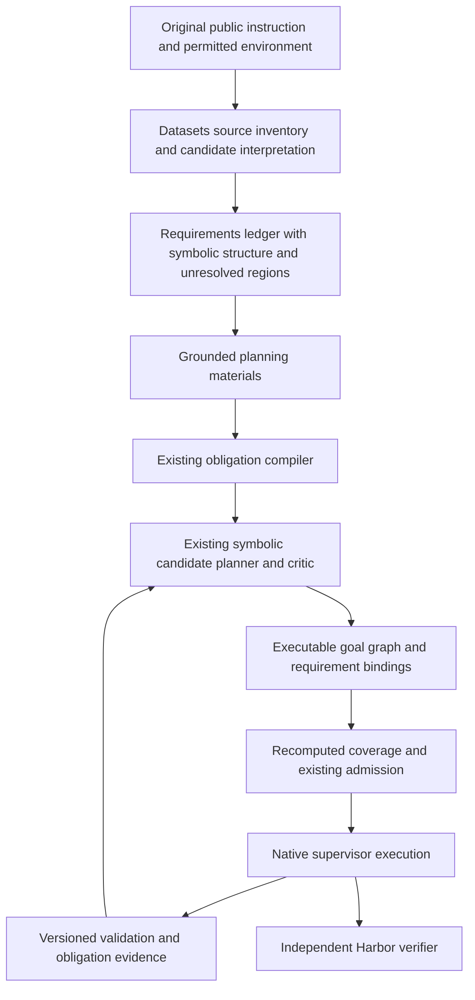

# Terminal Bench IntentIR Planning Improvement Plan

Convert the agent supervisor's Terminal-Bench planning path into a pipeline in which public instructions produce explicit symbolic requirements, requirements drive plan construction, and admission checks the plan against those requirements. Reuse datasets IntentIR for source interpretation and the supervisor's existing obligation compiler, symbolic candidate planner, critic, formal compiler, and execution machinery.

Status: structural coverage, bounded reviewed-operation symbolic planning, task-specific worker requirements, and read-only public-check progress with repair nominations are implemented locally. General prompt interpretation, broader task preparation, automatic repair admission, and benchmark evaluation remain proposed. The review covers the local source checkout, including working changes, rather than a particular deployed runtime archive. The environment context date is 2026-10-01. The [review snapshot](terminal_bench_intent_planning.review.json) records the original review revisions and digests; it is historical and does not identify the implementation below. Implementation work is tracked in [the task backlog](terminal_bench_intent_planning.todo.md).

The proposed [repository proof index and codebase IR plan](REPOSITORY_PROOF_INDEX_AND_CODEBASE_IR_PLAN.md) extends software-effect grounding: complete repository snapshots, bounded repository-specific autoencoder training, source-aligned formalization, independently checked proofs, DuckDB/DuckLake evidence storage and typed intent-to-code matching. Its [backlog](repository_proof_index_and_codebase_ir.todo.md) defines the evidence path into the existing symbolic planner and admission contracts. It does not change the implemented milestones or their qualification evidence below.

The first deliverable is a signed requirements ledger and a recomputed plan coverage receipt at the existing preparation, planning, and admission boundary. This establishes structural coverage of an explicit interpretation. It does not establish that arbitrary natural language was translated faithfully or that the task was completed correctly.

## Implemented Coverage Milestone

The opt-in route now follows public source → existing or reviewed candidate IntentIR report → source requirement ledger → independently authored output and validation groundings → model graph plus requirement bindings → deterministic coverage → signed admission and native pending contract. The default direct route remains available when no requirement contract is selected. Selecting coverage does not fall back to direct planning on rejection.

Datasets [requirements.py](../../../ipfs_datasets/ipfs_datasets_py/logic/intent_ir/formalize/requirements.py) builds and validates `intent-requirement-ledger@1`. It retains the complete producer report, exact character and UTF-8 byte spans, modality, unsupported regions, rich ASTs, and native action/control scope. Validation reconstructs the ledger from its frozen report and source, without replaying inference. Complete source accounting remains distinct from supported interpretation and semantic alignment. Reviewed fixtures use a separate explicit report schema; a partial native producer report is rejected.

Accelerate [intent_plan_coverage.py](../../ipfs_accelerate_py/agent_supervisor/prompt/intent_plan_coverage.py) validates `intent-plan-requirement-contract@1`, wraps the existing planner request, parses `intent-plan-proposal@1`, and checks required bindings, exact output effects, acceptance-linked validations, dependency order, prohibited effects, and extra task artifacts. Graph identities retain the existing graph format. This first execution profile supports atomic native goals. Rich expressions, non-goal roles, native conditions, action contracts, and unresolved source regions cannot receive successful execution coverage. Their representations remain visible for the later adapter.

The versioned runtime uses `supervisor-local-benchmark-manifest@4`, planning receipt `@2`, pending completion contract `@2`, and receipt reference `@2`. The signed manifest binds a canonical JSON requirement artifact and its DAG-JSON CID. Encoding the candidate report as inert JSON retains fractional confidence metadata without relaxing the existing proof serializer's numeric rules. The runtime checks the immutable source, reconstructs requirements and coverage, preserves declared creations, and compares the complete pending contract and its native identity at launch. Public instruction delivery and owner validation/observation understand the new version. Existing versions retain their original contracts, and the descriptive `intent_ir_root` keeps its original meaning.

Select the route with `full_supervisor_benchmark prepare --intent-requirement-contract /path/to/requirements.json`, `terminal_indexed_preparation.prepare(..., intent_requirement_contract=Path(...))`, container supervisor `--intent-requirement-contract`, or `FullSupervisorAgent(intent_requirement_contract=...)`. The selected contract must refer to `.supervisor-instruction.md` and bind the exact public instruction supplied to the trial. It is supplied independently of the planning model. High-level preparation and collection record the strategy, contract CID, and canonical digest; collection detects a changed selection. Successful and rejected coverage receipts remain inspectable; source or prepared-contract tampering fails before provider dispatch.

This milestone does not translate arbitrary benchmark prompts automatically, derive operation effects from software, generalize the Bottle task contract, or establish an official score improvement. The following local milestone implements the bounded TIP-003/TIP-007/TIP-008 join. The tests use explicit candidate interpretations and local public validators; they do not measure interpretation accuracy or hidden benchmark reward.

Local verification on 2026-10-01:

| Suite | Result | What it establishes |
| --- | --- | --- |
| Datasets requirement ledger and existing document/rich frontends | 106 passed | Exact source selectors, report identities, canonical reconstruction, scoped native/rich representations, malformed producer rejection, and bounded scope amplification. |
| Supervisor coverage, existing admission/creation/receipt/completion/public readers, preparation/advice/adapter, and admitted runtime regressions | 172 passed | Compatibility and fixture integration, including provider omission/stale-contract rejection and existing actual native start/publication/shutdown paths. |
| New signed requirement admission and real native integration | 37 passed, zero skips | Fractional candidate metadata, immutable source, receipt/pending replay, actual claim → publication → owner validation → typed completion, and signed contract/native relation corruption rejection. |
| High-level benchmark contract selection and mocked Harbor transport | 18 passed, zero skips | Strict source-bound selection, immutable configuration copy, CLI propagation, collection identity accounting, and actual adapter artifact/flag delivery for both arms. |

The final admitted runtime regression suite was also rerun after the complete persisted relation comparison: nine passed, zero skips. These figures describe the first coverage milestone. Native runs used the existing DuckDB 1.5.5 environment and actual Quack transport. AST sealing remained enabled with fresh catalogs so these results represent execution, not cached skips. No provider, Docker benchmark, checkpoint training, or official verifier trial was run.

## Implemented Reviewed-Operation Symbolic Milestone

The same requirement-contract option accepts `intent-plan-requirement-contract@2`. This adds an independently authored `intent-symbolic-operation-contract@1`, with a review reference, exact native statement matchers, output effects, validation keys, and operation dependencies. The adapter checks each matcher against its frozen native document digest, statement identity, predicate, arguments, and modality. Every supported requirement belongs to exactly one operation; an operation may cover several requirements. Operations must match the complete independently signed task population and its outputs, checks, and dependencies. This version supports atomic required or intended native goals; conditions, alternatives, action/control scope, and prohibitions are rejected rather than lowered incompletely.


[intent_requirement_adapter.py](../../ipfs_accelerate_py/agent_supervisor/planning/intent_requirement_adapter.py) supplies real `TypedIntent`, `TypedPredicate`, `ProducerRule`, and `TaskCandidate` records to the existing planner. Their reviewed predicate means administrative selection of a signed task to cover a requirement. It does not mean the requested program behavior exists or that the original interpretation is correct. No source facts are manufactured: `current_facts` is empty, and source semantics, proof, execution, and completion authority remain false. Explicit dependencies appear both as producer premises and task scheduling edges.

[intent_symbolic_planning.py](../../ipfs_accelerate_py/agent_supervisor/planning/intent_symbolic_planning.py) invokes the existing obligation compiler, symbolic candidate planner, and independent critic without a model. It requires an accepted candidate; there is no baseline or synthetic task fallback. The selected schedule must cover exactly the signed operations and preserve their dependency edges. Projection retains every declared output effect, media type, scope, validation argv, policy, and acceptance record. The existing formal compiler's `ASSIGN` effects are compared against the reviewed output triples. Pending public checks do not acquire a fabricated proof reference, and proof-required policies still reject absent proofs. Planned predecessor tasks are checked against the schedule rather than treated as already observed prerequisites.

`PlanCreateInputSnapshot` schema version 2 binds complete supplied semantic material values, including runtime types, intent, facts, producers, tasks, predicates, goal/policy, context, extra materials, and available admission inputs. Request-only snapshots retain version 1. Finite candidate metadata is hashed locally without weakening the proof serializer. Opaque callbacks and live adapters disable reuse; changed materials are checked again before returning a cached preview or persisting it. The symbolic benchmark receipt includes the full input snapshot CID when signed workflow inputs are present. Older local manifests without workflow inputs instead bind their available inputs through material and manifest identities.

Preparation records `intent_symbolic` and constructs the deterministic route without requiring a planning provider or provider preview budget. Planning emits `intent-symbolic-planning-receipt@1`, reports zero planning provider calls, and retains selection, schedule, critique, material, coverage, graph, and formal effect identities. Admission replays the entire route and compares the exact graph and coverage. The signed planning receipt stores the symbolic receipt; native `supervisor-local-intent-plan@2` retains it, and receipt loading, pending-contract validation, and worker launch check it again. Replay uses the frozen signed baseline; subsequent legitimate output changes do not rewrite that baseline.

The terminal preparation still prescribes the Bottle task contract. Symbolic selection now drives the concrete graph, but this profile does not infer arbitrary operations or choose a different authorized task population. A worker still needs its independently qualified execution provider, and Harbor remains responsible for official reward. Task-specific context and bounded residual nominations are implemented below. Public-instruction interpretation qualification, generic capability-bounded task preparation, independently admitted repair execution, and matched deployed trials remain required.

The join exposed and corrected two existing critic defects: refinement records were collapsed under an empty identity, and direct coverage or discharged-status claims could bypass required producer premises. Critique now computes the least supported closure from selected producers, all prerequisite refinements, and qualifying current facts. Forged root coverage, missing dependencies, stale or descriptive observations, refutation, and cyclic discharge are covered by negative tests.

Local symbolic milestone verification on 2026-10-01:

| Suite | Result | What it establishes |
| --- | --- | --- |
| Complete preview identities, service, coverage and existing critic/admission/projection readers | 150 passed | Full material and type identity, opaque nonreuse, mutation rejection, compatibility, and unchanged coverage gates. The original 10 service tests were also rerun after the final critic change. |
| Checked requirement-operation adapter | 34 passed | Exact native atoms, grounded effects/checks/order, one operation per requirement, several requirements per operation, unsupported-scope rejection and no invented facts. |
| Proof, dependency scheduling, evaluator, existing symbolic and adaptive planners | 78 passed | Pending proof stays absent, proof-required policy fails closed, internal predecessors are checked scheduled work, and existing planning behavior remains compatible. |
| New critic prerequisite/fact/forgery controls | 21 passed | Independent producer closure, exact refinement population, missing premises, false claims, current observations, refutation, dependency erasure and cycles. Six existing critic tests also pass. |
| Signed symbolic admission and native replay, including ordered operations | 23 passed, zero skips | Exact formal outputs, actual native task dependencies, owner launch verification, tampered signed receipt/pending rejection, real failed/passed acceptance, required creation and claim/publication/owner completion. |
| Existing signed requirement admission | 37 passed, zero skips | The first coverage profile and its full native relation/replay controls remain valid. |
| Existing local runtime/admission/creation/receipt/completion/public instruction | 74 passed, zero skips | Existing runtime start/stop and owner validation remain compatible. |
| Benchmark preparation, contract selection and Harbor transport | 39 passed, zero skips | Source-bound version 2 dispatch, stable nonempty snapshot and full receipt replay, zero planning provider calls, no fallback, time-budget rejection and existing option transport. |

These focused suites overlap, so their counts are not an aggregate trial count. Fresh AST-seal catalogs were used for final checks. Active native-owner cases used installed DuckDB 1.5.5 and Quack; Harbor transport used its existing Python environment. No live provider, Docker benchmark, new checkpoint training, or official verifier trial was run.

## Implemented Worker Requirements and Residual Observation

The bounded TIP-009 implementation carries the accepted interpretation into the worker without granting it new authority. [intent_requirement_context.py](../../ipfs_accelerate_py/agent_supervisor/runtime/intent_requirement_context.py) emits `supervisor-task-intent-requirements@1`: exact source spans and text, checked native atoms, applicable requirement bindings, prerequisite requirements, supported global prohibitions, reviewed operations, and the signed task's outputs, scope, checks, acceptance and dependency identities. Coverage version 1 retains its supported global prohibitions; the symbolic version 2 profile continues to reject unsupported prohibitions and conditional scope.

[router_public_instruction.py](../../ipfs_accelerate_py/agent_supervisor/runtime/router_public_instruction.py) uses public-instruction artifact and inclusion receipt version 2 for manifest version 4. Before provider dispatch it verifies signatures, all pure manifest declaration rules, exact graph and planning receipt replay, source identity and the allocated worktree. The worker needs no owner profile keys or database access. A requirement source can be an independently signed read-only input outside the selected task's write scope; this does not expand that scope. The unchanged original instruction and the separately identified requirement context are appended after semantic encoding. Rejection cannot downgrade to the legacy artifact. Historical replay can reconstruct a prior invocation, but it cannot authorize a new dispatch after the baseline changes. The inclusion receipt explicitly leaves native persistence verification to the owner launch path.

[intent_requirement_observation.py](../../ipfs_accelerate_py/agent_supervisor/runtime/intent_requirement_observation.py) emits `intent-requirement-observation@1` through a read transaction on the actual native owner. It checks the active plan, complete task population, exact pending contracts and persisted relations. Public validation evidence must be owner-signed and match its native result, run and event records. Event sequence selects the newest check, including a newest stale check; an older pass cannot reappear as current evidence. Missing or inconsistent links for a recognizable signed check make the projection unavailable. Source tree, task revision, attempt and retained completion receipt determine freshness. A completed task's final check can remain current only for the retained completion attempt and pre-completion revision. Filesystem and native watermarks are checked before and after capture. Any change to the admitted source tree conservatively invalidates prior checks, including a change to a dependent task's output.

Requirement rows distinguish `unobserved`, `failed`, `missing_outputs`, `stale`, `public_checks_passed`, and `not_measured`. Output presence and public-check success remain separate measurements. Requirements with no bound public check, including global prohibitions, do not acquire a success claim from absence of failures. Freshness covers the signed source inventory and native revision; the projection does not rerun validation or measure every external process input. The observation preserves the signed intent revision, makes no provider calls or canonical state changes, leaves source semantic correctness unresolved, and reports no official reward. The existing native completion contract remains in force; this projection does not strengthen its public smoke check into semantic correctness.

[intent_requirement_repair.py](../../ipfs_accelerate_py/agent_supervisor/planning/intent_requirement_repair.py) emits `intent-requirement-repair-proposal@1` using the existing `ResidualLlmPacket`. Unobserved or stale checks nominate validation. Actual failed checks, or a required output still missing after fresh checks, can nominate repair within the original signed output paths and checks. Dependency successors are included for revalidation. Packets retain the immutable intent revision and current observation identity, reject oversized content without truncation, and require a fresh observation before any later admission. They do not dispatch workers, admit tasks, reinterpret source, publish changes, or settle completion. `AdmittedBenchmarkRuntime.observe()` attaches both projections to the existing terminal report after its normal owner verification. A rejected repair projection preserves the valid observation and reports repair unavailability separately.

Conditional and alternative semantics, generic task preparation, and automatic repair admission remain open. The existing dispatch path also rejects a new worker invocation against a changed baseline after publication; ordered publication needs an independently admitted successor context before it can become a generic execution route. Local ordered fixtures qualify dependency projection and evidence handling, not arbitrary multi-task benchmark execution.

Local worker and observation verification on 2026-10-01:

| Suite | Result | What it establishes |
| --- | --- | --- |
| New public declaration and planning replay rules | 24 passed, zero skips | Owner and public replay share exact source/task/policy rules; even a matching signed nonzero-exit graph and receipt cannot bypass them. Replay needs no private keys or current-source reads. |
| New worker requirement delivery and historical context audit | 33 passed, zero skips | Real context compilation and router transport preserve exact task/source/atom/dependency/prohibition bindings after optional semantic encoding. Tampering fails before the captured provider; historical model bytes replay after worktree removal without fresh dispatch authority. |
| New source-bound observation and repair projections | 27 passed, zero skips | Failed checks, missing creations, stale evidence, unmeasured prohibitions, exact intent/observation identities, source changes during capture, task/plan corruption, and bounded signed-scope nominations. Twelve additional integrity cases reject missing, malformed, duplicate or mismatched result/run/event links without resurrecting an older pass. |
| New actual native owner and runtime lifecycle | 20 passed, zero skips | Actual claims, owner subprocess checks, publication including unchanged content, completion aliases, retained typed receipt/attempt integrity, newest event order, dependent nominations, and isolated derived-report failures. |
| Existing router, admitted runtime, instruction delivery and terminal context audit | 59 passed, zero skips | Existing routes, native runtime behavior and output collection remain compatible. |
| Existing owner admission, both requirement versions, ordered operations, completion, receipt storage and semantic router | 103 passed, zero skips | Existing signed/native admission and completion boundaries remain intact. One existing unregistered pytest timeout marker emits a warning. |

The four new suites passed together in a fresh 92-case run; 12 later integrity cases passed separately against the same production code, for 104 distinct new cases. Additional native-only and worker-only runs are corroborating checks, not extra distinct cases. Existing declaration/create/instruction compatibility checks also pass. Final runs used fresh AST-seal catalogs, installed DuckDB 1.5.5 and native Quack; provider transport was captured locally. No live provider, Docker benchmark, new checkpoint training or official reward evaluation was run.

## Current Entry Point and Behavior

The current original-task benchmark uses `full_supervisor_benchmark`, which imports `TASK = "fix-code-vulnerability"` from `native_codex_baseline`. Its Harbor adapter is `FullSupervisorAgent`. The older `terminal_run.py` launches a different, explicitly labeled legacy daemon pilot.

| Stage | Existing entry point | Observed behavior |
| --- | --- | --- |
| Trial configuration | [full_supervisor_benchmark.config_for](../../benchmarks/agent_supervisor/container_coding/full_supervisor_benchmark.py) | Selects a runtime archive, full or no-index arm, pinned model configuration, and a 300-second agent limit. |
| Public instruction | [FullSupervisorAgent.run](../../benchmarks/agent_supervisor/container_coding/full_supervisor_harbor_agent.py) | Writes the Harbor instruction and launches the container supervisor. |
| Trial orchestration | [terminal_container_supervisor.run](../../benchmarks/agent_supervisor/container_coding/terminal_container_supervisor.py) | Calls preparation, initial indexed context, planning, admitted context, Doctor selection, and native execution. Reserves 40 seconds for cleanup. |
| Preparation | [terminal_indexed_preparation.prepare](../../benchmarks/agent_supervisor/container_coding/terminal_indexed_preparation.py) | Produces optional IntentIR advice and an independently authored, signed task manifest. |
| Planning | `terminal_indexed_preparation.plan` | Direct/coverage contracts use `generate_prompt_goal_graph` with at most one isolated provider call. A version 2 requirement contract selects the existing symbolic stages with zero planning provider calls. |
| Admission | [admit_local_benchmark_plan](../../ipfs_accelerate_py/agent_supervisor/runtime/local_planning_admission.py) | Recomputes signed contract bindings and rejects changes to the prescribed task population, scope, outputs, acceptance, dependencies, or validation commands. |
| Native storage | `materialize_local_benchmark_plan` | Stores goals, plan, tasks, and pending completion contracts in `IntentRepository`. |
| Worker requirements | `prepare_public_instruction_context` and `load_public_instruction` | Manifest version 4 selects public instruction version 2; exact public source, graph/receipt replay and task-specific requirements are delivered after semantic encoding. |
| Execution and evaluation | `AdmittedBenchmarkRuntime` and Harbor | Native validation settles the local task contract; Harbor independently determines official benchmark reward. |
| Requirement progress | `AdmittedBenchmarkRuntime.observe` | Attaches read-only native public-check/output measurements and bounded validation/repair nominations without changing intent or dispatching work. |

The direct and coverage prompt constraints prescribe root `TB-GOAL`, child `TB-SUBGOAL`, and task `TB-CODE-TASK`. The symbolic projection supplies its own administrative goal identities while retaining that same signed task. The task modifies `bottle.py`, creates `report.jsonl`, has no dependencies, and uses a public syntax and report-shape smoke check. Its budget allows two goals and one task. The prompt constraints also require empty assumptions, risks, uncertainty debt, and unresolved questions. This is a controlled integration fixture, with little freedom for requirement-driven decomposition.

`request.intent_ir_root` is the content identity of a `supervisor-local-descriptive-domain@1` declaration generated from the authored task contract. It is not the identity of an interpreted IntentIR document. `_verify_planning_inputs` recomputes that declaration and rejects a foreign root. Replacing the root requires a versioned admission contract.

Both supervisor arms already support optional instruction preprocessing. Feature, roundtrip, extended-family, and source-unit advice are explicitly descriptive. Missing or rejected advice can leave the existing planner available with the original instruction. Availability of the code does not establish that a particular deployed archive selected a checkpoint or delivered its output to the worker.

The public smoke check accepts structurally valid CWE identifiers without checking that a vulnerability was identified or fixed. Native completion and official reward therefore measure different properties. Keep that distinction visible in all new receipts and reports.

## Existing Components to Reuse

| Concern | Reusable component | Integration limit |
| --- | --- | --- |
| Source identity and requirements | [IntentIR schema](../../../ipfs_datasets/ipfs_datasets_py/logic/intent_ir/schema.py): `SourceRef`, `SourceSpan`, `IntentStatement`, `IntentAction`, `IntentControlEdge`, `IntentIRDocument` | Source references and `NodeGrounding.GROUNDED` alone do not establish evidence truth or semantic fidelity. |
| Canonical decoding | [decode_intent_ir](../../../ipfs_datasets/ipfs_datasets_py/logic/intent_ir/decoder.py) and [canonicalization](../../../ipfs_datasets/ipfs_datasets_py/logic/intent_ir/canonicalize.py) | Validate exact schemas and recompute identity. Preserve the distinction between prefixed and bare SHA-256 representations. |
| Source inventory and inference | [prepare_source_document](../../../ipfs_datasets/ipfs_datasets_py/logic/formalization/autoencoder/source_document.py) | Shared route for original Markdown or intent text and rich versus legacy checkpoint selection. Preserve unsupported source regions and inference counters. |
| Rich logic structure | [prepare_rich_intent_document](../../../ipfs_datasets/ipfs_datasets_py/logic/intent_ir/formalize/rich_document.py) and [project_rich_intent_logic](../../../ipfs_datasets/ipfs_datasets_py/logic/intent_ir/formalize/rich_logic.py) | Conditional, conjunction, and choice expressions must retain their rich AST. Native v1 IntentIR cannot represent all these scopes. |
| Explicit grounding premises | [prepare_typed_slot_environment](../../../ipfs_datasets/ipfs_datasets_py/logic/formalization/typed_slots.py) and [source family bridge](../../../ipfs_datasets/ipfs_datasets_py/logic/intent_ir/formalize/source_family_bridge.py) | Exact source, checkpoint, graph, and clause bindings identify premises; they do not verify software effects. |
| Formal artifacts | [compiler.IntentFormalizationCompiler](../../../ipfs_datasets/ipfs_datasets_py/logic/intent_ir/formalize/compiler.py) | Document compilation is distinct from the route and lowering API with the same class name in [typed_compiler](../../../ipfs_datasets/ipfs_datasets_py/logic/intent_ir/formalize/typed_compiler.py). |
| Intent obligations | [IntentProofObligations](../../../ipfs_datasets/ipfs_datasets_py/logic/intent_ir/formalize/obligations.py) | Formal artifact obligations do not prove prompt interpretation or worker changes. |
| Desired and observed state | [TypedIntent, TypedPredicate, ObservedFact, ProducerRule, TaskCandidate](../../ipfs_accelerate_py/agent_supervisor/planning/obligation_graph_compiler.py) | Use explicit support classifications. `TypedPredicate` defaults to reviewed support; inferred mappings must not inherit that default. |
| Symbolic planning | [PlanCreateService](../../ipfs_accelerate_py/agent_supervisor/prompt/plan_create_service.py), [SymbolicCandidatePlanner](../../ipfs_accelerate_py/agent_supervisor/planning/symbolic_candidate_planner.py), [PlanCritic](../../ipfs_accelerate_py/agent_supervisor/planning/plan_critic.py) | Supply real typed materials and executable projections. Synthetic default intent and default candidate projections do not qualify real task semantics. |
| Plan compilation and admission | `FormalPlanCompiler`, `validate_formal_plan`, local admission, and existing production admission | Retain the separate scopes of local pending acceptance and production assurance. |
| Evidence lifecycle | [CodeClaimRecord contract](agent_supervisor_code_claim_evidence_contract.md) and existing validation receipts | Reuse assurance derivation, invalidation, and claim lifecycle rather than introducing another proof-status system. |

`PromptIntentAdapter` wraps a whole prompt in a user intention and request action. That is useful source provenance, but genuine decomposition requires the source-document candidate route or another explicitly qualified frontend.

`PlanCreateService` already supports the sequence scan, query, evidence, obligation, candidate, critique, admission, and parallel plan. `PlanCreateMaterials` accepts typed intent, facts, producers, task candidates, predicates, and a frozen goal. The main missing connection is a checked adapter from datasets interpretations into those materials and then into executable task records.

Two existing service details need correction before this integration becomes authoritative. `PlanCreateMaterials.to_binding_dict` does not bind the contents of all those semantic materials, so changed interpretations can otherwise share a preview cache key. `_candidate_plan_projection` also supplies default outputs, resource settings, and effects rather than preserving a complete real task contract. Extend both with explicit canonical bindings and concrete task projection.

## Proposed Pipeline and Ownership



Datasets owns source parsing, source inventories, IntentIR and rich AST semantics, typed projections, and formal obligation generation. Accelerate owns the semantic adapter, execution policy, obligation planning, candidate selection, admission, scheduling, worker packets, and evidence lifecycle. The harness owns permitted input selection, deployment, experiment configuration, and official result collection.

Interpretation may be learned or model proposed. Execution permissions must come from the owner policy. A candidate that mentions a tool or command cannot grant its own permission. Producer rules describe reviewed operations under explicit preconditions; they cannot be manufactured as verified code effects from an LLM assertion.

## Requirements Ledger and Coverage Contracts

All names in this section are proposed interfaces. Existing native records remain the underlying representation of simple requirements. Add small versioned envelopes for source accounting, compound structure, and plan relationships.

The ledger should bind:

- Original instruction digest, byte length, public source identity, and permitted environment root.
- Full datasets source-report identity, frontend code identity, checkpoint descriptor and weight identities, and explicit inference options.
- Every source unit, its original byte and character spans, parent or heading context, and a disposition: interpreted candidate, unresolved, unsupported, or non-requirement under a named rule.
- Native statement or rich AST identities, modality, source provenance, interpretation assumptions, and explicit support status.
- Referent and artifact bindings, including ambiguity and missing bindings.
- Required versus permitted behavior, prohibitions, conditions, alternatives, ordering, and completion obligations.

For native atom or sequence candidates, reuse statement and action IDs. For rich expressions, retain the rich document and AST identity with the source unit reference. Do not force conditional norms or Boolean alternatives into flat native statements.

A source inventory can account for every character without interpreting every requirement. Report source accounting, supported interpretation coverage, plan coverage, and observed satisfaction independently. Do not use a percentage of accounted bytes as a measure of semantic completeness. A broad statement marked unsupported must remain visible even if neighboring clauses are represented.

Proposed integration interfaces:

```python
# datasets: build a bounded ledger from an existing source report
build_intent_requirement_ledger(source_text, *, source_report, source_identity)
validate_intent_requirement_ledger(ledger, *, source_text, source_report)

# accelerate: use existing planning types and checked operation contracts
compile_intent_planning_materials(ledger, *, environment, policy, producer_catalog)
check_intent_plan_coverage(ledger, *, graph, bindings, materials, policy)
```

Validation checks exact source slices, canonical identities, duplicate and dangling references, bounded artifacts, and preservation of source structure. Independent replay reproduces the chosen interpretation and its producer bindings; it does not make the interpretation semantically true by repetition.

The coverage receipt should bind the ledger, interpretation, graph, obligation graph, producer catalog, environment, checker, and policy identities. It records task and validation relationships, uncovered requirements, orphan tasks, preserved conditions and modalities, and unresolved frontiers. It must report `semantic_alignment_verified: false` unless a separately qualified alignment contract supplies evidence.

The new source coverage adapter should connect requirements to existing obligation nodes and invoke `PlanCritic` for its obligation and candidate coverage checks. Its additional responsibility is source-to-requirement and requirement-to-executable-task alignment. Reuse the critic's AND and OR refinement traversal instead of implementing another obligation coverage algorithm.

For a required output, an ID reference is insufficient: the checker must verify the declared artifact effect and appropriate validation relationship. For a prohibition, check the applicable reviewed effect vocabulary and scope. Effects outside that vocabulary remain unsupported. A task that references every requirement ID but writes unrelated outputs must fail structural coverage.

Coverage can justify planning under an explicit interpretation. Completion needs current validation evidence. Proof-required obligations additionally need evidence at the assurance level specified by policy. Observations, model predictions, solver candidates, kernel proofs, and official benchmark reward retain their existing distinctions.

## Versioned Integration and First Milestone

The current manifest, planning inputs, task specifications, acceptance records, and provider graph schemas reject extra fields. Introduce a new local manifest version with signed references to the ledger, semantic materials, interpretation policy, and coverage requirements. Do not insert a ledger field into existing `planning_inputs` or substitute the existing descriptive root in place.

For the first milestone, retain the descriptive `intent_ir_root` required by the existing local contract and add a distinct signed semantic ledger binding. A later version may define a composite intent root explicitly. Keep the meaning of each root stable across readers.

The current planner synthesizes task provenance itself. The model cannot add requirement fields to the existing graph JSON, and adding metadata after parsing changes content identities. A proposed provider envelope should therefore contain the existing graph proposal plus a bounded requirement-binding proposal. Parse the inner graph with the existing parser and resolve binding task keys to the resulting task CIDs. Recompute coverage from the frozen ledger and concrete graph. Version the envelope and sign its interpretation and policy selection; treat model bindings as claims to check.

In phase one, integrate this envelope at `terminal_indexed_preparation.plan` before `admit_local_benchmark_plan`. Extend `_planning_payload` and `verify_local_benchmark_admission` to recompute the ledger and coverage bindings. Merely writing a checked sidecar before admission leaves a bypass unless every admission reader and worker launch revalidates its signed requirements.

Store the ledger and coverage references with the admitted plan and its immutable task contract. Resolve original instruction and requirement context outside semantic minification where needed. Preserve existing task CIDs rather than annotating parsed task records without rebuilding their dependent identities.

Migration must cover the readers as well as the new manifest writer. [router_public_instruction](../../ipfs_accelerate_py/agent_supervisor/runtime/router_public_instruction.py) explicitly accepts only the existing manifest versions. [local_completion_bridge](../../ipfs_accelerate_py/agent_supervisor/runtime/local_completion_bridge.py) recognizes created-output handling through equality with the current create-manifest schema. The planning receipt loader has its own version checks. Introduce shared version and capability helpers, preserve old behavior, and test created outputs under the new contract. Native materialization currently constructs task bodies without retaining all graph provenance; preserve the requirement bindings explicitly in the immutable contract rather than relying on provenance to survive automatically.

First milestone scope:

1. Consume one datasets source report and produce the ledger with explicit unsupported units.
2. Provide reviewed requirement fixtures for output creation, file modification, simple prohibitions, and ordered actions; exercise actual candidate inference separately when a compatible checkpoint is available.
3. Add the versioned planning envelope and independently checked binding projection.
4. Add signed admission bindings and revalidation on replay, materialization, and launch.
5. Retain the current one-task worker fixture while detecting missing required artifacts and incompatible supported effects.
6. Report structural coverage and unresolved interpretation separately from local task completion and official reward.

Success means the accepted plan preserves every supported mandatory requirement in the frozen interpretation, rejects omissions and contradictions within the supported effect vocabulary, and retains all unresolved source regions. It is not a claim of general prompt understanding.

## Symbolic Plan Construction and Task Generalization

After ledger and admission qualification, adapt supported requirements to `TypedIntent.desired_predicates`, reviewed `ProducerRule` operations, observed facts, and executable `TaskCandidate` definitions. Explicitly mark inferred, unknown, and unsupported semantic mappings. The existing `ObligationGraphCompiler` can backward-chain desired state through alternative producers and required premises. `SymbolicCandidatePlanner` and `PlanCritic` can select and independently inspect the candidates.

Bind the complete supplied intent, facts, producer rules, task candidates, predicates, context, and frozen goal into preview identities and cache lookup. Changing modality, branch scope, operation semantics, evidence, or policy must invalidate a reused preview even when the original prompt has not changed.

Introduce a concrete executable projection that preserves outputs, validation contracts, read and write scopes, budgets, and capability requirements. Make production defaults unavailable in the strict symbolic experiment when the real adapter is missing. Distinguish backward planning over reviewed predicates from proofs about arbitrary Python code.

Initially support explicit artifacts, checked schemas, grounded file edits, and simple ordering. Preserve conditional branches and choices; require explicit guard semantics before scheduling conditional work. Reuse `guarded_workflow` only within its declared finite-domain bounds. Unsupported quantification, anaphora, nested scope, or temporal meaning must produce an unresolved requirement.

Then replace Bottle-specific preparation with public-input task contracts. Freeze permitted capabilities and input roots before interpretation. Derive task specifications from the checked interpretation inside those capabilities, validate them independently, and only then sign the execution manifest. The model must not self-authorize new paths or validation commands.

Generalization also changes `full_supervisor_benchmark` and `native_codex_baseline` task selection, scanner patterns, source inventory limits, absence and creation checks, worktree scope, and completion validation. Support empty-workspace tasks explicitly. Existing one-task assumptions in context binding and worker orchestration must be removed before multi-task results qualify.

For multiple tasks, require explicit prerequisite edges, correct conditional or alternative semantics, write-conflict scheduling, per-task validation, and final obligation aggregation. Increase worker concurrency only after single-worker decomposition is qualified, so agent collaboration and interpretation effects can be measured separately.

## Execution Evidence and Repair

Each worker receives its applicable requirements, symbolic predicates, permitted actions, artifact bindings, validation obligations, and original public instruction. Its capsule may be smaller than the full plan but must preserve conditions and prohibitions governing its effects.

The local atomic profile now implements this delivery and the public-check observation/nomination loop described above. Extending it to conditions, semantic roots, independently admitted successor dispatch and automatic repair remains future work; unsupported structure must remain visible and fail closed.

Use existing claim and validation lifecycles for requirement satisfaction. A requirement can be open, supported by current evidence, refuted, unsupported, not measured, or stale. An index query or compilation check supports only the property it actually observed. A report with the correct JSONL shape does not prove that its findings are correct.

When a worker modifies source, recompute affected environment and semantic roots, invalidate evidence through existing selectors, and inspect the residual obligation set. A repair proposal should address the remaining obligations while preserving the original intent revision. Any proposed reinterpretation is a new intent revision with its own source alignment and coverage checks.

Account for extraction, inference replay, grounding, plan selection, critic checks, validation, repair calls, and cleanup inside the declared total budget. Avoid repeatedly running frozen neural inference across unchanged transitions: reuse verified source and model bindings where an independent checker can validate the immutable artifact. Any required replay remains measured overhead.

## Evaluation and Release Conditions

Use separate planning strategy, index, Doctor, and worker settings. The current `no-index` arm also disables the symbolic Doctor, so comparing it with full does not isolate IntentIR's contribution. Contract selection now records `direct`, `intent_coverage` (version 1), or `intent_symbolic` (version 2); optional advice remains separately selected. A fully independent strategy/index/Doctor/worker comparison interface remains proposed.

| Comparison | Planning behavior | Required controls |
| --- | --- | --- |
| Direct baseline | Existing graph planner without IntentIR advice | Same model, total budget, worker count, task revision, index and Doctor settings. |
| Advisory | Existing graph planner with selected IntentIR advice | Same pinned checkpoint and source input handling as the candidate. |
| Coverage | Existing graph planner with signed ledger and admission coverage checks | Include ledger, replay, and checker overhead. |
| Symbolic | Ledger adapted into obligation compilation, candidate planning, and critique | Include grounding, operation catalog, selection, repair, and all failed calls. |

Initially run all strategies with one worker and fixed index and Doctor settings. Afterwards measure their interactions through additional matched comparisons. Preserve the native Harbor agent baseline as an independent end-to-end reference.

Use task families covering source repair, output generation, empty workspaces, multi-step prerequisites, prohibitions, conditions, ambiguous references, and unsupported language. Annotation for translation evaluation must be derived from public instructions. Keep hidden tests, official solutions, previous patches, and evaluation feedback out of initial agent and index inputs. Freeze training and tuning splits independently of evaluation prompts.

Primary outcome is official task success. Additional outcomes are supported requirement recall, omission and contradiction rate, source alignment errors, unsupported and unresolved rates, admission rejection reasons, evidence staleness, retries, total tokens, agent wall time, preprocessing and solver cost, and time remaining for implementation. Retain unsuccessful trials in usage accounting; missing provider usage remains unknown.

Required negative controls include omitted artifacts, reversed normative polarity, dropped guards, collapsed alternatives, invalid prerequisite order, unrelated task effects, stale source or model bindings, forged coverage receipts, tampered command permissions, and false completion from structural checks. Parameterized Lean syntax checks and multiple agreeing solvers must not be reported as proof of source meaning.

Extend the existing plan-create service, obligation compiler, symbolic candidate planner, plan critic, local admission, declared-create, and receipt-storage tests under `test/api`. Extend benchmark tests for instruction delivery, preparation, source-unit advice, context freshness, and runtime readers. Test new source semantics in datasets separately from accelerate scheduling and benchmark correctness. General interpretation remains limited by the current grammar: pronoun resolution, quantification, nested conditionals, and many temporal qualifiers need explicit unsupported handling before broader frontend development.

Advance through gates in order:

1. Ledger and identity contracts pass source, schema, scope, Unicode, and unsupported-region controls.
2. Coverage and admission pass omission, effect, forgery, replay, and reader compatibility controls.
3. Existing symbolic stages preserve real task contracts and invalidate previews on all semantic input changes.
4. Native execution carries requirement bindings through validation, merge, cleanup, and residual repair.
5. Generic task preparation and multi-task contracts pass held-out public fixtures.
6. Matched live trials report official outcomes and complete overhead without an unexplained fallback to direct planning.

Release decisions should use predeclared performance and correctness criteria after a pilot establishes variability. A supported-coverage improvement alone cannot justify a benchmark performance claim. Historical pilot measurements in [INDEXED_ABLATIONS](../../benchmarks/agent_supervisor/container_coding/INDEXED_ABLATIONS.md) motivate explicit overhead accounting; they were not rerun for this review.

## Verification of This Review

Read-only architecture reviews examined both the datasets interpretation contracts and supervisor admission and symbolic planning interfaces. The linked source snapshot records the inspected local files, including changes beyond repository HEAD.

During the initial read-only review, the preparation and structural-smoke tests selected in the HACC Python environment were skipped by its matching pytest AST seal, so that review claimed no fresh behavioral pass. IntentIR integration could not collect in that environment because Harbor was unavailable. Later implementation checks above use the installed environments together and fresh seal catalogs; they are distinct from those initial review results. No dependencies were installed or model calls made for the initial review.

Document validation checks local links, backlog consistency, and snapshot digest format. The review snapshot remains the original historical artifact. The implementation sections and backlog now record the subsequent local milestones and the work still required.
