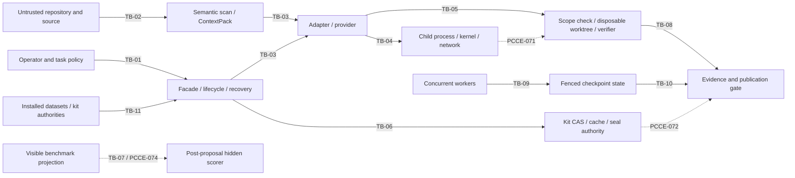

# Proof-context v0.1 threat model

Status: **security unqualified / no-go**
Task: `PCCE-070`
Board namespace: `proof-carrying-context-engine-v0.1`
Reviewed accelerator commit: `78af7999a8190256798a78b4aa51a9ad9c1f0e58`
Reviewed accelerator tree: `9d0b786ac7f60db0dd787b5df813fd2d50f8d04f`

This document freezes the security design before PCCE-071 through PCCE-075.
It is not a security qualification, does not treat documentation as a sandbox,
and gives no qualification credit to planned or partially observed controls.
Missing, unavailable, or unintegrated security evidence is a no-go. PCCE-076
must reconcile this immutable register with observed evidence before any later
qualification can proceed.

## Scope and non-goals

The model covers untrusted repositories and source prompt injection, malicious
tests and fixtures, untrusted agents and patches, scope and path escape, process
and command escape, network escape, secret disclosure, evidence forgery,
replay/cache poisoning, benchmark leakage, provider over-disclosure,
concurrent mutation, interruption, and compromised adapters.

PCCE-070 does not repair runtime code, execute attack payloads, validate a
provider's internal implementation, or certify cryptographic primitives. A
control is `observed_tested_limited` only inside the exact code and test boundary
named in the register. `observed_partial`, `planned`, and `absent_no_go` controls
cannot support release qualification.

## Assets

<!-- assets:start -->
| ID | Asset | Classification |
|---|---|---|
| `AS-01` | Canonical repository, refs, trees, and disposable worktrees | integrity-critical |
| `AS-02` | Task scope, governing policy, required tests, and proof obligations | integrity-critical |
| `AS-03` | Host filesystem, processes, network, credentials, and secrets | confidential-critical |
| `AS-04` | Context capsules, provider requests/responses, and logs | confidential-sensitive |
| `AS-05` | Hidden benchmarks, future patches, answers, and sealed corpus material | confidential-critical |
| `AS-06` | Receipts, CAS/cache blocks, seals, signatures, parents, and generations | integrity-critical |
| `AS-07` | Checkpoints, leases, fences, schedules, and terminal state | integrity-critical |
| `AS-08` | Resource budgets, cleanup guarantees, and service availability | availability-critical |
<!-- assets:end -->

## Actors

<!-- actors:start -->
| ID | Actor | Trust |
|---|---|---|
| `AC-01` | Malicious or compromised repository contributor | untrusted |
| `AC-02` | Malicious test or fixture author | untrusted |
| `AC-03` | Untrusted coding agent or provider response | untrusted |
| `AC-04` | Compromised adapter, transport, or local executable | compromised |
| `AC-05` | Malicious evidence producer or cache peer | untrusted |
| `AC-06` | Curious or compromised model provider | external-untrusted |
| `AC-07` | Stale, duplicate, or concurrent worker | untrusted-concurrent |
| `AC-08` | Crash, signal, kernel, or platform failure | environmental |
| `AC-09` | Misconfigured operator or route policy | privileged-fallible |
| `AC-10` | Compromised datasets or kit authority | compromised-authority |
<!-- actors:end -->

## Entry points

<!-- entry-points:start -->
| ID | Entry point | Owner |
|---|---|---|
| `EP-01` | Repository files, comments, symlinks, Git metadata, and refs | repository boundary |
| `EP-02` | Semantic scan and context construction | datasets authority |
| `EP-03` | Tests, fixtures, and verifier commands | verification boundary |
| `EP-04` | Task, route, and adapter configuration | supervisor/runtime |
| `EP-05` | Provider request, response, patch, and log channels | adapter boundary |
| `EP-06` | Executable, argv, cwd, environment, and inherited descriptors | process boundary |
| `EP-07` | External patches and replay fixtures | adapter ingestion |
| `EP-08` | Lifecycle artifacts, governance receipts, and checkpoints | lifecycle/recovery |
| `EP-09` | Kit CAS, proof cache, receipt, and seal admission | kit authority |
| `EP-10` | Visible/hidden projections and scorer access | benchmark authority |
| `EP-11` | Cancellation, resume, lease, and fence APIs | supervisor/recovery |
| `EP-12` | Reports, manifests, and immutable outer receipts | evidence publication |
<!-- entry-points:end -->

## Runtime and trust-boundary diagram

Solid arrows show present data flow, not a claim of complete isolation. Dashed
arrows are controls or boundaries scheduled by later tasks.



## Trust boundaries

<!-- trust-boundaries:start -->
| ID | Boundary | Current disposition |
|---|---|---|
| `TB-01` | Operator/configuration to facade/runtime | partial-no-go |
| `TB-02` | Untrusted repository to semantic/context authority | partial-no-go |
| `TB-03` | Runtime to adapter/provider | partial-no-go |
| `TB-04` | Supervisor to child/kernel/network | command-adapter-only-no-go |
| `TB-05` | Proposal to scope/apply/verification | partial-no-go |
| `TB-06` | Runtime to kit trust/CAS/seal authority | partial-no-go |
| `TB-07` | Visible corpus to hidden scorer | absent-no-go |
| `TB-08` | Mutable execution to immutable evidence/publication | partial-no-go |
| `TB-09` | Concurrent writers to lease/fenced CAS | partial-no-go |
| `TB-10` | Interruption/recovery to terminal disposition | partial-no-go |
| `TB-11` | Accelerator to installed cross-repository authorities | partial-no-go |
<!-- trust-boundaries:end -->

## Current and planned controls

<!-- controls:start -->
| ID | Status | Narrow claim and limitation |
|---|---|---|
| `OC-01` | observed_tested_limited | Closed wire schemas, identities, bounds, and lexical scope; CID admission is not general byte verification. |
| `OC-02` | observed_tested_limited | Closed adapter registry, non-authority, frozen lifecycle, and publication gates; ports remain trusted capabilities. |
| `OC-03` | observed_tested_limited | Strict external patch and replay-fixture byte/selector admission; no environment/freshness trust. |
| `OC-04` | observed_tested_limited | Linux CommandAdapter namespace/write/network/process controls; host reads and other execution paths remain outside the claim. |
| `OC-05` | observed_partial | Codex permit, mechanism, identity, scope, bounds, and redaction; no verified process/network/credential sandbox. |
| `OC-06` | observed_partial | Detached worktree, lexical paths, canonical-head check, and discard; no descriptor-rooted symlink containment. |
| `OC-07` | observed_partial | In-process generations, fences, idempotency, and repair-required recovery; no cross-process atomicity proof. |
| `OC-08` | observed_partial | Provenance/status/seal policy; CID shape and nonempty signature are not cryptographic trust admission. |
| `OC-09` | observed_partial | Hidden-field denial, CID-only pack records, request bounds, and redaction; no benchmark projection or payload access audit. |
| `OC-10` | observed_partial | Installed authorities can be required and typed unavailable; runtime defaults and fallback evidence remain non-qualifying. |
| `PC-071` | planned | Worktree, process, network, secret, path, resource, cancellation, and cleanup sandbox. |
| `PC-072` | planned | Receipt, proof-cache, and seal trust admission over exact bytes and live provenance. |
| `PC-073` | planned | Patch, prompt-injection, command-injection, and policy adversarial tests. |
| `PC-074` | planned | Hidden benchmark projection and provider-disclosure isolation. |
| `PC-075` | planned | Concurrent-writer and interruption adversarial integration tests. |
| `PC-076` | planned | Evidence-only security audit and qualification/no-go gate; not a preventive control. |
<!-- controls:end -->

## Threat-to-control-to-test matrix

P/D/R means preventive, detective, and recovery. Every row is presently a
no-go until its scheduled evidence is observed and reconciled by PCCE-076.

<!-- threats:start -->
| ID | Threat | Assets / actors / entry / boundary | Current P / D / R | Planned tasks | Disposition |
|---|---|---|---|---|---|
| `TH-001` | Repository/source prompt injection | AS-01/02/03/04; AC-01/03/06; EP-01/02/05; TB-02/03 | P OC-01/09; D OC-01/02; R OC-06/07 | PCCE-071/073/074/076 | partial-no-go |
| `TH-002` | Malicious tests and fixtures | AS-01/03/08; AC-02/04; EP-03/06/07; TB-02/04/05 | P OC-03/04/06; D OC-02; R OC-04/06/07 | PCCE-071/073/075/076 | absent-no-go for general tests |
| `TH-003` | Untrusted agent/patch and policy weakening | AS-01/02/06; AC-03/04; EP-04/05/07; TB-03/05/08 | P OC-01/02/03; D OC-01/02; R OC-06/07 | PCCE-071/073/076 | partial-no-go |
| `TH-004` | Scope or path escape | AS-01/02/03; AC-01/03/04; EP-01/05/07; TB-04/05 | P OC-01/03/04/06; D OC-01/02; R OC-06/07 | PCCE-071/073/076 | partial-no-go |
| `TH-005` | Process or command escape | AS-03/08; AC-02/04; EP-03/06; TB-04 | P/D/R OC-04 only | PCCE-071/073/076 | command-adapter-only-no-go |
| `TH-006` | Network escape | AS-03/04; AC-04/06; EP-05/06; TB-03/04 | P OC-04/05; D/R OC-04 | PCCE-071/076 | partial-no-go |
| `TH-007` | Secret or credential escape | AS-03/04; AC-04/06/09; EP-04/05/06; TB-01/03/04 | P OC-01/04/09; D OC-05/09; R OC-07 | PCCE-071/074/076 | partial-no-go |
| `TH-008` | Evidence, receipt, or seal forgery | AS-06; AC-05/10; EP-08/09/12; TB-06/08/11 | P OC-08/10; D OC-01/08; R OC-07 | PCCE-072/076 | partial-no-go |
| `TH-009` | Replay, stale cache, poisoning, or wrong parent | AS-06/07; AC-05/07/10; EP-07/08/09; TB-06/08/09 | P/D OC-03/07; R OC-07 | PCCE-072/075/076 | partial-no-go |
| `TH-010` | Hidden benchmark or future-answer leakage | AS-04/05; AC-01/03/06; EP-02/05/10; TB-03/07 | P OC-09; D absent; R OC-07 | PCCE-074/076 | absent-no-go |
| `TH-011` | Provider over-disclosure | AS-03/04/05; AC-06/09; EP-04/05/10; TB-01/03/07 | P/D OC-09; R OC-07 | PCCE-071/074/076 | partial-no-go |
| `TH-012` | Concurrent mutation, stale/ABA writer, duplicate result | AS-01/06/07; AC-07/10; EP-08/09/11; TB-05/08/09 | P OC-06/07; D OC-07; R OC-06/07 | PCCE-072/075/076 | partial-no-go |
| `TH-013` | Interruption or ambiguous terminal execution | AS-06/07/08; AC-04/07/08; EP-03/05/08/11; TB-04/09/10 | P OC-04/07; D OC-02/07; R OC-04/06/07 | PCCE-071/075/076 | partial-no-go |
| `TH-014` | Compromised adapter or transport | AS-01/02/03/04/06/08; AC-04; EP-04/05/06; TB-03/04/05/11 | P OC-02/04; D OC-01/02; R OC-06/07 | PCCE-071/073/075/076 | partial-no-go |
<!-- threats:end -->

## Critical observed gaps

- `CommandAdapter` explicitly leaves host reads and hostile same-UID mutation
  outside its claim. Its strong tests must not be generalized to Codex, tests,
  fixtures, or arbitrary injected adapters.
- `InstalledCodexTransport` uses ordinary subprocess execution and forwards
  `HOME`, `CODEX_HOME`, and `OPENAI_API_KEY` when live use is permitted.
- Adapter result admission occurs after arbitrary adapter/transport Python code
  has executed, so rejection cannot undo prior host effects.
- Bootstrap worktree writes use lexical checks and ordinary path traversal;
  repository symlinks are not proven contained by descriptor-rooted access.
- Bootstrap verification currently emits a succeeded stage marker without
  running tests. That is not verification evidence.
- Datasets and kit are optional by default, and missing kit persistence has a
  synthetic local identity fallback. Neither path qualifies evidence.
- Lifecycle artifacts admit claimed CID shape, and policy treats a nonempty
  string as signature presence. Exact byte, signer, parent, environment, and
  transitive trust admission is scheduled for PCCE-072.
- The checkpoint store tested here is in-process. Real concurrent/ABA behavior
  remains unqualified until PCCE-075.
- No hidden benchmark projection, post-proposal scorer gate, future-reference
  denial, or provider-payload access manifest exists at this snapshot.

## Residual-risk ledger

<!-- residual-risks:start -->
| ID | Severity | Open risk | Owner |
|---|---|---|---|
| `RR-001` | critical | Source semantics can influence an agent without instruction/data separation. | PCCE-073/PCCE-074 |
| `RR-002` | critical | Tests, Codex, and arbitrary adapters are outside the tested CommandAdapter boundary. | PCCE-071/PCCE-073 |
| `RR-003` | critical | Live Codex has broad network and credential-bearing environment access. | PCCE-071 |
| `RR-004` | high | Lexical worktree paths do not prove symlink-safe containment. | PCCE-071 |
| `RR-005` | critical | Receipt, seal, signature, parent, and transitive byte trust is incomplete. | PCCE-072 |
| `RR-006` | critical | Hidden benchmark and least-disclosure provider projections are absent. | PCCE-074 |
| `RR-007` | critical | In-process fencing does not prove cross-process CAS or ABA safety. | PCCE-075 |
| `RR-008` | critical | Interruption cleanup is not proven across every process and lifecycle stage. | PCCE-071/PCCE-075 |
| `RR-009` | critical | Optional authorities, synthetic persistence, and marker-only verification can overstate evidence. | PCCE-072/PCCE-073/PCCE-074 |
| `RR-010` | critical | New security modules may exist without authoritative runtime call-path integration. | PCCE-075/PCCE-076 |
<!-- residual-risks:end -->

## Planned task ownership

<!-- task-mappings:start -->
| Task | Role | Qualification effect |
|---|---|---|
| `PCCE-071` | Implement and test the sandbox boundary | remains no-go until integrated evidence |
| `PCCE-072` | Implement and test kit trust admission | remains no-go until integrated evidence |
| `PCCE-073` | Execute bounded patch/agent adversarial tests | failures reopen the runtime owner |
| `PCCE-074` | Implement and test benchmark/provider isolation | remains no-go until integrated evidence |
| `PCCE-075` | Execute concurrency/interruption integration tests | failures reopen the owning component |
| `PCCE-076` | Reconcile immutable evidence and issue go/no-go | critical/high or unavailable stays no-go |
<!-- task-mappings:end -->

Adding a sandbox, trust wrapper, or benchmark projector and testing it directly
does not make it effective. PCCE-075 must exercise the authoritative runtime
paths that actually invoke those controls. If allowed-path ownership prevents
integration, the task fails and reopens or expands the responsible runtime
owner; PCCE-076 cannot waive the gap.

## Failure, recovery, and disclosure rules

- Scope/path denial occurs before apply where possible. Any uncertain mutation
  is `partial_effect` or `repair_required`, never success.
- Timeout, cancellation, lost cleanup proof, missing kernel capability, absent
  signer, unavailable authority, or unavailable hidden-projection check is a
  typed no-go.
- A stale or poisoned artifact is rejected and quarantined by identity; it is
  never repaired in place. Descendants are invalidated from the last admitted
  immutable root.
- A benchmark disclosure invalidates the affected run. Hidden bodies and real
  credentials never belong in this document, register, logs, or receipts.
- A compromised-adapter output rejection does not prove absence of prior side
  effects; only sandbox denial and cleanup evidence can close that threat.

## Change control and deterministic identity

This version freezes before PCCE-071. Newly discovered threats require an
immutable versioned delta and a `supersedes_cid`; the original is preserved.
The outer register is the RFC 8785 admitted JSON subset: UTF-8, sorted object
keys, compact separators, no floats, and stable ID ordering. Its exact bytes
have no trailing newline. A raw CIDv1 is base32-lower encoding of
`0x01 0x55 0x12 0x20 || sha256(exact_bytes)`. The register cannot contain its
own identity; the PCCE-070 receipt binds the register, this document, and the
validator test.

## Machine register

The following closed JSON object is the authoritative nested source for the
later outer `artifacts/proof_carrying_context_engine/security/threat_model.json`.
The outer file must equal its canonical projection byte-for-byte.

<!-- machine-register:start -->
```json
{
  "schema": "pcce/proof-context/v0.1/threat-model@1",
  "model_id": "pcce/proof-context/v0.1/security-threat-model",
  "version": "1",
  "board_namespace": "proof-carrying-context-engine-v0.1",
  "task_id": "PCCE-070",
  "status": "security_unqualified_no_go",
  "source_snapshot": {
    "repository": "endomorphosis/ipfs_accelerate_py",
    "commit": "78af7999a8190256798a78b4aa51a9ad9c1f0e58",
    "tree": "9d0b786ac7f60db0dd787b5df813fd2d50f8d04f",
    "reviewed_paths": [
      "ipfs_accelerate_py/proof_context/adapters/base.py",
      "ipfs_accelerate_py/proof_context/adapters/codex.py",
      "ipfs_accelerate_py/proof_context/adapters/command.py",
      "ipfs_accelerate_py/proof_context/adapters/external_patch.py",
      "ipfs_accelerate_py/proof_context/adapters/models.py",
      "ipfs_accelerate_py/proof_context/adapters/registry.py",
      "ipfs_accelerate_py/proof_context/adapters/replay.py",
      "ipfs_accelerate_py/proof_context/bootstrap.py",
      "ipfs_accelerate_py/proof_context/dependencies.py",
      "ipfs_accelerate_py/proof_context/errors.py",
      "ipfs_accelerate_py/proof_context/lifecycle.py",
      "ipfs_accelerate_py/proof_context/policy.py",
      "ipfs_accelerate_py/proof_context/recovery.py",
      "test/proof_context/adapters/test_base.py",
      "test/proof_context/adapters/test_codex.py",
      "test/proof_context/adapters/test_command.py",
      "test/proof_context/adapters/test_conformance.py",
      "test/proof_context/adapters/test_external_patch.py",
      "test/proof_context/adapters/test_replay.py",
      "test/proof_context/cli/test_output.py",
      "test/proof_context/test_facade.py",
      "test/proof_context/test_lifecycle.py",
      "test/proof_context/test_policy.py",
      "test/proof_context/test_recovery.py",
      "test/proof_context/test_runtime_integration.py",
      "test/proof_context/test_v01_dependencies.py"
    ],
    "board_contract_path": "docs/architecture/proof_carrying_context_engine_v0_1.todo.md",
    "board_contract_lines": "1971-2207"
  },
  "scope": {
    "in_scope": [
      "benchmark_leakage",
      "compromised_adapter",
      "concurrent_mutation",
      "evidence_forgery",
      "evidence_replay_poisoning",
      "interruption",
      "malicious_tests_fixtures",
      "network_escape",
      "process_escape",
      "provider_disclosure",
      "scope_path_escape",
      "secret_escape",
      "source_prompt_injection",
      "untrusted_agents_patches"
    ],
    "out_of_scope": [
      "adversarial payload execution in PCCE-070",
      "provider internal implementation certification",
      "runtime repair or security qualification in PCCE-070"
    ],
    "assumptions": [
      "documentation is not a sandbox",
      "the reviewed source snapshot is immutable",
      "unavailable or unintegrated security evidence is a no-go"
    ]
  },
  "assets": [
    {
      "id": "AS-01",
      "name": "Canonical repository state",
      "description": "Canonical refs, trees, and disposable worktrees.",
      "classification": "integrity-critical"
    },
    {
      "id": "AS-02",
      "name": "Task and policy obligations",
      "description": "Owned scope, governing policy, required tests, and proof obligations.",
      "classification": "integrity-critical"
    },
    {
      "id": "AS-03",
      "name": "Host authority and secrets",
      "description": "Host filesystem, processes, network, credentials, and secret material.",
      "classification": "confidential-critical"
    },
    {
      "id": "AS-04",
      "name": "Context and provider records",
      "description": "Context capsules, provider requests, responses, and logs.",
      "classification": "confidential-sensitive"
    },
    {
      "id": "AS-05",
      "name": "Hidden evaluation material",
      "description": "Hidden benchmarks, future patches, answers, and sealed corpus material.",
      "classification": "confidential-critical"
    },
    {
      "id": "AS-06",
      "name": "Immutable evidence graph",
      "description": "Receipts, CAS/cache blocks, seals, signatures, parents, and generations.",
      "classification": "integrity-critical"
    },
    {
      "id": "AS-07",
      "name": "Execution coordination state",
      "description": "Checkpoints, leases, fences, schedules, and terminal state.",
      "classification": "integrity-critical"
    },
    {
      "id": "AS-08",
      "name": "Availability and cleanup",
      "description": "Resource budgets, cleanup guarantees, and service availability.",
      "classification": "availability-critical"
    }
  ],
  "actors": [
    {
      "id": "AC-01",
      "name": "Repository contributor",
      "description": "Controls repository content, comments, symlinks, or refs.",
      "trust": "untrusted"
    },
    {
      "id": "AC-02",
      "name": "Test or fixture author",
      "description": "Controls executable test or fixture material.",
      "trust": "untrusted"
    },
    {
      "id": "AC-03",
      "name": "Coding agent",
      "description": "Controls proposed response and patch content.",
      "trust": "untrusted"
    },
    {
      "id": "AC-04",
      "name": "Compromised adapter or executable",
      "description": "Can lie or perform effects before returning a result.",
      "trust": "compromised"
    },
    {
      "id": "AC-05",
      "name": "Evidence or cache attacker",
      "description": "Supplies forged, stale, or poisoned evidence.",
      "trust": "untrusted"
    },
    {
      "id": "AC-06",
      "name": "Model provider",
      "description": "Receives policy-selected data but is not trusted with hidden or excess material.",
      "trust": "external-untrusted"
    },
    {
      "id": "AC-07",
      "name": "Concurrent worker",
      "description": "May be duplicate, stale, delayed, or fenced out.",
      "trust": "untrusted-concurrent"
    },
    {
      "id": "AC-08",
      "name": "Environmental failure",
      "description": "Crash, signal, kernel, platform, or cleanup failure.",
      "trust": "environmental"
    },
    {
      "id": "AC-09",
      "name": "Operator",
      "description": "Privileged but fallible configuration and route actor.",
      "trust": "privileged-fallible"
    },
    {
      "id": "AC-10",
      "name": "Compromised installed authority",
      "description": "Datasets or kit implementation returns false claims.",
      "trust": "compromised-authority"
    }
  ],
  "entry_points": [
    {
      "id": "EP-01",
      "name": "Repository inputs",
      "description": "Files, comments, symlinks, Git metadata, and refs.",
      "owner": "repository boundary"
    },
    {
      "id": "EP-02",
      "name": "Semantic context",
      "description": "Semantic scan, capsule selection, and ContextPack construction.",
      "owner": "datasets authority"
    },
    {
      "id": "EP-03",
      "name": "Verification inputs",
      "description": "Tests, fixtures, and verifier commands.",
      "owner": "verification boundary"
    },
    {
      "id": "EP-04",
      "name": "Supervisor configuration",
      "description": "Task, route, adapter, mode, and policy configuration.",
      "owner": "supervisor/runtime"
    },
    {
      "id": "EP-05",
      "name": "Provider channel",
      "description": "Provider request, response, patch, and log channels.",
      "owner": "adapter boundary"
    },
    {
      "id": "EP-06",
      "name": "Process launch",
      "description": "Executable, argv, cwd, environment, and inherited descriptors.",
      "owner": "process boundary"
    },
    {
      "id": "EP-07",
      "name": "Patch and replay ingestion",
      "description": "External patch bytes and replay fixtures.",
      "owner": "adapter ingestion"
    },
    {
      "id": "EP-08",
      "name": "Lifecycle state",
      "description": "Stage artifacts, governance receipts, and checkpoints.",
      "owner": "lifecycle/recovery"
    },
    {
      "id": "EP-09",
      "name": "Evidence persistence",
      "description": "Kit CAS, proof cache, receipt, and seal admission.",
      "owner": "kit authority"
    },
    {
      "id": "EP-10",
      "name": "Benchmark access",
      "description": "Visible and hidden projections plus scorer access.",
      "owner": "benchmark authority"
    },
    {
      "id": "EP-11",
      "name": "Recovery control",
      "description": "Cancellation, resume, lease, and fence APIs.",
      "owner": "supervisor/recovery"
    },
    {
      "id": "EP-12",
      "name": "Evidence publication",
      "description": "Reports, manifests, and immutable outer receipts.",
      "owner": "evidence publication"
    }
  ],
  "trust_boundaries": [
    {
      "id": "TB-01",
      "name": "Configuration boundary",
      "from": "operator and task policy",
      "to": "facade and runtime",
      "data": "mode, task, route, and capabilities",
      "current_status": "partial_no_go"
    },
    {
      "id": "TB-02",
      "name": "Repository context boundary",
      "from": "untrusted repository",
      "to": "semantic and context authority",
      "data": "source and repository identities",
      "current_status": "partial_no_go"
    },
    {
      "id": "TB-03",
      "name": "Adapter/provider boundary",
      "from": "runtime",
      "to": "adapter and provider",
      "data": "task, context, route, response, and patch",
      "current_status": "partial_no_go"
    },
    {
      "id": "TB-04",
      "name": "Process effect boundary",
      "from": "supervisor",
      "to": "child process, kernel, and network",
      "data": "argv, environment, descriptors, and output",
      "current_status": "command_adapter_only_no_go"
    },
    {
      "id": "TB-05",
      "name": "Patch effect boundary",
      "from": "proposal",
      "to": "scope, worktree, and verifier",
      "data": "paths, patch, tests, and repository state",
      "current_status": "partial_no_go"
    },
    {
      "id": "TB-06",
      "name": "Evidence trust boundary",
      "from": "runtime",
      "to": "kit CAS, cache, and seal authority",
      "data": "bytes, identities, signatures, and parents",
      "current_status": "partial_no_go"
    },
    {
      "id": "TB-07",
      "name": "Evaluation confidentiality boundary",
      "from": "visible corpus",
      "to": "post-proposal hidden scorer",
      "data": "visible CIDs and hidden results",
      "current_status": "absent_no_go"
    },
    {
      "id": "TB-08",
      "name": "Publication boundary",
      "from": "mutable execution",
      "to": "immutable evidence and publication",
      "data": "stage graph, seal, and disposition",
      "current_status": "partial_no_go"
    },
    {
      "id": "TB-09",
      "name": "Concurrency boundary",
      "from": "concurrent workers",
      "to": "lease and fenced CAS",
      "data": "writer, generation, token, and checkpoint",
      "current_status": "partial_no_go"
    },
    {
      "id": "TB-10",
      "name": "Recovery boundary",
      "from": "interrupted execution",
      "to": "terminal disposition",
      "data": "checkpoint, ambiguity, and cleanup",
      "current_status": "partial_no_go"
    },
    {
      "id": "TB-11",
      "name": "Cross-repository authority boundary",
      "from": "accelerator",
      "to": "installed datasets and kit authorities",
      "data": "contracts, capabilities, and evidence",
      "current_status": "partial_no_go"
    }
  ],
  "controls": [
    {
      "id": "OC-01",
      "title": "Closed wire, identity, bound, and lexical scope admission",
      "classes": [
        "preventive",
        "detective"
      ],
      "status": "observed_tested_limited",
      "owner_repository": "endomorphosis/ipfs_accelerate_py",
      "owner_task": "existing-runtime",
      "claims": [
        "Admitted records use closed schemas and deterministic canonicalization.",
        "Declared patch paths must remain within exact owned and declared paths.",
        "Provider patch and log bytes are bounded."
      ],
      "code_anchors": [
        {
          "repository": "endomorphosis/ipfs_accelerate_py",
          "commit": "78af7999a8190256798a78b4aa51a9ad9c1f0e58",
          "path": "ipfs_accelerate_py/proof_context/adapters/models.py",
          "symbol": "wire_canonical_utf8",
          "line": 202
        },
        {
          "repository": "endomorphosis/ipfs_accelerate_py",
          "commit": "78af7999a8190256798a78b4aa51a9ad9c1f0e58",
          "path": "ipfs_accelerate_py/proof_context/adapters/models.py",
          "symbol": "admit_relative_path",
          "line": 293
        },
        {
          "repository": "endomorphosis/ipfs_accelerate_py",
          "commit": "78af7999a8190256798a78b4aa51a9ad9c1f0e58",
          "path": "ipfs_accelerate_py/proof_context/adapters/models.py",
          "symbol": "assert_declared_scope",
          "line": 426
        },
        {
          "repository": "endomorphosis/ipfs_accelerate_py",
          "commit": "78af7999a8190256798a78b4aa51a9ad9c1f0e58",
          "path": "ipfs_accelerate_py/proof_context/adapters/base.py",
          "symbol": "admit_adapter_result",
          "line": 179
        }
      ],
      "test_anchors": [
        {
          "repository": "endomorphosis/ipfs_accelerate_py",
          "commit": "78af7999a8190256798a78b4aa51a9ad9c1f0e58",
          "path": "test/proof_context/adapters/test_base.py",
          "symbol": "test_wire_records_round_trip_byte_for_byte",
          "line": 151,
          "test_name": "test_wire_records_round_trip_byte_for_byte"
        },
        {
          "repository": "endomorphosis/ipfs_accelerate_py",
          "commit": "78af7999a8190256798a78b4aa51a9ad9c1f0e58",
          "path": "test/proof_context/adapters/test_base.py",
          "symbol": "test_undeclared_files_are_rejected",
          "line": 192,
          "test_name": "test_undeclared_files_are_rejected"
        },
        {
          "repository": "endomorphosis/ipfs_accelerate_py",
          "commit": "78af7999a8190256798a78b4aa51a9ad9c1f0e58",
          "path": "test/proof_context/adapters/test_base.py",
          "symbol": "test_live_status_without_live_evidence_is_rejected",
          "line": 199,
          "test_name": "test_live_status_without_live_evidence_is_rejected"
        },
        {
          "repository": "endomorphosis/ipfs_accelerate_py",
          "commit": "78af7999a8190256798a78b4aa51a9ad9c1f0e58",
          "path": "test/proof_context/adapters/test_base.py",
          "symbol": "test_self_approval_is_rejected",
          "line": 214,
          "test_name": "test_self_approval_is_rejected"
        }
      ],
      "planned_paths": [],
      "limitations": [
        "CID admission generally validates shape rather than the bytes named.",
        "Lexical path admission does not prove descriptor-rooted filesystem containment."
      ],
      "platforms": [
        "platform-neutral record validation"
      ],
      "fail_closed_on_unavailable": true,
      "qualification_credit": false
    },
    {
      "id": "OC-02",
      "title": "Closed adapter authority and governed lifecycle",
      "classes": [
        "preventive",
        "detective"
      ],
      "status": "observed_tested_limited",
      "owner_repository": "endomorphosis/ipfs_accelerate_py",
      "owner_task": "existing-runtime",
      "claims": [
        "The adapter registry has a closed name and option set.",
        "Adapters cannot approve or publish their own proposal.",
        "Publication requires the frozen lifecycle stage sequence and policy gate."
      ],
      "code_anchors": [
        {
          "repository": "endomorphosis/ipfs_accelerate_py",
          "commit": "78af7999a8190256798a78b4aa51a9ad9c1f0e58",
          "path": "ipfs_accelerate_py/proof_context/adapters/registry.py",
          "symbol": "AdapterRegistry",
          "line": 203
        },
        {
          "repository": "endomorphosis/ipfs_accelerate_py",
          "commit": "78af7999a8190256798a78b4aa51a9ad9c1f0e58",
          "path": "ipfs_accelerate_py/proof_context/adapters/base.py",
          "symbol": "execute_propose",
          "line": 288
        },
        {
          "repository": "endomorphosis/ipfs_accelerate_py",
          "commit": "78af7999a8190256798a78b4aa51a9ad9c1f0e58",
          "path": "ipfs_accelerate_py/proof_context/lifecycle.py",
          "symbol": "PatchLifecycle.run",
          "line": 928
        },
        {
          "repository": "endomorphosis/ipfs_accelerate_py",
          "commit": "78af7999a8190256798a78b4aa51a9ad9c1f0e58",
          "path": "ipfs_accelerate_py/proof_context/lifecycle.py",
          "symbol": "PatchLifecycle._stage_gates",
          "line": 1320
        }
      ],
      "test_anchors": [
        {
          "repository": "endomorphosis/ipfs_accelerate_py",
          "commit": "78af7999a8190256798a78b4aa51a9ad9c1f0e58",
          "path": "test/proof_context/adapters/test_conformance.py",
          "symbol": "test_registry_descriptor_is_closed_and_has_no_authority",
          "line": 196,
          "test_name": "test_registry_descriptor_is_closed_and_has_no_authority"
        },
        {
          "repository": "endomorphosis/ipfs_accelerate_py",
          "commit": "78af7999a8190256798a78b4aa51a9ad9c1f0e58",
          "path": "test/proof_context/adapters/test_conformance.py",
          "symbol": "test_registry_cannot_make_scope_or_lifecycle_bypass_configuration",
          "line": 256,
          "test_name": "test_registry_cannot_make_scope_or_lifecycle_bypass_configuration"
        },
        {
          "repository": "endomorphosis/ipfs_accelerate_py",
          "commit": "78af7999a8190256798a78b4aa51a9ad9c1f0e58",
          "path": "test/proof_context/test_lifecycle.py",
          "symbol": "test_bypass_skip_and_start_at_are_rejected",
          "line": 709,
          "test_name": "test_bypass_skip_and_start_at_are_rejected"
        },
        {
          "repository": "endomorphosis/ipfs_accelerate_py",
          "commit": "78af7999a8190256798a78b4aa51a9ad9c1f0e58",
          "path": "test/proof_context/test_lifecycle.py",
          "symbol": "test_adapter_self_approval_is_rejected",
          "line": 785,
          "test_name": "test_adapter_self_approval_is_rejected"
        }
      ],
      "planned_paths": [],
      "limitations": [
        "Injected port and adapter code executes before returned records are admitted.",
        "Port claims are not a substitute for a sandbox or trust-admission proof."
      ],
      "platforms": [
        "platform-neutral coordinator logic"
      ],
      "fail_closed_on_unavailable": true,
      "qualification_credit": false
    },
    {
      "id": "OC-03",
      "title": "External patch and replay fixture admission",
      "classes": [
        "preventive",
        "detective"
      ],
      "status": "observed_tested_limited",
      "owner_repository": "endomorphosis/ipfs_accelerate_py",
      "owner_task": "existing-runtime",
      "claims": [
        "External patches require bounded strict textual unified diffs and exact declared paths.",
        "Replay fixtures bind exact response, patch, selector, invocation, and proposal identities."
      ],
      "code_anchors": [
        {
          "repository": "endomorphosis/ipfs_accelerate_py",
          "commit": "78af7999a8190256798a78b4aa51a9ad9c1f0e58",
          "path": "ipfs_accelerate_py/proof_context/adapters/external_patch.py",
          "symbol": "parse_patch_paths",
          "line": 78
        },
        {
          "repository": "endomorphosis/ipfs_accelerate_py",
          "commit": "78af7999a8190256798a78b4aa51a9ad9c1f0e58",
          "path": "ipfs_accelerate_py/proof_context/adapters/external_patch.py",
          "symbol": "ExternalPatch",
          "line": 139
        },
        {
          "repository": "endomorphosis/ipfs_accelerate_py",
          "commit": "78af7999a8190256798a78b4aa51a9ad9c1f0e58",
          "path": "ipfs_accelerate_py/proof_context/adapters/replay.py",
          "symbol": "ReplayFixture",
          "line": 163
        }
      ],
      "test_anchors": [
        {
          "repository": "endomorphosis/ipfs_accelerate_py",
          "commit": "78af7999a8190256798a78b4aa51a9ad9c1f0e58",
          "path": "test/proof_context/adapters/test_external_patch.py",
          "symbol": "test_external_patch_has_exact_byte_identity_and_declared_paths",
          "line": 33,
          "test_name": "test_external_patch_has_exact_byte_identity_and_declared_paths"
        },
        {
          "repository": "endomorphosis/ipfs_accelerate_py",
          "commit": "78af7999a8190256798a78b4aa51a9ad9c1f0e58",
          "path": "test/proof_context/adapters/test_external_patch.py",
          "symbol": "test_parsed_paths_must_agree_exactly_with_declaration_and_scope",
          "line": 52,
          "test_name": "test_parsed_paths_must_agree_exactly_with_declaration_and_scope"
        },
        {
          "repository": "endomorphosis/ipfs_accelerate_py",
          "commit": "78af7999a8190256798a78b4aa51a9ad9c1f0e58",
          "path": "test/proof_context/adapters/test_replay.py",
          "symbol": "test_fixture_response_and_original_identity_verify_and_round_trip",
          "line": 237,
          "test_name": "test_fixture_response_and_original_identity_verify_and_round_trip"
        },
        {
          "repository": "endomorphosis/ipfs_accelerate_py",
          "commit": "78af7999a8190256798a78b4aa51a9ad9c1f0e58",
          "path": "test/proof_context/adapters/test_replay.py",
          "symbol": "test_selector_requires_exact_adapter_fixture_and_response_identities",
          "line": 326,
          "test_name": "test_selector_requires_exact_adapter_fixture_and_response_identities"
        }
      ],
      "planned_paths": [],
      "limitations": [
        "Replay admission does not establish repository tree, environment, policy generation, signer, or parent freshness.",
        "Patch content semantics such as proof weakening are not evaluated here."
      ],
      "platforms": [
        "platform-neutral record validation"
      ],
      "fail_closed_on_unavailable": true,
      "qualification_credit": false
    },
    {
      "id": "OC-04",
      "title": "CommandAdapter process sandbox",
      "classes": [
        "preventive",
        "detective",
        "recovery"
      ],
      "status": "observed_tested_limited",
      "owner_repository": "endomorphosis/ipfs_accelerate_py",
      "owner_task": "existing-runtime",
      "claims": [
        "Exact executable and cwd identities, argv-only execution, and clean environment are enforced.",
        "Linux namespaces, socket denial, write-restricting Landlock, capability drop, and process-tree cleanup are handshake gated.",
        "Output, time, cancellation, response schema, and patch scope are bounded."
      ],
      "code_anchors": [
        {
          "repository": "endomorphosis/ipfs_accelerate_py",
          "commit": "78af7999a8190256798a78b4aa51a9ad9c1f0e58",
          "path": "ipfs_accelerate_py/proof_context/adapters/command.py",
          "symbol": "CommandPolicy",
          "line": 700
        },
        {
          "repository": "endomorphosis/ipfs_accelerate_py",
          "commit": "78af7999a8190256798a78b4aa51a9ad9c1f0e58",
          "path": "ipfs_accelerate_py/proof_context/adapters/command.py",
          "symbol": "_require_safe_process_supervision",
          "line": 855
        },
        {
          "repository": "endomorphosis/ipfs_accelerate_py",
          "commit": "78af7999a8190256798a78b4aa51a9ad9c1f0e58",
          "path": "ipfs_accelerate_py/proof_context/adapters/command.py",
          "symbol": "invoke_command",
          "line": 1408
        },
        {
          "repository": "endomorphosis/ipfs_accelerate_py",
          "commit": "78af7999a8190256798a78b4aa51a9ad9c1f0e58",
          "path": "ipfs_accelerate_py/proof_context/adapters/command.py",
          "symbol": "_admit_patch_scope",
          "line": 1752
        }
      ],
      "test_anchors": [
        {
          "repository": "endomorphosis/ipfs_accelerate_py",
          "commit": "78af7999a8190256798a78b4aa51a9ad9c1f0e58",
          "path": "test/proof_context/adapters/test_command.py",
          "symbol": "test_provider_has_private_disabled_network_and_cannot_reach_host_loopback",
          "line": 306,
          "test_name": "test_provider_has_private_disabled_network_and_cannot_reach_host_loopback"
        },
        {
          "repository": "endomorphosis/ipfs_accelerate_py",
          "commit": "78af7999a8190256798a78b4aa51a9ad9c1f0e58",
          "path": "test/proof_context/adapters/test_command.py",
          "symbol": "test_provider_can_write_only_private_runtime_paths_and_not_cwd",
          "line": 433,
          "test_name": "test_provider_can_write_only_private_runtime_paths_and_not_cwd"
        },
        {
          "repository": "endomorphosis/ipfs_accelerate_py",
          "commit": "78af7999a8190256798a78b4aa51a9ad9c1f0e58",
          "path": "test/proof_context/adapters/test_command.py",
          "symbol": "test_timeout_and_cancellation_kill_the_process_group",
          "line": 725,
          "test_name": "test_timeout_and_cancellation_kill_the_process_group"
        },
        {
          "repository": "endomorphosis/ipfs_accelerate_py",
          "commit": "78af7999a8190256798a78b4aa51a9ad9c1f0e58",
          "path": "test/proof_context/adapters/test_command.py",
          "symbol": "test_adapter_parent_death_or_hang_cannot_strand_namespace_descendants",
          "line": 888,
          "test_name": "test_adapter_parent_death_or_hang_cannot_strand_namespace_descendants"
        },
        {
          "repository": "endomorphosis/ipfs_accelerate_py",
          "commit": "78af7999a8190256798a78b4aa51a9ad9c1f0e58",
          "path": "test/proof_context/adapters/test_command.py",
          "symbol": "test_adapter_rejects_patch_outside_declared_scope",
          "line": 1074,
          "test_name": "test_adapter_rejects_patch_outside_declared_scope"
        }
      ],
      "planned_paths": [],
      "limitations": [
        "Host read confinement and hostile same-UID mutation are explicitly outside the current claim.",
        "Codex, arbitrary adapters, tests, fixtures, apply, and verifier processes do not automatically use this boundary.",
        "The control fails unavailable outside its supported Linux kernel and architecture prerequisites."
      ],
      "platforms": [
        "Linux aarch64",
        "Linux x86_64"
      ],
      "fail_closed_on_unavailable": true,
      "qualification_credit": false
    },
    {
      "id": "OC-05",
      "title": "Codex permit, mechanism, identity, scope, and diagnostic admission",
      "classes": [
        "preventive",
        "detective"
      ],
      "status": "observed_partial",
      "owner_repository": "endomorphosis/ipfs_accelerate_py",
      "owner_task": "existing-runtime",
      "claims": [
        "Live Codex requires an explicit permit and the supported mechanism.",
        "Requests and responses bind task, repository, context, route, model, revision, scope, and bounds.",
        "Diagnostic output is bounded and pattern-redacted."
      ],
      "code_anchors": [
        {
          "repository": "endomorphosis/ipfs_accelerate_py",
          "commit": "78af7999a8190256798a78b4aa51a9ad9c1f0e58",
          "path": "ipfs_accelerate_py/proof_context/adapters/codex.py",
          "symbol": "_isolated_live_env",
          "line": 509
        },
        {
          "repository": "endomorphosis/ipfs_accelerate_py",
          "commit": "78af7999a8190256798a78b4aa51a9ad9c1f0e58",
          "path": "ipfs_accelerate_py/proof_context/adapters/codex.py",
          "symbol": "InstalledCodexTransport",
          "line": 528
        },
        {
          "repository": "endomorphosis/ipfs_accelerate_py",
          "commit": "78af7999a8190256798a78b4aa51a9ad9c1f0e58",
          "path": "ipfs_accelerate_py/proof_context/adapters/codex.py",
          "symbol": "build_codex_request",
          "line": 657
        },
        {
          "repository": "endomorphosis/ipfs_accelerate_py",
          "commit": "78af7999a8190256798a78b4aa51a9ad9c1f0e58",
          "path": "ipfs_accelerate_py/proof_context/adapters/codex.py",
          "symbol": "CodexAdapter",
          "line": 750
        }
      ],
      "test_anchors": [
        {
          "repository": "endomorphosis/ipfs_accelerate_py",
          "commit": "78af7999a8190256798a78b4aa51a9ad9c1f0e58",
          "path": "test/proof_context/adapters/test_codex.py",
          "symbol": "test_missing_live_permit_is_unavailable",
          "line": 217,
          "test_name": "test_missing_live_permit_is_unavailable"
        },
        {
          "repository": "endomorphosis/ipfs_accelerate_py",
          "commit": "78af7999a8190256798a78b4aa51a9ad9c1f0e58",
          "path": "test/proof_context/adapters/test_codex.py",
          "symbol": "test_file_scope_is_constrained",
          "line": 281,
          "test_name": "test_file_scope_is_constrained"
        },
        {
          "repository": "endomorphosis/ipfs_accelerate_py",
          "commit": "78af7999a8190256798a78b4aa51a9ad9c1f0e58",
          "path": "test/proof_context/adapters/test_codex.py",
          "symbol": "test_bounded_logs_are_redacted_and_capped",
          "line": 322,
          "test_name": "test_bounded_logs_are_redacted_and_capped"
        },
        {
          "repository": "endomorphosis/ipfs_accelerate_py",
          "commit": "78af7999a8190256798a78b4aa51a9ad9c1f0e58",
          "path": "test/proof_context/adapters/test_codex.py",
          "symbol": "test_request_contains_only_admitted_records",
          "line": 386,
          "test_name": "test_request_contains_only_admitted_records"
        }
      ],
      "planned_paths": [],
      "limitations": [
        "Installed Codex uses ordinary subprocess execution outside the verified CommandAdapter boundary.",
        "Live environment forwarding includes HOME, CODEX_HOME, and OPENAI_API_KEY.",
        "Network is not bound to a route-scoped endpoint allowlist and cancellation is cooperative around a blocking subprocess."
      ],
      "platforms": [
        "platform behavior delegated to installed Codex"
      ],
      "fail_closed_on_unavailable": true,
      "qualification_credit": false
    },
    {
      "id": "OC-06",
      "title": "Detached worktree, canonical-head, and lexical path checks",
      "classes": [
        "preventive",
        "detective",
        "recovery"
      ],
      "status": "observed_partial",
      "owner_repository": "endomorphosis/ipfs_accelerate_py",
      "owner_task": "existing-runtime",
      "claims": [
        "Patch material is applied in a detached worktree and canonical HEAD is compared before and after.",
        "Absolute, traversal, and Git-metadata paths are rejected lexically.",
        "Failed or nonpublishing runs attempt worktree discard."
      ],
      "code_anchors": [
        {
          "repository": "endomorphosis/ipfs_accelerate_py",
          "commit": "78af7999a8190256798a78b4aa51a9ad9c1f0e58",
          "path": "ipfs_accelerate_py/proof_context/bootstrap.py",
          "symbol": "IsolatedWorktreePort",
          "line": 351
        },
        {
          "repository": "endomorphosis/ipfs_accelerate_py",
          "commit": "78af7999a8190256798a78b4aa51a9ad9c1f0e58",
          "path": "ipfs_accelerate_py/proof_context/bootstrap.py",
          "symbol": "IsolatedWorktreePort._reject_paths",
          "line": 464
        },
        {
          "repository": "endomorphosis/ipfs_accelerate_py",
          "commit": "78af7999a8190256798a78b4aa51a9ad9c1f0e58",
          "path": "ipfs_accelerate_py/proof_context/lifecycle.py",
          "symbol": "PatchLifecycle._apply_gates",
          "line": 1363
        }
      ],
      "test_anchors": [
        {
          "repository": "endomorphosis/ipfs_accelerate_py",
          "commit": "78af7999a8190256798a78b4aa51a9ad9c1f0e58",
          "path": "test/proof_context/test_runtime_integration.py",
          "symbol": "test_complete_external_patch_path_uses_isolated_worktree",
          "line": 206,
          "test_name": "test_complete_external_patch_path_uses_isolated_worktree"
        },
        {
          "repository": "endomorphosis/ipfs_accelerate_py",
          "commit": "78af7999a8190256798a78b4aa51a9ad9c1f0e58",
          "path": "test/proof_context/test_runtime_integration.py",
          "symbol": "test_undeclared_and_escape_paths_are_rejected",
          "line": 446,
          "test_name": "test_undeclared_and_escape_paths_are_rejected"
        },
        {
          "repository": "endomorphosis/ipfs_accelerate_py",
          "commit": "78af7999a8190256798a78b4aa51a9ad9c1f0e58",
          "path": "test/proof_context/test_lifecycle.py",
          "symbol": "test_canonical_branch_mutation_is_rejected",
          "line": 813,
          "test_name": "test_canonical_branch_mutation_is_rejected"
        }
      ],
      "planned_paths": [],
      "limitations": [
        "Ordinary destination path operations can follow repository symlinks.",
        "Lifecycle gates consume port claims and do not independently prove disposable descriptor-rooted containment."
      ],
      "platforms": [
        "Git worktree capable platforms"
      ],
      "fail_closed_on_unavailable": true,
      "qualification_credit": false
    },
    {
      "id": "OC-07",
      "title": "Fenced recovery, idempotency, and ambiguity handling",
      "classes": [
        "preventive",
        "detective",
        "recovery"
      ],
      "status": "observed_partial",
      "owner_repository": "endomorphosis/ipfs_accelerate_py",
      "owner_task": "existing-runtime",
      "claims": [
        "Writer, generation, token, and idempotency keys gate checkpoint persistence.",
        "Stale leases or fences cannot publish.",
        "Ambiguous effectful interruption becomes repair_required rather than success."
      ],
      "code_anchors": [
        {
          "repository": "endomorphosis/ipfs_accelerate_py",
          "commit": "78af7999a8190256798a78b4aa51a9ad9c1f0e58",
          "path": "ipfs_accelerate_py/proof_context/recovery.py",
          "symbol": "FencedCheckpointStore",
          "line": 323
        },
        {
          "repository": "endomorphosis/ipfs_accelerate_py",
          "commit": "78af7999a8190256798a78b4aa51a9ad9c1f0e58",
          "path": "ipfs_accelerate_py/proof_context/recovery.py",
          "symbol": "RecoveryCoordinator",
          "line": 842
        },
        {
          "repository": "endomorphosis/ipfs_accelerate_py",
          "commit": "78af7999a8190256798a78b4aa51a9ad9c1f0e58",
          "path": "ipfs_accelerate_py/proof_context/recovery.py",
          "symbol": "RecoveryCoordinator._invoke_stage",
          "line": 1077
        },
        {
          "repository": "endomorphosis/ipfs_accelerate_py",
          "commit": "78af7999a8190256798a78b4aa51a9ad9c1f0e58",
          "path": "ipfs_accelerate_py/proof_context/recovery.py",
          "symbol": "RecoveryCoordinator._repair_required",
          "line": 1214
        }
      ],
      "test_anchors": [
        {
          "repository": "endomorphosis/ipfs_accelerate_py",
          "commit": "78af7999a8190256798a78b4aa51a9ad9c1f0e58",
          "path": "test/proof_context/test_recovery.py",
          "symbol": "test_crash_matrix_converges_to_one_valid_state",
          "line": 531,
          "test_name": "test_crash_matrix_converges_to_one_valid_state"
        },
        {
          "repository": "endomorphosis/ipfs_accelerate_py",
          "commit": "78af7999a8190256798a78b4aa51a9ad9c1f0e58",
          "path": "test/proof_context/test_recovery.py",
          "symbol": "test_stale_writer_cannot_publish",
          "line": 627,
          "test_name": "test_stale_writer_cannot_publish"
        },
        {
          "repository": "endomorphosis/ipfs_accelerate_py",
          "commit": "78af7999a8190256798a78b4aa51a9ad9c1f0e58",
          "path": "test/proof_context/test_recovery.py",
          "symbol": "test_partial_effect_repair_receipt_is_auditable",
          "line": 761,
          "test_name": "test_partial_effect_repair_receipt_is_auditable"
        },
        {
          "repository": "endomorphosis/ipfs_accelerate_py",
          "commit": "78af7999a8190256798a78b4aa51a9ad9c1f0e58",
          "path": "test/proof_context/test_recovery.py",
          "symbol": "test_fenced_store_rejects_stale_generation",
          "line": 883,
          "test_name": "test_fenced_store_rejects_stale_generation"
        }
      ],
      "planned_paths": [],
      "limitations": [
        "The tested store is an in-process dictionary, not an atomic cross-process or distributed CAS proof.",
        "Injected store records are not fully authenticated by the accelerator."
      ],
      "platforms": [
        "platform-neutral in-process model"
      ],
      "fail_closed_on_unavailable": true,
      "qualification_credit": false
    },
    {
      "id": "OC-08",
      "title": "Provenance, seal, and promotion policy",
      "classes": [
        "preventive",
        "detective"
      ],
      "status": "observed_partial",
      "owner_repository": "endomorphosis/ipfs_accelerate_py",
      "owner_task": "existing-runtime",
      "claims": [
        "Live modes reject replayed, simulated, stale, unavailable, unsealed, and pseudo-CID evidence classes.",
        "Simulation watermark and self-approval remain nonpromotable."
      ],
      "code_anchors": [
        {
          "repository": "endomorphosis/ipfs_accelerate_py",
          "commit": "78af7999a8190256798a78b4aa51a9ad9c1f0e58",
          "path": "ipfs_accelerate_py/proof_context/policy.py",
          "symbol": "_signature_present",
          "line": 353
        },
        {
          "repository": "endomorphosis/ipfs_accelerate_py",
          "commit": "78af7999a8190256798a78b4aa51a9ad9c1f0e58",
          "path": "ipfs_accelerate_py/proof_context/policy.py",
          "symbol": "admit_evidence",
          "line": 823
        },
        {
          "repository": "endomorphosis/ipfs_accelerate_py",
          "commit": "78af7999a8190256798a78b4aa51a9ad9c1f0e58",
          "path": "ipfs_accelerate_py/proof_context/policy.py",
          "symbol": "promote",
          "line": 870
        },
        {
          "repository": "endomorphosis/ipfs_accelerate_py",
          "commit": "78af7999a8190256798a78b4aa51a9ad9c1f0e58",
          "path": "ipfs_accelerate_py/proof_context/lifecycle.py",
          "symbol": "PatchLifecycle._finalize",
          "line": 1557
        }
      ],
      "test_anchors": [
        {
          "repository": "endomorphosis/ipfs_accelerate_py",
          "commit": "78af7999a8190256798a78b4aa51a9ad9c1f0e58",
          "path": "test/proof_context/test_policy.py",
          "symbol": "test_production_and_supervised_reject_forbidden_evidence",
          "line": 190,
          "test_name": "test_production_and_supervised_reject_forbidden_evidence"
        },
        {
          "repository": "endomorphosis/ipfs_accelerate_py",
          "commit": "78af7999a8190256798a78b4aa51a9ad9c1f0e58",
          "path": "test/proof_context/test_policy.py",
          "symbol": "test_evaluation_rejects_replay_as_live_quality",
          "line": 245,
          "test_name": "test_evaluation_rejects_replay_as_live_quality"
        },
        {
          "repository": "endomorphosis/ipfs_accelerate_py",
          "commit": "78af7999a8190256798a78b4aa51a9ad9c1f0e58",
          "path": "test/proof_context/test_policy.py",
          "symbol": "test_simulation_is_watermarked_transitively",
          "line": 274,
          "test_name": "test_simulation_is_watermarked_transitively"
        },
        {
          "repository": "endomorphosis/ipfs_accelerate_py",
          "commit": "78af7999a8190256798a78b4aa51a9ad9c1f0e58",
          "path": "test/proof_context/test_policy.py",
          "symbol": "test_pseudo_cid_and_mocks_are_rejected_in_live_modes",
          "line": 460,
          "test_name": "test_pseudo_cid_and_mocks_are_rejected_in_live_modes"
        }
      ],
      "planned_paths": [],
      "limitations": [
        "CID validation is generally syntactic.",
        "Signature presence is a nonempty string rather than verification by an available signer authority.",
        "Stage artifact identities are not universally recomputed from exact persisted bytes."
      ],
      "platforms": [
        "platform-neutral policy logic"
      ],
      "fail_closed_on_unavailable": true,
      "qualification_credit": false
    },
    {
      "id": "OC-09",
      "title": "Provider metadata minimization and diagnostic redaction",
      "classes": [
        "preventive",
        "detective"
      ],
      "status": "observed_partial",
      "owner_repository": "endomorphosis/ipfs_accelerate_py",
      "owner_task": "existing-runtime",
      "claims": [
        "Wire records forbid approval, credential, and named hidden-evaluation fields.",
        "ContextPack carries content identities rather than source bodies.",
        "Provider diagnostics are bounded and redacted."
      ],
      "code_anchors": [
        {
          "repository": "endomorphosis/ipfs_accelerate_py",
          "commit": "78af7999a8190256798a78b4aa51a9ad9c1f0e58",
          "path": "ipfs_accelerate_py/proof_context/adapters/models.py",
          "symbol": "ContextPack",
          "line": 797
        },
        {
          "repository": "endomorphosis/ipfs_accelerate_py",
          "commit": "78af7999a8190256798a78b4aa51a9ad9c1f0e58",
          "path": "ipfs_accelerate_py/proof_context/adapters/codex.py",
          "symbol": "build_codex_request",
          "line": 657
        },
        {
          "repository": "endomorphosis/ipfs_accelerate_py",
          "commit": "78af7999a8190256798a78b4aa51a9ad9c1f0e58",
          "path": "ipfs_accelerate_py/proof_context/errors.py",
          "symbol": "redact_text",
          "line": 163
        }
      ],
      "test_anchors": [
        {
          "repository": "endomorphosis/ipfs_accelerate_py",
          "commit": "78af7999a8190256798a78b4aa51a9ad9c1f0e58",
          "path": "test/proof_context/test_facade.py",
          "symbol": "test_provider_neutral_ast_and_route_has_no_credentials",
          "line": 553,
          "test_name": "test_provider_neutral_ast_and_route_has_no_credentials"
        },
        {
          "repository": "endomorphosis/ipfs_accelerate_py",
          "commit": "78af7999a8190256798a78b4aa51a9ad9c1f0e58",
          "path": "test/proof_context/adapters/test_codex.py",
          "symbol": "test_bounded_logs_are_redacted_and_capped",
          "line": 322,
          "test_name": "test_bounded_logs_are_redacted_and_capped"
        },
        {
          "repository": "endomorphosis/ipfs_accelerate_py",
          "commit": "78af7999a8190256798a78b4aa51a9ad9c1f0e58",
          "path": "test/proof_context/adapters/test_codex.py",
          "symbol": "test_request_contains_only_admitted_records",
          "line": 386,
          "test_name": "test_request_contains_only_admitted_records"
        },
        {
          "repository": "endomorphosis/ipfs_accelerate_py",
          "commit": "78af7999a8190256798a78b4aa51a9ad9c1f0e58",
          "path": "test/proof_context/cli/test_output.py",
          "symbol": "test_secret_redaction_uses_canonical_vectors_and_bounds_output",
          "line": 153,
          "test_name": "test_secret_redaction_uses_canonical_vectors_and_bounds_output"
        }
      ],
      "planned_paths": [],
      "limitations": [
        "Capsule identities have no enforced visible-versus-hidden projection at this boundary.",
        "No task-specific provider payload manifest or post-proposal hidden scorer gate exists.",
        "Pattern redaction is not proof that arbitrary secret material was never read or sent."
      ],
      "platforms": [
        "platform-neutral record and output logic"
      ],
      "fail_closed_on_unavailable": true,
      "qualification_credit": false
    },
    {
      "id": "OC-10",
      "title": "Installed-authority availability checks",
      "classes": [
        "preventive",
        "detective"
      ],
      "status": "observed_partial",
      "owner_repository": "endomorphosis/ipfs_accelerate_py",
      "owner_task": "existing-runtime",
      "claims": [
        "Required installed datasets and kit authorities can fail with typed unavailable status.",
        "Production code does not need sibling source-tree discovery."
      ],
      "code_anchors": [
        {
          "repository": "endomorphosis/ipfs_accelerate_py",
          "commit": "78af7999a8190256798a78b4aa51a9ad9c1f0e58",
          "path": "ipfs_accelerate_py/proof_context/dependencies.py",
          "symbol": "require_production_capability",
          "line": 91
        },
        {
          "repository": "endomorphosis/ipfs_accelerate_py",
          "commit": "78af7999a8190256798a78b4aa51a9ad9c1f0e58",
          "path": "ipfs_accelerate_py/proof_context/bootstrap.py",
          "symbol": "_persist_bytes",
          "line": 306
        },
        {
          "repository": "endomorphosis/ipfs_accelerate_py",
          "commit": "78af7999a8190256798a78b4aa51a9ad9c1f0e58",
          "path": "ipfs_accelerate_py/proof_context/bootstrap.py",
          "symbol": "open_runtime",
          "line": 1283
        }
      ],
      "test_anchors": [
        {
          "repository": "endomorphosis/ipfs_accelerate_py",
          "commit": "78af7999a8190256798a78b4aa51a9ad9c1f0e58",
          "path": "test/proof_context/test_v01_dependencies.py",
          "symbol": "test_missing_ports_are_typed_unavailable_not_success",
          "line": 39,
          "test_name": "test_missing_ports_are_typed_unavailable_not_success"
        },
        {
          "repository": "endomorphosis/ipfs_accelerate_py",
          "commit": "78af7999a8190256798a78b4aa51a9ad9c1f0e58",
          "path": "test/proof_context/test_runtime_integration.py",
          "symbol": "test_stale_resume_and_unavailable_capability_are_typed",
          "line": 384,
          "test_name": "test_stale_resume_and_unavailable_capability_are_typed"
        }
      ],
      "planned_paths": [],
      "limitations": [
        "Datasets and kit requirements default false in open_runtime options.",
        "Missing kit persistence can fall back to a synthetic local identity.",
        "The bootstrap verification port emits a success marker without executing tests."
      ],
      "platforms": [
        "installed Python environment"
      ],
      "fail_closed_on_unavailable": true,
      "qualification_credit": false
    },
    {
      "id": "PC-071",
      "title": "Sandbox enforcement",
      "classes": [
        "preventive",
        "detective",
        "recovery"
      ],
      "status": "planned",
      "owner_repository": "endomorphosis/ipfs_accelerate_py",
      "owner_task": "PCCE-071",
      "claims": [
        "Enforce disposable worktrees, protected-ref denial, descriptor-rooted paths, executable allowlists, resource limits, cleanup, network policy, credential stripping, and redaction.",
        "Unsupported platform capability produces typed unavailable."
      ],
      "code_anchors": [],
      "test_anchors": [],
      "planned_paths": [
        "ipfs_accelerate_py/proof_context/sandbox.py",
        "test/proof_context/security/test_sandbox.py"
      ],
      "limitations": [
        "No qualification credit until authoritative adapter, test, apply, and verification paths demonstrably invoke it."
      ],
      "platforms": [
        "qualification platform to be evidenced"
      ],
      "fail_closed_on_unavailable": true,
      "qualification_credit": false
    },
    {
      "id": "PC-072",
      "title": "Receipt, proof-cache, and seal trust admission",
      "classes": [
        "preventive",
        "detective",
        "recovery"
      ],
      "status": "planned",
      "owner_repository": "endomorphosis/ipfs_kit_py",
      "owner_task": "PCCE-072",
      "claims": [
        "Verify exact bytes, CID, schema, producer, repository, tree, environment, policy, generation, parents, signature authority, and live provenance before reuse or publication."
      ],
      "code_anchors": [],
      "test_anchors": [],
      "planned_paths": [
        "ipfs_kit_py/proof_context/trust.py",
        "tests/proof_context/test_trust_admission.py"
      ],
      "limitations": [
        "Missing signer or canonical authority remains unavailable and no-go."
      ],
      "platforms": [
        "qualification platform to be evidenced"
      ],
      "fail_closed_on_unavailable": true,
      "qualification_credit": false
    },
    {
      "id": "PC-073",
      "title": "Patch and agent adversarial tests",
      "classes": [
        "detective"
      ],
      "status": "planned",
      "owner_repository": "endomorphosis/ipfs_accelerate_py",
      "owner_task": "PCCE-073",
      "claims": [
        "Exercise out-of-scope change, required-test deletion, proof weakening, prompt injection, command injection, policy edits, authority claims, and response scope lies in disposable fixtures."
      ],
      "code_anchors": [],
      "test_anchors": [],
      "planned_paths": [
        "test/proof_context/security/fixtures/patch_and_agent",
        "test/proof_context/security/test_adversarial_patch_and_agent.py"
      ],
      "limitations": [
        "This task cannot repair runtime failures; failures reopen the owning implementation task."
      ],
      "platforms": [
        "qualification platform to be evidenced"
      ],
      "fail_closed_on_unavailable": true,
      "qualification_credit": false
    },
    {
      "id": "PC-074",
      "title": "Hidden benchmark and provider-disclosure isolation",
      "classes": [
        "preventive",
        "detective",
        "recovery"
      ],
      "status": "planned",
      "owner_repository": "endomorphosis/ipfs_datasets_py",
      "owner_task": "PCCE-074",
      "claims": [
        "Separate visible and hidden projections, deny future answers and paths, minimize provider disclosure, and audit every payload."
      ],
      "code_anchors": [],
      "test_anchors": [],
      "planned_paths": [
        "ipfs_datasets_py/proof_context/benchmarks/isolation.py",
        "tests/proof_context/benchmarks/test_isolation.py"
      ],
      "limitations": [
        "No qualification credit until the accelerator/provider path consumes the admitted visible projection."
      ],
      "platforms": [
        "qualification platform to be evidenced"
      ],
      "fail_closed_on_unavailable": true,
      "qualification_credit": false
    },
    {
      "id": "PC-075",
      "title": "Concurrency and interruption adversarial integration",
      "classes": [
        "detective",
        "recovery"
      ],
      "status": "planned",
      "owner_repository": "endomorphosis/ipfs_accelerate_py",
      "owner_task": "PCCE-075",
      "claims": [
        "Exercise stale and ABA writers, duplicate results, crashes, ambiguous effects, idempotence, and cleanup across integrated security boundaries."
      ],
      "code_anchors": [],
      "test_anchors": [],
      "planned_paths": [
        "test/proof_context/security/fixtures/concurrency",
        "test/proof_context/security/test_adversarial_concurrency.py"
      ],
      "limitations": [
        "Tests cannot repair runtime or storage failures and must preserve failing schedules."
      ],
      "platforms": [
        "qualification platform to be evidenced"
      ],
      "fail_closed_on_unavailable": true,
      "qualification_credit": false
    },
    {
      "id": "PC-076",
      "title": "Security evidence audit and qualification gate",
      "classes": [
        "detective"
      ],
      "status": "planned",
      "owner_repository": "cross-repository",
      "owner_task": "PCCE-076",
      "claims": [
        "Reconcile every frozen threat against immutable PCCE-071 through PCCE-075 evidence and issue explicit qualification or no-go."
      ],
      "code_anchors": [],
      "test_anchors": [],
      "planned_paths": [
        "artifacts/proof_carrying_context_engine/security/findings.json",
        "artifacts/proof_carrying_context_engine/security/qualification.json",
        "artifacts/proof_carrying_context_engine/security/report.md"
      ],
      "limitations": [
        "The gate cannot repair controls, waive unavailable tests, or act as a preventive runtime control."
      ],
      "platforms": [
        "qualification platform to be evidenced"
      ],
      "fail_closed_on_unavailable": true,
      "qualification_credit": false
    }
  ],
  "threats": [
    {
      "id": "TH-001",
      "title": "Untrusted repository and source prompt injection",
      "category": "source_prompt_injection",
      "severity": "critical",
      "assets": [
        "AS-01",
        "AS-02",
        "AS-03",
        "AS-04"
      ],
      "actors": [
        "AC-01",
        "AC-03",
        "AC-06"
      ],
      "entry_points": [
        "EP-01",
        "EP-02",
        "EP-05"
      ],
      "trust_boundaries": [
        "TB-02",
        "TB-03"
      ],
      "preconditions": [
        "An admitted source capsule or repository body is dereferenced into agent-visible context.",
        "The agent or provider interprets untrusted source text alongside governing instructions."
      ],
      "attack_summary": "Repository text attempts to redirect policy, expand scope, weaken checks, or induce disclosure.",
      "impact": {
        "confidentiality": "high",
        "integrity": "critical",
        "availability": "medium",
        "description": "Can disclose context or host data and corrupt patch or qualification decisions."
      },
      "controls": {
        "preventive": [
          "OC-01",
          "OC-09",
          "PC-071",
          "PC-074"
        ],
        "detective": [
          "OC-01",
          "OC-02",
          "PC-073",
          "PC-074",
          "PC-076"
        ],
        "recovery": [
          "OC-06",
          "OC-07",
          "PC-071",
          "PC-074"
        ]
      },
      "code_owner": "accelerator context, adapter, and lifecycle owners",
      "test_owner": "PCCE-073 and PCCE-074",
      "current_disposition": "partial_no_go",
      "planned_tasks": [
        "PCCE-071",
        "PCCE-073",
        "PCCE-074",
        "PCCE-076"
      ],
      "residual_risks": [
        "RR-001",
        "RR-010"
      ],
      "fail_closed": {
        "required": true,
        "current": "partial",
        "unavailable_result": "no_go"
      }
    },
    {
      "id": "TH-002",
      "title": "Malicious tests and fixtures",
      "category": "malicious_tests_fixtures",
      "severity": "critical",
      "assets": [
        "AS-01",
        "AS-03",
        "AS-08"
      ],
      "actors": [
        "AC-02",
        "AC-04"
      ],
      "entry_points": [
        "EP-03",
        "EP-06",
        "EP-07"
      ],
      "trust_boundaries": [
        "TB-02",
        "TB-04",
        "TB-05"
      ],
      "preconditions": [
        "A verifier executes attacker-controlled test or fixture setup code.",
        "The execution path has host, process, network, or publication authority not denied by an integrated sandbox."
      ],
      "attack_summary": "A test or fixture attempts host escape, credential access, unbounded execution, false success, or escaped mutation.",
      "impact": {
        "confidentiality": "critical",
        "integrity": "critical",
        "availability": "critical",
        "description": "Can compromise host confidentiality, evidence integrity, and execution availability."
      },
      "controls": {
        "preventive": [
          "OC-03",
          "OC-04",
          "OC-06",
          "PC-071"
        ],
        "detective": [
          "OC-02",
          "PC-073",
          "PC-075",
          "PC-076"
        ],
        "recovery": [
          "OC-04",
          "OC-06",
          "OC-07",
          "PC-071",
          "PC-075"
        ]
      },
      "code_owner": "accelerator verification and sandbox owners",
      "test_owner": "PCCE-071, PCCE-073, and PCCE-075",
      "current_disposition": "absent_no_go",
      "planned_tasks": [
        "PCCE-071",
        "PCCE-073",
        "PCCE-075",
        "PCCE-076"
      ],
      "residual_risks": [
        "RR-002",
        "RR-008",
        "RR-009",
        "RR-010"
      ],
      "fail_closed": {
        "required": true,
        "current": "absent",
        "unavailable_result": "no_go"
      }
    },
    {
      "id": "TH-003",
      "title": "Untrusted agent patch and policy weakening",
      "category": "untrusted_agents_patches",
      "severity": "critical",
      "assets": [
        "AS-01",
        "AS-02",
        "AS-06"
      ],
      "actors": [
        "AC-03",
        "AC-04"
      ],
      "entry_points": [
        "EP-04",
        "EP-05",
        "EP-07"
      ],
      "trust_boundaries": [
        "TB-03",
        "TB-05",
        "TB-08"
      ],
      "preconditions": [
        "An untrusted agent or external actor can submit a patch within an admitted task.",
        "Sensitive tests, proofs, or policies may be inside declared ownership without a semantic invariant."
      ],
      "attack_summary": "A proposal lies about scope, deletes required tests, weakens proofs, or edits governing policy while appearing structurally valid.",
      "impact": {
        "confidentiality": "low",
        "integrity": "critical",
        "availability": "high",
        "description": "Can corrupt the canonical code and falsely satisfy verification or proof obligations."
      },
      "controls": {
        "preventive": [
          "OC-01",
          "OC-02",
          "OC-03",
          "PC-071"
        ],
        "detective": [
          "OC-01",
          "OC-02",
          "PC-073",
          "PC-076"
        ],
        "recovery": [
          "OC-06",
          "OC-07",
          "PC-071"
        ]
      },
      "code_owner": "accelerator adapter, lifecycle, and policy owners",
      "test_owner": "PCCE-073",
      "current_disposition": "partial_no_go",
      "planned_tasks": [
        "PCCE-071",
        "PCCE-073",
        "PCCE-076"
      ],
      "residual_risks": [
        "RR-001",
        "RR-010"
      ],
      "fail_closed": {
        "required": true,
        "current": "partial",
        "unavailable_result": "no_go"
      }
    },
    {
      "id": "TH-004",
      "title": "Scope and path escape",
      "category": "scope_path_escape",
      "severity": "critical",
      "assets": [
        "AS-01",
        "AS-02",
        "AS-03"
      ],
      "actors": [
        "AC-01",
        "AC-03",
        "AC-04"
      ],
      "entry_points": [
        "EP-01",
        "EP-05",
        "EP-07"
      ],
      "trust_boundaries": [
        "TB-04",
        "TB-05"
      ],
      "preconditions": [
        "A patch or repository layout supplies traversal, absolute, symlink, metadata, or race-sensitive paths.",
        "A consumer resolves the path without a descriptor-rooted containment proof."
      ],
      "attack_summary": "A lexical in-scope path resolves outside the disposable worktree or mutates protected metadata.",
      "impact": {
        "confidentiality": "high",
        "integrity": "critical",
        "availability": "medium",
        "description": "Can read or mutate host and canonical repository paths."
      },
      "controls": {
        "preventive": [
          "OC-01",
          "OC-03",
          "OC-04",
          "OC-06",
          "PC-071"
        ],
        "detective": [
          "OC-01",
          "OC-02",
          "PC-073",
          "PC-076"
        ],
        "recovery": [
          "OC-06",
          "OC-07",
          "PC-071"
        ]
      },
      "code_owner": "accelerator scope, worktree, and sandbox owners",
      "test_owner": "PCCE-071 and PCCE-073",
      "current_disposition": "partial_no_go",
      "planned_tasks": [
        "PCCE-071",
        "PCCE-073",
        "PCCE-076"
      ],
      "residual_risks": [
        "RR-004",
        "RR-010"
      ],
      "fail_closed": {
        "required": true,
        "current": "partial",
        "unavailable_result": "no_go"
      }
    },
    {
      "id": "TH-005",
      "title": "Process and command escape",
      "category": "process_escape",
      "severity": "critical",
      "assets": [
        "AS-03",
        "AS-08"
      ],
      "actors": [
        "AC-02",
        "AC-04"
      ],
      "entry_points": [
        "EP-03",
        "EP-06"
      ],
      "trust_boundaries": [
        "TB-04"
      ],
      "preconditions": [
        "An executable, adapter, test, or descendant process starts with unintended host authority.",
        "The relevant execution path is not covered by verified kernel and cleanup controls."
      ],
      "attack_summary": "A process escapes limits, inherits authority, leaves descendants, or injects shell or argument behavior.",
      "impact": {
        "confidentiality": "critical",
        "integrity": "critical",
        "availability": "critical",
        "description": "Can compromise the host or deny service beyond the task boundary."
      },
      "controls": {
        "preventive": [
          "OC-04",
          "PC-071"
        ],
        "detective": [
          "OC-04",
          "PC-071",
          "PC-073",
          "PC-076"
        ],
        "recovery": [
          "OC-04",
          "OC-07",
          "PC-071"
        ]
      },
      "code_owner": "accelerator command, adapter, verifier, and sandbox owners",
      "test_owner": "PCCE-071 and PCCE-073",
      "current_disposition": "partial_no_go",
      "planned_tasks": [
        "PCCE-071",
        "PCCE-073",
        "PCCE-076"
      ],
      "residual_risks": [
        "RR-002",
        "RR-008",
        "RR-010"
      ],
      "fail_closed": {
        "required": true,
        "current": "partial",
        "unavailable_result": "no_go"
      }
    },
    {
      "id": "TH-006",
      "title": "Network escape",
      "category": "network_escape",
      "severity": "critical",
      "assets": [
        "AS-03",
        "AS-04"
      ],
      "actors": [
        "AC-04",
        "AC-06"
      ],
      "entry_points": [
        "EP-05",
        "EP-06"
      ],
      "trust_boundaries": [
        "TB-03",
        "TB-04"
      ],
      "preconditions": [
        "A live child or provider transport can create internet, loopback, or Unix-socket channels.",
        "No exact route-scoped endpoint decision constrains the live network path."
      ],
      "attack_summary": "A child bypasses deny-by-default policy to exfiltrate data or reach unintended services.",
      "impact": {
        "confidentiality": "critical",
        "integrity": "high",
        "availability": "medium",
        "description": "Can disclose host or context data and invoke unauthorized external effects."
      },
      "controls": {
        "preventive": [
          "OC-04",
          "OC-05",
          "PC-071"
        ],
        "detective": [
          "OC-04",
          "PC-071",
          "PC-076"
        ],
        "recovery": [
          "OC-04",
          "OC-07",
          "PC-071"
        ]
      },
      "code_owner": "accelerator adapter and sandbox owners",
      "test_owner": "PCCE-071",
      "current_disposition": "partial_no_go",
      "planned_tasks": [
        "PCCE-071",
        "PCCE-076"
      ],
      "residual_risks": [
        "RR-003",
        "RR-010"
      ],
      "fail_closed": {
        "required": true,
        "current": "partial",
        "unavailable_result": "no_go"
      }
    },
    {
      "id": "TH-007",
      "title": "Secret and credential escape",
      "category": "secret_escape",
      "severity": "critical",
      "assets": [
        "AS-03",
        "AS-04"
      ],
      "actors": [
        "AC-04",
        "AC-06",
        "AC-09"
      ],
      "entry_points": [
        "EP-04",
        "EP-05",
        "EP-06"
      ],
      "trust_boundaries": [
        "TB-01",
        "TB-03",
        "TB-04"
      ],
      "preconditions": [
        "A parent environment, configuration directory, readable host path, request, response, or log contains sensitive material.",
        "The child or provider path can read or transmit it."
      ],
      "attack_summary": "Sensitive material is inherited, read, sent, or retained in diagnostics or evidence.",
      "impact": {
        "confidentiality": "critical",
        "integrity": "high",
        "availability": "low",
        "description": "Can disclose credentials and enable follow-on unauthorized access."
      },
      "controls": {
        "preventive": [
          "OC-01",
          "OC-04",
          "OC-09",
          "PC-071",
          "PC-074"
        ],
        "detective": [
          "OC-05",
          "OC-09",
          "PC-071",
          "PC-074",
          "PC-076"
        ],
        "recovery": [
          "OC-07",
          "PC-071",
          "PC-074"
        ]
      },
      "code_owner": "accelerator adapter, output, and sandbox owners",
      "test_owner": "PCCE-071 and PCCE-074",
      "current_disposition": "partial_no_go",
      "planned_tasks": [
        "PCCE-071",
        "PCCE-074",
        "PCCE-076"
      ],
      "residual_risks": [
        "RR-002",
        "RR-003",
        "RR-010"
      ],
      "fail_closed": {
        "required": true,
        "current": "partial",
        "unavailable_result": "no_go"
      }
    },
    {
      "id": "TH-008",
      "title": "Evidence, receipt, and seal forgery",
      "category": "evidence_forgery",
      "severity": "critical",
      "assets": [
        "AS-06"
      ],
      "actors": [
        "AC-05",
        "AC-10"
      ],
      "entry_points": [
        "EP-08",
        "EP-09",
        "EP-12"
      ],
      "trust_boundaries": [
        "TB-06",
        "TB-08",
        "TB-11"
      ],
      "preconditions": [
        "An evidence producer supplies a plausible schema, CID, signature string, status, or seal identity.",
        "The consumer does not verify exact bytes and authority-bound provenance transitively."
      ],
      "attack_summary": "Forged evidence is admitted into reuse, sealing, publication, or qualification.",
      "impact": {
        "confidentiality": "low",
        "integrity": "critical",
        "availability": "medium",
        "description": "Can produce false proof and release claims."
      },
      "controls": {
        "preventive": [
          "OC-08",
          "OC-10",
          "PC-072"
        ],
        "detective": [
          "OC-01",
          "OC-08",
          "PC-072",
          "PC-076"
        ],
        "recovery": [
          "OC-07",
          "PC-072"
        ]
      },
      "code_owner": "accelerator policy/lifecycle and kit trust owners",
      "test_owner": "PCCE-072",
      "current_disposition": "partial_no_go",
      "planned_tasks": [
        "PCCE-072",
        "PCCE-076"
      ],
      "residual_risks": [
        "RR-005",
        "RR-009",
        "RR-010"
      ],
      "fail_closed": {
        "required": true,
        "current": "partial",
        "unavailable_result": "no_go"
      }
    },
    {
      "id": "TH-009",
      "title": "Replay, stale cache, poisoning, and wrong parent",
      "category": "evidence_replay_poisoning",
      "severity": "critical",
      "assets": [
        "AS-06",
        "AS-07"
      ],
      "actors": [
        "AC-05",
        "AC-07",
        "AC-10"
      ],
      "entry_points": [
        "EP-07",
        "EP-08",
        "EP-09"
      ],
      "trust_boundaries": [
        "TB-06",
        "TB-08",
        "TB-09"
      ],
      "preconditions": [
        "Previously valid or corrupt material is available under another tree, environment, policy, parent, or generation.",
        "A selector or cache lookup does not validate the complete live trust tuple."
      ],
      "attack_summary": "Stale, poisoned, simulated, corrupt, or wrong-parent evidence is reused as current.",
      "impact": {
        "confidentiality": "low",
        "integrity": "critical",
        "availability": "high",
        "description": "Can corrupt proof reuse and cause stale or duplicate publication."
      },
      "controls": {
        "preventive": [
          "OC-03",
          "OC-07",
          "PC-072"
        ],
        "detective": [
          "OC-03",
          "OC-07",
          "PC-072",
          "PC-075",
          "PC-076"
        ],
        "recovery": [
          "OC-07",
          "PC-072",
          "PC-075"
        ]
      },
      "code_owner": "accelerator replay/recovery and kit trust owners",
      "test_owner": "PCCE-072 and PCCE-075",
      "current_disposition": "partial_no_go",
      "planned_tasks": [
        "PCCE-072",
        "PCCE-075",
        "PCCE-076"
      ],
      "residual_risks": [
        "RR-005",
        "RR-007",
        "RR-010"
      ],
      "fail_closed": {
        "required": true,
        "current": "partial",
        "unavailable_result": "no_go"
      }
    },
    {
      "id": "TH-010",
      "title": "Hidden benchmark and future-answer leakage",
      "category": "benchmark_leakage",
      "severity": "critical",
      "assets": [
        "AS-04",
        "AS-05"
      ],
      "actors": [
        "AC-01",
        "AC-03",
        "AC-06"
      ],
      "entry_points": [
        "EP-02",
        "EP-05",
        "EP-10"
      ],
      "trust_boundaries": [
        "TB-03",
        "TB-07"
      ],
      "preconditions": [
        "Hidden or future evaluation material shares a namespace, projection, path, log, or provider payload with pre-proposal context.",
        "The scorer is reachable before proposal closure."
      ],
      "attack_summary": "An agent or provider observes hidden tests, answers, future patches, or scorer evidence.",
      "impact": {
        "confidentiality": "critical",
        "integrity": "critical",
        "availability": "low",
        "description": "Destroys benchmark confidentiality and validity."
      },
      "controls": {
        "preventive": [
          "OC-09",
          "PC-074"
        ],
        "detective": [
          "PC-074",
          "PC-076"
        ],
        "recovery": [
          "OC-07",
          "PC-074"
        ]
      },
      "code_owner": "datasets benchmark isolation owner",
      "test_owner": "PCCE-074",
      "current_disposition": "absent_no_go",
      "planned_tasks": [
        "PCCE-074",
        "PCCE-076"
      ],
      "residual_risks": [
        "RR-006",
        "RR-010"
      ],
      "fail_closed": {
        "required": true,
        "current": "absent",
        "unavailable_result": "no_go"
      }
    },
    {
      "id": "TH-011",
      "title": "Provider over-disclosure",
      "category": "provider_disclosure",
      "severity": "critical",
      "assets": [
        "AS-03",
        "AS-04",
        "AS-05"
      ],
      "actors": [
        "AC-06",
        "AC-09"
      ],
      "entry_points": [
        "EP-04",
        "EP-05",
        "EP-10"
      ],
      "trust_boundaries": [
        "TB-01",
        "TB-03",
        "TB-07"
      ],
      "preconditions": [
        "A provider request is built without a task-specific visible-data manifest.",
        "Capsule identities, paths, diagnostics, or other context exceed the declared access policy."
      ],
      "attack_summary": "A provider receives unnecessary repository, hidden evaluation, or host-related information.",
      "impact": {
        "confidentiality": "critical",
        "integrity": "high",
        "availability": "low",
        "description": "Can disclose protected context and invalidate evaluation isolation."
      },
      "controls": {
        "preventive": [
          "OC-09",
          "PC-071",
          "PC-074"
        ],
        "detective": [
          "OC-09",
          "PC-074",
          "PC-076"
        ],
        "recovery": [
          "OC-07",
          "PC-071",
          "PC-074"
        ]
      },
      "code_owner": "accelerator adapter and datasets benchmark owners",
      "test_owner": "PCCE-071 and PCCE-074",
      "current_disposition": "partial_no_go",
      "planned_tasks": [
        "PCCE-071",
        "PCCE-074",
        "PCCE-076"
      ],
      "residual_risks": [
        "RR-003",
        "RR-006",
        "RR-010"
      ],
      "fail_closed": {
        "required": true,
        "current": "partial",
        "unavailable_result": "no_go"
      }
    },
    {
      "id": "TH-012",
      "title": "Concurrent mutation, stale or ABA writer, and duplicate result",
      "category": "concurrent_mutation",
      "severity": "critical",
      "assets": [
        "AS-01",
        "AS-06",
        "AS-07"
      ],
      "actors": [
        "AC-07",
        "AC-10"
      ],
      "entry_points": [
        "EP-08",
        "EP-09",
        "EP-11"
      ],
      "trust_boundaries": [
        "TB-05",
        "TB-08",
        "TB-09"
      ],
      "preconditions": [
        "Two or more workers share a canonical root, worktree parent, lease, generation, checkpoint store, or publication target.",
        "An operation races validation, apply, persistence, or publication."
      ],
      "attack_summary": "A stale, ABA, or duplicate writer persists or publishes inconsistent state.",
      "impact": {
        "confidentiality": "low",
        "integrity": "critical",
        "availability": "critical",
        "description": "Can produce duplicate, stale, or corrupt evidence and deadlock progress."
      },
      "controls": {
        "preventive": [
          "OC-06",
          "OC-07",
          "PC-072"
        ],
        "detective": [
          "OC-07",
          "PC-075",
          "PC-076"
        ],
        "recovery": [
          "OC-06",
          "OC-07",
          "PC-075"
        ]
      },
      "code_owner": "accelerator recovery and kit CAS owners",
      "test_owner": "PCCE-072 and PCCE-075",
      "current_disposition": "partial_no_go",
      "planned_tasks": [
        "PCCE-072",
        "PCCE-075",
        "PCCE-076"
      ],
      "residual_risks": [
        "RR-007",
        "RR-010"
      ],
      "fail_closed": {
        "required": true,
        "current": "partial",
        "unavailable_result": "no_go"
      }
    },
    {
      "id": "TH-013",
      "title": "Interruption and ambiguous terminal execution",
      "category": "interruption",
      "severity": "critical",
      "assets": [
        "AS-06",
        "AS-07",
        "AS-08"
      ],
      "actors": [
        "AC-04",
        "AC-07",
        "AC-08"
      ],
      "entry_points": [
        "EP-03",
        "EP-05",
        "EP-08",
        "EP-11"
      ],
      "trust_boundaries": [
        "TB-04",
        "TB-09",
        "TB-10"
      ],
      "preconditions": [
        "Cancellation, timeout, crash, or process death occurs during apply, check, proof, seal, provider invocation, or publication.",
        "The durable record cannot prove whether the effect completed."
      ],
      "attack_summary": "An ambiguous effect is repeated, mislabeled success, or leaves live processes, worktrees, or storage state.",
      "impact": {
        "confidentiality": "medium",
        "integrity": "critical",
        "availability": "critical",
        "description": "Can falsely accept partial work or leak persistent execution effects."
      },
      "controls": {
        "preventive": [
          "OC-04",
          "OC-07",
          "PC-071"
        ],
        "detective": [
          "OC-02",
          "OC-07",
          "PC-075",
          "PC-076"
        ],
        "recovery": [
          "OC-04",
          "OC-06",
          "OC-07",
          "PC-071",
          "PC-075"
        ]
      },
      "code_owner": "accelerator process, lifecycle, and recovery owners",
      "test_owner": "PCCE-071 and PCCE-075",
      "current_disposition": "partial_no_go",
      "planned_tasks": [
        "PCCE-071",
        "PCCE-075",
        "PCCE-076"
      ],
      "residual_risks": [
        "RR-002",
        "RR-008",
        "RR-010"
      ],
      "fail_closed": {
        "required": true,
        "current": "partial",
        "unavailable_result": "no_go"
      }
    },
    {
      "id": "TH-014",
      "title": "Compromised adapter or transport",
      "category": "compromised_adapter",
      "severity": "critical",
      "assets": [
        "AS-01",
        "AS-02",
        "AS-03",
        "AS-04",
        "AS-06",
        "AS-08"
      ],
      "actors": [
        "AC-04"
      ],
      "entry_points": [
        "EP-04",
        "EP-05",
        "EP-06"
      ],
      "trust_boundaries": [
        "TB-03",
        "TB-04",
        "TB-05",
        "TB-11"
      ],
      "preconditions": [
        "An admitted registry adapter, injected transport, or executable is compromised.",
        "It executes before returned records are checked for identity, scope, provenance, or authority."
      ],
      "attack_summary": "The component lies about scope or authority, mutates state, reads secrets, opens network, or leaves descendants before returning a rejected result.",
      "impact": {
        "confidentiality": "critical",
        "integrity": "critical",
        "availability": "critical",
        "description": "Can compromise every host and evidence boundary despite later output rejection."
      },
      "controls": {
        "preventive": [
          "OC-02",
          "OC-04",
          "PC-071"
        ],
        "detective": [
          "OC-01",
          "OC-02",
          "PC-073",
          "PC-075",
          "PC-076"
        ],
        "recovery": [
          "OC-06",
          "OC-07",
          "PC-071",
          "PC-075"
        ]
      },
      "code_owner": "accelerator registry, adapter, sandbox, lifecycle, and recovery owners",
      "test_owner": "PCCE-071, PCCE-073, and PCCE-075",
      "current_disposition": "partial_no_go",
      "planned_tasks": [
        "PCCE-071",
        "PCCE-073",
        "PCCE-075",
        "PCCE-076"
      ],
      "residual_risks": [
        "RR-002",
        "RR-003",
        "RR-008",
        "RR-010"
      ],
      "fail_closed": {
        "required": true,
        "current": "partial",
        "unavailable_result": "no_go"
      }
    }
  ],
  "residual_risks": [
    {
      "id": "RR-001",
      "threats": [
        "TH-001",
        "TH-003"
      ],
      "severity": "critical",
      "description": "Source semantics can influence an agent without enforced instruction/data separation or semantic policy invariants.",
      "status": "open_no_go",
      "owner_task": "PCCE-073/PCCE-074",
      "release_blocking": true
    },
    {
      "id": "RR-002",
      "threats": [
        "TH-002",
        "TH-005",
        "TH-007",
        "TH-013",
        "TH-014"
      ],
      "severity": "critical",
      "description": "Tests, Codex, and arbitrary adapters are outside the tested CommandAdapter process boundary.",
      "status": "open_no_go",
      "owner_task": "PCCE-071/PCCE-073",
      "release_blocking": true
    },
    {
      "id": "RR-003",
      "threats": [
        "TH-006",
        "TH-007",
        "TH-011",
        "TH-014"
      ],
      "severity": "critical",
      "description": "Live Codex has broad network and credential-bearing environment access.",
      "status": "open_no_go",
      "owner_task": "PCCE-071",
      "release_blocking": true
    },
    {
      "id": "RR-004",
      "threats": [
        "TH-004"
      ],
      "severity": "high",
      "description": "Lexical worktree path checks do not prove symlink-safe descriptor-rooted containment.",
      "status": "open_no_go",
      "owner_task": "PCCE-071",
      "release_blocking": true
    },
    {
      "id": "RR-005",
      "threats": [
        "TH-008",
        "TH-009"
      ],
      "severity": "critical",
      "description": "Receipt, seal, signature, parent, environment, and transitive byte trust is incomplete.",
      "status": "open_no_go",
      "owner_task": "PCCE-072",
      "release_blocking": true
    },
    {
      "id": "RR-006",
      "threats": [
        "TH-010",
        "TH-011"
      ],
      "severity": "critical",
      "description": "Hidden benchmark and least-disclosure provider projections are absent.",
      "status": "open_no_go",
      "owner_task": "PCCE-074",
      "release_blocking": true
    },
    {
      "id": "RR-007",
      "threats": [
        "TH-009",
        "TH-012"
      ],
      "severity": "critical",
      "description": "In-process fencing does not prove cross-process CAS atomicity or ABA safety.",
      "status": "open_no_go",
      "owner_task": "PCCE-075",
      "release_blocking": true
    },
    {
      "id": "RR-008",
      "threats": [
        "TH-002",
        "TH-005",
        "TH-013",
        "TH-014"
      ],
      "severity": "critical",
      "description": "Interruption cleanup is not proven across every process and lifecycle stage.",
      "status": "open_no_go",
      "owner_task": "PCCE-071/PCCE-075",
      "release_blocking": true
    },
    {
      "id": "RR-009",
      "threats": [
        "TH-002",
        "TH-008"
      ],
      "severity": "critical",
      "description": "Optional authorities, synthetic persistence, and marker-only verification can overstate evidence.",
      "status": "open_no_go",
      "owner_task": "PCCE-072/PCCE-073/PCCE-074",
      "release_blocking": true
    },
    {
      "id": "RR-010",
      "threats": [
        "TH-001",
        "TH-002",
        "TH-003",
        "TH-004",
        "TH-005",
        "TH-006",
        "TH-007",
        "TH-008",
        "TH-009",
        "TH-010",
        "TH-011",
        "TH-012",
        "TH-013",
        "TH-014"
      ],
      "severity": "critical",
      "description": "New security modules can exist without authoritative runtime call-path integration.",
      "status": "open_no_go",
      "owner_task": "PCCE-075/PCCE-076",
      "release_blocking": true
    }
  ],
  "task_mappings": [
    {
      "task_id": "PCCE-071",
      "role": "sandbox implementation and hermetic test",
      "repository": "endomorphosis/ipfs_accelerate_py",
      "threats": [
        "TH-001",
        "TH-002",
        "TH-003",
        "TH-004",
        "TH-005",
        "TH-006",
        "TH-007",
        "TH-011",
        "TH-013",
        "TH-014"
      ],
      "controls": [
        "PC-071"
      ],
      "acceptance_tests": [
        "external/ipfs_accelerate/test/proof_context/security/test_sandbox.py"
      ],
      "qualification_effect": "no credit until authoritative execution paths are integrated and observed"
    },
    {
      "task_id": "PCCE-072",
      "role": "kit evidence trust implementation and test",
      "repository": "endomorphosis/ipfs_kit_py",
      "threats": [
        "TH-008",
        "TH-009",
        "TH-012"
      ],
      "controls": [
        "PC-072"
      ],
      "acceptance_tests": [
        "external/ipfs_kit/tests/proof_context/test_trust_admission.py"
      ],
      "qualification_effect": "no credit until exact trust tuple and signer availability are observed"
    },
    {
      "task_id": "PCCE-073",
      "role": "bounded patch and agent adversarial test",
      "repository": "endomorphosis/ipfs_accelerate_py",
      "threats": [
        "TH-001",
        "TH-002",
        "TH-003",
        "TH-004",
        "TH-005",
        "TH-014"
      ],
      "controls": [
        "PC-073"
      ],
      "acceptance_tests": [
        "external/ipfs_accelerate/test/proof_context/security/test_adversarial_patch_and_agent.py"
      ],
      "qualification_effect": "runtime failures reopen the owning implementation and remain no-go"
    },
    {
      "task_id": "PCCE-074",
      "role": "benchmark and provider isolation implementation and test",
      "repository": "endomorphosis/ipfs_datasets_py",
      "threats": [
        "TH-001",
        "TH-007",
        "TH-010",
        "TH-011"
      ],
      "controls": [
        "PC-074"
      ],
      "acceptance_tests": [
        "external/ipfs_datasets/tests/proof_context/benchmarks/test_isolation.py"
      ],
      "qualification_effect": "no credit until visible-only provider payload and post-proposal scorer are observed"
    },
    {
      "task_id": "PCCE-075",
      "role": "concurrency and interruption adversarial integration test",
      "repository": "endomorphosis/ipfs_accelerate_py",
      "threats": [
        "TH-002",
        "TH-009",
        "TH-012",
        "TH-013",
        "TH-014"
      ],
      "controls": [
        "PC-075"
      ],
      "acceptance_tests": [
        "external/ipfs_accelerate/test/proof_context/security/test_adversarial_concurrency.py"
      ],
      "qualification_effect": "failures preserve schedules and reopen the owning component"
    },
    {
      "task_id": "PCCE-076",
      "role": "evidence-only security audit and qualification gate",
      "repository": "cross-repository",
      "threats": [
        "TH-001",
        "TH-002",
        "TH-003",
        "TH-004",
        "TH-005",
        "TH-006",
        "TH-007",
        "TH-008",
        "TH-009",
        "TH-010",
        "TH-011",
        "TH-012",
        "TH-013",
        "TH-014"
      ],
      "controls": [
        "PC-076"
      ],
      "acceptance_tests": [
        "external/ipfs_accelerate/test/proof_context/security/test_threat_model.py",
        "external/ipfs_accelerate/test/proof_context/security/test_sandbox.py",
        "external/ipfs_kit/tests/proof_context/test_trust_admission.py",
        "external/ipfs_accelerate/test/proof_context/security/test_adversarial_patch_and_agent.py",
        "external/ipfs_datasets/tests/proof_context/benchmarks/test_isolation.py",
        "external/ipfs_accelerate/test/proof_context/security/test_adversarial_concurrency.py"
      ],
      "qualification_effect": "critical, high, missing, unavailable, or unintegrated evidence remains no-go"
    }
  ],
  "qualification_policy": {
    "current_qualification": "no_go",
    "effective_control_rule": "Only exact observed code and test evidence can receive limited credit within its declared boundary.",
    "high_or_critical_open_result": "no_go",
    "missing_or_unavailable_result": "no_go",
    "planned_control_credit": false,
    "release_gate_task": "PCCE-076"
  },
  "change_control": {
    "frozen_before_tasks": [
      "PCCE-071",
      "PCCE-072",
      "PCCE-073",
      "PCCE-074",
      "PCCE-075"
    ],
    "newly_found_threat_policy": "append_versioned_delta",
    "supersedes": []
  },
  "generation": {
    "canonicalization": "RFC8785-admitted-subset",
    "encoding": "UTF-8",
    "array_order": "stable-id-and-explicit-reference-order",
    "artifact_newline": "none",
    "cid_codec": "raw",
    "cid_version": 1,
    "multihash": "sha2-256",
    "self_reference": "receipt-binds-register"
  },
  "review": {
    "analysis_role": "PCCE-070 supervised threat analysis",
    "prepared_by": "ipfs_accelerate_py-agent-supervisor/PCCE-070-implementation",
    "required_reviewer_role": "independent-security-reviewer",
    "review_status": "pending_outer_integration"
  }
}
```
<!-- machine-register:end -->
